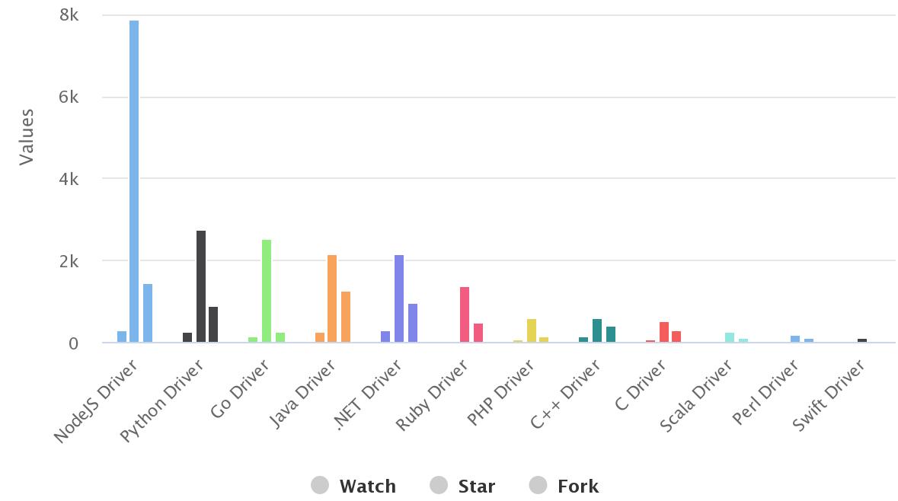

= MongoDB
:toc: manual

== MongoDB 使用的业务场景

MongoDB 是一个数据平台，存储着各种现代业务系统的数据，从业务底层编程语言的角读看，任何数据如果要存储到 MongoDB，必须通过连接驱动来实现，本部分从 MongoDB 驱动(连接器)的社区活跃度看 MongoDB 究竟使用在什么业务场景。

下图为 2019 年 3 月 MongoDB 社区统计的数据(link:etc/files/github-mongodb-trends.csv[mongodb-trends.csv])：

== MongoDB 助力 DevOps

MongoDB 如何助力 DevOps 实施落地，主要从三个层面去延展：

第一，MongoDB 在数字化时代独到的见解，技术的前瞻性和领先性，以及 MongoDB 公司的简单介绍；

第二，MongoDB 的灵活数据模型表达、默认水平扩展能力，云原生高可用等特点，与 DevOps 的敏捷思想，持续实验、协作反馈的文化，精益管理等核心内涵，具有天然匹配，MongoDB 为 DevOps 而生；

第三，MongoDB + DevOps 实现快速开发、快速集成、快速部署。

== TODO

// TODO

