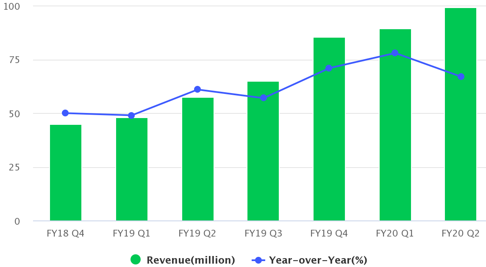

= MongoDB
:toc: manual

== 为什么 MongoDB

[cols="2,5a"]
|===
|Item |Message

|MongoDB
|
* 作为全球领先的现代通用数据平台，MongoDB 旨在帮助开发人员及其所构建的应用，充分发挥软件和数据的力量。 MongoDB 总部设在纽约，在全球 100 多个 国家拥有 15,000 余个客户。 MongoDB 数据平台已提供 7,000 多万次下载服 务、100 多万个 MongoDB 大学注册。在 Forrest Wave 2019 年第二季度资料库即服务象限中，MongoDB被评为领导者。2019 年，G2.com 发布的首份亚太地区25个最佳软件公司排名中，MongoDB 公司居首。更多资讯及 MongoDB 技术学习资源，请访问 www.mongodb.com。
* 大数据、AI、5G 为企业和组织带来了海量数据处理的需求，而传统关系型数据库将数据集中存储至单一节点的解决方案，在性能、可用性和运维成本这三方面已经难以满足这一需求，而 MongoDB 金鱼分布式架构，可以在普通硬件上运行很高的在性能、可用性和运维成本等方面解决了企业或组织处理海量数据的诉求。
* MongoDB 是一个新时代的成熟数据库产品，MongoDB 最大的优势是开发效率的显著提升和卓越的横向扩展能力。
* MongoDB 直接使用了程序员非常熟悉的类似对象模型的 JSON 数据结构，从而大幅度的简化了模式设计，ORM 层编码等 CRUD 操作的流程，实现同样的功能，使用关系数据库需求 2000 行代码，而使用 MongoDB 只需要使用 200 行代码

|事务
|
* 随着多文档ACID事务（multi-document ACID transactions）的推出，MongoDB 4.0是业界最好的数据建模数据库，能够充分满足无论是需求标准化还是嵌套的要求。

|Atlas
|
* MongoDB Atlas是完全托管数据库即服务产品，提供全局集群，可以智能地将文档存放在接近其使用点的分片中，或者确保数据符合数据主权规则。目前，MongoDB Atlas的服务水平协议（SLA）正常运行时间达到99.995%，处于业界领先水平。

|Stitch
|
* 作为无服务器应用程序平台MongoDB Stitch的一部分，MongoDB推出的数据库触发器Database triggers通过事件处理功能，可以实时响应数据的变化，并可与Twilio等外部服务集成，或提供像Kafka或Kinesis这样的数据流。

|Kubernetes
|
* Ops Manager的Kubernetes operator允许运营工程师使用自己喜欢的工具管理其基础架构，使MongoDB组件的管理成为容器化部署策略的无缝组成部分。

|数据中台
|
* 最近数据中台的概念是如火如荼，颇有7-8年前各种大数据平台带来的热闹。实际上在经历了几年的尝试后，大家发现开源大数据的技术栈及其复杂，学习曲线很长，适合的场景偏向于离线分析，真正能够实现的业务场景比较少。而数据中台则以业务驱动为导向，采用分布式实时数据库作为技术底座，通过汇聚，整合企业和机构的数据孤岛，将数据整理成即开即用的数据服务，为企业数据活用，鼓励创新提供了一个非常高效快速的数据平台。

|数据安全
|
* 在物联网、人工智能日趋成熟的今天，数据已经成为企业的核心资产，数据安全成为企业核心战略。MongoDB 是一个开源的，高性能、分布式、无模式（模式自由）、面向文档的数据库，深受业界欢迎，根据 MongoDB 社区统计数据显示，MongoDB 目前已有超过 600 万的下载量。开源在创新、灵活性等为大家带来便利的同时，由于开源开放透明的特点，开源软件的安全更需要重点关注。MongoDB 安全最佳实践从当前常见的一些安全威胁开始，进一步详细说明 MongoDB 企业版如何通过认证、授权、加密、审计四个方面打造企业级安全保障，确保 MongoDB 上数据安全、企业核心战略可靠。
|===

== 使用场景

MongoDB 是一个数据平台，存储着各种现代业务系统的数据，从业务底层编程语言的角读看，任何数据如果要存储到 MongoDB，必须通过连接驱动来实现，本部分从 MongoDB 驱动(连接器)的社区活跃度看 MongoDB 究竟使用在什么业务场景。

下图为 2019 年 5 月 MongoDB 社区统计的数据(link:etc/files/github-mongodb-trends.csv[mongodb-trends.csv])：

image:etc/img/mongodb-driver-github-tr.png[]

== Earnings Conference Call

* FY20 Q2 - https://www.fool.com/earnings/call-transcripts/2019/09/04/mongodb-inc-mdb-q2-2020-earnings-call-transcript.aspx
* FY20 Q1 - https://www.fool.com/earnings/call-transcripts/2019/06/05/mongodb-inc-mdb-q1-2020-earnings-call-transcript.aspx
* FY19 Q4 - https://www.fool.com/earnings/call-transcripts/2019/03/14/mongodb-inc-mdb-q4-2018-earnings-conference-call-t.aspx
* FY19 Q3 - https://www.fool.com/earnings/call-transcripts/2018/12/04/mongodb-inc-mdb-q3-2019-earnings-conference-call-t.aspx
* FY19 Q2 - https://investors.mongodb.com/news-releases/news-release-details/mongodb-inc-announces-second-quarter-fiscal-2019-financial
* FY19 Q1 - https://www.fool.com/earnings/call-transcripts/2018/06/07/mongodb-inc-mdb-q1-2019-earnings-conference-call-t.aspx
* FY18 Q4 - https://investors.mongodb.com/news-releases/news-release-details/mongodb-inc-announces-fourth-quarter-and-full-year-fiscal-2018

