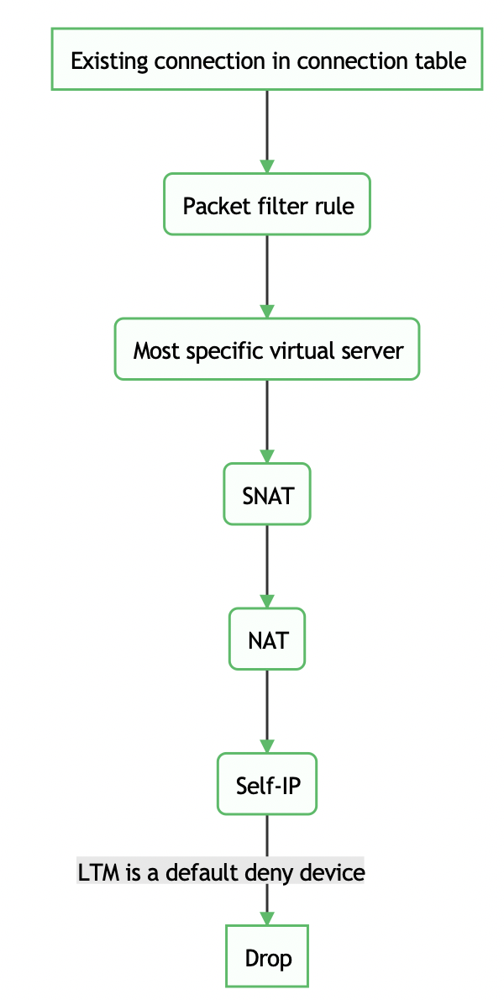
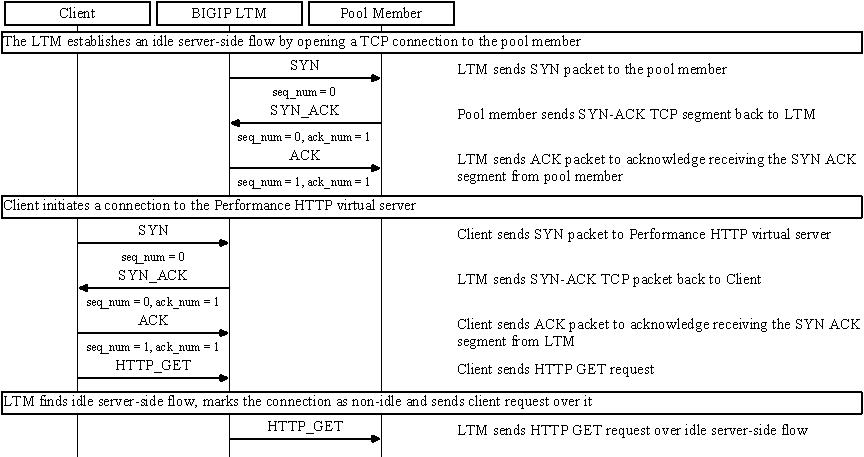
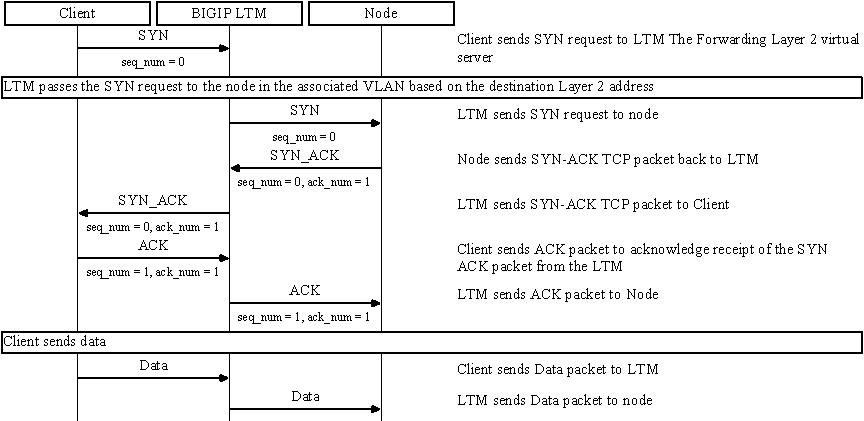

= Virtual Server
:toc: manual

== Inbound Traffic Handling

[cols="2,5a"]
|===
|Name |Description

|Self IPs
|使用 external self IP 可以访问管理界面（需要配置 Port Lockdown，允许 443 端口）。

[source, text]
.*查看外部 vlan Self IP*
----
# list net self 10.1.10.240 
net self 10.1.10.240 {
    address 10.1.10.240/24
    allow-service {
        tcp:ssh
        tcp:https
    }
    traffic-group traffic-group-local-only
    vlan external
}
----

*访问管理界面*

https://10.1.10.240

NOTE: 不建议使用业务流量接入的 external vlan 访问系统，推荐使用管理在安装初始化时创建的管理接口访问管理界面

[source, bash]
.*访问 ssh*
----
ssh root@10.1.10.240
----

|NAT
|将内网的地址直接映射到外网，处于监听模式，接收所有发往NAT地址的连接

[source, bash]
----
// create nat
create ltm nat custom_nat originating-address 10.1.20.13 translation-address 10.1.10.100

// make request
curl http://10.1.10.100/hello

// clean up
delete ltm nat custom_nat
----

* link:tdump/nat.tdump[nat.tdump]

|Virtual Servers
|
[source, bash]
----
// create VS
create ltm pool http_pool members add { 10.1.20.11:8081 { address 10.1.20.11 } 10.1.20.12:8081 { address 10.1.20.12 } }
create ltm virtual http_vs destination 10.1.10.20:80 ip-protocol tcp pool http_pool

// make request
curl http://10.1.10.20/hello

// Clean up
delete ltm virtual http_vs
delete ltm pool http_pool
----

* link:tdump/vs.tdump[vs.tdump]

|SNATs
|是将某一个 VLAN 上的请求转发到一个地址

[source, bash]
----
// vs is running
create ltm pool http_pool members add { 10.1.20.11:8081 { address 10.1.20.11 } 10.1.20.12:8081 { address 10.1.20.12 } }
create ltm virtual http_vs destination 10.1.10.20:80 ip-protocol tcp pool http_pool

// move 10.1.10.0 to 10.1.20.201
create ltm snat custom_snat origins add { 10.1.10.0/24 } translation 10.1.20.201

// make request
curl http://10.1.10.20/hello

// clean up
delete ltm virtual http_vs
delete ltm pool http_pool
delete ltm snat custom_snat
----

* link:tdump/snat.tdump[snat.tdump]

|===

== Packet Process Priority

== Virtual Server Priority

[cols="2,2,5a"]
|===
|Priority |Type |Config

|1 
|Specific IP address and specific port
|
[source, bash]
----
10.1.10.20:80
----

|2 
|Specific IP address and all port
|
[source, bash]
----
10.1.10.20:*
----

|3 
|Network IP address and specific port
|
[source, bash]
----
10.1.10.0:80
mask: 255.255.255.0
----

|4
|Network IP address and all port
|
[source, bash]
----
10.1.10.0:*
mask: 255.255.255.0
----

|5 
|All network and specific port
|
[source, bash]
----
0.0.0.0:80
mask: 0.0.0.0
----

|6 
|All network and adll port
|
[source, bash]
----
0.0.0.0:*
mask: 0.0.0.0
----
|===

== VS Type

本部分说明不同 VS 类型的使用场景及注意事项。本部分的内容（包括图片）参照 https://support.f5.com/csp/article/K8082（该文章可以从互联网上找到）。

=== Standard

* Standard 下客户端连接和服务器端连接是 1:1 的关系，基于全代理模式，客户端和服务器端的TCP连接完全独立
* 客户端和服务器端的 TCP 参数都是由 TMM 和双方分别协商
* 默认情况下以客户端源 IP 和后台建立连接，在打开 SNAT 的情况下用 SNAT 地址和后台建立连接
* Standard VS 的端口永远对外开放，无论后台是否有服务器在工作

Standard 模式下根据 VS 是否关联 L7 层协议，连接建立和数据流程稍有不同，详细如下：

==== Standard VS 数据流程（仅TCP profile）

image:img/vs-type-standard-tcp.jpeg[]

1. Client 和 LTM 三次握手建立 TCP 连接
2. LTM 选择一个 Pool Member
3. LTM 和 Pool Member 三次握手建立 TCP 连接
4. Client 开始发送数据

[source, bash]
.*示例*
----
// 1. create VS
create ltm pool echo_pool members add { 10.1.20.11:8877 { address 10.1.20.11 } 10.1.20.12:8877 { address 10.1.20.12 } } 
create ltm virtual echo_vs destination 10.1.10.27:8877 ip-protocol tcp pool echo_pool 

// 2. start the echo client, this will establish the tcp connection without send any data
./echoclient 10.1.10.27

// 3. check the connection tables
# show sys connection cs-server-addr 10.1.10.27
Sys::Connections
10.1.10.128:46262  10.1.10.27:8877  10.1.10.128:16587  10.1.20.11:8877  tcp  7  (tmm: 0)  none  none

// 4. check from the established connection from server(no data send)
# netstat -antulop | grep 8877 | grep ESTABLISHED
tcp        0      0 10.1.20.11:8877         10.1.10.128:16587       ESTABLISHED 4322/echoserver  off (0.00/0/0)

// 5. send data 
$ ./echoclient 10.1.10.27
time
1581765040
daytime
Sat Feb 15 03:13:32 2020
chargen
u$a71i0Rkk*1LkQ46d2Dqtau4Pn1cU;tZ8G'#Xsn_};-&)\<

// 6. exit the echo client, wait some time and check connection table 
# show sys connection cs-server-addr 10.1.10.27
Sys::Connections
10.1.10.1:51015  10.1.10.27:8877  10.1.10.1:29694  10.1.20.12:8877  tcp  3  (tmm: 0)  none  none

// 7. Clean up
delete ltm virtual echo_vs
delete ltm pool echo_pool 
----

* link:tdump/vs-standard-tcp.tdump[vs-standard-tcp.tdump]

==== Standard VS 数据流程（L7 profile）

image:img/vs-type-standard-http.jpeg[]

1. Client 和 LTM 三次握手建立 TCP 连接
2. LTM 等待 Client 端发送 7 层请求
3. Client 发送 HTTP GET 
4. LTM 选择一个 Pool Member
5. LTM 和 Pool Member 三次握手建立 TCP 连接
6. LTM 将 HTTP 请求转发给

NOTE: 和单纯的 TCP profile 关联的最大不同在于TMM必须等待到第一个客户端有效数据包之后才和后台服务器建立连接

[source, bash]
.*示例*
----
// 1. create vs
create ltm pool http_pool members add { 10.1.20.11:8081 { address 10.1.20.11 } 10.1.20.12:8081 { address 10.1.20.12 } }
create ltm virtual http_vs destination 10.1.10.20:80 ip-protocol tcp profiles add { http { } } pool http_pool 

// 2. send 3 http request without send do GET method
curl http://10.1.10.20/hello

// 3. Clean up
delete ltm virtual http_vs
delete ltm pool http_pool
----

* link:tdump/vs-standard-http.tdump[vs-standard-http.tdump]

=== Performance (Layer 4)

* TMM 只是负责客户端连接的分配和转发，不改变 TCP 连接中的任何参数，客户端和服务器自行协商 TCP 传输参数
* Performance L4 可以有 PVA 加入实现硬件加速
* Performance L4 VS上只有4层的iRules可以使用
* 默认状态下，新建连接的第一个包必须是Syn包，如果是其他的数据包比如ACK、RST等如果不在连接表中，则全部丢弃。
* 在 Fast L4 profile 打开 Loose close 和 Loose Initial 的时候对非Syn包也可以建立连接表

Performance L4 数据处理流程：

image:img/ltm-vs-type-performancel4.jpeg[]

1. Client 发送 SYN Packet 到 LTM 开始三次握手
2. LTM 基于 PVA ASIC 芯片评估是否要加速
3. LTM 发送 SYN Packet 到 Node
4. Node 返回 SYN-ACK 到 LTM
5. LTM 但会 SYN-ACK 到 Client
6. Client 发送 ACK 到 LTM
7. LTM 发送 ACK 到 Node
8. Client 发送数据  

[source, bash]
.*示例*
----
// 1. create VS
create ltm pool echo_pool members add { 10.1.20.11:8877 { address 10.1.20.11 } 10.1.20.12:8877 { address 10.1.20.12 } }
create ltm virtual echo_vs destination 10.1.10.27:8877 ip-protocol tcp pool echo_pool profiles add { fastL4 { } } 

// 2. start echoclient establish connection to VS without send data
./echoclient 10.1.10.27

//3. connection table
# show sys connection cs-server-addr 10.1.10.27
Sys::Connections
10.1.10.1:52241  10.1.10.27:8877  10.1.10.1:29818  10.1.20.11:8877  tcp  30  (tmm: 0)  none  none

// 4. check the tcpdump external vlan

// 6. analysis the step 4 and 5 (extract the timestamp)
  1>  03:40:36.711502 - Client send SYN to LTM
  2>  03:40:36.713498 - LTM send SYN to Node
  3>  03:40:36.714018 - Node response SYN/ACK to LTM
  4>  03:40:36.714035 - LTM response SYN/ACK to Client
  5>  03:40:36.714506 - Client send ACK to LTM
  6>  03:40:36.714713 - LTM send ACK to Node

// 5. Clean up
delete ltm virtual echo_vs 
delete ltm pool echo_pool 
----

* link:tdump/vs-performance-l4.tdump[vs-performance-l4.tdump]

=== Performance (HTTP)

Performance (HTTP) 和 Standard VS HTTP 最大的不同是 Client 的连接建立完，如果服务器端没有可重用的连接，则*不需要等待 Client 发送 GET 请求*，直接开始初始化服务器端的连接。

* Fast HTTP VS 仅用于 HTTP 协议
* 默认开启 One Connect Profile，对客户端连接进行聚合处理
* 默认开启 SNAT AutoMap，在服务器端收到的 TCP 连接请求都是来自于 TMM
* 没有会话保持功能，不能处理SSL，HTTPS

==== Fast HTTP VS数据流程-有空闲服务器连接

1. LTM 基于 OneConnect 参数进行初始服务器端连接，和 Pool Member 三次握手建立 TCP 连接
2. Client 和 LTM 三次握手建立 TCP 连接
3. Client 发送 HTTP GET
4. LTM 发送 GET 到 Pool Member

[source, bash]
.*示例*
----
// 1. create VS
create ltm profile fasthttp custome_fasthttp connpool-max-size 200 connpool-min-size 4
create ltm pool http_pool members add { 10.1.20.11:8081 { address 10.1.20.11 } 10.1.20.12:8081 { address 10.1.20.12 } }
create ltm virtual http_vs destination 10.1.10.20:80 ip-protocol tcp pool http_pool profiles add { custome_fasthttp { } } 

// 2. execute one time http request
java -jar target/http-clients-0.0.1-SNAPSHOT.jar http://10.1.10.20/hello 1

// 3. check the connection tables
# show sys connection ss-client-addr 10.1.20.240
Sys::Connections
any6.any  any6.any  10.1.20.240:61180  10.1.20.12:8081  tcp  17  (tmm: 0)  none  none
any6.any  any6.any  10.1.20.240:61182  10.1.20.11:8081  tcp  17  (tmm: 0)  none  none
any6.any  any6.any  10.1.20.240:61184  10.1.20.12:8081  tcp  17  (tmm: 0)  none  none
any6.any  any6.any  10.1.20.240:61179  10.1.20.11:8081  tcp  17  (tmm: 0)  none  none

// 4. execute 100 times http request
java -jar target/http-clients-0.0.1-SNAPSHOT.jar http://10.1.10.20/hello 100

// 5. check the connection table and count all connections
# tmsh show sys connection ss-client-addr 10.1.20.240
# tmsh show sys connection ss-client-addr 10.1.20.240 | wc -l
19

// 6. monitor the netwoek interface packets
tcpdump -nni external host 10.1.10.20
tcpdump -nni internal host 10.1.20.240

// 7. send 1 time http request
java -jar target/http-clients-0.0.1-SNAPSHOT.jar http://10.1.10.20/hello 1

// 8. check the packets dump(both client side and server side)
05:30:16.577514 IP 10.1.10.1.55332 > 10.1.10.20.80: Flags [SEW], seq 2683069984, win 65535, options [mss 1460,nop,wscale 6,nop,nop,TS val 772593605 ecr 0,sackOK,eol], length 0 in slot1/tmm1 lis=
05:30:16.577532 IP 10.1.10.20.80 > 10.1.10.1.55332: Flags [S.], seq 551188448, ack 2683069985, win 4380, options [mss 1460], length 0 out slot1/tmm1 lis=/Common/http_vs

05:30:16.588335 IP 10.1.20.240.15924 > 10.1.20.12.8081: Flags [P.], seq 1:97, ack 1, win 65535, length 96 out slot1/tmm1 lis=/Common/http_vs
05:30:16.589085 IP 10.1.20.12.8081 > 10.1.20.240.15924: Flags [.], ack 97, win 29200, length 0 in slot1/tmm1 lis=/Common/http_vs

// 9. Clean up
delete ltm virtual http_vs 
delete ltm profile fasthttp custome_fasthttp
delete sys connection ss-client-addr 10.1.20.240
----

==== Fast HTTP VS数据流程-没有空闲服务器连接

image:img/ltm-vs-type-performance-http-no-idle.jpeg[]
 
1. Client 和 LTM 三次握手建立 TCP 连接
2. LTM 和 Pool Member 三次握手建立 TCP 连接
3. Client 发送 HTTP GET
4. LTM 发送 GET 到 Pool Member

[source, bash]
.*示例*
----
// 1. create VS
create ltm pool http_pool members add { 10.1.20.11:8081 { address 10.1.20.11 } 10.1.20.12:8081 { address 10.1.20.12 } }
create ltm virtual http_vs destination 10.1.10.20:80 ip-protocol tcp pool http_pool profiles add { fasthttp { } }

// 2. monitor the netwoek interface packets
tcpdump -nni external host 10.1.10.20
tcpdump -nni internal host 10.1.20.240

// 3. execute 1 times http request
curl http://10.1.10.20/hello

// 4. check the packets dump(both client side and server side)
05:46:41.820787 IP 10.1.10.1.56323 > 10.1.10.20.80: Flags [SEW], seq 1528209739, win 65535, options [mss 1460,nop,wscale 6,nop,nop,TS val 773572344 ecr 0,sackOK,eol], length 0 in slot1/tmm1 lis=
05:46:41.820804 IP 10.1.10.20.80 > 10.1.10.1.56323: Flags [S.], seq 3531133963, ack 1528209740, win 4380, options [mss 1460], length 0 out slot1/tmm1 lis=/Common/http_vs
05:46:41.822479 IP 10.1.10.1.56323 > 10.1.10.20.80: Flags [.], ack 1, win 65535, length 0 in slot1/tmm1 lis=/Common/http_vs

05:46:41.824021 IP 10.1.20.240.16379 > 10.1.20.11.8081: Flags [S], seq 3636797178, win 4380, options [mss 1460], length 0 out slot1/tmm1 lis=/Common/http_vs
05:46:41.824567 IP 10.1.20.11.8081 > 10.1.20.240.16379: Flags [S.], seq 2294369112, ack 3636797179, win 29200, options [mss 1460], length 0 in slot1/tmm1 lis=/Common/http_vs
05:46:41.824580 IP 10.1.20.240.16379 > 10.1.20.11.8081: Flags [.], ack 1, win 4380, length 0 out slot1/tmm1 lis=/Common/http_vs

// 5. check the connection tables
# show sys connection ss-client-addr 10.1.20.240
Sys::Connections
any6.any  any6.any  10.1.20.240:16400  10.1.20.11:8081  tcp  3  (tmm: 1)  none  none

// 6. execute 100 times http request
for i in {1..100} ; do curl http://10.1.10.20/hello; done

// 7. check the connection table and count all connections
# tmsh show sys connection ss-client-addr 10.1.20.240
# tmsh show sys connection ss-client-addr 10.1.20.240 | wc -l
12

// 9. Clean up
delete ltm virtual http_vs 
delete sys connection ss-client-addr 10.1.20.240
----

=== Forwarding (Layer 2)

=== Forwarding (IP)

* 只能使用 Fast L4 Profile, 按照连接处理，类似于路由器工作，但不完全一样，在 Fast L4 Profile 中开启 Loose Initial 和 Loose Close 之后更为接近路由工作模式
* 所有穿过 Fowarding VS 的连接都将产生连接表
* 没有Pool Member，转发完全取决于本地路由
* 可以使用基于4层的Rules

Forwarding L3 VS 数据处理流程:

1. Client 开始三次握手，发送 SYN Packet 到 LTM
2. LTM 评估 Packet，找到目的地 IP 地址
3. LTM 发送 SYN 到对应的 Node
4. Node 返回 SYN/ACK 到 LTM
5. LTM 返回 SYN/ACK 到 Client
6. Client 发送 ACK 到 LTM（完成了三次握手）
7. LTM 发送 ACK 到 Node（服务器端也完成了三次握手）
8. Client 发送数据 Packet 到 LTM
9. LTM 转发对应 Packet 到 Node

[source, bash]
.*示例*
----
// 1. create vs
create ltm virtual forwarding_virtual destination 10.1.20.0:0 mask 255.255.255.0 ip-forward ip-protocol any

// 2. configure network make sure can access internal(Mac, add route)
sudo route -n add -net 10.1.20.0/24 10.1.10.240 
sudo route -n flush
netstat -nr | grep 10.1.20

// 3. monitor the network interface
tcpdump -nni internal host 10.1.20.13 

// 4. start echo client and send a request
$ ./echoclient 10.1.20.13
time
1581857485

// 5. check the packets
06:42:32.995112 IP 10.1.10.1.16867 > 10.1.20.13.8877: Flags [SEW], seq 2838415474, win 65535, options [mss 1460,nop,wscale 6,nop,nop,TS val 776899005 ecr 0,sackOK,eol], length 0 out slot1/tmm1 lis=/Common/forwarding_virtual
06:42:32.995675 IP 10.1.20.13.8877 > 10.1.10.1.16867: Flags [S.E], seq 829959214, ack 2838415475, win 28960, options [mss 1460,sackOK,TS val 6615604 ecr 776899005,nop,wscale 7], length 0 in slot1/tmm1 lis=/Common/forwarding_virtual
06:42:32.996057 IP 10.1.10.1.16867 > 10.1.20.13.8877: Flags [.], ack 1, win 2058, options [nop,nop,TS val 776899009 ecr 6615604], length 0 out slot1/tmm1 lis=/Common/forwarding_virtual
06:42:34.928735 IP 10.1.10.1.16867 > 10.1.20.13.8877: Flags [P.], seq 1:6, ack 1, win 2058, options [nop,nop,TS val 776900924 ecr 6615604], length 5 out slot1/tmm1 lis=/Common/forwarding_virtual
06:42:34.929484 IP 10.1.20.13.8877 > 10.1.10.1.16867: Flags [.], ack 6, win 227, options [nop,nop,TS val 6616087 ecr 776900924], length 0 in slot1/tmm1 lis=/Common/forwarding_virtual
06:42:34.929809 IP 10.1.20.13.8877 > 10.1.10.1.16867: Flags [P.], seq 1:12, ack 6, win 227, options [nop,nop,TS val 6616087 ecr 776900924], length 11 in slot1/tmm1 lis=/Common/forwarding_virtual
06:42:34.930049 IP 10.1.10.1.16867 > 10.1.20.13.8877: Flags [.], ack 12, win 2058, options [nop,nop,TS val 776900925 ecr 6616087], length 0 out slot1/tmm1 lis=/Common/forwarding_virtual

// 6. check the connection table
# show sys connection ss-server-addr 10.1.20.13
Sys::Connections
10.1.10.1:60894  10.1.20.13:8877  10.1.10.1:16867  10.1.20.13:8877  tcp  31  (tmm: 1)  none  none

// 7. clean up
delete ltm virtual forwarding_virtual 
----

=== Reject

类似 Forwarding L3 类型，Reject 是在接收到 Packet 后进行评估直接拒绝转发。

image:img/ltm-vs-type-reject.jpeg[]

1. Client 开始三次握手，发送 SYN Packet 到 LTM
2. LTM 关闭连接
3. LTM 发送 RST 到 Client

[source, bash]
.*示例*
----
create ltm virtual reject_ssh_virtual destination 10.1.20.0:22 mask 255.255.255.0 reject ip-protocol tcp
----

