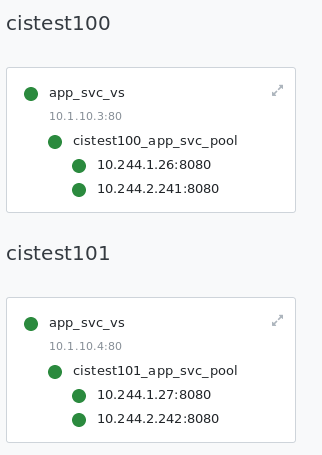

= F5 VE Restart

[source, bash]
.*1. CIS + AS3 Deploy 2 services*
----
kubectl create -f cis.yaml
kubectl apply -f deploy.yaml 
kubectl apply -f cm.yaml
----

The 2 services successed map to F5:

*2. Restart the F5 VE*

Check the VS and Pool, the status should be syn again.

[source, bash]
.*3. Expend the service from 2 pod to 4 pof*
----
kubectl apply -f deploy02.yaml 
----

The service  get updated to F5:

