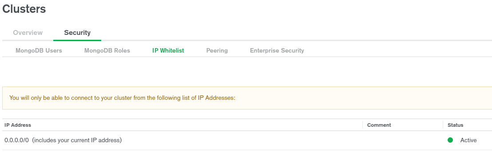
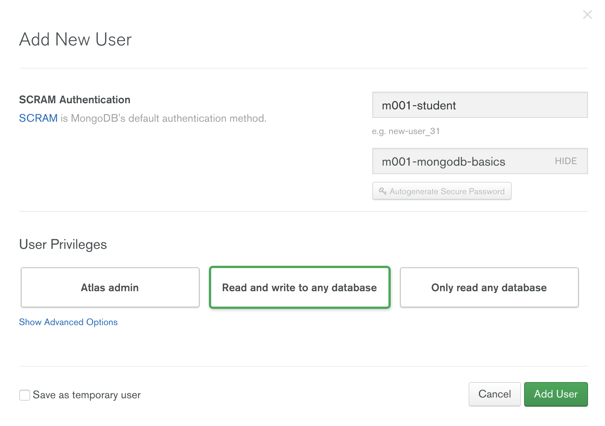
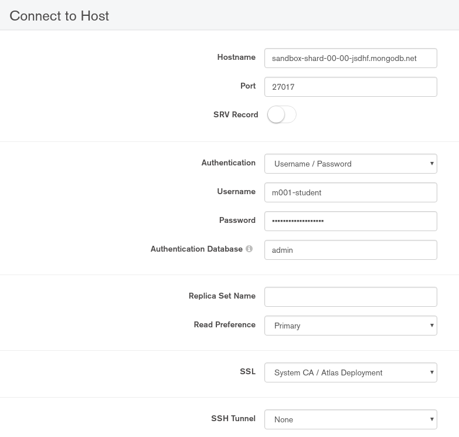
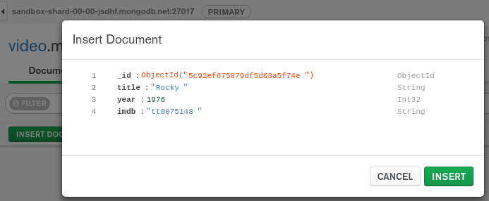

= MongoDB 基础
:toc: manual

== 软件安装

=== RHEL 7 上安装 mongodb-enterprise-server

* 访问 MongoDB Server 下载页面 https://www.mongodb.com/download-center/enterprise
* 选择对应的操作系统和软件版本，点击下载。

[source, text]
.*本地安装*
----
# yum localinstall mongodb-enterprise-server-4.0.6-1.el7.x86_64.rpm

...

Installed:
  mongodb-enterprise-server.x86_64 0:4.0.6-1.el7                                                                                                                                              

Dependency Installed:
  net-snmp.x86_64 1:5.7.2-37.el7                                                           net-snmp-agent-libs.x86_64 1:5.7.2-37.el7                                                          

Complete!
----

[source, text]
.*rpm -q -a - 查看全部已安装了的包*
----
# rpm -qa | grep "mongodb*"
mongodb-enterprise-server-4.0.6-1.el7.x86_64
----

[source, text]
.*列出安装引入的所有文件*
----
# rpm -q -l mongodb-enterprise-server
/etc/mongod.conf
/lib/systemd/system/mongod.service
/usr/bin/mongod
/usr/share/doc/mongodb-enterprise-server-4.0.6
/usr/share/doc/mongodb-enterprise-server-4.0.6/LICENSE-Enterprise.txt
/usr/share/doc/mongodb-enterprise-server-4.0.6/MONGOD-MIB.txt
/usr/share/doc/mongodb-enterprise-server-4.0.6/MONGODBINC-MIB.txt
/usr/share/doc/mongodb-enterprise-server-4.0.6/MPL-2
/usr/share/doc/mongodb-enterprise-server-4.0.6/README
/usr/share/doc/mongodb-enterprise-server-4.0.6/README-snmp.txt
/usr/share/doc/mongodb-enterprise-server-4.0.6/THIRD-PARTY-NOTICES
/usr/share/doc/mongodb-enterprise-server-4.0.6/mongod.conf.master
/usr/share/doc/mongodb-enterprise-server-4.0.6/mongod.conf.subagent
/usr/share/man/man1/mongod.1
/var/lib/mongo
/var/log/mongodb
/var/log/mongodb/mongod.log
/var/run/mongodb
----

=== RHEL 7 上安装 mongodb-enterprise-tools

* 访问 MongoDB Tools 下载页面 https://www.mongodb.com/download-center/enterprise
* 选择对应的操作系统和软件版本，点击下载。

[source, text]
.*本地安装*
----
# yum localinstall mongodb-enterprise-tools-4.0.6-1.el7.x86_64.rpm

...

Installed:
  mongodb-enterprise-tools.x86_64 0:4.0.6-1.el7                                                                                                                                               

Complete!
----

[source, text]
.*rpm -q -a - 查看全部已安装了的包*
----
# rpm -qa | grep "mongodb*"
mongodb-enterprise-server-4.0.6-1.el7.x86_64
mongodb-enterprise-tools-4.0.6-1.el7.x86_64
----

[source, text]
.*列出安装引入的所有文件*
----
# rpm -q -l mongodb-enterprise-tools
/usr/bin/bsondump
/usr/bin/install_compass
/usr/bin/mongodecrypt
/usr/bin/mongodump
/usr/bin/mongoexport
/usr/bin/mongofiles
/usr/bin/mongoimport
/usr/bin/mongoldap
/usr/bin/mongorestore
/usr/bin/mongostat
/usr/bin/mongotop
/usr/share/man/man1/bsondump.1
/usr/share/man/man1/mongodump.1
/usr/share/man/man1/mongoexport.1
/usr/share/man/man1/mongofiles.1
/usr/share/man/man1/mongoimport.1
/usr/share/man/man1/mongorestore.1
/usr/share/man/man1/mongostat.1
/usr/share/man/man1/mongotop.1
----

=== RHEL 7 上安装 mongodb-compass 

* 访问 MongoDB Compass 下载页面 https://www.mongodb.com/download-center/compass
* 选择对应的操作系统和软件版本，点击下载。

[source, text]
.*本地安装*
----
# yum localinstall mongodb-compass-1.17.0.x86_64.rpm

...

Installed:
  mongodb-compass.x86_64 0:1.17.0-1.el7                                                                                                                                                       

Complete!
----

[source, text]
.*rpm -q -a - 查看全部已安装了的包*
----
# rpm -qa | grep "mongodb-compass"
mongodb-compass-1.17.0-1.el7.x86_64
----

[source, text]
.*列出安装引入的所有文件*
----
# rpm -ql mongodb-compass
/usr/bin/mongodb-compass
/usr/share/applications/mongodb-compass.desktop
/usr/share/doc/mongodb-compass
/usr/share/doc/mongodb-compass/copyright
/usr/share/mongodb-compass
...
----

== Atlas 实践

=== 创建 Atlas Sandbox 集群

*1. 注册帐号*

访问 https://cloud.mongodb.com 页面，注册一个帐号。 

image:img/atlas_registration.png[]

*2. 账户注册完后，点击 `Build a Cluster` 创建一个集群*

*3. 选择 AWS 为云提供商，选择有 `Free Tier Available` 标记的地区*

image:img/cluster_provider.png[]

*4. 选择 M0 免费的 Cluster Tier*

*5. 设定集群的名称为 `Sandbox`*

*6. 在 `Sandbox` 集群页面，前往 Settings，设定 Project 的名称为 `M001`*

*7. 创建 IT 白名单*

在集群视图下，点击 `Security` -> `IP Whitelist`，点击 `Add IP Address` 按钮，选择 `Allow Access from Anywhere`。

*8. 创建用户*

点击 `MongoDB Users` -> `Add New User` 创建

* username: *m001-student*
* password: *m001-mongodb-basics*

选择 `Read and write to any database`，点击 `Add User` 完成创建用户。

=== Mongo Shell 连接 Atlas Sandbox 集群

*1. 在 Atlas Sandbox 集群界面，点击 `CONNECT` 按钮，选择 `Connect with the Mongo Shell` 选项*

image:img/atlas-connect-mongo-shell.png[]

*2. 在 Connect to Sandbox 页面选择 `I have the Mongo Shell installed`*

选择版本： `3.6 or later`，在 `Run your connection string in your command line` 部分，点击 `Copy` 按钮：

[source, text]
.*3. 将上面步骤拷贝的命令复制到命令行, 并添加 password 部分，如下*
----
$ mongo "mongodb+srv://sandbox-jsdhf.mongodb.net/test" --username m001-student --password m001-mongodb-basics
MongoDB shell version v4.0.6
MongoDB Enterprise Sandbox-shard-0:PRIMARY> 
----

=== Atlas Sandbox 集群中导入数据

*1. 准备数据*

Mongo Shell 是一款 JS 100% 兼容的客户端，可以通过 JS 文件准备数据，JS 里可以是一系列的批量数据，例如创建 `loadMovieDetailsDataset.js` 文件，内容如下

[source, text]
----
db = db.getSiblingDB("video");
db.movieDetails.drop();
db.movieDetails.insertMany([
{},{},{}
]);
----

[source, text]
.*2. 在和 JS 文件同一位置处 Mongo Shell 连接 Atlas Sandbox 集群*
----
$ mongo "mongodb+srv://sandbox-jsdhf.mongodb.net/test" --username m001-student --password m001-mongodb-basics
MongoDB shell version v4.0.6
MongoDB Enterprise Sandbox-shard-0:PRIMARY>
----

[source, text]
.*3. 执行 load 数据方法*
----
MongoDB Enterprise Sandbox-shard-0:PRIMARY> load("loadMovieDetailsDataset.js")
true
----

[source, text]
.*4. 查看创建的数据库名*
----
MongoDB Enterprise Sandbox-shard-0:PRIMARY> show dbs
admin  0.000GB
local  2.747GB
video  0.001GB
----

[source, text]
.*5. 查看 collections*
----
MongoDB Enterprise Sandbox-shard-0:PRIMARY> show collections
movieDetails
----

[source, text]
.*6. 查看文档总数*
----
MongoDB Enterprise Sandbox-shard-0:PRIMARY> db.movieDetails.count()
2295
----

=== Mongo Compass 连接 Atlas Sandbox 集群

*1. 选择主机名称*

在 Atlas Sandbox 集群界面，点击集群名称 `Sandbox`，在 Sandbox 界面点击 `PRIMARY` 节点：

image:img/atlas-sandbox-primary.png[]

*2. 拷贝主机名称*

在主机明细的界面上拷贝主机名称

image:img/atlas-sandbox-primary-host.png[]

例如：`sandbox-shard-00-00-jsdhf.mongodb.net`

[source, text]
.*3. 命令行执行*
----
$ mongodb-compass
----

*4. 在 Connect to Host 页面配制相应的值*

* Hostname: `sandbox-shard-00-00-jsdhf.mongodb.net`
* Port: `27017`
* Authentication: `Username/Password`
* Username: `m001-student`
* Password: `m001-mongodb-basics`

其它项使用默认值，点击 *CONNECT* 按钮

*5. 执行简单数据分析*

选择数据库 `video`，点击 collection `movieDetails`，在 `Schema` 栏点击 `ANALYZE` 按钮，查看数据分析结果

=== 单条数据插入

*1. 创建 Collection*

在 Compass 界面 `movie` 中，点击 `CREATE COLLECTION` 按钮，创建 `movieScratch` 

image:img/mongodb-compass-create-collection.png[]

*2. 插入一条数据*

点击新创建的 `movieScratch`，点击 `Documents` 栏，点击 `INSERT DOCUMENT`，在 `Insert Document` 界面插入数据，添加 `title`, `year`, `imdb`：

点击 `INSERT` 完成插入一条数据。

[source, text]
.*3. 从 Mongo Shell 插入一条数据*
----
MongoDB Enterprise Sandbox-shard-0:PRIMARY> db.movieScratch.insertOne({title: "Fire", year: 1992, imdb: "tt0084726"})
{
	"acknowledged" : true,
	"insertedId" : ObjectId("5c92f14660e022ecdc660669")
}
----

[source, text]
.*4. 查看插入的数据*
----
MongoDB Enterprise Sandbox-shard-0:PRIMARY> db.movieScratch.find()
{ "_id" : ObjectId("5c92ef675879df5d63a5f74e"), "title" : "Rocky", "year" : 1976, "imdb" : "tt0075148" }
{ "_id" : ObjectId("5c92f08d5879df5d63a5f74f"), "title" : "Creed", "year" : 2015, "imdb" : "tt30766" }
{ "_id" : ObjectId("5c92f14660e022ecdc660669"), "title" : "Fire", "year" : 1992, "imdb" : "tt0084726" }
----

=== 多条数据插入 

[source, text]
.*1. 默认多条数据插入是按照顺序执行的，如果执行出错，跳过插入后面的数据*
----
MongoDB Enterprise Sandbox-shard-0:PRIMARY> db.movieScratch.insertMany(
...     [
...         {
...       "_id" : "tt0084726",
...       "title" : "Star Trek II: The Wrath of Khan",
...       "year" : 1982,
...       "type" : "movie"
...           },
...           {
...       "_id" : "tt0796366",
...       "title" : "Star Trek",
...       "year" : 2009,
...       "type" : "movie"
...           },
...           {
...       "_id" : "tt0084726",
...       "title" : "Star Trek II: The Wrath of Khan",
...       "year" : 1982,
...       "type" : "movie"
...           },
...           {
...       "_id" : "tt1408101",
...       "title" : "Star Trek Into Darkness",
...       "year" : 2013,
...       "type" : "movie"
...           },
...           {
...       "_id" : "tt0117731",
...       "title" : "Star Trek: First Contact",
...       "year" : 1996,
...       "type" : "movie"
...         }
...     ]
... );
2019-03-21T10:25:58.388+0800 E QUERY    [js] BulkWriteError: write error at item 2 in bulk operation :
BulkWriteError({
	"writeErrors" : [
		{
			"index" : 2,
			"code" : 11000,
			"errmsg" : "E11000 duplicate key error collection: video.movieScratch index: _id_ dup key: { : \"tt0084726\" }",
			"op" : {
				"_id" : "tt0084726",
				"title" : "Star Trek II: The Wrath of Khan",
				"year" : 1982,
				"type" : "movie"
			}
		}
	],
	"writeConcernErrors" : [ ],
	"nInserted" : 2,
	"nUpserted" : 0,
	"nMatched" : 0,
	"nModified" : 0,
	"nRemoved" : 0,
	"upserted" : [ ]
})
----

可以看到顺序插入第三条数据时因为 _id 唯一性冲突导致插入失败。

[source, text]
.*2. 查看插入的数据*
----
MongoDB Enterprise Sandbox-shard-0:PRIMARY> db.movieScratch.find()
{ "_id" : "tt0084726", "title" : "Star Trek II: The Wrath of Khan", "year" : 1982, "type" : "movie" }
{ "_id" : "tt0796366", "title" : "Star Trek", "year" : 2009, "type" : "movie" }
----

[source, text]
.*3. 设定 order 为 false 可以指定插入不是按顺序执行，插入是如果遇到错误，会跳过错误继续执行插入*
----
MongoDB Enterprise Sandbox-shard-0:PRIMARY> db.movieScratch.insertMany(
...     [
...         {
...     "_id" : "tt0084726",
...     "title" : "Star Trek II: The Wrath of Khan",
...     "year" : 1982,
...     "type" : "movie"
...         },
...         {
...     "_id" : "tt0796366",
...     "title" : "Star Trek",
...     "year" : 2009,
...     "type" : "movie"
...         },
...         {
...     "_id" : "tt0084726",
...     "title" : "Star Trek II: The Wrath of Khan",
...     "year" : 1982,
...     "type" : "movie"
...         },
...         {
...     "_id" : "tt1408101",
...     "title" : "Star Trek Into Darkness",
...     "year" : 2013,
...     "type" : "movie"
...         },
...         {
...     "_id" : "tt0117731",
...     "title" : "Star Trek: First Contact",
...     "year" : 1996,
...     "type" : "movie"
...         }
...     ],
...     {
...         "ordered": false 
...     }
... );
2019-03-21T10:28:21.868+0800 E QUERY    [js] BulkWriteError: 3 write errors in bulk operation :
BulkWriteError({
	"writeErrors" : [
		{
			"index" : 0,
			"code" : 11000,
			"errmsg" : "E11000 duplicate key error collection: video.movieScratch index: _id_ dup key: { : \"tt0084726\" }",
			"op" : {
				"_id" : "tt0084726",
				"title" : "Star Trek II: The Wrath of Khan",
				"year" : 1982,
				"type" : "movie"
			}
		},
		{
			"index" : 1,
			"code" : 11000,
			"errmsg" : "E11000 duplicate key error collection: video.movieScratch index: _id_ dup key: { : \"tt0796366\" }",
			"op" : {
				"_id" : "tt0796366",
				"title" : "Star Trek",
				"year" : 2009,
				"type" : "movie"
			}
		},
		{
			"index" : 2,
			"code" : 11000,
			"errmsg" : "E11000 duplicate key error collection: video.movieScratch index: _id_ dup key: { : \"tt0084726\" }",
			"op" : {
				"_id" : "tt0084726",
				"title" : "Star Trek II: The Wrath of Khan",
				"year" : 1982,
				"type" : "movie"
			}
		}
	],
	"writeConcernErrors" : [ ],
	"nInserted" : 2,
	"nUpserted" : 0,
	"nMatched" : 0,
	"nModified" : 0,
	"nRemoved" : 0,
	"upserted" : [ ]
})
----

可以看到，批量插入的前三条数据都遇到了 _id 唯一性冲突导致失败的问题，但继续插入了第四和第五条数据。

[source, text]
.*4. 查看插入的数据*
----
MongoDB Enterprise Sandbox-shard-0:PRIMARY> db.movieScratch.find()
{ "_id" : "tt0084726", "title" : "Star Trek II: The Wrath of Khan", "year" : 1982, "type" : "movie" }
{ "_id" : "tt0796366", "title" : "Star Trek", "year" : 2009, "type" : "movie" }
{ "_id" : "tt1408101", "title" : "Star Trek Into Darkness", "year" : 2013, "type" : "movie" }
{ "_id" : "tt0117731", "title" : "Star Trek: First Contact", "year" : 1996, "type" : "movie" }
----

=== 文档查询

[source, text]
.*1. 同时满足两次获奖，两次提名的电影，并统计个数*
----
MongoDB Enterprise Sandbox-shard-0:PRIMARY> db.movieDetails.find({"awards.wins": 2, "awards.nominations": 2}).count()
12
----

[source, text]
.*2. 同时满足标记为 PG，10 此获得提名，并统计个数*
----
MongoDB Enterprise Sandbox-shard-0:PRIMARY> db.movieDetails.find({"rated": "PG", "awards.nominations": 10}).count()
3
----

[source, text]
.*3. 同时满足电影的作者包括两个人 Ethan Coen 和 Joel Coen，并统计个数*
----
MongoDB Enterprise Sandbox-shard-0:PRIMARY> db.movieDetails.find({"writers": ["Ethan Coen", "Joel Coen"]}).count()
1
----

[source, text]
.*4. 查看 genres 中包含 Family 的电影，并统计个数*
----
MongoDB Enterprise Sandbox-shard-0:PRIMARY> db.movieDetails.find({"genres": "Family"}).count()
124
----

[source, text]
.*5. 查看 genres 中第 2 项为 Western 的电影，并统计个数*
----
MongoDB Enterprise Sandbox-shard-0:PRIMARY> db.movieDetails.find({"genres.1": "Western"}).count()
14
----

[source, text]
.*6. 输出电影的名称，出版年份，导演名称，不输出 ID*
----
MongoDB Enterprise Sandbox-shard-0:PRIMARY> db.movieDetails.find({"genres": "Family"}, {title: 1, year: 1, director: 1, _id: 0})
{ "title" : "An American Tail: Fievel Goes West", "year" : 1991, "director" : "Phil Nibbelink, Simon Wells" }
{ "title" : "Lost in Space", "year" : 1998, "director" : "Stephen Hopkins" }
{ "title" : "Muppets from Space", "year" : 1999, "director" : "Tim Hill" }
{ "title" : "The Many Adventures of Winnie the Pooh", "year" : 1977, "director" : "John Lounsbery, Wolfgang Reitherman" }
{ "title" : "The Adventures of Sharkboy and Lavagirl 3-D", "year" : 2005, "director" : "Robert Rodriguez" }
{ "title" : "The Greatest Show on Earth", "year" : 1952, "director" : "Cecil B. DeMille" }
{ "title" : "Show Boat", "year" : 1951, "director" : "George Sidney" }
{ "title" : "Treasure Planet", "year" : 2002, "director" : "Ron Clements, John Musker" }
{ "title" : "Forbidden Planet", "year" : 1956, "director" : "Fred M. Wilcox" }
{ "title" : "The Karate Kid", "year" : 1984, "director" : "John G. Avildsen" }
{ "title" : "The Karate Kid", "year" : 2010, "director" : "Harald Zwart" }
{ "title" : "The Kid", "year" : 1921, "director" : "Charles Chaplin" }
{ "title" : "The Karate Kid, Part II", "year" : 1986, "director" : "John G. Avildsen" }
...
----

=== 文档更新

[source, text]
.*1. TODO*
----

----

=== 文档删除

[source, text]
.*1. 准备数据，创建 loadReviewsDataset.js 文件，内容如下*
----
db = db.getSiblingDB("video");
db.reviews.drop();
db.reviews.insertMany([
...
---

[source, text]
.*2. 导入数据*
----
$ mongo "mongodb+srv://sandbox-jsdhf.mongodb.net/video" --username m001-student --password m001-mongodb-basics loadReviewsDataset.js
----

[source, text]
.*3. 查看导入的数据*
----
MongoDB Enterprise Sandbox-shard-0:PRIMARY> use video
switched to db video

MongoDB Enterprise Sandbox-shard-0:PRIMARY> db.reviews.find().count()
20
----

[source, text]
.*4. 根据 ID 删除*
----
MongoDB Enterprise Sandbox-shard-0:PRIMARY> db.reviews.deleteOne({_id: ObjectId("5c930f3cea4690b776113acd")})
{ "acknowledged" : true, "deletedCount" : 1 }
----

[source, text]
.*5. 删除多个文档*
----
MongoDB Enterprise Sandbox-shard-0:PRIMARY> db.reviews.deleteMany({reviewer_id: 759723314})
{ "acknowledged" : true, "deletedCount" : 3 }
----

[source, text]
.*6. 查看剩余文档总数*
----
MongoDB Enterprise Sandbox-shard-0:PRIMARY> db.reviews.find().count()
16
----

