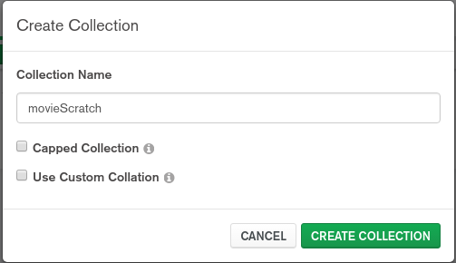

= MongoDB 基础
:toc: manual

== 软件安装

=== RHEL 7 上安装 mongodb-enterprise-server

* 访问 MongoDB Server 下载页面 https://www.mongodb.com/download-center/enterprise
* 选择对应的操作系统和软件版本，点击下载。

[source, text]
.*本地安装*
----
# yum localinstall mongodb-enterprise-server-4.0.6-1.el7.x86_64.rpm

...

Installed:
  mongodb-enterprise-server.x86_64 0:4.0.6-1.el7                                                                                                                                              

Dependency Installed:
  net-snmp.x86_64 1:5.7.2-37.el7                                                           net-snmp-agent-libs.x86_64 1:5.7.2-37.el7                                                          

Complete!
----

[source, text]
.*rpm -q -a - 查看全部已安装了的包*
----
# rpm -qa | grep "mongodb*"
mongodb-enterprise-server-4.0.6-1.el7.x86_64
----

[source, text]
.*列出安装引入的所有文件*
----
# rpm -q -l mongodb-enterprise-server
/etc/mongod.conf
/lib/systemd/system/mongod.service
/usr/bin/mongod
/usr/share/doc/mongodb-enterprise-server-4.0.6
/usr/share/doc/mongodb-enterprise-server-4.0.6/LICENSE-Enterprise.txt
/usr/share/doc/mongodb-enterprise-server-4.0.6/MONGOD-MIB.txt
/usr/share/doc/mongodb-enterprise-server-4.0.6/MONGODBINC-MIB.txt
/usr/share/doc/mongodb-enterprise-server-4.0.6/MPL-2
/usr/share/doc/mongodb-enterprise-server-4.0.6/README
/usr/share/doc/mongodb-enterprise-server-4.0.6/README-snmp.txt
/usr/share/doc/mongodb-enterprise-server-4.0.6/THIRD-PARTY-NOTICES
/usr/share/doc/mongodb-enterprise-server-4.0.6/mongod.conf.master
/usr/share/doc/mongodb-enterprise-server-4.0.6/mongod.conf.subagent
/usr/share/man/man1/mongod.1
/var/lib/mongo
/var/log/mongodb
/var/log/mongodb/mongod.log
/var/run/mongodb
----

=== RHEL 7 上安装 mongodb-enterprise-tools

* 访问 MongoDB Tools 下载页面 https://www.mongodb.com/download-center/enterprise
* 选择对应的操作系统和软件版本，点击下载。

[source, text]
.*本地安装*
----
# yum localinstall mongodb-enterprise-tools-4.0.6-1.el7.x86_64.rpm

...

Installed:
  mongodb-enterprise-tools.x86_64 0:4.0.6-1.el7                                                                                                                                               

Complete!
----

[source, text]
.*rpm -q -a - 查看全部已安装了的包*
----
# rpm -qa | grep "mongodb*"
mongodb-enterprise-server-4.0.6-1.el7.x86_64
mongodb-enterprise-tools-4.0.6-1.el7.x86_64
----

[source, text]
.*列出安装引入的所有文件*
----
# rpm -q -l mongodb-enterprise-tools
/usr/bin/bsondump
/usr/bin/install_compass
/usr/bin/mongodecrypt
/usr/bin/mongodump
/usr/bin/mongoexport
/usr/bin/mongofiles
/usr/bin/mongoimport
/usr/bin/mongoldap
/usr/bin/mongorestore
/usr/bin/mongostat
/usr/bin/mongotop
/usr/share/man/man1/bsondump.1
/usr/share/man/man1/mongodump.1
/usr/share/man/man1/mongoexport.1
/usr/share/man/man1/mongofiles.1
/usr/share/man/man1/mongoimport.1
/usr/share/man/man1/mongorestore.1
/usr/share/man/man1/mongostat.1
/usr/share/man/man1/mongotop.1
----

=== RHEL 7 上安装 mongodb-compass 

* 访问 MongoDB Compass 下载页面 https://www.mongodb.com/download-center/compass
* 选择对应的操作系统和软件版本，点击下载。

[source, text]
.*本地安装*
----
# yum localinstall mongodb-compass-1.17.0.x86_64.rpm

...

Installed:
  mongodb-compass.x86_64 0:1.17.0-1.el7                                                                                                                                                       

Complete!
----

[source, text]
.*rpm -q -a - 查看全部已安装了的包*
----
# rpm -qa | grep "mongodb-compass"
mongodb-compass-1.17.0-1.el7.x86_64
----

[source, text]
.*列出安装引入的所有文件*
----
# rpm -ql mongodb-compass
/usr/bin/mongodb-compass
/usr/share/applications/mongodb-compass.desktop
/usr/share/doc/mongodb-compass
/usr/share/doc/mongodb-compass/copyright
/usr/share/mongodb-compass
...
----

=== Mac Pro 上安装 mongodb-enterprise-server

* 访问 MongoDB Server 下载页面 https://www.mongodb.com/download-center/enterprise
* 选择对应的操作系统和软件版本，点击下载。

[source, text]
.*本地安装*
----
$ tar -xvf mongodb-osx-x86_64-enterprise-4.0.7.tgz
----

[source, text] 
.*创建~/.bash_profile 文件，内容如下*
----
export PATH="~/work/mongo/mongodb-osx-x86_64-enterprise-4.0.7/bin:$PATH"
----

=== Mac Pro 上安装 mongodb-compass

* 访问 MongoDB Compass 下载页面 https://www.mongodb.com/download-center/compass
* 选择对应的操作系统和软件版本，点击下载。

[source, text]
.*本地安装*
----
$ sudo hdiutil attach mongodb-compass-1.17.0-darwin-x64.dmg
$ sudo cp -R /Volumes/MongoDB\ Compass/MongoDB\ Compass.app ~/Applications/
$ sudo hdiutil unmount /Volumes/MongoDB\ Compass/
----

== Atlas 实践

=== 创建 Atlas Sandbox 集群

*1. 注册帐号*

访问 https://cloud.mongodb.com 页面，注册一个帐号。 

image:img/atlas_registration.png[]

*2. 账户注册完后，点击 `Build a Cluster` 创建一个集群*

*3. 选择 AWS 为云提供商，选择有 `Free Tier Available` 标记的地区*

image:img/cluster_provider.png[]

*4. 选择 M0 免费的 Cluster Tier*

image:img/cluster_tier.png[]

*5. 设定集群的名称为 `Sandbox`*

*6. 在 `Sandbox` 集群页面，前往 Settings，设定 Project 的名称为 `M001`*

*7. 创建 IT 白名单*

在集群视图下，点击 `Security` -> `IP Whitelist`，点击 `Add IP Address` 按钮，选择 `Allow Access from Anywhere`。

image:img/atlas-cluster-while-list.png[]

*8. 创建用户*

点击 `MongoDB Users` -> `Add New User` 创建

* username: *m001-student*
* password: *m001-mongodb-basics*

选择 `Read and write to any database`，点击 `Add User` 完成创建用户。

image:img/m001_user.png[]

=== Mongo Shell 连接 Atlas Sandbox 集群

*1. 在 Atlas Sandbox 集群界面，点击 `CONNECT` 按钮，选择 `Connect with the Mongo Shell` 选项*

image:img/atlas-connect-mongo-shell.png[]

*2. 在 Connect to Sandbox 页面选择 `I have the Mongo Shell installed`*

选择版本： `3.6 or later`，在 `Run your connection string in your command line` 部分，点击 `Copy` 按钮：

image:img/atlas-sandbox-shell-copy.png[]

[source, text]
.*3. 将上面步骤拷贝的命令复制到命令行, 并添加 password 部分，如下*
----
$ mongo "mongodb+srv://sandbox-jsdhf.mongodb.net/test" --username m001-student --password m001-mongodb-basics
MongoDB shell version v4.0.6
MongoDB Enterprise Sandbox-shard-0:PRIMARY> 
----

=== Atlas Sandbox 集群中导入数据

*1. 准备数据*

Mongo Shell 是一款 JS 100% 兼容的客户端，可以通过 JS 文件准备数据，JS 里可以是一系列的批量数据，例如创建 `loadMovieDetailsDataset.js` 文件，内容如下

[source, text]
----
db = db.getSiblingDB("video");
db.movieDetails.drop();
db.movieDetails.insertMany([
{},{},{}
]);
----

[source, text]
.*2. 在和 JS 文件同一位置处 Mongo Shell 连接 Atlas Sandbox 集群*
----
$ mongo "mongodb+srv://sandbox-jsdhf.mongodb.net/test" --username m001-student --password m001-mongodb-basics
MongoDB shell version v4.0.6
MongoDB Enterprise Sandbox-shard-0:PRIMARY>
----

[source, text]
.*3. 执行 load 数据方法*
----
MongoDB Enterprise Sandbox-shard-0:PRIMARY> load("loadMovieDetailsDataset.js")
true
----

[source, text]
.*4. 查看创建的数据库名*
----
MongoDB Enterprise Sandbox-shard-0:PRIMARY> show dbs
admin  0.000GB
local  2.747GB
video  0.001GB
----

[source, text]
.*5. 查看 collections*
----
MongoDB Enterprise Sandbox-shard-0:PRIMARY> show collections
movieDetails
----

[source, text]
.*6. 查看文档总数*
----
MongoDB Enterprise Sandbox-shard-0:PRIMARY> db.movieDetails.count()
2295
----

=== Mongo Compass 连接 Atlas Sandbox 集群

*1. 选择主机名称*

在 Atlas Sandbox 集群界面，点击集群名称 `Sandbox`，在 Sandbox 界面点击 `PRIMARY` 节点：

image:img/atlas-sandbox-primary.png[]

*2. 拷贝主机名称*

在主机明细的界面上拷贝主机名称

image:img/atlas-sandbox-primary-host.png[]

例如：`sandbox-shard-00-00-jsdhf.mongodb.net`

[source, text]
.*3. 命令行执行*
----
$ mongodb-compass
----

*4. 在 Connect to Host 页面配制相应的值*

* Hostname: `sandbox-shard-00-00-jsdhf.mongodb.net`
* Port: `27017`
* Authentication: `Username/Password`
* Username: `m001-student`
* Password: `m001-mongodb-basics`

其它项使用默认值，点击 *CONNECT* 按钮

image:img/mongodb-compass-connect.png[]

*5. 执行简单数据分析*

选择数据库 `video`，点击 collection `movieDetails`，在 `Schema` 栏点击 `ANALYZE` 按钮，查看数据分析结果

image:img/mongodb-compass-analyze.png[]

=== 文档插入

*1. 创建 Collection*

在 Compass 界面 `movie` 中，点击 `CREATE COLLECTION` 按钮，创建 `movieScratch` 

*2. 插入一条数据*

点击新创建的 `movieScratch`，点击 `Documents` 栏，点击 `INSERT DOCUMENT`，在 `Insert Document` 界面插入数据，添加 `title`, `year`, `imdb`：

image:img/mongodb-compass-insert-document.png[]

点击 `INSERT` 完成插入一条数据。

[source, text]
.*3. 从 Mongo Shell 插入一条数据*
----
MongoDB Enterprise Sandbox-shard-0:PRIMARY> db.movieScratch.insertOne({title: "Fire", year: 1992, imdb: "tt0084726"})
{
	"acknowledged" : true,
	"insertedId" : ObjectId("5c92f14660e022ecdc660669")
}
----

[source, text]
.*4. 查看插入的数据*
----
MongoDB Enterprise Sandbox-shard-0:PRIMARY> db.movieScratch.find()
{ "_id" : ObjectId("5c92ef675879df5d63a5f74e"), "title" : "Rocky", "year" : 1976, "imdb" : "tt0075148" }
{ "_id" : ObjectId("5c92f08d5879df5d63a5f74f"), "title" : "Creed", "year" : 2015, "imdb" : "tt30766" }
{ "_id" : ObjectId("5c92f14660e022ecdc660669"), "title" : "Fire", "year" : 1992, "imdb" : "tt0084726" }
----

[source, text]
.*5. 默认多条数据插入是按照顺序执行的，如果执行出错，跳过插入后面的数据*
----
MongoDB Enterprise Sandbox-shard-0:PRIMARY> db.movieScratch.insertMany(
     [
         {
       "_id" : "tt0084726",
       "title" : "Star Trek II: The Wrath of Khan",
       "year" : 1982,
       "type" : "movie"
           },
           {
       "_id" : "tt0796366",
       "title" : "Star Trek",
       "year" : 2009,
       "type" : "movie"
           },
           {
       "_id" : "tt0084726",
       "title" : "Star Trek II: The Wrath of Khan",
       "year" : 1982,
       "type" : "movie"
           },
           {
       "_id" : "tt1408101",
       "title" : "Star Trek Into Darkness",
       "year" : 2013,
       "type" : "movie"
           },
           {
       "_id" : "tt0117731",
       "title" : "Star Trek: First Contact",
       "year" : 1996,
       "type" : "movie"
         }
     ]
 );
2019-03-21T10:25:58.388+0800 E QUERY    [js] BulkWriteError: write error at item 2 in bulk operation :
BulkWriteError({
	"writeErrors" : [
		{
			"index" : 2,
			"code" : 11000,
			"errmsg" : "E11000 duplicate key error collection: video.movieScratch index: _id_ dup key: { : \"tt0084726\" }",
			"op" : {
				"_id" : "tt0084726",
				"title" : "Star Trek II: The Wrath of Khan",
				"year" : 1982,
				"type" : "movie"
			}
		}
	],
	"writeConcernErrors" : [ ],
	"nInserted" : 2,
	"nUpserted" : 0,
	"nMatched" : 0,
	"nModified" : 0,
	"nRemoved" : 0,
	"upserted" : [ ]
})
----

可以看到顺序插入第三条数据时因为 _id 唯一性冲突导致插入失败。

[source, text]
.*6. 查看插入的数据*
----
MongoDB Enterprise Sandbox-shard-0:PRIMARY> db.movieScratch.find()
{ "_id" : "tt0084726", "title" : "Star Trek II: The Wrath of Khan", "year" : 1982, "type" : "movie" }
{ "_id" : "tt0796366", "title" : "Star Trek", "year" : 2009, "type" : "movie" }
----

[source, text]
.*7. 设定 order 为 false 可以指定插入不是按顺序执行，插入是如果遇到错误，会跳过错误继续执行插入*
----
MongoDB Enterprise Sandbox-shard-0:PRIMARY> db.movieScratch.insertMany(
     [
         {
     "_id" : "tt0084726",
     "title" : "Star Trek II: The Wrath of Khan",
     "year" : 1982,
     "type" : "movie"
         },
         {
     "_id" : "tt0796366",
     "title" : "Star Trek",
     "year" : 2009,
     "type" : "movie"
         },
         {
     "_id" : "tt0084726",
     "title" : "Star Trek II: The Wrath of Khan",
     "year" : 1982,
     "type" : "movie"
         },
         {
     "_id" : "tt1408101",
     "title" : "Star Trek Into Darkness",
     "year" : 2013,
     "type" : "movie"
         },
         {
     "_id" : "tt0117731",
     "title" : "Star Trek: First Contact",
     "year" : 1996,
     "type" : "movie"
         }
     ],
     {
         "ordered": false 
     }
 );
2019-03-21T10:28:21.868+0800 E QUERY    [js] BulkWriteError: 3 write errors in bulk operation :
BulkWriteError({
	"writeErrors" : [
		{
			"index" : 0,
			"code" : 11000,
			"errmsg" : "E11000 duplicate key error collection: video.movieScratch index: _id_ dup key: { : \"tt0084726\" }",
			"op" : {
				"_id" : "tt0084726",
				"title" : "Star Trek II: The Wrath of Khan",
				"year" : 1982,
				"type" : "movie"
			}
		},
		{
			"index" : 1,
			"code" : 11000,
			"errmsg" : "E11000 duplicate key error collection: video.movieScratch index: _id_ dup key: { : \"tt0796366\" }",
			"op" : {
				"_id" : "tt0796366",
				"title" : "Star Trek",
				"year" : 2009,
				"type" : "movie"
			}
		},
		{
			"index" : 2,
			"code" : 11000,
			"errmsg" : "E11000 duplicate key error collection: video.movieScratch index: _id_ dup key: { : \"tt0084726\" }",
			"op" : {
				"_id" : "tt0084726",
				"title" : "Star Trek II: The Wrath of Khan",
				"year" : 1982,
				"type" : "movie"
			}
		}
	],
	"writeConcernErrors" : [ ],
	"nInserted" : 2,
	"nUpserted" : 0,
	"nMatched" : 0,
	"nModified" : 0,
	"nRemoved" : 0,
	"upserted" : [ ]
})
----

可以看到，批量插入的前三条数据都遇到了 _id 唯一性冲突导致失败的问题，但继续插入了第四和第五条数据。

[source, text]
.*8. 查看插入的数据*
----
MongoDB Enterprise Sandbox-shard-0:PRIMARY> db.movieScratch.find()
{ "_id" : "tt0084726", "title" : "Star Trek II: The Wrath of Khan", "year" : 1982, "type" : "movie" }
{ "_id" : "tt0796366", "title" : "Star Trek", "year" : 2009, "type" : "movie" }
{ "_id" : "tt1408101", "title" : "Star Trek Into Darkness", "year" : 2013, "type" : "movie" }
{ "_id" : "tt0117731", "title" : "Star Trek: First Contact", "year" : 1996, "type" : "movie" }
----

=== 文档查询

[source, text]
.*1. 同时满足两次获奖，两次提名的电影，并统计个数*
----
MongoDB Enterprise Sandbox-shard-0:PRIMARY> db.movieDetails.find({"awards.wins": 2, "awards.nominations": 2}).count()
12
----

[source, text]
.*2. 同时满足标记为 PG，10 此获得提名，并统计个数*
----
MongoDB Enterprise Sandbox-shard-0:PRIMARY> db.movieDetails.find({"rated": "PG", "awards.nominations": 10}).count()
3
----

[source, text]
.*3. 同时满足电影的作者包括两个人 Ethan Coen 和 Joel Coen，并统计个数*
----
MongoDB Enterprise Sandbox-shard-0:PRIMARY> db.movieDetails.find({"writers": ["Ethan Coen", "Joel Coen"]}).count()
1
----

[source, text]
.*4. 查看 genres 中包含 Family 的电影，并统计个数*
----
MongoDB Enterprise Sandbox-shard-0:PRIMARY> db.movieDetails.find({"genres": "Family"}).count()
124
----

[source, text]
.*5. 查看 genres 中第 2 项为 Western 的电影，并统计个数*
----
MongoDB Enterprise Sandbox-shard-0:PRIMARY> db.movieDetails.find({"genres.1": "Western"}).count()
14
----

[source, text]
.*6. 输出电影的名称，出版年份，导演名称，不输出 ID*
----
MongoDB Enterprise Sandbox-shard-0:PRIMARY> db.movieDetails.find({"genres": "Family"}, {title: 1, year: 1, director: 1, _id: 0})
{ "title" : "An American Tail: Fievel Goes West", "year" : 1991, "director" : "Phil Nibbelink, Simon Wells" }
{ "title" : "Lost in Space", "year" : 1998, "director" : "Stephen Hopkins" }
{ "title" : "Muppets from Space", "year" : 1999, "director" : "Tim Hill" }
{ "title" : "The Many Adventures of Winnie the Pooh", "year" : 1977, "director" : "John Lounsbery, Wolfgang Reitherman" }
{ "title" : "The Adventures of Sharkboy and Lavagirl 3-D", "year" : 2005, "director" : "Robert Rodriguez" }
{ "title" : "The Greatest Show on Earth", "year" : 1952, "director" : "Cecil B. DeMille" }
{ "title" : "Show Boat", "year" : 1951, "director" : "George Sidney" }
{ "title" : "Treasure Planet", "year" : 2002, "director" : "Ron Clements, John Musker" }
{ "title" : "Forbidden Planet", "year" : 1956, "director" : "Fred M. Wilcox" }
{ "title" : "The Karate Kid", "year" : 1984, "director" : "John G. Avildsen" }
{ "title" : "The Karate Kid", "year" : 2010, "director" : "Harald Zwart" }
{ "title" : "The Kid", "year" : 1921, "director" : "Charles Chaplin" }
{ "title" : "The Karate Kid, Part II", "year" : 1986, "director" : "John G. Avildsen" }
...
----

=== 文档更新

[source, text]
.*1. 查询 title 为 The Martian 的电影（没有 poster 属性）*
----
MongoDB Enterprise Sandbox-shard-0:PRIMARY> db.movieDetails.find({title: "The Martian"}).pretty()
{
	"_id" : ObjectId("5ca3128f0ed7445cfc1b5ba8"),
	"title" : "The Martian",
	"year" : 2015,
	"rated" : "PG-13",
	"runtime" : 144,
	"countries" : [
		"USA",
		"UK"
	],
	"genres" : [
		"Adventure",
		"Drama",
		"Sci-Fi"
	],
	"director" : "Ridley Scott",
	"writers" : [
		"Drew Goddard",
		"Andy Weir"
	],
	"actors" : [
		"Matt Damon",
		"Jessica Chastain",
		"Kristen Wiig",
		"Jeff Daniels"
	],
	"plot" : "During a manned mission to Mars, Astronaut Mark Watney is presumed dead after a fierce storm and left behind by his crew. But Watney has survived and finds himself stranded and alone on the hostile planet. With only meager supplies, he must draw upon his ingenuity, wit and spirit to subsist and find a way to signal to Earth that he is alive.",
	"imdb" : {
		"id" : "tt3659388",
		"rating" : 8.2,
		"votes" : 187881
	},
	"tomato" : {
		"meter" : 93,
		"image" : "certified",
		"rating" : 7.9,
		"reviews" : 280,
		"fresh" : 261,
		"consensus" : "Smart, thrilling, and surprisingly funny, The Martian offers a faithful adaptation of the bestselling book that brings out the best in leading man Matt Damon and director Ridley Scott.",
		"userMeter" : 92,
		"userRating" : 4.3,
		"userReviews" : 104999
	},
	"metacritic" : 80,
	"type" : "movie"
}
----

[source, text]
.*2. 执行文档更新，添加 poster 属性*
----
MongoDB Enterprise Sandbox-shard-0:PRIMARY> db.movieDetails.updateOne({title: "The Martian"}, {$set: {poster: "http://ia.media-imdb.com/images/M/TTSSXFFFF"}})
{ "acknowledged" : true, "matchedCount" : 1, "modifiedCount" : 1 }
----

[source, text]
.*3. 查询 title 为 The Martian 的电影*
----
MongoDB Enterprise Sandbox-shard-0:PRIMARY> db.movieDetails.find({title: "The Martian"}, {title: 1, poster: 1}).pretty()
{
	"_id" : ObjectId("5ca3128f0ed7445cfc1b5ba8"),
	"title" : "The Martian",
	"poster" : "http://ia.media-imdb.com/images/M/TTSSXFFFF"
}
----

[source, text]
.*4. 执行文档更新，添加 awards 文档*
----
MongoDB Enterprise Sandbox-shard-0:PRIMARY> db.movieDetails.updateOne({title: "The Martian"}, {$set: {"awards": {"wins": 8, "nominations": 14, "text": "Nominated for 3 Golden Globes"}}})
{ "acknowledged" : true, "matchedCount" : 1, "modifiedCount" : 1 }
----

[source, text]
.*5. 查询 title 为 The Martian 的电影*
----
MongoDB Enterprise Sandbox-shard-0:PRIMARY> db.movieDetails.find({title: "The Martian"}, {title: 1, poster: 1, awards: 1}).pretty()
{
	"_id" : ObjectId("5ca3128f0ed7445cfc1b5ba8"),
	"title" : "The Martian",
	"poster" : "http://ia.media-imdb.com/images/M/TTSSXFFFF",
	"awards" : {
		"wins" : 8,
		"nominations" : 14,
		"text" : "Nominated for 3 Golden Globes"
	}
}
----

[source, text]
.*6. 增加 tomato 的 review 次数 3，userReviews 25*
----
MongoDB Enterprise Sandbox-shard-0:PRIMARY> db.movieDetails.find({title: "The Martian"}, {title: 1, tomato: 1}).pretty()
{
	"_id" : ObjectId("5ca3128f0ed7445cfc1b5ba8"),
	"title" : "The Martian",
	"tomato" : {
		"meter" : 93,
		"image" : "certified",
		"rating" : 7.9,
		"reviews" : 280,
		"fresh" : 261,
		"consensus" : "Smart, thrilling, and surprisingly funny, The Martian offers a faithful adaptation of the bestselling book that brings out the best in leading man Matt Damon and director Ridley Scott.",
		"userMeter" : 92,
		"userRating" : 4.3,
		"userReviews" : 104999
	}
}

MongoDB Enterprise Sandbox-shard-0:PRIMARY> db.movieDetails.updateOne({title: "The Martian"}, {$inc: {"tomato.reviews": 3, "tomato.userReviews": 25}})
{ "acknowledged" : true, "matchedCount" : 1, "modifiedCount" : 1 }

MongoDB Enterprise Sandbox-shard-0:PRIMARY> db.movieDetails.find({title: "The Martian"}, {title: 1, tomato: 1}).pretty()
{
	"_id" : ObjectId("5ca3128f0ed7445cfc1b5ba8"),
	"title" : "The Martian",
	"tomato" : {
		"meter" : 93,
		"image" : "certified",
		"rating" : 7.9,
		"reviews" : 283,
		"fresh" : 261,
		"consensus" : "Smart, thrilling, and surprisingly funny, The Martian offers a faithful adaptation of the bestselling book that brings out the best in leading man Matt Damon and director Ridley Scott.",
		"userMeter" : 92,
		"userRating" : 4.3,
		"userReviews" : 105024
	}
}
----

[source, text]
.*7. 添加一个 array 属性 reviews*
----
MongoDB Enterprise Sandbox-shard-0:PRIMARY> db.movieDetails.updateOne({title: "The Martian"}, {$push: {"reviews": {"rating": 4.5, "date": ISODate("2019-04-02T09:00:00Z"), "reviewer": "Kylin Soong", "text": "This is sample Review"}}})
{ "acknowledged" : true, "matchedCount" : 1, "modifiedCount" : 1 }

MongoDB Enterprise Sandbox-shard-0:PRIMARY> db.movieDetails.find({title: "The Martian"}, {title: 1, reviews: 1}).pretty()
{
	"_id" : ObjectId("5ca3128f0ed7445cfc1b5ba8"),
	"title" : "The Martian",
	"reviews" : [
		{
			"rating" : 4.5,
			"date" : ISODate("2019-04-02T09:00:00Z"),
			"reviewer" : "Kylin Soong",
			"text" : "This is sample Review"
		}
	]
}
----

[source, text]
.*8. 添加多个 reviews*
----
MongoDB Enterprise Sandbox-shard-0:PRIMARY> db.movieDetails.updateOne({title: "The Martian"}, {$push: {"reviews": {$each: [{"rating": 4.5, "date": ISODate("2019-04-02T09:01:00Z"), "reviewer": "Kylin Soong", "text": "Reviewer 2"},{"rating": 4.5, "date": ISODate("2019-04-02T09:03:00Z"), "reviewer": "Kylin Soong", "text": "Reviewer 3"},{"rating": 4.5, "date": ISODate("2019-04-02T09:04:00Z"), "reviewer": "Kylin Soong", "text": "Reviewer 4"}]}}})
{ "acknowledged" : true, "matchedCount" : 1, "modifiedCount" : 1 }

MongoDB Enterprise Sandbox-shard-0:PRIMARY> db.movieDetails.find({title: "The Martian"}, {title: 1, reviews: 1}).pretty()
{
	"_id" : ObjectId("5ca3128f0ed7445cfc1b5ba8"),
	"title" : "The Martian",
	"reviews" : [
		{
			"rating" : 4.5,
			"date" : ISODate("2019-04-02T09:00:00Z"),
			"reviewer" : "Kylin Soong",
			"text" : "This is sample Review"
		},
		{
			"rating" : 4.5,
			"date" : ISODate("2019-04-02T09:01:00Z"),
			"reviewer" : "Kylin Soong",
			"text" : "Reviewer 2"
		},
		{
			"rating" : 4.5,
			"date" : ISODate("2019-04-02T09:03:00Z"),
			"reviewer" : "Kylin Soong",
			"text" : "Reviewer 3"
		},
		{
			"rating" : 4.5,
			"date" : ISODate("2019-04-02T09:04:00Z"),
			"reviewer" : "Kylin Soong",
			"text" : "Reviewer 4"
		}
	]
}
----

[source, text]
.*9. 根系所有 rated 为空值的文档*
----
MongoDB Enterprise Sandbox-shard-0:PRIMARY> db.movieDetails.find({rated: null}).count()
1599

MongoDB Enterprise Sandbox-shard-0:PRIMARY> db.movieDetails.updateMany({rated: null}, {$unset: {rated: ""}})
{ "acknowledged" : true, "matchedCount" : 1599, "modifiedCount" : 1599 }
----

=== 文档替换

[source, text]
.*1. 根据条件查询*
----
MongoDB Enterprise Sandbox-shard-0:PRIMARY> let filter = {title: "House, M.D., Season Four: New Beginnings"}

MongoDB Enterprise Sandbox-shard-0:PRIMARY>let  doc = db.movieDetails.findOne(filter);
{
	"_id" : ObjectId("5ca3128f0ed7445cfc1b58f6"),
	"title" : "House, M.D., Season Four: New Beginnings",
	"year" : 2008,
	"runtime" : 26,
	"countries" : [
		"USA"
	],
	"genres" : [
		"Documentary",
		"Short"
	],
	"director" : null,
	"writers" : [ ],
	"actors" : [
		"Cyrus Deboo",
		"Lisa Edelstein",
		"Omar Epps",
		"Christopher Fairbanks"
	],
	"plot" : null,
	"poster" : null,
	"imdb" : {
		"id" : "tt1329164",
		"rating" : 8.7,
		"votes" : 106
	},
	"awards" : {
		"wins" : 0,
		"nominations" : 0,
		"text" : ""
	},
	"type" : "movie"
}
----

[source, text]
.*2. 设定 poster 值*
----
MongoDB Enterprise Sandbox-shard-0:PRIMARY> doc.poster = "https://www.imdb.com/title/tt1329164/mediaviewer/rm2619416576"
https://www.imdb.com/title/tt1329164/mediaviewer/rm2619416576
----

[source, text]
.*3. 给 genres 中添加一个元素*
----
MongoDB Enterprise Sandbox-shard-0:PRIMARY> doc.genres.push("TV Series")
3
----

[source, text]
.*4. 查看 doc 值*
----
MongoDB Enterprise Sandbox-shard-0:PRIMARY> doc
{
	"_id" : ObjectId("5ca3128f0ed7445cfc1b58f6"),
	"title" : "House, M.D., Season Four: New Beginnings",
	"year" : 2008,
	"runtime" : 26,
	"countries" : [
		"USA"
	],
	"genres" : [
		"Documentary",
		"Short",
		"TV Series"
	],
	"director" : null,
	"writers" : [ ],
	"actors" : [
		"Cyrus Deboo",
		"Lisa Edelstein",
		"Omar Epps",
		"Christopher Fairbanks"
	],
	"plot" : null,
	"poster" : "https://www.imdb.com/title/tt1329164/mediaviewer/rm2619416576",
	"imdb" : {
		"id" : "tt1329164",
		"rating" : 8.7,
		"votes" : 106
	},
	"awards" : {
		"wins" : 0,
		"nominations" : 0,
		"text" : ""
	},
	"type" : "movie"
}
----

[source, text]
.*5. 执行文档替换*
----
MongoDB Enterprise Sandbox-shard-0:PRIMARY> db.movieDetails.replaceOne(filter, doc);
{ "acknowledged" : true, "matchedCount" : 1, "modifiedCount" : 1 }
----

[source, text]
.*6. 查询替换后的文档*
----
MongoDB Enterprise Sandbox-shard-0:PRIMARY> db.movieDetails.findOne(filter)
{
	"_id" : ObjectId("5ca3128f0ed7445cfc1b58f6"),
	"title" : "House, M.D., Season Four: New Beginnings",
	"year" : 2008,
	"runtime" : 26,
	"countries" : [
		"USA"
	],
	"genres" : [
		"Documentary",
		"Short",
		"TV Series"
	],
	"director" : null,
	"writers" : [ ],
	"actors" : [
		"Cyrus Deboo",
		"Lisa Edelstein",
		"Omar Epps",
		"Christopher Fairbanks"
	],
	"plot" : null,
	"poster" : "https://www.imdb.com/title/tt1329164/mediaviewer/rm2619416576",
	"imdb" : {
		"id" : "tt1329164",
		"rating" : 8.7,
		"votes" : 106
	},
	"awards" : {
		"wins" : 0,
		"nominations" : 0,
		"text" : ""
	},
	"type" : "movie"
}
----

=== 文档删除

[source, text]
.*1. 准备数据，创建 loadReviewsDataset.js 文件，内容如下*
----
db = db.getSiblingDB("video");
db.reviews.drop();
db.reviews.insertMany([
...
----

[source, text]
.*2. 导入数据*
----
$ mongo "mongodb+srv://sandbox-jsdhf.mongodb.net/video" --username m001-student --password m001-mongodb-basics loadReviewsDataset.js
----

[source, text]
.*3. 查看导入的数据*
----
MongoDB Enterprise Sandbox-shard-0:PRIMARY> use video
switched to db video

MongoDB Enterprise Sandbox-shard-0:PRIMARY> db.reviews.find().count()
20
----

[source, text]
.*4. 根据 ID 删除*
----
MongoDB Enterprise Sandbox-shard-0:PRIMARY> db.reviews.deleteOne({_id: ObjectId("5c930f3cea4690b776113acd")})
{ "acknowledged" : true, "deletedCount" : 1 }
----

[source, text]
.*5. 删除多个文档*
----
MongoDB Enterprise Sandbox-shard-0:PRIMARY> db.reviews.deleteMany({reviewer_id: 759723314})
{ "acknowledged" : true, "deletedCount" : 3 }
----

[source, text]
.*6. 查看剩余文档总数*
----
MongoDB Enterprise Sandbox-shard-0:PRIMARY> db.reviews.find().count()
16
----

== 高级查询

=== Comparison Operators

[source, text]
.*1. 查看所有电影的总数*
----
MongoDB Enterprise Sandbox-shard-0:PRIMARY> db.movieDetails.count()
2295
----

[source, text]
.*2. 查询所有长度大于 90 分钟的电影*
----
MongoDB Enterprise Sandbox-shard-0:PRIMARY> db.movieDetails.find({runtime: {$gt: 90}}, {_id: 0, title: 1, runtime: 1})
{ "title" : "Once Upon a Time in the West", "runtime" : 175 }
{ "title" : "A Million Ways to Die in the West", "runtime" : 116 }
{ "title" : "Wild Wild West", "runtime" : 106 }
{ "title" : "West Side Story", "runtime" : 152 }
{ "title" : "Red Rock West", "runtime" : 98 }
{ "title" : "How the West Was Won", "runtime" : 164 }
{ "title" : "Journey to the West", "runtime" : 110 }
{ "title" : "West of Memphis", "runtime" : 147 }
{ "title" : "Star Wars: Episode IV - A New Hope", "runtime" : 121 }
{ "title" : "Star Wars: Episode V - The Empire Strikes Back", "runtime" : 124 }
{ "title" : "Star Wars: Episode VI - Return of the Jedi", "runtime" : 131 }
{ "title" : "Star Wars: Episode I - The Phantom Menace", "runtime" : 136 }
{ "title" : "Star Wars: Episode III - Revenge of the Sith", "runtime" : 140 }
{ "title" : "Star Trek", "runtime" : 127 }
{ "title" : "Star Wars: Episode II - Attack of the Clones", "runtime" : 142 }
{ "title" : "Star Trek Into Darkness", "runtime" : 132 }
{ "title" : "Star Trek: First Contact", "runtime" : 111 }
{ "title" : "Star Trek II: The Wrath of Khan", "runtime" : 113 }
{ "title" : "Dr. Strangelove or: How I Learned to Stop Worrying and Love the Bomb", "runtime" : 95 }
{ "title" : "Love Actually", "runtime" : 135 }
Type "it" for more
----

[source, text]
.*3. 查询所有长度大于 90 分钟且小于 120 分钟的电影*
----
MongoDB Enterprise Sandbox-shard-0:PRIMARY> db.movieDetails.find({runtime: {$gt: 90, $lt: 120}}, {_id: 0, title: 1, runtime: 1})
{ "title" : "A Million Ways to Die in the West", "runtime" : 116 }
{ "title" : "Wild Wild West", "runtime" : 106 }
{ "title" : "Red Rock West", "runtime" : 98 }
{ "title" : "Journey to the West", "runtime" : 110 }
{ "title" : "Star Trek: First Contact", "runtime" : 111 }
{ "title" : "Star Trek II: The Wrath of Khan", "runtime" : 113 }
{ "title" : "Dr. Strangelove or: How I Learned to Stop Worrying and Love the Bomb", "runtime" : 95 }
{ "title" : "I Love You, Man", "runtime" : 105 }
{ "title" : "Love & Other Drugs", "runtime" : 112 }
{ "title" : "Punch-Drunk Love", "runtime" : 95 }
{ "title" : "From Paris with Love", "runtime" : 92 }
{ "title" : "From Russia with Love", "runtime" : 115 }
{ "title" : "I Love You Phillip Morris", "runtime" : 98 }
{ "title" : "Zathura: A Space Adventure", "runtime" : 101 }
{ "title" : "Turks in Space", "runtime" : 110 }
{ "title" : "2001: A Space Travesty", "runtime" : 99 }
{ "title" : "The Adventures of Tintin", "runtime" : 107 }
{ "title" : "The Adventures of Robin Hood", "runtime" : 102 }
{ "title" : "The Adventures of Priscilla, Queen of the Desert", "runtime" : 104 }
{ "title" : "Adventures in Babysitting", "runtime" : 102 }
Type "it" for more
----

[source, text]
.*4. 查询所有长度大于或等于 90 分钟且小于或等于 120 分钟的电影*
----
MongoDB Enterprise Sandbox-shard-0:PRIMARY> db.movieDetails.find({runtime: {$gte: 90, $lte: 120}}, {_id: 0, title: 1, runtime: 1})
{ "title" : "A Million Ways to Die in the West", "runtime" : 116 }
{ "title" : "Wild Wild West", "runtime" : 106 }
{ "title" : "Red Rock West", "runtime" : 98 }
{ "title" : "Journey to the West", "runtime" : 110 }
{ "title" : "Star Trek: First Contact", "runtime" : 111 }
{ "title" : "Star Trek II: The Wrath of Khan", "runtime" : 113 }
{ "title" : "Dr. Strangelove or: How I Learned to Stop Worrying and Love the Bomb", "runtime" : 95 }
{ "title" : "I Love You, Man", "runtime" : 105 }
{ "title" : "Love & Other Drugs", "runtime" : 112 }
{ "title" : "Punch-Drunk Love", "runtime" : 95 }
{ "title" : "From Paris with Love", "runtime" : 92 }
{ "title" : "From Russia with Love", "runtime" : 115 }
{ "title" : "I Love You Phillip Morris", "runtime" : 98 }
{ "title" : "Zathura: A Space Adventure", "runtime" : 101 }
{ "title" : "Turks in Space", "runtime" : 110 }
{ "title" : "2001: A Space Travesty", "runtime" : 99 }
{ "title" : "The Adventures of Tintin", "runtime" : 107 }
{ "title" : "The Adventures of Robin Hood", "runtime" : 102 }
{ "title" : "The Adventures of Priscilla, Queen of the Desert", "runtime" : 104 }
{ "title" : "Adventures in Babysitting", "runtime" : 102 }
Type "it" for more
----

[source, text]
.*5. 查询所有长度大于或等于 180 分钟且烂番茄网站评分大于或等于 95 分的电影*
----
MongoDB Enterprise Sandbox-shard-0:PRIMARY> db.movieDetails.find({runtime: {$gte: 180}, "tomato.meter": {$gte: 95}}, {_id: 0, title: 1, runtime: 1})
{ "title" : "Lagaan: Once Upon a Time in India", "runtime" : 224 }
{ "title" : "The Godfather: Part II", "runtime" : 202 }
----

[source, text]
.*6. 查看所有被标记了的电影*
----
MongoDB Enterprise Sandbox-shard-0:PRIMARY> db.movieDetails.find({rated: {$ne: "UNRATED"}}, {_id: 0, title: 1, rated: 1})
{ "title" : "Once Upon a Time in the West", "rated" : "PG-13" }
{ "title" : "A Million Ways to Die in the West", "rated" : "R" }
{ "title" : "Wild Wild West", "rated" : "PG-13" }
{ "title" : "Slow West", "rated" : "R" }
{ "title" : "An American Tail: Fievel Goes West", "rated" : "G" }
{ "title" : "Red Rock West", "rated" : "R" }
{ "title" : "How the West Was Won", "rated" : "APPROVED" }
{ "title" : "Journey to the West", "rated" : "PG-13" }
{ "title" : "West of Memphis", "rated" : "R" }
{ "title" : "Star Wars: Episode IV - A New Hope", "rated" : "PG" }
{ "title" : "Star Wars: Episode V - The Empire Strikes Back", "rated" : "PG" }
{ "title" : "Star Wars: Episode VI - Return of the Jedi", "rated" : "PG" }
{ "title" : "Star Wars: Episode I - The Phantom Menace", "rated" : "PG" }
{ "title" : "Star Wars: Episode III - Revenge of the Sith", "rated" : "PG-13" }
{ "title" : "Star Trek", "rated" : "PG-13" }
{ "title" : "Star Wars: Episode II - Attack of the Clones", "rated" : "PG" }
{ "title" : "Star Trek Into Darkness", "rated" : "PG-13" }
{ "title" : "Star Trek: First Contact", "rated" : "PG-13" }
{ "title" : "Star Trek II: The Wrath of Khan", "rated" : "PG" }
{ "title" : "Dr. Strangelove or: How I Learned to Stop Worrying and Love the Bomb", "rated" : "PG" }
Type "it" for more
----

[source, text]
.*7. 查看所有被标记了 G 和 PG 的电影*
----
MongoDB Enterprise Sandbox-shard-0:PRIMARY> db.movieDetails.find({rated: {$in: ["G", "PG"]}}, {_id: 0, title: 1, rated: 1})
{ "title" : "An American Tail: Fievel Goes West", "rated" : "G" }
{ "title" : "Star Wars: Episode IV - A New Hope", "rated" : "PG" }
{ "title" : "Star Wars: Episode V - The Empire Strikes Back", "rated" : "PG" }
{ "title" : "Star Wars: Episode VI - Return of the Jedi", "rated" : "PG" }
{ "title" : "Star Wars: Episode I - The Phantom Menace", "rated" : "PG" }
{ "title" : "Star Wars: Episode II - Attack of the Clones", "rated" : "PG" }
{ "title" : "Star Trek II: The Wrath of Khan", "rated" : "PG" }
{ "title" : "Dr. Strangelove or: How I Learned to Stop Worrying and Love the Bomb", "rated" : "PG" }
{ "title" : "2001: A Space Odyssey", "rated" : "G" }
{ "title" : "Zathura: A Space Adventure", "rated" : "PG" }
{ "title" : "Muppets from Space", "rated" : "G" }
{ "title" : "Space Chimps", "rated" : "G" }
{ "title" : "The Adventures of Tintin", "rated" : "PG" }
{ "title" : "The Adventures of Baron Munchausen", "rated" : "PG" }
{ "title" : "The Adventures of Robin Hood", "rated" : "PG" }
{ "title" : "The Many Adventures of Winnie the Pooh", "rated" : "G" }
{ "title" : "The Adventures of Sharkboy and Lavagirl 3-D", "rated" : "PG" }
{ "title" : "The Adventures of Buckaroo Banzai Across the 8th Dimension", "rated" : "PG" }
{ "title" : "The Adventures of Rocky & Bullwinkle", "rated" : "PG" }
{ "title" : "The Extraordinary Adventures of Adèle Blanc-Sec", "rated" : "PG" }
Type "it" for more
----

[source, text]
.*8. 查看电影的写作者是 Ethan Coen 或 Joel Coen 的电影的总数*
----
MongoDB Enterprise Sandbox-shard-0:PRIMARY> db.movieDetails.find({writers: {$in: ["Ethan Coen", "Joel Coen"]}}).count()
3
----

=== Element Operators

[source, text]
.*1. 查看烂番茄上存在评论的电影*
----
MongoDB Enterprise Sandbox-shard-0:PRIMARY> db.movieDetails.find({"tomato.consensus": {$exists: true}}, {_id: 0, title: 1})
{ "title" : "Once Upon a Time in the West" }
{ "title" : "A Million Ways to Die in the West" }
{ "title" : "Wild Wild West" }
{ "title" : "Slow West" }
{ "title" : "Journey to the West" }
{ "title" : "West of Memphis" }
{ "title" : "Star Wars: Episode IV - A New Hope" }
{ "title" : "Star Wars: Episode V - The Empire Strikes Back" }
{ "title" : "Star Wars: Episode VI - Return of the Jedi" }
{ "title" : "Star Wars: Episode III - Revenge of the Sith" }
{ "title" : "Star Trek" }
{ "title" : "Star Wars: Episode II - Attack of the Clones" }
{ "title" : "Star Trek Into Darkness" }
{ "title" : "Star Trek: First Contact" }
{ "title" : "Star Trek II: The Wrath of Khan" }
{ "title" : "Dr. Strangelove or: How I Learned to Stop Worrying and Love the Bomb" }
{ "title" : "Love Actually" }
{ "title" : "Shakespeare in Love" }
{ "title" : "I Love You, Man" }
{ "title" : "Love & Other Drugs" }
Type "it" for more
----

[source, text]
.*2. 查看烂番茄上不存在评论的电影*
----
MongoDB Enterprise Sandbox-shard-0:PRIMARY> db.movieDetails.find({"tomato.consensus": {$exists: false}}, {_id: 0, title: 1})
{ "title" : "West Side Story" }
{ "title" : "An American Tail: Fievel Goes West" }
{ "title" : "Red Rock West" }
{ "title" : "How the West Was Won" }
{ "title" : "Star Wars: Episode I - The Phantom Menace" }
{ "title" : "P.S. I Love You" }
{ "title" : "From Russia with Love" }
{ "title" : "Plan 9 from Outer Space" }
{ "title" : "Muppets from Space" }
{ "title" : "Turks in Space" }
{ "title" : "2001: A Space Travesty" }
{ "title" : "Adventures in Babysitting" }
{ "title" : "The Many Adventures of Winnie the Pooh" }
{ "title" : "The Adventures of Buckaroo Banzai Across the 8th Dimension" }
{ "title" : "The Extraordinary Adventures of Adèle Blanc-Sec" }
{ "title" : "The Last Picture Show" }
{ "title" : "The Greatest Show on Earth" }
{ "title" : "There's No Business Like Show Business" }
{ "title" : "Show Boat" }
{ "title" : "Show People" }
Type "it" for more
----

[source, text]
.*3. 查看 metacritic 类型为 Double 的电影*
----
MongoDB Enterprise Sandbox-shard-0:PRIMARY> db.movieDetails.find({metacritic: {$type: "double"}}, {_id: 0, title: 1})
{ "title" : "Once Upon a Time in the West" }
{ "title" : "A Million Ways to Die in the West" }
{ "title" : "Wild Wild West" }
{ "title" : "Slow West" }
{ "title" : "Journey to the West" }
{ "title" : "West of Memphis" }
{ "title" : "Star Wars: Episode IV - A New Hope" }
{ "title" : "Star Wars: Episode V - The Empire Strikes Back" }
{ "title" : "Star Wars: Episode VI - Return of the Jedi" }
{ "title" : "Star Wars: Episode I - The Phantom Menace" }
{ "title" : "Star Wars: Episode III - Revenge of the Sith" }
{ "title" : "Star Trek" }
{ "title" : "Star Wars: Episode II - Attack of the Clones" }
{ "title" : "Star Trek Into Darkness" }
{ "title" : "Star Trek: First Contact" }
{ "title" : "Star Trek II: The Wrath of Khan" }
{ "title" : "Dr. Strangelove or: How I Learned to Stop Worrying and Love the Bomb" }
{ "title" : "Love Actually" }
{ "title" : "Shakespeare in Love" }
{ "title" : "I Love You, Man" }
Type "it" for more
----

=== Logical Operators

[source, text]
.*1. 查找烂番茄上评分大于 95 分或 metacritic 评分大于 88 分的电影*
----
MongoDB Enterprise Sandbox-shard-0:PRIMARY> db.movieDetails.find({$or: [{"tomato.meter": {$gt: 95}}, {"metacritic": {$gt: 88}}]}, {_id: 0, title: 1, "tomato.meter": 1, metacritic: 1})
{ "title" : "Once Upon a Time in the West", "tomato" : { "meter" : 98 }, "metacritic" : 80 }
{ "title" : "Star Wars: Episode IV - A New Hope", "tomato" : { "meter" : 94 }, "metacritic" : 92 }
{ "title" : "Dr. Strangelove or: How I Learned to Stop Worrying and Love the Bomb", "tomato" : { "meter" : 99 }, "metacritic" : 96 }
{ "title" : "2001: A Space Odyssey", "tomato" : { "meter" : 96 }, "metacritic" : 86 }
{ "title" : "The Adventures of Robin Hood", "tomato" : { "meter" : 100 }, "metacritic" : 97 }
{ "title" : "The Truman Show", "tomato" : { "meter" : 94 }, "metacritic" : 90 }
{ "title" : "Quiz Show", "tomato" : { "meter" : 96 }, "metacritic" : 88 }
{ "title" : "Evil Dead II", "tomato" : { "meter" : 98 }, "metacritic" : 69 }
{ "title" : "Alien", "tomato" : { "meter" : 97 }, "metacritic" : 83 }
{ "title" : "The Kid with a Bike", "tomato" : { "meter" : 96 }, "metacritic" : 87 }
{ "title" : "Drugstore Cowboy", "tomato" : { "meter" : 100 }, "metacritic" : 82 }
{ "title" : "Raiders of the Lost Ark", "tomato" : { "meter" : 96 }, "metacritic" : 90 }
{ "title" : "Lost in Translation", "tomato" : { "meter" : 95 }, "metacritic" : 89 }
{ "title" : "Big", "tomato" : { "meter" : 97 }, "metacritic" : 72 }
{ "title" : "Groundhog Day", "tomato" : { "meter" : 96 }, "metacritic" : 72 }
{ "title" : "The Night of the Hunter", "tomato" : { "meter" : 98 }, "metacritic" : 99 }
{ "title" : "Toy Story", "tomato" : { "meter" : 100 }, "metacritic" : 92 }
{ "title" : "Toy Story 3", "tomato" : { "meter" : 99 }, "metacritic" : 92 }
{ "title" : "Toy Story 2", "tomato" : { "meter" : 100 }, "metacritic" : 88 }
{ "title" : "The Straight Story", "tomato" : { "meter" : 96 }, "metacritic" : 86 }
Type "it" for more
----

[source, text]
.*2. 查找烂番茄上评分大于 95 分并且 metacritic 评分大于 88 分的电影*
----
MongoDB Enterprise Sandbox-shard-0:PRIMARY> db.movieDetails.find({$and: [{"tomato.meter": {$gt: 95}}, {"metacritic": {$gt: 88}}]}, {_id: 0, title: 1, "tomato.meter": 1, metacritic: 1})
{ "title" : "Dr. Strangelove or: How I Learned to Stop Worrying and Love the Bomb", "tomato" : { "meter" : 99 }, "metacritic" : 96 }
{ "title" : "The Adventures of Robin Hood", "tomato" : { "meter" : 100 }, "metacritic" : 97 }
{ "title" : "Raiders of the Lost Ark", "tomato" : { "meter" : 96 }, "metacritic" : 90 }
{ "title" : "The Night of the Hunter", "tomato" : { "meter" : 98 }, "metacritic" : 99 }
{ "title" : "Toy Story", "tomato" : { "meter" : 100 }, "metacritic" : 92 }
{ "title" : "Toy Story 3", "tomato" : { "meter" : 99 }, "metacritic" : 92 }
{ "title" : "The Wizard of Oz", "tomato" : { "meter" : 99 }, "metacritic" : 100 }
{ "title" : "L.A. Confidential", "tomato" : { "meter" : 99 }, "metacritic" : 90 }
{ "title" : "La Dolce Vita", "tomato" : { "meter" : 96 }, "metacritic" : 93 }
{ "title" : "E.T. the Extra-Terrestrial", "tomato" : { "meter" : 98 }, "metacritic" : 94 }
{ "title" : "Au Hasard Balthazar", "tomato" : { "meter" : 100 }, "metacritic" : 100 }
{ "title" : "Toy Story 3", "tomato" : { "meter" : 99 }, "metacritic" : 92 }
----

=== Array Operators

[source, text]
.*1. $all - 数组中满足包含的所有给出的元素*
----
MongoDB Enterprise Sandbox-shard-0:PRIMARY> db.movieDetails.find({genres: {$all: ["Comedy", "Crime", "Drama"]}}, {_id: 0, title: 1, genres: 1})
{ "title" : "Down by Law", "genres" : [ "Comedy", "Crime", "Drama" ] }
{ "title" : "Tod den Hippies!! Es lebe der Punk!", "genres" : [ "Comedy", "Crime", "Drama" ] }
{ "title" : "Mr. Brooks", "genres" : [ "Comedy", "Crime", "Drama" ] }
{ "title" : "Brødrene Dal og mysteriet med Karl XIIs gamasjer", "genres" : [ "Comedy", "Crime", "Drama" ] }
{ "title" : "O.K. Garage", "genres" : [ "Comedy", "Drama", "Crime" ] }
{ "title" : "The Ax", "genres" : [ "Comedy", "Crime", "Drama" ] }
{ "title" : "Ex Drummer", "genres" : [ "Comedy", "Crime", "Drama" ] }
{ "title" : "Au revoir Taipei", "genres" : [ "Comedy", "Crime", "Drama" ] }
----

[source, text]
.*2. $size - 数组中满足元素的个为特定数量*
----
MongoDB Enterprise Sandbox-shard-0:PRIMARY> db.movieDetails.find({countries: {$size: 5}}, {_id: 0, title: 1, countries: 1})
{ "title" : "AVP: Alien vs. Predator", "countries" : [ "USA", "UK", "Czech Republic", "Canada", "Germany" ] }
{ "title" : "Where the Trail Ends", "countries" : [ "Argentina", "Canada", "China", "Nepal", "USA" ] }
{ "title" : "Outside the Law", "countries" : [ "France", "Algeria", "Belgium", "Tunisia", "Italy" ] }
{ "title" : "Night on Earth", "countries" : [ "France", "UK", "Germany", "USA", "Japan" ] }
{ "title" : "Os Canibais", "countries" : [ "Portugal", "France", "West Germany", "Italy", "Switzerland" ] }
{ "title" : "Ae Fond Kiss...", "countries" : [ "UK", "Italy", "Germany", "Spain", "Belgium" ] }
{ "title" : "Tesko je biti fin", "countries" : [ "UK", "Slovenia", "Serbia", "Germany", "Bosnia and Herzegovina" ] }
----

[source, text]
.*3. $elemMatch - 数组中某个元素满足特定的值*
----
martian = db.movieDetails.findOne({title: "The Martian"})
martian
delete martian._id;
martian
martian.boxOffice = [
    {"country": "USA", "revenue": 228.4},
    {"country": "Australia", "revenue": 19.6},
    {"country": "UK", "revenue": 33.9},
    {"country": "Germany", "revenue": 16.2},
    {"country": "France", "revenue": 19.8}
]
db.movieDetails.insertOne(martian);

db.movieDetails.find({boxOffice: {$elemMatch: {"country": "Germany", "revenue": {$gt: 17}}}})

db.movieDetails.find({boxOffice: {$elemMatch: {"country": "Germany", "revenue": {$gt: 16}}}})
----

=== 正则表达式匹配

[source, text]
.*1. 获奖文字以 Won 开头的电影*
----
MongoDB Enterprise Sandbox-shard-0:PRIMARY> db.movieDetails.find({"awards.text": {$regex: /^Won.*/}}, {_id: 0, title: 1, "awards.text": 1})
{ "title" : "West Side Story", "awards" : { "text" : "Won 10 Oscars. Another 18 wins & 11 nominations." } }
{ "title" : "How the West Was Won", "awards" : { "text" : "Won 3 Oscars. Another 7 wins & 5 nominations." } }
{ "title" : "Star Wars: Episode IV - A New Hope", "awards" : { "text" : "Won 6 Oscars. Another 38 wins & 27 nominations." } }
{ "title" : "Star Wars: Episode V - The Empire Strikes Back", "awards" : { "text" : "Won 1 Oscar. Another 15 wins & 17 nominations." } }
{ "title" : "Star Trek", "awards" : { "text" : "Won 1 Oscar. Another 22 wins & 77 nominations." } }
{ "title" : "Shakespeare in Love", "awards" : { "text" : "Won 7 Oscars. Another 55 wins & 85 nominations." } }
{ "title" : "2001: A Space Odyssey", "awards" : { "text" : "Won 1 Oscar. Another 13 wins & 7 nominations." } }
{ "title" : "The Adventures of Robin Hood", "awards" : { "text" : "Won 3 Oscars. Another 2 wins & 2 nominations." } }
{ "title" : "The Adventures of Priscilla, Queen of the Desert", "awards" : { "text" : "Won 1 Oscar. Another 9 wins & 16 nominations." } }
{ "title" : "The Last Picture Show", "awards" : { "text" : "Won 2 Oscars. Another 16 wins & 22 nominations." } }
{ "title" : "The Greatest Show on Earth", "awards" : { "text" : "Won 2 Oscars. Another 4 wins & 5 nominations." } }
{ "title" : "Pirates of the Caribbean: Dead Man's Chest", "awards" : { "text" : "Won 1 Oscar. Another 41 wins & 48 nominations." } }
{ "title" : "Dead Poets Society", "awards" : { "text" : "Won 1 Oscar. Another 17 wins & 18 nominations." } }
{ "title" : "Alien", "awards" : { "text" : "Won 1 Oscar. Another 15 wins & 19 nominations." } }
{ "title" : "Butch Cassidy and the Sundance Kid", "awards" : { "text" : "Won 4 Oscars. Another 16 wins & 14 nominations." } }
{ "title" : "All Quiet on the Western Front", "awards" : { "text" : "Won 2 Oscars. Another 5 wins & 2 nominations." } }
{ "title" : "All Quiet on the Western Front", "awards" : { "text" : "Won 1 Golden Globe. Another 1 win & 6 nominations." } }
{ "title" : "Midnight Cowboy", "awards" : { "text" : "Won 3 Oscars. Another 24 wins & 15 nominations." } }
{ "title" : "The Cowboy and the Lady", "awards" : { "text" : "Won 1 Oscar. Another 2 nominations." } }
{ "title" : "Top Gun", "awards" : { "text" : "Won 1 Oscar. Another 9 wins & 5 nominations." } }
Type "it" for more
----

== TODO

[source, text]
.**
----

----

[source, text]
.**
----

----

[source, text]
.**
----

----

[source, text]
.**
----

----

[source, text]
.**
----

----

[source, text]
.**
----

----

[source, text]
.**
----

----

[source, text]
.**
----

----

