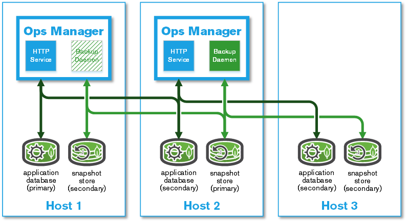
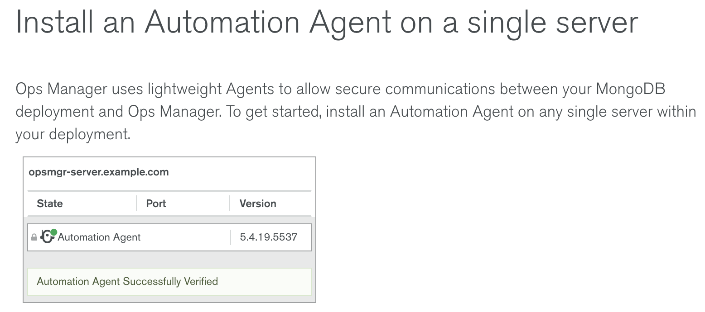
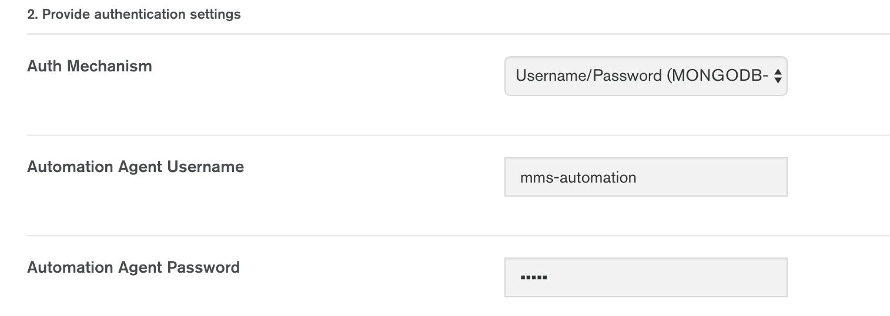
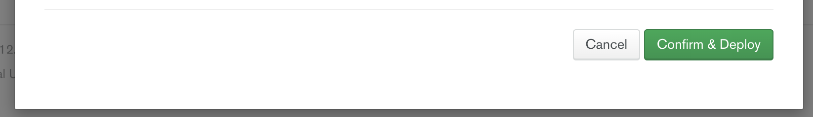

= Ops Manager
:toc: manual

== 概述

本文档说明如何安装一个可用于生产的 MongoDB Ops Manager, 以及如何通过 Ops Manager 监控和警告的功能对一个 MongoDB 分片集群进行管理。具体内容包括：

* MongoDB Ops Manager 4.1 安装
* 基本监控报警展示
* HTTPS 配置
* 备份和 恢复

本部分操作可以在 AWS Linux 或 RHEL 7 上进行。如果所有操作在 AWS 上，所使用到的 AWS  服务包括：

* EC2 - 运行 Ops Manager 及所需的组件、数据库等
* Route 53 - 确保 EC2 节点之间可以通过域名访问
* VPC - 确保 Ops Manager 及所需的组件在虚拟私有网络。

详细关于 EC2、Route 53、VPC 参照 AWS 相关文档及 说明。

[source, bash]
.*确保 aws 命令行已安装，相关认证完毕，可以通过命令行执行命令启动，配置 EC2 等*
----
$ aws --version
aws-cli/1.16.204 Python/2.7.10 Darwin/18.7.0 botocore/1.12.194
----

== MongoDB Ops Manager 安装

=== 安装架构 

Ops Manager 安装架构如下图：

本部分采用简单高可用的生产部署架构，详细参照 link:https://docs.opsmanager.mongodb.com/v4.1/core/deployments/#production-installs[MongoDB 官方文档]。

=== 环境准备

如安装架构所示，准备三台服务器，相关配置如下

|===
|主机编号 |域名 |CPU |内存 |磁盘

|Host 1
|host01.example.com
|4
|16 GB
|80 GB

|Host 2
|host02.example.com
|4
|16 GB
|80 GB

|Host 3
|host03.example.com
|4
|16 GB
|80 GB
|===

[source, bash]
.*AWS 上操作脚步（如果基于 RHEL 则忽略次步骤）*
----
// set hostname
sudo hostnamectl set-hostname host01.example.com
sudo hostnamectl set-hostname host02.example.com
sudo hostnamectl set-hostname host03.example.com

// register a DNS A record hostname with private IP to Route 53
PRIVATEIPS="IP01 IP02 IP03"
HOSTNUM=1
for IP in $PRIVATEIPS
do
 export FQDN="host0$HOSTNUM.example.com"
 echo "Registering $host as $FQDN"
cat <<EOF> newhost0$HOSTNUM.json
{
  "Comment": "CREATE an A record ",
  "Changes": [{
    "Action": "UPSERT",
    "ResourceRecordSet": {
      "Name": "$FQDN",
      "Type": "A",
      "TTL": 300,
      "ResourceRecords": [{ "Value":"$IP"}]
    }
  }]
}
EOF
aws route53 change-resource-record-sets --hosted-zone-id XXXOOOZZZJJ --change-batch file://newhost0$HOSTNUM.json 
let "HOSTNUM=HOSTNUM+1"
done

// check in 3 hosts, to make sure the DNS is work as expect, the referenced A record IP will list hints the DNS work as expected.
for i in 1 2 3 ; do dig host0$i.example.com +short ; done
----

[source, bash]
.*分别在三台服务器上挂载磁盘，执行 MongoDB 生产部署配置*
----
sudo mkfs -t xfs /dev/nvme1n1
sudo mkdir /data
sudo mount /dev/nvme1n1 /data
grep -q /dev/nvme1n1 /etc/fstab || echo "/dev/nvme1n1       /data          xfs     defaults,noatime   1  1" | sudo tee --append /etc/fstab
sudo findmnt --verify 

grep -q 'vm.zone_reclaim_mode' /etc/sysctl.conf || echo "vm.zone_reclaim_mode=0
" | sudo tee --append /etc/sysctl.conf
sudo sysctl -w  vm.zone_reclaim_mode=0

grep -q 'vm.swappiness' /etc/sysctl.conf || echo "vm.swappiness=1" | sudo tee --append /etc/sysctl.conf
sudo sysctl -w  vm.swappiness=1

for limit in fsize cpu as memlock
do
  grep "mongodb" /etc/security/limits.conf | grep -q $limit || echo -e "mongod     hard   $limit    unlimited\nmongod     soft    $limit   unlimited" | sudo tee --append /etc/security/limits.conf
done

for limit in nofile noproc
do
  grep "mongodb" /etc/security/limits.conf | grep -q $limit || echo -e "mongod     hard   $limit    64000\nmongod     soft    $limit   64000" | sudo tee --append /etc/security/limits.conf
done

sudo reboot
----

=== 安装 appDB

本部分在三个 host 上都执行。

[source, bash]
.*1. 配置 yum 源（如果离线安装，可提前下载 rpm 包）*
----
cat << 'ENDOFDOC' | sudo tee /etc/yum.repos.d/mongodb-enterprise.repo
[mongodb-enterprise]
name=MongoDB Enterprise Repository
baseurl=https://repo.mongodb.com/yum/amazon/2/mongodb-enterprise/4.0/$basearch/
gpgcheck=1
enabled=1
gpgkey=https://www.mongodb.org/static/pgp/server-4.0.asc
ENDOFDOC
----

[source, bash]
.*2. 安装 MongoDB*
----
sudo yum install -y mongodb-enterprise
----

[source, bash]
.*3. 创建数据库目录*
----
sudo mkdir /data/appdb
sudo chown mongod:mongod /data/appdb
----

[source, bash]
.*4. 创建配置文件*
----
cat << 'ENDCONF' | sudo tee /etc/mongod.conf
# mongod.conf

# for documentation of all options, see:
#   http://docs.mongodb.org/manual/reference/configuration-options/

# where to write logging data.
systemLog:
  destination: file
  logAppend: true
  path: /data/appdb/mongod.log

# Where and how to store data.
storage:
  dbPath: /data/appdb
  journal:
    enabled: true
  wiredTiger:
    engineConfig:
       cacheSizeGB: 2

# how the process runs
processManagement:
  fork: true  # fork and run in background
  pidFilePath: /var/run/mongodb/mongod.pid  # location of pidfile
  timeZoneInfo: /usr/share/zoneinfo

# network interfaces
net:
  port: 27017
  bindIpAll: true

replication:
  replSetName: appdbRS
ENDCONF
----

NOET: 生产环境下最佳实践配置安全，启用内部认证。

[source, bash]
.*5. 启动 MongoDB*
----
sudo systemctl start mongod
sudo systemctl enable mongod
----

[source, bash]
.*6. 初始化复制集*
----
mongo -eval 'rs.initiate()'
mongo -eval 'rs.add("host02.mongosa.net:27017")'
mongo -eval 'rs.add("host03.mongosa.net:27017")'
----

=== Ops Manager 安装 

[source, bash]
.*1. 到 https://www.mongodb.com/subscription/downloads/archived 下载相应的版本*
----
$ curl -OL https://downloads.mongodb.com/on-prem-mms/rpm/mongodb-mms-4.0.16.50586.20191101T1422Z-1.x86_64.rpm
$ ls
mongodb-mms-4.0.16.50586.20191101T1422Z-1.x86_64.rpm
----

[source, bash]
.*2. 安装*
----
$ sudo yum localinstall mongodb-mms-4.0.16.50586.20191101T1422Z-1.x86_64.rpm -y
----

[source, bash]
.*3. 编辑 /opt/mongodb/mms/conf/conf-mms.properties，配置 appDB*
----
mongo.mongoUri=mongodb://host01.example.com:27017,host02.example.com:27017,host03.example.com:27017/?maxPoolSize=150&replicaSet=appdbRS
----

[source, bash]
.*4. 启动 Ops Manager*
----
$ sudo service mongodb-mms start
----

[source, bash]
.*5. 查看 Ops Manager HTTP 服务监听的端口*
----
$ sudo netstat -antulop | grep 8080
tcp        0      0 0.0.0.0:8080            0.0.0.0:*               LISTEN      3258/mms-app         off (0.00/0/0)
----

=== Ops Manager 初始化配置

Ops Manager 安装成功后 HTTP 服务会启动，通过 HTTP 服务可以完成对 Ops Manager 初始化配置。

*1. 访问 http://host02.example.com:8080 时，点击 Register 链接注册一个全局管理账户*

image:img/ops-register.png[]

在弹出的页面配置如下：

* Email Address : kylin.soong@mongodb.com 
* Password      : password1!
* First Name    : Kylin
* Last Name     : Soong

*2. 注册完成初次登陆会定向到 Configure Ops Manager 页面*

在 Configure Ops Manager 页面完成初始化配置

* Web Server
** URL To Access Ops Manager - http://host02.example.com:8080
** Client Certificate Mode   - None
** 其它项使用默认配置

* Email（本部分需要对接相关邮件服务器）
** "From" Email Address                - opsmanager@example.com
** "Reply To" Email Address            - admin@example.com
** Admin Email Address                 - admin@example.com
** Email Delivery Method Configuration - SMTP Email Server
** Transport                           - smtp
** SMTP Server Hostname                - smtp.example.com
** SMTP Server Port                    - 587
** 其它项使用默认配置

* User Authentication
** User Authentication Method - Application Database
** 其它项使用默认配置 

* Multi-Factor Authentication (MFA) 
** 所有项使用默认配置 

* Other Authentication Options
** 所有项使用默认配置 

* Permissions
** 所有项使用默认配置

* Backup Snapshots
** 所有项使用默认配置

* Backup Snapshots Schedule
** Snapshot Interval (Hours)                  - 24
** Base Retention Of Snapshots (In Days)      - 2
** Daily Retention Of Snapshots (In Days)     - No daily retention
** Weekly Retention Of Snapshots (In Weeks)   - 2
** Monthly Retention Of Snapshots (In Months) - 1
** 其它项使用默认配置

* KMIP Server Configuration
** 所有项使用默认配置

* Queryable Snapshot Configuration
** 所有项使用默认配置

* HTTP/HTTPS Proxy
** 所有项使用默认配置

* Twilio Integration
** 所有项使用默认配置

* MongoDB Version Management
** 所有项使用默认配置

* Alerts
** 所有项使用默认配置

*配置完成后进入到如下Deployment 界面*

image:img/opsmgr-install-finished.png[]

=== Agent 安装

NOTE: 在 Ops Manager 新版本中 Agent 不需要手动安装，本部分可以跳过。

==== 安装 Automation Agent 

NOTE: Automation Agent 可以在需要部署导入时安装

在 Ops Manager 界面，选择 *Deployment* -> *Agents* -> *Downloads & Settings*，选择相应的版本，例如 `Automation Agent Installation Instructions`，在弹出的界面根据步骤完成 agent 安装。

[source, bash]
.*1. 安装*
----
$ curl -OL http://opsmgr.example.com:8080/download/agent/automation/mongodb-mms-automation-agent-manager-5.4.19.5537-1.x86_64.rhel7.rpm

$ sudo chmod a+x mongodb-mms-automation-agent-manager-5.4.19.5537-1.x86_64.rhel7.rpm
$ sudo yum localinstall mongodb-mms-automation-agent-manager-5.4.19.5537-1.x86_64.rhel7.rpm
----

[source, bash]
.*2. 配置 key*
----
sudo vi /etc/mongodb-mms/automation-agent.config
----

[source, bash]
.*3. 启动服务*
----
sudo systemctl start mongodb-mms-automation-agent.service
----

NOTE: 部署界面有 安装 agent 的介绍。

==== 安装 Monitoring Agent

NOTE: 可以在创建完 Project 后执行这部分。

在 Ops Manager 界面，选择 *Deployment* -> *Agents* -> *Downloads & Settings*，选择相应的版本，例如 Install or Update the Monitoring Agent。

[source, bash]
.*1. 安装*
----
curl -OL http://opsmgr.example.com:8080/download/agent/monitoring/mongodb-mms-monitoring-agent-6.6.2.466-1.x86_64.rhel7.rpm

chmod 777 mongodb-mms-monitoring-agent-6.6.2.466-1.x86_64.rhel7.rpm 

sudo yum localinstall mongodb-mms-monitoring-agent-6.6.2.466-1.x86_64.rhel7.rpm -y
----

[source, bash]
.*2. 配置 key, 用户名，密码*
----
sudo vi /etc/mongodb-mms/monitoring-agent.config

mmsGroupId=5d08a1af8a49a31b324ec641
mmsApiKey=5d08a41a8a49a31b324ec86d3dd0a7d168167e4fdb7ec454c450666b
mmsBaseUrl=http://opsmgr.example.com:8080

globalAuthUsername=mms-monitoring-agent
globalAuthPassword=mongo 
----

[source, bash]
.*3. 启动服务*
----
sudo systemctl start mongodb-mms-monitoring-agent.service
----

=== 创建备份数据库

在 Ops Manager 创建一个 Project `'blockstore'

image:img/blockstore-project.png[]

然后在这个工程下创建一个 三节点复制集。 

== 准备测试集群

NOTE: 本部分集群为了测试使用，与 Ops Manager 安装不相关，本部分所有操作在 mongod.example.com 服务器上进行。

[source, bash]
.*MongoDB 安装*
----
sudo yum localinstall mongodb-enterprise-server-4.0.10-1.el7.x86_64.rpm -y
sudo yum localinstall mongodb-enterprise-tools-4.0.10-1.el7.x86_64.rpm -y
sudo yum localinstall mongodb-enterprise-shell-4.0.10-1.el7.x86_64.rpm -y
----

=== 分片集群

[source, bash]
.*执行如下脚本构建一个 2 分片、2 mongos、1 ConfigServer 集群*
----
//创建数据库存储文件及内部通信加密文件
$ mkdir -p ~/data/ra{0,1,2}
$ mkdir -p ~/data/rb{0,1,2}
$ mkdir -p ~/data/cs{0,1,2}
$ openssl rand -base64 755 > ~/data/keyfile
$ chmod 400 ~/data/keyfile

//启动 ConfigServer，初始化，创建管理用户，并添加备节点
$ mongod --port 26000 --dbpath ~/data/cs0/
$ mongo admin --port 26000 --eval 'db.createUser({user: "root", pwd: "mongo", roles: [{ role:"root", db: "admin" }]})'
$ for i in 0 1 2 ; do mongod --configsvr --dbpath ~/data/cs$i --logpath ~/data/cs$i/mongo.log --port 2600$i --bind_ip 0.0.0.0 --fork --auth --keyFile ~/data/keyfile --replSet repl-cs ; done

$ mongo admin --port 26000 -u root -p mongo --eval "rs.initiate()"
$ mongo admin --port 26000 -u root -p mongo --eval 'rs.add("mongod.example.com:26001")'
$ mongo admin --port 26000 -u root -p mongo --eval 'rs.add("mongod.example.com:26002")'

//启动 mongos，并查看分片状态
$ mongos --configdb 'repl-cs/mongod.example.com:26000,mongod.example.com:26001,mongod.example.com:26002' --logpath ~/data/mongos1.log --port 27017 --bind_ip 0.0.0.0 --fork --keyFile ~/data/keyfile
$ mongos --configdb 'repl-cs/mongod.example.com:26000,mongod.example.com:26001,mongod.example.com:26002' --logpath ~/data/mongos2.log --port 27018 --bind_ip 0.0.0.0 --fork --keyFile ~/data/keyfile

$ mongo admin --port 27017 -u root -p mongo --eval 'sh.status()'
$ mongo admin --port 27018 -u root -p mongo --eval 'sh.status()'

//启动分片a，初始化，创建管理账户，添加备节点
$ mongod --port 27000 --dbpath ~/data/ra0/
$ mongo admin --port 27000 --eval 'db.createUser({user: "root", pwd: "mongo", roles: [{ role:"root", db: "admin" }]})'
$ for i in 0 1 2 ; do mongod --shardsvr --dbpath ~/data/ra$i --logpath ~/data/ra$i/mongo.log --port 2700$i --bind_ip 0.0.0.0 --fork --auth --keyFile ~/data/keyfile --replSet repl-a ; done

$ mongo admin --port 27000 -u root -p mongo --eval "rs.initiate()"
$ mongo admin --port 27000 -u root -p mongo --eval 'rs.add("mongod.example.com:27001")'
$ mongo admin --port 27000 -u root -p mongo --eval 'rs.add("mongod.example.com:27002")'

//启动分片b，初始化，创建管理账户，添加备节点
$ mongod --port 28000 --dbpath ~/data/rb0/
$ mongo admin --port 28000 --eval 'db.createUser({user: "root", pwd: "mongo", roles: [{ role:"root", db: "admin" }]})'
$ for i in 0 1 2 ; do mongod --shardsvr --dbpath ~/data/rb$i --logpath ~/data/rb$i/mongo.log --port 2800$i --bind_ip 0.0.0.0 --fork --auth --keyFile ~/data/keyfile --replSet repl-b ; done

$ mongo admin --port 28000 -u root -p mongo --eval "rs.initiate()"
$ mongo admin --port 28000 -u root -p mongo --eval 'rs.add("mongod.example.com")'
$ mongo admin --port 28000 -u root -p mongo --eval 'rs.add("mongod.example.com")'

//配置分片，并查看分片状态
$ mongo admin --port 27017 -u root -p mongo --eval 'sh.addShard("repl-a/mongod.example.com:27000,mongod.example.com:27001,mongod.example.com:27002")'
$ mongo admin --port 27017 -u root -p mongo --eval 'sh.addShard("repl-b/mongod.example.com:28000,mongod.example.com:28001,mongod.example.com:28002")'

$ mongo admin --port 27017 -u root -p mongo --eval 'sh.status()'
$ mongo admin --port 27018 -u root -p mongo --eval 'sh.status()'
----

=== 三节点复制集

[source, bash]
.*执行如下脚本构建一个 3 节点复制集*
----
//创建数据库存储文件及内部通信加密文件
$ mkdir -p ~/data/r{0,1,2}
$ openssl rand -base64 755 > ~/data/keyfile
$ chmod 400 ~/data/keyfile

//创建安全登录账户
$ mongod --port 27000 --dbpath ~/data/r0/
$ mongo admin --port 27000 --eval 'db.createUser({user: "root", pwd: "mongo", roles: [{ role:"root", db: "admin" }]})'

//启动
$ for i in 0 1 2 ; do mongod --dbpath ~/data/r$i --logpath ~/data/r$i/mongo.log --port 2700$i --bind_ip 0.0.0.0 --fork --auth --keyFile ~/data/keyfile --replSet repl-app-db ; done

//初始化
$ mongo admin --port 27000 -u root -p mongo --eval 'rs.initiate()'
$ mongo admin --port 27000 -u root -p mongo --eval 'rs.add("mongod.example.com:27001")'
$ mongo admin --port 27000 -u root -p mongo --eval 'rs.add("mongod.example.com:27002")'

//集群初始化验证
$ mongo admin --port 27000 -u root -p mongo --eval 'rs.isMaster()'
$ mongo admin --port 27000 -u root -p mongo --eval 'rs.status()'
----

== 导入一个存在的集群

本部分将上面步骤创建的测试集群导入到 Ops Manager.

=== 创建 clusterMonitor 用户

[source, bash]
.*在集群中的所有分片复制集，ConfigServer 复制集合中执行如下命令创建一个 clusterMonitor 用户*
----
db.createUser({user: "mms-monitoring-agent", pwd: "mongo", roles: [{ role:"clusterMonitor", db: "admin" }]})
----

NOTE: `mms-monitoring-agent`/`mongo` 用户会被 Monitor Agent 导入集群时使用 

=== 创建一个 Project

在 Ops Manager 界面创建一个 DEMO project

从 Ops Manager 界选择 `Deployment` -> `Agents` -> `All Agents` 下列表中可看到对应 Agent

image:img/ops-agent-lists.png[]

NOTE: 如上显示导入成功后 Project 对应所有 Agent，可执行完后回过头查看。

=== 执行导入

在 Ops Manager 界面 DEMO Project 下选择 `Deployment` → `Add New` → `Existing MongoDB Deployment`

image:img/ops-import-exists.png[]

* 点击继续，进入到 *Install an Automation Agent on a single server* 界面，在该界面点击 *Install Agent* 按钮，根据弹出的说明步骤配置一个 Automation Agent, 配置成功后界面如下界面如下

* 点击继续进入到 *Set up Ops Manager Monitoring* 界面，Automation Agent 会自动安装 Monitoring Agent 和 Backup Agent，安装完成后界面如下

image:img/ops-all-agent.png[]

* 点击继续，进入到 *Import your deployment for monitoring* 界面输入相应的值

----
Hostname              -  192.168.33.101
Port                  -  27017
Enable Authentication -  Yes
Username              -  mms-monitoring-agent
Password              -  mongo
----

* 点击继续，导入界面开始 ping 操作，执行成功后，会有如下输出界面

image:img/ops-deployment-found.png[]

* 点击继续，进入 *Adding your deployment to Ops Manager* 界面，会检测到导入的 Server 如下

image:img/ops-server-import.png[]

* 点击继续，进入到 *Do you want to add Ops Manager Automation to this deployment?* 页面

在页面的底部，选择接受 I understand that this requires the installation of an automation agent on each of the servers in my deployment and I have read the requirements/risks above，

image:img/ops-automation-deployments.png[]

* 点击继续，进入到 * Configure authentication for Automation* 页面

根据页面的提示，在集群中的所有分片复制集，ConfigServer 复制集合中执行如下命令创建一个用户：

[source, bash]
----
use admin 
db.createUser({user: 'mms-automation', pwd: 'mongo', roles: ['clusterAdmin', 'dbAdminAnyDatabase', 'readWriteAnyDatabase', 'restore', 'userAdminAnyDatabase']})
----

然后在 `Provide authentication settings` 部分输入上面创建的用户

* 点击继续，进入到 *Install an Automation Agent on each of your servers* 页面

确保所有的界面上都安装了 Agent。

完成后点击 *Initialize Automation* 按钮，会进入到 *Initializing Automation for your Deployment* 页面，收集信息完成后，会有如下输出

image:img/ops-gather-all-process.png[]

* 点击 *Review Deployment* 按钮，进入到 Deployment 界面

点击 Deployment 界面上端黄色背景横条中 *REVIEW & DEPLOY* 按钮，Review 相关的变化，

Review 完成后点击 *Confirm & Deploy* 按钮。

* 导入成功后，在 Cluster_0 中会有 2 个分片，3 个 CONFIGS，连个 mongos

image:img/ops-imported-cluster.png[]

== Ops Manager 自动化管理

=== Overview

在部署完成界面，如果点击某一个复制集，会进入到 Overview 界面，该界面下会有整体概述界面

=== Real Time

该界面下会有实时的监控数据，监控项目主要有 4 个种类

* 系统相关: CPU、磁盘使用率、系统内存、连接总数、网路进出等
* MongoDB 监控指标: OPERATIONS、QUERY EXECUTION TIMES、QUERY TARGETING、READS & WRITES
* 最高负载的集合，主要从读写两个方面去衡量负载
* 慢操作

=== Metrics

可以根据不同的时间间隔，收集一些监控项目，具体监控项有 30 多种，分为两类，即系统相关，和 MongoDB 相关，选择任意一个监控项，对应的监控报表会显示出来

image:img/opsmgr-metrics.png[]

=== Data

在该界面点击 *Create Database* 可以创建一个数据库

image:img/opsmgr-data-create-db.png[]

同样在该界面如果选定一个数据库中的集合，可以创建文档。

=== Performance Advisor

该页面会列出一定时间段内 Ops Manager 检测到的慢查询。

image:img/opsmgr-perf-advisor.png[]

