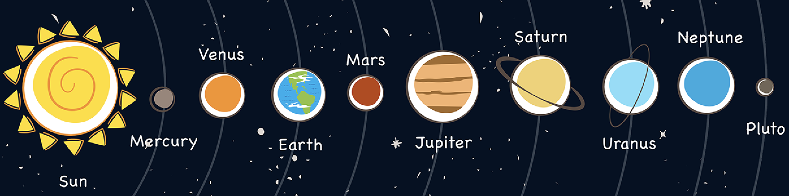

= Aggregation Framework
:toc: manual

== 测试数据

=== solarSystem(太阳系)

solarSystem collection 中包括太阳系中所有恒星和行星的的信息，每个星球包含的具体属性有名称、类型、半径，重量，距离太阳的距离等。

[source, json]
.*示例：查询地球的详细信息*
----
db.solarSystem.find({"name" : "Earth"}).pretty()
{
	"_id" : ObjectId("59a06674c8df9f3cd2ee7d54"),
	"name" : "Earth",
	"type" : "Terrestrial planet",
	"orderFromSun" : 3,
	"radius" : {
		"value" : 6378.137,
		"units" : "km"
	},
	"mass" : {
		"value" : 5.9723e+24,
		"units" : "kg"
	},
	"sma" : {
		"value" : 149600000,
		"units" : "km"
	},
	"orbitalPeriod" : {
		"value" : 1,
		"units" : "years"
	},
	"eccentricity" : 0.0167,
	"meanOrbitalVelocity" : {
		"value" : 29.78,
		"units" : "km/sec"
	},
	"rotationPeriod" : {
		"value" : 1,
		"units" : "days"
	},
	"inclinationOfAxis" : {
		"value" : 23.45,
		"units" : "degrees"
	},
	"meanTemperature" : 15,
	"gravity" : {
		"value" : 9.8,
		"units" : "m/s^2"
	},
	"escapeVelocity" : {
		"value" : 11.18,
		"units" : "km/sec"
	},
	"meanDensity" : 5.52,
	"atmosphericComposition" : "N2+O2",
	"numberOfMoons" : 1,
	"hasRings" : false,
	"hasMagneticField" : true
}
----

=== movies(电影)

image:img/hero_poster.jpg[]

movies collection 中包括电影的信息，如下所示

* title - 电影的名称
* year - 上映的年代
* cast - 主演
* type - 类型
* directors - 导演
* imdb - imdb 的评分
* countries - 国家
* genres - 体裁
* tomatoes - 烂番茄评分

[source, json]
----
db.movies.findOne()
{
	"_id" : ObjectId("573a1390f29313caabcd421c"),
	"title" : "A Turn of the Century Illusionist",
	"year" : 1899,
	"runtime" : 1,
	"cast" : [
		"Georges M�li�s"
	],
	"lastupdated" : "2015-08-29 00:21:21.547000000",
	"type" : "movie",
	"directors" : [
		"Georges M�li�s"
	],
	"imdb" : {
		"rating" : 6.6,
		"votes" : 580,
		"id" : 246
	},
	"countries" : [
		"France"
	],
	"genres" : [
		"Short"
	],
	"tomatoes" : {
		"viewer" : {
			"rating" : 3.8,
			"numReviews" : 32
		},
		"lastUpdated" : ISODate("2015-08-20T18:46:44Z")
	}
}
----

=== nycFacilities(纽约市公共设施)

nycFacilities collection 中包括纽约市的公共设施，具体包括：

* name - 名称
* address - 地址
* borough - 区
* location - 地址

[source, json]
----
db.nycFacilities.findOne()
{
	"_id" : ObjectId("59a57f72ea2da4c51ef35c5e"),
	"name" : "Joan Of Arc Park",
	"address" : {
		"number" : "",
		"street" : "",
		"city" : "New York",
		"zipcode" : "10024"
	},
	"borough" : "Manhattan",
	"location" : {
		"type" : "Point",
		"coordinates" : [
			-73.976521,
			40.79415
		]
	},
	"domain" : "Parks, Gardens, and Historical Sites",
	"group" : "Parks and Plazas",
	"specialty" : "Streetscapes, Plazas, and Malls",
	"type" : "Triangle/Plaza"
}
---- 

== $match, $project

=== 查询太阳系中不是恒星的星球，并统计总数

[source, sql]
----
db.solarSystem.aggregate([{
   $match: {
     type: {$ne: "Star"}
     }
   }, {
   $count: "planets"
   }
])
----

=== 查询太阳系中满足大气层中有氧气，地表平均温度 -40 到 40 之间，且有月亮的星球

[source, sql]
----
db.solarSystem.aggregate([{
  "$match": {
    "atmosphericComposition": { "$in": [/O2/] },
    "meanTemperature": { $gte: -40, "$lte": 40 }
  }
}, {
  "$project": {
    "_id": 0,
    "name": 1,
    "hasMoons": { "$gt": ["$numberOfMoons", 0] }
  }
}], { "allowDiskUse": true});
----

=== 查询太阳系中所有的星球，只显示星球的名称和引力的大小

[source, javaScript]
----
var pipeline = [
  {
    $project: {_id: 0, name: 1, "gravity.value": 1}
  }
];

db.solarSystem.aggregate(pipeline);
{ "name" : "Uranus", "gravity" : { "value" : 8.87 } }
{ "name" : "Mercury", "gravity" : { "value" : 3.24 } }
{ "name" : "Earth", "gravity" : { "value" : 9.8 } }
{ "name" : "Jupiter", "gravity" : { "value" : 24.79 } }
{ "name" : "Venus", "gravity" : { "value" : 8.87 } }
{ "name" : "Mars", "gravity" : { "value" : 3.71 } }
{ "name" : "Sun", "gravity" : { "value" : 274 } }
{ "name" : "Saturn", "gravity" : { "value" : 10.44 } }
{ "name" : "Neptune", "gravity" : { "value" : 11.15 } }
----

=== 查询太阳系中所有的星球，只显示星球的名称和引力的大小，并且格式化输出为一个属性

[source, javaScript]
----
var pipeline = [
  {
    $project: {_id: 0, name: 1, gravity: "$gravity.value"}
  }
];

db.solarSystem.aggregate(pipeline);
{ "name" : "Uranus", "gravity" : 8.87 }
{ "name" : "Mercury", "gravity" : 3.24 }
{ "name" : "Earth", "gravity" : 9.8 }
{ "name" : "Jupiter", "gravity" : 24.79 }
{ "name" : "Venus", "gravity" : 8.87 }
{ "name" : "Mars", "gravity" : 3.71 }
{ "name" : "Sun", "gravity" : 274 }
{ "name" : "Saturn", "gravity" : 10.44 }
{ "name" : "Neptune", "gravity" : 11.15 }
----

=== 查询太阳系中所有的星球，只显示星球的名称、引力的大小、重量、半径及距离太阳的距离，并且格式化以一个属性输出

[source, javaScript]
----
var pipeline = [
  {
    $project: {
      _id: 0, 
      name: 1, 
      gravity: "$gravity.value",
      "mass": "$mass.value",
      "radius": "$radius.value",
      "sma": "$sma.value"
    }
  }
];

db.solarSystem.aggregate(pipeline)
{ "name" : "Uranus", "gravity" : 8.87, "mass" : 8.6813e+25, "radius" : 25559, "sma" : 2872460000 }
{ "name" : "Mercury", "gravity" : 3.24, "mass" : 3.3e+23, "radius" : 4879, "sma" : 57910000 }
{ "name" : "Earth", "gravity" : 9.8, "mass" : 5.9723e+24, "radius" : 6378.137, "sma" : 149600000 }
{ "name" : "Jupiter", "gravity" : 24.79, "mass" : 1.89819e+27, "radius" : 71492, "sma" : 778570000 }
{ "name" : "Venus", "gravity" : 8.87, "mass" : 4.8675e+24, "radius" : 6051.8, "sma" : 108210000 }
{ "name" : "Mars", "gravity" : 3.71, "mass" : 6.4171e+23, "radius" : 3396.2, "sma" : 227920000 }
{ "name" : "Sun", "gravity" : 274, "mass" : 1.9885e+30, "radius" : 695700, "sma" : 0 }
{ "name" : "Saturn", "gravity" : 10.44, "mass" : 5.6834e+26, "radius" : 60268, "sma" : 1433530000 }
{ "name" : "Neptune", "gravity" : 11.15, "mass" : 1.02413e+26, "radius" : 24765, "sma" : 4495060000 }
----

=== 查找电影中满足 imdb 评分至少为 7，体裁不是 "Crime" 或 "Horror"，评级是 "PG" 或 "G"，且语言包括 "English" 和 "Japanese"

[source, javaScript]
----
var pipeline = [
    { $match :
            { $and : [
                    { "imdb.rating" : { $gte : 7 }},
                        { "genres" :
                            { $nin :[ "Crime", "Horror" ]}
                        },
                        { "rated" :
                                { $in : [ "PG", "G" ]}
                        },
                        { "languages" :
                                { $all : [ "English", "Japanese" ]}
                        }
                ]}
        }
];

var count = db.movies.aggregate(pipeline).itcount();
print("Documents fetched by the pipeline: " + count);
----

=== 查找电影中满足 imdb 评分至少为 7，体裁不是 "Crime" 或 "Horror"，评级是 "PG" 或 "G"，且语言包括 "English" 和 "Japanese"，输出仅显示 title 和 rated 属性 

[source, javaScript]
----
var pipeline = [
    { $match :
            { $and : [
                    { "imdb.rating" : { $gte : 7 }},
                        { "genres" :
                            { $nin :[ "Crime", "Horror" ]}
                        },
                        { "rated" :
                                { $in : [ "PG", "G" ]}
                        },
                        { "languages" :
                                { $all : [ "English", "Japanese" ]}
                        }
                ]}
        },
        { $project : { "_id" : 0, "title" : 1, "rated" : 1}}
];

var count = db.movies.aggregate(pipeline).itcount();
print("Documents fetched by the pipeline: " + count);
----

=== 查找电影中满足 title 仅为一个字的电影

[source, javaScript]
----
var pipeline = [
        { $project :
        { "titleWords" :
                    { $size :
                            { $split : [ "$title" , " " ] }
                        }
                }
        },
    { $match : { "titleWords" : {$eq: 1}} }
];

db.movies.aggregate(pipeline).itcount()
----

=== 查找电影中满足同一个人即是 cast，又是 director，还是 writer

[source, javaScript]
----
var pipeline = [
  {
    $match: {
      "writers": {$elemMatch: {$exists: true}},
      "cast": {$elemMatch: {$exists: true}},
      "directors": {$elemMatch: {$exists: true}}
    }
  },
  {
    $project: {
      "writers": {
        $map: {
          input: "$writers", 
          as: "writer",
          in: {
            $arrayElemAt: [{$split: ["$$writer", " ("]}, 0]
          }
        }
      },
      "cast": 1,
      "directors" : 1
    }
  },
  {
    $project: {
      "laborOfLove": {
        $gt: [{$size: {$setIntersection: ["$writers", "$cast", "$directors"]}}, 0]
      }
    }
  },
  {
    $match: {
      "laborOfLove" : {$eq: true}
    }
  }
];

db.movies.aggregate(pipeline).itcount()
----

== $addFields, $geoNear

=== 查询太阳系中所有的星球，只显示星球的名称、引力的大小、重量、半径及距离太阳的距离，并且格式化以一个属性输出

[source, javaScript]
----
var pipeline = [
  {
    $project: {
      _id: 0,
      name: 1,
      gravity: 1, 
      mass: 1, 
      radius:1, 
      sma: 1
    }
  },
  {
    $addFields: {
      "gravity": "$gravity.value",
      "mass": "$mass.value",
      "radius": "$radius.value",
      "sma": "$sma.value"
    }
  }
];

db.solarSystem.aggregate(pipeline)
{ "name" : "Uranus", "radius" : 25559, "mass" : 8.6813e+25, "sma" : 2872460000, "gravity" : 8.87 }
{ "name" : "Mercury", "radius" : 4879, "mass" : 3.3e+23, "sma" : 57910000, "gravity" : 3.24 }
{ "name" : "Earth", "radius" : 6378.137, "mass" : 5.9723e+24, "sma" : 149600000, "gravity" : 9.8 }
{ "name" : "Jupiter", "radius" : 71492, "mass" : 1.89819e+27, "sma" : 778570000, "gravity" : 24.79 }
{ "name" : "Venus", "radius" : 6051.8, "mass" : 4.8675e+24, "sma" : 108210000, "gravity" : 8.87 }
{ "name" : "Mars", "radius" : 3396.2, "mass" : 6.4171e+23, "sma" : 227920000, "gravity" : 3.71 }
{ "name" : "Sun", "radius" : 695700, "mass" : 1.9885e+30, "sma" : 0, "gravity" : 274 }
{ "name" : "Saturn", "radius" : 60268, "mass" : 5.6834e+26, "sma" : 1433530000, "gravity" : 10.44 }
{ "name" : "Neptune", "radius" : 24765, "mass" : 1.02413e+26, "sma" : 4495060000, "gravity" : 11.15 }
----

=== 查询纽约时代广场附近的公共设施

[source, javaScript]
----
var pipeline = [
  {
    $geoNear: {
      "near": {
        "type": "Point",
        "coordinates": [-73.98769766092299, 40.757345233626594]
      },
      "distanceField": "distanceFromTimeSquire",
      "spherical": true
    }
  }
];

db.nycFacilities.aggregate(pipeline).itcount()
----

=== 查询纽约时代广场附近的医院

[source, javaScript]
----
var pipeline = [
  {
    $geoNear: {
      "near": {
        "type": "Point",
        "coordinates": [-73.98769766092299, 40.757345233626594]
      },
      "distanceField": "distanceFromTimeSquire",
      "spherical": true,
      "query": { type: "Hospital" },
      "limit": 5
    }
  }
];

db.nycFacilities.aggregate(pipeline).itcount()
----

== $sort, $skip, $limit, $count

=== 查询太阳系中所有的星球，只显示星球的名称、和附近的月球，仅输出 5 条记录

[source, javaScript]
----
var pipeline = [
  {
    $project: {
      _id: 0,
      name: 1,
      numberOfMoons: 1
    }
  },
  {
    $limit: 5
  }
];

db.solarSystem.aggregate(pipeline)
----

=== 查询太阳系中所有的星球，只显示星球的名称、和附近的月球，且跳过前 5 条记录

[source, javaScript]
----
var pipeline = [
  {
    $project: {
      _id: 0,
      name: 1,
      numberOfMoons: 1
    }
  },
  {
    $skip: 5
  }
];

db.solarSystem.aggregate(pipeline)
----

=== 查询太阳系中所有的行星，并统计行星的数量

[source, javaScript]
----
var pipeline = [
  {
    $match: {"type": {$eq: "Terrestrial planet"}}
  },
  {
    $count: "terrestrial planets"
  }
]; 

db.solarSystem.aggregate(pipeline)
----

=== 查询太阳系中所有的星球，只显示星球的名称、和附近的月球，并以月球的数量降序排序

[source, javaScript]
----
var pipeline = [
  {
    $project: {
      _id: 0,
      name: 1,
      numberOfMoons: 1
    }
  },
  {
    $sort: {numberOfMoons: -1}
  }
];

db.solarSystem.aggregate(pipeline)
----

=== 查询太阳系中所有的星球，只显示星球的名称、附近的月球、和是否有磁场，并以月球的数量和是否有磁场降序排序

[source, javaScript]
----
var pipeline = [
  {   
    $project: {
      _id: 0,
      name: 1,
      hasMagneticField: 1,
      numberOfMoons: 1
    }
  },
  {
    $sort: {hasMagneticField: -1, numberOfMoons: -1}
  }
];

db.solarSystem.aggregate(pipeline)
----

=== 查找拍序电影，并添加字段

查找拍序电影，并添加字段使满足如下条件：

* movies released in the USA 
* tomatoes.viewer.rating greater than or equal to 3
* calculate a new field called num_favs that represets how many favorites appear in the cast field of the movie
* Sort your results by num_favs, tomatoes.viewer.rating, and title, all in descending order

[source, javaScript]
----
var favorites = [
  "Sandra Bullock",
  "Tom Hanks",
  "Julia Roberts",
  "Kevin Spacey",
  "George Clooney" 
];
var pipeline = [
  {
    $match: {
      "tomatoes.viewer.rating": {$gte: 3},
      "cast": {$exists: true}
    }
  },
  {
    $addFields: {
      "num_favs": {$size: {
          $setIntersection: ["$cast", favorites]
        }
      }
    }
  },
  {
    $sort: {
      "num_favs": -1,
      "tomatoes.viewer.rating": -1,
      "title": -1
    }
  },
  {
    $skip: 25
  },
  {
    $project: {_id: 0, title: 1}
  },
  {
    $limit: 3
  }
];

db.movies.aggregate(pipeline, { allowDiskUse : true })
----

查找电影：

* Calculate an average rating for each movie in our collection where English is an available language
* the minimum imdb.rating is at least 1
* the minimum imdb.votes is at least 1, and it was released in 1990 or after. 

[source, javaScript]
----
var pipeline = [
    { $match : {
            "languages" : "English",
            "imdb.rating" : { $gte : 1 },
                "imdb.votes" : { $gte : 1 },
                "year" : { $gte : 1990 }
                }
        },
        { $addFields :
            { "scaled_votes" :
                { $add: [
                1,
                { $multiply: [
                    9,
                    { $divide: [
                        { $subtract: [ "$imdb.votes" , 5] },
                        { $subtract: [1521105, 5] }
                    ]}
                ]}
                    ]}
                }
        },
        { $addFields : { "normalized_rating" : { $avg : [ "$scaled_votes", "$imdb.rating" ] } } },
        { $sort : { "normalized_rating" : 1 } }
];
----

== $group, $sum, $avg

=== 查询电影，按年将电影分类，并统计每年的电影总数

[source, javaScript]
----
var pipeline = [
  {
    $group: {
      _id: "$year",
      "numFilmsThisYear": {$sum: 1}
    }
  }
];

db.movies.aggregate(pipeline)
----

=== 查询电影，按年将电影分类，统计每年的电影总数，并按照每年电影总数由多到少排序

[source, javaScript]
----
var pipeline = [
  {
    $group: {
      _id: "$year",
      "numFilmsThisYear": {$sum: 1}
    }
  },
  {
    $sort: {"numFilmsThisYear": -1}
  }
];

db.movies.aggregate(pipeline)
----

=== 查询电影，按导演的数量将电影分类，统计电影的数量，并以导演的数量由多到少排序

[source, javaScript]
----
var pipeline =  [
  {
    $group: {
      _id: {
        "numDirectors": {$cond: [{"$isArray": "$directors"}, {"$size": "$directors"}, 0]}
      },
      "numFilms": {$sum: 1},
      "averageMetacritic": { "$avg": "$metacritic" }
    }
  },
  {
    $sort: {"_id.numDirectors": -1}
  }
];

db.movies.aggregate(pipeline)
----

=== 查询电影，至少获的一次Oscar奖，计算最高、最低、平均 imdb 评分

[source, javaScript]
----
var pipeline = [
  {
    $match: {"awards": {$regex: /Won \d+ Oscar/}}
  },
  {
    $group: {
      _id: null,
      "highest_rating": {$max: "$imdb.rating"},
      "lowest_rating": {$min: "$imdb.rating"},
      "average_rating": {$avg: "$imdb.rating"},
      "deviation": {$stdDevSamp: "$imdb.rating"}
    }
  }
];

db.movies.aggregate(pipeline)
----

== $unwind 

=== 查询电影，找出 2010 到 2015 年间 imdb 评分最高类型，且电影长度大于 90 分钟

[source, javaScript]
----
var pipeline = [
  {
    $match: {
      "imdb.rating": {$gt: 0},
      "year": {$gte: 2010, $lte: 2015},
      "runtime": {$gte: 90}
    }
  },
  {
    $unwind: "$genres"
  },
  {
    $group: {
      _id: {
        "year": "$year",
        "genre": "$genres"
      },
      "average_rating": {
        "$avg": "$imdb.rating"
      }
    }
  },
  {
    $sort: {
      "_id.year": -1, "average_rating": -1 
    }
  },
  {
    $group: {
      "_id": "$_id.year",
      "genre": { "$first": "$_id.genre" },
      "average_rating": { "$first": "$average_rating" }
    }
  },
  {
    $sort: {_id: -1}
  }
];

db.movies.aggregate(pipeline)
----

=== 查询电影，找出所有英文电影中排名最高的演员，并计算参演的电影总数，及平均评分

[source, javaScript]
----
var pipeline = [
    { $unwind : "$cast" },
        { $group: {
            "_id" : "$cast",
                "numFilms" : { $sum : 1 },
                "average" : { $avg : "$imdb.rating" }
                }
        },
        { $sort : { "numFilms" : -1 } },
        { $limit : 1 }
];

db.movies.aggregate(pipeline)
----

== $lookup, $graphLookup

=== 查询航空联盟，将航空联盟中航空公司属性替换成详细信息

[source, javaScript]
----
var pipeline = [
  {
    $lookup: {
      from: "air_airlines",
      localField: "airlines",
      foreignField: "name",
      as: "airlines"
    }
  }
];

db.air_alliances.aggregate(pipeline)
----

=== 查询航空联盟，查找出路径使用 Boeing 747 或 Airbus A380 的航空公司

[source, javaScript]
----
var pipeline = [
  {
    $unwind: "$airlines"
  },
  {
    $lookup: {
      from: "air_routes",
      localField: "airlines",
      foreignField: "airline.name",
      as: "routes"
    }
  },
  {
    $unwind: "$routes"
  },
  {
    $match: {
      "routes.airplane": {$in: [ "747", "380" ]}
    }
  },
  {
    $group: {
      "_id" : "$name",
      "routes_count" : { $sum : 1 }
    }
  },
  {
    $sort : {"routes_count": -1 }
  }
];

 db.air_alliances.aggregate(pipeline)
----

[source, javaScript]
----

----

[source, javaScript]
----

----

[source, javaScript]
----

----

[source, javaScript]
----

----

[source, javaScript]
----

----

[source, javaScript]
----

----

[source, javaScript]
----

----

[source, javaScript]
----

----     
