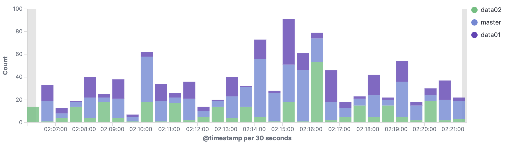
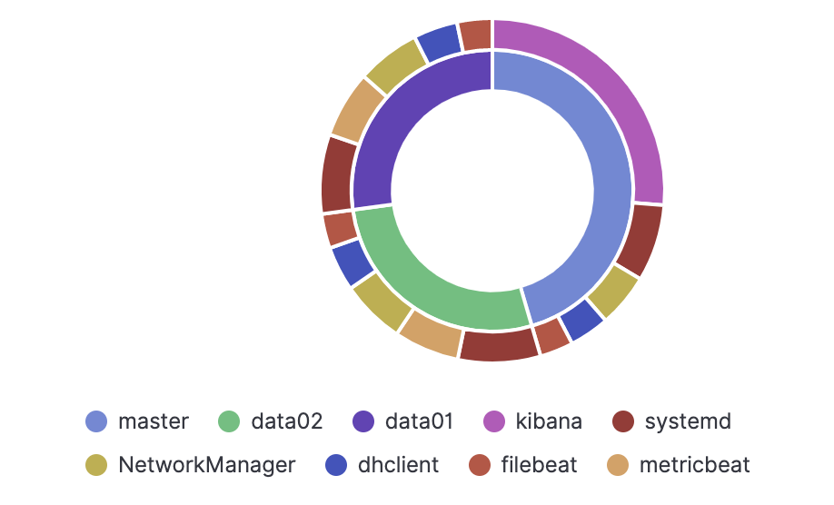
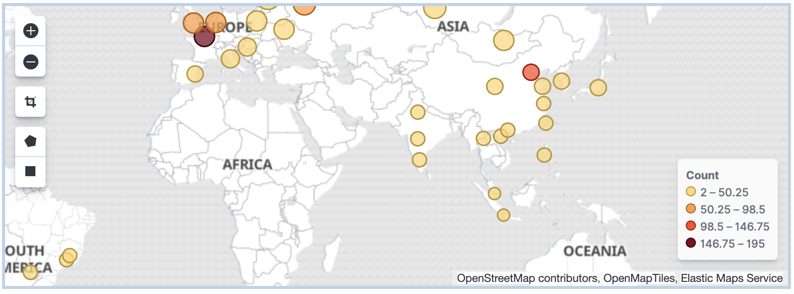
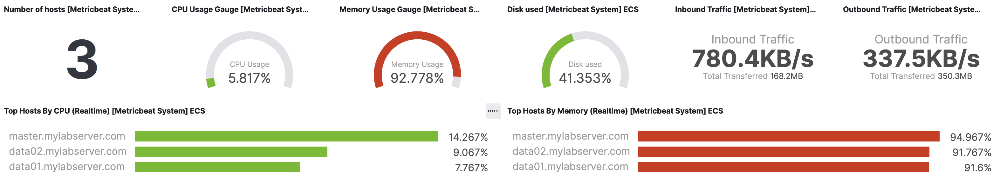
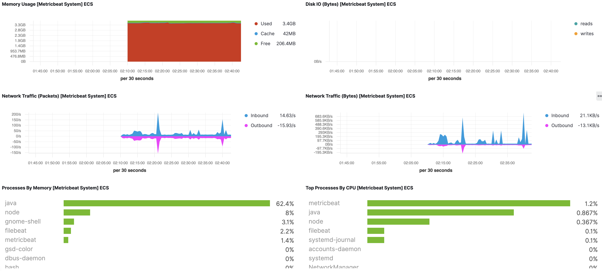

= ElasticSearch
:toc: manual

== Elastic Stack Overview

== 多节点 Elasticsearch 集群部署

=== RPM 安装

[source, bash]
.*1. 环境准备（1 master/ingress node, 2 data node）*
----
// 2 data node, 1 master/ingress node
$ for i in master data01 data02 ; do ssh $i.mylabserver.com 'hostname' ; done
master.mylabserver.com
data01.mylabserver.com
data02.mylabserver.com

// os version
$ for i in master data01 data02 ; do ssh $i.mylabserver.com 'cat /etc/redhat-release' ; done
CentOS Linux release 7.7.1908 (Core)
CentOS Linux release 7.7.1908 (Core)
CentOS Linux release 7.7.1908 (Core)
----

[source, bash]
.*2. yum 源配置（三台机器都执行）*
----
// import PGP key
rpm --import https://artifacts.elastic.co/GPG-KEY-elasticsearch

// yum repo
cat << EOF > /etc/yum.repos.d/elastic.repo
[elasticsearch]
name=Elasticsearch repository for 7.x packages
baseurl=https://artifacts.elastic.co/packages/7.x/yum
gpgcheck=1
gpgkey=https://artifacts.elastic.co/GPG-KEY-elasticsearch
enabled=0
autorefresh=1
type=rpm-md
EOF
----

[source, bash]
.*3. 安装（三台机器都执行）*
----
yum install --enablerepo=elasticsearch elasticsearch -y
systemctl enable elasticsearch.service
----

=== 配置 & 启动

依此编辑三个节点的 `/etc/elasticsearch/elasticsearch.yml` 文件，添加配置属性

[source, yaml]
.*master*
----
cluster.name: playground
node.name: master
network.host: [_local_, _site_]
discovery.seed_hosts: ["172.31.25.64"]
cluster.initial_master_nodes: ["master"]
node.master: true
node.data: false
node.ingest: true
node.ml: false
----

NOTE: `discovery.seed_hosts` is the master ip address, if multiple master node exists, there should multiple ip addresses.

[source, yaml]
.*data-1*
----
cluster.name: playground
node.name: data-1
network.host: [_local_, _site_]
discovery.seed_hosts: ["172.31.25.64"]
cluster.initial_master_nodes: ["master"]
node.master: false
node.data: true
node.ingest: false
node.ml: false
----

[source, yaml]
.*data-2*
----
cluster.name: playground
node.name: data-2
network.host: [_local_, _site_]
discovery.seed_hosts: ["172.31.25.64"]
cluster.initial_master_nodes: ["master"]
node.master: false
node.data: true
node.ingest: false
node.ml: false
----

[source, bash]
.*所有三个节点上都执行*
----
systemctl start elasticsearch && systemctl status elasticsearch
----

=== 安装验证

[source, bash]
.*1. master 节点查看日志(`/var/log/elasticsearch/playground.log`)，可以看到三个节点加入的信息*
----
[2020-03-27T15:38:37,516][INFO ][o.e.x.s.s.SecurityStatusChangeListener] [master] Active license is now [BASIC]; Security is disabled
[2020-03-27T15:39:56,902][INFO ][o.e.c.s.ClusterApplierService] [master] added {data-2}{nFF-A9j8QqOq3nKQOOBUDw}{AoJBUFO-Q4ibPcZMiLRi0A}{172.31.20.222}{172.31.20.222:9300}{d}{xpack.installed=true}, term: 1, version: 20, reason: Publication{term=1, version=20}
[2020-03-27T15:40:49,004][INFO ][o.e.c.s.ClusterApplierService] [master] added {data-1}{6UVMCBvOQTyGw1Cv4wjG-Q}{AZ3edTN1T-24NpSLySu5Yg}{172.31.17.25}{172.31.17.25:9300}{d}{xpack.installed=true}, term: 1, version: 21, reason: Publication{term=1, version=21}
----

[source, json]
.*2. 查看集群信息*
----
$ curl localhost:9200
{
  "name" : "master",
  "cluster_name" : "playground",
  "cluster_uuid" : "KU518MG4TfyAnSAa7P-4QQ",
  "version" : {
    "number" : "7.6.1",
    "build_flavor" : "default",
    "build_type" : "rpm",
    "build_hash" : "aa751e09be0a5072e8570670309b1f12348f023b",
    "build_date" : "2020-02-29T00:15:25.529771Z",
    "build_snapshot" : false,
    "lucene_version" : "8.4.0",
    "minimum_wire_compatibility_version" : "6.8.0",
    "minimum_index_compatibility_version" : "6.0.0-beta1"
  },
  "tagline" : "You Know, for Search"
}
----

[source, json]
.*3. 查看常用的命令*
----
$ curl localhost:9200/_cat
=^.^=
/_cat/allocation
/_cat/shards
/_cat/shards/{index}
/_cat/master
/_cat/nodes
/_cat/tasks
/_cat/indices
/_cat/indices/{index}
/_cat/segments
/_cat/segments/{index}
/_cat/count
/_cat/count/{index}
/_cat/recovery
/_cat/recovery/{index}
/_cat/health
/_cat/pending_tasks
/_cat/aliases
/_cat/aliases/{alias}
/_cat/thread_pool
/_cat/thread_pool/{thread_pools}
/_cat/plugins
/_cat/fielddata
/_cat/fielddata/{fields}
/_cat/nodeattrs
/_cat/repositories
/_cat/snapshots/{repository}
/_cat/templates
----

[source, json]
.*4. 查看 Nodes 信息*
----
$ curl localhost:9200/_cat/nodes?v
ip            heap.percent ram.percent cpu load_1m load_5m load_15m node.role master name
172.31.20.222           12          97   0    0.00    0.01     0.05 d         -      data-2
172.31.25.64            11          97   1    0.00    0.02     0.05 im        *      master
172.31.17.25            10          96   0    0.01    0.03     0.05 d         -      data-1
----

== Elasticsearch 集群安全加固

=== 创建证书

[source, bash]
.*1. 三个节点上创建 certs 目录*
----
mkdir /etc/elasticsearch/certs
----

[source, bash]
.*2. 生成证书（master 节点上执行）*
----
/usr/share/elasticsearch/bin/elasticsearch-certutil cert --name playground --out /etc/elasticsearch/certs/playground

ls -l /etc/elasticsearch/certs/
----

[source, bash]
.*3. 拷贝证书到 2 个数据节点*
----
for i in 1 2 ; do scp /etc/elasticsearch/certs/playground root@data0$i.mylabserver.com:/etc/elasticsearch/certs ; done
----

[source, bash]
.*4. 所有 3 个节点上执行修改权限命令*
----
chmod 640 /etc/elasticsearch/certs/playground && ls -l /etc/elasticsearch/certs/playground
----

=== Elasticsearch 安全插件及传输加密

[source, yaml]
.*1. 3 个节点上编辑 `/etc/elasticsearch/elasticsearch.yml`，添加如下安全配置*
----
xpack.security.enabled: true
xpack.security.transport.ssl.enabled: true
xpack.security.transport.ssl.verification_mode: certificate
xpack.security.transport.ssl.keystore.path: certs/playground
xpack.security.transport.ssl.truststore.path: certs/playground
----

[source, bash]
.*2. 3 个节点重启*
----
systemctl restart elasticsearch && systemctl status elasticsearch
----

[source, json]
.*3. API 查看集群节点（会失败）*
----
$ curl localhost:9200/_cat/nodes?v
{
   "error":{
      "root_cause":[
         {
            "type":"security_exception",
            "reason":"missing authentication credentials for REST request [/_cat/nodes?v]",
            "header":{
               "WWW-Authenticate":"Basic realm=\"security\" charset=\"UTF-8\""
            }
         }
      ],
      "type":"security_exception",
      "reason":"missing authentication credentials for REST request [/_cat/nodes?v]",
      "header":{
         "WWW-Authenticate":"Basic realm=\"security\" charset=\"UTF-8\""
      }
   },
   "status":401
}
----

=== 认证授权

[source, text]
.*1. master 节点执行*
----
# /usr/share/elasticsearch/bin/elasticsearch-setup-passwords interactive
Initiating the setup of passwords for reserved users elastic,apm_system,kibana,logstash_system,beats_system,remote_monitoring_user.
You will be prompted to enter passwords as the process progresses.
Please confirm that you would like to continue [y/N]y

Enter password for [elastic]: 
Reenter password for [elastic]: 
Enter password for [apm_system]: 
Reenter password for [apm_system]: 
Enter password for [kibana]: 
Reenter password for [kibana]: 
Enter password for [logstash_system]: 
Reenter password for [logstash_system]: 
Enter password for [beats_system]: 
Reenter password for [beats_system]: 
Enter password for [remote_monitoring_user]: 
Reenter password for [remote_monitoring_user]: 
Changed password for user [apm_system]
Changed password for user [kibana]
Changed password for user [logstash_system]
Changed password for user [beats_system]
Changed password for user [remote_monitoring_user]
Changed password for user [elastic]
----

NOTE: Enter a password and repeat type the pasword in interactive command line, eg, we can set one password like `password123` for all users.

[source, json]
.*2. API 查看集群节点*
----
$ curl -u elastic:password123 localhost:9200/_cat/nodes?v
ip            heap.percent ram.percent cpu load_1m load_5m load_15m node.role master name
172.31.20.222           10          96   1    0.01    0.03     0.05 d         -      data-2
172.31.17.25            10          97   1    0.00    0.01     0.05 d         -      data-1
172.31.25.64             9          95   1    0.00    0.03     0.05 im        *      master
----

== Kibana 部署

=== 安装

[source, bash]
.*1. RPM 安装*
----
yum install --enablerepo=elasticsearch kibana -y
----

[source, bash]
.*2. 配置开机启动*
----
systemctl enable kibana.service
----

=== 配置

[source, yaml]
.*1. 编辑 `/etc/kibana/kibana.yml`，配置*
----
server.port: 8080
server.host: "172.31.25.64"
elasticsearch.username: "kibana"
elasticsearch.password: "password123"
----

[source, bash]
.*2. 启动 Kibana*
----
systemctl start kibana && systemctl status kibana
----

[source, bash]
.*3. 查看启动日志*
----
less /var/log/messages | grep kibana
----

=== 登录访问

浏览器访问 http://13.233.91.208:8080 进入 kibana 登录界面。

使用 `elastic`/`password123` 可以登录 Kibana。

== Filebeat 部署

=== 安装

[source, bash]
.*1. 3 个节点执行 yum 安装*
----
yum install --enablerepo=elasticsearch filebeat -y
----

[source, bash]
.*2. 配置开机启动*
----
systemctl enable filebeat
----

=== 配置

[source, yaml]
.*1. master 上编辑 `/etc/filebeat/filebeat.yml` 添加相应配置信息*
----
setup.kibana:
  host: "172.31.25.64:8080"

output.elasticsearch:
  hosts: ["172.31.25.64:9200"]
  username: "elastic"
  password: "password123"
----

NOTE: the `output.elasticsearch.hosts` are all ingest nodes.

[source, text]
.*2. filebeat 设置*
----
# filebeat modules enable system
Enabled system

# filebeat setup
Overwriting ILM policy is disabled. Set `setup.ilm.overwrite:true` for enabling.

Index setup finished.
Loading dashboards (Kibana must be running and reachable)
Loaded dashboards
Setting up ML using setup --machine-learning is going to be removed in 8.0.0. Please use the ML app instead.
See more: https://www.elastic.co/guide/en/elastic-stack-overview/current/xpack-ml.html
Loaded machine learning job configurations
Loaded Ingest pipelines
----

[source, bash]
.*3. 启动 filebeat*
----
systemctl start filebeat && systemctl status filebeat
----

[source, bash]
.*4. 查看导入的 indices*
----
$ curl localhost:9200/_cat/indices?v -u elastic:password123
health status index                            uuid                   pri rep docs.count docs.deleted store.size pri.store.size
green  open   filebeat-7.6.1-2020.03.27-000001 glhPB8GAS5C8BNJXIHjFoA   1   1     143731            0       59mb         29.5mb
green  open   .security-7                      D0ym5eFRSl2o3SHkg9RKZA   1   1         42            0    193.6kb        104.7kb
green  open   .kibana_task_manager_1           KOUch1GmSDSS17styVYlBQ   1   1          2            0     77.7kb         34.2kb
green  open   ilm-history-1-000001             0Xrr6ptPSHeSjEuOByg1SQ   1   1          6            0     31.3kb         15.6kb
green  open   .apm-agent-configuration         oiiJSPiESISYnUS782R6bw   1   1          0            0       566b           283b
green  open   .kibana_1                        d2fVmqmpThOPIT-619IQfA   1   1       1328           51      1.4mb        738.5kb
----

*5. 在 2 个数据节点重复 1 - 3 步骤*

[source, bash]
.*6. 重新查看导入的 indices*
----
$ curl localhost:9200/_cat/indices?v -u elastic:password123
health status index                            uuid                   pri rep docs.count docs.deleted store.size pri.store.size
green  open   filebeat-7.6.1-2020.03.27-000001 glhPB8GAS5C8BNJXIHjFoA   1   1     317385            0    125.4mb         62.7mb
green  open   .security-7                      D0ym5eFRSl2o3SHkg9RKZA   1   1         42            0    193.6kb        104.7kb
green  open   .kibana_task_manager_1           KOUch1GmSDSS17styVYlBQ   1   1          2            0     77.7kb         34.2kb
green  open   ilm-history-1-000001             0Xrr6ptPSHeSjEuOByg1SQ   1   1         18            0     50.8kb         25.4kb
green  open   .apm-agent-configuration         oiiJSPiESISYnUS782R6bw   1   1          0            0       566b           283b
green  open   .kibana_1                        d2fVmqmpThOPIT-619IQfA   1   1       1328         1421      4.1mb            2mb
----

== Metricbeat 部署

=== 安装

[source, bash]
.*1. RPM 安装*
----
yum install --enablerepo=elasticsearch metricbeat -y
----

[source, bash]
.*2. 开机启动*
----
systemctl enable metricbeat
----

=== 配置

[source, yaml]
.*1. 编辑 `/etc/metricbeat/metricbeat.yml` 配置*
----
setup.kibana:
  host: "172.31.25.64:8080"

output.elasticsearch:
  hosts: ["172.31.25.64:9200"]
  username: "elastic"
  password: "password123"
----

[source, text]
.*2. 系统 metric 收集*
----
# metricbeat setup
Overwriting ILM policy is disabled. Set `setup.ilm.overwrite:true` for enabling.

Index setup finished.
Loading dashboards (Kibana must be running and reachable)
Loaded dashboards
----

[source, bash]
.*3. 启动 metricbeat*
----
systemctl start metricbeat && systemctl status metricbeat
----

[source, json]
.*4. 查看导入的 indices*
----
$ curl localhost:9200/_cat/indices?v -u elastic:password123
health status index                              uuid                   pri rep docs.count docs.deleted store.size pri.store.size
green  open   filebeat-7.6.1-2020.03.27-000001   glhPB8GAS5C8BNJXIHjFoA   1   1     412363            0    164.3mb         82.2mb
green  open   .security-7                        D0ym5eFRSl2o3SHkg9RKZA   1   1         42            0    193.6kb        104.7kb
green  open   metricbeat-7.6.1-2020.03.27-000001 4Vp5jJVLQqKgjtg-pTvq9A   1   1         32            0    237.1kb        118.5kb
green  open   .kibana_task_manager_1             KOUch1GmSDSS17styVYlBQ   1   1          2            0     77.7kb         34.2kb
green  open   ilm-history-1-000001               0Xrr6ptPSHeSjEuOByg1SQ   1   1         21            0     66.3kb         33.1kb
green  open   .apm-agent-configuration           oiiJSPiESISYnUS782R6bw   1   1          0            0       566b           283b
green  open   .kibana_1                          d2fVmqmpThOPIT-619IQfA   1   1       2483           80      5.4mb          2.7mb
----

*5. 在两个数据节点上重复如上步骤 1 - 3*

[source, bash]
.*6. 重新查看导入的 indices**
----
$ curl localhost:9200/_cat/indices?v -u elastic:password123
health status index                              uuid                   pri rep docs.count docs.deleted store.size pri.store.size
green  open   filebeat-7.6.1-2020.03.27-000001   glhPB8GAS5C8BNJXIHjFoA   1   1     413106            0    166.6mb           83mb
green  open   .security-7                        D0ym5eFRSl2o3SHkg9RKZA   1   1         42            0    193.6kb        104.7kb
green  open   metricbeat-7.6.1-2020.03.27-000001 4Vp5jJVLQqKgjtg-pTvq9A   1   1        629            0      1.2mb        658.5kb
green  open   .kibana_task_manager_1             KOUch1GmSDSS17styVYlBQ   1   1          2            0     77.7kb         34.2kb
green  open   .apm-agent-configuration           oiiJSPiESISYnUS782R6bw   1   1          0            0       566b           283b
green  open   ilm-history-1-000001               0Xrr6ptPSHeSjEuOByg1SQ   1   1         21            0     66.3kb         33.1kb
green  open   .kibana_1                          d2fVmqmpThOPIT-619IQfA   1   1       2483         1315      6.7mb          3.3mb
----

== 数据分析展示

=== filebeat system

`Dashboards` -> `[Filebeat System] Syslog dashboard ECS`

=== metricbeat system

`Dashboards` -> `[Metricbeat System] Overview ECS`

