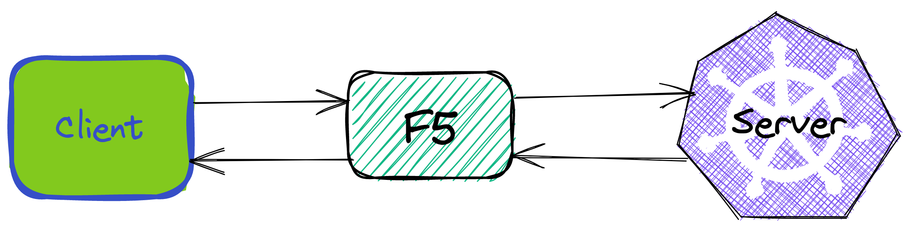
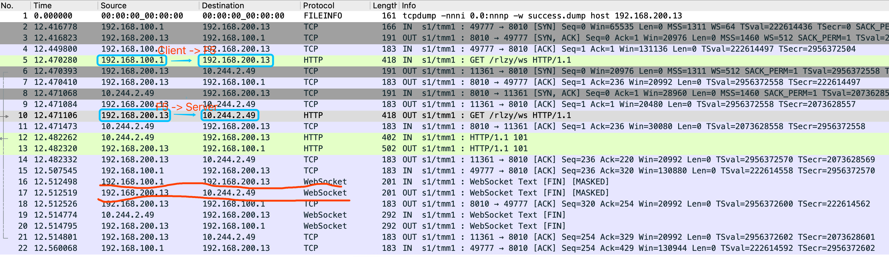
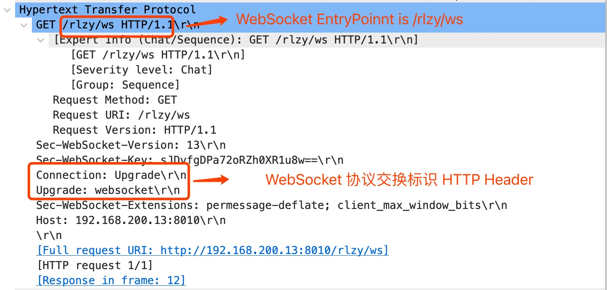

= WebSocket Debug
:toc: manual

== Deploy WebSocket

The Source code is https://github.com/kylinsoong/springboot-websocket, which contains a Java SpringBoot websocket server, and a node.js websocket Client, the precondition of *WebSocket Debug* is deploy WebSocket APP.

Assuming K8S,VE,CIS are setting up correctly, then execute:

[source, bash]
.*Deploy WebSocket Server on K8s*
----
kubectl apply -f deployments.yaml 
----

* link:deployments.yaml[deployments.yaml]

NOTE: The WebSocket Server is a single way transmission, which can pass large size no-struct message from client to server.

[source, bash]
.*Expose WebSocket Server via F5 CIS + VE*
----
kubectl apply -f cm.yaml  
----

* link:cm.yaml[cm.yaml]

NOTE: This step will expose WebSocket Server on VE with IP `192.168.200.13` and port `8010`.

[source, bash]
.*Test via WebSocket Client*
----
$ node client.js ws://192.168.200.13:8010/rlzy/ws "Hello, World"
Connect to Server via  ws://192.168.200.13:8010/rlzy/ws
{"session": "e79e5da7-6bf1-d5e0-088f-802098792cef", "msg": "Hello, World", "date": "Sun Oct 24 02:52:24 UTC 2021"}
----

NOTE: This above hints WebSocket Client and Server worked as expect.

== Websocket 协议机制及 F5 支持说明

=== 通信协商机制

由HTTP协议驱动发起协商，协商成功后转为长连接TCP跑websocket数据包，协商成功后HTTP协议不再使用

=== Ingress Controller 支持Websocket说明

通常Ingress Controller 支持 Websocket 是WebSocket 协商握手的 HTTP Switch 请求经过 Ingress Controller 时添加两个 HTTP 头属性，属性对应的值为：

* `Upgrade` -> `websocket`
* `Connection` -> `upgrade`

=== F5 支持Websocket说明

当前支持的F5 软件版本，默认 http profile可以识别websocket初始握手的HTTP过程，并在同一个vs中继续支持websocket传输
 
== Client/Server 消息传输 Debug

如上图所示：

* Client 为 Node.js, 是WebSocket客户端，基于 WebSocket 协议通过 F5 和运行在 K8S 中的WebSocket服务端通信。
* F5 为 F5 VE，和 F5 CIS一起提供容器入口服务，流量可通过 F5 VE 直达 WebSocket 服务端 POD。
* Server 为Java SpringBoot，运行在K8S中，提供 WebSocket Entrypoint。

=== 协议交换机报文传输

一次Client/Server 消息传输数据包如下所示：

* 基于 HTTP 的交换握手，和基于WebSocket的报文传输都是 Full Proxy 机制，Client到F5，以及F5到Server属于单独的连接
* 握手先于报文交换

[source,json]
.*本不是基于默认 http profile，默认支持WebSocket*
----
    {
      "class": "AS3",
      "action": "deploy",
      "persist": true,
      "declaration": {
        "class": "ADC",
        "schemaVersion": "3.21.0",
        "id": "wsserver",
        "wsserver": {
          "class": "Tenant",
          "wsserver": {
            "class": "Application",
            "template": "generic",
            "app_svc_vs": {
              "class": "Service_HTTP",
              "persistenceMethods": [ "cookie" ],
              "virtualAddresses": [
                "192.168.200.13"
              ],
              "snat": "self",
              "virtualPort": 8010,
              "pool": "wsserver_svc_pool"
            },
            "wsserver_svc_pool": {
              "class": "Pool",
              "monitors": [
                "tcp"
              ],
              "loadBalancingMode": "least-connections-member",
              "members": [
              {
                "servicePort": 8010,
                "serverAddresses": [ ]
              }
              ]
            }
          }
        }
      }
    }
----

=== 协议交换请求 HTTP 报文

* F5 http profile 将协议交换所需的 HTTP 头属性已设定完成。

=== 标准通信下 F5 VS 配置

[source, bash]
----
ltm virtual /wsserver/wsserver/app_svc_vs {
    description wsserver
    destination /wsserver/192.168.200.13:8010
    ip-protocol tcp
    mask 255.255.255.255
    partition wsserver
    persist {
        cookie {
            default yes
        }
    }
    pool /wsserver/wsserver/wsserver_svc_pool
    profiles {
        f5-tcp-progressive { }
        http { }
    }
    source 0.0.0.0/0
    source-address-translation {
        pool /wsserver/wsserver/app_svc_vs-self
        type snat
    }
    translate-address enabled
    translate-port enabled
    vs-index 422
} 
----

NOTE: http profile 可以识别 websocket 初始握手的 HTTP 过程，并可在同一个 vs 中继续支持 websocket 传输。

== WebSocket with Custom HTTP Header

[source, bash]
.*WebSocket with XFF Enable*
----
    {
      "class": "AS3",
      "action": "deploy",
      "persist": true,
      "declaration": {
        "class": "ADC",
        "schemaVersion": "3.21.0",
        "id": "wsserver",
        "wsserver": {
          "class": "Tenant",
          "wsserver": {
            "class": "Application",
            "template": "generic",
            "app_svc_vs": {
              "class": "Service_HTTP",
              "persistenceMethods": [ "cookie" ],
              "virtualAddresses": [
                "192.168.200.13"
              ],
              "profileHTTP": {
                "use": "customHTTPProfile"
              },
              "snat": "self",
              "virtualPort": 8010,
              "pool": "wsserver_svc_pool"
            },
            "customHTTPProfile": {
              "class": "HTTP_Profile",
              "xForwardedFor": true
            },
            "wsserver_svc_pool": {
              "class": "Pool",
              "monitors": [
                "tcp"
              ],
              "loadBalancingMode": "least-connections-member",
              "members": [
              {
                "servicePort": 8010,
                "serverAddresses": [ ]
              }
              ]
            }
          }
        }
      }
    }
---- 
