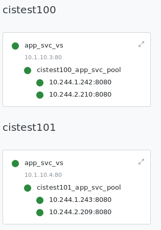

= CIS POD Restart

[source, bash]
.*1. CIS + AS3 Deploy 2 services*
----
kubectl create -f cis.yaml
kubectl apply -f deploy.yaml 
kubectl apply -f cm.1.yaml
----

The 2 services successed map to F5:

[source, bash]
.*2. Execute the following commands simultaneously to deploy 3rd service*
----
kubectl delete pod $(kubectl get pods -n bigip-ctlr --no-headers | awk '{print $1}') -n bigip-ctlr
kubectl apply -f cm.2.yaml
----

The service  get updated to F5:

[source, bash]
.*3. Force cistest101 pod restart*
----
kubectl delete pod $(kubectl get pods -n cistest101 --no-headers | awk '{print $1}') -n cistest101
----

The cistest101 pod restart update to F5:

[source, bash]
.*4. Delete all service*
----
kubectl delete -f cm.2.yaml
----

The all 3 virtual services be delete from F5.

