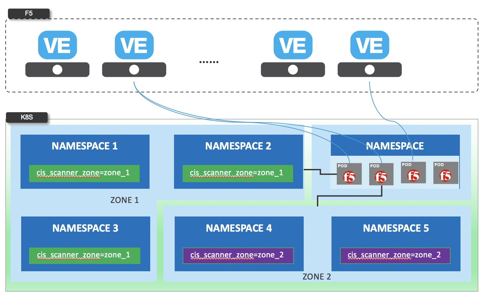
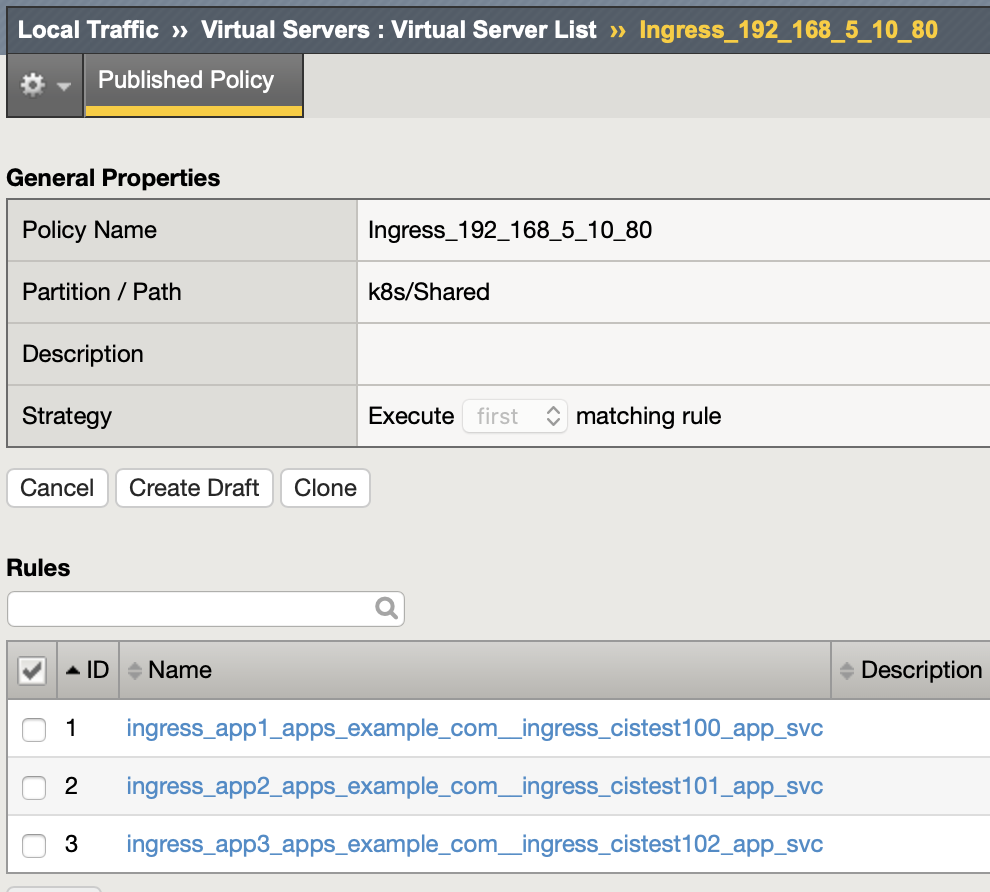
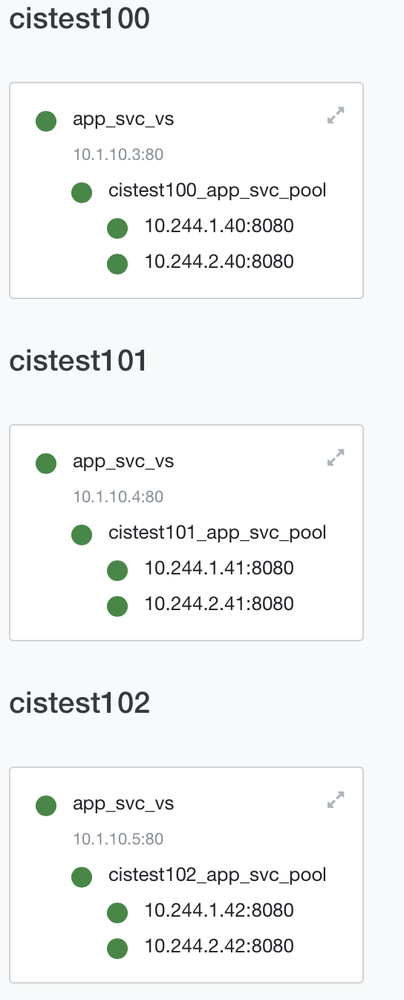

= 配置
:toc: manual

== Namespaces isolation

=== namespace label

As depicted in below figure:

* 同一个 K8S 内，一个 CIS 可只监控一个分区，多个 CIS 并行工作，确保了容器计算层 CIS 的性能
* 同一个 K8S 内的 Service 可以发布到不同的 F5 HW/VE，确保了容器路由层 F5 的性能

[source, bash]
.*1. cis argument*
----
"--namespace-label=cis_scanner_zone=zone_1",
----

[source, bash]
.*2. Get Code*
----
git clone https://github.com/cloudadc/container-ingress.git
cd container-ingress/f5-cis/namespaces-isolation
----

[source, bash]
.*3. Deploy 4 apps within 4 namespaces*
----
kubectl create -f cis.yaml

$ kubectl get ns --show-labels | grep cistest10*
cistest100        Active   78s     cis_scanner_zone=zone_1
cistest101        Active   78s     cis_scanner_zone=zone_1
cistest102        Active   78s     cis_scanner_zone=zone_1
cistest103        Active   78s     <none>
----

the first 3 namespace has cis_scanner_zone, the cistest103 didn't.

[source, bash]
.*4. deploy ingresses*
----
kubectl apply -f ingress.yaml
----

there will be 4 ingress object created, only the first 3 will deploy to F5 due to the namespace isolation.

[source, bash]
.*5. deploy configmap*
----
kubectl apply -f cm.yaml
----

there will be 4 configmaps created, only the first 3 will deploy to F5 due to the namespace isolation.

[source, bash]
.*5. deploy configmap*
----
kubectl apply -f cm.yaml
----

there will be 4 configmaps created, only the first 3 will deploy to F5 due to the namespace isolation.

=== explicit namespace

Using the explicit namespace to implement isolation, the only difference is cis argument, below is an example of explicit namespace isolation:

[source, bash]
----
"--namespace=cistest01",
"--namespace=cistest02",
"--namespace=cistest03",
----

== CIS Robust

=== Re-create CIS POD

[source, bash]
----
// CIS + AS3 Deploy 2 services
kubectl create -f cis.yaml
kubectl apply -f deploy.yaml
kubectl apply -f cm.1.yaml

// Execute the following commands simultaneously to deploy 3rd service
kubectl delete pod $(kubectl get pods -n bigip-ctlr --no-headers | awk '{print $1}') -n bigip-ctlr
kubectl apply -f cm.2.yaml

// Force cistest101 pod restart
kubectl delete pod $(kubectl get pods -n cistest101 --no-headers | awk '{print $1}') -n cistest101

//Delete all service
kubectl delete -f cm.2.yaml
----

Refer to link:cis-pod-restart/README.adoc[link] for more details.

=== Re-start F5 VE

Refer to link:f5-restart/README.adoc[link] for detailed steps.

== 性能调优
:toc: manual

=== 调优前后性能对比

[source, text]
----
Stage,Create,Delete
Beofre Tunning,115,175
After Tunning, 110,165
----

=== 调优

.*调优前后参数对比*
|===
|参数|调优前|调优后
|provision.extramb
|500
|1000

|restjavad.useextramb
|false
|true

|maxMessageBodySize
|
|134217728
|===

[source, bash]
.*调优步骤*
----
tmsh modify sys db provision.extramb value 1000
tmsh modify sys db restjavad.useextramb value true
tmsh save sys config

curl -s -f -u admin:F5demo@666 -H "Content-Type: application/json" -d '{"maxMessageBodySize":134217728}' -X POST http://localhost:8100/mgmt/shared/server/messaging/settings/8100
----
