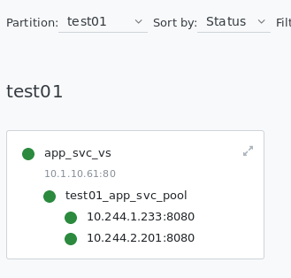
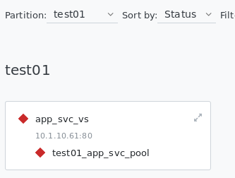

= Duplicate Label

[source, bash]
.*1. CIS + AS3 Deploy 1st service*
----
kubectl create -f cis.yaml
kubectl apply -f deploy.yaml 
kubectl apply -f cm.yaml
----

The Service successed map to F5:

[source, bash]
.*2. Create another service with the same label in Step 1*
----
kubectl create -f duplicate-label.yaml
----

The Service get offline:

[source, bash]
.*3. Check the CIS Pod log*
----
2020/07/06 15:20:30 [ERROR] [CORE] Multiple Services are tagged for this pool. Ignoring all endpoints.
Service: app-svc, Namespace: test01 
Service: app-svc, Namespace: test02 
----
