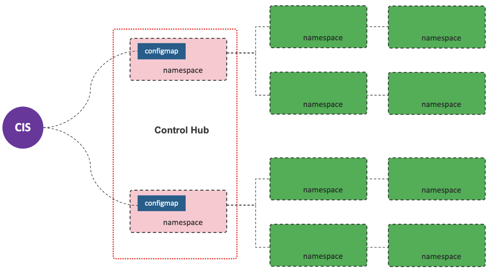

= F5 CIS Installation
:toc: manual

== Installation

=== Install on kube-system

[source, bash]
.*Install*
----
kubectl create secret generic bigip-login --from-literal=username=admin --from-literal=password=admin -n kube-system
kubectl create serviceaccount bigip-ctlr -n kube-system
kubectl create -f rbac.yaml
kubectl create -f cis.yaml
----

* link:files/install-on-kube-system/cis.yaml[cis.yaml]
* link:files/install-on-kube-system/rbac.yaml[rbac.yaml]

[source, bash]
.*Uninstall*
----
cd install-on-kube-system/
kubectl delete -f cis.yaml
kubectl delete -f rbac.yaml
kubectl delete serviceaccount bigip-ctlr -n kube-system
kubectl delete secret bigip-login -n kube-system
----

=== Install on bigip-ctlr

[source, bash]
.*Install*
----
kubectl create ns bigip-ctlr
kubectl create secret generic bigip-login --from-literal=username=admin --from-literal=password=admin -n bigip-ctlr
kubectl create serviceaccount bigip-ctlr -n bigip-ctlr
kubectl create -f rbac.yaml
kubectl create -f cis.yaml
----

* link:files/install-on-bigip-ctlr/cis.yaml[cis.yaml]
* link:files/install-on-bigip-ctlr/rbac.yaml[rbac.yaml]
* link:files/install-on-bigip-ctlr/rbac-small.yaml[rbac-small.yaml]

[source, bash]
.*Uninstall*
----
cd install-on-bigip-ctlr/
kubectl delete -f cis.yaml
kubectl delete -f rbac.yaml
kubectl delete serviceaccount bigip-ctlr -n bigip-ctlr
kubectl delete secret bigip-login -n bigip-ctlr
kubectl delete ns bigip-ctlr
----

== livenessProbe & readinessProbe

This page provide an example of CIS Pod with livenessProbe & readinessProbe.

* Full Deployment YAML - link:files/cis-probe.yaml[cis-probe.yaml]

[source, yaml]
.*Key Config*
----
          livenessProbe:
            failureThreshold: 3
            httpGet:
              path: /health
              port: 8080
              scheme: HTTP
            initialDelaySeconds: 15
            periodSeconds: 15
            successThreshold: 1
            timeoutSeconds: 15
          readinessProbe:
            failureThreshold: 3
            httpGet:
              path: /health
              port: 8080
              scheme: HTTP
            initialDelaySeconds: 30
            periodSeconds: 30
            successThreshold: 1
            timeoutSeconds: 15
----

== Integrate CIS with flannel （etcd mode, docker0 network）

Refer to link:solutions/flannel-etcd-mode.adoc[flannel-etcd-mode] for detailed steps.

== Install on bigip-ctlr flannel vxlan Control Hub Mode

=== What's Control Hub Mode

Control Hub Mode is mainly for Ops Convenient, which use a Control Hub(one or multiple namespaces) to hold CIS configmap only.

=== Setup on F5 VE

[source, bash]
.*1. 创建 partition*
----
create auth partition kubernetes
----

[source, bash]
.*2. 创建 VxLan 隧道*
----
create net tunnels vxlan fl-vxlan port 8472 flooding-type none description none defaults-from vxlan app-service none
create net tunnels tunnel flannel_vxlan { app-service none key 1 local-address 192.168.6.120 profile fl-vxlan remote-address any secondary-address any }
create net self self_flannel_vxlan { address 10.244.20.100/16 vlan flannel_vxlan allow-service all traffic-group traffic-group-local-only }
create net self floating_flannel_vxlan { address 10.244.20.10/16 allow-service all vlan flannel_vxlan traffic-group traffic-group-local-only }
save sys config
show net tunnels tunnel flannel_vxlan all-properties

create net tunnels vxlan fl-vxlan port 8472 flooding-type none
create net tunnels tunnel flannel_vxlan key 1 profile fl-vxlan local-address 192.168.200.208
create net self 10.244.20.100 address 10.244.20.100/16 allow-service none vlan flannel_vxlan 
save sys config
show net tunnels tunnel flannel_vxlan all-properties
----

=== Setup on K8s

[source, bash]
.*1. Install*
----
kubectl create ns bigip-ctlr
kubectl create secret generic bigip-login --from-literal=username=admin --from-literal=password=admin -n bigip-ctlr
kubectl create serviceaccount bigip-ctlr -n bigip-ctlr
kubectl create -f rbac.yaml
kubectl create -f cis.yaml
----

* link:files/install-on-bigip-ctlr-vxlan/rbac.yaml[rbac.yaml]
* link:files/install-on-bigip-ctlr-vxlan/cis.yaml[cis.yaml]

[source, bash]
.*2. 创建 Big-IP Node* 
----
kubectl apply -f bigip-node.yaml
----

* link:link:files/install-on-bigip-ctlr-vxlan/bigip-node.yaml[bigip-node.yaml]

[source, bash]
.*3. 查看日志* 
----
kubectl logs -f $(kubectl get pods -n bigip-ctlr --no-headers | awk '{print $1}') -n bigip-ctlr
----

=== 部署测试应用

[source, bash]
.*1. 部署测试应用* 
----
kubectl apply -f deploy.yaml
----

* link:files/install-on-bigip-ctlr-vxlan/deploy.yaml[deploy.yaml]

[source, bash]
.*2. 创建 CIS Configmap* 
----
kubectl apply -f cm.yaml 
----
* link:files/install-on-bigip-ctlr-vxlan/cm.yaml[cm.yaml]

[source, bash]
.*3. 查看日志输出* 
----
$ kubectl logs -f $(kubectl get pods -n bigip-ctlr --no-headers | awk '{print $1}') -n bigip-ctlr
...
2021/05/12 11:27:27 [INFO] [CCCL] Successfully Sent the FDB Records
2021/05/12 11:27:29 [INFO] [2021-05-12 11:27:29,320 f5_cccl.resource.resource INFO] Updating ApiFDBTunnel: /Common/flannel_vxlan
2021/05/12 11:27:45 [INFO] [2021-05-12 11:27:45,726 f5_cccl.resource.resource INFO] Creating ApiArp: /Common/k8s-10.244.1.47
2021/05/12 11:31:06 [INFO] [CCCL] Successfully Sent the FDB Records
2021/05/12 11:31:24 [INFO] [2021-05-12 11:31:24,519 f5_cccl.resource.resource INFO] Creating ApiArp: /Common/k8s-10.244.1.49
----

=== TroubleShoting

[source, bash]
.*1. FDB* 
----
# show net fdb 

---------------------------------------------------------------------
Net::FDB     
Tunnel         Mac Address        Member                      Dynamic
---------------------------------------------------------------------
flannel_vxlan  16:73:97:7f:83:28  endpoint:192.168.200.210%0  no
flannel_vxlan  e2:85:68:42:be:b7  endpoint:192.168.200.211%0  no
----

[source, bash]
.*2. ARP* 
----
# show net arp

-------------------------------------------------------------------------------------------------------
Net::Arp               
Name                     Address          HWaddress          Vlan               Expire-in-sec  Status
-------------------------------------------------------------------------------------------------------
/Common/k8s-10.244.1.47  10.244.1.47      e2:85:68:42:be:b7  -                  -              static
/Common/k8s-10.244.1.49  10.244.1.49      e2:85:68:42:be:b7  -                  -              static
----

[source, bash]
.*3. 抓包*
----
tcpdump -nni flannel_vxlan icmp
tcpdump -nni  0.0:nnnp -s0 host ip and port  -w  /var/tmp/zhuabao.pcap  –vvv
----

=== 访问服务

[source, bash]
----
$ curl 192.168.200.34/coffee
Server address: 10.244.1.47:8080
Server name: app-1-7f4585dc79-l6sx4
Date: 12/May/2021:11:35:07 +0000
URI: /coffee
Request ID: 03f319a0fde3233c478e16e34115386e
----
