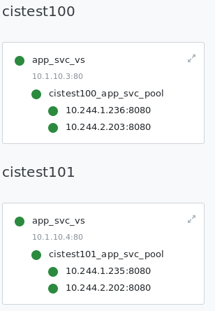

= Namespace Isolation

[source, bash]
.*1. CIS + AS3 Deploy 2 service*
----
kubectl create -f cis.yaml
kubectl apply -f deploy.yaml 
kubectl apply -f cm.yaml
----

The Service successed map to F5:

[source, bash]
.*2. Scale the cistest101 service from 2 pod to 4 pod*
----
kubectl apply -f deploy02.yaml

kubectl get pods -n cistest101 -o wide
NAME                  READY   STATUS    RESTARTS   AGE    IP             NODE    NOMINATED NODE   READINESS GATES
app-58866f5c7-bcg9f   1/1     Running   0          114s   10.244.2.206   k8s-3   <none>           <none>
app-58866f5c7-pxdrs   1/1     Running   0          114s   10.244.1.239   k8s-2   <none>           <none>
app-58866f5c7-qtkfd   1/1     Running   0          23m    10.244.1.235   k8s-2   <none>           <none>
app-58866f5c7-xddn9   1/1     Running   0          23m    10.244.2.202   k8s-3   <none>           <none> 
----

Check the F5 the cistest101's change never be update to F5

