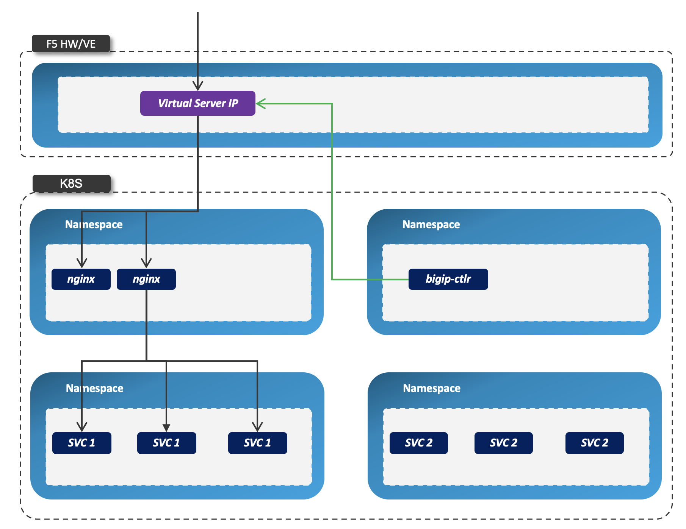
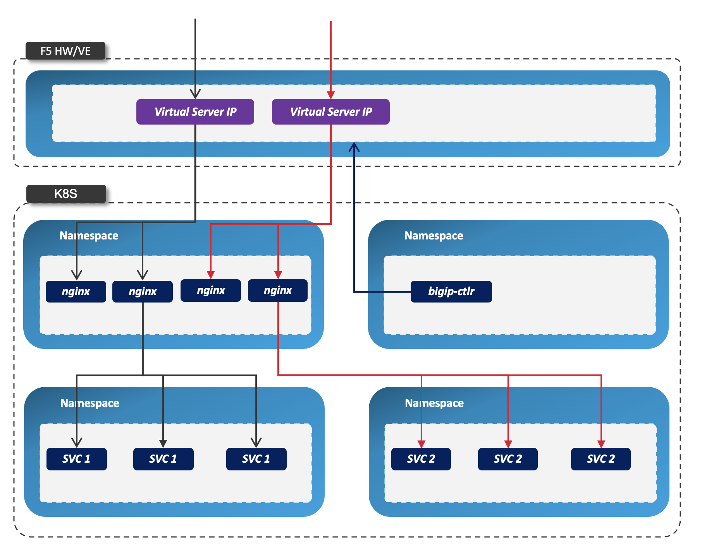

= Deployment Architectures
:toc: manual

== BIG-IP with Cluster-wide Ingress Controller

=== Architectures

* Nginx Controller has multiple replicas
* Nginx Controller play as cluster-wide ingress control
* BIGIP Virtual Server IP is the external enterence for all nginx replicas
* `bigip-ctlr` deploy BIGIP Virtual Server nginx pod as pool member

[source, bash]
.*Get Code*
----
git clone https://github.com/cloudadc/container-ingress.git
cd container-ingress/nginx-ingress/bigip/cluster-wide/
----

[source, bash]
.*Set up*
----
// 1. deploy cluster wide nginx ingress controller
kubectl apply -f ns-and-sa.yaml
kubectl apply -f rbac.yaml
kubectl apply -f default-server-secret.yaml
kubectl apply -f nginx-config.yaml
kubectl apply -f vs-definition.yaml
kubectl apply -f vsr-definition.yaml
kubectl apply -f ts-definition.yaml
kubectl apply -f nginx-ingress.yaml

// 2. deploy bigip controller
kubectl create ns bigip-ctlr
kubectl create secret generic bigip-login --from-literal=username=admin --from-literal=password=admin.F5demo.com -n bigip-ctlr
kubectl create serviceaccount bigip-ctlr -n bigip-ctlr
kubectl apply -f rbac-cis.yaml
kubectl apply -f cis-nginx.yaml
kubectl apply -f nginx-ingress-svc.yaml
kubectl apply -f nginx-ingress-configmap.yaml
----

=== Examples

[source, bash]
.*1. Set up*
----
kubectl apply -f example-deploy.yaml
kubectl apply -f example-ingress.yaml
----

[source, bash]
.*3. Check the nginx ingress controller pod log, all ingress be registered on each controller*
----
for i in $(kubectl get pods -n nginx-ingress --no-headers | awk '{print $1}') ; do echo "$ kubectl logs $i -n nginx-ingress | grep nginxtest" ; kubectl logs $i -n nginx-ingress | grep nginxtest ; echo ; done
----

[source, bash]
.*4. Test*
----
for i in 1 2 3 4 ; do curl http://nginxtest0$i.example.com/coffee ; echo ; done
for i in 1 2 3 4 ; do curl http://nginxtest0$i.example.com/tea ; echo ; done
----

[source, bash]
.*5. Check nginx access log*
----
for i in $(kubectl get pods -n nginx-ingress --no-headers | awk '{print $1}') ; do echo "$ kubectl logs $i -n nginx-ingress | grep coffee" ; kubectl logs $i -n nginx-ingress | grep coffee ; echo ; done
$ kubectl logs nginx-ingress-658848c866-q9hmb -n nginx-ingress | grep coffee
10.1.10.61 - - [12/Jul/2020:10:15:50 +0000] "GET /coffee HTTP/1.1" 200 161 "-" "curl/7.29.0" "-"

$ kubectl logs nginx-ingress-658848c866-wgq7b -n nginx-ingress | grep coffee
10.1.10.61 - - [12/Jul/2020:10:15:50 +0000] "GET /coffee HTTP/1.1" 200 162 "-" "curl/7.29.0" "-"

$ kubectl logs nginx-ingress-658848c866-z9tcd -n nginx-ingress | grep coffee
10.1.10.61 - - [12/Jul/2020:10:15:50 +0000] "GET /coffee HTTP/1.1" 200 162 "-" "curl/7.29.0" "-"
10.1.10.61 - - [12/Jul/2020:10:15:50 +0000] "GET /coffee HTTP/1.1" 200 162 "-" "curl/7.29.0" "-"

for i in $(kubectl get pods -n nginx-ingress --no-headers | awk '{print $1}') ; do echo "$ kubectl logs $i -n nginx-ingress | grep tea" ; kubectl logs $i -n nginx-ingress | grep tea ; echo ; done
$ kubectl logs nginx-ingress-658848c866-q9hmb -n nginx-ingress | grep tea
10.1.10.61 - - [12/Jul/2020:10:16:37 +0000] "GET /tea HTTP/1.1" 200 155 "-" "curl/7.29.0" "-"

$ kubectl logs nginx-ingress-658848c866-wgq7b -n nginx-ingress | grep tea
10.1.10.61 - - [12/Jul/2020:10:16:37 +0000] "GET /tea HTTP/1.1" 200 156 "-" "curl/7.29.0" "-"

$ kubectl logs nginx-ingress-658848c866-z9tcd -n nginx-ingress | grep tea
10.1.10.61 - - [12/Jul/2020:10:16:36 +0000] "GET /tea HTTP/1.1" 200 156 "-" "curl/7.29.0" "-"
10.1.10.61 - - [12/Jul/2020:10:16:37 +0000] "GET /tea HTTP/1.1" 200 156 "-" "curl/7.29.0" "-"
----

NOTE: The 4 continue request be 3 nginx controller with `Least Connections Member` algorithm.

[source, bash]
.*6. Check config change*
----
kubectl exec -it nginx-ingress-658848c866-z9tcd -n nginx-ingress -- bash
$ cd /etc/nginx/conf.d/
$ ls 
nginxtest01-cafe-ingress.conf  nginxtest02-cafe-ingress.conf  nginxtest03-cafe-ingress.conf  nginxtest04-cafe-ingress.conf

$ cat nginxtest01-cafe-ingress.conf 

upstream nginxtest01-cafe-ingress-nginxtest01.example.com-coffee-svc-80 {
	zone nginxtest01-cafe-ingress-nginxtest01.example.com-coffee-svc-80 256k;
	random two least_conn;
	
	server 10.244.1.21:8080 max_fails=1 fail_timeout=10s max_conns=0;
	server 10.244.2.235:8080 max_fails=1 fail_timeout=10s max_conns=0;
	
}

upstream nginxtest01-cafe-ingress-nginxtest01.example.com-tea-svc-80 {
	zone nginxtest01-cafe-ingress-nginxtest01.example.com-tea-svc-80 256k;
	random two least_conn;
	
	server 10.244.1.13:8080 max_fails=1 fail_timeout=10s max_conns=0;
	server 10.244.2.228:8080 max_fails=1 fail_timeout=10s max_conns=0;
	server 10.244.2.230:8080 max_fails=1 fail_timeout=10s max_conns=0;
}

server {
	listen 80;
	server_tokens on;
	server_name nginxtest01.example.com;
	
	location /tea {
		proxy_http_version 1.1;
		proxy_connect_timeout 60s;
		proxy_read_timeout 60s;
		proxy_send_timeout 60s;
		client_max_body_size 1m;
		proxy_set_header Host $host;
		proxy_set_header X-Real-IP $remote_addr;
		proxy_set_header X-Forwarded-For $proxy_add_x_forwarded_for;
		proxy_set_header X-Forwarded-Host $host;
		proxy_set_header X-Forwarded-Port $server_port;
		proxy_set_header X-Forwarded-Proto $scheme;
		proxy_buffering on;
		proxy_pass http://nginxtest01-cafe-ingress-nginxtest01.example.com-tea-svc-80;
	}

	location /coffee {
		proxy_http_version 1.1;
		proxy_connect_timeout 60s;
		proxy_read_timeout 60s;
		proxy_send_timeout 60s;
		client_max_body_size 1m;
		proxy_set_header Host $host;
		proxy_set_header X-Real-IP $remote_addr;
		proxy_set_header X-Forwarded-For $proxy_add_x_forwarded_for;
		proxy_set_header X-Forwarded-Host $host;
		proxy_set_header X-Forwarded-Port $server_port;
		proxy_set_header X-Forwarded-Proto $scheme;
		proxy_buffering on;
		proxy_pass http://nginxtest01-cafe-ingress-nginxtest01.example.com-coffee-svc-80;
	}
}
----

== BIG-IP with Single-namespace Ingress Controller

=== Architectures

* Each namespace has reference a nginx controller
* Each nginx Controller has multiple replicas
* Nginx Controller play as single-namespace ingress control
* BIGIP Virtual Server IP is the external enterence
* `bigip-ctlr` deploy BIGIP Virtual Server nginx pod as pool member

[source, bash]
.*Get Code*
----
git clone https://github.com/cloudadc/container-ingress.git
cd container-ingress/nginx-ingress/bigip/single-namespace/
----

[source, bash]
.*Set up*
----
// 1. deploy single namespace nginx ingress controller
kubectl apply -f ns-and-sa.yaml
kubectl apply -f rbac.yaml
kubectl apply -f default-server-secret.yaml
kubectl apply -f nginx-config.yaml
kubectl apply -f vs-definition.yaml
kubectl apply -f vsr-definition.yaml
kubectl apply -f ts-definition.yaml
kubectl apply -f nginx-ingress-test01.yaml
kubectl apply -f nginx-ingress-test02.yaml

// 2. deploy bigip controller
kubectl create ns bigip-ctlr
kubectl create secret generic bigip-login --from-literal=username=admin --from-literal=password=admin.F5demo.com -n bigip-ctlr
kubectl create serviceaccount bigip-ctlr -n bigip-ctlr
kubectl apply -f rbac-cis.yaml
kubectl apply -f cis-nginx.yaml
kubectl apply -f nginx-ingress-svc.yaml
kubectl apply -f nginx-ingress-configmap.yaml
----

=== Examples

[source, bash]
.*1. Set up*
----
kubectl apply -f example-deploy.yaml
kubectl apply -f example-ingress.yaml
---- 

[source, bash] 
.*2. Test* 
----
curl http://nginxtest01.example.com/coffee
curl http://nginxtest01.example.com/tea

curl http://nginxtest02.example.com/coffee
curl http://nginxtest02.example.com/tea
---- 

== BIG-IP with Ingress Controller for Specific Ingress Class

=== Architectures

* Multiple nginx controller work parallel
* Each nginx Controller has multiple replicas
* Nginx Controller for specific ingress class
* BIGIP Virtual Server IP is the external enterence 
* `bigip-ctlr` deploy BIGIP Virtual Server nginx pod as pool member

[source, bash]
.*Get Code*
----
git clone https://github.com/cloudadc/container-ingress.git
cd container-ingress/nginx-ingress/bigip/specific-ingress-class/
----

.*Set up*
----
// 1. deploy Ingress Controller for Specific Ingress Class
kubectl apply -f ns-and-sa.yaml
kubectl apply -f rbac.yaml
kubectl apply -f default-server-secret.yaml
kubectl apply -f nginx-config.yaml
kubectl apply -f vs-definition.yaml
kubectl apply -f vsr-definition.yaml
kubectl apply -f ts-definition.yaml
kubectl apply -f nginx-ingress.yaml
kubectl apply -f nginx-ingress-fintech.yaml

// 2. deploy bigip controller
kubectl create ns bigip-ctlr
kubectl create secret generic bigip-login --from-literal=username=admin --from-literal=password=admin.F5demo.com -n bigip-ctlr
kubectl create serviceaccount bigip-ctlr -n bigip-ctlr
kubectl apply -f rbac-cis.yaml
kubectl apply -f cis-nginx.yaml
kubectl apply -f nginx-ingress-svc.yaml
kubectl apply -f nginx-ingress-configmap.yaml
----

=== Examples

[source, bash]
.*1. Set up*
----
kubectl apply -f example-deploy.yaml
kubectl apply -f example-ingress.yaml
kubectl apply -f example-ingress-fintech.yaml
----

[source, bash]
.*2. Test*
----
for i in {1..10} ; do curl http://nginxtest01.example.com/coffee ; curl http://nginxtest01.example.com/tea ; curl http://nginxtest02.example.com/coffee ; curl http://nginxtest02.example.com/tea ; done

for i in {1..10} ; do curl http://nginxtest03.example.com/coffee ; curl http://nginxtest03.example.com/tea ; curl http://nginxtest04.example.com/coffee ; curl http://nginxtest04.example.com/tea ; done
----
