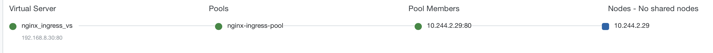

= What's this
:toc: manual

F5 Nginx Plus Ingress Controller.

== Installation

=== Image Building

F5 Nginx Plus Ingress Controller need build from source code.

Refer to https://docs.nginx.com/nginx-ingress-controller/installation/building-ingress-controller-image/ for building the Ingress Controller Image.

A valid license is necessary for image buliding, apply a Nginx plus envaluation license to start image building.

[source, bash]
.*Check the license*
----
openssl x509 -in nginx-repo.crt -noout -text
----

=== Installing

Refer to https://docs.nginx.com/nginx-ingress-controller/installation/installation-with-manifests to install Nginx Plus Ingress Controller.

==== 1.9.0

* 下载 - link:install/nginx-plus-1.9.0.yaml[nginx-plus-1.9.0.yaml]
* 下载 - link:install/nginx-plus-nap-1.9.0.yaml[nginx-plus-nap-1.9.0.yaml]
* 下载 - link:install/test.yml[test.yml]

[source, bash]
.*1. Deploy Nginx Plus IC*
----
kubectl apply -f nginx-plus-1.9.0.yaml 
----

[source, bash]
.*2. Deploy Nginx Plus IC with NAP*
----
kubectl apply -f nginx-plus-nap-1.9.0.yaml
----

[source, bash]
.*3. Deploy Test App*
----
kubectl apply -f test.yml
----

[source, bash]
.*4. Test*
----
$ kubectl get svc nginx-ingress-test -n nginx-ingress --no-headers
nginx-ingress-test   NodePort   10.100.246.1   <none>   80:31803/TCP,443:32164/TCP,8898:30702/TCP   25m

$ curl --resolve nginxtest.example.com:31803:192.168.5.30 http://nginxtest.example.com:31803/coffee
Server address: 10.244.2.8:8080
Server name: coffee-688fbd68f8-dvwh6
Date: 13/Nov/2020:04:45:42 +0000
URI: /coffee
Request ID: 1adf9cb667016bfcb9e2ff02da1a9e68
----

==== 1.8.1

[source, bash]
.*1. Get Code*
----
git clone https://github.com/nginxinc/kubernetes-ingress/
cd kubernetes-ingress/deployments
git checkout v1.8.1
----

[source, bash]
.*2. Configure RBAC*
----
kubectl apply -f common/ns-and-sa.yaml
kubectl apply -f rbac/rbac.yaml
kubectl apply -f rbac/ap-rbac.yaml
----

[source, bash]
.*3. Create Common Resources*
----
kubectl apply -f common/default-server-secret.yaml
kubectl apply -f common/nginx-config.yaml

kubectl apply -f common/vs-definition.yaml
kubectl apply -f common/vsr-definition.yaml
kubectl apply -f common/ts-definition.yaml
kubectl apply -f common/policy-definition.yaml

kubectl apply -f common/gc-definition.yaml
kubectl apply -f common/global-configuration.yaml

kubectl apply -f common/ap-logconf-definition.yaml 
kubectl apply -f common/ap-policy-definition.yaml 
----

[source, bash]
.*4. Deploy the Ingress Controller*
----
kubectl apply -f deployment/nginx-plus-ingress.yaml
----

NOTE: Modify the `deployment/nginx-plus-ingress.yaml` file to change the image name is necessary before execute deploying.

[source, bash]
.*5. Verify the installation*
----
kubectl get pods -n nginx-ingress
----

=== Exposing to F5

F5 Virtual Server provide a public IP used as unified enterence for Nginx Plus Ingress Controller.

*1. Setup F5 CIS*

Refer to link:../f5-cis/README.adoc[链接] to set up F5 CIS.

*2. Expose to F5*

* 下载 - link:install/expose-to-f5.yaml[expose-to-f5.yaml] 

[source, bash]
----
kubectl apply -f expose-to-f5.yaml 
----

*3. Verify the installation*

From the F5 UI, check the Virtual Server and referenced Pool member:

* `192.168.8.30:80` - is the public IP and Port used to access the Nginx Plus ingress controller
* `10.244.2.29:80`  - is the container IP and Port exposed by Nginx Plus ingress controller Pod.

== Coffee Tea Example

This section will deploy the Coffee Tea Example to the environment installed above.

[source, bash]
.*1. Get Code*
----
git clone https://github.com/cloudadc/container-ingress.git
cd container-ingress/nginx-plus-ingress/coffee-tea/
----

[source, bash]
.*2. Set up*
----
kubectl apply -f cafe.yaml
kubectl create -f cafe-ingress.yaml
----

[source, bash]
.*3. Test*
----
$ curl http://cafe.example.com/coffee
Server address: 10.244.2.221:8080
Server name: coffee-67c6f7c5fd-thlc8
Date: 11/Jul/2020:17:31:26 +0000
URI: /coffee
Request ID: 49b7f783e298387eaeed05f8e493b583

$ curl http://cafe.example.com/tea
Server address: 10.244.1.5:8080
Server name: tea-7df475c6-nbdrs
Date: 11/Jul/2020:17:31:33 +0000
URI: /tea
Request ID: d8344e70dfe8627d67a136c701851573
----

