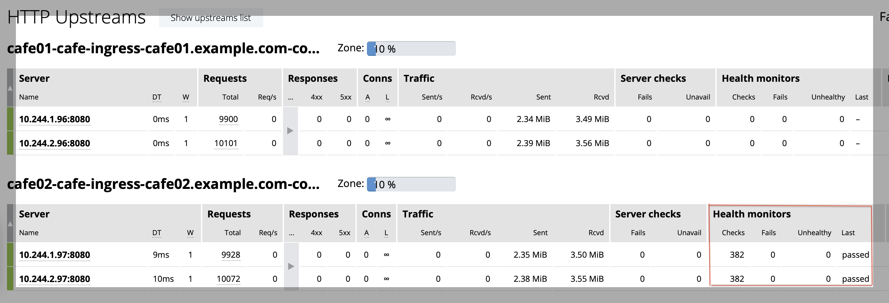

= Active Health Checks
:toc: manual

== What's this?

NGINX Plus supports Active Health Checks, To use active health checks in the Ingress controller:

[source, bash]
.*1. HTTP Readiness Probe in the templates of your application pods*
----
apiVersion: apps/v1
kind: Deployment
metadata:
  name: coffee
...
        readinessProbe:
          httpGet:
            port: 8080
            path: /healthz/coffee
            httpHeaders:
            - name: header1
              value: "Active Health Checks"
            - name: header2
              value: "123"
          initialDelaySeconds: 1
          periodSeconds: 5
          timeoutSeconds: 4
          successThreshold: 2
          failureThreshold: 3
----

[source, bash]
.*2. Enable Active Health Checks with annotations*
----
nginx.com/health-checks: "true"
nginx.com/health-checks-mandatory: "true"
nginx.com/health-checks-mandatory-queue: "500"
----

In this section, we will deploy 2 services, on without active health checks, another enabled active health checks.

== Deploy 2 services

[source, bash]
.*Execute the below commands:*
----
kubectl apply -f deploy.yaml 
kubectl apply -f ingress.yaml
----

* link:deploy.yaml[deploy.yaml]
* link:ingress.yaml[ingress.yaml]

== config difference

[source, bash]
.*cafe01-cafe-ingress.conf*
----
upstream cafe01-cafe-ingress-cafe01.example.com-coffee-svc-80 {
	zone cafe01-cafe-ingress-cafe01.example.com-coffee-svc-80 256k;
	random two least_conn;
	server 10.244.1.96:8080 max_fails=1 fail_timeout=10s max_conns=0;
	server 10.244.2.96:8080 max_fails=1 fail_timeout=10s max_conns=0;
}

server {
	listen 80;
	server_tokens "on";
	server_name cafe01.example.com;
	status_zone cafe01.example.com;
	
	location /coffee {
		proxy_http_version 1.1;
		proxy_connect_timeout 60s;
		proxy_read_timeout 60s;
		proxy_send_timeout 60s;
		client_max_body_size 1m;
		proxy_set_header Host $host;
		proxy_set_header X-Real-IP $remote_addr;
		proxy_set_header X-Forwarded-For $proxy_add_x_forwarded_for;
		proxy_set_header X-Forwarded-Host $host;
		proxy_set_header X-Forwarded-Port $server_port;
		proxy_set_header X-Forwarded-Proto $scheme;
		proxy_buffering on;
		proxy_pass http://cafe01-cafe-ingress-cafe01.example.com-coffee-svc-80;
	}
}
----

[source, bash]
.*cafe02-cafe-ingress.conf*
----
upstream cafe02-cafe-ingress-cafe02.example.com-coffee-svc-80 {
	zone cafe02-cafe-ingress-cafe02.example.com-coffee-svc-80 256k;
	random two least_conn;
	server 10.244.1.97:8080 max_fails=1 fail_timeout=10s max_conns=0;
	server 10.244.2.97:8080 max_fails=1 fail_timeout=10s max_conns=0;
	queue 500 timeout=4s;
}

server {
	listen 80;
	server_tokens "on";
	server_name cafe02.example.com;
	status_zone cafe02.example.com;
	
	location @hc-cafe02-cafe-ingress-cafe02.example.com-coffee-svc-80 {
		proxy_set_header header1 "Active Health Checks";
		proxy_set_header header2 "123";
		proxy_connect_timeout 4s;
		proxy_read_timeout 4s;
		proxy_send_timeout 4s;
		proxy_pass http://cafe02-cafe-ingress-cafe02.example.com-coffee-svc-80;
		health_check mandatory uri=/healthz/coffee interval=5s fails=3 passes=2;
	}
	
	location /coffee {
		proxy_http_version 1.1;
		proxy_connect_timeout 60s;
		proxy_read_timeout 60s;
		proxy_send_timeout 60s;
		client_max_body_size 1m;
		proxy_set_header Host $host;
		proxy_set_header X-Real-IP $remote_addr;
		proxy_set_header X-Forwarded-For $proxy_add_x_forwarded_for;
		proxy_set_header X-Forwarded-Host $host;
		proxy_set_header X-Forwarded-Port $server_port;
		proxy_set_header X-Forwarded-Proto $scheme;
		proxy_buffering on;
		proxy_pass http://cafe02-cafe-ingress-cafe02.example.com-coffee-svc-80;
	}
}
----

== Highlights from Dashboard

