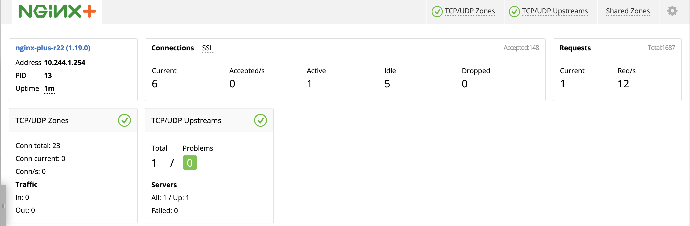

= L4 Load Balancing
:toc: manual

== What's this

`echoserver` is a simple service that provide standard internet services like `time`, `daytime`, `chargen`, and standard echo service. `echoserver` are deployed in k8a as container with multiple replicas, now need a load balancer and ingress controller to let the outside request can goes into `echoserver`.

== Deploy Echoserver

[source, bash]
.*1. Get Code*
----
git clone https://github.com/cloudadc/container-ingress.git
cd container-ingress/nginx-plus-ingress/l4-lb
----

[source, bash]
.*2. Deploy Echoserver*
----
kubectl apply -f deploy.yaml 
----

* link:deploy.yaml[deploy.yaml]

this will create a namespace named `echoserver`, and the `echoserver` service under it.

[source, bash]
.*3. Test via k8s NodePort*
----
$ telnet 192.168.5.30 30165
Trying 192.168.5.30...
Connected to 192.168.5.30.
Escape character is '^]'.
hello
kylin
----

== Deploy Ingress Controller

Either refer to link:README.adoc[Installing], or link:../bigip/README.adoc[Deployment Architectures] to choose one for dedetailed instructions to deploy Ingress Controller.

eg: deploy a cluster-wide nginx plus ingress controller:

[source, bash]
----
// 1. deploy cluster wide nginx ingress controller
kubectl apply -f nginx-plus-ingress.yaml

// 2. deploy bigip controller
kubectl apply -f nginx-plus-ingress-svc.yaml
kubectl apply -f nginx-plus-ingress-configmap.yaml
----

* link:nginx-plus-ingress.yaml[nginx-plus-ingress.yaml]
* link:nginx-plus-ingress-svc.yaml[nginx-plus-ingress-svc.yaml]
* link:nginx-plus-ingress-configmap.yaml[nginx-plus-ingress-configmap.yaml]

Check the dashboard via http://192.168.5.40:8080/dashboard.html

image:img/nginx-ingress-tcp-dashboard-emty.png[]

== Configure Load Balancing

We use stream-snippets ConfigMap key to configure TCP load balancing for our echoserver pods.

[source, bash]
.*1. configure the load balancing*
----
kubectl apply -f nginx-plus-config.yaml
----

link:nginx-plus-config.yaml[nginx-plus-config.yaml]

[source, yaml]
.*2. highlights of configmap stream-snippets*
----
      resolver kube-dns.kube-system.svc.cluster.local valid=5s;

      upstream echoserver-tcp {
          zone echoserver-tcp 64k;
          server echoserver-svc.echoserver.svc.cluster.local service=_echoserver._tcp resolve;
      }

      server {
          listen 8877;
          proxy_pass echoserver-tcp;
          status_zone echoserver-tcp;
      }
----

[source, bash]
.*3. check the configuration*
----
kubectl exec -it nginx-ingress-7fbffb7bc6-hrq7q -n nginx-ingress -- bash

$ cat /etc/nginx/nginx.conf
...
    upstream echoserver-tcp {
        zone echoserver-tcp 64k;
        server echoserver-svc.echoserver.svc.cluster.local service=_echoserver._tcp resolve;
    }
    
    server {
        listen 8877;
        proxy_pass echoserver-tcp;
        status_zone echoserver-tcp;
    }
----

*4. Check the Nginx Plus Ingress Controller Dashboard*

Note that now has one TCP/UDP zone and one TCP/UDP upstream.

*5. Check the Ingress path*

From the F5 LTM, there is public IP which used as unified external enterence as below figure, it's listen on `192.168.5.40:8877`

Note that the Virtual Server IP reference to 2 pool member, that because we deploy nginx plus ingress has 2 replicas.

From Nginx Plus TCP/UDP Upstreams, there only one records, the echoserver service ip is used,

== Demonstrations

Either use telnet or echoclient:

[source, bash]
.*telnet*
----
$ telnet 192.168.5.40 8877
Trying 192.168.5.40...
Connected to 192.168.5.40.
Escape character is '^]'.
hello
hello
kylin
kylin
----

[source, bash]
.*echoclient*
----
$ echoclient 192.168.5.40
daytime
Sat Aug 15 20:41:51 2020
time
1597524114
hello
hello
---- 

*check the statistics from F5*

Note that the 2 connection all are established via 1st ingress controller.

