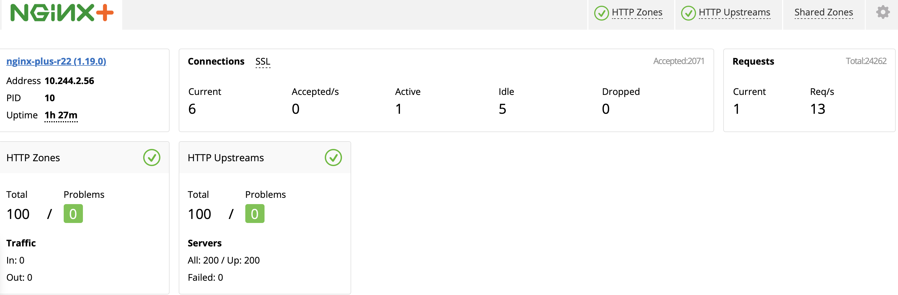

= Monitoring Dashboard
:toc: manual

== What's this

Monitoring Dashboard is used to access Nginx Plus Ingress Controller Live Activity, this page is for setting up Nginx Plus Ingress Controller Monitoring Dashboard. 

== Monitoring Dashboard

[source, bash]
.*1. Get Code*
----
git clone https://github.com/cloudadc/container-ingress.git
cd container-ingress/nginx-plus-ingress/monitor/
----

[source, yaml]
.*2. Configuration Highlight*
----
      containers:
        ports:
        - name: monitor
          containerPort: 8898
        args:
          - -nginx-status=true
          - -nginx-status-allow-cidrs=0.0.0.0/0
          - -nginx-status-port=8898
----

Refer to link:nginx-plus-ingress.yaml[nginx-plus-ingress.yaml] for completed configuration.

[source, yaml]
.*3. Expose Dashboard to F5*
----
kubectl apply -f nginx-plus-ingress-svc.yaml 
kubectl apply -f nginx-plus-ingress-configmap.yaml 
----

Refer to link:nginx-plus-ingress-svc.yaml[nginx-plus-ingress-svc.yaml] and link:nginx-plus-ingress-configmap.yaml[nginx-plus-ingress-configmap.yaml] for completed configuration.

*4. Demonstrations*

Access the Monitoring Dashboard via http://192.168.5.40:8080/dashboard.html

