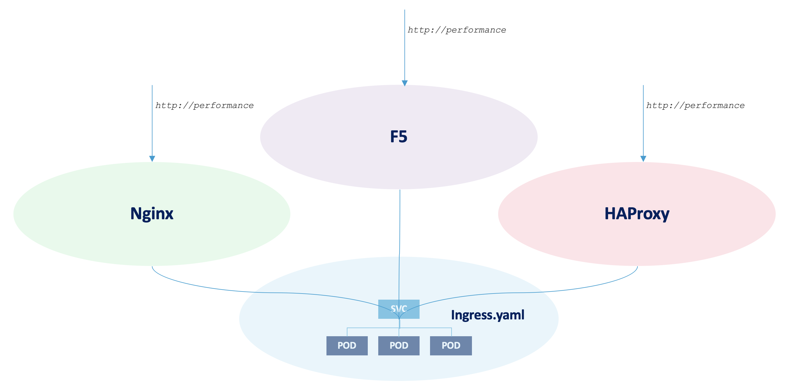
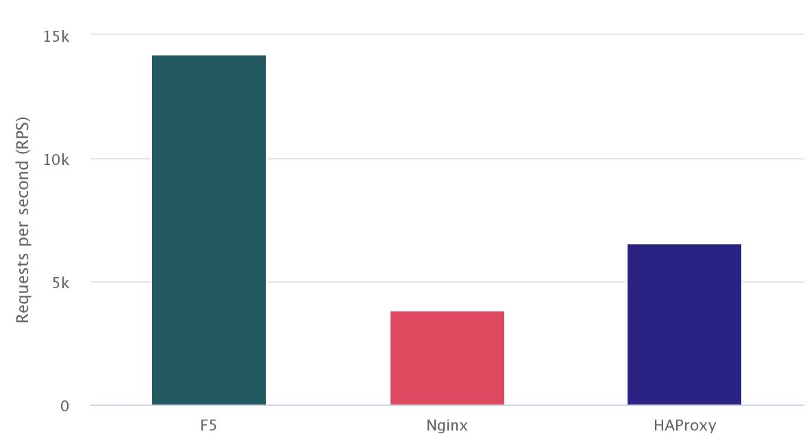
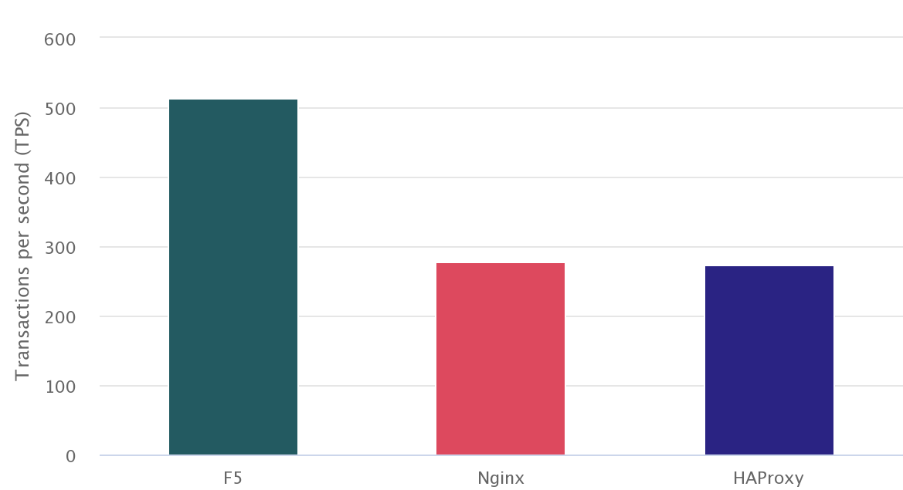
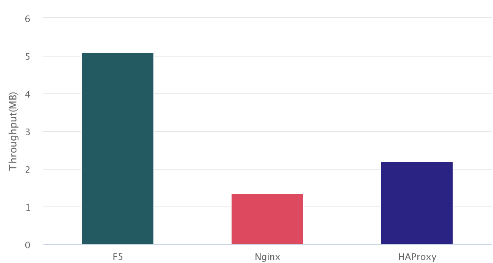
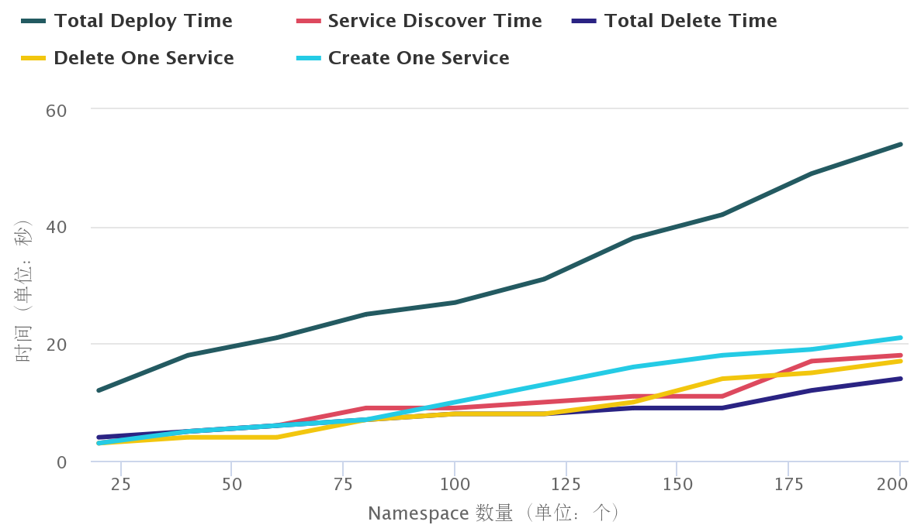
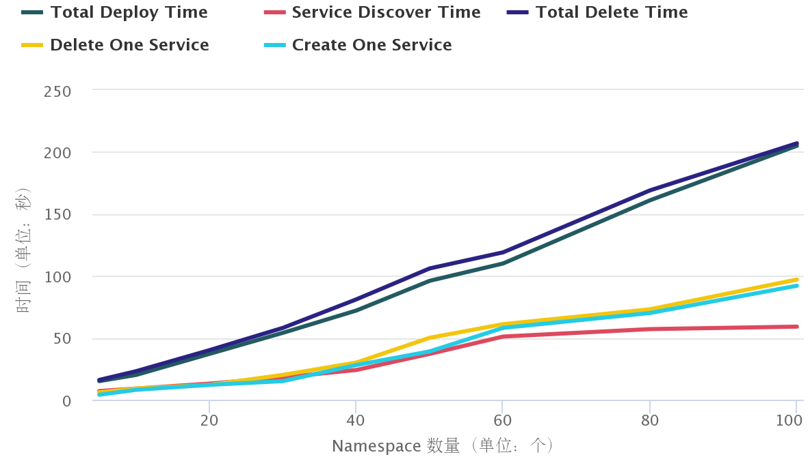

= Container Ingress Performance
:toc: manual

== HTTP Request Performance Comparision

This section will compare the performance of different Ingress controller(F5, Nginx, HAProxy) to process simple http request.

=== Software Used

* `wrk` 4.1.0
* `k8s` 1.15.12, one master two worker, 6 vCPU 12 GB(each node 2 vCPU 4 GB)
* `CentOS Linux` 7.8.2003
* `nginx/nginx-ingress:1.7.2`
* `f5networks/k8s-bigip-ctlr:2.0.0`
* `haproxytech/kubernetes-ingress:latest`
* `kylinsoong/cafe:1.0`

=== Set up

[source, bash]
.*1. Get Code*
----
git clone https://github.com/cloudadc/container-ingress.git
cd container-ingress/performance/install
----

[source, bash]
.*2. Install nginx ingress controller*
----
kubectl apply -f ns-and-sa.yaml
kubectl apply -f rbac.yaml
kubectl apply -f default-server-secret.yaml
kubectl apply -f nginx-config.yaml
kubectl apply -f vs-definition.yaml
kubectl apply -f vsr-definition.yaml
kubectl apply -f ts-definition.yaml
kubectl apply -f nginx-ingress.yaml
kubectl apply -f nginx-ingress-nodeport.yaml
----

[source, bash]
.*3. Install F5 container ingress service*
----
kubectl create ns bigip-ctlr
kubectl create secret generic bigip-login --from-literal=username=admin --from-literal=password=admin.F5demo.com -n bigip-ctlr
kubectl create serviceaccount bigip-ctlr -n bigip-ctlr
kubectl apply -f rbac-cis.yaml
kubectl apply -f cis.yaml
----

[source, bash]
.*4. Install HAProxy controller*
----
kubectl apply -f haproxy-ingress.yaml
----

[source, bash]
.*5. Verify the installation*
----
$ kubectl get ns
NAME                 STATUS   AGE
bigip-ctlr           Active   5m
haproxy-controller   Active   5m
nginx-ingress        Active   5m
----

=== Topology

The topology looks like below diagram:

The `cafe` application have 3 replicas are used as performance comparision application, the k8s ingress object are created, use the following command to deploy performance comparision application: 

[source, bash]
.*Get Code*
----
git clone https://github.com/cloudadc/container-ingress.git
cd container-ingress/performance/cafe
----

[source, bash]
.*Deploy Cafe Application*
----
kubectl apply -f app-deploy.yaml
kubectl apply -f app-ingress.yaml
----

There are 3 ingress controller deployed, F5, Nginx and HAProxy, refer to above *Set up* section for details. The Ingress controller will take aware of the created k8s ingress object and make a amendment of controller controll panel settings to be ready for the incoming request: 

* F5 will add a Policy rule to exist Virtual server and add a Pool with 3 pool members refer to the 3 POD of `cafe` service
* Nginx will add a config file under `/etc/nginx/conf.d/` which contains server and upstream settings, the upstream contains 3 servers refer to the 3 POD of `cafe` service
* HAProxy will update the configuration files that add a frontend and a backend, the backend contains 3 servers refer to the 3 POD of `cafe` service

=== Metrics Collected

There are 3 metrics are collected, RPS, TPS and Throughput, 

* Requests per second (RPS) - The number of requests the IC can process per second, averaged over a fixed time period. 
* Transactions per second (TPS) - The number of new HTTP connections the IC can establish and serve per second, averaged over a fixed time period.
* Throughput – The data transmission rate that IC is able to sustain while processing HTTP requests for static content over a fixed time period. 

There are 3 groups of metrics are collected, each for a different IC, the below commands are are use to collect metrics:

[source, bash]
----
wrk -t 6 -c 100 -d 180s http://perftest01.example.com/coffee
wrk -t 6 -c 100 -d 180s -H 'Connection: Close' http://perftest01.example.com/coffee
----

=== Results

[source, csv]
.*Results*
----
Type,RPS,TPS,Throughput
F5,14216,514,5.10
Nginx,3815,278,1.36
HAProxy,6569,274,2.20
----

*Requests per second (RPS)*

*Transactions per second (TPS)*

*Throughput*

[source, csv]
.*Journals*
----
./wrk -t 6 -c 100 -d 180s http://perftest01.example.com/coffee
Running 3m test @ http://perftest01.example.com/coffee
  6 threads and 100 connections
  Thread Stats   Avg      Stdev     Max   +/- Stdev
    Latency     6.79ms    2.50ms  43.36ms   80.22%
    Req/Sec     2.38k   196.42     2.95k    74.06%
  2559718 requests in 3.00m, 0.90GB read
Requests/sec:  14215.71
Transfer/sec:      5.10MB

./wrk -t 6 -c 100 -d 180s -H 'Connection: Close' http://perftest01.example.com
Running 3m test @ http://perftest01.example.com
  6 threads and 100 connections
  Thread Stats   Avg      Stdev     Max   +/- Stdev
    Latency    14.73ms    4.73ms  79.80ms   79.79%
    Req/Sec   762.15    244.45     1.01k    85.54%
  92481 requests in 3.00m, 42.36MB read
  Socket errors: connect 96, read 0, write 0, timeout 0
Requests/sec:    513.57
Transfer/sec:    240.91KB

./wrk -t 6 -c 100 -d 180s http://perftest01.example.com/coffee
Running 3m test @ http://perftest01.example.com/coffee
  6 threads and 100 connections
  Thread Stats   Avg      Stdev     Max   +/- Stdev
    Latency    28.04ms   27.88ms   1.03s    96.63%
    Req/Sec   639.07     90.63     1.15k    70.78%
  687099 requests in 3.00m, 245.69MB read
Requests/sec:   3815.10
Transfer/sec:      1.36MB

./wrk -t 6 -c 100 -d 180s -H 'Connection: Close' http://perftest01.example.com
Running 3m test @ http://perftest01.example.com
  6 threads and 100 connections
  Thread Stats   Avg      Stdev     Max   +/- Stdev
    Latency    22.36ms   32.54ms   1.03s    99.57%
    Req/Sec   554.09    162.35   767.00     88.63%
  50056 requests in 3.00m, 14.46MB read
  Socket errors: connect 96, read 0, write 0, timeout 0
  Non-2xx or 3xx responses: 50056
Requests/sec:    277.93
Transfer/sec:     82.24KB

./wrk -t 6 -c 100 -d 180s http://perftest01.example.com/coffee
Running 3m test @ http://perftest01.example.com/coffee
  6 threads and 100 connections
  Thread Stats   Avg      Stdev     Max   +/- Stdev
    Latency    14.97ms    7.95ms 251.38ms   79.14%
    Req/Sec     1.10k   121.04     1.48k    68.66%
  1182909 requests in 3.00m, 395.97MB read
Requests/sec:   6568.77
Transfer/sec:      2.20MB

./wrk -t 6 -c 100 -d 180s -H 'Connection: Close' http://perftest01.example.com
Running 3m test @ http://perftest01.example.com
  6 threads and 100 connections
  Thread Stats   Avg      Stdev     Max   +/- Stdev
    Latency    19.63ms   19.60ms   1.03s    99.79%
    Req/Sec   593.08    198.71     0.85k    88.60%
  49289 requests in 3.00m, 10.95MB read
  Socket errors: connect 96, read 0, write 0, timeout 0
  Non-2xx or 3xx responses: 49289
Requests/sec:    273.69
Transfer/sec:     62.27KB
----

== F5 CIS Performance Metric

=== Preparing

[source, bash]
.*Get Code*
----
git clone https://github.com/cloudadc/container-ingress.git
cd container-ingress/performance/discover
----

[source, bash]
.*Deploy 200 Application*
----
kubectl apply -f 200-ns-deploy.yaml 
----

=== Ingress in multiple namespaces

[source, bash]
.*Tmsh command: count time*
----
// count total pool
STARTTIME=$(date +%s) ; for i in {1..100} ; do tmsh list ltm pool /k8s/Shared/* | grep pool | wc -l ; ENDTIME=$(date +%s); echo "spend $(($ENDTIME - $STARTTIME)) seconds" ; sleep 3 ; done
// count specific pool's total pool member
STARTTIME=$(date +%s) ; for i in {1..100} ; do tmsh list ltm pool /k8s/Shared/ingress_perftest299_app_svc | grep address | wc -l;  ENDTIME=$(date +%s); echo "spend $(($ENDTIME - $STARTTIME)) seconds" ; sleep 3 ;  done
----

[source, bash]
.*Steps*
----
kubectl apply -f 20-ns-ingress.yaml 
kubectl apply -f 40-ns-ingress.yaml 
kubectl apply -f 60-ns-ingress.yaml 
kubectl apply -f 80-ns-ingress.yaml 
kubectl apply -f 100-ns-ingress.yaml 
kubectl apply -f 120-ns-ingress.yaml 
kubectl apply -f 140-ns-ingress.yaml 
kubectl apply -f 160-ns-ingress.yaml 
kubectl apply -f 180-ns-ingress.yaml 
kubectl apply -f 200-ns-ingress.yaml
 
----

[source, bash]
.*Results*
----
total_namespaces,total_deploy_time,service_discover_time,total_deleletion_time,delete_one_ingress,create_one_ingress
20,12,3,4,3,3
40,18,5,5,4,5
60,21,6,6,4,6
80,25,9,7,7,7
100,27,9,8,8,10
120,31,10,8,8,13
140,38,11,9,10,16
160,42,11,9,14,18
180,49,17,12,15,19
200,54,18,14,17,21
----

* total_namespaces - the total number of namespaces
* total_deploy_time - the total time of deploy all ingress
* service_discover_time - the time of pod change be update to ingress
* total_deleletion_time - the total time of delete all ingress
* delete_one_ingress - the time of delete one ingress
* create_one_ingress - the time of create one ingress in current namespace

=== Configmap in multiple namespaces

[source, bash]
.*Tmsh command: count time*
----
STARTTIME=$(date +%s) ; for i in {1..100} ; do tmsh list ltm pool /perftest109/perftest109/* | grep pool | wc -l ; ENDTIME=$(date +%s); echo "spend $(($ENDTIME - $STARTTIME)) seconds" ; sleep 3 ; done
STARTTIME=$(date +%s) ; for i in {1..100} ; do tmsh list ltm pool /perftest122/perftest122/* | grep address | wc -l ; ENDTIME=$(date +%s); echo "spend $(($ENDTIME - $STARTTIME)) seconds" ; sleep 3 ; done
----

[source, bash]
.*Steps*
----
kubectl apply -f 10-ns-configmap.yaml
kubectl apply -f 20-ns-configmap.yaml
kubectl apply -f 30-ns-configmap.yaml
kubectl apply -f 40-ns-configmap.yaml
kubectl apply -f 500-ns-configmap.yaml
kubectl apply -f 60-ns-configmap.yaml
kubectl apply -f 70-ns-configmap.yaml
kubectl apply -f 80-ns-configmap.yaml
kubectl apply -f 90-ns-configmap.yaml
kubectl apply -f 100-ns-configmap.yaml
----

[source, bash]
.*Results*
----
total_namespaces,total_deploy_time,service_discover_time,total_deleletion_time,delete_one_tenant,create_one_tenant
5,15,7,16,6,4
10,20,9,23,9,8
20,37,13,40,12,12
30,54,18,58,20,15
40,72,24,81,30,28
50,96,37,106,50,39
60,110,51,119,61,58
80,161,57,169,73,70
100,205,59,207,97,92
----

* total_namespaces - the total number of namespaces
* total_deploy_time - the total time of deploy all configmap  
* service_discover_time - the time of pod change be update to configmap
* total_deleletion_time - the total time of delete all configmap
* delete_one_tenant - delete one configmap 
* create_one_tenant - create one configmap

=== Ingress in single namespace

[source, bash]
.*Tmsh command: count time*
----

----

[source, bash]
.*Steps*
----

----

[source, bash]
.*Results*
----

----

=== Configmap in single namespace

[source, bash]
.*Tmsh command: count time*
----
STARTTIME=$(date +%s) ; for i in {1..100} ; do tmsh list ltm node /cistest/* | grep node | wc -l ; ENDTIME=$(date +%s); echo "spend $(($ENDTIME - $STARTTIME)) seconds" ; sleep 3 ; done
STARTTIME=$(date +%s) ; for i in {1..100} ; do tmsh list ltm pool /cistest/cistest_app-svc-19/* | grep address | wc -l ; ENDTIME=$(date +%s); echo "spend $(($ENDTIME - $STARTTIME)) seconds" ; sleep 3 ; don
----

[source, bash]
.*Steps*
----
kubectl apply -f X-svc-configmap.yaml 
----

[source, bash]
.*Results*
----
total_servicess,total_deploy_time,service_discover_time,total_deleletion_time,delete_one_service,create_one_service
20,14,20,22,19,21
40,36,43,54,39,45
60,55,52,52,65,72
70,63,75,96,65,75
80,72,76,125,75,84
100,89,92,151,91,94
----
