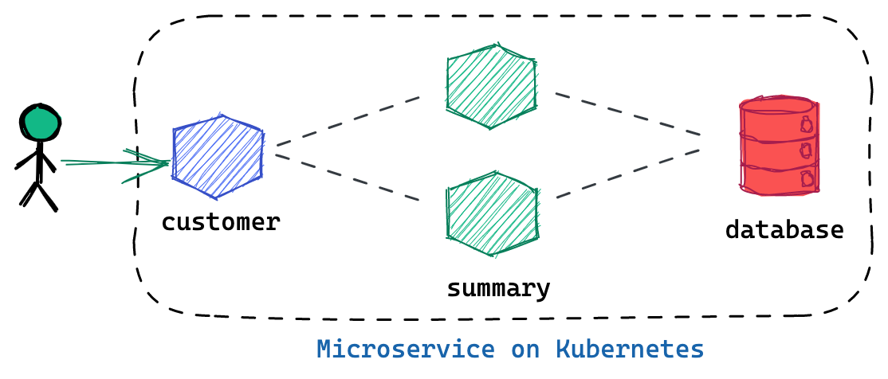
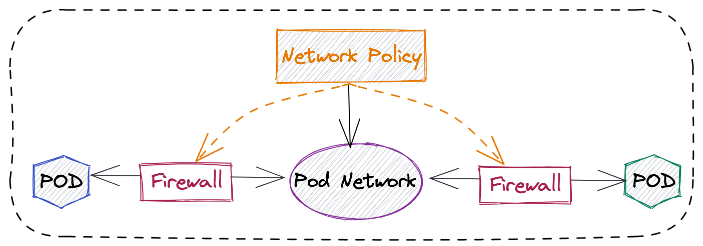
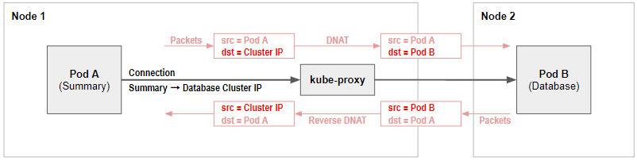
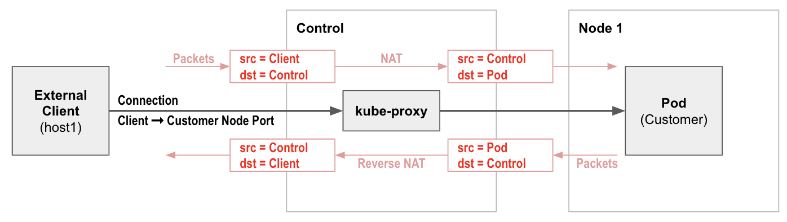
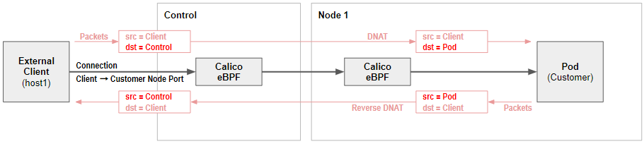
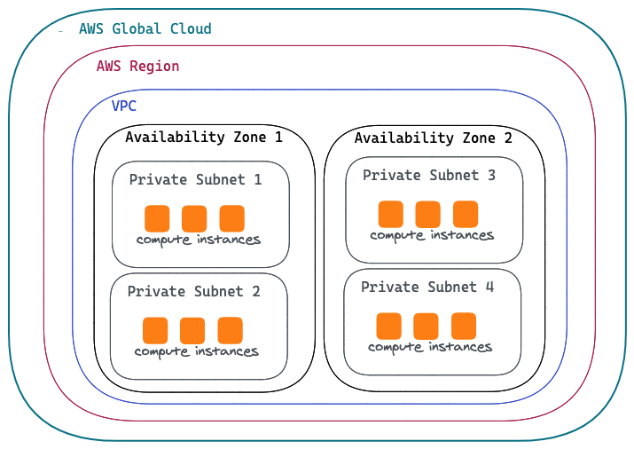

= Calico 
:toc: manual

== 安装

=== Install via operator

[source, bash]
.*1. install the operator*
----
kubectl create -f https://docs.projectcalico.org/archive/v3.16/manifests/tigera-operator.yaml
----

[source, bash]
.*2. Install Calico*
----
cat <<EOF | kubectl apply -f -
apiVersion: operator.tigera.io/v1
kind: Installation
metadata:
  name: default
spec:
  calicoNetwork:
    containerIPForwarding: Enabled
    ipPools:
    - cidr: 198.19.16.0/21
      natOutgoing: Enabled
      encapsulation: None
EOF
----

[source, bash]
.*3. Calico pods*
----
$ kubectl get pods -n calico-system 
NAME                                       READY   STATUS    RESTARTS   AGE
calico-typha-7fb7f4bd66-fvt89              1/1     Running   2          28m
calico-typha-7fb7f4bd66-gltp8              1/1     Running   2          28m
calico-node-42d6k                          1/1     Running   1          28m
calico-typha-7fb7f4bd66-lq6b5              1/1     Running   2          28m
calico-node-tlvbb                          1/1     Running   2          28m
calico-kube-controllers-57f767d97b-nxrnx   1/1     Running   3          28m
calico-node-l5n4s                          1/1     Running   0          28m
----

* *calico-node*: Calico-node runs on every Kubernetes cluster node as a DaemonSet. It is responsible for enforcing network policy, setting up routes on the nodes, plus managing any virtual interfaces for IPIP, VXLAN, or WireGuard.
* *calico-typha*: Typha is as a stateful proxy for the Kubernetes API server. It's used by every calico-node pod to query and watch Kubernetes resources without putting excessive load on the Kubernetes API server.  The Tigera Operator automatically scales the number of Typha instances as the cluster size grows.
* *calico-kube-controllers*: Runs a variety of Calico specific controllers that automate synchronization of resources. For example, when a Kubernetes node is deleted, it tidies up any IP addresses or other Calico resources associated with the node.

NOTE: The Kubernetes network model does specify that pods can communicate with each other directly without NAT. But a pod communicating with another pod via a service is not direct communication, and normally will use NAT to change the connection destination from the service to the backing pod as part of load balancing.

=== Install via Manifest

[source, bash]
.*1. Download Manifest*
----
curl https://docs.projectcalico.org/manifests/calico.yaml -O
----

NOTE: Uncomment the `CALICO_IPV4POOL_CIDR`, and make sure the CIDR value equals the value of `--pod-network-cidr`.

[source, bash]
.*2. Install Calico*
----
kubectl apply -f calico.yaml
---- 

NOTE: Refer to https://docs.projectcalico.org/getting-started/kubernetes/self-managed-onprem/onpremises[LINK] for more details.

[source, bash]
.*3. Calico pods*
----
$ kubectl get pods -A | grep calico
kube-system   calico-kube-controllers-855445d444-8rx26   1/1     Running   2          38h
kube-system   calico-node-56d8l                          1/1     Running   2          38h
kube-system   calico-node-r7ltw                          1/1     Running   2          38h
----

NOTE: Install via Manifest doesn't contains the *calico-typha*, which has less performance comapre with Install via operator.

=== Install calicoctl

[source, bash]
.*1. Download*
----
curl -o calicoctl -O -L  "https://github.com/projectcalico/calicoctl/releases/download/v3.20.1/calicoctl" 
----

[source, bash]
.*2. Copy to /usr/local/bin*
----
chmod +x calicoctl 
sudo cp calicoctl /usr/local/bin/
----

[source, bash]
.*3. Verify*
----
$ calicoctl get nodes -o wide
NAME            ASN       IPV4             IPV6   
control-plane   (64512)   172.16.25.3/24          
worker01        (64512)   172.16.25.4/24     
----

NOTE: Refer to https://docs.projectcalico.org/reference/calicoctl/ for calicoctl reference.

=== Deploy YaoBank App

The YaoBank Demo App contains 3 Microservice:

* Customer (which provides a simple web GUI)
* Summary (some middleware business logic)
* Database (the persistent datastore for the bank) 

Originally from https://raw.githubusercontent.com/tigera/ccol1/main/yaobank.yaml, the nodeSelector are adjuested, and the docker image are retagged.

* link:files/yaobank.yaml[yaobank.yaml]

[source, bash]
.*1. Deploy YaoBank App*
----
kubectl apply -f yaobank.yaml 
----

[source, bash]
.*2. Show YaoBank App*
----
$ kubectl get pods -n yaobank --show-labels --no-headers
customer-cfc847564-dk56j    1/1   Running   0     82s   app=customer,pod-template-hash=cfc847564,version=v1
database-644f4569dd-mnncp   1/1   Running   0     83s   app=database,pod-template-hash=644f4569dd,version=v1
summary-5877cf8b57-9sc44    1/1   Running   0     82s   app=summary,pod-template-hash=5877cf8b57,version=v1
summary-5877cf8b57-kjb7b    1/1   Running   0     82s   app=summary,pod-template-hash=5877cf8b57,version=v1
----

[source, bash]
.*3. Verify App*
----
$ curl http://control-plane:30180/ -I
HTTP/1.0 200 OK
Content-Type: text/html; charset=utf-8
Content-Length: 593
Server: Werkzeug/0.12.2 Python/2.7.12
Date: Fri, 24 Sep 2021 16:59:18 GMT
----

== 安全

=== 为什么需要 Network Policy？

* 在容器平台需要基于IP地址或者应用端口进行流量控制（OSI L3、L4）
* 以应用为中心的设计，通过标签匹配的方式控制着应用POD如何被访问
* K8S 提供了 Network Policy API 接口，但是没有做实现，实现交给 CNI 插件实现厂商，实现与底层网络能力的解耦
* Network Policy价值
** 攻击者花样更加聪明
** 攻击量更多
** 东西向安全
** 可以让非网络专家配置防火墙。
* 南北向安全：Calico Enterprise integrates with Fortinet firewalls, and make Fortinet understands ingress node or pod ip address.

=== Kubernetes Network Policy 与 Calico 额外增加的 Network Policy

[cols="5a,5a"]
|===
|Kubernetes Network Policy |Calico Network Policy

|
* Ingress & egress rules
* Pod selectors
* Namespce selectors
* Port lists
* Named Ports
* IP blocks & excepts
* TCP, UDP, or SCTP
|
* Namespaced & global scopes
* Deny and log actions
* Policy ordering
* Richer matches, like ServiceAccounts, ICMP
* Istio integration, like Cryptpgraphic identity matching, Layer 5-7 match criteria

|===

=== 允许来自特定POD的入向访问

如下图所示为允许来自特定POD的入向访问，名称为database的POD只允许来自summary POD的入向访问

[source, bash]
.*1. 查看 database POD 标签*
----
$ kubectl get pods -n yaobank --show-labels | grep database
database-644f4569dd-mnncp   1/1     Running   0          22h   app=database,pod-template-hash=644f4569dd,version=v1
----

[source, bash]
.*2. 查看 summary POD 标签*
----
$ kubectl get pods -n yaobank --show-labels | grep summary
summary-5877cf8b57-9sc44    1/1     Running   0          22h   app=summary,pod-template-hash=5877cf8b57,version=v1
summary-5877cf8b57-kjb7b    1/1     Running   0          22h   app=summary,pod-template-hash=5877cf8b57,version=v1
----

[source, bash]
.*3. 分别在 customer POD 和summary POD 内访问database*
----
CUSTOMER_POD=$(kubectl get pods -n yaobank -l app=customer -o name)
SUMMARY_POD=$(kubectl get pods -n yaobank -l app=summary -o name | head -n 1)

$ kubectl exec -it $CUSTOMER_POD -n yaobank -- bash 
root@customer-cfc847564-dk56j:/app# curl http://database:2379/v2/keys?recursive=true -I -s | head -n 1
HTTP/1.1 200 OK

$ kubectl exec -it $SUMMARY_POD -n yaobank -- bash 
root@summary-5877cf8b57-9sc44:/app# curl http://database:2379/v2/keys?recursive=true -I -s | head -n 1
HTTP/1.1 200 OK
----

[source, bash]
.*4. 添加 database-policy*
----
cat <<EOF | kubectl apply -f -
kind: NetworkPolicy
apiVersion: networking.k8s.io/v1
metadata:
  name: database-policy
  namespace: yaobank
spec:
  podSelector:
    matchLabels:
      app: database
  ingress:
  - from:
    - podSelector:
        matchLabels:
          app: summary
    ports:
      - protocol: TCP
        port: 2379
  egress:
    - to: []
EOF
----

* `spec.podSelector.matchLabels` - 指定要保护的目标 POD 为 database，具有 `app=database` 的标签。
* `spec.ingress.from.podSelector.matchLabels` - 指定允许访问的 POD 需具有 `app=summary` 标签

[source, bash]
.*5. 重复执行第3步，分别在 customer POD 和summary POD 内访问database**
----
root@customer-cfc847564-dk56j:/app# curl http://database:2379/v2/keys?recursive=true -I -m 3
curl: (28) Connection timed out after 3001 milliseconds

$ kubectl exec -it $SUMMARY_POD -n yaobank -- bash 
root@summary-5877cf8b57-9sc44:/app# curl http://database:2379/v2/keys?recursive=true -I -s | head -n 1
HTTP/1.1 200 OK
----

NOTE: 对比第三步执行的结果，拒绝来自 customer POD 的请求，而允许来自 summary POD 的请求。

[source, bash]
.*6. Clean Up*
----
kubectl delete networkpolicy database-policy -n yaobank
----

=== 设置 Default Deny 策略

[source, bash]
.*1. 访问服务*
----
$ curl http://control-plane:30180 -m 3
  <body>
  	<h1>Welcome to YAO Bank</h1>
  	<h2>Name: Spike Curtis</h2>
  	<h2>Balance: 2389.45</h2>
  	
<a href="/logout">Log Out >></a>

  </body>
----

[source, bash]
.*2. 设置 Default Deny 策略*
----
cat <<EOF | kubectl apply -f -
apiVersion: networking.k8s.io/v1
kind: NetworkPolicy
metadata:
  name: default-deny
  namespace: yaobank
spec:
  podSelector: {}
  policyTypes:
  - Ingress
  - Egress
EOF
----

[source, bash]
.*3. 重复步骤 1，访问服务*
----
$ curl http://control-plane:30180 -m 3
curl: (28) Operation timed out after 3001 milliseconds with 0 bytes received
----

[source, bash]
.*4. 分别在 customer POD 和 summary POD 中访问其他 POD*
----
$ kubectl exec -it $CUSTOMER_POD -n yaobank -- bash 
root@customer-cfc847564-dk56j:/app# curl http://summary -m 3
curl: (28) Resolving timed out after 3513 milliseconds
root@customer-cfc847564-dk56j:/app# curl http://database:2379/v2/keys?recursive=true -m 3
curl: (28) Resolving timed out after 3512 milliseconds

$ kubectl exec -it $SUMMARY_POD -n yaobank -- bash 
root@summary-5877cf8b57-9sc44:/app# curl http://database:2379/v2/keys?recursive=true -m 3
curl: (28) Resolving timed out after 3515 milliseconds
----

[source, bash]
.*5. Clean UP*
----
kubectl delete networkpolicy default-deny -n yaobank
----

=== yaobank 策略控制最佳实践

[source, bash]
.*1. 设置 Default Deny 策略*
----
cat <<EOF | kubectl apply -f -
apiVersion: networking.k8s.io/v1
kind: NetworkPolicy
metadata:
  name: default-deny
  namespace: yaobank
spec:
  podSelector: {}
  policyTypes:
  - Ingress
  - Egress
EOF
----

基于 namespace 设置 Default Deny 策略，namespace 内所有 POD 出向和入向都被禁止：

[source, bash]
.*2. 基于所有 POD 设定入向和出向策略*
----
cat <<EOF | kubectl apply -f -
kind: NetworkPolicy
apiVersion: networking.k8s.io/v1
metadata:
  name: customer-policy
  namespace: yaobank
spec:
  podSelector:
    matchLabels:
      app: customer
  ingress:
    - ports:
      - protocol: TCP
        port: 80
  egress:
    - to: []
---
kind: NetworkPolicy
apiVersion: networking.k8s.io/v1
metadata:
  name: summary-policy
  namespace: yaobank
spec:
  podSelector:
    matchLabels:
      app: summary
  ingress:
    - from:
      - podSelector:
          matchLabels:
            app: customer
      ports:
      - protocol: TCP
        port: 80
  egress:
    - to:
      - podSelector:
          matchLabels:
            app: database
      ports:
      - protocol: TCP
        port: 2379
---
kind: NetworkPolicy
apiVersion: networking.k8s.io/v1
metadata:
  name: database-policy
  namespace: yaobank
spec:
  podSelector:
    matchLabels:
      app: database
  ingress:
  - from:
    - podSelector:
        matchLabels:
          app: summary
    ports:
      - protocol: TCP
        port: 2379
  egress:
    - to: []
EOF
----

=== Calico 策略设定 yaobank 策略控制最佳实践

Kubernetes 定义的 Default Deny 只能基于单个 namespace 设定Default Deny，而 Calico 策略设定 Default Deny 是基于 Kubernetes 全局设定。

[source, bash]
.*1. Default Deny*
----
cat <<EOF | calicoctl apply -f -
apiVersion: projectcalico.org/v3
kind: GlobalNetworkPolicy
metadata:
  name: default-app-policy
spec:
  namespaceSelector: has(projectcalico.org/name) && projectcalico.org/name not in {"kube-system", "calico-system"}
  types:
  - Ingress
  - Egress
EOF
----

[source, bash]
.*2. 更新全局策略，允许 DNS*
----
cat <<EOF | calicoctl apply -f -
apiVersion: projectcalico.org/v3
kind: GlobalNetworkPolicy
metadata:
  name: default-app-policy
spec:
  namespaceSelector: has(projectcalico.org/name) && projectcalico.org/name not in {"kube-system", "calico-system"}
  types:
  - Ingress
  - Egress
  egress:
    - action: Allow
      protocol: UDP
      destination:
        selector: k8s-app == "kube-dns"
        ports:
          - 53
EOF
----

[source, bash]
.*3. 基于每个 POD 设定出入向策略*
----
cat <<EOF | kubectl apply -f - 
kind: NetworkPolicy
apiVersion: networking.k8s.io/v1
metadata:
  name: database-policy
  namespace: yaobank
spec:
  podSelector:
    matchLabels:
      app: database
  ingress:
  - from:
    - podSelector:
        matchLabels:
          app: summary
    ports:
      - protocol: TCP
        port: 2379
  egress:
    - to: []
---
kind: NetworkPolicy
apiVersion: networking.k8s.io/v1
metadata:
  name: customer-policy
  namespace: yaobank
spec:
  podSelector:
    matchLabels:
      app: customer
  ingress:
    - ports:
      - protocol: TCP
        port: 80
  egress:
    - to: []
---
kind: NetworkPolicy
apiVersion: networking.k8s.io/v1
metadata:
  name: summary-policy
  namespace: yaobank
spec:
  podSelector:
    matchLabels:
      app: summary
  ingress:
    - from:
      - podSelector:
          matchLabels:
            app: customer
      ports:
      - protocol: TCP
        port: 80
  egress:
    - to:
      - podSelector:
          matchLabels:
            app: database
      ports:
      - protocol: TCP
        port: 2379
EOF
----

[source, bash]
.*4. 查看策略*
----
$ calicoctl get GlobalNetworkPolicy
NAME                 
default-app-policy   

$ kubectl get NetworkPolicy -n yaobank
NAME              POD-SELECTOR   AGE
customer-policy   app=customer   4m16s
database-policy   app=database   4m15s
summary-policy    app=summary    4m15s
----

[source, bash]
.*5. 访问服务*
----
$ curl http://control-plane:30180 -I -s | head -n 1
HTTP/1.0 200 OK
----

[source, bash]
.*6. Clean Up*
----
kubectl delete NetworkPolicy summary-policy -n yaobank
kubectl delete NetworkPolicy customer-policy -n yaobank
kubectl delete NetworkPolicy database-policy -n yaobank

calicoctl delete GlobalNetworkPolicy default-app-policy
----

=== Managing Trust Across Teams 

[source, bash]
.*1. Lockdown Cluster Egress*
----
cat <<EOF | calicoctl apply -f -
apiVersion: projectcalico.org/v3
kind: GlobalNetworkPolicy
metadata:
  name: egress-lockdown
spec:
  order: 600
  namespaceSelector: has(projectcalico.org/name) && projectcalico.org/name not in {"kube-system", "calico-system"}
  serviceAccountSelector: internet-egress not in {"allowed"}
  types:
  - Egress
  egress:
    - action: Deny
      destination:
        notNets:
          - 10.0.0.0/8
          - 172.16.0.0/12
          - 192.168.0.0/16
          - 198.18.0.0/15
EOF
----

[source, bash]
.*2. Grant Selective Cluster Egress*
----
kubectl label serviceaccount -n yaobank customer internet-egress=allowed
----

[source, bash]
.*3. Clean Up*
----
calicoctl delete GlobalNetworkPolicy egress-lockdown
----

=== Network Policy for Hosts and NodePorts 

[source, bash]
.*1. Network Policy for Nodes*
----
cat <<EOF| calicoctl apply -f -
---
apiVersion: projectcalico.org/v3
kind: GlobalNetworkPolicy
metadata:
  name: default-node-policy
spec:
  selector: has(kubernetes.io/hostname)
  ingress:
  - action: Allow
    protocol: TCP
    source:
      nets:
      - 127.0.0.1/32
  - action: Allow
    protocol: UDP
    source:
      nets:
      - 127.0.0.1/32
EOF
----

[source, bash]
.*2. Create Host Endpoints*
----
calicoctl patch kubecontrollersconfiguration default --patch='{"spec": {"controllers": {"node": {"hostEndpoint": {"autoCreate": "Enabled"}}}}}'
----

[source, bash]
.*3. Restrict Access to Kubernetes NodePorts*
----
cat <<EOF | calicoctl apply -f -
---
apiVersion: projectcalico.org/v3
kind: GlobalNetworkPolicy
metadata:
  name: nodeport-policy
spec:
  order: 100
  selector: has(kubernetes.io/hostname)
  applyOnForward: true
  preDNAT: true
  ingress:
  - action: Deny
    protocol: TCP
    destination:
      ports: ["30000:32767"]
  - action: Deny
    protocol: UDP
    destination:
      ports: ["30000:32767"]
EOF
----

[source, bash]
.*4. Selectively allow access to customer front end*
----
cat <<EOF | calicoctl apply -f -
---
apiVersion: projectcalico.org/v3
kind: GlobalNetworkPolicy
metadata:
  name: nodeport-policy
spec:
  order: 100
  selector: has(kubernetes.io/hostname)
  applyOnForward: true
  preDNAT: true
  ingress:
  - action: Allow
    protocol: TCP
    destination:
      ports: [30180]
    source:
      nets:
      - 198.19.15.254/32
  - action: Deny
    protocol: TCP
    destination:
      ports: ["30000:32767"]
  - action: Deny
    protocol: UDP
    destination:
      ports: ["30000:32767"]
EOF
----

[source, bash]
.*5. Clean Up*
----
calicoctl delete GlobalNetworkPolicy default-node-policy
calicoctl delete GlobalNetworkPolicy nodeport-policy
----

== POD Connectivity

=== Pods Network

[source, bash]
.*1. Exec into the pod*
----
CUSTOMER_POD=$(kubectl get pods -n yaobank -l app=customer -o name)
kubectl exec -ti -n yaobank $CUSTOMER_POD -- /bin/bash
----

[source, bash]
.*2. list interfaces*
----
root@customer-574bd6cc75-9wx6m:/app# ip a
1: lo: <LOOPBACK,UP,LOWER_UP> mtu 65536 qdisc noqueue state UNKNOWN group default qlen 1000
    link/loopback 00:00:00:00:00:00 brd 00:00:00:00:00:00
    inet 127.0.0.1/8 scope host lo
       valid_lft forever preferred_lft forever
    inet6 ::1/128 scope host 
       valid_lft forever preferred_lft forever
3: eth0@if5: <BROADCAST,MULTICAST,UP,LOWER_UP> mtu 1410 qdisc noqueue state UP group default 
    link/ether 86:2d:a8:72:34:7d brd ff:ff:ff:ff:ff:ff link-netnsid 0
    inet 198.19.22.147/32 brd 198.19.22.147 scope global eth0
       valid_lft forever preferred_lft forever
    inet6 fe80::842d:a8ff:fe72:347d/64 scope link 
       valid_lft forever preferred_lft forever
----

* There is a lo loopback interface with an IP address of 127.0.0.1. This is the standard loopback interface that every network namespace has by default. You can think of it as localhost for the pod itself.
* There is an eth0 interface which has the pods actual IP address, 198.19.22.147. Notice this matches the IP address that kubectl get pods returned earlier.

[source, bash]
.*3. ip link*
----
root@customer-574bd6cc75-9wx6m:/app# ip -c link show up
1: lo: <LOOPBACK,UP,LOWER_UP> mtu 65536 qdisc noqueue state UNKNOWN mode DEFAULT group default qlen 1000
    link/loopback 00:00:00:00:00:00 brd 00:00:00:00:00:00
3: eth0@if5: <BROADCAST,MULTICAST,UP,LOWER_UP> mtu 1410 qdisc noqueue state UP mode DEFAULT group default 
    link/ether 86:2d:a8:72:34:7d brd ff:ff:ff:ff:ff:ff link-netnsid 0
----

[source, bash]
.*4. Routing Table*
----
root@customer-574bd6cc75-9wx6m:/app# ip route
default via 169.254.1.1 dev eth0 
169.254.1.1 dev eth0  scope link 
----

NOTE: This shows that the pod's default route is out over the eth0 interface. i.e. Anytime it wants to send traffic to anywhere other than itself, it will send the traffic over eth0. (Note that the next hop address of 169.254.1.1 is a dummy address used by Calico. Every Calico networked pod sees this as its next hop.)

[source, bash]
.*5. Exit from the customer pod*
----
exit
----

=== WireGuard Encryption

[source, bash]
.*1. enabling encryption*
----
calicoctl patch felixconfiguration default --type='merge' -p '{"spec":{"wireguardEnabled":true}}'
----

[source, bash]
.*2. wireguardPublicKey*
----
$ calicoctl get node node1 -o yaml
apiVersion: projectcalico.org/v3
kind: Node
metadata:
  annotations:
    projectcalico.org/kube-labels: '{"beta.kubernetes.io/arch":"amd64","beta.kubernetes.io/instance-type":"k3s","beta.kubernetes.io/os":"linux","k3s.io/hostname":"node1","k3s.io/internal-ip":"198.19.0.2","kubernetes.io/arch":"amd64","kubernetes.io/hostname":"node1","kubernetes.io/os":"linux","node.kubernetes.io/instance-type":"k3s"}'
  creationTimestamp: "2021-08-25T14:20:09Z"
  labels:
    beta.kubernetes.io/arch: amd64
    beta.kubernetes.io/instance-type: k3s
    beta.kubernetes.io/os: linux
    k3s.io/hostname: node1
    k3s.io/internal-ip: 198.19.0.2
    kubernetes.io/arch: amd64
    kubernetes.io/hostname: node1
    kubernetes.io/os: linux
    node.kubernetes.io/instance-type: k3s
  name: node1
  resourceVersion: "22959"
  uid: 15122ad5-dfd7-4dfe-9c26-7a637a7088be
spec:
  bgp:
    ipv4Address: 198.19.0.2/20
  orchRefs:
  - nodeName: node1
    orchestrator: k8s
  wireguard:
    interfaceIPv4Address: 198.19.22.157
status:
  podCIDRs:
  - 198.19.17.0/24
  wireguardPublicKey: bIuu8myw2pIonLtCqtTf2bmzg4Syswp8m7wKh8C6mT4=
----

[source, bash]
.*3. inspect wireguard from the interfaces*
----
$ ssh node1
$ ip addr | grep wireguard
13: wireguard.cali: <POINTOPOINT,NOARP,UP,LOWER_UP> mtu 1400 qdisc noqueue state UNKNOWN group default qlen 1000
    inet 198.19.22.157/32 brd 198.19.22.157 scope global wireguard.cali
----

[source, bash]
.*4. Disabling Encryption*
----
calicoctl patch felixconfiguration default --type='merge' -p '{"spec":{"wireguardEnabled":false}}'
----

=== IP Pools

* IP Pools are calico resource which define ranges of addresses that the calico IP address management and IPAM CNI plugin can use. 

[source, bash]
----
$ calicoctl get IPPool default-ipv4-ippool -o yaml
apiVersion: projectcalico.org/v3
kind: IPPool
metadata:
  creationTimestamp: "2021-08-25T14:43:21Z"
  name: default-ipv4-ippool
  resourceVersion: "1371"
  uid: 218a5773-6fff-48fd-a175-486b9ad66faa
spec:
  blockSize: 26
  cidr: 198.19.16.0/21
  ipipMode: Never
  natOutgoing: true
  nodeSelector: all()
  vxlanMode: Never
----

* The IP Pool can be per Node, pernamespace
* To improve performance and scalibility, Calico IPAM to allocates IPs to nodes in blocks.IP 分配是动态的，当一个NODE用完了 64 个地址后，Calico IPAM 会在分配一个新 Block，如果 Block 被分配完了，则会到相邻的 NODE的Block借一个IP。

=== BGP Peering

* *什么是 BGP*

BGP 是一个标准的网络协议，大多数网络路由器都支持 BGP 协议，BGP 协议用来在路由器之间共享和同步路由信息。

=== Cluster IP Address Ranges

There are two address ranges that Kubernetes is normally configured with that are worth understanding:

* The cluster pod CIDR is the range of IP addresses Kubernetes is expecting to be assigned to pods in the cluster.
* The services CIDR is the range of IP addresses that are used for the Cluster IPs of Kubernetes Sevices (the virtual IP that corresponds to each Kubernetes Service).

[source, bash]
----
$ kubectl cluster-info dump | grep -m 2 -E "service-cidr|cluster-cidr"
                    "k3s.io/node-args": "[\"server\",\"--flannel-backend\",\"none\",\"--cluster-cidr\",\"198.19.16.0/20\",\"--service-cidr\",\"198.19.32.0/20\",\"--write-kubeconfig-mode\",\"664\",\"--disable-network-policy\"]",
----

=== Create IP Pools 

[source, bash]
.*1. Create externally routable IP Pool*
----
cat <<EOF | calicoctl apply -f - 
---
apiVersion: projectcalico.org/v3
kind: IPPool
metadata:
  name: external-pool
spec:
  cidr: 198.19.24.0/21
  blockSize: 29
  ipipMode: Never
  natOutgoing: true
  nodeSelector: "!all()"
EOF
----

[source, bash]
.*2. Examine BGP peering status*
----
$ ssh node1
$ sudo calicoctl node status
Calico process is running.

IPv4 BGP status
+--------------+-------------------+-------+----------+-------------+
| PEER ADDRESS |     PEER TYPE     | STATE |  SINCE   |    INFO     |
+--------------+-------------------+-------+----------+-------------+
| 198.19.0.1   | node-to-node mesh | up    | 07:25:58 | Established |
| 198.19.0.3   | node-to-node mesh | up    | 07:25:56 | Established |
+--------------+-------------------+-------+----------+-------------+

IPv6 BGP status
No IPv6 peers found.
----

[source, bash]
.*3. Add a BGP Peer*
----
cat <<EOF | calicoctl apply -f -
---
apiVersion: projectcalico.org/v3
kind: BGPPeer
metadata:
  name: bgppeer-global-host1
spec:
  peerIP: 198.19.15.254
  asNumber: 64512
EOF
----

[source, bash]
.*4. Examine BGP peering status*
----
$ ssh node1
$ sudo calicoctl node status
Calico process is running.

IPv4 BGP status
+---------------+-------------------+-------+----------+-------------+
| PEER ADDRESS  |     PEER TYPE     | STATE |  SINCE   |    INFO     |
+---------------+-------------------+-------+----------+-------------+
| 198.19.0.1    | node-to-node mesh | up    | 07:25:58 | Established |
| 198.19.0.3    | node-to-node mesh | up    | 07:25:56 | Established |
| 198.19.15.254 | global            | up    | 08:39:33 | Established |
+---------------+-------------------+-------+----------+-------------+

IPv6 BGP status
No IPv6 peers found.
----

[source, bash]
.*5. Configure a Namespace to use External Routable IP Addresses*
----
cat <<EOF| kubectl apply -f - 
---
apiVersion: v1
kind: Namespace
metadata:
  annotations:
    cni.projectcalico.org/ipv4pools: '["external-pool"]'
  name: external-ns
EOF
----

[source, bash]
.*6. Deploy Nginx*
----
cat <<EOF| kubectl apply -f -
---
apiVersion: apps/v1
kind: Deployment
metadata:
  name: nginx
  namespace: external-ns
spec:
  replicas: 1
  selector:
    matchLabels:
      app: nginx
  template:
    metadata:
      labels:
        app: nginx
        version: v1
    spec:
      containers:
      - name: nginx
        image: nginx
        imagePullPolicy: IfNotPresent
      nodeSelector:
        kubernetes.io/hostname: node1

---
kind: NetworkPolicy
apiVersion: networking.k8s.io/v1
metadata:
  name: nginx
  namespace: external-ns
spec:
  podSelector:
    matchLabels:
      app: nginx
  policyTypes:
  - Ingress
  - Egress
  ingress:
  - ports:
    - protocol: TCP
      port: 80
EOF
----

[source, bash]
.*7. Access the NGINX pod from outside the cluster*
----
$ kubectl get pods -n external-ns -o wide --no-headers
nginx-8c44c96c6-xtw74   1/1   Running   0     70s   198.19.28.208   node1   <none>   <none>

$ curl 198.19.28.208 -I
HTTP/1.1 200 OK
Server: nginx/1.21.1
Date: Sat, 28 Aug 2021 08:48:10 GMT
Content-Type: text/html
Content-Length: 612
Last-Modified: Tue, 06 Jul 2021 14:59:17 GMT
Connection: keep-alive
ETag: "60e46fc5-264"
Accept-Ranges: bytes
----

[source, bash]
.*8. Check Calico IPAM allocations statistics*
----
$ calicoctl ipam show
+----------+----------------+-----------+------------+-------------+
| GROUPING |      CIDR      | IPS TOTAL | IPS IN USE |  IPS FREE   |
+----------+----------------+-----------+------------+-------------+
| IP Pool  | 198.19.16.0/21 |      2048 | 12 (1%)    | 2036 (99%)  |
| IP Pool  | 198.19.24.0/21 |      2048 | 1 (0%)     | 2047 (100%) |
+----------+----------------+-----------+------------+-------------+
----

== Kubernetes Services Networking

=== kube-proxy service debug

[source, bash]
.*1. List the services*
----
$ kubectl get svc -n yaobank
NAME       TYPE        CLUSTER-IP      EXTERNAL-IP   PORT(S)        AGE
database   ClusterIP   198.19.33.67    <none>        2379/TCP       2d23h
summary    ClusterIP   198.19.46.158   <none>        80/TCP         2d23h
customer   NodePort    198.19.32.122   <none>        80:30180/TCP   2d23h
----

[source, bash]
.*2. List the endpoints for each of the services*
----
$ kubectl get endpoints -n yaobank
NAME       ENDPOINTS                       AGE
customer   198.19.22.156:80                2d23h
database   198.19.21.74:2379               2d23h
summary    198.19.21.7:80,198.19.21.8:80   2d23h
----

[source, bash]
.*3. List the pods*
----
$ kubectl get pods -n yaobank -o wide --no-headers
database-6c5db58d95-nnwsp   1/1   Running   2     2d23h   198.19.21.74    node2     <none>   <none>
summary-85c56b76d7-v8vs6    1/1   Running   2     2d23h   198.19.21.7     control   <none>   <none>
summary-85c56b76d7-nn9fv    1/1   Running   2     2d23h   198.19.21.8     control   <none>   <none>
customer-574bd6cc75-9wx6m   1/1   Running   2     2d23h   198.19.22.156   node1     <none>   <none>
----

==== ClusterIP

[source, bash]
.*1. KUBE-SERVICES -> KUBE-SVC-XXXXXXXXXXXXXXXX*
----
$ ssh control
$ sudo iptables -v --numeric --table nat --list KUBE-SERVICES | grep  summary
    0     0 KUBE-MARK-MASQ  tcp  --  *      *      !198.19.16.0/20       198.19.46.158        /* yaobank/summary:http cluster IP */ tcp dpt:80
    0     0 KUBE-SVC-OIQIZJVJK6E34BR4  tcp  --  *      *       0.0.0.0/0            198.19.46.158        /* yaobank/summary:http cluster IP */ tcp dpt:80
----

[source, bash]
.*2. KUBE-SVC-OIQIZJVJK6E34BR4 -> KUBE-SEP-XXXXXXXXXXXXXXXX*
----
$ sudo iptables -v --numeric --table nat --list KUBE-SVC-OIQIZJVJK6E34BR4 
Chain KUBE-SVC-OIQIZJVJK6E34BR4 (1 references)
 pkts bytes target     prot opt in     out     source               destination         
    0     0 KUBE-SEP-GRMQA4KZODSYCGHU  all  --  *      *       0.0.0.0/0            0.0.0.0/0            /* yaobank/summary:http */ statistic mode random probability 0.50000000000
    0     0 KUBE-SEP-HE4BCN24RMUDWA6V  all  --  *      *       0.0.0.0/0            0.0.0.0/0            /* yaobank/summary:http */
----

[source, bash]
.*3. KUBE-SEP-XXXXXXXXXXXXXXXX -> summary endpoint*
----
$ sudo iptables -v --numeric --table nat --list KUBE-SEP-GRMQA4KZODSYCGHU
Chain KUBE-SEP-GRMQA4KZODSYCGHU (1 references)
 pkts bytes target     prot opt in     out     source               destination         
    0     0 KUBE-MARK-MASQ  all  --  *      *       198.19.21.7          0.0.0.0/0            /* yaobank/summary:http */
    0     0 DNAT       tcp  --  *      *       0.0.0.0/0            0.0.0.0/0            /* yaobank/summary:http */ tcp to:198.19.21.7:80
----

==== NodePort

[source, bash]
.*1. KUBE-SERVICES -> KUBE-NODEPORTS*
----
$ sudo iptables -v --numeric --table nat --list KUBE-SERVICES | grep KUBE-NODEPORTS
  619 37158 KUBE-NODEPORTS  all  --  *      *       0.0.0.0/0            0.0.0.0/0            /* kubernetes service nodeports; NOTE: this must be the last rule in this chain */ ADDRTYPE match dst-type LOCAL
----

[source, bash]
.*2. KUBE-NODEPORTS -> KUBE-SVC-XXXXXXXXXXXXXXXX*
----
$ sudo iptables -v --numeric --table nat --list KUBE-NODEPORTS | grep customer
    0     0 KUBE-MARK-MASQ  tcp  --  *      *       0.0.0.0/0            0.0.0.0/0            /* yaobank/customer:http */ tcp dpt:30180
    0     0 KUBE-SVC-PX5FENG4GZJTCELT  tcp  --  *      *       0.0.0.0/0            0.0.0.0/0            /* yaobank/customer:http */ tcp dpt:30180
----

[source, bash]
.*3. KUBE-SVC-XXXXXXXXXXXXXXXX -> KUBE-SEP-XXXXXXXXXXXXXXXX*
----
$ sudo iptables -v --numeric --table nat --list KUBE-SVC-PX5FENG4GZJTCELT
Chain KUBE-SVC-PX5FENG4GZJTCELT (2 references)
 pkts bytes target     prot opt in     out     source               destination         
    0     0 KUBE-SEP-5S2QR7W7CXIFMZTT  all  --  *      *       0.0.0.0/0            0.0.0.0/0            /* yaobank/customer:http */
----

[source, bash]
.*4. KUBE-SEP-XXXXXXXXXXXXXXXX -> customer endpoint*
----
$ sudo iptables -v --numeric --table nat --list KUBE-SEP-5S2QR7W7CXIFMZTT
Chain KUBE-SEP-5S2QR7W7CXIFMZTT (1 references)
 pkts bytes target     prot opt in     out     source               destination         
    0     0 KUBE-MARK-MASQ  all  --  *      *       198.19.22.156        0.0.0.0/0            /* yaobank/customer:http */
    0     0 DNAT       tcp  --  *      *       0.0.0.0/0            0.0.0.0/0            /* yaobank/customer:http */ tcp to:198.19.22.156:80
----

==== NodePort SNAT

[source, bash]
.*1, Access the customer service via nodeport*
----
$ curl 198.19.0.1:30180
$ curl 198.19.0.2:30180
$ curl 198.19.0.3:30180
----

[source, bash]
.*2. View the customer pod logs*
----
$ kubectl logs  customer-574bd6cc75-9wx6m -n yaobank
198.19.0.1 - - [28/Aug/2021 15:14:21] "GET / HTTP/1.1" 200 -
198.19.0.2 - - [28/Aug/2021 15:16:54] "GET / HTTP/1.1" 200 -
198.19.0.3 - - [28/Aug/2021 15:17:03] "GET / HTTP/1.1" 200 -
----

=== Calico Native Service Handling

* Calico eBPF data plane supports native service handling.
* Calico's eBPF dataplane is an alternative to the default standard Linux dataplane (which is iptables based). The eBPF dataplane has a number of advantages:
** It scales to higher throughput.
** It uses less CPU per GBit.
** It has native support for Kubernetes services (without needing kube-proxy) that:
*** Reduces first packet latency for packets to services.
*** Preserves external client source IP addresses all the way to the pod.
*** Supports DSR (Direct Server Return) for more efficient service routing.
*** Uses less CPU than kube-proxy to keep the dataplane in sync.

[source, bash]
.*1. Configure Calico to connect directly to the API server*
----
cat <<EOF | kubectl apply -f -
---
kind: ConfigMap
apiVersion: v1
metadata:
  name: kubernetes-services-endpoint
  namespace: tigera-operator
data:
  KUBERNETES_SERVICE_HOST: "198.19.0.1"
  KUBERNETES_SERVICE_PORT: "6443"
EOF
----

[source, bash]
.*2.  recreated with the new configuration*
----
kubectl delete pod -n tigera-operator -l k8s-app=tigera-operator
----

[source, bash]
.*3. Disable kube-proxy*
----
calicoctl patch felixconfiguration default --patch='{"spec": {"bpfKubeProxyIptablesCleanupEnabled": false}}'
----

[source, bash]
.*4. Switch on eBPF mode*
----
calicoctl patch felixconfiguration default --patch='{"spec": {"bpfEnabled": true}}'
----

[source, bash]
.*5. restart YAO Bank's customer and summary pods*
----
kubectl delete pod -n yaobank -l app=customer
kubectl delete pod -n yaobank -l app=summary
----

==== Source IP preservation

[source, bash]
.*1, Access the customer service via nodeport*
----
$ curl 198.19.0.1:30180
$ curl 198.19.0.2:30180
$ curl 198.19.0.3:30180
----

=== Advertising Services

[source, bash]
.*1. Update Calico BGP configuration*
----
cat <<EOF | calicoctl apply -f -
---
apiVersion: projectcalico.org/v3
kind: BGPConfiguration
metadata:
  name: default
spec:
  serviceClusterIPs:
  - cidr: "198.19.32.0/20"
EOF
----

== Kubernetes Networking with AWS

=== AWS Networking

* *AWS Global Cloud* - Devices and Services in many regions. 
* *AWS Region* - A physical location around the world where Amazon have equipment in data centers .
* *Virtual Private Cloud(VPC)* - A logically isolated virtual private network that exists within AWS cloud. VPC can span AZ in a region.
* *Availability Zone(AZ)* - A group of data centers in a region, each AZ has independent power, cooling, and physical security and is connected via multiple physical networks. 
* *Subnet* - A subnet is a section of VPC's IP range, a subnet must be reside within a single AZ,
* *Elastic Network Interfaces(ENI)* - A logical networking component in a VPC that represents a virtual network card.

=== AWS-CNI 优缺点

[cols="5a,5a"]
|===
|优点 |缺点

|
* Pods get native IPs
* Routing from outside or control nodes "just works"
* Using multiple ENIS gives access to more bandwidth
* IAM integration is improved
|
* Number of pods per node is limited by number of ENIs and Node type
|===

=== KOps

* Like kubectl for clusters
* Strengths
** Builds production-grade clusters
** Builds highly available cluster
** Also provisions the necessary cloud infrastructure
** Access to all of the Calico's feature
** AWS is offically support
** idempotent

[source, bash]
.*1. KOps Create Cluster*
----
kops create cluster --zones ap-northeast-1a,ap-northeast-1c --networking calico --name ${CLUSTER_NAME}
kops update cluster --name ${CLUSTER_NAME} --yes --admin
----

[source, bash]
.*2. KOps Get Cluster*
----
kops get cluster
----

=== TODO

[source, bash]
.**
----

----

[source, bash]
.**
----

----

[source, bash]
.**
----

----

[source, bash]
.**
----

----

[source, bash]
.**
----

----

[source, bash]
.**
----

----

[source, bash]
.**
----

----

[source, bash]
.**
----

----

[source, bash]
.**
----

----

[source, bash]
.**
----

----

[source, bash]
.**
----

----

[source, bash]
.**
----

----

[source, bash]
.**
----

----

[source, bash]
.**
----

----

