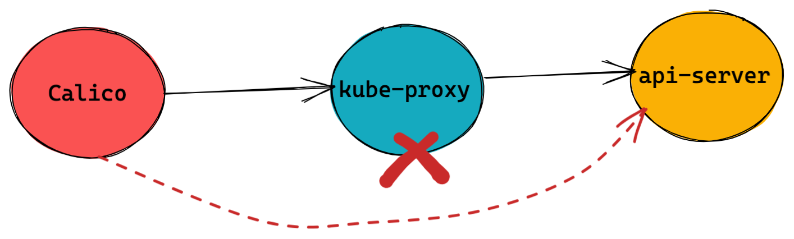

= Calico 
:toc: manual

== 安装

=== Install via operator

[source, bash]
.*1. install the operator*
----
kubectl create -f https://docs.projectcalico.org/archive/v3.16/manifests/tigera-operator.yaml
----

[source, bash]
.*2. Install Calico*
----
cat <<EOF | kubectl apply -f -
apiVersion: operator.tigera.io/v1
kind: Installation
metadata:
  name: default
spec:
  calicoNetwork:
    containerIPForwarding: Enabled
    ipPools:
    - cidr: 198.19.16.0/21
      natOutgoing: Enabled
      encapsulation: None
EOF
----

[source, bash]
.*3. Calico pods*
----
$ kubectl get pods -n calico-system 
NAME                                       READY   STATUS    RESTARTS   AGE
calico-typha-7fb7f4bd66-fvt89              1/1     Running   2          28m
calico-typha-7fb7f4bd66-gltp8              1/1     Running   2          28m
calico-node-42d6k                          1/1     Running   1          28m
calico-typha-7fb7f4bd66-lq6b5              1/1     Running   2          28m
calico-node-tlvbb                          1/1     Running   2          28m
calico-kube-controllers-57f767d97b-nxrnx   1/1     Running   3          28m
calico-node-l5n4s                          1/1     Running   0          28m
----

* *calico-node*: Calico-node runs on every Kubernetes cluster node as a DaemonSet. It is responsible for enforcing network policy, setting up routes on the nodes, plus managing any virtual interfaces for IPIP, VXLAN, or WireGuard.
* *calico-typha*: Typha is as a stateful proxy for the Kubernetes API server. It's used by every calico-node pod to query and watch Kubernetes resources without putting excessive load on the Kubernetes API server.  The Tigera Operator automatically scales the number of Typha instances as the cluster size grows.
* *calico-kube-controllers*: Runs a variety of Calico specific controllers that automate synchronization of resources. For example, when a Kubernetes node is deleted, it tidies up any IP addresses or other Calico resources associated with the node.

NOTE: The Kubernetes network model does specify that pods can communicate with each other directly without NAT. But a pod communicating with another pod via a service is not direct communication, and normally will use NAT to change the connection destination from the service to the backing pod as part of load balancing.

=== Install via Manifest

[source, bash]
.*1. Download Manifest*
----
curl https://docs.projectcalico.org/manifests/calico.yaml -O
----

NOTE: Uncomment the `CALICO_IPV4POOL_CIDR`, and make sure the CIDR value equals the value of `--pod-network-cidr`.

[source, bash]
.*2. Install Calico*
----
kubectl apply -f calico.yaml
---- 

NOTE: Refer to https://docs.projectcalico.org/getting-started/kubernetes/self-managed-onprem/onpremises[LINK] for more details.

[source, bash]
.*3. Calico pods*
----
$ kubectl get pods -A | grep calico
kube-system   calico-kube-controllers-855445d444-8rx26   1/1     Running   2          38h
kube-system   calico-node-56d8l                          1/1     Running   2          38h
kube-system   calico-node-r7ltw                          1/1     Running   2          38h
----

NOTE: Install via Manifest doesn't contains the *calico-typha*, which has less performance comapre with Install via operator.

=== Install calicoctl

[source, bash]
.*1. Download*
----
curl -o calicoctl -O -L  "https://github.com/projectcalico/calicoctl/releases/download/v3.20.1/calicoctl" 
----

[source, bash]
.*2. Copy to /usr/local/bin*
----
chmod +x calicoctl 
sudo cp calicoctl /usr/local/bin/
----

[source, bash]
.*3. Verify*
----
$ calicoctl get nodes -o wide
NAME            ASN       IPV4             IPV6   
control-plane   (64512)   172.16.25.3/24          
worker01        (64512)   172.16.25.4/24     
----

NOTE: Refer to https://docs.projectcalico.org/reference/calicoctl/ for calicoctl reference.

=== Deploy YaoBank App

The YaoBank Demo App contains 3 Microservice:

image:files/microservice-on-k8s.png[]

* Customer (which provides a simple web GUI)
* Summary (some middleware business logic)
* Database (the persistent datastore for the bank) 

Originally from https://raw.githubusercontent.com/tigera/ccol1/main/yaobank.yaml, the nodeSelector are adjuested, and the docker image are retagged.

* link:files/yaobank.yaml[yaobank.yaml]

[source, bash]
.*1. Deploy YaoBank App*
----
kubectl apply -f yaobank.yaml 
----

[source, bash]
.*2. Show YaoBank App*
----
$ kubectl get pods -n yaobank --show-labels --no-headers
customer-cfc847564-dk56j    1/1   Running   0     82s   app=customer,pod-template-hash=cfc847564,version=v1
database-644f4569dd-mnncp   1/1   Running   0     83s   app=database,pod-template-hash=644f4569dd,version=v1
summary-5877cf8b57-9sc44    1/1   Running   0     82s   app=summary,pod-template-hash=5877cf8b57,version=v1
summary-5877cf8b57-kjb7b    1/1   Running   0     82s   app=summary,pod-template-hash=5877cf8b57,version=v1
----

[source, bash]
.*3. Verify App*
----
$ curl http://control-plane:30180/ -I
HTTP/1.0 200 OK
Content-Type: text/html; charset=utf-8
Content-Length: 593
Server: Werkzeug/0.12.2 Python/2.7.12
Date: Fri, 24 Sep 2021 16:59:18 GMT
----

== 安全

=== 为什么需要 Network Policy？

image:files/networkpolicy.png[]

* 在容器平台需要基于IP地址或者应用端口进行流量控制（OSI L3、L4）
* 以应用为中心的设计，通过标签匹配的方式控制着应用POD如何被访问
* K8S 提供了 Network Policy API 接口，但是没有做实现，实现交给 CNI 插件实现厂商，实现与底层网络能力的解耦
* Network Policy价值
** 攻击者花样更加聪明
** 攻击量更多
** 东西向安全
** 可以让非网络专家配置防火墙。
* 南北向安全：Calico Enterprise integrates with Fortinet firewalls, and make Fortinet understands ingress node or pod ip address.

=== Kubernetes Network Policy 与 Calico 额外增加的 Network Policy

[cols="5a,5a"]
|===
|Kubernetes Network Policy |Calico Network Policy

|
* Ingress & egress rules
* Pod selectors
* Namespce selectors
* Port lists
* Named Ports
* IP blocks & excepts
* TCP, UDP, or SCTP
|
* Namespaced & global scopes
* Deny and log actions
* Policy ordering
* Richer matches, like ServiceAccounts, ICMP
* Istio integration, like Cryptpgraphic identity matching, Layer 5-7 match criteria

|===

=== 允许来自特定POD的入向访问

如下图所示为允许来自特定POD的入向访问，名称为database的POD只允许来自summary POD的入向访问

image:files/allow-traffic-from-specific-pod.png[]

[source, bash]
.*1. 查看 database POD 标签*
----
$ kubectl get pods -n yaobank --show-labels | grep database
database-644f4569dd-mnncp   1/1     Running   0          22h   app=database,pod-template-hash=644f4569dd,version=v1
----

[source, bash]
.*2. 查看 summary POD 标签*
----
$ kubectl get pods -n yaobank --show-labels | grep summary
summary-5877cf8b57-9sc44    1/1     Running   0          22h   app=summary,pod-template-hash=5877cf8b57,version=v1
summary-5877cf8b57-kjb7b    1/1     Running   0          22h   app=summary,pod-template-hash=5877cf8b57,version=v1
----

[source, bash]
.*3. 分别在 customer POD 和summary POD 内访问database*
----
CUSTOMER_POD=$(kubectl get pods -n yaobank -l app=customer -o name)
SUMMARY_POD=$(kubectl get pods -n yaobank -l app=summary -o name | head -n 1)

$ kubectl exec -it $CUSTOMER_POD -n yaobank -- bash 
root@customer-cfc847564-dk56j:/app# curl http://database:2379/v2/keys?recursive=true -I -s | head -n 1
HTTP/1.1 200 OK

$ kubectl exec -it $SUMMARY_POD -n yaobank -- bash 
root@summary-5877cf8b57-9sc44:/app# curl http://database:2379/v2/keys?recursive=true -I -s | head -n 1
HTTP/1.1 200 OK
----

[source, bash]
.*4. 添加 database-policy*
----
cat <<EOF | kubectl apply -f -
kind: NetworkPolicy
apiVersion: networking.k8s.io/v1
metadata:
  name: database-policy
  namespace: yaobank
spec:
  podSelector:
    matchLabels:
      app: database
  ingress:
  - from:
    - podSelector:
        matchLabels:
          app: summary
    ports:
      - protocol: TCP
        port: 2379
  egress:
    - to: []
EOF
----

* `spec.podSelector.matchLabels` - 指定要保护的目标 POD 为 database，具有 `app=database` 的标签。
* `spec.ingress.from.podSelector.matchLabels` - 指定允许访问的 POD 需具有 `app=summary` 标签

[source, bash]
.*5. 重复执行第3步，分别在 customer POD 和summary POD 内访问database**
----
root@customer-cfc847564-dk56j:/app# curl http://database:2379/v2/keys?recursive=true -I -m 3
curl: (28) Connection timed out after 3001 milliseconds

$ kubectl exec -it $SUMMARY_POD -n yaobank -- bash 
root@summary-5877cf8b57-9sc44:/app# curl http://database:2379/v2/keys?recursive=true -I -s | head -n 1
HTTP/1.1 200 OK
----

NOTE: 对比第三步执行的结果，拒绝来自 customer POD 的请求，而允许来自 summary POD 的请求。

[source, bash]
.*6. Clean Up*
----
kubectl delete networkpolicy database-policy -n yaobank
----

=== 设置 Default Deny 策略

[source, bash]
.*1. 访问服务*
----
$ curl http://control-plane:30180 -m 3
  <body>
  	<h1>Welcome to YAO Bank</h1>
  	<h2>Name: Spike Curtis</h2>
  	<h2>Balance: 2389.45</h2>
  	
<a href="/logout">Log Out >></a>

  </body>
----

[source, bash]
.*2. 设置 Default Deny 策略*
----
cat <<EOF | kubectl apply -f -
apiVersion: networking.k8s.io/v1
kind: NetworkPolicy
metadata:
  name: default-deny
  namespace: yaobank
spec:
  podSelector: {}
  policyTypes:
  - Ingress
  - Egress
EOF
----

[source, bash]
.*3. 重复步骤 1，访问服务*
----
$ curl http://control-plane:30180 -m 3
curl: (28) Operation timed out after 3001 milliseconds with 0 bytes received
----

[source, bash]
.*4. 分别在 customer POD 和 summary POD 中访问其他 POD*
----
$ kubectl exec -it $CUSTOMER_POD -n yaobank -- bash 
root@customer-cfc847564-dk56j:/app# curl http://summary -m 3
curl: (28) Resolving timed out after 3513 milliseconds
root@customer-cfc847564-dk56j:/app# curl http://database:2379/v2/keys?recursive=true -m 3
curl: (28) Resolving timed out after 3512 milliseconds

$ kubectl exec -it $SUMMARY_POD -n yaobank -- bash 
root@summary-5877cf8b57-9sc44:/app# curl http://database:2379/v2/keys?recursive=true -m 3
curl: (28) Resolving timed out after 3515 milliseconds
----

[source, bash]
.*5. Clean UP*
----
kubectl delete networkpolicy default-deny -n yaobank
----

=== yaobank 策略控制最佳实践

[source, bash]
.*1. 设置 Default Deny 策略*
----
cat <<EOF | kubectl apply -f -
apiVersion: networking.k8s.io/v1
kind: NetworkPolicy
metadata:
  name: default-deny
  namespace: yaobank
spec:
  podSelector: {}
  policyTypes:
  - Ingress
  - Egress
EOF
----

基于 namespace 设置 Default Deny 策略，namespace 内所有 POD 出向和入向都被禁止：

image:files/np-default-deny.png[]

[source, bash]
.*2. 基于所有 POD 设定入向和出向策略*
----
cat <<EOF | kubectl apply -f -
kind: NetworkPolicy
apiVersion: networking.k8s.io/v1
metadata:
  name: customer-policy
  namespace: yaobank
spec:
  podSelector:
    matchLabels:
      app: customer
  ingress:
    - ports:
      - protocol: TCP
        port: 80
  egress:
    - to: []
---
kind: NetworkPolicy
apiVersion: networking.k8s.io/v1
metadata:
  name: summary-policy
  namespace: yaobank
spec:
  podSelector:
    matchLabels:
      app: summary
  ingress:
    - from:
      - podSelector:
          matchLabels:
            app: customer
      ports:
      - protocol: TCP
        port: 80
  egress:
    - to:
      - podSelector:
          matchLabels:
            app: database
      ports:
      - protocol: TCP
        port: 2379
---
kind: NetworkPolicy
apiVersion: networking.k8s.io/v1
metadata:
  name: database-policy
  namespace: yaobank
spec:
  podSelector:
    matchLabels:
      app: database
  ingress:
  - from:
    - podSelector:
        matchLabels:
          app: summary
    ports:
      - protocol: TCP
        port: 2379
  egress:
    - to: []
EOF
----

=== Calico 策略设定 yaobank 策略控制最佳实践

Kubernetes 定义的 Default Deny 只能基于单个 namespace 设定Default Deny，而 Calico 策略设定 Default Deny 是基于 Kubernetes 全局设定。

[source, bash]
.*1. Default Deny*
----
cat <<EOF | calicoctl apply -f -
apiVersion: projectcalico.org/v3
kind: GlobalNetworkPolicy
metadata:
  name: default-app-policy
spec:
  namespaceSelector: has(projectcalico.org/name) && projectcalico.org/name not in {"kube-system", "calico-system"}
  types:
  - Ingress
  - Egress
EOF
----

[source, bash]
.*2. 更新全局策略，允许 DNS*
----
cat <<EOF | calicoctl apply -f -
apiVersion: projectcalico.org/v3
kind: GlobalNetworkPolicy
metadata:
  name: default-app-policy
spec:
  namespaceSelector: has(projectcalico.org/name) && projectcalico.org/name not in {"kube-system", "calico-system"}
  types:
  - Ingress
  - Egress
  egress:
    - action: Allow
      protocol: UDP
      destination:
        selector: k8s-app == "kube-dns"
        ports:
          - 53
EOF
----

[source, bash]
.*3. 基于每个 POD 设定出入向策略*
----
cat <<EOF | kubectl apply -f - 
kind: NetworkPolicy
apiVersion: networking.k8s.io/v1
metadata:
  name: database-policy
  namespace: yaobank
spec:
  podSelector:
    matchLabels:
      app: database
  ingress:
  - from:
    - podSelector:
        matchLabels:
          app: summary
    ports:
      - protocol: TCP
        port: 2379
  egress:
    - to: []
---
kind: NetworkPolicy
apiVersion: networking.k8s.io/v1
metadata:
  name: customer-policy
  namespace: yaobank
spec:
  podSelector:
    matchLabels:
      app: customer
  ingress:
    - ports:
      - protocol: TCP
        port: 80
  egress:
    - to: []
---
kind: NetworkPolicy
apiVersion: networking.k8s.io/v1
metadata:
  name: summary-policy
  namespace: yaobank
spec:
  podSelector:
    matchLabels:
      app: summary
  ingress:
    - from:
      - podSelector:
          matchLabels:
            app: customer
      ports:
      - protocol: TCP
        port: 80
  egress:
    - to:
      - podSelector:
          matchLabels:
            app: database
      ports:
      - protocol: TCP
        port: 2379
EOF
----

[source, bash]
.*4. 查看策略*
----
$ calicoctl get GlobalNetworkPolicy
NAME                 
default-app-policy   

$ kubectl get NetworkPolicy -n yaobank
NAME              POD-SELECTOR   AGE
customer-policy   app=customer   4m16s
database-policy   app=database   4m15s
summary-policy    app=summary    4m15s
----

[source, bash]
.*5. 访问服务*
----
$ curl http://control-plane:30180 -I -s | head -n 1
HTTP/1.0 200 OK
----

[source, bash]
.*6. Clean Up*
----
kubectl delete NetworkPolicy summary-policy -n yaobank
kubectl delete NetworkPolicy customer-policy -n yaobank
kubectl delete NetworkPolicy database-policy -n yaobank

calicoctl delete GlobalNetworkPolicy default-app-policy
----

=== Managing Trust Across Teams 

[source, bash]
.*1. Lockdown Cluster Egress*
----
cat <<EOF | calicoctl apply -f -
apiVersion: projectcalico.org/v3
kind: GlobalNetworkPolicy
metadata:
  name: egress-lockdown
spec:
  order: 600
  namespaceSelector: has(projectcalico.org/name) && projectcalico.org/name not in {"kube-system", "calico-system"}
  serviceAccountSelector: internet-egress not in {"allowed"}
  types:
  - Egress
  egress:
    - action: Deny
      destination:
        notNets:
          - 10.0.0.0/8
          - 172.16.0.0/12
          - 192.168.0.0/16
          - 198.18.0.0/15
EOF
----

[source, bash]
.*2. Grant Selective Cluster Egress*
----
kubectl label serviceaccount -n yaobank customer internet-egress=allowed
----

[source, bash]
.*3. Clean Up*
----
calicoctl delete GlobalNetworkPolicy egress-lockdown
----

=== Network Policy for Hosts and NodePorts 

[source, bash]
.*1. Network Policy for Nodes*
----
cat <<EOF| calicoctl apply -f -
---
apiVersion: projectcalico.org/v3
kind: GlobalNetworkPolicy
metadata:
  name: default-node-policy
spec:
  selector: has(kubernetes.io/hostname)
  ingress:
  - action: Allow
    protocol: TCP
    source:
      nets:
      - 127.0.0.1/32
  - action: Allow
    protocol: UDP
    source:
      nets:
      - 127.0.0.1/32
EOF
----

[source, bash]
.*2. Create Host Endpoints*
----
calicoctl patch kubecontrollersconfiguration default --patch='{"spec": {"controllers": {"node": {"hostEndpoint": {"autoCreate": "Enabled"}}}}}'
----

[source, bash]
.*3. Restrict Access to Kubernetes NodePorts*
----
cat <<EOF | calicoctl apply -f -
---
apiVersion: projectcalico.org/v3
kind: GlobalNetworkPolicy
metadata:
  name: nodeport-policy
spec:
  order: 100
  selector: has(kubernetes.io/hostname)
  applyOnForward: true
  preDNAT: true
  ingress:
  - action: Deny
    protocol: TCP
    destination:
      ports: ["30000:32767"]
  - action: Deny
    protocol: UDP
    destination:
      ports: ["30000:32767"]
EOF
----

[source, bash]
.*4. Selectively allow access to customer front end*
----
cat <<EOF | calicoctl apply -f -
---
apiVersion: projectcalico.org/v3
kind: GlobalNetworkPolicy
metadata:
  name: nodeport-policy
spec:
  order: 100
  selector: has(kubernetes.io/hostname)
  applyOnForward: true
  preDNAT: true
  ingress:
  - action: Allow
    protocol: TCP
    destination:
      ports: [30180]
    source:
      nets:
      - 198.19.15.254/32
  - action: Deny
    protocol: TCP
    destination:
      ports: ["30000:32767"]
  - action: Deny
    protocol: UDP
    destination:
      ports: ["30000:32767"]
EOF
----

[source, bash]
.*5. Clean Up*
----
calicoctl delete GlobalNetworkPolicy default-node-policy
calicoctl delete GlobalNetworkPolicy nodeport-policy
----

== POD Connectivity

=== Pods Network

[source, bash]
.*1. Exec into the pod*
----
CUSTOMER_POD=$(kubectl get pods -n yaobank -l app=customer -o name)
kubectl exec -ti -n yaobank $CUSTOMER_POD -- /bin/bash
----

[source, bash]
.*2. list interfaces*
----
root@customer-574bd6cc75-9wx6m:/app# ip a
1: lo: <LOOPBACK,UP,LOWER_UP> mtu 65536 qdisc noqueue state UNKNOWN group default qlen 1000
    link/loopback 00:00:00:00:00:00 brd 00:00:00:00:00:00
    inet 127.0.0.1/8 scope host lo
       valid_lft forever preferred_lft forever
    inet6 ::1/128 scope host 
       valid_lft forever preferred_lft forever
3: eth0@if5: <BROADCAST,MULTICAST,UP,LOWER_UP> mtu 1410 qdisc noqueue state UP group default 
    link/ether 86:2d:a8:72:34:7d brd ff:ff:ff:ff:ff:ff link-netnsid 0
    inet 198.19.22.147/32 brd 198.19.22.147 scope global eth0
       valid_lft forever preferred_lft forever
    inet6 fe80::842d:a8ff:fe72:347d/64 scope link 
       valid_lft forever preferred_lft forever
----

* There is a lo loopback interface with an IP address of 127.0.0.1. This is the standard loopback interface that every network namespace has by default. You can think of it as localhost for the pod itself.
* There is an eth0 interface which has the pods actual IP address, 198.19.22.147. Notice this matches the IP address that kubectl get pods returned earlier.

[source, bash]
.*3. ip link*
----
root@customer-574bd6cc75-9wx6m:/app# ip -c link show up
1: lo: <LOOPBACK,UP,LOWER_UP> mtu 65536 qdisc noqueue state UNKNOWN mode DEFAULT group default qlen 1000
    link/loopback 00:00:00:00:00:00 brd 00:00:00:00:00:00
3: eth0@if5: <BROADCAST,MULTICAST,UP,LOWER_UP> mtu 1410 qdisc noqueue state UP mode DEFAULT group default 
    link/ether 86:2d:a8:72:34:7d brd ff:ff:ff:ff:ff:ff link-netnsid 0
----

[source, bash]
.*4. Routing Table*
----
root@customer-574bd6cc75-9wx6m:/app# ip route
default via 169.254.1.1 dev eth0 
169.254.1.1 dev eth0  scope link 
----

NOTE: This shows that the pod's default route is out over the eth0 interface. i.e. Anytime it wants to send traffic to anywhere other than itself, it will send the traffic over eth0. (Note that the next hop address of 169.254.1.1 is a dummy address used by Calico. Every Calico networked pod sees this as its next hop.)

[source, bash]
.*5. Exit from the customer pod*
----
exit
----

=== WireGuard Encryption

[source, bash]
.*1. enabling encryption*
----
calicoctl patch felixconfiguration default --type='merge' -p '{"spec":{"wireguardEnabled":true}}'
----

[source, bash]
.*2. wireguardPublicKey*
----
$ calicoctl get node node1 -o yaml
apiVersion: projectcalico.org/v3
kind: Node
metadata:
  annotations:
    projectcalico.org/kube-labels: '{"beta.kubernetes.io/arch":"amd64","beta.kubernetes.io/instance-type":"k3s","beta.kubernetes.io/os":"linux","k3s.io/hostname":"node1","k3s.io/internal-ip":"198.19.0.2","kubernetes.io/arch":"amd64","kubernetes.io/hostname":"node1","kubernetes.io/os":"linux","node.kubernetes.io/instance-type":"k3s"}'
  creationTimestamp: "2021-08-25T14:20:09Z"
  labels:
    beta.kubernetes.io/arch: amd64
    beta.kubernetes.io/instance-type: k3s
    beta.kubernetes.io/os: linux
    k3s.io/hostname: node1
    k3s.io/internal-ip: 198.19.0.2
    kubernetes.io/arch: amd64
    kubernetes.io/hostname: node1
    kubernetes.io/os: linux
    node.kubernetes.io/instance-type: k3s
  name: node1
  resourceVersion: "22959"
  uid: 15122ad5-dfd7-4dfe-9c26-7a637a7088be
spec:
  bgp:
    ipv4Address: 198.19.0.2/20
  orchRefs:
  - nodeName: node1
    orchestrator: k8s
  wireguard:
    interfaceIPv4Address: 198.19.22.157
status:
  podCIDRs:
  - 198.19.17.0/24
  wireguardPublicKey: bIuu8myw2pIonLtCqtTf2bmzg4Syswp8m7wKh8C6mT4=
----

[source, bash]
.*3. inspect wireguard from the interfaces*
----
$ ssh node1
$ ip addr | grep wireguard
13: wireguard.cali: <POINTOPOINT,NOARP,UP,LOWER_UP> mtu 1400 qdisc noqueue state UNKNOWN group default qlen 1000
    inet 198.19.22.157/32 brd 198.19.22.157 scope global wireguard.cali
----

[source, bash]
.*4. Disabling Encryption*
----
calicoctl patch felixconfiguration default --type='merge' -p '{"spec":{"wireguardEnabled":false}}'
----

=== IP Pools

* IP Pools are calico resource which define ranges of addresses that the calico IP address management and IPAM CNI plugin can use. 

[source, bash]
----
$ calicoctl get IPPool default-ipv4-ippool -o yaml
apiVersion: projectcalico.org/v3
kind: IPPool
metadata:
  creationTimestamp: "2021-08-25T14:43:21Z"
  name: default-ipv4-ippool
  resourceVersion: "1371"
  uid: 218a5773-6fff-48fd-a175-486b9ad66faa
spec:
  blockSize: 26
  cidr: 198.19.16.0/21
  ipipMode: Never
  natOutgoing: true
  nodeSelector: all()
  vxlanMode: Never
----

* The IP Pool can be per Node, pernamespace
* To improve performance and scalibility, Calico IPAM to allocates IPs to nodes in blocks.IP 分配是动态的，当一个NODE用完了 64 个地址后，Calico IPAM 会在分配一个新 Block，如果 Block 被分配完了，则会到相邻的 NODE的Block借一个IP。

=== BGP Peering

* *什么是 BGP*

BGP 是一个标准的网络协议，大多数网络路由器都支持 BGP 协议，BGP 协议用来在路由器之间共享和同步路由信息。

=== Cluster IP Address Ranges

There are two address ranges that Kubernetes is normally configured with that are worth understanding:

* The cluster pod CIDR is the range of IP addresses Kubernetes is expecting to be assigned to pods in the cluster.
* The services CIDR is the range of IP addresses that are used for the Cluster IPs of Kubernetes Sevices (the virtual IP that corresponds to each Kubernetes Service).

[source, bash]
----
$ kubectl cluster-info dump | grep -m 2 -E "service-cidr|cluster-cidr"
                    "k3s.io/node-args": "[\"server\",\"--flannel-backend\",\"none\",\"--cluster-cidr\",\"198.19.16.0/20\",\"--service-cidr\",\"198.19.32.0/20\",\"--write-kubeconfig-mode\",\"664\",\"--disable-network-policy\"]",
----

=== Create IP Pools 

[source, bash]
.*1. Create externally routable IP Pool*
----
cat <<EOF | calicoctl apply -f - 
---
apiVersion: projectcalico.org/v3
kind: IPPool
metadata:
  name: external-pool
spec:
  cidr: 198.19.24.0/21
  blockSize: 29
  ipipMode: Never
  natOutgoing: true
  nodeSelector: "!all()"
EOF
----

[source, bash]
.*2. Examine BGP peering status*
----
$ ssh node1
$ sudo calicoctl node status
Calico process is running.

IPv4 BGP status
+--------------+-------------------+-------+----------+-------------+
| PEER ADDRESS |     PEER TYPE     | STATE |  SINCE   |    INFO     |
+--------------+-------------------+-------+----------+-------------+
| 198.19.0.1   | node-to-node mesh | up    | 07:25:58 | Established |
| 198.19.0.3   | node-to-node mesh | up    | 07:25:56 | Established |
+--------------+-------------------+-------+----------+-------------+

IPv6 BGP status
No IPv6 peers found.
----

[source, bash]
.*3. Add a BGP Peer*
----
cat <<EOF | calicoctl apply -f -
---
apiVersion: projectcalico.org/v3
kind: BGPPeer
metadata:
  name: bgppeer-global-host1
spec:
  peerIP: 198.19.15.254
  asNumber: 64512
EOF
----

[source, bash]
.*4. Examine BGP peering status*
----
$ ssh node1
$ sudo calicoctl node status
Calico process is running.

IPv4 BGP status
+---------------+-------------------+-------+----------+-------------+
| PEER ADDRESS  |     PEER TYPE     | STATE |  SINCE   |    INFO     |
+---------------+-------------------+-------+----------+-------------+
| 198.19.0.1    | node-to-node mesh | up    | 07:25:58 | Established |
| 198.19.0.3    | node-to-node mesh | up    | 07:25:56 | Established |
| 198.19.15.254 | global            | up    | 08:39:33 | Established |
+---------------+-------------------+-------+----------+-------------+

IPv6 BGP status
No IPv6 peers found.
----

[source, bash]
.*5. Configure a Namespace to use External Routable IP Addresses*
----
cat <<EOF| kubectl apply -f - 
---
apiVersion: v1
kind: Namespace
metadata:
  annotations:
    cni.projectcalico.org/ipv4pools: '["external-pool"]'
  name: external-ns
EOF
----

[source, bash]
.*6. Deploy Nginx*
----
cat <<EOF| kubectl apply -f -
---
apiVersion: apps/v1
kind: Deployment
metadata:
  name: nginx
  namespace: external-ns
spec:
  replicas: 1
  selector:
    matchLabels:
      app: nginx
  template:
    metadata:
      labels:
        app: nginx
        version: v1
    spec:
      containers:
      - name: nginx
        image: nginx
        imagePullPolicy: IfNotPresent
      nodeSelector:
        kubernetes.io/hostname: node1

---
kind: NetworkPolicy
apiVersion: networking.k8s.io/v1
metadata:
  name: nginx
  namespace: external-ns
spec:
  podSelector:
    matchLabels:
      app: nginx
  policyTypes:
  - Ingress
  - Egress
  ingress:
  - ports:
    - protocol: TCP
      port: 80
EOF
----

[source, bash]
.*7. Access the NGINX pod from outside the cluster*
----
$ kubectl get pods -n external-ns -o wide --no-headers
nginx-8c44c96c6-xtw74   1/1   Running   0     70s   198.19.28.208   node1   <none>   <none>

$ curl 198.19.28.208 -I
HTTP/1.1 200 OK
Server: nginx/1.21.1
Date: Sat, 28 Aug 2021 08:48:10 GMT
Content-Type: text/html
Content-Length: 612
Last-Modified: Tue, 06 Jul 2021 14:59:17 GMT
Connection: keep-alive
ETag: "60e46fc5-264"
Accept-Ranges: bytes
----

[source, bash]
.*8. Check Calico IPAM allocations statistics*
----
$ calicoctl ipam show
+----------+----------------+-----------+------------+-------------+
| GROUPING |      CIDR      | IPS TOTAL | IPS IN USE |  IPS FREE   |
+----------+----------------+-----------+------------+-------------+
| IP Pool  | 198.19.16.0/21 |      2048 | 12 (1%)    | 2036 (99%)  |
| IP Pool  | 198.19.24.0/21 |      2048 | 1 (0%)     | 2047 (100%) |
+----------+----------------+-----------+------------+-------------+
----

== Kubernetes Services Networking

=== kube-proxy service debug

[source, bash]
.*1. List the services*
----
$ kubectl get svc -n yaobank
NAME       TYPE        CLUSTER-IP      EXTERNAL-IP   PORT(S)        AGE
database   ClusterIP   198.19.33.67    <none>        2379/TCP       2d23h
summary    ClusterIP   198.19.46.158   <none>        80/TCP         2d23h
customer   NodePort    198.19.32.122   <none>        80:30180/TCP   2d23h
----

[source, bash]
.*2. List the endpoints for each of the services*
----
$ kubectl get endpoints -n yaobank
NAME       ENDPOINTS                       AGE
customer   198.19.22.156:80                2d23h
database   198.19.21.74:2379               2d23h
summary    198.19.21.7:80,198.19.21.8:80   2d23h
----

[source, bash]
.*3. List the pods*
----
$ kubectl get pods -n yaobank -o wide --no-headers
database-6c5db58d95-nnwsp   1/1   Running   2     2d23h   198.19.21.74    node2     <none>   <none>
summary-85c56b76d7-v8vs6    1/1   Running   2     2d23h   198.19.21.7     control   <none>   <none>
summary-85c56b76d7-nn9fv    1/1   Running   2     2d23h   198.19.21.8     control   <none>   <none>
customer-574bd6cc75-9wx6m   1/1   Running   2     2d23h   198.19.22.156   node1     <none>   <none>
----

==== ClusterIP

image:files/Cluster_IP_Diagram.png[]

[source, bash]
.*1. KUBE-SERVICES -> KUBE-SVC-XXXXXXXXXXXXXXXX*
----
$ ssh control
$ sudo iptables -v --numeric --table nat --list KUBE-SERVICES | grep  summary
    0     0 KUBE-MARK-MASQ  tcp  --  *      *      !198.19.16.0/20       198.19.46.158        /* yaobank/summary:http cluster IP */ tcp dpt:80
    0     0 KUBE-SVC-OIQIZJVJK6E34BR4  tcp  --  *      *       0.0.0.0/0            198.19.46.158        /* yaobank/summary:http cluster IP */ tcp dpt:80
----

[source, bash]
.*2. KUBE-SVC-OIQIZJVJK6E34BR4 -> KUBE-SEP-XXXXXXXXXXXXXXXX*
----
$ sudo iptables -v --numeric --table nat --list KUBE-SVC-OIQIZJVJK6E34BR4 
Chain KUBE-SVC-OIQIZJVJK6E34BR4 (1 references)
 pkts bytes target     prot opt in     out     source               destination         
    0     0 KUBE-SEP-GRMQA4KZODSYCGHU  all  --  *      *       0.0.0.0/0            0.0.0.0/0            /* yaobank/summary:http */ statistic mode random probability 0.50000000000
    0     0 KUBE-SEP-HE4BCN24RMUDWA6V  all  --  *      *       0.0.0.0/0            0.0.0.0/0            /* yaobank/summary:http */
----

[source, bash]
.*3. KUBE-SEP-XXXXXXXXXXXXXXXX -> summary endpoint*
----
$ sudo iptables -v --numeric --table nat --list KUBE-SEP-GRMQA4KZODSYCGHU
Chain KUBE-SEP-GRMQA4KZODSYCGHU (1 references)
 pkts bytes target     prot opt in     out     source               destination         
    0     0 KUBE-MARK-MASQ  all  --  *      *       198.19.21.7          0.0.0.0/0            /* yaobank/summary:http */
    0     0 DNAT       tcp  --  *      *       0.0.0.0/0            0.0.0.0/0            /* yaobank/summary:http */ tcp to:198.19.21.7:80
----

==== NodePort

image:files/NodePorrt_Diagram.png []

[source, bash]
.*1. KUBE-SERVICES -> KUBE-NODEPORTS*
----
$ sudo iptables -v --numeric --table nat --list KUBE-SERVICES | grep KUBE-NODEPORTS
  619 37158 KUBE-NODEPORTS  all  --  *      *       0.0.0.0/0            0.0.0.0/0            /* kubernetes service nodeports; NOTE: this must be the last rule in this chain */ ADDRTYPE match dst-type LOCAL
----

[source, bash]
.*2. KUBE-NODEPORTS -> KUBE-SVC-XXXXXXXXXXXXXXXX*
----
$ sudo iptables -v --numeric --table nat --list KUBE-NODEPORTS | grep customer
    0     0 KUBE-MARK-MASQ  tcp  --  *      *       0.0.0.0/0            0.0.0.0/0            /* yaobank/customer:http */ tcp dpt:30180
    0     0 KUBE-SVC-PX5FENG4GZJTCELT  tcp  --  *      *       0.0.0.0/0            0.0.0.0/0            /* yaobank/customer:http */ tcp dpt:30180
----

[source, bash]
.*3. KUBE-SVC-XXXXXXXXXXXXXXXX -> KUBE-SEP-XXXXXXXXXXXXXXXX*
----
$ sudo iptables -v --numeric --table nat --list KUBE-SVC-PX5FENG4GZJTCELT
Chain KUBE-SVC-PX5FENG4GZJTCELT (2 references)
 pkts bytes target     prot opt in     out     source               destination         
    0     0 KUBE-SEP-5S2QR7W7CXIFMZTT  all  --  *      *       0.0.0.0/0            0.0.0.0/0            /* yaobank/customer:http */
----

[source, bash]
.*4. KUBE-SEP-XXXXXXXXXXXXXXXX -> customer endpoint*
----
$ sudo iptables -v --numeric --table nat --list KUBE-SEP-5S2QR7W7CXIFMZTT
Chain KUBE-SEP-5S2QR7W7CXIFMZTT (1 references)
 pkts bytes target     prot opt in     out     source               destination         
    0     0 KUBE-MARK-MASQ  all  --  *      *       198.19.22.156        0.0.0.0/0            /* yaobank/customer:http */
    0     0 DNAT       tcp  --  *      *       0.0.0.0/0            0.0.0.0/0            /* yaobank/customer:http */ tcp to:198.19.22.156:80
----

==== NodePort SNAT

[source, bash]
.*1, Access the customer service via nodeport*
----
$ curl 198.19.0.1:30180
$ curl 198.19.0.2:30180
$ curl 198.19.0.3:30180
----

[source, bash]
.*2. View the customer pod logs*
----
$ kubectl logs  customer-574bd6cc75-9wx6m -n yaobank
198.19.0.1 - - [28/Aug/2021 15:14:21] "GET / HTTP/1.1" 200 -
198.19.0.2 - - [28/Aug/2021 15:16:54] "GET / HTTP/1.1" 200 -
198.19.0.3 - - [28/Aug/2021 15:17:03] "GET / HTTP/1.1" 200 -
----

=== Calico Native Service Handling

* Calico eBPF data plane supports native service handling.
* Calico's eBPF dataplane is an alternative to the default standard Linux dataplane (which is iptables based). The eBPF dataplane has a number of advantages:
** It scales to higher throughput.
** It uses less CPU per GBit.
** It has native support for Kubernetes services (without needing kube-proxy) that:
*** Reduces first packet latency for packets to services.
*** Preserves external client source IP addresses all the way to the pod.
*** Supports DSR (Direct Server Return) for more efficient service routing.
*** Uses less CPU than kube-proxy to keep the dataplane in sync.

[source, bash]
.*1. Configure Calico to connect directly to the API server*
----
cat <<EOF | kubectl apply -f -
---
kind: ConfigMap
apiVersion: v1
metadata:
  name: kubernetes-services-endpoint
  namespace: tigera-operator
data:
  KUBERNETES_SERVICE_HOST: "198.19.0.1"
  KUBERNETES_SERVICE_PORT: "6443"
EOF
----

[source, bash]
.*2.  recreated with the new configuration*
----
kubectl delete pod -n tigera-operator -l k8s-app=tigera-operator
----

[source, bash]
.*3. Disable kube-proxy*
----
calicoctl patch felixconfiguration default --patch='{"spec": {"bpfKubeProxyIptablesCleanupEnabled": false}}'
----

[source, bash]
.*4. Switch on eBPF mode*
----
calicoctl patch felixconfiguration default --patch='{"spec": {"bpfEnabled": true}}'
----

[source, bash]
.*5. restart YAO Bank's customer and summary pods*
----
kubectl delete pod -n yaobank -l app=customer
kubectl delete pod -n yaobank -l app=summary
----

==== Source IP preservation

image:files/eBPF_Source_IP_Diagram.png[]

[source, bash]
.*1, Access the customer service via nodeport*
----
$ curl 198.19.0.1:30180
$ curl 198.19.0.2:30180
$ curl 198.19.0.3:30180
----

=== Advertising Services

[source, bash]
.*1. Update Calico BGP configuration*
----
cat <<EOF | calicoctl apply -f -
---
apiVersion: projectcalico.org/v3
kind: BGPConfiguration
metadata:
  name: default
spec:
  serviceClusterIPs:
  - cidr: "198.19.32.0/20"
EOF
----

== Calico with AWS

=== AWS Networking

image:files/aws-global-cloud.png[]

* *AWS Global Cloud* - Devices and Services in many regions. 
* *AWS Region* - A physical location around the world where Amazon have equipment in data centers .
* *Virtual Private Cloud(VPC)* - A logically isolated virtual private network that exists within AWS cloud. VPC can span AZ in a region.
* *Availability Zone(AZ)* - A group of data centers in a region, each AZ has independent power, cooling, and physical security and is connected via multiple physical networks. 
* *Subnet* - A subnet is a section of VPC's IP range, a subnet must be reside within a single AZ,
* *Elastic Network Interfaces(ENI)* - A logical networking component in a VPC that represents a virtual network card.

=== AWS CNI 优缺点

[cols="5a,5a"]
|===
|优点 |缺点

|
* Pods get native IPs
* Routing from outside or control nodes "just works"
* Using multiple ENIS gives access to more bandwidth
* IAM integration is improved
|
* Number of pods per node is limited by number of ENIs and Node type
|===

=== AWS 上使用 Calico 的 5 种组合方式

|===
|CNI |NetworkPolicy |Dataplane

|AWS-CNI
|
|iptables

|AWS-CNI
|Calico Policy
|iptables

|AWS-CNI
|Calico Policy
|Calico eBPF

|Calico CNI
|Calico Policy
|iptables

|Calico CNI
|Calico Policy
|Calico eBPF
|===

=== AWS CNI + Calico Policy + iptables Dataplane

==== 集群创建

[source, bash]
.*1. eksctl 创建集群*
----
eksctl create cluster --name calicopolicy --version 1.18 --ssh-access --node-type t3.medium
----

* 详细关于eksctl: https://docs.aws.amazon.com/eks/latest/userguide/eksctl.html

[source, bash]
.*2. 验证集群创建成功*
----
$ kubectl get nodes -A -o wide
NAME                                               STATUS   ROLES    AGE   VERSION               INTERNAL-IP     EXTERNAL-IP     OS-IMAGE         KERNEL-VERSION                  CONTAINER-RUNTIME
ip-192-168-46-0.ap-northeast-1.compute.internal    Ready    <none>   10m   v1.18.20-eks-c9f1ce   192.168.46.0    3.113.245.244   Amazon Linux 2   4.14.248-189.473.amzn2.x86_64   docker://20.10.7
ip-192-168-76-87.ap-northeast-1.compute.internal   Ready    <none>   10m   v1.18.20-eks-c9f1ce   192.168.76.87   3.112.56.246    Amazon Linux 2   4.14.248-189.473.amzn2.x86_64   docker://20.10.7

$ kubectl get pods -A -o wide
NAMESPACE     NAME                       READY   STATUS    RESTARTS   AGE   IP               NODE                                               NOMINATED NODE   READINESS GATES
kube-system   aws-node-2gggk             1/1     Running   0          11m   192.168.46.0     ip-192-168-46-0.ap-northeast-1.compute.internal    <none>           <none>
kube-system   aws-node-q9kcb             1/1     Running   0          11m   192.168.76.87    ip-192-168-76-87.ap-northeast-1.compute.internal   <none>           <none>
kube-system   coredns-86f7d88d77-gdm9f   1/1     Running   0          19m   192.168.75.233   ip-192-168-76-87.ap-northeast-1.compute.internal   <none>           <none>
kube-system   coredns-86f7d88d77-wlqgf   1/1     Running   0          19m   192.168.49.127   ip-192-168-46-0.ap-northeast-1.compute.internal    <none>           <none>
kube-system   kube-proxy-5bxqv           1/1     Running   0          11m   192.168.46.0     ip-192-168-46-0.ap-northeast-1.compute.internal    <none>           <none>
kube-system   kube-proxy-cldfs           1/1     Running   0          11m   192.168.76.87    ip-192-168-76-87.ap-northeast-1.compute.internal   <none>           <none>
----

==== 测试应用部署

[source, bash]
.*1. Deploy Demo App*
----
kubectl apply -f https://raw.githubusercontent.com/tigera/ccol2aws/main/yaobank.yaml
----

[source, bash]
.*2. 验证APP创建成功*
----
$ kubectl get pods -n yaobank -o wide
NAME                        READY   STATUS    RESTARTS   AGE   IP               NODE                                               NOMINATED NODE   READINESS GATES
customer-bf4c98479-2np9p    1/1     Running   0          42s   192.168.57.109   ip-192-168-46-0.ap-northeast-1.compute.internal    <none>           <none>
database-5b96655b86-88hwq   1/1     Running   0          42s   192.168.92.187   ip-192-168-76-87.ap-northeast-1.compute.internal   <none>           <none>
summary-85c56b76d7-c28j6    1/1     Running   0          41s   192.168.54.112   ip-192-168-46-0.ap-northeast-1.compute.internal    <none>           <none>
summary-85c56b76d7-td5rq    1/1     Running   0          41s   192.168.85.137   ip-192-168-76-87.ap-northeast-1.compute.internal   <none>           <none>
----

==== AWS-CNI IPAM

[source, bash]
.*1. 不同型号 EC2 节点支持的 IP 数量*
----
$ aws ec2 describe-instance-types --filters Name=instance-type,Values=t3.* --query "InstanceTypes[].{Type: InstanceType, MaxENI: NetworkInfo.MaximumNetworkInterfaces, IPv4addr: NetworkInfo.Ipv4AddressesPerInterface}" --output table
--------------------------------------
|        DescribeInstanceTypes       |
+----------+----------+--------------+
| IPv4addr | MaxENI   |    Type      |
+----------+----------+--------------+
|  15      |  4       |  t3.2xlarge  |
|  15      |  4       |  t3.xlarge   |
|  6       |  3       |  t3.medium   |
|  12      |  3       |  t3.large    |
|  2       |  2       |  t3.micro    |
|  2       |  2       |  t3.nano     |
|  4       |  3       |  t3.small    |
+----------+----------+--------------+
----

* *POD 可用的最大 IP地址* - ((MaxENI * (IPv4addr-1)) + 2)
* t3.medium 最大 POD 可用地址为 17
* t3.large 最大 POD 可用地址为 35

[source, bash]
.*2. 查看当前已使用的 IP*
----
$ kubectl get pods -A -o wide --no-headers | awk '{print $2, $7}'
aws-node-2gggk 192.168.46.0
aws-node-q9kcb 192.168.76.87
coredns-86f7d88d77-gdm9f 192.168.75.233
coredns-86f7d88d77-wlqgf 192.168.49.127
kube-proxy-5bxqv 192.168.46.0
kube-proxy-cldfs 192.168.76.87
customer-bf4c98479-2np9p 192.168.57.109
database-5b96655b86-88hwq 192.168.92.187
summary-85c56b76d7-c28j6 192.168.54.112
summary-85c56b76d7-td5rq 192.168.85.137
----

NOTE: t3.medium 最大 POD 可用地址为 17，两个 t3.medium 最大 POD 可用地址为34，当前集群剩余可分配 POD IP 为24（34-10）。

[source, bash]
.*3. 扩展 customer POD 到 30 个副本（部分会由于分不到 IP 地址而失败，新增 29 个 POD，可分配的 IP 为24个，有5个 POD不会启动成功）*
----
$ kubectl scale -n yaobank --replicas 30 deployments/customer

// 已使用了 34 POD 地址
$ kubectl get pods -A | grep Running | wc -l
34

kubectl get pods -n  yaobank | grep Pending | wc -l
5
----

[source, bash]
.*4. POD 上报错日志*
----
$ kubectl describe pod -n yaobank customer-bf4c98479-x9pkf
Name:           customer-bf4c98479-x9pkf
Namespace:      yaobank
Priority:       0
Node:           <none>
Labels:         app=customer
                pod-template-hash=bf4c98479
                version=v1
Annotations:    kubernetes.io/psp: eks.privileged
Status:         Pending
IP:             
IPs:            <none>
Controlled By:  ReplicaSet/customer-bf4c98479
Containers:
  customer:
    Image:        calico/yaobank-customer:certification
    Port:         80/TCP
    Host Port:    0/TCP
    Environment:  <none>
    Mounts:
      /var/run/secrets/kubernetes.io/serviceaccount from customer-token-gxgsc (ro)
Conditions:
  Type           Status
  PodScheduled   False 
Volumes:
  customer-token-gxgsc:
    Type:        Secret (a volume populated by a Secret)
    SecretName:  customer-token-gxgsc
    Optional:    false
QoS Class:       BestEffort
Node-Selectors:  <none>
Tolerations:     node.kubernetes.io/not-ready:NoExecute op=Exists for 300s
                 node.kubernetes.io/unreachable:NoExecute op=Exists for 300s
Events:
  Type     Reason            Age                From               Message
  ----     ------            ----               ----               -------
  Warning  FailedScheduling  90s (x9 over 11m)  default-scheduler  0/2 nodes are available: 2 Too many pods.
----

[source, bash]
.*5. Scale Down the APP*
----
kubectl scale -n yaobank --replicas 1 deployments/customer
----

==== AWS ENI DEBUG

[source, bash]
.*1. 查看计算节点 1 上的 POD*
----
$ kubectl get pods -A -o wide | grep ip-192-168-46-0.ap-northeast-1.compute.internal 
kube-system   aws-node-2gggk              1/1     Running   0          56m   192.168.46.0     ip-192-168-46-0.ap-northeast-1.compute.internal    <none>           <none>
kube-system   coredns-86f7d88d77-wlqgf    1/1     Running   0          65m   192.168.49.127   ip-192-168-46-0.ap-northeast-1.compute.internal    <none>           <none>
kube-system   kube-proxy-5bxqv            1/1     Running   0          56m   192.168.46.0     ip-192-168-46-0.ap-northeast-1.compute.internal    <none>           <none>
yaobank       summary-85c56b76d7-c28j6    1/1     Running   0          44m   192.168.54.112   ip-192-168-46-0.ap-northeast-1.compute.internal    <none>           <none>
----

[source, bash]
.*2. 登录到计算节点*
----
$ kubectl get nodes -o wide | grep ip-192-168-46-0.ap-northeast-1.compute.internal | awk '{print $1, $7}'
ip-192-168-46-0.ap-northeast-1.compute.internal 3.113.245.244

$ ssh ec2-user@3.113.245.244
----

[source, bash]
.*3. 查看 3 个 ENI *
----
$ ip addr
...
2: eth0: <BROADCAST,MULTICAST,UP,LOWER_UP> mtu 9001 qdisc mq state UP group default qlen 1000
    link/ether 0e:5e:cc:73:90:c9 brd ff:ff:ff:ff:ff:ff
    inet 192.168.46.0/19 brd 192.168.63.255 scope global dynamic eth0
       valid_lft 2698sec preferred_lft 2698sec
    inet6 fe80::c5e:ccff:fe73:90c9/64 scope link 
       valid_lft forever preferred_lft forever
...
28: eth1: <BROADCAST,MULTICAST,UP,LOWER_UP> mtu 9001 qdisc mq state UP group default qlen 1000
    link/ether 0e:e7:e0:d9:b5:0d brd ff:ff:ff:ff:ff:ff
    inet 192.168.47.196/19 brd 192.168.63.255 scope global eth1
       valid_lft forever preferred_lft forever
    inet6 fe80::ce7:e0ff:fed9:b50d/64 scope link 
       valid_lft forever preferred_lft forever
...
14: eth2: <BROADCAST,MULTICAST,UP,LOWER_UP> mtu 9001 qdisc mq state UP group default qlen 1000
    link/ether 0e:90:9b:08:ca:19 brd ff:ff:ff:ff:ff:ff
    inet 192.168.46.116/19 brd 192.168.63.255 scope global eth2
       valid_lft forever preferred_lft forever
    inet6 fe80::c90:9bff:fe08:ca19/64 scope link 
       valid_lft forever preferred_lft forever
----

[source, bash]
.*4. 查看 POD L2 Port*
----
$ ip a
...
3: eni55c81bde47f: <BROADCAST,MULTICAST,UP,LOWER_UP> mtu 9001 qdisc noqueue state UP group default 
    link/ether e2:bd:60:03:d6:95 brd ff:ff:ff:ff:ff:ff link-netnsid 0
    inet6 fe80::e0bd:60ff:fe03:d695/64 scope link 
       valid_lft forever preferred_lft forever
6: eni14acb186de7@if3: <BROADCAST,MULTICAST,UP,LOWER_UP> mtu 9001 qdisc noqueue state UP group default 
    link/ether 92:79:17:b2:0b:6a brd ff:ff:ff:ff:ff:ff link-netnsid 2
    inet6 fe80::9079:17ff:feb2:b6a/64 scope link 
       valid_lft forever preferred_lft forever
----

[source, bash]
.*5. ip rule*
----
$ ip rule
0:      from all lookup local 
512:    from all to 192.168.49.127 lookup main 
512:    from all to 192.168.54.112 lookup main 
512:    from all to 192.168.62.196 lookup main 
512:    from all to 192.168.62.66 lookup main 
512:    from all to 192.168.57.109 lookup main 
512:    from all to 192.168.52.72 lookup main 
512:    from all to 192.168.43.112 lookup main 
512:    from all to 192.168.58.45 lookup main 
512:    from all to 192.168.54.134 lookup main 
512:    from all to 192.168.43.102 lookup main 
512:    from all to 192.168.60.236 lookup main 
512:    from all to 192.168.42.143 lookup main 
512:    from all to 192.168.53.163 lookup main 
512:    from all to 192.168.34.227 lookup main 
1024:   from all fwmark 0x80/0x80 lookup main 
1536:   from 192.168.52.72 to 192.168.0.0/16 lookup 3 
1536:   from 192.168.43.112 to 192.168.0.0/16 lookup 3 
1536:   from 192.168.58.45 to 192.168.0.0/16 lookup 3 
1536:   from 192.168.54.134 to 192.168.0.0/16 lookup 3 
1536:   from 192.168.43.102 to 192.168.0.0/16 lookup 3 
1536:   from 192.168.60.236 to 192.168.0.0/16 lookup 2 
1536:   from 192.168.42.143 to 192.168.0.0/16 lookup 2 
1536:   from 192.168.53.163 to 192.168.0.0/16 lookup 2 
1536:   from 192.168.34.227 to 192.168.0.0/16 lookup 2 
32766:  from all lookup main 
32767:  from all lookup default 
----

[source, bash]
.*6. 查看路由表*
----
$ ip route show table main
default via 192.168.32.1 dev eth0 
169.254.169.254 dev eth0 
192.168.32.0/19 dev eth0 proto kernel scope link src 192.168.46.0 
192.168.34.227 dev enid9db68cfa09 scope link 
192.168.42.143 dev eni7bb60820661 scope link 
192.168.43.102 dev enif625a3b6ece scope link 
192.168.43.112 dev eni84d1fe33efe scope link 
192.168.49.127 dev eni55c81bde47f scope link 
192.168.52.72 dev eni1cc215ba5a7 scope link 
192.168.53.163 dev eni8229e014bcc scope link 
192.168.54.112 dev eni14acb186de7 scope link 
192.168.54.134 dev eni7ef47dfe8b7 scope link 
192.168.57.109 dev enib7e715ac094 scope link 
192.168.58.45 dev eni9628b5d8d6d scope link 
192.168.60.236 dev enifedb39161ec scope link 
192.168.62.66 dev eni028bc2a8670 scope link 
192.168.62.196 dev eni29dcee60bb0 scope link 

$ ip route show table 2
default via 192.168.32.1 dev eth1 
192.168.32.1 dev eth1 scope link 

$ ip route show table 3
default via 192.168.32.1 dev eth2 
192.168.32.1 dev eth2 scope link 
----

==== Calico Policy with AWS-CNI（不提供 IPAM，只做 L3/L4 安全管控）

[source, bash]
.*1. 安装*
----
kubectl apply -f https://raw.githubusercontent.com/aws/amazon-vpc-cni-k8s/v1.7.8/config/v1.7/calico.yaml
----

[source, bash]
.*2. 验证安装成功*
----
$ kubectl get pods -n kube-system -o wide
NAME                                                  READY   STATUS    RESTARTS   AGE     IP               NODE                                               NOMINATED NODE   READINESS GATES
aws-node-2gggk                                        1/1     Running   0          86m     192.168.46.0     ip-192-168-46-0.ap-northeast-1.compute.internal    <none>           <none>
aws-node-q9kcb                                        1/1     Running   0          86m     192.168.76.87    ip-192-168-76-87.ap-northeast-1.compute.internal   <none>           <none>
calico-node-fbc9m                                     1/1     Running   0          2m9s    192.168.76.87    ip-192-168-76-87.ap-northeast-1.compute.internal   <none>           <none>
calico-node-wtzvm                                     1/1     Running   0          2m9s    192.168.46.0     ip-192-168-46-0.ap-northeast-1.compute.internal    <none>           <none>
calico-typha-5ff6788794-x95cv                         1/1     Running   0          2m10s   192.168.46.0     ip-192-168-46-0.ap-northeast-1.compute.internal    <none>           <none>
calico-typha-horizontal-autoscaler-7d57c996b4-c6hqx   1/1     Running   0          2m10s   192.168.62.66    ip-192-168-46-0.ap-northeast-1.compute.internal    <none>           <none>
coredns-86f7d88d77-gdm9f                              1/1     Running   0          94m     192.168.75.233   ip-192-168-76-87.ap-northeast-1.compute.internal   <none>           <none>
coredns-86f7d88d77-wlqgf                              1/1     Running   0          94m     192.168.49.127   ip-192-168-46-0.ap-northeast-1.compute.internal    <none>           <none>
kube-proxy-5bxqv                                      1/1     Running   0          86m     192.168.46.0     ip-192-168-46-0.ap-northeast-1.compute.internal    <none>           <none>
kube-proxy-cldfs                                      1/1     Running   0          86m     192.168.76.87    ip-192-168-76-87.ap-northeast-1.compute.internal   <none>           <none>
----

NOTE: 4 个calico DeamonSet POD 创建，使用 Node 节点。 

[source, bash]
.*3. 记录 POD 名称到脚本中*
----
export CUSTOMER_POD=$(kubectl get pods -n yaobank -l app=customer -o name)
export SUMMARY_POD=$(kubectl get pods -n yaobank -l app=summary -o name | head -n 1)
echo "export CUSTOMER_POD=${CUSTOMER_POD}" >> ccol2awsexports.sh
echo "export SUMMARY_POD=${SUMMARY_POD}" >> ccol2awsexports.sh
chmod 700 ccol2awsexports.sh
. ccol2awsexports.sh
----

[source, bash]
.*4. 从 cusomer POD 访问 database POD（访问成功）*
----
$ kubectl exec -it $CUSTOMER_POD -n yaobank -c customer -- /bin/bash

root@customer-bf4c98479-b4t8z:/app# curl http://database:2379/v2/keys?recursive=true  -I
HTTP/1.1 200 OK
Content-Type: application/json
X-Etcd-Cluster-Id: 7e27652122e8b2ae
X-Etcd-Index: 18
X-Raft-Index: 9861
X-Raft-Term: 5
Date: Tue, 02 Nov 2021 02:40:10 GMT
Content-Length: 1715
----

[source, bash]
.*5. 添加全局 Default Deny*
----
cat <<EOF | calicoctl apply -f -
apiVersion: projectcalico.org/v3
kind: GlobalNetworkPolicy
metadata:
  name: default-app-policy
spec:
  namespaceSelector: has(projectcalico.org/name) && projectcalico.org/name not in {"kube-system", "calico-system"}
  types:
  - Ingress
  - Egress
  egress:
    - action: Allow
      protocol: UDP
      destination:
        selector: k8s-app == "kube-dns"
        ports:
          - 53
EOF
----

[source, bash]
.*6. 从 cusomer POD 访问 database POD（访问失败）*
----
$ kubectl exec -it $CUSTOMER_POD -n yaobank -c customer -- /bin/bash

root@customer-bf4c98479-b4t8z:/app# curl http://database:2379/v2/keys?recursive=true  -I --connect-timeout 3
curl: (28) Connection timed out after 3000 milliseconds

root@customer-bf4c98479-b4t8z:/app# exit
----

[source, bash]
.*7. 添加 Policy*
----
cat <<EOF | kubectl apply -f - 
---
kind: NetworkPolicy
apiVersion: networking.k8s.io/v1
metadata:
  name: database-policy
  namespace: yaobank
spec:
  podSelector:
    matchLabels:
      app: database
  ingress:
  - from:
    - podSelector:
        matchLabels:
          app: summary
    ports:
      - protocol: TCP
        port: 2379
  egress:
    - to: []
---
kind: NetworkPolicy
apiVersion: networking.k8s.io/v1
metadata:
  name: customer-policy
  namespace: yaobank
spec:
  podSelector:
    matchLabels:
      app: customer
  ingress:
    - ports:
      - protocol: TCP
        port: 80
  egress:
    - to: []
---
kind: NetworkPolicy
apiVersion: networking.k8s.io/v1
metadata:
  name: summary-policy
  namespace: yaobank
spec:
  podSelector:
    matchLabels:
      app: summary
  ingress:
    - from:
      - podSelector:
          matchLabels:
            app: customer
      ports:
      - protocol: TCP
        port: 80
  egress:
    - to:
      - podSelector:
          matchLabels:
            app: database
      ports:
      - protocol: TCP
        port: 2379
EOF
----

[source, bash]
.*8. 从 cusomer POD 访问 database POD（访问失败，Policy 允许 customer 访问 summary，但不允许 customer 访问 database）*
----
$ kubectl exec -it $CUSTOMER_POD -n yaobank -c customer -- /bin/bash

root@customer-bf4c98479-b4t8z:/app# curl http://database:2379/v2/keys?recursive=true  -I --connect-timeout 3
curl: (28) Connection timed out after 3000 milliseconds

root@customer-bf4c98479-b4t8z:/app# exit
----

[source, bash]
.*9. 从 summary 访问 database，访问成功*
----
$ kubectl exec -it $SUMMARY_POD -n yaobank -c summary -- /bin/bash

root@summary-85c56b76d7-c28j6:/app# http://database:2379/v2/keys?recursive=true -I
bash: http://database:2379/v2/keys?recursive=true: No such file or directory
root@summary-85c56b76d7-c28j6:/app# curl http://database:2379/v2/keys?recursive=true -I
HTTP/1.1 200 OK
Content-Type: application/json
X-Etcd-Cluster-Id: 7e27652122e8b2ae
X-Etcd-Index: 18
X-Raft-Index: 11118
X-Raft-Term: 5
Date: Tue, 02 Nov 2021 02:50:39 GMT
Content-Length: 1715
----

==== ELB 发布服务

[source, bash]
.*1. 创建 LoadBalancer 类型的 Service 将会关联*
----
cat << EOF | kubectl apply -f -
apiVersion: v1
kind: Service
metadata:
  name: yaobank-customer
  namespace: yaobank
spec:
  selector:
    app: customer
  ports:
    - port: 80
      targetPort: 80
  type: LoadBalancer
EOF
----

* 更多关于 ELB：https://docs.aws.amazon.com/eks/latest/userguide/aws-load-balancer-controller.html

[source, bash]
.*2. 查看服务*
----
$ kubectl get svc -n yaobank
NAME               TYPE           CLUSTER-IP       EXTERNAL-IP                                                                    PORT(S)        AGE
customer           NodePort       10.100.175.236   <none>                                                                         80:30180/TCP   93m
database           ClusterIP      10.100.193.59    <none>                                                                         2379/TCP       93m
summary            ClusterIP      10.100.89.160    <none>                                                                         80/TCP         93m
yaobank-customer   LoadBalancer   10.100.220.202   a9988b2b7630d491ead01ef28d21f90a-1857127968.ap-northeast-1.elb.amazonaws.com   80:31159/TCP   2m5s
----

[source, bash]
.*3. 通过域名访问*
----
$ curl a9988b2b7630d491ead01ef28d21f90a-1857127968.ap-northeast-1.elb.amazonaws.com -I
HTTP/1.0 200 OK
Content-Type: text/html; charset=utf-8
Content-Length: 593
Server: Werkzeug/0.12.2 Python/2.7.12
Date: Tue, 02 Nov 2021 02:57:57 GMT
----

[source, bash]
.*4. 查看 customer POD Access 日志*
----
$ kubectl logs -n yaobank $CUSTOMER_POD
 * Running on http://0.0.0.0:80/ (Press CTRL+C to quit)
192.168.46.0 - - [02/Nov/2021 02:54:05] "GET / HTTP/1.0" 200 -
192.168.46.0 - - [02/Nov/2021 02:57:42] "GET / HTTP/1.1" 200 -
192.168.76.87 - - [02/Nov/2021 02:57:42] "GET / HTTP/1.1" 200 -
192.168.76.87 - - [02/Nov/2021 02:57:44] "GET /favicon.ico HTTP/1.1" 404 -
192.168.46.0 - - [02/Nov/2021 02:57:57] "HEAD / HTTP/1.1" 200 -
----

[source, bash]
.*5. 删除 LoadBalancer 类型的 Service*
----
kubectl delete service yaobank-customer -n=yaobank
----

==== 删除集群

[source, bash]
----
eksctl delete cluster --name calicopolicy
----

=== AWS CNI + Calico Policy + Calico eBPF 

==== 安装部署

[source, bash]
.*1. 基于支持 eBPF 的节点初始化 EKS（Linux Kernel 5.4 以上，本部的使用Bottlerocket）*
----
eksctl create cluster --name calicoebpf --version 1.18 --ssh-access --node-type t3.medium --node-ami-family Bottlerocket
----

[source, bash]
.*2. 验证 EKS 部署（两个节点的 EKS 部署安装，KERNEL 版本是 5.4.141，OS 镜像是 Bottlerocket；6 个 POD 启动，2 个 coredns，2 个 kube-proxy，2 个 aws-node 提供 AWS-CNI）*
----
$ kubectl get nodes -o wide
NAME                                                STATUS   ROLES    AGE     VERSION    INTERNAL-IP      EXTERNAL-IP     OS-IMAGE                               KERNEL-VERSION   CONTAINER-RUNTIME
ip-192-168-30-253.ap-northeast-1.compute.internal   Ready    <none>   5m50s   v1.18.20   192.168.30.253   35.76.115.233   Bottlerocket OS 1.3.0 (aws-k8s-1.18)   5.4.141          containerd://1.5.5+bottlerocket
ip-192-168-47-152.ap-northeast-1.compute.internal   Ready    <none>   5m48s   v1.18.20   192.168.47.152   3.112.41.202    Bottlerocket OS 1.3.0 (aws-k8s-1.18)   5.4.141          containerd://1.5.5+bottlerocket

$ kubectl get pods -A -o wide
NAMESPACE     NAME                       READY   STATUS    RESTARTS   AGE   IP               NODE                                                NOMINATED NODE   READINESS GATES
kube-system   aws-node-blqp4             1/1     Running   0          14m   192.168.30.253   ip-192-168-30-253.ap-northeast-1.compute.internal   <none>           <none>
kube-system   aws-node-rg969             1/1     Running   0          14m   192.168.47.152   ip-192-168-47-152.ap-northeast-1.compute.internal   <none>           <none>
kube-system   coredns-86f7d88d77-mmlbg   1/1     Running   0          21m   192.168.14.186   ip-192-168-30-253.ap-northeast-1.compute.internal   <none>           <none>
kube-system   coredns-86f7d88d77-v776s   1/1     Running   0          21m   192.168.2.187    ip-192-168-30-253.ap-northeast-1.compute.internal   <none>           <none>
kube-system   kube-proxy-lst24           1/1     Running   0          14m   192.168.30.253   ip-192-168-30-253.ap-northeast-1.compute.internal   <none>           <none>
kube-system   kube-proxy-ssmqd           1/1     Running   0          14m   192.168.47.152   ip-192-168-47-152.ap-northeast-1.compute.internal   <none>           <none>
----

[source, bash]
.*3. 安装 Calico*
----
kubectl apply -f https://raw.githubusercontent.com/tigera/ccol2aws/main/calico-eks.yaml
----

[source, bash]
.*4. 验证 Calico 部署*
----
$ kubectl get pods -A -o wide | grep calico
kube-system   calico-node-dcsnv                                    1/1     Running   0          104s   192.168.47.152   ip-192-168-47-152.ap-northeast-1.compute.internal   <none>           <none>
kube-system   calico-node-gtwv8                                    1/1     Running   0          104s   192.168.30.253   ip-192-168-30-253.ap-northeast-1.compute.internal   <none>           <none>
kube-system   calico-typha-6dbb575c97-xhtg8                        1/1     Running   0          104s   192.168.47.152   ip-192-168-47-152.ap-northeast-1.compute.internal   <none>           <none>
kube-system   calico-typha-horizontal-autoscaler-9f999cfc5-bxctw   1/1     Running   0          103s   192.168.23.14    ip-192-168-30-253.ap-northeast-1.compute.internal   <none>           <none>
----

==== 开启 eBPF Dataplane

默认，K8S 中 Calico 和 api-server 通信是通过 kube-proxy 来进行的，开启 eBPF Dataplane 需要删除 kube-proxy，删除 kube-proxy 之前需要 Calico 直接和 api-server 通信。

[source, bash]
.*1. 获取 API Server 的地址*
----
$ kubectl get configmap -n kube-system kube-proxy -o jsonpath='{.data.kubeconfig}' | grep server
    server: https://5e8ff3570dd657770971f662fc84a38a.yl4.ap-northeast-1.eks.amazonaws.com
----

NOTE: EKS 集群中管理节点是集中部署的，对用户者来说，管理节点不可见，用户所获得到的 EKS 只有计算节点。

[source, bash]
.*2. 创建一个 configmap 保存 API Server 的地址和端口*
----
cat <<EOF | kubectl apply -f -
kind: ConfigMap
apiVersion: v1
metadata:
  name: kubernetes-services-endpoint
  namespace: kube-system
data:
  KUBERNETES_SERVICE_HOST: "5e8ff3570dd657770971f662fc84a38a.yl4.ap-northeast-1.eks.amazonaws.com"
  KUBERNETES_SERVICE_PORT: "443"
EOF
----

NOTE: calico-node 会从该配置文件中读取 api-server 的地址和端口，从而直接和 api-server 通信。

[source, bash]
.*3. 创建 Calico IPPool*
----
calicoctl apply -f - <<EOF 
apiVersion: projectcalico.org/v3
kind: IPPool
metadata:
  name: vpc-subnet
spec:
  cidr: 192.168.0.0/16
  natOutgoing: true
  nodeSelector: !all()
EOF
----

NOTE: EKS 默认 POD CIRD 是 `192.168.0.0/16`。

[source, bash]
.*4. Restart calico-node, calico-typha, and calico-kube-controllers *
----
kubectl delete pod -n kube-system -l k8s-app=calico-node
kubectl delete pod -n kube-system -l k8s-app=calico-kube-controllers
kubectl delete pod -n kube-system -l k8s-app=calico-typha
----

[source, bash]
.*5. Disable kube-proxy*
----
kubectl patch ds -n kube-system kube-proxy -p '{"spec":{"template":{"spec":{"nodeSelector":{"non-calico": "true"}}}}}'
----

[source, bash]
.*6. 修改 Calico felixconfiguration 配置，开启 eBPF Dataplane*
----
calicoctl patch felixconfiguration default --patch='{"spec": {"bpfEnabled": true}}'
----

[source, bash]
.*7. coredns 更新*
----
kubectl delete pod -n kube-system -l k8s-app=kube-dns
----

[source, bash]
.*8. 验证 K8S 当前状态*
----
$ kubectl get pods -A -o wide
NAMESPACE     NAME                                                 READY   STATUS    RESTARTS   AGE     IP               NODE                                                NOMINATED NODE   READINESS GATES
kube-system   aws-node-blqp4                                       1/1     Running   0          50m     192.168.30.253   ip-192-168-30-253.ap-northeast-1.compute.internal   <none>           <none>
kube-system   aws-node-rg969                                       1/1     Running   0          50m     192.168.47.152   ip-192-168-47-152.ap-northeast-1.compute.internal   <none>           <none>
kube-system   calico-node-28k24                                    1/1     Running   0          5m54s   192.168.47.152   ip-192-168-47-152.ap-northeast-1.compute.internal   <none>           <none>
kube-system   calico-node-q69k8                                    1/1     Running   0          5m53s   192.168.30.253   ip-192-168-30-253.ap-northeast-1.compute.internal   <none>           <none>
kube-system   calico-typha-6dbb575c97-x6zjk                        1/1     Running   0          5m50s   192.168.30.253   ip-192-168-30-253.ap-northeast-1.compute.internal   <none>           <none>
kube-system   calico-typha-horizontal-autoscaler-9f999cfc5-plwm9   1/1     Running   0          5m11s   192.168.50.191   ip-192-168-47-152.ap-northeast-1.compute.internal   <none>           <none>
kube-system   coredns-86f7d88d77-cwccw                             1/1     Running   0          44s     192.168.23.14    ip-192-168-30-253.ap-northeast-1.compute.internal   <none>           <none>
kube-system   coredns-86f7d88d77-hwjnw                             1/1     Running   0          44s     192.168.32.76    ip-192-168-47-152.ap-northeast-1.compute.internal   <none>           <none>
----

NOTE: kube-proxy 被删除，当前 EKS kube-system 下运行着 3 类 POD：aws-node for AWS-CNI，calico for Policy and sBPF，coredns for internal DNS。

==== 部署测试 APP

[source, bash]
.*1. 部署*
----
kubectl apply -f https://raw.githubusercontent.com/tigera/ccol2aws/main/yaobank.yaml
----

image:files/microservice-on-k8s.png[]

[source, bash]
.*2. 验证*
----
$ kubectl get pods -o wide -n yaobank
NAME                        READY   STATUS    RESTARTS   AGE    IP               NODE                                                NOMINATED NODE   READINESS GATES
customer-bf4c98479-ww2b5    1/1     Running   0          103s   192.168.34.103   ip-192-168-47-152.ap-northeast-1.compute.internal   <none>           <none>
database-5b96655b86-cc9gb   1/1     Running   0          103s   192.168.14.186   ip-192-168-30-253.ap-northeast-1.compute.internal   <none>           <none>
summary-85c56b76d7-8xhvr    1/1     Running   0          103s   192.168.59.216   ip-192-168-47-152.ap-northeast-1.compute.internal   <none>           <none>
summary-85c56b76d7-ww8n6    1/1     Running   0          103s   192.168.26.219   ip-192-168-30-253.ap-northeast-1.compute.internal   <none>           <none>
----

[source, bash]
.*3. 为方便后续测试，将 CUSTOMER POD 和SUMMARY POD 名称保存到脚本*
----
export CUSTOMER_POD=$(kubectl get pods -n yaobank -l app=customer -o name)
export SUMMARY_POD=$(kubectl get pods -n yaobank -l app=summary -o name | head -n 1)
echo "export CUSTOMER_POD=${CUSTOMER_POD}" >> ccol2awsexports.sh
echo "export SUMMARY_POD=${SUMMARY_POD}" >> ccol2awsexports.sh
----

==== 访问服务

[source, bash]
.*1. 创建 Loadbalancer 类型的Service*
----
cat << EOF | kubectl apply -f -
apiVersion: v1
kind: Service
metadata:
  name: yaobank-customer
  namespace: yaobank
spec:
  selector:
    app: customer
  ports:
    - port: 80
      targetPort: 80
  type: LoadBalancer
EOF
----

[source, bash]
.*2. 查看 Service*
----
$ kubectl get svc -n yaobank
NAME               TYPE           CLUSTER-IP       EXTERNAL-IP                                                                   PORT(S)        AGE
customer           NodePort       10.100.145.100   <none>                                                                        80:30180/TCP   26m
database           ClusterIP      10.100.206.163   <none>                                                                        2379/TCP       26m
summary            ClusterIP      10.100.216.117   <none>                                                                        80/TCP         26m
yaobank-customer   LoadBalancer   10.100.176.85    aa2a64471ffee4d6f9618b063c881734-617348242.ap-northeast-1.elb.amazonaws.com   80:30716/TCP   17m
----

[source, bash]
.*3. 服务访问*
----
$ curl aa2a64471ffee4d6f9618b063c881734-617348242.ap-northeast-1.elb.amazonaws.com -I
HTTP/1.0 200 OK
Content-Type: text/html; charset=utf-8
Content-Length: 593
Server: Werkzeug/0.12.2 Python/2.7.12
Date: Wed, 03 Nov 2021 06:25:48 GMT
----

[source, bash]
.*4. 查看 Customer POD Access 日志*
----
$ kubectl logs -n yaobank $CUSTOMER_POD
 * Running on http://0.0.0.0:80/ (Press CTRL+C to quit)
192.168.35.47 - - [03/Nov/2021 06:16:52] "GET / HTTP/1.1" 200 -
192.168.35.47 - - [03/Nov/2021 06:25:45] "GET / HTTP/1.1" 200 -
192.168.35.47 - - [03/Nov/2021 06:25:48] "HEAD / HTTP/1.1" 200 -
192.168.35.47 - - [03/Nov/2021 06:27:03] "GET / HTTP/1.1" 200 -
----

[source, bash]
.*5. Delete ELB*
----
kubectl delete service yaobank-customer -n=yaobank
----

==== 开启源地址透传（Source IP Preservation）

[source, bash]
.*1. 在创建 Service 是通过设定 service.beta.kubernetes.io/aws-load-balancer-type 为 nlb 开启源地址透传*
----
cat << EOF | kubectl apply -f -
apiVersion: v1
kind: Service
metadata:
  name: yaobank-customer
  namespace: yaobank
  annotations:
    service.beta.kubernetes.io/aws-load-balancer-type: "nlb"
spec:
  selector:
    app: customer
  ports:
    - port: 80
      targetPort: 80
  type: LoadBalancer
EOF
----

[source, bash]
.*2. 查看服务*
----
$ kubectl get svc -n yaobank yaobank-customer
NAME               TYPE           CLUSTER-IP      EXTERNAL-IP                                                                          PORT(S)        AGE
yaobank-customer   LoadBalancer   10.100.167.26   ae9ef3a157df94411a7c5b5b2b038a8b-09836b10c4bd6927.elb.ap-northeast-1.amazonaws.com   80:30330/TCP   115s
----

[source, bash]
.*4. 访问服务*
----
$ curl ae9ef3a157df94411a7c5b5b2b038a8b-09836b10c4bd6927.elb.ap-northeast-1.amazonaws.com -I
HTTP/1.0 200 OK
Content-Type: text/html; charset=utf-8
Content-Length: 593
Server: Werkzeug/0.12.2 Python/2.7.12
Date: Wed, 03 Nov 2021 06:39:59 GMT
----

[source, bash]
.*5. 从 Customer 日志中查看源地址*
----
$ kubectl logs -n yaobank $CUSTOMER_POD
 * Running on http://0.0.0.0:80/ (Press CTRL+C to quit)
192.168.35.47 - - [03/Nov/2021 06:16:52] "GET / HTTP/1.1" 200 -
192.168.35.47 - - [03/Nov/2021 06:25:45] "GET / HTTP/1.1" 200 -
192.168.35.47 - - [03/Nov/2021 06:25:48] "HEAD / HTTP/1.1" 200 -
192.168.35.47 - - [03/Nov/2021 06:27:03] "GET / HTTP/1.1" 200 -
106.38.20.203 - - [03/Nov/2021 06:38:58] "GET / HTTP/1.1" 200 -
106.38.20.203 - - [03/Nov/2021 06:39:59] "HEAD / HTTP/1.1" 200 -
----

NOTE: `106.38.20.203` 地址为`中国 北京 电信`地址，Customer POD 客户端地址为源客户端地址。

==== Clean Up

[source, bash]
----
eksctl delete cluster --name calicoebpf
----

=== Calico CNI + Calico Policy + iptables Dataplane

==== EKS 部署

[source, bash]
.*1. 创建一个 EKS 集群*
----
eksctl create cluster --name calicocni --without-nodegroup
----

NOTE: `--without-nodegroup` 初始化一个集群但不部署计算节点。

[source, bash]
.*2. 查看计算节点*
----
$ kubectl get nodes
No resources found
----

NOTE: 上面步骤 1 执行没有创建计算节点，而在 EKS 下，用户看不到管理节点信息，所以上面 `kubectl get nodes` 的结果为空。

[source, bash]
.*3. 查看 POD*
----
$ kubectl get pods -A -o wide
NAMESPACE     NAME                       READY   STATUS    RESTARTS   AGE   IP       NODE     NOMINATED NODE   READINESS GATES
kube-system   coredns-86f7d88d77-7fbzl   0/1     Pending   0          18m   <none>   <none>   <none>           <none>
kube-system   coredns-86f7d88d77-wjqsg   0/1     Pending   0          18m   <none>   <none>   <none>           <none>
----

NOTE: coredns POD 状态为 Pending，在计算节点和 CNI 网络初始化完成后会进入运行状态。

[source, bash]
.*4. 删除 aws cni 相关的 daemonset*
----
kubectl delete daemonset -n kube-system aws-node
----

NOTE: 本部分使用 Calico CNI，所以删除 aws-node daemonset。

==== 部署 Calico CNI

[source, bash]
.*1. 部署*
----
kubectl apply -f https://raw.githubusercontent.com/tigera/ccol2aws/main/calico-vxlan.yaml
----

[source, bash]
.*2. 部署验证*
----
$ kubectl get pods -A -o wide
NAMESPACE     NAME                                       READY   STATUS    RESTARTS   AGE     IP       NODE     NOMINATED NODE   READINESS GATES
kube-system   calico-kube-controllers-54658cf6f7-j2xdj   0/1     Pending   0          2m18s   <none>   <none>   <none>           <none>
kube-system   coredns-86f7d88d77-7fbzl                   0/1     Pending   0          25m     <none>   <none>   <none>           <none>
kube-system   coredns-86f7d88d77-wjqsg                   0/1     Pending   0          25m     <none>   <none>   <none>           <none>
----

NOTE: calico-kube-controllers POD 处于 Pending 状态，计算节点初始化后完成部署，并会启动 calico-node 及 calico-typha POD。

==== 创建一组 EKS 计算节点

[source, bash]
.*1. 创建计算节点*
----
eksctl create nodegroup --cluster calicocni --node-type t3.medium --node-ami-family Bottlerocket --max-pods-per-node 100 --ssh-access
----

[source, bash]
.*2. 查看创建的计算节点*
----
$ kubectl get nodes -o wide
NAME                                                STATUS   ROLES    AGE   VERSION    INTERNAL-IP      EXTERNAL-IP    OS-IMAGE                               KERNEL-VERSION   CONTAINER-RUNTIME
ip-192-168-11-183.ap-northeast-1.compute.internal   Ready    <none>   72s   v1.18.20   192.168.11.183   3.115.11.42    Bottlerocket OS 1.3.0 (aws-k8s-1.18)   5.4.141          containerd://1.5.5+bottlerocket
ip-192-168-71-154.ap-northeast-1.compute.internal   Ready    <none>   71s   v1.18.20   192.168.71.154   35.72.30.131   Bottlerocket OS 1.3.0 (aws-k8s-1.18)   5.4.141          containerd://1.5.5+bottlerocket
----

[source, bash]
.*3. 查看运行的 POD*
----
$ kubectl get pods -A -o wide
NAMESPACE     NAME                                       READY   STATUS    RESTARTS   AGE    IP               NODE                                                NOMINATED NODE   READINESS GATES
kube-system   calico-kube-controllers-54658cf6f7-j2xdj   1/1     Running   0          11m    172.16.144.194   ip-192-168-71-154.ap-northeast-1.compute.internal   <none>           <none>
kube-system   calico-node-cfj68                          1/1     Running   0          105s   192.168.71.154   ip-192-168-71-154.ap-northeast-1.compute.internal   <none>           <none>
kube-system   calico-node-tp4rc                          1/1     Running   0          106s   192.168.11.183   ip-192-168-11-183.ap-northeast-1.compute.internal   <none>           <none>
kube-system   coredns-86f7d88d77-7fbzl                   1/1     Running   0          35m    172.16.144.195   ip-192-168-71-154.ap-northeast-1.compute.internal   <none>           <none>
kube-system   coredns-86f7d88d77-wjqsg                   1/1     Running   0          35m    172.16.144.193   ip-192-168-71-154.ap-northeast-1.compute.internal   <none>           <none>
kube-system   kube-proxy-n8bbt                           1/1     Running   0          105s   192.168.71.154   ip-192-168-71-154.ap-northeast-1.compute.internal   <none>           <none>
kube-system   kube-proxy-xmgk8                           1/1     Running   0          106s   192.168.11.183   ip-192-168-11-183.ap-northeast-1.compute.internal   <none>           <none>
----

==== 部署测试 APP

image:files/microservice-on-k8s.png[]

[source, bash]
.*1. 部署测试 APP*
----
kubectl apply -f https://raw.githubusercontent.com/tigera/ccol2aws/main/yaobank.yaml
----

[source, bash]
.*2. 查看 POD IP*
----
$ kubectl get pods -n yaobank -o wide
NAME                        READY   STATUS    RESTARTS   AGE   IP               NODE                                                NOMINATED NODE   READINESS GATES
customer-bf4c98479-r98pd    1/1     Running   0          29s   172.16.136.131   ip-192-168-11-183.ap-northeast-1.compute.internal   <none>           <none>
database-5b96655b86-8jf9h   1/1     Running   0          29s   172.16.136.129   ip-192-168-11-183.ap-northeast-1.compute.internal   <none>           <none>
summary-85c56b76d7-skhls    1/1     Running   0          29s   172.16.136.130   ip-192-168-11-183.ap-northeast-1.compute.internal   <none>           <none>
summary-85c56b76d7-sl6d9    1/1     Running   0          29s   172.16.144.196   ip-192-168-71-154.ap-northeast-1.compute.internal   <none>           <none>
----

NOTE: `172.16.0.0/16` 为 Calico CNI IPAM 分配的地址，和 Node 节点不在同一个网络。

==== Calico CNI IPAM（没有 AWS CNI 最大可用地址限制）

[source, bash]
.*1. 扩展 customer POD 服务到 30 个副本*
----
kubectl scale -n yaobank --replicas 30 deployments/customer
----

[source, bash]
.*2. 验证 POD 都启动*
----
$ kubectl get pods -A | grep Running | wc -l
40
----

NOTE: 处于 Running 状态的 customer POD 状态为 30，没有 AWS CNI 下 t3.medium 节点 34 个最大可用 POD 的限制。 

[source, bash]
.*3. 查看 Calico CNI IPAM 信息*
----
$ calicoctl ipam show
+----------+---------------+-----------+------------+--------------+
| GROUPING |     CIDR      | IPS TOTAL | IPS IN USE |   IPS FREE   |
+----------+---------------+-----------+------------+--------------+
| IP Pool  | 172.16.0.0/16 |     65536 | 38 (0%)    | 65498 (100%) |
+----------+---------------+-----------+------------+--------------+
----

[source, bash]
.*4. 调整 customer POD 服务到 30 个副本*
----
kubectl scale -n yaobank --replicas 1 deployments/customer
----

==== WireGuard 加密

[source, bash]
.*1. 开启 WireGuard 加密*
----
calicoctl patch felixconfiguration default --type='merge' -p '{"spec":{"wireguardEnabled":true}}'
----

[source, bash]
.*2. 创建一个新的计算节点组*
----
eksctl create nodegroup --name calicoubuntu-ng --cluster calicocni --node-type t3.medium --node-ami-family Ubuntu2004 --max-pods-per-node 100 --ssh-access
----

NOTE: EKS 支持创建多个计算节点组。

[source, bash]
.*3. 查看计算节点*
----
$ kubectl get nodes -o wide
NAME                                                STATUS   ROLES    AGE     VERSION    INTERNAL-IP      EXTERNAL-IP      OS-IMAGE                               KERNEL-VERSION    CONTAINER-RUNTIME
ip-192-168-11-183.ap-northeast-1.compute.internal   Ready    <none>   53m     v1.18.20   192.168.11.183   3.115.11.42      Bottlerocket OS 1.3.0 (aws-k8s-1.18)   5.4.141           containerd://1.5.5+bottlerocket
ip-192-168-50-53.ap-northeast-1.compute.internal    Ready    <none>   5m15s   v1.18.16   192.168.50.53    13.231.161.250   Ubuntu 20.04.3 LTS                     5.11.0-1020-aws   docker://20.10.7
ip-192-168-71-154.ap-northeast-1.compute.internal   Ready    <none>   53m     v1.18.20   192.168.71.154   35.72.30.131     Bottlerocket OS 1.3.0 (aws-k8s-1.18)   5.4.141           containerd://1.5.5+bottlerocket
ip-192-168-83-149.ap-northeast-1.compute.internal   Ready    <none>   5m15s   v1.18.16   192.168.83.149   18.183.59.23     Ubuntu 20.04.3 LTS                     5.11.0-1020-aws   docker://20.10.7
----

[source, bash]
.*4. 查看计算节点组*
----
$ eksctl get nodegroup --cluster calicocni
[ℹ]  eksctl version 0.37.0
[ℹ]  using region ap-northeast-1
CLUSTER         NODEGROUP       STATUS          CREATED                 MIN SIZE                                                                                                                                               MAX SIZE DESIRED CAPACITY        INSTANCE TYPE   IMAGE ID                ASG NAME
calicocni       calicoubuntu-ng CREATE_COMPLETE 2021-11-03T08:24:04Z    2                                                                                                                                                      t3.medium        ami-0e06ef5bd62a4e456   eksctl-calicocni-nodegroup-calicoubuntu-ng-NodeGroup-TEL4A38S0MRC
calicocni       ng-7b6c0a05     CREATE_COMPLETE 2021-11-03T07:35:33Z    2                                                                                                                                                      t3.medium        ami-095ad745205a24ba6   eksctl-calicocni-nodegroup-ng-7b6c0a05-NodeGroup-VV084NCEIKHL
----

[source, bash]
.*5. 查看 POD*
----
$ kubectl get pods -A -o wide
NAMESPACE     NAME                                       READY   STATUS    RESTARTS   AGE     IP               NODE                                                NOMINATED NODE   READINESS GATES
kube-system   calico-kube-controllers-54658cf6f7-j2xdj   1/1     Running   0          64m     172.16.144.194   ip-192-168-71-154.ap-northeast-1.compute.internal   <none>           <none>
kube-system   calico-node-cfj68                          1/1     Running   0          54m     192.168.71.154   ip-192-168-71-154.ap-northeast-1.compute.internal   <none>           <none>
kube-system   calico-node-h5rp6                          1/1     Running   0          5m59s   192.168.50.53    ip-192-168-50-53.ap-northeast-1.compute.internal    <none>           <none>
kube-system   calico-node-tmnvt                          1/1     Running   0          5m59s   192.168.83.149   ip-192-168-83-149.ap-northeast-1.compute.internal   <none>           <none>
kube-system   calico-node-tp4rc                          1/1     Running   0          54m     192.168.11.183   ip-192-168-11-183.ap-northeast-1.compute.internal   <none>           <none>
kube-system   coredns-86f7d88d77-7fbzl                   1/1     Running   0          88m     172.16.144.195   ip-192-168-71-154.ap-northeast-1.compute.internal   <none>           <none>
kube-system   coredns-86f7d88d77-wjqsg                   1/1     Running   0          88m     172.16.144.193   ip-192-168-71-154.ap-northeast-1.compute.internal   <none>           <none>
kube-system   kube-proxy-n8bbt                           1/1     Running   0          54m     192.168.71.154   ip-192-168-71-154.ap-northeast-1.compute.internal   <none>           <none>
kube-system   kube-proxy-wnjg5                           1/1     Running   0          5m59s   192.168.83.149   ip-192-168-83-149.ap-northeast-1.compute.internal   <none>           <none>
kube-system   kube-proxy-wxst2                           1/1     Running   0          5m59s   192.168.50.53    ip-192-168-50-53.ap-northeast-1.compute.internal    <none>           <none>
kube-system   kube-proxy-xmgk8                           1/1     Running   0          54m     192.168.11.183   ip-192-168-11-183.ap-northeast-1.compute.internal   <none>           <none>
----

[source, bash]
.*6. 查看 Ubuntu 节点网卡信息*
----
$ ssh ubuntu@13.231.161.250 ip addr
bash: warning: setlocale: LC_ALL: cannot change locale (en_US.UTF-8)
1: lo: <LOOPBACK,UP,LOWER_UP> mtu 65536 qdisc noqueue state UNKNOWN group default qlen 1000
    link/loopback 00:00:00:00:00:00 brd 00:00:00:00:00:00
    inet 127.0.0.1/8 scope host lo
       valid_lft forever preferred_lft forever
    inet6 ::1/128 scope host 
       valid_lft forever preferred_lft forever
2: ens5: <BROADCAST,MULTICAST,UP,LOWER_UP> mtu 9001 qdisc mq state UP group default qlen 1000
    link/ether 06:41:75:56:5f:b1 brd ff:ff:ff:ff:ff:ff
    altname enp0s5
    inet 192.168.50.53/19 brd 192.168.63.255 scope global dynamic ens5
       valid_lft 2738sec preferred_lft 2738sec
    inet6 fe80::441:75ff:fe56:5fb1/64 scope link 
       valid_lft forever preferred_lft forever
5: wireguard.cali: <POINTOPOINT,NOARP,UP,LOWER_UP> mtu 8941 qdisc noqueue state UNKNOWN group default qlen 1000
    link/none 
    inet 172.16.141.193/32 scope global wireguard.cali
       valid_lft forever preferred_lft forever
6: vxlan.calico: <BROADCAST,MULTICAST,UP,LOWER_UP> mtu 8951 qdisc noqueue state UNKNOWN group default 
    link/ether 66:74:c3:0a:39:53 brd ff:ff:ff:ff:ff:ff
    inet 172.16.141.192/32 scope global vxlan.calico
       valid_lft forever preferred_lft forever
    inet6 fe80::6474:c3ff:fe0a:3953/64 scope link 
       valid_lft forever preferred_lft forever
----

NOTE: `wireguard.cali` is wireguard cali interface.

[source, bash]
.*7. 查看 wireguard 内核模块*
----
$ ssh ubuntu@13.231.161.250 lsmod | grep wireguard
bash: warning: setlocale: LC_ALL: cannot change locale (en_US.UTF-8)
wireguard              81920  0
curve25519_x86_64      49152  1 wireguard
libchacha20poly1305    16384  1 wireguard
libblake2s             16384  1 wireguard
ip6_udp_tunnel         16384  2 wireguard,vxlan
udp_tunnel             20480  2 wireguard,vxlan
libcurve25519_generic    49152  2 curve25519_x86_64,wireguard
----

[source, bash]
.*8. 查看 wireguard 内核模块加载的时间*
----
$ ssh ubuntu@13.231.161.250 sudo dmesg | grep wireguard
bash: warning: setlocale: LC_ALL: cannot change locale (en_US.UTF-8)
[  128.336924] wireguard: WireGuard 1.0.0 loaded. See www.wireguard.com for information.
[  128.336927] wireguard: Copyright (C) 2015-2019 Jason A. Donenfeld <Jason@zx2c4.com>. All Rights Reserved.
----

==== Clean up

[source, bash]
----
eksctl delete cluster --name calicocni
----

=== Tools for build Self Defined K8S on AWS

==== KOps

* Like kubectl for clusters
* Strengths
** Builds production-grade clusters
** Builds highly available cluster
** Also provisions the necessary cloud infrastructure
** Access to all of the Calico's feature
** AWS is offically support
** idempotent

==== kubeadm

* Creates a minimum viable K8S cluster that conforms to best practices
* Strengths
** As a build block in other ecosystems/installer tools
** Very flexible across many environments
* Shortcomings
** more complex to use than KOps

==== kubespray

* Install K8S using ansible
* Strengths
** Builds highly available clusters
** Fully customisable
** Easier than kubeadm and more flexible than KOps
** One Ansible playbook can build a cluster
** Great if you already use Absible
* Shortcomings
** more complex to use than KOps

=== 基于 AWS Service 及 Calico 构建 Production Enabled K8S 环境

==== 创建 S3 存储

[source, bash]
.*1. 定义 S3 名称*
----
export KOPS_STATE_STORE=s3://kops.calico.kylin
echo "export KOPS_STATE_STORE=${KOPS_STATE_STORE}" >> ccol2awsexports.sh
----

[source, bash]
.*2. 创建*
----
aws s3 mb ${KOPS_STATE_STORE}
----

[source, bash]
.*3. 查看 S3 文件*
----
$ aws s3 ls kops.calico.kylin
----

NOTE: 上述命令输出为空，是由于当前没有任何部署操作。

==== 创建 K8S 集群

[source, bash]
.*1. 定义集群名称*
----
export CLUSTER_NAME=kopscalico.k8s.local
echo "export CLUSTER_NAME=${CLUSTER_NAME}" >> ccol2awsexports.sh
----

[source, bash]
.*2. 查看当前可用 Region*
----
$ aws ec2 describe-availability-zones | grep RegionName | head -n 1
            "RegionName": "ap-northeast-1",

$ export REGION=ap-northeast-1
$ echo "export REGION=${REGION}" >> ccol2awsexports.sh
----

[source, bash]
.*3. 查看可用 Zone*
----
$ aws ec2 describe-availability-zones | grep ZoneName
            "ZoneName": "ap-northeast-1a",
            "ZoneName": "ap-northeast-1c",
            "ZoneName": "ap-northeast-1d",

$ export ZONES=ap-northeast-1c,ap-northeast-1d
$ echo "export ZONES=${ZONES}" >> ccol2awsexports.sh
----

[source, bash]
.*4. 创建 K8S 集群*
----
kops create cluster --zones ${ZONES} --networking calico --name ${CLUSTER_NAME}
kops update cluster --name ${CLUSTER_NAME} --yes --admin
----

[source, bash]
.*5. 管理节点可运行业务 POD*
----
$ kubectl taint nodes --all node-role.kubernetes.io/master-
node/ip-172-20-40-151.ap-northeast-1.compute.internal untainted
taint "node-role.kubernetes.io/master" not found
taint "node-role.kubernetes.io/master" not found
----

[source, bash]
.*6. 安装验证*
----
$ kubectl get nodes -A -o wide
NAME                                               STATUS   ROLES    AGE   VERSION    INTERNAL-IP     EXTERNAL-IP      OS-IMAGE             KERNEL-VERSION    CONTAINER-RUNTIME
ip-172-20-40-151.ap-northeast-1.compute.internal   Ready    master   51m   v1.19.15   172.20.40.151   13.231.253.234   Ubuntu 20.04.3 LTS   5.11.0-1019-aws   docker://19.3.14
ip-172-20-53-174.ap-northeast-1.compute.internal   Ready    node     50m   v1.19.15   172.20.53.174   13.114.199.57    Ubuntu 20.04.3 LTS   5.11.0-1019-aws   docker://19.3.14
ip-172-20-91-147.ap-northeast-1.compute.internal   Ready    node     49m   v1.19.15   172.20.91.147   35.77.14.22      Ubuntu 20.04.3 LTS   5.11.0-1019-aws   docker://19.3.14

$ kubectl get pods -A -o wide
NAMESPACE     NAME                                                                       READY   STATUS    RESTARTS   AGE   IP                NODE                                               NOMINATED NODE   READINESS GATES
kube-system   calico-kube-controllers-7d8f747cf4-kntrt                                   1/1     Running   0          51m   100.102.98.65     ip-172-20-40-151.ap-northeast-1.compute.internal   <none>           <none>
kube-system   calico-node-4jmct                                                          1/1     Running   0          50m   172.20.53.174     ip-172-20-53-174.ap-northeast-1.compute.internal   <none>           <none>
kube-system   calico-node-l5hm5                                                          1/1     Running   0          51m   172.20.40.151     ip-172-20-40-151.ap-northeast-1.compute.internal   <none>           <none>
kube-system   calico-node-v4sp6                                                          1/1     Running   0          50m   172.20.91.147     ip-172-20-91-147.ap-northeast-1.compute.internal   <none>           <none>
kube-system   dns-controller-8d8889c4b-xlbmt                                             1/1     Running   0          51m   172.20.40.151     ip-172-20-40-151.ap-northeast-1.compute.internal   <none>           <none>
kube-system   etcd-manager-events-ip-172-20-40-151.ap-northeast-1.compute.internal       1/1     Running   0          50m   172.20.40.151     ip-172-20-40-151.ap-northeast-1.compute.internal   <none>           <none>
kube-system   etcd-manager-main-ip-172-20-40-151.ap-northeast-1.compute.internal         1/1     Running   0          50m   172.20.40.151     ip-172-20-40-151.ap-northeast-1.compute.internal   <none>           <none>
kube-system   kops-controller-84k4v                                                      1/1     Running   0          50m   172.20.40.151     ip-172-20-40-151.ap-northeast-1.compute.internal   <none>           <none>
kube-system   kube-apiserver-ip-172-20-40-151.ap-northeast-1.compute.internal            2/2     Running   1          50m   172.20.40.151     ip-172-20-40-151.ap-northeast-1.compute.internal   <none>           <none>
kube-system   kube-controller-manager-ip-172-20-40-151.ap-northeast-1.compute.internal   1/1     Running   0          50m   172.20.40.151     ip-172-20-40-151.ap-northeast-1.compute.internal   <none>           <none>
kube-system   kube-dns-696cb84c7-bfjpd                                                   3/3     Running   0          49m   100.103.113.129   ip-172-20-91-147.ap-northeast-1.compute.internal   <none>           <none>
kube-system   kube-dns-696cb84c7-rbdvj                                                   3/3     Running   0          51m   100.127.225.130   ip-172-20-53-174.ap-northeast-1.compute.internal   <none>           <none>
kube-system   kube-dns-autoscaler-55f8f75459-rhqjb                                       1/1     Running   0          51m   100.127.225.129   ip-172-20-53-174.ap-northeast-1.compute.internal   <none>           <none>
kube-system   kube-proxy-ip-172-20-40-151.ap-northeast-1.compute.internal                1/1     Running   0          50m   172.20.40.151     ip-172-20-40-151.ap-northeast-1.compute.internal   <none>           <none>
kube-system   kube-proxy-ip-172-20-53-174.ap-northeast-1.compute.internal                1/1     Running   0          50m   172.20.53.174     ip-172-20-53-174.ap-northeast-1.compute.internal   <none>           <none>
kube-system   kube-proxy-ip-172-20-91-147.ap-northeast-1.compute.internal                1/1     Running   0          48m   172.20.91.147     ip-172-20-91-147.ap-northeast-1.compute.internal   <none>           <none>
kube-system   kube-scheduler-ip-172-20-40-151.ap-northeast-1.compute.internal            1/1     Running   0          50m   172.20.40.151     ip-172-20-40-151.ap-northeast-1.compute.internal   <none>           <none>
----

[source, bash]
.*7. 查看 S3 存储文件*
----
$ aws s3 ls ${KOPS_STATE_STORE}/${CLUSTER_NAME}/
                           PRE addons/
                           PRE backups/
                           PRE clusteraddons/
                           PRE instancegroup/
                           PRE manifests/
                           PRE pki/
                           PRE secrets/
2021-11-04 03:23:35       5355 cluster.spec
2021-11-04 03:21:33       1267 config
2021-11-04 03:23:35          6 kops-version.txt
----

[source, bash]
.*8. 查看 EC2 实例*
----
$ aws ec2 describe-instances --query "Reservations[*].Instances[*].{PublicIPAdd:PublicIpAddress,InstanceName:Tags[?Key=='Name']|[0].Value,Status:State.Name}" --filters Name=instance-state-name,Values=running
[
    [
        {
            "PublicIPAdd": "13.231.253.234",
            "InstanceName": "master-ap-northeast-1c.masters.kopscalico.k8s.local",
            "Status": "running"
        }
    ],
    [
        {
            "PublicIPAdd": "13.114.199.57",
            "InstanceName": "nodes-ap-northeast-1c.kopscalico.k8s.local",
            "Status": "running"
        }
    ],
    [
        {
            "PublicIPAdd": "35.77.14.22",
            "InstanceName": "nodes-ap-northeast-1d.kopscalico.k8s.local",
            "Status": "running"
        }
    ]
]
----

==== 部署 Boutique 应用

[source, bash]
.*1. 部署 APP*
----
kubectl apply -f https://raw.githubusercontent.com/GoogleCloudPlatform/microservices-demo/release/v0.2.2/release/kubernetes-manifests.yaml
----

[source, bash]
.*2. 查看 APP*
----
$ kubectl get pods -o wide
NAME                                     READY   STATUS    RESTARTS   AGE     IP                NODE                                               NOMINATED NODE   READINESS GATES
adservice-f787c8dcd-959pp                1/1     Running   0          3m16s   100.127.225.135   ip-172-20-53-174.ap-northeast-1.compute.internal   <none>           <none>
cartservice-67b89ffc69-jg9qr             1/1     Running   0          3m17s   100.103.113.135   ip-172-20-91-147.ap-northeast-1.compute.internal   <none>           <none>
checkoutservice-75db8bf6f6-fgr9j         1/1     Running   0          3m17s   100.127.225.131   ip-172-20-53-174.ap-northeast-1.compute.internal   <none>           <none>
currencyservice-68887d98fd-26tsq         1/1     Running   0          3m16s   100.103.113.130   ip-172-20-91-147.ap-northeast-1.compute.internal   <none>           <none>
emailservice-5f8fc7dbb4-8jtj6            1/1     Running   0          3m17s   100.103.113.131   ip-172-20-91-147.ap-northeast-1.compute.internal   <none>           <none>
frontend-5c4745dfdb-rjr7m                1/1     Running   0          3m17s   100.127.225.132   ip-172-20-53-174.ap-northeast-1.compute.internal   <none>           <none>
loadgenerator-86f46dcb88-pwh62           1/1     Running   4          3m17s   100.127.225.134   ip-172-20-53-174.ap-northeast-1.compute.internal   <none>           <none>
paymentservice-6658569876-rd27v          1/1     Running   0          3m17s   100.103.113.133   ip-172-20-91-147.ap-northeast-1.compute.internal   <none>           <none>
productcatalogservice-587f8bc64-dl79d    1/1     Running   0          3m17s   100.127.225.133   ip-172-20-53-174.ap-northeast-1.compute.internal   <none>           <none>
recommendationservice-78965f984b-hrfgl   1/1     Running   0          3m17s   100.103.113.134   ip-172-20-91-147.ap-northeast-1.compute.internal   <none>           <none>
redis-cart-74594bd569-69vfn              1/1     Running   0          3m16s   100.103.113.132   ip-172-20-91-147.ap-northeast-1.compute.internal   <none>           <none>
shippingservice-6998959488-kt99d         1/1     Running   0          3m16s   100.102.98.66     ip-172-20-40-151.ap-northeast-1.compute.internal   <none>           <none>
----

==== 使用 ALB(Application Load Balancer )

[source, bash]
.*1. 获取 VPC ID*
----
export VPC_ID=`aws ec2 describe-vpcs --filters "Name=tag:Name,Values=$CLUSTER_NAME" --query Vpcs[].VpcId --output text`
echo "export VPC_ID=${VPC_ID}" >> ccol2awsexports.sh
echo $VPC_ID
----

[source, bash]
.*2. 创建 ALB 所需 RBAC*
----
kubectl apply -f https://raw.githubusercontent.com/kubernetes-sigs/aws-alb-ingress-controller/v1.1.4/docs/examples/rbac-role.yaml
----

[source, bash]
.*3. 获取 ALB IAM Policy*
----
$ wget https://raw.githubusercontent.com/kubernetes-sigs/aws-alb-ingress-controller/v1.1.4/docs/examples/iam-policy.json
$ aws iam create-policy --policy-name ALBIngressControllerIAMPolicy --policy-document file://iam-policy.json
{
    "Policy": {
        "PolicyName": "ALBIngressControllerIAMPolicy",
        "PolicyId": "ANPAX3FESL57C4KMOVMS3",
        "Arn": "arn:aws:iam::539363532670:policy/ALBIngressControllerIAMPolicy",
        "Path": "/",
        "DefaultVersionId": "v1",
        "AttachmentCount": 0,
        "PermissionsBoundaryUsageCount": 0,
        "IsAttachable": true,
        "CreateDate": "2021-11-04T04:33:59+00:00",
        "UpdateDate": "2021-11-04T04:33:59+00:00"
    }
}
----

[source, bash]
.*4. 设定 policy ARN 变量*
----
$ export POLICY_ARN=arn:aws:iam::539363532670:policy/ALBIngressControllerIAMPolicy
$ echo "export POLICY_ARN=${POLICY_ARN}" >> ccol2awsexports.sh
----

[source, bash]
.*5. 设定 Node Role 变量*
----
export NODE_ROLE=nodes.$CLUSTER_NAME
echo "export NODE_ROLE=${NODE_ROLE}" >> ccol2awsexports.sh
----

[source, bash]
.*6. Attach the node role to the policy created using the ARN*
----
aws iam attach-role-policy --region=$REGION --role-name=$NODE_ROLE --policy-arn=$POLICY_ARN
----

[source, bash]
.*7. 下载 ALB Ingress Controller Deployment YAML*
----
wget https://raw.githubusercontent.com/kubernetes-sigs/aws-alb-ingress-controller/v1.1.4/docs/examples/alb-ingress-controller.yaml
----

[source, bash]
.*8. 编辑 alb-ingress-controller.yaml，修改--cluster-name，--aws-vpc-id，--aws-region*
----
# Application Load Balancer (ALB) Ingress Controller Deployment Manifest.
# This manifest details sensible defaults for deploying an ALB Ingress Controller.
# GitHub: https://github.com/kubernetes-sigs/aws-alb-ingress-controller
apiVersion: apps/v1
kind: Deployment
metadata:
  labels:
    app.kubernetes.io/name: alb-ingress-controller
  name: alb-ingress-controller
  # Namespace the ALB Ingress Controller should run in. Does not impact which
  # namespaces it's able to resolve ingress resource for. For limiting ingress
  # namespace scope, see --watch-namespace.
  namespace: kube-system
spec:
  selector:
    matchLabels:
      app.kubernetes.io/name: alb-ingress-controller
  template:
    metadata:
      labels:
        app.kubernetes.io/name: alb-ingress-controller
    spec:
      containers:
        - name: alb-ingress-controller
          args:
            # Limit the namespace where this ALB Ingress Controller deployment will
            # resolve ingress resources. If left commented, all namespaces are used.
            # - --watch-namespace=your-k8s-namespace

            # Setting the ingress-class flag below ensures that only ingress resources with the
            # annotation kubernetes.io/ingress.class: "alb" are respected by the controller. You may
            # choose any class you'd like for this controller to respect.
            - --ingress-class=alb

            # REQUIRED
            # Name of your cluster. Used when naming resources created
            # by the ALB Ingress Controller, providing distinction between
            # clusters.
            - --cluster-name=kopscalico.k8s.local

            # AWS VPC ID this ingress controller will use to create AWS resources.
            # If unspecified, it will be discovered from ec2metadata.
            - --aws-vpc-id=vpc-04748aa440577e1ce

            # AWS region this ingress controller will operate in.
            # If unspecified, it will be discovered from ec2metadata.
            # List of regions: http://docs.aws.amazon.com/general/latest/gr/rande.html#vpc_region
            - --aws-region=ap-northeast-1

            # Enables logging on all outbound requests sent to the AWS API.
            # If logging is desired, set to true.
            # - --aws-api-debug
            # Maximum number of times to retry the aws calls.
            # defaults to 10.
            # - --aws-max-retries=10
          # env:
            # AWS key id for authenticating with the AWS API.
            # This is only here for examples. It's recommended you instead use
            # a project like kube2iam for granting access.
            #- name: AWS_ACCESS_KEY_ID
            #  value: KEYVALUE

            # AWS key secret for authenticating with the AWS API.
            # This is only here for examples. It's recommended you instead use
            # a project like kube2iam for granting access.
            #- name: AWS_SECRET_ACCESS_KEY
            #  value: SECRETVALUE
          # Repository location of the ALB Ingress Controller.
          image: docker.io/amazon/aws-alb-ingress-controller:v1.1.4
      serviceAccountName: alb-ingress-controller
----

[source, bash]
.*9. 创建 ALB*
----
kubectl apply -f  alb-ingress-controller.yaml
----

[source, bash]
.*10. 验证创建*
----
$ kubectl get all -n kube-system -l app.kubernetes.io/name=alb-ingress-controller
NAME                                          READY   STATUS    RESTARTS   AGE
pod/alb-ingress-controller-7cf5bdc85b-nq867   1/1     Running   0          119s

NAME                                     READY   UP-TO-DATE   AVAILABLE   AGE
deployment.apps/alb-ingress-controller   1/1     1            1           119s

NAME                                                DESIRED   CURRENT   READY   AGE
replicaset.apps/alb-ingress-controller-7cf5bdc85b   1         1         1       119s
----

[source, bash]
.*11. 插曲 subnets*
----
$ aws ec2 describe-subnets --filters "Name=vpc-id,Values=${VPC_ID}" --query Subnets[].SubnetId --output table
------------------------------
|       DescribeSubnets      |
+----------------------------+
|  subnet-0a6dee79bf442694a  |
|  subnet-0892010209c3b11d6  |
+----------------------------+
----

[source, bash]
.*12. 设定 subnet ID 变量*
----
export SUBNET_ID1=subnet-0a6dee79bf442694a
export SUBNET_ID2=subnet-0892010209c3b11d6
echo "export SUBNET_ID1=${SUBNET_ID1}" >> ccol2awsexports.sh
echo "export SUBNET_ID2=${SUBNET_ID2}" >> ccol2awsexports.sh
----

[source, bash]
.*13. Tag the subnet resources*
----
aws ec2 create-tags --resources $SUBNET_ID1 --tags Key=kubernetes.io/cluster/$CLUSTER_NAME,Value=shared
aws ec2 create-tags --resources $SUBNET_ID2 --tags Key=kubernetes.io/cluster/$CLUSTER_NAME,Value=shared
aws ec2 create-tags --resources $SUBNET_ID1 --tags Key=kubernetes.io/role/elb,Value=
aws ec2 create-tags --resources $SUBNET_ID2 --tags Key=kubernetes.io/role/elb,Value=
----

[source, bash]
.*14. 发布服务*
----
cat <<EOF | kubectl apply -f -
apiVersion: networking.k8s.io/v1
kind: Ingress
metadata:
  name: frontend-ingress
  namespace: default
  annotations:
    kubernetes.io/ingress.class: alb
    alb.ingress.kubernetes.io/scheme: internet-facing
  labels:
    app: frontend
spec:
  rules:
    - http:
        paths:
          - path: /*
            pathType: Exact
            backend:
              service:
                name: "frontend-external"
                port:
                  number: 80
EOF
----

[source, bash]
.*15. 查看 Ingress*
----
$ kubectl get ingress
Warning: extensions/v1beta1 Ingress is deprecated in v1.14+, unavailable in v1.22+; use networking.k8s.io/v1 Ingress
NAME               CLASS    HOSTS   ADDRESS                                                                      PORTS   AGE
frontend-ingress   <none>   *       e84cfdb8-default-frontendi-3e1f-839848441.ap-northeast-1.elb.amazonaws.com   80      9s
----

[source, bash]
.*16. 访问服务*
----
$ curl http://e84cfdb8-default-frontendi-3e1f-839848441.ap-northeast-1.elb.amazonaws.com -I
HTTP/1.1 200 OK
Date: Thu, 04 Nov 2021 04:55:24 GMT
Content-Type: text/html; charset=utf-8
Connection: keep-alive
Set-Cookie: shop_session-id=345be51c-a75d-4615-ba6f-f74c7d54d9ad; Max-Age=172800
----

==== 删除 ALB

[source, bash]
.*1. 删除 RBAC*
----
kubectl delete -f https://raw.githubusercontent.com/kubernetes-sigs/aws-alb-ingress-controller/v1.1.4/docs/examples/rbac-role.yaml
----

[source, bash]
.*2. 删除 IAM Policy*
----
aws iam detach-role-policy --role-name=$NODE_ROLE --policy-arn=$POLICY_ARN
aws iam delete-policy --policy-arn=$POLICY_ARN
----

[source, bash]
.*3. 删除 Ingress*
----
kubectl delete ingress frontend-ingress
----

[source, bash]
.*4. Remove the subnet tags*
----
aws ec2 delete-tags --resources $SUBNET_ID1 --tags Key=kubernetes.io/cluster/$CLUSTER_NAME,Value=shared
aws ec2 delete-tags --resources $SUBNET_ID2 --tags Key=kubernetes.io/cluster/$CLUSTER_NAME,Value=shared
aws ec2 delete-tags --resources $SUBNET_ID1 --tags Key=kubernetes.io/role/elb,Value=
aws ec2 delete-tags --resources $SUBNET_ID2 --tags Key=kubernetes.io/role/elb,Value=
----

[source, bash]
.*5. 查看 ALB*
----
$ aws elbv2 describe-load-balancers
{
    "LoadBalancers": [
        {
            "LoadBalancerArn": "arn:aws:elasticloadbalancing:ap-northeast-1:539363532670:loadbalancer/app/e84cfdb8-default-frontendi-3e1f/2305fe802621a510",
            "DNSName": "e84cfdb8-default-frontendi-3e1f-839848441.ap-northeast-1.elb.amazonaws.com",
            "CanonicalHostedZoneId": "Z14GRHDCWA56QT",
            "CreatedTime": "2021-11-04T04:52:39.270000+00:00",
            "LoadBalancerName": "e84cfdb8-default-frontendi-3e1f",
            "Scheme": "internet-facing",
            "VpcId": "vpc-04748aa440577e1ce",
            "State": {
                "Code": "active"
            },
            "Type": "application",
            "AvailabilityZones": [
                {
                    "ZoneName": "ap-northeast-1d",
                    "SubnetId": "subnet-0892010209c3b11d6",
                    "LoadBalancerAddresses": []
                },
                {
                    "ZoneName": "ap-northeast-1c",
                    "SubnetId": "subnet-0a6dee79bf442694a",
                    "LoadBalancerAddresses": []
                }
            ],
            "SecurityGroups": [
                "sg-02fcc82fecdf6a7c2"
            ],
            "IpAddressType": "ipv4"
        }
    ]
}
----

[source, bash]
.*6. 设定 LOADBAL_ARN 变量*
----
export LOADBAL_ARN=arn:aws:elasticloadbalancing:ap-northeast-1:539363532670:loadbalancer/app/e84cfdb8-default-frontendi-3e1f/2305fe802621a510
echo "export LOADBAL_ARN=${LOADBAL_ARN}" >> ccol2awsexports.sh
----

[source, bash]
.*7. 设定 Security Group 变量*
----
export LB_SG=sg-02fcc82fecdf6a7c2
echo "export LB_SG=${LB_SG}" >> ccol2awsexports.sh
----

[source, bash]
.*8. 获取 VPC Owner ID*
----
$ aws ec2 describe-vpcs --filters "Name=vpc-id,Values=${VPC_ID}" --query Vpcs[].OwnerId --output text
539363532670
----

[source, bash]
.*9. 设定 Owener ID 变量*
----
export OWNER_ID=539363532670
echo "export OWNER_ID=${OWNER_ID}" >> ccol2awsexports.sh
----

[source, bash]
.*10. Get the security group ID associated with the nodes*
----
$ aws ec2 describe-security-groups --filters "Name=vpc-id,Values=$VPC_ID" "Name=group-name,Values=nodes.$CLUSTER_NAME" --query SecurityGroups[].GroupId  --output text
sg-0da80fb9a77b7079c
----

[source, bash]
.*11. 设定 NODE_SG 变量*
----
export NODE_SG=sg-0da80fb9a77b7079c
echo "export NODE_SG=${NODE_SG}" >> ccol2awsexports.sh
----

[source, bash]
.*12. Delete Ingress Rule*
----
$ aws ec2 revoke-security-group-ingress --group-id=$NODE_SG --source-group=$LB_SG --group-owner=$OWNER_ID --protocol=tcp --port=0-65535
{
    "Return": true
}
----

[source, bash]
.*13. Delete Loadbalancer*
----
aws elbv2 delete-load-balancer --load-balancer-arn=${LOADBAL_ARN}
----

[source, bash]
.*14. Clean Up Security Group*
----
aws ec2 delete-security-group --group-id=$LB_SG
----

==== Clean Up

[source, bash]
.*1. 删除 K8S 集群*
----
kops delete cluster --name ${CLUSTER_NAME} --yes
----

[source, bash]
.*2. 删除 S3*
----
aws s3 rb ${KOPS_STATE_STORE}
----

