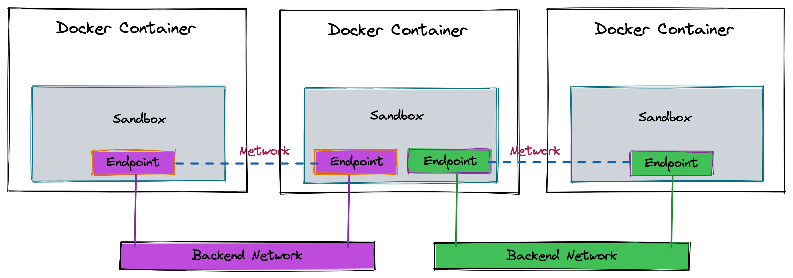
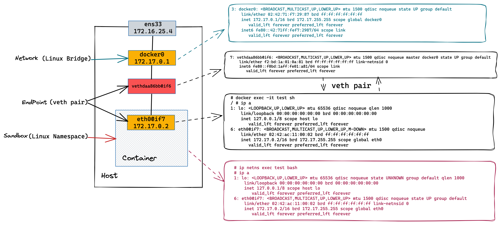
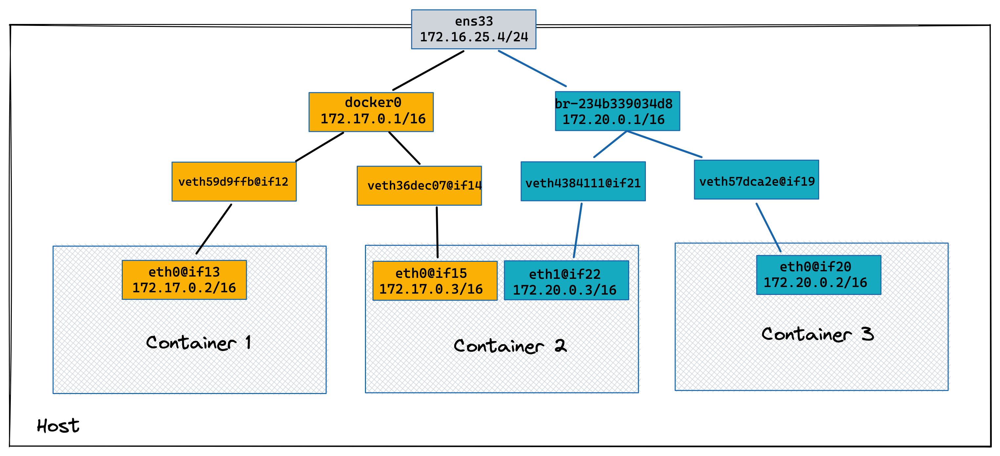
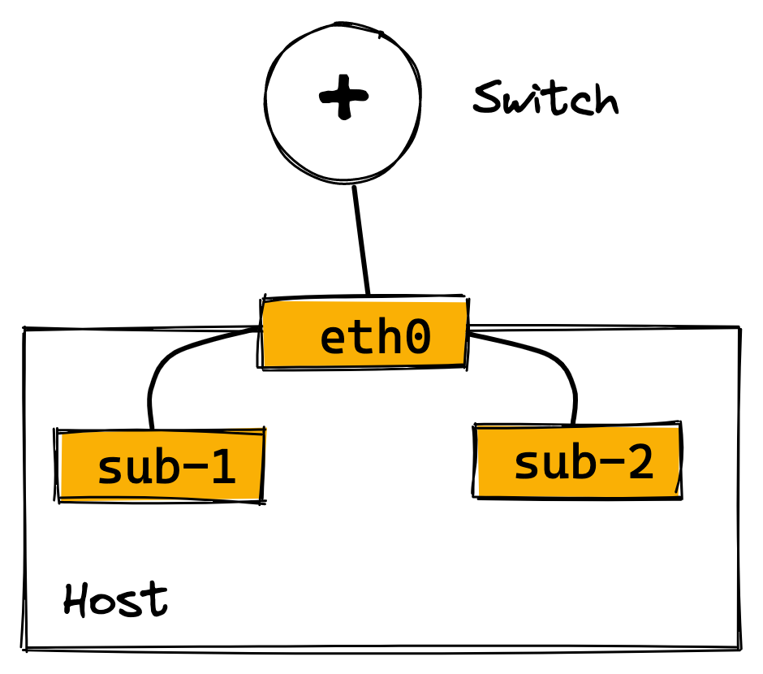
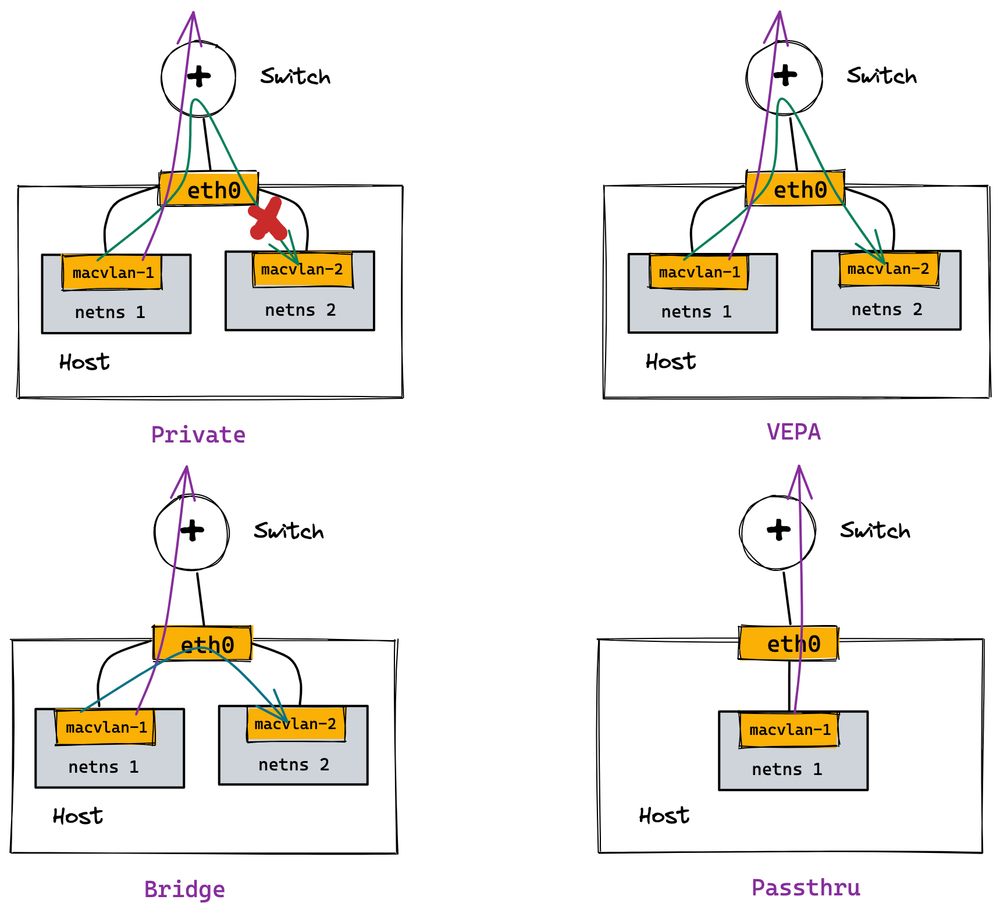

= Docker 网络 
:toc: manual

== 本部分常用命令

[source, bash]
.*1. docker network*
----
docker network create

docker network ls

docker network inspect

docker network rm

// 将一个已经存在的容器加入到一个 docker 网络
docker network connect

docker network disconnect
----

[source, bash]
.*2. 基本命令调试相关*
----
docker inspect

docker logs

// 连接到容器主进程，Ctrl +p Ctrl +q 退出主进程
docker attach

docker exec -it
----

[source, bash]
.*3. 创建并查看网络*
----
sudo docker network ls
sudo docker network create -d bridge test_network
sudo docker network inspect test_network
----

[source, bash]
.*4. 将容器挂载都特定网络后查看容器网络*
----
sudo docker network connect test_network test1
sudo docker network connect test_network test2
sudo docker inspect test1
sudo docker inspect test2
----

== Container Network Model(CNM)

=== libnetwork

Docker 的网络模块通过插件的形式为Docker提供网络功能，创建容器和网络过程是解耦的，这样可以保证 Docker 可以支持多种类型的网络。Docker 提出容器网络标准，libnetwork 只是其中的一个实现。

https://github.com/moby/libnetwork

Docker 提出容器网络标准是*Container Network Model(CNM)*, CNM 中包括三种组件：Endpoint、Network、Sandbox。

[cols="5a,5a,5a"]
|===
|Endpoint |Network |Sandbox

|
* Endpoint 对应容器网卡
* *实现机制* - veth pair
** Linux Netdev 设备
** 成对出现，从一个veth送出，可以从与其配对的另一个veth收到
** 连接隔离的容器网络与主机网络空间
|
* Network 用来连接一组相互通信的Endpoint
* *实现机制* - Linuxbridge
** Linux Netdev 设备
** 实现二层三层转发，连接veth在主机空间那一端
|
* Sandbox 为容器提供网络协议栈，一个Sandbox 可以包括多个Endpoint
* *实现机制* - Network namespace
** 隔离网络环境
** 独立的协议栈
|===

=== CNM Debug

[source, bash]
.*创建一个容器*
----
docker run -itd --rm --name=test busybox
----

[source, bash]
.*1. 查看容器网络环境 - Endpoint(veth pair container side)*
----
# docker exec -it test sh
/ # ip a
1: lo: <LOOPBACK,UP,LOWER_UP> mtu 65536 qdisc noqueue qlen 1000
    link/loopback 00:00:00:00:00:00 brd 00:00:00:00:00:00
    inet 127.0.0.1/8 scope host lo
       valid_lft forever preferred_lft forever
6: eth0@if7: <BROADCAST,MULTICAST,UP,LOWER_UP,M-DOWN> mtu 1500 qdisc noqueue 
    link/ether 02:42:ac:11:00:02 brd ff:ff:ff:ff:ff:ff
    inet 172.17.0.2/16 brd 172.17.255.255 scope global eth0
       valid_lft forever preferred_lft forever
----

[source, bash]
.*2. 查看主机网络环境 - Endpoint(veth pair host side)*
----
# ip a
...
7: vethdaa86bb@if6: <BROADCAST,MULTICAST,UP,LOWER_UP> mtu 1500 qdisc noqueue master docker0 state UP group default 
    link/ether f2:bd:1a:01:0a:81 brd ff:ff:ff:ff:ff:ff link-netnsid 0
    inet6 fe80::f0bd:1aff:fe01:a81/64 scope link 
       valid_lft forever preferred_lft forever
----

[source, bash]
.*3. 查看主机网络环境 - Netwrok(linux bridge)*
----
# ip a
...
3: docker0: <BROADCAST,MULTICAST,UP,LOWER_UP> mtu 1500 qdisc noqueue state UP group default
    link/ether 02:42:71:f7:29:87 brd ff:ff:ff:ff:ff:ff
    inet 172.17.0.1/16 brd 172.17.255.255 scope global docker0
       valid_lft forever preferred_lft forever
    inet6 fe80::42:71ff:fef7:2987/64 scope link
       valid_lft forever preferred_lft forever
----

[source, bash]
.*4. 查看 bridge 上挂接的网卡 - Netwrok(linux bridge)*
----
# brctl show
bridge name     bridge id               STP enabled     interfaces
docker0         8000.024271f72987       no              vethdaa86bb
----

[source, bash]
.*5. 查看 Linux namespace - Sandbox*
----
pid=$(docker inspect  test)
mkdir -p /var/run/netns
ln -sfT /proc/$pid/ns/net /var/run/netns/test

# ip netns
test (id: 0)
----

[source, bash]
.*6. 查看 Linux namespace - Sandbox(进入 Linux namespace)*
----
# ip netns exec test bash

# ip a
1: lo: <LOOPBACK,UP,LOWER_UP> mtu 65536 qdisc noqueue state UNKNOWN group default qlen 1000
    link/loopback 00:00:00:00:00:00 brd 00:00:00:00:00:00
    inet 127.0.0.1/8 scope host lo
       valid_lft forever preferred_lft forever
6: eth0@if7: <BROADCAST,MULTICAST,UP,LOWER_UP> mtu 1500 qdisc noqueue state UP group default 
    link/ether 02:42:ac:11:00:02 brd ff:ff:ff:ff:ff:ff link-netnsid 0
    inet 172.17.0.2/16 brd 172.17.255.255 scope global eth0
       valid_lft forever preferred_lft forever
----

[source, bash]
.*7. Clean up*
----
docker stop test
----

== Docker Bridge Network Debug

=== docker0 bridge，同 VALN 下容器，容器出向 NAT

[source, bash]
.*1. 创建两个容器*
----
docker run -itd --rm --name container-1 busybox
docker run -itd --rm --name container-2 busybox
----

[source, bash]
.*2. 查看桥接的网络*
----
# brctl show
bridge name	bridge id		STP enabled	interfaces
docker0		8000.024271f72987	no		veth36dec07
							veth59d9ffb
----

[source, bash]
.*3. 查看 container-1 和 container-2 的veth IP 地址*
----
# docker exec -it container-1 sh 
/ # ip a
1: lo: <LOOPBACK,UP,LOWER_UP> mtu 65536 qdisc noqueue qlen 1000
    link/loopback 00:00:00:00:00:00 brd 00:00:00:00:00:00
    inet 127.0.0.1/8 scope host lo
       valid_lft forever preferred_lft forever
12: eth0@if13: <BROADCAST,MULTICAST,UP,LOWER_UP,M-DOWN> mtu 1500 qdisc noqueue 
    link/ether 02:42:ac:11:00:02 brd ff:ff:ff:ff:ff:ff
    inet 172.17.0.2/16 brd 172.17.255.255 scope global eth0
       valid_lft forever preferred_lft forever

# docker exec -it container-2 sh 
/ # ip a
1: lo: <LOOPBACK,UP,LOWER_UP> mtu 65536 qdisc noqueue qlen 1000
    link/loopback 00:00:00:00:00:00 brd 00:00:00:00:00:00
    inet 127.0.0.1/8 scope host lo
       valid_lft forever preferred_lft forever
14: eth0@if15: <BROADCAST,MULTICAST,UP,LOWER_UP,M-DOWN> mtu 1500 qdisc noqueue 
    link/ether 02:42:ac:11:00:03 brd ff:ff:ff:ff:ff:ff
    inet 172.17.0.3/16 brd 172.17.255.255 scope global eth0
       valid_lft forever preferred_lft forever
----

[source, bash]
.*4. 从 container-2 分别 ping contianer-1 及 外网*
----
/ # ping 172.17.0.2 -c3
PING 172.17.0.2 (172.17.0.2): 56 data bytes
64 bytes from 172.17.0.2: seq=0 ttl=64 time=0.245 ms
64 bytes from 172.17.0.2: seq=1 ttl=64 time=0.080 ms
64 bytes from 172.17.0.2: seq=2 ttl=64 time=0.111 ms

/ # ping 8.8.8.8 -c3
PING 8.8.8.8 (8.8.8.8): 56 data bytes
64 bytes from 8.8.8.8: seq=0 ttl=110 time=164.365 ms
64 bytes from 8.8.8.8: seq=1 ttl=110 time=155.537 ms
64 bytes from 8.8.8.8: seq=2 ttl=110 time=161.147 ms
----

[source, bash]
.*5. 查看 iptables nat 表，查看出访 NAT 规则 MASQUERADE*
----
# iptables -t nat -vnL
Chain PREROUTING (policy ACCEPT 24 packets, 2508 bytes)
 pkts bytes target     prot opt in     out     source               destination         
    5   624 DOCKER     all  --  *      *       0.0.0.0/0            0.0.0.0/0            ADDRTYPE match dst-type LOCAL

Chain INPUT (policy ACCEPT 18 packets, 1818 bytes)
 pkts bytes target     prot opt in     out     source               destination         

Chain OUTPUT (policy ACCEPT 26 packets, 1678 bytes)
 pkts bytes target     prot opt in     out     source               destination         
    0     0 DOCKER     all  --  *      *       0.0.0.0/0           !127.0.0.0/8          ADDRTYPE match dst-type LOCAL

Chain POSTROUTING (policy ACCEPT 26 packets, 1678 bytes)
 pkts bytes target     prot opt in     out     source               destination         
    5   362 MASQUERADE  all  --  *      !docker0  172.17.0.0/16        0.0.0.0/0           

Chain DOCKER (2 references)
 pkts bytes target     prot opt in     out     source               destination         
    2   168 RETURN     all  --  docker0 *       0.0.0.0/0            0.0.0.0/0  
----

=== 创建新 bridge 网络

[source, bash]
.*1. 查看当前 Host 上 Docker 网络*
----
# docker network ls
NETWORK ID     NAME      DRIVER    SCOPE
d478c3f57b56   bridge    bridge    local
0e21a01b73a4   host      host      local
d89416378101   none      null      local
----

[source, bash]
.*2. 创建一个 bridge 模式网络*
----
docker network create --driver bridge bridge0
----

[source, bash]
.*3. 再次查看容器网络*
----
# docker network ls
NETWORK ID     NAME      DRIVER    SCOPE
d478c3f57b56   bridge    bridge    local
234b339034d8   bridge0   bridge    local
0e21a01b73a4   host      host      local
d89416378101   none      null      local
----

NOTE: ID 为`234b339034d8`, NAME 为`bridge0`为新创建的容器网络

[source, bash]
.*4. 查看主机网络空间*
----
# ip a
...
18: br-234b339034d8: <NO-CARRIER,BROADCAST,MULTICAST,UP> mtu 1500 qdisc noqueue state DOWN group default 
    link/ether 02:42:29:83:97:a5 brd ff:ff:ff:ff:ff:ff
    inet 172.20.0.1/16 brd 172.20.255.255 scope global br-234b339034d8
       valid_lft forever preferred_lft forever
----

=== 使用非默认 Linux bridge 网络创建容器

[source, bash]
.*1. 使用 isolated_nw 创建容器*
----
docker run -itd --rm --name=container-3 --network=bridge0  busybox
----

[source, bash]
.*2. 查看 container-3 的veth IP 地址*
----
# docker exec -it container-3 sh
/ # ip a
1: lo: <LOOPBACK,UP,LOWER_UP> mtu 65536 qdisc noqueue qlen 1000
    link/loopback 00:00:00:00:00:00 brd 00:00:00:00:00:00
    inet 127.0.0.1/8 scope host lo
       valid_lft forever preferred_lft forever
19: eth0@if20: <BROADCAST,MULTICAST,UP,LOWER_UP,M-DOWN> mtu 1500 qdisc noqueue 
    link/ether 02:42:ac:14:00:02 brd ff:ff:ff:ff:ff:ff
    inet 172.20.0.2/16 brd 172.20.255.255 scope global eth0
       valid_lft forever preferred_lft forever
----

[source, bash]
.*3. container-3 中 ping container-2 容器*
----
/ # ping 172.17.0.3 -c10
PING 172.17.0.3 (172.17.0.3): 56 data bytes

--- 172.17.0.3 ping statistics ---
10 packets transmitted, 0 packets received, 100% packet loss
----

[source, bash]
.*4. 在主机网络空间查看 iptables filter 表*
----
# iptables -t filter -vnL
Chain INPUT (policy ACCEPT 197 packets, 13668 bytes)
 pkts bytes target     prot opt in     out     source               destination         

Chain FORWARD (policy DROP 0 packets, 0 bytes)
 pkts bytes target     prot opt in     out     source               destination         
   10   840 DOCKER-USER  all  --  *      *       0.0.0.0/0            0.0.0.0/0           
   10   840 DOCKER-ISOLATION-STAGE-1  all  --  *      *       0.0.0.0/0            0.0.0.0/0           
    0     0 ACCEPT     all  --  *      br-234b339034d8  0.0.0.0/0            0.0.0.0/0            ctstate RELATED,ESTABLISHED
    0     0 DOCKER     all  --  *      br-234b339034d8  0.0.0.0/0            0.0.0.0/0           
    0     0 ACCEPT     all  --  br-234b339034d8 !br-234b339034d8  0.0.0.0/0            0.0.0.0/0           
    0     0 ACCEPT     all  --  br-234b339034d8 br-234b339034d8  0.0.0.0/0            0.0.0.0/0           
    6   504 ACCEPT     all  --  *      docker0  0.0.0.0/0            0.0.0.0/0            ctstate RELATED,ESTABLISHED
    0     0 DOCKER     all  --  *      docker0  0.0.0.0/0            0.0.0.0/0           
   11   866 ACCEPT     all  --  docker0 !docker0  0.0.0.0/0            0.0.0.0/0           
    0     0 ACCEPT     all  --  docker0 docker0  0.0.0.0/0            0.0.0.0/0           

Chain OUTPUT (policy ACCEPT 103 packets, 15008 bytes)
 pkts bytes target     prot opt in     out     source               destination         

Chain DOCKER (2 references)
 pkts bytes target     prot opt in     out     source               destination         

Chain DOCKER-ISOLATION-STAGE-1 (1 references)
 pkts bytes target     prot opt in     out     source               destination         
   10   840 DOCKER-ISOLATION-STAGE-2  all  --  br-234b339034d8 !br-234b339034d8  0.0.0.0/0            0.0.0.0/0           
   11   866 DOCKER-ISOLATION-STAGE-2  all  --  docker0 !docker0  0.0.0.0/0            0.0.0.0/0           
   17  1370 RETURN     all  --  *      *       0.0.0.0/0            0.0.0.0/0           

Chain DOCKER-ISOLATION-STAGE-2 (2 references)
 pkts bytes target     prot opt in     out     source               destination         
    0     0 DROP       all  --  *      br-234b339034d8  0.0.0.0/0            0.0.0.0/0           
   10   840 DROP       all  --  *      docker0  0.0.0.0/0            0.0.0.0/0           
   11   866 RETURN     all  --  *      *       0.0.0.0/0            0.0.0.0/0           

Chain DOCKER-USER (1 references)
 pkts bytes target     prot opt in     out     source               destination         
   27  2210 RETURN     all  --  *      *       0.0.0.0/0            0.0.0.0/0       
----

NOTE: Docker 使用 iptables filter 表实现隔离。

NOTE: `10   840 DROP       all  --  *      docker0  0.0.0.0/0            0.0.0.0/0` 表示 docker0 网络 DROP 掉包的数量为 10，该包来自第 3 步 ping 请求。

[source, bash]
.*5. 连接 container-2 到新创建的网络*
----
docker network connect bridge0 container-2
----

[source, bash]
.*6. 查看新增 veth Pair*
----
$ ip a
...
22: veth4384111@if21: <BROADCAST,MULTICAST,UP,LOWER_UP> mtu 1500 qdisc noqueue master br-234b339034d8 state UP group default 
    link/ether 62:02:8a:76:c5:2a brd ff:ff:ff:ff:ff:ff link-netnsid 1
    inet6 fe80::6002:8aff:fe76:c52a/64 scope link 
       valid_lft forever preferred_lft forever
----

[source, bash]
.*7. 查看 container-2 veth IP*
----
# docker exec -it container-2 sh
/ # ip a
1: lo: <LOOPBACK,UP,LOWER_UP> mtu 65536 qdisc noqueue qlen 1000
    link/loopback 00:00:00:00:00:00 brd 00:00:00:00:00:00
    inet 127.0.0.1/8 scope host lo
       valid_lft forever preferred_lft forever
14: eth0@if15: <BROADCAST,MULTICAST,UP,LOWER_UP,M-DOWN> mtu 1500 qdisc noqueue 
    link/ether 02:42:ac:11:00:03 brd ff:ff:ff:ff:ff:ff
    inet 172.17.0.3/16 brd 172.17.255.255 scope global eth0
       valid_lft forever preferred_lft forever
21: eth1@if22: <BROADCAST,MULTICAST,UP,LOWER_UP,M-DOWN> mtu 1500 qdisc noqueue 
    link/ether 02:42:ac:14:00:03 brd ff:ff:ff:ff:ff:ff
    inet 172.20.0.3/16 brd 172.20.255.255 scope global eth1
       valid_lft forever preferred_lft forever
----

[source, bash]
.*18. 从 container-3 ping continer-2*
----
/ # ping 172.17.0.3 -c3
PING 172.17.0.3 (172.17.0.3): 56 data bytes
64 bytes from 172.17.0.3: seq=0 ttl=64 time=0.267 ms
64 bytes from 172.17.0.3: seq=1 ttl=64 time=0.128 ms
64 bytes from 172.17.0.3: seq=2 ttl=64 time=0.118 ms
----

=== Clean Up

[source, bash]
.*1. 停止所有创建的容器*
----
for i in 1 2 3 ; do sudo docker stop container-$i ; done
----

[source, bash]
.*2. 删除容器网络*
----
sudo docker network rm isolated_nw
----

== Docker 网络端口映射

[source, bash]
.*1. 启动容器是 -p 参数指定端口映射*
----
docker run -it --rm --name container-1 -p 8080:80 -d nginx
----

[source, bash]
.*2. 访问容器*
----
# curl 127.0.0.1:8080 -I -s | head -2
HTTP/1.1 200 OK
Server: nginx/1.19.10

# curl 172.16.25.4:8080 -I -s | head -2
HTTP/1.1 200 OK
Server: nginx/1.19.10
----

[source, bash]
.*3. 查看 net 表规则*
----
# iptables -t nat -vnL
Chain PREROUTING (policy ACCEPT 0 packets, 0 bytes)
 pkts bytes target     prot opt in     out     source               destination         
    5   624 DOCKER     all  --  *      *       0.0.0.0/0            0.0.0.0/0            ADDRTYPE match dst-type LOCAL

Chain INPUT (policy ACCEPT 0 packets, 0 bytes)
 pkts bytes target     prot opt in     out     source               destination         

Chain OUTPUT (policy ACCEPT 8 packets, 480 bytes)
 pkts bytes target     prot opt in     out     source               destination         
    1    60 DOCKER     all  --  *      *       0.0.0.0/0           !127.0.0.0/8          ADDRTYPE match dst-type LOCAL

Chain POSTROUTING (policy ACCEPT 9 packets, 540 bytes)
 pkts bytes target     prot opt in     out     source               destination         
    5   362 MASQUERADE  all  --  *      !docker0  172.17.0.0/16        0.0.0.0/0           
    0     0 MASQUERADE  tcp  --  *      *       172.17.0.2           172.17.0.2           tcp dpt:80

Chain DOCKER (2 references)
 pkts bytes target     prot opt in     out     source               destination         
    2   168 RETURN     all  --  docker0 *       0.0.0.0/0            0.0.0.0/0           
    1    60 DNAT       tcp  --  !docker0 *       0.0.0.0/0            0.0.0.0/0            tcp dpt:8080 to:172.17.0.2:80
----

NOTE: Docker 网络端口映射是通过 iptables nat 表实现，`1    60 DNAT       tcp  --  !docker0 *       0.0.0.0/0            0.0.0.0/0            tcp dpt:8080 to:172.17.0.2:80` 为将请求 DNAT 到`172.17.0.2:80` 容器。

[source, bash]
.*4. 停止容器*
----
docker stop container-1
----

== none 和 host 类型网络

[source, bash]
.*1. 查看三种模型*
----
$ sudo docker network ls |awk '{print $2}'|awk '(NR>1)'
bridge
host
none
----

[source, bash]
.*2. 创建 none 类型容器，并查看容器网络*
----
# docker run -it --rm --name container-1 --network none -d busybox

# docker attach container-1
/ # ip a
1: lo: <LOOPBACK,UP,LOWER_UP> mtu 65536 qdisc noqueue qlen 1000
    link/loopback 00:00:00:00:00:00 brd 00:00:00:00:00:00
    inet 127.0.0.1/8 scope host lo
       valid_lft forever preferred_lft forever
----

[source, bash]
.*3. 创建 host 类型容器，并查看容器网络*
----
# docker run -it --rm --name container-1 --network host -d busybox

# docker attach container-1
/ # ip a
1: lo: <LOOPBACK,UP,LOWER_UP> mtu 65536 qdisc noqueue qlen 1000
    link/loopback 00:00:00:00:00:00 brd 00:00:00:00:00:00
    inet 127.0.0.1/8 scope host lo
       valid_lft forever preferred_lft forever
    inet6 ::1/128 scope host 
       valid_lft forever preferred_lft forever
2: ens33: <BROADCAST,MULTICAST,UP,LOWER_UP> mtu 1500 qdisc pfifo_fast qlen 1000
    link/ether 00:0c:29:5e:cb:0e brd ff:ff:ff:ff:ff:ff
    inet 172.16.25.4/24 brd 172.16.25.255 scope global dynamic noprefixroute ens33
       valid_lft 72671sec preferred_lft 72671sec
    inet6 fd15:4ba5:5a2b:1008:79e3:7c8a:40e3:f082/64 scope global dynamic noprefixroute 
       valid_lft 2591981sec preferred_lft 604781sec
    inet6 fe80::a894:f2f8:295a:126d/64 scope link noprefixroute 
       valid_lft forever preferred_lft forever
3: docker0: <NO-CARRIER,BROADCAST,MULTICAST,UP> mtu 1500 qdisc noqueue 
    link/ether 02:42:71:f7:29:87 brd ff:ff:ff:ff:ff:ff
    inet 172.17.0.1/16 brd 172.17.255.255 scope global docker0
       valid_lft forever preferred_lft forever
    inet6 fe80::42:71ff:fef7:2987/64 scope link 
       valid_lft forever preferred_lft forever
----

== MACVLAN

=== 什么是 MACVLAN

Linux sub-interface 机制允许在netdev设备上挂载虚拟子网卡，虚拟子网卡的流量最终从挂载的netdev设备发出。

MACVLAN 是一种 Linux sub-interface，每个 MACVLAN 子接口都有独立的 IP 和 MAC 地址，可以通过挂载的物理网卡直接连接到物理网卡。

MACVLAN 会消耗物理网络的 IP 资源，增加物理网络的 MAC 地址数量，同时需要物理网络设备打卡混杂模式 promiscuous mode。以及需要 Linux kernel V3.9-V3.19， V4.0+。

=== MACVLAN 四种工作模式

[cols="2,5a"]
|===
|模式 |描述

|Private
|
* 所有网络子接口流量直接送到外网交换机，不会在主机空间做转发
* MACVLAN 子接口之间不能够互访，eth0 会丢弃互访的流量
* 可以通过 eth0 访问外网

|VEPA(Virtual Ethernet Port Aggregator)
|
* 所有网络子接口流量直接送到外网交换机，不会在主机空间做转发
* 同一主机子接口之间走环路，需要交换机支持 VEPA

|Bridge
| 
* 同一主机子接口之间直接在主机网络空间转发，对物理网络不依赖
* 转发流程简单，比 Linux Bridge 转发性能好

|Passthru
|
* 在一个主机只配置一个 Macvlan 子接口
|===

=== Docker MACVLAN

[source, bash]
.*1. 创建 MACVLAN 类型的网络*
----
sudo docker network create -d macvlan --subnet 10.1.10.0/24 --ip-range 10.1.10.240/28 --gateway 10.1.10.1 -o parent=ens33 macvlan-1
----

[source, bash]
.*2. 查看创建的网络*
----
$ sudo docker network ls
NETWORK ID     NAME        DRIVER    SCOPE
01ff09740af4   bridge      bridge    local
f6dbdda8ec13   host        host      local
ffc1e109b33b   macvlan-1   macvlan   local
99496b4f2b1d   none        null      local
----

[source, bash]
.*3. 创建容器*
----
sudo docker run -it --rm --network=macvlan-1 --name=test-1 -d busybox
sudo docker run -it --rm --network=macvlan-1 --name=test-2 -d busybox
----

[source, bash]
.*4. 查看容器 test-1 的 IP 地址*
----
$ sudo docker attach test-1
/ # ip a
1: lo: <LOOPBACK,UP,LOWER_UP> mtu 65536 qdisc noqueue qlen 1000
    link/loopback 00:00:00:00:00:00 brd 00:00:00:00:00:00
    inet 127.0.0.1/8 scope host lo
       valid_lft forever preferred_lft forever
5: eth0@if2: <BROADCAST,MULTICAST,UP,LOWER_UP,M-DOWN> mtu 1500 qdisc noqueue 
    link/ether 02:42:0a:01:0a:f0 brd ff:ff:ff:ff:ff:ff
    inet 10.1.10.240/24 brd 10.1.10.255 scope global eth0
       valid_lft forever preferred_lft forever
----

[source, bash]
.*5. 查看容器 test-2 的 IP 地址*
----
$ sudo docker attach test-2
/ # ip a
1: lo: <LOOPBACK,UP,LOWER_UP> mtu 65536 qdisc noqueue qlen 1000
    link/loopback 00:00:00:00:00:00 brd 00:00:00:00:00:00
    inet 127.0.0.1/8 scope host lo
       valid_lft forever preferred_lft forever
8: eth0@if2: <BROADCAST,MULTICAST,UP,LOWER_UP,M-DOWN> mtu 1500 qdisc noqueue 
    link/ether 02:42:0a:01:0a:f1 brd ff:ff:ff:ff:ff:ff
    inet 10.1.10.241/24 brd 10.1.10.255 scope global eth0
       valid_lft forever preferred_lft forever
----

[source, bash]
.*6. test-1 中 ping test-2*
----
/ # ping 10.1.10.241 -c3
PING 10.1.10.241 (10.1.10.241): 56 data bytes
64 bytes from 10.1.10.241: seq=0 ttl=64 time=0.103 ms
64 bytes from 10.1.10.241: seq=1 ttl=64 time=0.103 ms
64 bytes from 10.1.10.241: seq=2 ttl=64 time=0.072 ms
----

[source, bash]
.*7. 创建 MACVLAN 子接口*
----
sudo docker network create -d macvlan --subnet 10.1.11.0/24 --gateway 10.1.11.1 -o parent=ens33.50 macvlan.50
----

[source, bash]
.*8. 查看主机网络空间*
----
$ ip a
...
9: ens33.50@ens33: <BROADCAST,MULTICAST,UP,LOWER_UP> mtu 1500 qdisc noqueue state UP group default 
    link/ether 00:0c:29:10:a9:6c brd ff:ff:ff:ff:ff:ff
    inet6 fe80::20c:29ff:fe10:a96c/64 scope link 
       valid_lft forever preferred_lft forever
----

[source, bash]
.*9. 查看创建的 VLAN 子接口*
----
$ ip link show type vlan
9: ens33.50@ens33: <BROADCAST,MULTICAST,UP,LOWER_UP> mtu 1500 qdisc noqueue state UP mode DEFAULT group default 
    link/ether 00:0c:29:10:a9:6c brd ff:ff:ff:ff:ff:ff
----

[source, bash]
.*10. 创建一个容器*
----
sudo docker run -it --rm -d --network macvlan.50 --name test-3 busybox
----

[source, bash]
.*11. 查看 test-3 容器 IP 地址*
----
$ sudo docker attach test-3
/ # ip a
1: lo: <LOOPBACK,UP,LOWER_UP> mtu 65536 qdisc noqueue qlen 1000
    link/loopback 00:00:00:00:00:00 brd 00:00:00:00:00:00
    inet 127.0.0.1/8 scope host lo
       valid_lft forever preferred_lft forever
10: eth0@if9: <BROADCAST,MULTICAST,UP,LOWER_UP,M-DOWN> mtu 1500 qdisc noqueue 
    link/ether 02:42:0a:01:0b:02 brd ff:ff:ff:ff:ff:ff
    inet 10.1.11.2/24 brd 10.1.11.255 scope global eth0
       valid_lft forever preferred_lft forever
----

[source, bash]
.*12. 清空实验环境*
----
for i in $(sudo docker ps | awk '{print $1}' | awk '(NR>1)') ; do sudo docker stop $i ; done

sudo docker network rm macvlan-1 macvlan.50
----

== Docker DNS

[source, bash]
.*1. 创建容器*
----
sudo docker run -it --rm --name test-1 -d busybox
----

[source, bash]
.*2. ping 容器名*
----
$ sudo docker attach test-1
/ # ping test-1
ping: bad address 'test-1'
----

[source, bash]
.*3. 查看容器 /etc/resolv.conf*
----
/ # cat /etc/resolv.conf 
# This file is managed by man:systemd-resolved(8). Do not edit.
#
# This is a dynamic resolv.conf file for connecting local clients directly to
# all known uplink DNS servers. This file lists all configured search domains.
#
# Third party programs must not access this file directly, but only through the
# symlink at /etc/resolv.conf. To manage man:resolv.conf(5) in a different way,
# replace this symlink by a static file or a different symlink.
#
# See man:systemd-resolved.service(8) for details about the supported modes of
# operation for /etc/resolv.conf.

nameserver 10.1.10.2
----

[source, bash]
.*4. 创建一个新容器*
----
sudo docker run -it --rm --name test-2 --hostname test-2 -d busybox
----

[source, bash]
.*5. 进入 test-2 主进程，ping 容器名称*
----
$ sudo docker attach test-2
/ # ping test-2
PING test-2 (172.17.0.3): 56 data bytes
64 bytes from 172.17.0.3: seq=0 ttl=64 time=0.036 ms
64 bytes from 172.17.0.3: seq=1 ttl=64 time=0.075 ms
----

[source, bash]
.*5. 创建第三个容器*
----
sudo docker run -it --rm --name test-3 --hostname test-3 --link test-1 --link test-2  -d busybox
----

[source, bash]
.*6. 进入 test-2 主进程，ping test-1 和 test-2*
----
$ sudo docker attach test-3
/ # ping test-1 -c3
PING test-1 (172.17.0.2): 56 data bytes
64 bytes from 172.17.0.2: seq=0 ttl=64 time=0.087 ms
64 bytes from 172.17.0.2: seq=1 ttl=64 time=0.117 ms
64 bytes from 172.17.0.2: seq=2 ttl=64 time=0.111 ms

--- test-1 ping statistics ---
3 packets transmitted, 3 packets received, 0% packet loss
round-trip min/avg/max = 0.087/0.105/0.117 ms
/ # ping test-2 -c3
PING test-2 (172.17.0.3): 56 data bytes
64 bytes from 172.17.0.3: seq=0 ttl=64 time=0.262 ms
64 bytes from 172.17.0.3: seq=1 ttl=64 time=0.079 ms
64 bytes from 172.17.0.3: seq=2 ttl=64 time=0.116 ms

--- test-2 ping statistics ---
3 packets transmitted, 3 packets received, 0% packet loss
round-trip min/avg/max = 0.079/0.152/0.262 ms
----

[source, bash]
.*7. 创建容器，指定 DNS 服务器*
----
sudo docker run -it --rm --name test-4 --hostname test-4 --dns 8.8.8.8  -d busybox
----

[source, bash]
.*8. 进入到 test-4 主进程，查看 resolv.conf*
----
$ sudo docker attach test-4
/ # cat /etc/resolv.conf 
nameserver 8.8.8.8
----

[source, bash]
.*9. 创建一个 bridge 类型容器网络*
----
sudo docker network create test_dns
----

[source, bash]
.*10. 创建一个容器使用 test_dns 网络*
----
sudo docker run -it --rm --name test-5 --network test_dns -d busybox
----

[source, bash]
.*11. 进入 test-5 主进程 ping test-5*
----
$ sudo docker attach test-5
/ # ping test-5 -c3
PING test-5 (172.18.0.2): 56 data bytes
64 bytes from 172.18.0.2: seq=0 ttl=64 time=0.032 ms
64 bytes from 172.18.0.2: seq=1 ttl=64 time=0.093 ms
64 bytes from 172.18.0.2: seq=2 ttl=64 time=0.090 ms
----

[source, bash]
.*12. 查看 test-5 的 resolv.conf*
----
$ sudo docker attach test-5
/ # cat /etc/resolv.conf 
nameserver 127.0.0.11
options ndots:0
----

[source, bash]
.*13. 创建新容器*
----
sudo docker run -it --rm --name test-6 --network test_dns -d busybox
----

[source, bash]
.*14. 进图到 test-6 ping test-5*
----
$ sudo docker attach test-6
/ # ping test-5 -c3
PING test-5 (172.18.0.2): 56 data bytes
64 bytes from 172.18.0.2: seq=0 ttl=64 time=0.075 ms
64 bytes from 172.18.0.2: seq=1 ttl=64 time=0.123 ms
64 bytes from 172.18.0.2: seq=2 ttl=64 time=0.116 ms
----

[source, bash]
.*15. 删除所有创建的容器*
----
for i in $(sudo docker ps | awk '{print $1}' | awk '(NR>1)') ; do sudo docker stop $i ; done
----

[source, bash]
.*16. 删除容器网络*
----
sudo docker network rm test_dns
----
