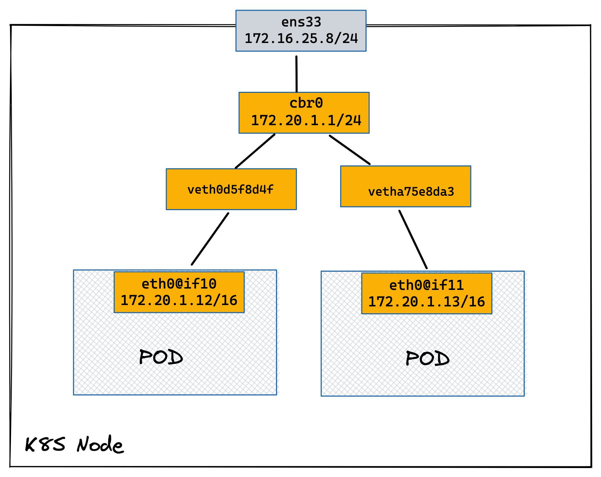
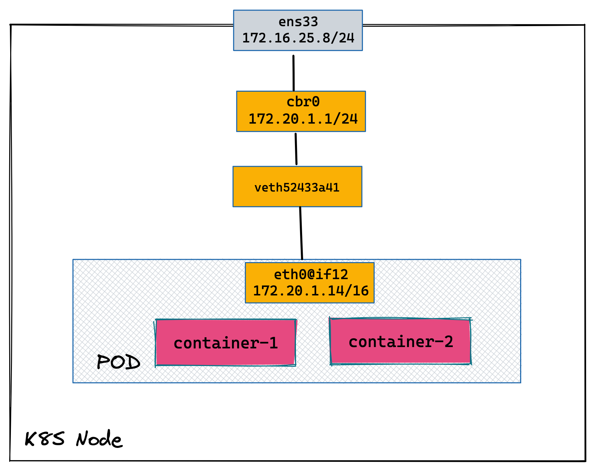
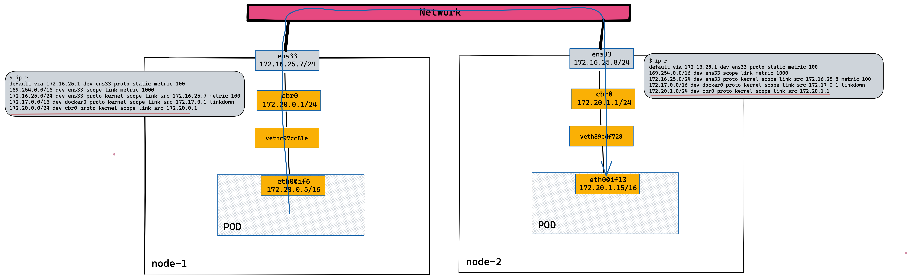

= kubenet 
:toc: manual

== kubenet 配置

本部分配置两个节点的 K8S 集群，采用原生kubenet网络插件。

[source, bash]
.*1. K8S 安装*
----
sudo kubeadm init --pod-network-cidr=172.20.0.0/16
----

[source, bash]
.*2. 查看默认的 network-plugin*
----
$ sudo cat /var/lib/kubelet/kubeadm-flags.env
KUBELET_KUBEADM_ARGS="--network-plugin=cni --pod-infra-container-image=k8s.gcr.io/pause:3.2"
----

[source, bash]
.*3. 修改默认的 cni 网络到 kubenet*
----
sudo sed -i 's/cni/kubenet/' /var/lib/kubelet/kubeadm-flags.env
----

[source, bash]
.*4. 重启 kubelet*
----
sudo systemctl restart kubelet.service
----

[source, bash]
.*5. 验证 kubelet 使用的 network-plugin 为 kubenet*
----
$ ps -ef | grep kubelet
root        771      1  2 15:47 ?        00:00:42 /usr/bin/kubelet --bootstrap-kubeconfig=/etc/kubernetes/bootstrap-kubelet.conf --kubeconfig=/etc/kubernetes/kubelet.conf --config=/var/lib/kubelet/config.yaml --network-plugin=kubenet --pod-infra-container-image=k8s.gcr.io/pause:3.2
----

NOTE: 以上3、4、5 需要在 K8S 所有节点上执行。

[source, bash]
.*6. 查看 nodes*
----
$ kubectl get nodes --no-headers
node-1   Ready   control-plane,master   11m     v1.22.2
node-2   Ready   <none>                 8m14s   v1.22.2
----

[source, bash]
.*7. 查看 Pods*
----
$ kubectl get pods --all-namespaces --no-headers
kube-system   coredns-78fcd69978-jv5pw         1/1   Running   0     11m
kube-system   coredns-78fcd69978-vg5np         1/1   Running   0     11m
kube-system   etcd-node-1                      1/1   Running   0     11m
kube-system   kube-apiserver-node-1            1/1   Running   0     11m
kube-system   kube-controller-manager-node-1   1/1   Running   0     11m
kube-system   kube-proxy-6ccgv                 1/1   Running   0     8m40s
kube-system   kube-proxy-945sc                 1/1   Running   0     11m
kube-system   kube-scheduler-node-1            1/1   Running   0     11m
----

[source, bash]
.*8. 查看 Linux bridge*
----
$ brctl show
bridge name	bridge id		STP enabled	interfaces
cbr0		8000.dad8ae6cfb7e	no		veth49ee306d
							vethdf6ae0d5
docker0		8000.0242a1768136	no
----

== POD 地址分配与跨节点通信

=== 同节点上两个 POD

[source, bash]
.*1. 创建两个 Pod*
----
kubectl apply -f pods.yaml
----

* link:files/pods.yaml[pods.yaml]

[source, bash]
.*2. 查看主机网络空间新增加的虚拟网卡*
----
2: ens33: <BROADCAST,MULTICAST,UP,LOWER_UP> mtu 1500 qdisc fq_codel state UP group default qlen 1000
    link/ether 00:0c:29:2f:33:85 brd ff:ff:ff:ff:ff:ff
    altname enp2s1
    inet 172.16.25.8/24 brd 172.16.25.255 scope global noprefixroute ens33
       valid_lft forever preferred_lft forever
    inet6 fd15:4ba5:5a2b:1008:20c:29ff:fe2f:3385/64 scope global dynamic mngtmpaddr noprefixroute 
       valid_lft 2591956sec preferred_lft 604756sec
    inet6 fe80::20c:29ff:fe2f:3385/64 scope link noprefixroute 
       valid_lft forever preferred_lft forever

4: cbr0: <BROADCAST,MULTICAST,PROMISC,UP,LOWER_UP> mtu 1500 qdisc htb state UP group default qlen 1000
    link/ether ee:a9:21:aa:a0:b7 brd ff:ff:ff:ff:ff:ff
    inet 172.20.1.1/24 brd 172.20.1.255 scope global cbr0
       valid_lft forever preferred_lft forever
    inet6 fe80::eca9:21ff:feaa:a0b7/64 scope link 
       valid_lft forever preferred_lft forever

10: veth0d5f8d4f@if3: <BROADCAST,MULTICAST,UP,LOWER_UP> mtu 1500 qdisc noqueue master cbr0 state UP group default 
    link/ether 52:3d:bb:26:df:88 brd ff:ff:ff:ff:ff:ff link-netnsid 0
    inet6 fe80::503d:bbff:fe26:df88/64 scope link 
       valid_lft forever preferred_lft forever
11: vetha75e8da3@if3: <BROADCAST,MULTICAST,UP,LOWER_UP> mtu 1500 qdisc noqueue master cbr0 state UP group default 
    link/ether 3e:f4:7c:9f:d5:70 brd ff:ff:ff:ff:ff:ff link-netnsid 2
    inet6 fe80::3cf4:7cff:fe9f:d570/64 scope link 
       valid_lft forever preferred_lft forever
----

[source, bash]
.*3. 查看 POD 1 容器网络*
----
$ kubectl exec -it test-1 -- sh
/ # ip a
1: lo: <LOOPBACK,UP,LOWER_UP> mtu 65536 qdisc noqueue qlen 1000
    link/loopback 00:00:00:00:00:00 brd 00:00:00:00:00:00
    inet 127.0.0.1/8 scope host lo
       valid_lft forever preferred_lft forever
3: eth0@if10: <BROADCAST,MULTICAST,UP,LOWER_UP,M-DOWN> mtu 1500 qdisc noqueue 
    link/ether d6:ab:c6:56:b5:1f brd ff:ff:ff:ff:ff:ff
    inet 172.20.1.12/24 brd 172.20.1.255 scope global eth0
       valid_lft forever preferred_lft forever
----

[source, bash]
.*4. 查看 POD 2 容器网络*
----
$ kubectl exec -it test-2 -- sh
/ # ip a
1: lo: <LOOPBACK,UP,LOWER_UP> mtu 65536 qdisc noqueue qlen 1000
    link/loopback 00:00:00:00:00:00 brd 00:00:00:00:00:00
    inet 127.0.0.1/8 scope host lo
       valid_lft forever preferred_lft forever
3: eth0@if11: <BROADCAST,MULTICAST,UP,LOWER_UP,M-DOWN> mtu 1500 qdisc noqueue 
    link/ether 46:00:fb:b4:05:9a brd ff:ff:ff:ff:ff:ff
    inet 172.20.1.13/24 brd 172.20.1.255 scope global eth0
       valid_lft forever preferred_lft forever
----

[source, bash]
.*5. Clean up*
----
kubectl delete -f pods.yaml
----

=== Pod 内多容器下地址分配

[source, bash]
.*1. 创建多容器 Pod*
----
kubectl apply -f pod.yaml 
----

* link:files/pod.yaml[pod.yaml]

[source, bash]
.*2. 查看主机网络空间新增加的虚拟网卡*
----
2: ens33: <BROADCAST,MULTICAST,UP,LOWER_UP> mtu 1500 qdisc fq_codel state UP group default qlen 1000
    link/ether 00:0c:29:2f:33:85 brd ff:ff:ff:ff:ff:ff
    altname enp2s1
    inet 172.16.25.8/24 brd 172.16.25.255 scope global noprefixroute ens33
       valid_lft forever preferred_lft forever
    inet6 fd15:4ba5:5a2b:1008:20c:29ff:fe2f:3385/64 scope global dynamic mngtmpaddr noprefixroute
       valid_lft 2591956sec preferred_lft 604756sec
    inet6 fe80::20c:29ff:fe2f:3385/64 scope link noprefixroute
       valid_lft forever preferred_lft forever

4: cbr0: <BROADCAST,MULTICAST,PROMISC,UP,LOWER_UP> mtu 1500 qdisc htb state UP group default qlen 1000
    link/ether ee:a9:21:aa:a0:b7 brd ff:ff:ff:ff:ff:ff
    inet 172.20.1.1/24 brd 172.20.1.255 scope global cbr0
       valid_lft forever preferred_lft forever
    inet6 fe80::eca9:21ff:feaa:a0b7/64 scope link
       valid_lft forever preferred_lft forever

12: veth52433a41@if3: <BROADCAST,MULTICAST,UP,LOWER_UP> mtu 1500 qdisc noqueue master cbr0 state UP group default 
    link/ether 96:0a:2d:ac:36:23 brd ff:ff:ff:ff:ff:ff link-netnsid 0
    inet6 fe80::940a:2dff:feac:3623/64 scope link 
       valid_lft forever preferred_lft forever
----

[source, bash]
.*3. 登录 container-1 查看容器网络*
----
$ kubectl exec -it test -c container-1 -- sh
/ # ip a
1: lo: <LOOPBACK,UP,LOWER_UP> mtu 65536 qdisc noqueue qlen 1000
    link/loopback 00:00:00:00:00:00 brd 00:00:00:00:00:00
    inet 127.0.0.1/8 scope host lo
       valid_lft forever preferred_lft forever
3: eth0@if12: <BROADCAST,MULTICAST,UP,LOWER_UP,M-DOWN> mtu 1500 qdisc noqueue 
    link/ether c2:db:5c:ba:05:45 brd ff:ff:ff:ff:ff:ff
    inet 172.20.1.14/24 brd 172.20.1.255 scope global eth0
       valid_lft forever preferred_lft forever
----

[source, bash]
.*4. 登录 container-2 查看容器网络*
----
$ kubectl exec -it test -c container-2 -- sh
/ # ip a
1: lo: <LOOPBACK,UP,LOWER_UP> mtu 65536 qdisc noqueue qlen 1000
    link/loopback 00:00:00:00:00:00 brd 00:00:00:00:00:00
    inet 127.0.0.1/8 scope host lo
       valid_lft forever preferred_lft forever
3: eth0@if12: <BROADCAST,MULTICAST,UP,LOWER_UP,M-DOWN> mtu 1500 qdisc noqueue 
    link/ether c2:db:5c:ba:05:45 brd ff:ff:ff:ff:ff:ff
    inet 172.20.1.14/24 brd 172.20.1.255 scope global eth0
       valid_lft forever preferred_lft forever
----

[source, bash]
.*5. 删除 test*
----
kubectl delete -f pod.yaml 
----

=== 跨 NODE POD 通信

[source, bash]
.*1. 创建两个 POD*
----
kubectl apply -f deployment.yaml
----

* link:files/deployment.yaml[deployment.yaml]

[source, bash]
.*2. 查看 POD  1 网络*
----
$ kubectl exec -it test-1 -- sh
/ # ip a
1: lo: <LOOPBACK,UP,LOWER_UP> mtu 65536 qdisc noqueue qlen 1000
    link/loopback 00:00:00:00:00:00 brd 00:00:00:00:00:00
    inet 127.0.0.1/8 scope host lo
       valid_lft forever preferred_lft forever
3: eth0@if6: <BROADCAST,MULTICAST,UP,LOWER_UP,M-DOWN> mtu 1500 qdisc noqueue 
    link/ether f2:e4:2e:8e:04:cd brd ff:ff:ff:ff:ff:ff
    inet 172.20.0.5/24 brd 172.20.0.255 scope global eth0
       valid_lft forever preferred_lft forever
----

[source, bash]
.*3. 查看 POD 2 网络*
----
$ kubectl exec -it test-2 -- sh
/ # ip a
1: lo: <LOOPBACK,UP,LOWER_UP> mtu 65536 qdisc noqueue qlen 1000
    link/loopback 00:00:00:00:00:00 brd 00:00:00:00:00:00
    inet 127.0.0.1/8 scope host lo
       valid_lft forever preferred_lft forever
3: eth0@if13: <BROADCAST,MULTICAST,UP,LOWER_UP,M-DOWN> mtu 1500 qdisc noqueue 
    link/ether ea:c3:e1:9b:83:40 brd ff:ff:ff:ff:ff:ff
    inet 172.20.1.15/24 brd 172.20.1.255 scope global eth0
       valid_lft forever preferred_lft forever
----

[source, bash]
.*4. node2 上 tcpdump 捕获 icmp 包*
----
sudo tcpdump -nni cbr0 icmp
----

[source, bash]
.*5. 在 POD 1 ping POD 2*
----
ping 172.20.1.15
----

[source, bash]
.*6. Clean Up*
----
kubectl delete -f deployment.yaml
----

== K8S Service

=== Cluster IP 类型 Service 

[source, bash]
.*1. 查看 Service IP 段*
----
$ ps -ef | grep apiserver | grep service-cluster-ip-range
root       5626   5597  4 20:43 ?        00:06:25 kube-apiserver --advertise-address=10.1.10.9 --allow-privileged=true --authorization-mode=Node,RBAC --client-ca-file=/etc/kubernetes/pki/ca.crt --enable-admission-plugins=NodeRestriction --enable-bootstrap-token-auth=true --etcd-cafile=/etc/kubernetes/pki/etcd/ca.crt --etcd-certfile=/etc/kubernetes/pki/apiserver-etcd-client.crt --etcd-keyfile=/etc/kubernetes/pki/apiserver-etcd-client.key --etcd-servers=https://127.0.0.1:2379 --insecure-port=0 --kubelet-client-certificate=/etc/kubernetes/pki/apiserver-kubelet-client.crt --kubelet-client-key=/etc/kubernetes/pki/apiserver-kubelet-client.key --kubelet-preferred-address-types=InternalIP,ExternalIP,Hostname --proxy-client-cert-file=/etc/kubernetes/pki/front-proxy-client.crt --proxy-client-key-file=/etc/kubernetes/pki/front-proxy-client.key --requestheader-allowed-names=front-proxy-client --requestheader-client-ca-file=/etc/kubernetes/pki/front-proxy-ca.crt --requestheader-extra-headers-prefix=X-Remote-Extra- --requestheader-group-headers=X-Remote-Group --requestheader-username-headers=X-Remote-User --secure-port=6443 --service-account-issuer=https://kubernetes.default.svc.cluster.local --service-account-key-file=/etc/kubernetes/pki/sa.pub --service-account-signing-key-file=/etc/kubernetes/pki/sa.key --service-cluster-ip-range=10.96.0.0/12 --tls-cert-file=/etc/kubernetes/pki/apiserver.crt --tls-private-key-file=/etc/kubernetes/pki/apiserver.key
----

NOTE: `--service-cluster-ip-range=10.96.0.0/12`.

[source, bash]
.*2. 创建 Service*
----
kubectl apply -f service.yaml 
----

* link:files/service.yaml[service.yaml]

[source, bash]
.*3. 查看创建的 POD 名称*
----
$ kubectl get pods --no-headers | awk '{print $1}'
test-service-6f6f8db499-ntkcc
test-service-6f6f8db499-s2dwn
----

[source, bash]
.*4. 查看 Service IP*
----
$ kubectl get svc test-service --no-headers | awk '{print $3}'
10.107.168.72
----

[source, bash]
.*5. 访问服务*
----
$ for i in {1..5} ; do curl 10.107.168.72 ; done
test-service-6f6f8db499-s2dwn
test-service-6f6f8db499-ntkcc
test-service-6f6f8db499-s2dwn
test-service-6f6f8db499-ntkcc
test-service-6f6f8db499-s2dwn
----

[source, bash]
.*6. 添加一条 iptables 规则，方向 POD 访问 Service*
----
sudo iptables -I FORWARD 2 -j ACCEPT
----

[source, bash]
.*7. 创建一个临时 POD，访问测试*
----
$ kubectl run -it --rm --restart=Never busybox --image=busybox sh
If you don't see a command prompt, try pressing enter.
/ # wget -S -O - 10.107.168.72

/ # wget -S -O - 192.168.0.20:9376
----

=== Cluster IP 类型 Service 访问调试

[source, bash]
.*1. 创建服务*
----
kubectl apply -f echoserver.yaml 
----

* link:files/echoserver.yaml[echoserver.yaml]

[source, bash]
.*2. 查看 SERVICE 及 POD IP*
----
$ kubectl get svc echoserver --no-headers
echoserver   ClusterIP   10.106.23.233   <none>   8877/TCP   45s

$ kubectl get pods -o wide --no-headers
echoserver-6dbbc8d5fc-f455t   1/1   Running   0     3m24s   192.168.0.33   node-1   <none>   <none>
echoserver-6dbbc8d5fc-n4smh   1/1   Running   0     3m24s   192.168.0.34   node-1   <none>   <none>
----

[source, bash]
.*3. nat 表中 PREROUTING 规则*
----
$ sudo iptables -t nat -vnL PREROUTING
Chain PREROUTING (policy ACCEPT 338 packets, 15210 bytes)
 pkts bytes target     prot opt in     out     source               destination         
  521 24674 KUBE-SERVICES  all  --  *      *       0.0.0.0/0            0.0.0.0/0            /* kubernetes service portals */
    2   128 DOCKER     all  --  *      *       0.0.0.0/0            0.0.0.0/0            ADDRTYPE match dst-type LOCAL
----

[source, bash]
.*4. nat 表中 KUBE-SERVICES 规则*
----
$ sudo iptables -t nat -vnL KUBE-SERVICES
Chain KUBE-SERVICES (2 references)
 pkts bytes target     prot opt in     out     source               destination         
    0     0 KUBE-MARK-MASQ  tcp  --  *      *      !192.168.0.0/16       10.96.0.1            /* default/kubernetes:https cluster IP */ tcp dpt:443
    0     0 KUBE-SVC-NPX46M4PTMTKRN6Y  tcp  --  *      *       0.0.0.0/0            10.96.0.1            /* default/kubernetes:https cluster IP */ tcp dpt:443
    0     0 KUBE-MARK-MASQ  tcp  --  *      *      !192.168.0.0/16       10.96.0.10           /* kube-system/kube-dns:metrics cluster IP */ tcp dpt:9153
    0     0 KUBE-SVC-JD5MR3NA4I4DYORP  tcp  --  *      *       0.0.0.0/0            10.96.0.10           /* kube-system/kube-dns:metrics cluster IP */ tcp dpt:9153
    0     0 KUBE-MARK-MASQ  udp  --  *      *      !192.168.0.0/16       10.96.0.10           /* kube-system/kube-dns:dns cluster IP */ udp dpt:53
    0     0 KUBE-SVC-TCOU7JCQXEZGVUNU  udp  --  *      *       0.0.0.0/0            10.96.0.10           /* kube-system/kube-dns:dns cluster IP */ udp dpt:53
    0     0 KUBE-MARK-MASQ  tcp  --  *      *      !192.168.0.0/16       10.96.0.10           /* kube-system/kube-dns:dns-tcp cluster IP */ tcp dpt:53
    0     0 KUBE-SVC-ERIFXISQEP7F7OF4  tcp  --  *      *       0.0.0.0/0            10.96.0.10           /* kube-system/kube-dns:dns-tcp cluster IP */ tcp dpt:53
    0     0 KUBE-MARK-MASQ  tcp  --  *      *      !192.168.0.0/16       10.106.23.233        /* default/echoserver cluster IP */ tcp dpt:8877
    0     0 KUBE-SVC-HOYURHXRFA5BUYEO  tcp  --  *      *       0.0.0.0/0            10.106.23.233        /* default/echoserver cluster IP */ tcp dpt:8877
  537 31690 KUBE-NODEPORTS  all  --  *      *       0.0.0.0/0            0.0.0.0/0            /* kubernetes service nodeports; NOTE: this must be the last rule in this chain */ ADDRTYPE match dst-type LOCAL

$ sudo iptables -t nat -vnL KUBE-SERVICES | grep 10.106.23.233
    0     0 KUBE-MARK-MASQ  tcp  --  *      *      !192.168.0.0/16       10.106.23.233        /* default/echoserver cluster IP */ tcp dpt:8877
    0     0 KUBE-SVC-HOYURHXRFA5BUYEO  tcp  --  *      *       0.0.0.0/0            10.106.23.233        /* default/echoserver cluster IP */ tcp dpt:8877
----

[source, bash]
.*5. nat 表中 KUBE-SVC- 规则*
----
$ sudo iptables -t nat -vnL KUBE-SVC-HOYURHXRFA5BUYEO
Chain KUBE-SVC-HOYURHXRFA5BUYEO (1 references)
 pkts bytes target     prot opt in     out     source               destination         
    0     0 KUBE-SEP-652URVIXIJWATNFG  all  --  *      *       0.0.0.0/0            0.0.0.0/0            /* default/echoserver */ statistic mode random probability 0.50000000000
    0     0 KUBE-SEP-ASOAWBDFEODJJPJH  all  --  *      *       0.0.0.0/0            0.0.0.0/0            /* default/echoserver */
----

[source, bash]
.*6. nat 表中 KUBE-SEP- 规则*
----
$ sudo iptables -t nat -vnL KUBE-SEP-652URVIXIJWATNFG
Chain KUBE-SEP-652URVIXIJWATNFG (1 references)
 pkts bytes target     prot opt in     out     source               destination         
    0     0 KUBE-MARK-MASQ  all  --  *      *       192.168.0.33         0.0.0.0/0            /* default/echoserver */
    0     0 DNAT       tcp  --  *      *       0.0.0.0/0            0.0.0.0/0            /* default/echoserver */ tcp to:192.168.0.33:8877

$ sudo iptables -t nat -vnL KUBE-SEP-ASOAWBDFEODJJPJH
Chain KUBE-SEP-ASOAWBDFEODJJPJH (1 references)
 pkts bytes target     prot opt in     out     source               destination         
    0     0 KUBE-MARK-MASQ  all  --  *      *       192.168.0.34         0.0.0.0/0            /* default/echoserver */
    0     0 DNAT       tcp  --  *      *       0.0.0.0/0            0.0.0.0/0            /* default/echoserver */ tcp to:192.168.0.34:8877
----

[source, bash]
.*7. 调整 echoserver 为 3 replicas*
----
$ kubectl get pod -o wide --no-headers
echoserver-6dbbc8d5fc-hqxdv   1/1   Running   0     13m   192.168.0.33   node-1   <none>   <none>
echoserver-6dbbc8d5fc-kj27r   1/1   Running   0     13m   192.168.0.34   node-1   <none>   <none>
echoserver-6dbbc8d5fc-tgj24   1/1   Running   0     6s    192.168.0.35   node-1   <none>   <none>
----

[source, bash]
.*8. nat 表中 KUBE-SVC- 规则*
----
$ sudo iptables -t nat -vnL KUBE-SVC-HOYURHXRFA5BUYEO
Chain KUBE-SVC-HOYURHXRFA5BUYEO (1 references)
 pkts bytes target     prot opt in     out     source               destination         
    0     0 KUBE-SEP-652URVIXIJWATNFG  all  --  *      *       0.0.0.0/0            0.0.0.0/0            /* default/echoserver */ statistic mode random probability 0.33333333349
    0     0 KUBE-SEP-ASOAWBDFEODJJPJH  all  --  *      *       0.0.0.0/0            0.0.0.0/0            /* default/echoserver */ statistic mode random probability 0.50000000000
    0     0 KUBE-SEP-7ZRSXHFJXB4D6W3U  all  --  *      *       0.0.0.0/0            0.0.0.0/0            /* default/echoserver */
----

[source, bash]
.*9. nat 表中 KUBE-SEP- 规则（新增）*
----
$ sudo iptables -t nat -vnL KUBE-SEP-7ZRSXHFJXB4D6W3U
Chain KUBE-SEP-7ZRSXHFJXB4D6W3U (1 references)
 pkts bytes target     prot opt in     out     source               destination         
    0     0 KUBE-MARK-MASQ  all  --  *      *       192.168.0.35         0.0.0.0/0            /* default/echoserver */
    0     0 DNAT       tcp  --  *      *       0.0.0.0/0            0.0.0.0/0            /* default/echoserver */ tcp to:192.168.0.35:8877
----

=== 基于 ClientIP 类型的 Service

[source, bash]
.*1. 创建 Service*
----
kubectl apply -f clientip.yaml
----

* link:files/clientip.yaml[clientip.yaml]

[source, bash]
.*2. 查看 Service 和 POD IP*
----
$ kubectl get svc test-clientip --no-headers
test-clientip   ClusterIP   10.107.215.65   <none>   80/TCP   7h26m

$ kubectl get pods -o wide --no-headers
test-clientip-55c6c8ddcd-2ntlk   1/1   Running   0     7h27m   192.168.0.37   node-1   <none>   <none>
test-clientip-55c6c8ddcd-ktlxt   1/1   Running   0     7h27m   192.168.0.36   node-1   <none>   <none>
----

[source, bash]
.*3. 访问服务*
----
$ for i in {1..5} ; do curl 10.107.215.65 ; done
test-clientip-55c6c8ddcd-2ntlk
test-clientip-55c6c8ddcd-2ntlk
test-clientip-55c6c8ddcd-2ntlk
test-clientip-55c6c8ddcd-2ntlk
test-clientip-55c6c8ddcd-2ntlk
----

[source, bash]
.*4. nat 表中 PREROUTING 规则*
----
$ sudo iptables -t nat -vnL PREROUTING
Chain PREROUTING (policy ACCEPT 612 packets, 27540 bytes)
 pkts bytes target     prot opt in     out     source               destination         
 3258  149K KUBE-SERVICES  all  --  *      *       0.0.0.0/0            0.0.0.0/0            /* kubernetes service portals */
    2   128 DOCKER     all  --  *      *       0.0.0.0/0            0.0.0.0/0            ADDRTYPE match dst-type LOCAL
---- 

[source, bash]
.*5. nat 表中 KUBE-SERVICES 规则*
----
$ sudo iptables -t nat -vnL KUBE-SERVICES
Chain KUBE-SERVICES (2 references)
 pkts bytes target     prot opt in     out     source               destination         
    0     0 KUBE-MARK-MASQ  tcp  --  *      *      !192.168.0.0/16       10.96.0.1            /* default/kubernetes:https cluster IP */ tcp dpt:443
    0     0 KUBE-SVC-NPX46M4PTMTKRN6Y  tcp  --  *      *       0.0.0.0/0            10.96.0.1            /* default/kubernetes:https cluster IP */ tcp dpt:443
    0     0 KUBE-MARK-MASQ  tcp  --  *      *      !192.168.0.0/16       10.96.0.10           /* kube-system/kube-dns:metrics cluster IP */ tcp dpt:9153
    0     0 KUBE-SVC-JD5MR3NA4I4DYORP  tcp  --  *      *       0.0.0.0/0            10.96.0.10           /* kube-system/kube-dns:metrics cluster IP */ tcp dpt:9153
    0     0 KUBE-MARK-MASQ  udp  --  *      *      !192.168.0.0/16       10.96.0.10           /* kube-system/kube-dns:dns cluster IP */ udp dpt:53
    0     0 KUBE-SVC-TCOU7JCQXEZGVUNU  udp  --  *      *       0.0.0.0/0            10.96.0.10           /* kube-system/kube-dns:dns cluster IP */ udp dpt:53
    0     0 KUBE-MARK-MASQ  tcp  --  *      *      !192.168.0.0/16       10.96.0.10           /* kube-system/kube-dns:dns-tcp cluster IP */ tcp dpt:53
    0     0 KUBE-SVC-ERIFXISQEP7F7OF4  tcp  --  *      *       0.0.0.0/0            10.96.0.10           /* kube-system/kube-dns:dns-tcp cluster IP */ tcp dpt:53
    8   480 KUBE-MARK-MASQ  tcp  --  *      *      !192.168.0.0/16       10.107.215.65        /* default/test-clientip cluster IP */ tcp dpt:80
    8   480 KUBE-SVC-JASYFCTGROL6PGNE  tcp  --  *      *       0.0.0.0/0            10.107.215.65        /* default/test-clientip cluster IP */ tcp dpt:80
  814 48164 KUBE-NODEPORTS  all  --  *      *       0.0.0.0/0            0.0.0.0/0            /* kubernetes service nodeports; NOTE: this must be the last rule in this chain */ ADDRTYPE match dst-type LOCAL

$ sudo iptables -t nat -vnL KUBE-SERVICES | grep 10.107.215.65
    8   480 KUBE-MARK-MASQ  tcp  --  *      *      !192.168.0.0/16       10.107.215.65        /* default/test-clientip cluster IP */ tcp dpt:80
    8   480 KUBE-SVC-JASYFCTGROL6PGNE  tcp  --  *      *       0.0.0.0/0            10.107.215.65        /* default/test-clientip cluster IP */ tcp dpt:80
----

[source, bash]
.*6. nat 表中 KUBE-SVC- 规则（recent: CHECK seconds: 10800 reap name: KUBE-SEP-2WE6A5EBAO3UGN4N side: source mask: 255.255.255.255）*
----
$ sudo iptables -t nat -vnL KUBE-SVC-JASYFCTGROL6PGNE
Chain KUBE-SVC-JASYFCTGROL6PGNE (1 references)
 pkts bytes target     prot opt in     out     source               destination         
    0     0 KUBE-SEP-2WE6A5EBAO3UGN4N  all  --  *      *       0.0.0.0/0            0.0.0.0/0            /* default/test-clientip */ recent: CHECK seconds: 10800 reap name: KUBE-SEP-2WE6A5EBAO3UGN4N side: source mask: 255.255.255.255
    7   420 KUBE-SEP-LXKS3SWKA3X476YD  all  --  *      *       0.0.0.0/0            0.0.0.0/0            /* default/test-clientip */ recent: CHECK seconds: 10800 reap name: KUBE-SEP-LXKS3SWKA3X476YD side: source mask: 255.255.255.255
    0     0 KUBE-SEP-2WE6A5EBAO3UGN4N  all  --  *      *       0.0.0.0/0            0.0.0.0/0            /* default/test-clientip */ statistic mode random probability 0.50000000000
    1    60 KUBE-SEP-LXKS3SWKA3X476YD  all  --  *      *       0.0.0.0/0            0.0.0.0/0            /* default/test-clientip */
----

[source, bash]
.*7. nat 表中 KUBE-SEP- 规则*
----
$ sudo iptables -t nat -vnL KUBE-SEP-2WE6A5EBAO3UGN4N
Chain KUBE-SEP-2WE6A5EBAO3UGN4N (2 references)
 pkts bytes target     prot opt in     out     source               destination         
    0     0 KUBE-MARK-MASQ  all  --  *      *       192.168.0.36         0.0.0.0/0            /* default/test-clientip */
    0     0 DNAT       tcp  --  *      *       0.0.0.0/0            0.0.0.0/0            /* default/test-clientip */ recent: SET name: KUBE-SEP-2WE6A5EBAO3UGN4N side: source mask: 255.255.255.255 tcp to:192.168.0.36:9376

$ sudo iptables -t nat -vnL KUBE-SEP-LXKS3SWKA3X476YD
Chain KUBE-SEP-LXKS3SWKA3X476YD (2 references)
 pkts bytes target     prot opt in     out     source               destination         
    0     0 KUBE-MARK-MASQ  all  --  *      *       192.168.0.37         0.0.0.0/0            /* default/test-clientip */
    8   480 DNAT       tcp  --  *      *       0.0.0.0/0            0.0.0.0/0            /* default/test-clientip */ recent: SET name: KUBE-SEP-LXKS3SWKA3X476YD side: source mask: 255.255.255.255 tcp to:192.168.0.37:9376
----

=== 通过路由表向外网发布 Cluster IP 类型 Service

[source, bash]
.*1. 创建 Service*
----
kubectl apply -f service.yaml
----

[source, bash]
.*2. 查看 Node IP, Service IP，Pod IP*
----
$ kubectl get node -o wide --no-headers
node-1   Ready   control-plane,master   15h   v1.20.5   10.1.10.9   <none>   Ubuntu 18.04 LTS   4.15.0-140-generic   docker://20.10.3

$ kubectl get svc test-service --no-headers
test-service   ClusterIP   10.106.235.190   <none>   80/TCP   112s

$ kubectl get pods -o wide --no-headers
test-service-6f6f8db499-6j7nm   1/1   Running   0     2m24s   192.168.0.38   node-1   <none>   <none>
test-service-6f6f8db499-m8lsx   1/1   Running   0     2m24s   192.168.0.39   node-1   <none>   <none>
----

[source, bash]
.*3. 查看 Service 网络*
----
$ ps -ef | grep kubelet | grep service-cluster-ip-range
root       2582   2554  4 08:26 ?        00:03:03 kube-apiserver --advertise-address=10.1.10.9 --allow-privileged=true --authorization-mode=Node,RBAC --client-ca-file=/etc/kubernetes/pki/ca.crt --enable-admission-plugins=NodeRestriction --enable-bootstrap-token-auth=true --etcd-cafile=/etc/kubernetes/pki/etcd/ca.crt --etcd-certfile=/etc/kubernetes/pki/apiserver-etcd-client.crt --etcd-keyfile=/etc/kubernetes/pki/apiserver-etcd-client.key --etcd-servers=https://127.0.0.1:2379 --insecure-port=0 --kubelet-client-certificate=/etc/kubernetes/pki/apiserver-kubelet-client.crt --kubelet-client-key=/etc/kubernetes/pki/apiserver-kubelet-client.key --kubelet-preferred-address-types=InternalIP,ExternalIP,Hostname --proxy-client-cert-file=/etc/kubernetes/pki/front-proxy-client.crt --proxy-client-key-file=/etc/kubernetes/pki/front-proxy-client.key --requestheader-allowed-names=front-proxy-client --requestheader-client-ca-file=/etc/kubernetes/pki/front-proxy-ca.crt --requestheader-extra-headers-prefix=X-Remote-Extra- --requestheader-group-headers=X-Remote-Group --requestheader-username-headers=X-Remote-User --secure-port=6443 --service-account-issuer=https://kubernetes.default.svc.cluster.local --service-account-key-file=/etc/kubernetes/pki/sa.pub --service-account-signing-key-file=/etc/kubernetes/pki/sa.key --service-cluster-ip-range=10.96.0.0/12 --tls-cert-file=/etc/kubernetes/pki/apiserver.crt --tls-private-key-file=/etc/kubernetes/pki/apiserver.key
----

[source, text]
.*4. 在 10.1.10.8 上配置路由*
----
# ip r
default via 10.1.10.2 dev ens33 proto static metric 100 
10.1.10.0/24 dev ens33 proto kernel scope link src 10.1.10.8 metric 100 

# ip route add 10.96.0.0/12 via 10.1.10.9

# ip r
default via 10.1.10.2 dev ens33 proto static metric 100 
10.1.10.0/24 dev ens33 proto kernel scope link src 10.1.10.8 metric 100 
10.96.0.0/12 via 10.1.10.9 dev ens33 
----

[source, bash]
.*5. 在 10.1.10.8 上访问 test-service*
----
curl 10.106.235.190
----

=== 通过 External IP 向外网发布 Cluster IP 类型 Service

[source, bash]
.*1. 创建一个 External IP Service*
----
kubectl apply -f externalip.yaml 
----

* link:files/externalip.yaml[externalip.yaml]

[source, bash]
.*2. 查看创建的 Service*
----
$ kubectl get svc test-externalip
NAME              TYPE        CLUSTER-IP     EXTERNAL-IP   PORT(S)   AGE
test-externalip   ClusterIP   10.97.132.81   10.1.10.9     80/TCP    101s
----

[source, bash]
.*3. 通过 EXTERNAL-IP 访问服务*
----
$ for i in {1..5} ; do curl 10.1.10.9 ; done
test-externalip-8fc497f8-jncpv
test-externalip-8fc497f8-jncpv
test-externalip-8fc497f8-phldw
test-externalip-8fc497f8-phldw
test-externalip-8fc497f8-phldw
----

[source, bash]
.*4. nat 表中 PREROUTING 规则*
----
$ sudo iptables -t nat -vnL PREROUTING
Chain PREROUTING (policy ACCEPT 1165 packets, 52425 bytes)
 pkts bytes target     prot opt in     out     source               destination         
 8114  369K KUBE-SERVICES  all  --  *      *       0.0.0.0/0            0.0.0.0/0            /* kubernetes service portals */
    4   296 DOCKER     all  --  *      *       0.0.0.0/0            0.0.0.0/0            ADDRTYPE match dst-type LOCAL
----

[source, bash]
.*5. nat 表中 KUBE-SERVICES 规则（新增加了两条规则）*
----
$ sudo iptables -t nat -vnL KUBE-SERVICES
Chain KUBE-SERVICES (2 references)
 pkts bytes target     prot opt in     out     source               destination         
    0     0 KUBE-MARK-MASQ  tcp  --  *      *      !192.168.0.0/16       10.96.0.10           /* kube-system/kube-dns:metrics cluster IP */ tcp dpt:9153
    0     0 KUBE-SVC-JD5MR3NA4I4DYORP  tcp  --  *      *       0.0.0.0/0            10.96.0.10           /* kube-system/kube-dns:metrics cluster IP */ tcp dpt:9153
    0     0 KUBE-MARK-MASQ  udp  --  *      *      !192.168.0.0/16       10.96.0.10           /* kube-system/kube-dns:dns cluster IP */ udp dpt:53
    0     0 KUBE-SVC-TCOU7JCQXEZGVUNU  udp  --  *      *       0.0.0.0/0            10.96.0.10           /* kube-system/kube-dns:dns cluster IP */ udp dpt:53
    0     0 KUBE-MARK-MASQ  tcp  --  *      *      !192.168.0.0/16       10.96.0.10           /* kube-system/kube-dns:dns-tcp cluster IP */ tcp dpt:53
    0     0 KUBE-SVC-ERIFXISQEP7F7OF4  tcp  --  *      *       0.0.0.0/0            10.96.0.10           /* kube-system/kube-dns:dns-tcp cluster IP */ tcp dpt:53
    0     0 KUBE-MARK-MASQ  tcp  --  *      *      !192.168.0.0/16       10.97.132.81         /* default/test-externalip cluster IP */ tcp dpt:80
    0     0 KUBE-SVC-CITWPFL6QQOR27AK  tcp  --  *      *       0.0.0.0/0            10.97.132.81         /* default/test-externalip cluster IP */ tcp dpt:80
   27  1700 KUBE-MARK-MASQ  tcp  --  *      *       0.0.0.0/0            10.1.10.9            /* default/test-externalip external IP */ tcp dpt:80
   20  1280 KUBE-SVC-CITWPFL6QQOR27AK  tcp  --  *      *       0.0.0.0/0            10.1.10.9            /* default/test-externalip external IP */ tcp dpt:80 PHYSDEV match ! --physdev-is-in ADDRTYPE match src-type !LOCAL
    7   420 KUBE-SVC-CITWPFL6QQOR27AK  tcp  --  *      *       0.0.0.0/0            10.1.10.9            /* default/test-externalip external IP */ tcp dpt:80 ADDRTYPE match dst-type LOCAL
    0     0 KUBE-MARK-MASQ  tcp  --  *      *      !192.168.0.0/16       10.96.0.1            /* default/kubernetes:https cluster IP */ tcp dpt:443
    0     0 KUBE-SVC-NPX46M4PTMTKRN6Y  tcp  --  *      *       0.0.0.0/0            10.96.0.1            /* default/kubernetes:https cluster IP */ tcp dpt:443
 1429 84328 KUBE-NODEPORTS  all  --  *      *       0.0.0.0/0            0.0.0.0/0            /* kubernetes service nodeports; NOTE: this must be the last rule in this chain */ ADDRTYPE match dst-type LOCAL

$ sudo iptables -t nat -vnL KUBE-SERVICES | grep 10.97.132.81
    0     0 KUBE-MARK-MASQ  tcp  --  *      *      !192.168.0.0/16       10.97.132.81         /* default/test-externalip cluster IP */ tcp dpt:80
    0     0 KUBE-SVC-CITWPFL6QQOR27AK  tcp  --  *      *       0.0.0.0/0            10.97.132.81         /* default/test-externalip cluster IP */ tcp dpt:80

$ sudo iptables -t nat -vnL KUBE-SERVICES | grep 10.1.10.9
   27  1700 KUBE-MARK-MASQ  tcp  --  *      *       0.0.0.0/0            10.1.10.9            /* default/test-externalip external IP */ tcp dpt:80
   20  1280 KUBE-SVC-CITWPFL6QQOR27AK  tcp  --  *      *       0.0.0.0/0            10.1.10.9            /* default/test-externalip external IP */ tcp dpt:80 PHYSDEV match ! --physdev-is-in ADDRTYPE match src-type !LOCAL
    7   420 KUBE-SVC-CITWPFL6QQOR27AK  tcp  --  *      *       0.0.0.0/0            10.1.10.9            /* default/test-externalip external IP */ tcp dpt:80 ADDRTYPE match dst-type LOCAL
----

[source, bash]
.*6. nat 表中 KUBE-SVC- 规则*
----
$ sudo iptables -t nat -vnL KUBE-SVC-CITWPFL6QQOR27AK
Chain KUBE-SVC-CITWPFL6QQOR27AK (3 references)
 pkts bytes target     prot opt in     out     source               destination         
   14   884 KUBE-SEP-RRILQQHBGE5IMDI4  all  --  *      *       0.0.0.0/0            0.0.0.0/0            /* default/test-externalip */ statistic mode random probability 0.50000000000
   13   816 KUBE-SEP-JRIE3IXDMRY6BNG5  all  --  *      *       0.0.0.0/0            0.0.0.0/0            /* default/test-externalip */
----

[source, bash]
.*7. nat 表中 KUBE-SEP- 规则*
----
$ sudo iptables -t nat -vnL KUBE-SEP-RRILQQHBGE5IMDI4
Chain KUBE-SEP-RRILQQHBGE5IMDI4 (1 references)
 pkts bytes target     prot opt in     out     source               destination         
    0     0 KUBE-MARK-MASQ  all  --  *      *       192.168.0.40         0.0.0.0/0            /* default/test-externalip */
   14   884 DNAT       tcp  --  *      *       0.0.0.0/0            0.0.0.0/0            /* default/test-externalip */ tcp to:192.168.0.40:9376

$ sudo iptables -t nat -vnL KUBE-SEP-JRIE3IXDMRY6BNG5
Chain KUBE-SEP-JRIE3IXDMRY6BNG5 (1 references)
 pkts bytes target     prot opt in     out     source               destination         
    0     0 KUBE-MARK-MASQ  all  --  *      *       192.168.0.41         0.0.0.0/0            /* default/test-externalip */
   13   816 DNAT       tcp  --  *      *       0.0.0.0/0            0.0.0.0/0            /* default/test-externalip */ tcp to:192.168.0.41:9376
----

=== NodePort 类型 Service

[source, bash]
.*1. 创建 NodePort 类型 Service*
----
kubectl apply -f nodeport.yaml 
----

* link:files/nodeport.yaml[nodeport.yaml]

[source, bash]
.*2. 查看创建的 Service 和 Pod*
----
$ kubectl get svc test-nodeport --no-headers
test-nodeport   NodePort   10.97.231.111   <none>   80:32228/TCP   98s

$ kubectl get pods -o wide --no-headers
test-nodeport-5d4bdfc7c7-4kftd   1/1   Running   0     2m38s   192.168.0.42   node-1   <none>   <none>
test-nodeport-5d4bdfc7c7-s2jz5   1/1   Running   0     2m38s   192.168.0.43   node-1   <none>   <none>
----

[source, bash]
.*3. 访问服务*
----
$ for i in {1..5} ; do curl 10.1.10.9:32228 ; done
test-nodeport-5d4bdfc7c7-s2jz5
test-nodeport-5d4bdfc7c7-s2jz5
test-nodeport-5d4bdfc7c7-4kftd
test-nodeport-5d4bdfc7c7-4kftd
test-nodeport-5d4bdfc7c7-4kftd
----

=== NodePort 类型 Service 访问调试

[source, bash]
.*1. 创建 NodePort 类型 Service*
----
kubectl apply -f nodeport.yaml 
----

[source, bash]
.*2. 查看创建的 Service 和 Pod*
----
$ kubectl get svc test-nodeport --no-headers
test-nodeport   NodePort   10.97.231.111   <none>   80:32228/TCP   98s

$ kubectl get pods -o wide --no-headers
test-nodeport-5d4bdfc7c7-4kftd   1/1   Running   0     2m38s   192.168.0.42   node-1   <none>   <none>
test-nodeport-5d4bdfc7c7-s2jz5   1/1   Running   0     2m38s   192.168.0.43   node-1   <none>   <none>
----

[source, bash]
.*3. 访问服务*
----
$ for i in {1..1000} ; do curl 10.1.10.9:32228 ; done
----

[source, bash]
.*4. nat 表中 PREROUTING 规则*
----
$ sudo iptables -t nat -vnL PREROUTING
Chain PREROUTING (policy ACCEPT 422 packets, 18990 bytes)
 pkts bytes target     prot opt in     out     source               destination         
15548  799K KUBE-SERVICES  all  --  *      *       0.0.0.0/0            0.0.0.0/0            /* kubernetes service portals */
    4   296 DOCKER     all  --  *      *       0.0.0.0/0            0.0.0.0/0            ADDRTYPE match dst-type LOCAL
----

[source, bash]
.*5. nat 表中 KUBE-SERVICES 规则（Cluster IP 规则依然存在，新增 KUBE-NODEPORTS 链）*
----
$ sudo iptables -t nat -vnL KUBE-SERVICES
Chain KUBE-SERVICES (2 references)
 pkts bytes target     prot opt in     out     source               destination         
    0     0 KUBE-MARK-MASQ  tcp  --  *      *      !192.168.0.0/16       10.96.0.10           /* kube-system/kube-dns:metrics cluster IP */ tcp dpt:9153
    0     0 KUBE-SVC-JD5MR3NA4I4DYORP  tcp  --  *      *       0.0.0.0/0            10.96.0.10           /* kube-system/kube-dns:metrics cluster IP */ tcp dpt:9153
    0     0 KUBE-MARK-MASQ  udp  --  *      *      !192.168.0.0/16       10.96.0.10           /* kube-system/kube-dns:dns cluster IP */ udp dpt:53
    0     0 KUBE-SVC-TCOU7JCQXEZGVUNU  udp  --  *      *       0.0.0.0/0            10.96.0.10           /* kube-system/kube-dns:dns cluster IP */ udp dpt:53
    0     0 KUBE-MARK-MASQ  tcp  --  *      *      !192.168.0.0/16       10.96.0.10           /* kube-system/kube-dns:dns-tcp cluster IP */ tcp dpt:53
    0     0 KUBE-SVC-ERIFXISQEP7F7OF4  tcp  --  *      *       0.0.0.0/0            10.96.0.10           /* kube-system/kube-dns:dns-tcp cluster IP */ tcp dpt:53
    0     0 KUBE-MARK-MASQ  tcp  --  *      *      !192.168.0.0/16       10.96.0.1            /* default/kubernetes:https cluster IP */ tcp dpt:443
    0     0 KUBE-SVC-NPX46M4PTMTKRN6Y  tcp  --  *      *       0.0.0.0/0            10.96.0.1            /* default/kubernetes:https cluster IP */ tcp dpt:443
    0     0 KUBE-MARK-MASQ  tcp  --  *      *      !192.168.0.0/16       10.97.231.111        /* default/test-nodeport cluster IP */ tcp dpt:80
    0     0 KUBE-SVC-CIFSXFMKAAMIL4QG  tcp  --  *      *       0.0.0.0/0            10.97.231.111        /* default/test-nodeport cluster IP */ tcp dpt:80
 5798  367K KUBE-NODEPORTS  all  --  *      *       0.0.0.0/0            0.0.0.0/0            /* kubernetes service nodeports; NOTE: this must be the last rule in this chain */ ADDRTYPE match dst-type LOCAL

$ sudo iptables -t nat -vnL KUBE-SERVICES | grep 10.97.231.111
    0     0 KUBE-MARK-MASQ  tcp  --  *      *      !192.168.0.0/16       10.97.231.111        /* default/test-nodeport cluster IP */ tcp dpt:80
    0     0 KUBE-SVC-CIFSXFMKAAMIL4QG  tcp  --  *      *       0.0.0.0/0            10.97.231.111        /* default/test-nodeport cluster IP */ tcp dpt:80

$ sudo iptables -t nat -vnL KUBE-SERVICES | grep KUBE-NODEPORTS 
 6098  385K KUBE-NODEPORTS  all  --  *      *       0.0.0.0/0            0.0.0.0/0            /* kubernetes service nodeports; NOTE: this must be the last rule in this chain */ ADDRTYPE match dst-type LOCAL
----

[source, bash]
.*6. nat 表中 KUBE-NODEPORTS 规则*
----
$ sudo iptables -t nat -vnL KUBE-NODEPORTS
Chain KUBE-NODEPORTS (1 references)
 pkts bytes target     prot opt in     out     source               destination         
 5015  321K KUBE-MARK-MASQ  tcp  --  *      *       0.0.0.0/0            0.0.0.0/0            /* default/test-nodeport */ tcp dpt:32228
 5015  321K KUBE-SVC-CIFSXFMKAAMIL4QG  tcp  --  *      *       0.0.0.0/0            0.0.0.0/0            /* default/test-nodeport */ tcp dpt:32228
----

[source, bash]
.*7. nat 表中 KUBE-SVC- 规则*
----
$ sudo iptables -t nat -vnL KUBE-SVC-CIFSXFMKAAMIL4QG
Chain KUBE-SVC-CIFSXFMKAAMIL4QG (2 references)
 pkts bytes target     prot opt in     out     source               destination         
 2560  164K KUBE-SEP-EEAMLDZD2ZLPIVQ3  all  --  *      *       0.0.0.0/0            0.0.0.0/0            /* default/test-nodeport */ statistic mode random probability 0.50000000000
 2455  157K KUBE-SEP-3C6WTWWWE5M27K7C  all  --  *      *       0.0.0.0/0            0.0.0.0/0            /* default/test-nodeport */
----

[source, bash]
.*8. nat 表中 KUBE-SEP- 规则*
----
$ sudo iptables -t nat -vnL KUBE-SEP-EEAMLDZD2ZLPIVQ3
Chain KUBE-SEP-EEAMLDZD2ZLPIVQ3 (1 references)
 pkts bytes target     prot opt in     out     source               destination         
    0     0 KUBE-MARK-MASQ  all  --  *      *       192.168.0.42         0.0.0.0/0            /* default/test-nodeport */
 2560  164K DNAT       tcp  --  *      *       0.0.0.0/0            0.0.0.0/0            /* default/test-nodeport */ tcp to:192.168.0.42:9376

$ sudo iptables -t nat -vnL KUBE-SEP-3C6WTWWWE5M27K7C
Chain KUBE-SEP-3C6WTWWWE5M27K7C (1 references)
 pkts bytes target     prot opt in     out     source               destination         
    0     0 KUBE-MARK-MASQ  all  --  *      *       192.168.0.43         0.0.0.0/0            /* default/test-nodeport */
 2455  157K DNAT       tcp  --  *      *       0.0.0.0/0            0.0.0.0/0            /* default/test-nodeport */ tcp to:192.168.0.43:9376
----

[source, bash]
.*9. 跨 Work Node SNAT 规则*
----
$ sudo iptables -t nat -vnL KUBE-MARK-MASQ
Chain KUBE-MARK-MASQ (15 references)
 pkts bytes target     prot opt in     out     source               destination
 5015  321K MARK       all  --  *      *       0.0.0.0/0            0.0.0.0/0            MARK or 0x4000

$ sudo iptables -t nat -vnL KUBE-POSTROUTING
Chain KUBE-POSTROUTING (1 references)
 pkts bytes target     prot opt in     out     source               destination         
 4258  228K RETURN     all  --  *      *       0.0.0.0/0            0.0.0.0/0            mark match ! 0x4000/0x4000
 5015  321K MARK       all  --  *      *       0.0.0.0/0            0.0.0.0/0            MARK xor 0x4000
 5015  321K MASQUERADE  all  --  *      *       0.0.0.0/0            0.0.0.0/0            /* kubernetes service traffic requiring SNAT */
----

== K8S DNS

[source, bash]
.*1. 创建服务*
----
kubectl apply -f dns.yaml
----

link:files/dns.yaml[dns.yaml]

[source, bash]
.*2. 查看创建的 Service 和 Pod*
----
$ kubectl get svc test-dns --no-headers
test-dns   ClusterIP   10.106.139.47   <none>   80/TCP   96s

$ kubectl get pods -o wide --no-headers
test-dns-6bff6cbdc5-2n6jx   1/1   Running   0     2m17s   192.168.0.44   node-1   <none>   <none>
test-dns-6bff6cbdc5-hq4fx   1/1   Running   0     2m17s   192.168.0.45   node-1   <none>   <none>
----

[source, bash]
.*3. 创建一个临时 POD，DNS 查询测试*
----
$ kubectl run -it --rm --restart=Never busybox --image=busybox sh
If you don't see a command prompt, try pressing enter.
/ # 
----

[source, bash]
.*4. nslookup Service 域名*
----
/ # nslookup test-dns
Server:		10.96.0.10
Address:	10.96.0.10:53

Name:	test-dns.default.svc.cluster.local
Address: 10.106.139.47

/ # nslookup test-dns.default.svc.cluster.local
Server:		10.96.0.10
Address:	10.96.0.10:53

Name:	test-dns.default.svc.cluster.local
Address: 10.106.139.47
----

[source, bash]
.*5. nslookup PTR 记录*
----
/ # nslookup 10.106.139.47
Server:		10.96.0.10
Address:	10.96.0.10:53

47.139.106.10.in-addr.arpa	name = test-dns.default.svc.cluster.local

/ # nslookup 192.168.0.44 
Server:		10.96.0.10
Address:	10.96.0.10:53

44.0.168.192.in-addr.arpa	name = 192-168-0-44.test-dns.default.svc.cluster.local

/ # nslookup 192.168.0.45
Server:		10.96.0.10
Address:	10.96.0.10:53

45.0.168.192.in-addr.arpa	name = 192-168-0-45.test-dns.default.svc.cluster.local
----

[source, bash]
.*6. nslookup lookup Pod 域名*
----
/ # nslookup 192-168-0-44.test-dns.default.svc.cluster.local
Server:		10.96.0.10
Address:	10.96.0.10:53

Name:	192-168-0-44.test-dns.default.svc.cluster.local
Address: 192.168.0.44
----

=== K8S HostPort

[source, bash]
.*1. 创建 HostPort Pod*
----
kubectl apply -f hostPort.yaml 
----

* link:files/hostPort.yaml[hostPort.yaml]

[source, bash]
.*2. 访问服务*
----
$ curl 10.1.10.9:8081
<!DOCTYPE html>
<html>
<head>
<title>Welcome to nginx!</title>

</head>
<body>
<h1>Welcome to nginx!</h1>

If you see this page, the nginx web server is successfully installed and
working. Further configuration is required.

For online documentation and support please refer to
<a href="http://nginx.org/">nginx.org</a>. 
Commercial support is available at
<a href="http://nginx.com/">nginx.com</a>.

<em>Thank you for using nginx.</em>

</body>
</html>
----

[source, bash]
.*3. nat 表中 KUBE-HOSTPORTS 规则*
----
$ sudo iptables -t nat -vnL KUBE-HOSTPORTS
Chain KUBE-HOSTPORTS (2 references)
 pkts bytes target     prot opt in     out     source               destination         
    1    60 KUBE-HP-KWJPLLZCGIIKHTTD  tcp  --  *      *       0.0.0.0/0            0.0.0.0/0            /* nginx_default hostport 8081 */ tcp dpt:8081
----

[source, bash]
.*4. nat 表中 KUBE-HP- 规则*
----
$ sudo iptables -t nat -vnL KUBE-HP-KWJPLLZCGIIKHTTD
Chain KUBE-HP-KWJPLLZCGIIKHTTD (1 references)
 pkts bytes target     prot opt in     out     source               destination         
    0     0 KUBE-MARK-MASQ  all  --  *      *       192.168.0.47         0.0.0.0/0            /* nginx_default hostport 8081 */
    1    60 DNAT       tcp  --  *      *       0.0.0.0/0            0.0.0.0/0            /* nginx_default hostport 8081 */ tcp to:192.168.0.47:80
----

=== K8S HostNetwork

[source, bash]
.*1. 创建 HostNetwork Pod*
----
kubectl apply -f hostNetwork.yaml
----

* link:files/hostNetwork.yaml[hostNetwork.yaml]

[source, bash]
.*2. 访问服务*
----
$ curl 10.1.10.9
<!DOCTYPE html>
<html>
<head>
<title>Welcome to nginx!</title>

</head>
<body>
<h1>Welcome to nginx!</h1>

If you see this page, the nginx web server is successfully installed and
working. Further configuration is required.

For online documentation and support please refer to
<a href="http://nginx.org/">nginx.org</a>. 
Commercial support is available at
<a href="http://nginx.com/">nginx.com</a>.

<em>Thank you for using nginx.</em>

</body>
</html>
----

