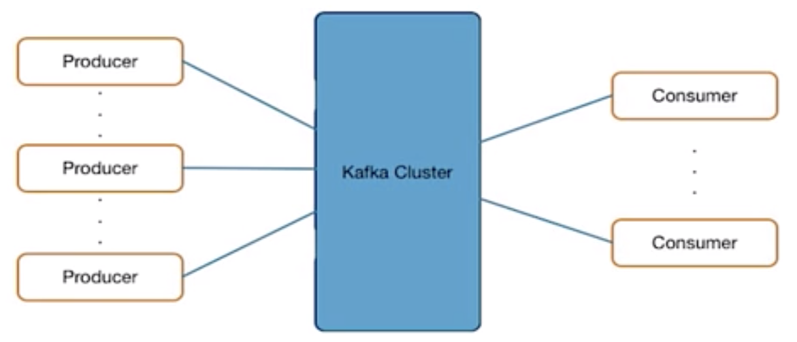

= Kafka 基础概要与高级概念
:toc: manual

== 为什么会出现 Kafka

传统架构中，数据是 IT 系统的核心，数据总是从一个地方复制到另一个地方，例如，一个大的银行，生产相关的核心系统及核心系统数据库一般运行在性能比较好的大机上面，而数据分析通常在大数据平台、实时数据分析平台、数据仓库中进行，数据从生产库到数据分析平台通常是通过数据复制进行的。在这个例子中，我们可以将生产库的数据库看作是生产者，而将数据分析平台看作是数据消费者。

相比较传统架构，数据在今天的特点是种类增多，数量变大，当前任何一个企业都在积极的将社交数据、IOT 设备数据等接到到自己企业内部，通常这些数据来源广泛，目的地通常是企业内部的大数据平台，或实时数据分析平台。这个例子中，IOT 设备、社交信息源作为生产者，同样数据分析平台作为数据消费者。

今天，企业面临着一个问题，随着数据源，及数据消费者越来越多，这种架构就会变得越来约复杂，如何降低数据生产者和数据消费者之间交互的复杂性，将这种交互架构变得更加强？

Kafka 提出了一些理念，来解决企业所面对的问题:

* 数据源和目的地松耦合
* 发布/订阅架构
* 所有数据源写数据到 Kafka
* 所有消费者都从 Kafka 读数据
* 流数据平台
** 数据集成
** 流数据处理

=== 实时流处理（Realtime Streaming）

为什么需要实时流处理（Realtime Streaming）？实时流处理流就是确保数据处理的实时性，从而是企业或组织可以做实时的决策（当前大数据组织都还依赖批量处理数量，来做业务决策）。常见实时决策的场景有：

* 欺诈侦查
* 电商网站的推荐系统
* 日志监控与问题分析系统

常见的实时流处理系统有：Kafka Streams，Apache Kafka Streaming，Apache Storm，Apache Samza。

