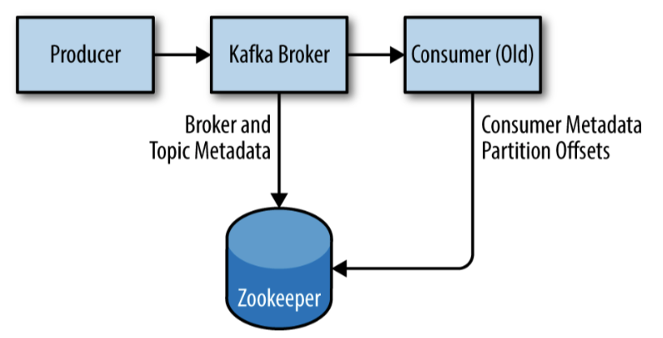

= 安装
:toc: manual

== 单点安装

=== 先觉条件

==== 操作系统

Kafka 基于 Java 的应用，可以运行在任意平台或操作系统。本处选择 CentOS 7:

[source, bash]
----
$ cat /etc/redhat-release 
CentOS Linux release 7.6.1810 (Core) 
----

==== 安装 Java

下载 JDK 后安装（生产环境只需安装 Java 运行环境即可，本文档为实验环境，为了方便所以安装了 JDK）:

[source, bash]
----
$ sudo mkdir /usr/java
$ sudo tar -xvf jdk-8u221-linux-x64.tar.gz -C /usr/java/

//设定环境变量，添加如下两行到 .bash_profile 文件 PATH 下面
JAVA_HOME=/usr/java/jdk1.8.0_221
PATH=$PATH:$JAVA_HOME/bin

//设定软链接
$ sudo ln -s /usr/java/jdk1.8.0_221/bin/java /etc/alternatives/java

//安装验证
$ java -version
java version "1.8.0_221"
Java(TM) SE Runtime Environment (build 1.8.0_221-b11)
Java HotSpot(TM) 64-Bit Server VM (build 25.221-b11, mixed mode)
----

==== 安装 Zookeeper

如下图所示，Zookeeper 用来保存 Kafka 集群元数据，以及消费者客户端的详细信息。

使用如下步骤安装 Zookeeper：

[source, bash]
----
$ tar -xvf apache-zookeeper-3.5.5-bin.tar.gz
$ sudo mv apache-zookeeper-3.5.5-bin /usr/local/zookeeper
$ sudo mkdir -p /var/lib/zookeeper

//配置
$sudo cat << EOF > /usr/local/zookeeper/conf/zoo.cfg
tickTime=2000
dataDir=/var/lib/zookeeper
clientPort=2181
EOF

//切换到 root 启动
# /usr/local/zookeeper/bin/zkServer.sh start
/usr/java/jdk1.8.0_221/bin/java
ZooKeeper JMX enabled by default
Using config: /usr/local/zookeeper/bin/../conf/zoo.cfg
Starting zookeeper ... STARTED

//测试
$ telnet localhost 2181
Trying ::1...
Connected to localhost.
Escape character is '^]'.
srvr
Zookeeper version: 3.5.5-390fe37ea45dee01bf87dc1c042b5e3dcce88653, built on 05/03/2019 12:07 GMT
Latency min/avg/max: 0/0/0
Received: 1
Sent: 0
Connections: 1
Outstanding: 0
Zxid: 0x0
Mode: standalone
Node count: 5
Connection closed by foreign host.
----

=== 安装 Kafka Broker

使用如下命令安装 Kafka Broker

[source, text]
----
# tar -xvf kafka_2.12-2.3.0.tgz
# mv kafka_2.12-2.3.0 /usr/local/kafka
# mkdir /tmp/kafka-logs

//启动
# /usr/local/kafka/bin/kafka-server-start.sh -daemon /usr/local/kafka/config/server.properties
----

=== 安装测试

[source, text]
.*1. 创建一个 Topic 并验证*
----
# /usr/local/kafka/bin/kafka-topics.sh --create --zookeeper localhost:2181 --replication-factor 1 --partitions 1 --topic test
Created topic test.

# /usr/local/kafka/bin/kafka-topics.sh --zookeeper localhost:2181 --describe --topic test
Topic:test	PartitionCount:1	ReplicationFactor:1	Configs:
	Topic: test	Partition: 0	Leader: 0	Replicas: 0	Isr: 0
----

[source, text]
.*2. 发送消息*
----
# /usr/local/kafka/bin/kafka-console-producer.sh --broker-list localhost:9092 --topic test
>Test Message 1
>Test Message 2
----

[source, text]
.*3. 接收消息*
----
# /usr/local/kafka/bin/kafka-console-consumer.sh --bootstrap-server localhost:9092 --topic test --from-beginning
Test Message 1
Test Message 2
----

== 集群安装

== 常见问题

[source, bash]
----

----

[source, bash]
----

----
