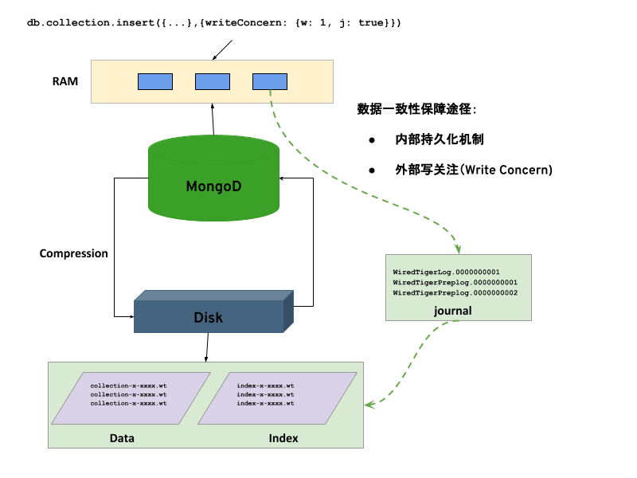
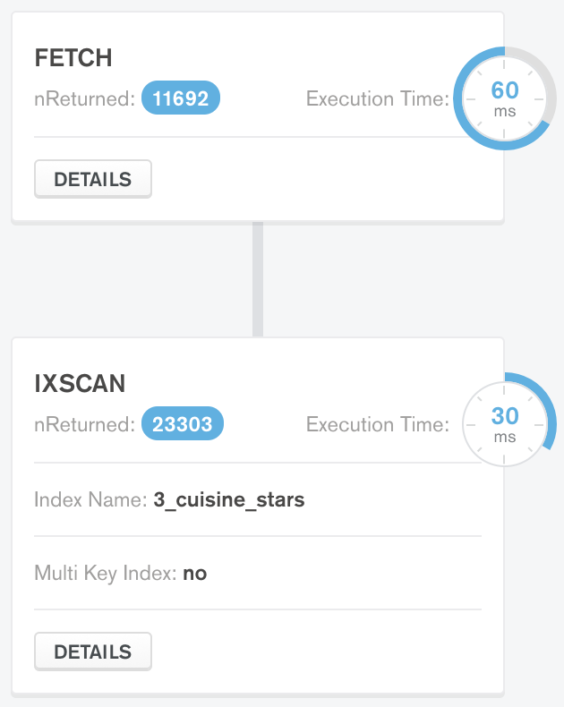

= 性能调优
:toc: manual

== 硬件因素

* 内存（RAM）的读写速度时普通 SSD 的 25 倍。MongoDB 中依赖 RAM 最多的操作包括：聚合、索引遍历、写操作、查询引擎、连接

.*常见存储的IOPS*
|===
|类型 | IOPS

|7200 rpm SATA
|75 - 100

|15000 rpm SAS
|175 - 210

|SSD Intel X25-E(SLC)
|5000

|SSD Intel X25-M G2(MLC) 
|8000

|Amazon EBS
|100

|Amazon EBS Provisioned
|2000

|Amazon EBS Provisioned IOPS(SSD)
|3000

|FusionIO
|135 000

|Violin Memory 6000
|1 000 000
|===

== 数据落盘过程

首先，MongoDB 在存储信息时使用压缩，MongoDB 存储引擎将数据存储到磁盘时使用压缩算法，这个对性能有很重要的影响，因为它降低了磁盘操作的 IO，同时也节省了 CPU 使用时间。

其次，数据在存储到磁盘之前是在内存中保存，那么如何数据从内存中落盘过程中数据的一致性？MongoDB 提供了两种途径：

. 内部持久化机制 - 一个周期性运行的内部程序周期性的将数据写入/同步到磁盘(A periodical internal process that regulates how data be flushed and synced in to data file)。在持久化机制刷盘的过程中，恢复日志（Journal）是一个必需的组件，它确保因为系统掉电或者崩溃时导致内存数据丢失问题，MongoDB 会先把数据更新写入到 Journal Buffer 里面，然后再更新内存数据，然后再返回给应用端。Journal 会以 100ms 的间隔批量刷到盘上。这样的情况下，即使出现断电数据尚未保存到文件，由于有 Journal 文件的存在，MongoDB 会自动根据 Journal 里面的操作历史记录来对数据文件重新进行追加。Journal 的刷盘是批量，基于压缩的格式进行的。关系型数据库（MySQL， PostgreSQL，Oracle 等）里都有一个Write Ahead Log（Redo Log）做同样的事情，MongoDB 的恢复日志（Journal）相当于关系数据库中的 WAL 日志。
. 外部写关注（Write Concern) - 写关注是 MongoDB 特有的一个功能，它可以让你灵活地指定你写操作的持久化设定。这是一个在性能和可靠性之间的一个权衡，如果设定一个较强的可靠性配置，如：{w: “majority”} 和 {j:1}，那么极端情况下 MongoDB 丢数据的可能性为 0。

最后，数据在磁盘上是一文件的形式保存，根据上面描述，磁盘上文件主要有三类：数据文件、索引文件、恢复日志（Journal）文件。

image:img/mongod-disk-files.png[]

=== 使用directoryperdb、wiredTigerDirectoryForIndexes 增加吞吐量

[source, bash]
.*directoryperdb*
----
$ mongod --dbpath ~/data/db --logpath ~/data/db/mongod.log --fork --directoryperdb
$ mongo hello --eval 'db.myCollections.insert({name: "hello"})'

$ ls data/db/hello/
collection-8-6275239857016906202.wt  index-9-6275239857016906202.wt
----

[source, bash]
.*wiredTigerDirectoryForIndexes*
----
$ mongod --dbpath ~/data/db --logpath ~/data/db/mongod.log --fork --directoryperdb --wiredTigerDirectoryForIndexes
$ mongo hello --eval 'db.myCollections.insert({name: "hello"})'

$ ls -LR data/db/hello/
data/db/hello/:
collection  index

data/db/hello/collection:
8-6326041135875266620.wt

data/db/hello/index:
9-6326041135875266620.wt
----

=== 压缩（compression）

MongoDB 4.2 支持 3 种压缩算法：

|===
|名称 |说明

|snappy
|

|zstd
|

|zlib
|
|===

=== journal

journal 确保数据写磁盘过程中的一致性。那么 journal 详细工作原理是什么？

TODO--

== MongoDB 索引

=== 单字段索引(Single Field Indexes)

MongoDB 数据库中所提供的最简单索引，它的创建语法：

[source, javascript]
----
db.<collection>.createIndex({<field>: <direction>})
----

下载 people.json (链接: https://pan.baidu.com/s/1ZEbXIU3NXcToT5-xNQY83g 提取码: 3wvd) 导入到 MongoDB

[source, javascript]
----
$ mongoimport --host 127.0.0.1:27000 --db test --collection people --drop --file ~/Downloads/people.json
----

[source, javascript]
.*1. 没有索引查询，查看执行计划*
----
var r = db.people.find({"ssn": "720-38-5636"}).explain("executionStats")

r.queryPlanner.winningPlan
{
	"stage" : "COLLSCAN",
	"filter" : {
		"ssn" : {
			"$eq" : "720-38-5636"
		}
	},
	"direction" : "forward"
}

r.executionStats
{
	"executionSuccess" : true,
	"nReturned" : 1,
	"executionTimeMillis" : 24,
	"totalKeysExamined" : 0,
	"totalDocsExamined" : 50474,
	"executionStages" : {
		"stage" : "COLLSCAN",
		"filter" : {
			"ssn" : {
				"$eq" : "720-38-5636"
			}
		},
		"nReturned" : 1,
		"executionTimeMillisEstimate" : 20,
		"works" : 50476,
		"advanced" : 1,
		"needTime" : 50474,
		"needYield" : 0,
		"saveState" : 394,
		"restoreState" : 394,
		"isEOF" : 1,
		"invalidates" : 0,
		"direction" : "forward",
		"docsExamined" : 50474
	}
}
----

NOTE: queryPlanner 部分 winningPlan stage 为 COLLSCAN，即查询是通过全集合扫描完成；executionStats 部分 nReturned 显示查询结果返回文档总数为 1，totalDocsExamined 属性显示扫描文档的总数为 50474，即执行了全集合扫描。

[source, javascript]
.*2. 创建索引*
----
db.people.createIndex({ssn: 1})
{
	"createdCollectionAutomatically" : false,
	"numIndexesBefore" : 1,
	"numIndexesAfter" : 2,
	"ok" : 1
}
----

[source, javascript]
.*3. 有索引查询，查看执行计划*
----
var r = db.people.find({"ssn": "720-38-5636"}).explain("executionStats")

r.queryPlanner.winningPlan
{
	"stage" : "FETCH",
	"inputStage" : {
		"stage" : "IXSCAN",
		"keyPattern" : {
			"ssn" : 1
		},
		"indexName" : "ssn_1",
		"isMultiKey" : false,
		"multiKeyPaths" : {
			"ssn" : [ ]
		},
		"isUnique" : false,
		"isSparse" : false,
		"isPartial" : false,
		"indexVersion" : 2,
		"direction" : "forward",
		"indexBounds" : {
			"ssn" : [
				"[\"720-38-5636\", \"720-38-5636\"]"
			]
		}
	}
}

r.executionStats
{
	"executionSuccess" : true,
	"nReturned" : 1,
	"executionTimeMillis" : 3,
	"totalKeysExamined" : 1,
	"totalDocsExamined" : 1,
	"executionStages" : {
		"stage" : "FETCH",
		"nReturned" : 1,
		"executionTimeMillisEstimate" : 0,
		"works" : 2,
		"advanced" : 1,
		"needTime" : 0,
		"needYield" : 0,
		"saveState" : 0,
		"restoreState" : 0,
		"isEOF" : 1,
		"invalidates" : 0,
		"docsExamined" : 1,
		"alreadyHasObj" : 0,
		"inputStage" : {
			"stage" : "IXSCAN",
			"nReturned" : 1,
			"executionTimeMillisEstimate" : 0,
			"works" : 2,
			"advanced" : 1,
			"needTime" : 0,
			"needYield" : 0,
			"saveState" : 0,
			"restoreState" : 0,
			"isEOF" : 1,
			"invalidates" : 0,
			"keyPattern" : {
				"ssn" : 1
			},
			"indexName" : "ssn_1",
			"isMultiKey" : false,
			"multiKeyPaths" : {
				"ssn" : [ ]
			},
			"isUnique" : false,
			"isSparse" : false,
			"isPartial" : false,
			"indexVersion" : 2,
			"direction" : "forward",
			"indexBounds" : {
				"ssn" : [
					"[\"720-38-5636\", \"720-38-5636\"]"
				]
			},
			"keysExamined" : 1,
			"seeks" : 1,
			"dupsTested" : 0,
			"dupsDropped" : 0,
			"seenInvalidated" : 0
		}
	}
}
----

NOTE: 注意: queryPlanner 部分 winningPlan stage 为 FETCH，而 inputStage 的 stage 为 IXSCAN，即查询是通过索引完成；executionStats 部分 nReturned 显示查询结果返回文档总数为 1，totalDocsExamined 属性显示扫描文档的总数为 1，即通过索引获取。

*对比有索引和无索引下执行计划的不同*

|===
|对比项 |无索引 |有索引

|`queryPlanner.winningPlan.stage`
|COLLSCAN
|FETCH

|`queryPlanner.winningPlan.inputStage.stage`
|
|IXSCAN

|`executionStats.nReturned`
|1
|1

|`executionStats.executionTimeMillis`
|24
|1

|`executionStats.totalKeysExamined`
|0
|1

|`executionStats.totalDocsExamined`
|50474
|1

|`executionStats.executionStages.stage`
|COLLSCAN
|FETCH

|`executionStats.executionStages.inputStage.stage`
|
|IXSCAN
|===

[source, javascript]
.*4. 查询一定范围内多个文档，查看执行计划是否命中索引*
----
var r = db.people.find({"ssn": {$gte: "555-00-0000", $lt: "556-00-0000"}}).explain("executionStats")

 r.queryPlanner.winningPlan
{
	"stage" : "FETCH",
	"inputStage" : {
		"stage" : "IXSCAN",
		"keyPattern" : {
			"ssn" : 1
		},
		"indexName" : "ssn_1",
		"isMultiKey" : false,
		"multiKeyPaths" : {
			"ssn" : [ ]
		},
		"isUnique" : false,
		"isSparse" : false,
		"isPartial" : false,
		"indexVersion" : 2,
		"direction" : "forward",
		"indexBounds" : {
			"ssn" : [
				"[\"555-00-0000\", \"556-00-0000\")"
			]
		}
	}
}

r.executionStats
{
	"executionSuccess" : true,
	"nReturned" : 49,
	"executionTimeMillis" : 1,
	"totalKeysExamined" : 49,
	"totalDocsExamined" : 49,
	"executionStages" : {
		"stage" : "FETCH",
		"nReturned" : 49,
		"executionTimeMillisEstimate" : 0,
		"works" : 50,
		"advanced" : 49,
		"needTime" : 0,
		"needYield" : 0,
		"saveState" : 0,
		"restoreState" : 0,
		"isEOF" : 1,
		"invalidates" : 0,
		"docsExamined" : 49,
		"alreadyHasObj" : 0,
		"inputStage" : {
			"stage" : "IXSCAN",
			"nReturned" : 49,
			"executionTimeMillisEstimate" : 0,
			"works" : 50,
			"advanced" : 49,
			"needTime" : 0,
			"needYield" : 0,
			"saveState" : 0,
			"restoreState" : 0,
			"isEOF" : 1,
			"invalidates" : 0,
			"keyPattern" : {
				"ssn" : 1
			},
			"indexName" : "ssn_1",
			"isMultiKey" : false,
			"multiKeyPaths" : {
				"ssn" : [ ]
			},
			"isUnique" : false,
			"isSparse" : false,
			"isPartial" : false,
			"indexVersion" : 2,
			"direction" : "forward",
			"indexBounds" : {
				"ssn" : [
					"[\"555-00-0000\", \"556-00-0000\")"
				]
			},
			"keysExamined" : 49,
			"seeks" : 1,
			"dupsTested" : 0,
			"dupsDropped" : 0,
			"seenInvalidated" : 0
		}
	}
}
----

NOTE: range 查询可以命中索引，`executionStats.totalKeysExamined` 和 `executionStats.totalDocsExamined` 相同，都为 49，`executionStats.executionStages.stage` 为 FETCH，`executionStats.executionStages.inputStage.stage` 为 IXSCAN。 

[source, javascript]
.*5. 查询一个集合内多个文档，查看执行计划是否命中索引*
----
var r = db.people.find({"ssn": {$in: ["001-29-9184", "177-45-0950", "265-67-9973"]}}).explain("executionStats")

r.queryPlanner.winningPlan
{
	"stage" : "FETCH",
	"inputStage" : {
		"stage" : "IXSCAN",
		"keyPattern" : {
			"ssn" : 1
		},
		"indexName" : "ssn_1",
		"isMultiKey" : false,
		"multiKeyPaths" : {
			"ssn" : [ ]
		},
		"isUnique" : false,
		"isSparse" : false,
		"isPartial" : false,
		"indexVersion" : 2,
		"direction" : "forward",
		"indexBounds" : {
			"ssn" : [
				"[\"001-29-9184\", \"001-29-9184\"]",
				"[\"177-45-0950\", \"177-45-0950\"]",
				"[\"265-67-9973\", \"265-67-9973\"]"
			]
		}
	}
}

r.executionStats
{
	"executionSuccess" : true,
	"nReturned" : 3,
	"executionTimeMillis" : 3,
	"totalKeysExamined" : 6,
	"totalDocsExamined" : 3,
	"executionStages" : {
		"stage" : "FETCH",
		"nReturned" : 3,
		"executionTimeMillisEstimate" : 0,
		"works" : 6,
		"advanced" : 3,
		"needTime" : 2,
		"needYield" : 0,
		"saveState" : 0,
		"restoreState" : 0,
		"isEOF" : 1,
		"invalidates" : 0,
		"docsExamined" : 3,
		"alreadyHasObj" : 0,
		"inputStage" : {
			"stage" : "IXSCAN",
			"nReturned" : 3,
			"executionTimeMillisEstimate" : 0,
			"works" : 6,
			"advanced" : 3,
			"needTime" : 2,
			"needYield" : 0,
			"saveState" : 0,
			"restoreState" : 0,
			"isEOF" : 1,
			"invalidates" : 0,
			"keyPattern" : {
				"ssn" : 1
			},
			"indexName" : "ssn_1",
			"isMultiKey" : false,
			"multiKeyPaths" : {
				"ssn" : [ ]
			},
			"isUnique" : false,
			"isSparse" : false,
			"isPartial" : false,
			"indexVersion" : 2,
			"direction" : "forward",
			"indexBounds" : {
				"ssn" : [
					"[\"001-29-9184\", \"001-29-9184\"]",
					"[\"177-45-0950\", \"177-45-0950\"]",
					"[\"265-67-9973\", \"265-67-9973\"]"
				]
			},
			"keysExamined" : 6,
			"seeks" : 3,
			"dupsTested" : 0,
			"dupsDropped" : 0,
			"seenInvalidated" : 0
		}
	}
}
----

NOTE: $in 查询可以命中索引，`executionStats.totalKeysExamined` 为 6，`executionStats.totalDocsExamined` 为 3，`executionStats.executionStages.stage` 为 FETCH，`executionStats.executionStages.inputStage.stage` 为 IXSCAN。

[source, javascript]
.*6. 查询一个集合内多个文档，及多个其他属性，查看执行计划是否命中索引*
----
var r = db.people.find({"ssn": {$in: ["001-29-9184", "177-45-0950", "265-67-9973"]}, last_name: {$gte: "H"}}).explain("executionStats")

r.queryPlanner.winningPlan
{
	"stage" : "FETCH",
	"filter" : {
		"last_name" : {
			"$gte" : "H"
		}
	},
	"inputStage" : {
		"stage" : "IXSCAN",
		"keyPattern" : {
			"ssn" : 1
		},
		"indexName" : "ssn_1",
		"isMultiKey" : false,
		"multiKeyPaths" : {
			"ssn" : [ ]
		},
		"isUnique" : false,
		"isSparse" : false,
		"isPartial" : false,
		"indexVersion" : 2,
		"direction" : "forward",
		"indexBounds" : {
			"ssn" : [
				"[\"001-29-9184\", \"001-29-9184\"]",
				"[\"177-45-0950\", \"177-45-0950\"]",
				"[\"265-67-9973\", \"265-67-9973\"]"
			]
		}
	}
}

r.executionStats
{
	"executionSuccess" : true,
	"nReturned" : 2,
	"executionTimeMillis" : 0,
	"totalKeysExamined" : 6,
	"totalDocsExamined" : 3,
	"executionStages" : {
		"stage" : "FETCH",
		"filter" : {
			"last_name" : {
				"$gte" : "H"
			}
		},
		"nReturned" : 2,
		"executionTimeMillisEstimate" : 0,
		"works" : 6,
		"advanced" : 2,
		"needTime" : 3,
		"needYield" : 0,
		"saveState" : 0,
		"restoreState" : 0,
		"isEOF" : 1,
		"invalidates" : 0,
		"docsExamined" : 3,
		"alreadyHasObj" : 0,
		"inputStage" : {
			"stage" : "IXSCAN",
			"nReturned" : 3,
			"executionTimeMillisEstimate" : 0,
			"works" : 6,
			"advanced" : 3,
			"needTime" : 2,
			"needYield" : 0,
			"saveState" : 0,
			"restoreState" : 0,
			"isEOF" : 1,
			"invalidates" : 0,
			"keyPattern" : {
				"ssn" : 1
			},
			"indexName" : "ssn_1",
			"isMultiKey" : false,
			"multiKeyPaths" : {
				"ssn" : [ ]
			},
			"isUnique" : false,
			"isSparse" : false,
			"isPartial" : false,
			"indexVersion" : 2,
			"direction" : "forward",
			"indexBounds" : {
				"ssn" : [
					"[\"001-29-9184\", \"001-29-9184\"]",
					"[\"177-45-0950\", \"177-45-0950\"]",
					"[\"265-67-9973\", \"265-67-9973\"]"
				]
			},
			"keysExamined" : 6,
			"seeks" : 3,
			"dupsTested" : 0,
			"dupsDropped" : 0,
			"seenInvalidated" : 0
		}
	}
}
----

NOTE: 索引前缀查询同样可以命中索引，查询可以命中索引，`executionStats.totalKeysExamined` 和 `executionStats.totalDocsExamined` 相同，都为 49，`executionStats.executionStages.stage` 为 FETCH，`executionStats.executionStages.inputStage.stage` 为 IXSCAN。

MongoDB 中 sort 排序操作通常需要基于索引键进行，如果 queryPlanner 不能够获取索引键，那么排序会在内存中进行。

* sort 排序基于索引基于索引键性能优于基于非索引键
* 如果 sort 排序不基于索引键，那么排序使用的内存不能超过 32 MB
* 如果升序或降序的单字段索引存在，那么 sort 排序可以是任意方向

基于如下 7, 8, 9 步，执行 `db.people.find({}, {_id: 0, last_name: 1, first_name: 1, ssn: 1}).sort({ssn: 1})`, 对比无索引，升序索引、降序索引：

|===
|对比项 |无索引 |升序索引 |降序索引

|`executionStats.nReturned`
|50474
|50474
|50474

|`executionStats.executionTimeMillis`
|222
|114
|124

|`executionStats.totalKeysExamined`
|0
|50474
|50474

|`executionStats.totalDocsExamined`
|50474
|50474
|50474

|`executionStats.executionStages.stage`
|PROJECTION
|PROJECTION
|PROJECTION

|`executionStats.executionStages.inputStage.stage`
|SORT
|FETCH
|FETCH

|`executionStats.executionStages.inputStage.inputStage.stage`
|SORT_KEY_GENERATOR
|IXSCAN
|IXSCAN

|`executionStats.executionStages.inputStage.inputStage.inputStage.stage`
|COLLSCAN
|
|

|`executionStats.executionStages.inputStage.inputStage.direction`
|
|forward
|backward

|`xecutionStats.executionStages.inputStage.inputStage.keysExamined`
|
|50474
|50474
|===

[source, javascript]
.*7. 以索引的属性进行升序排序，并查看执行计划，预期结果，排序使用了索引排序*
----
var r = db.people.find({}, {_id: 0, last_name: 1, first_name: 1, ssn: 1}).sort({ssn: 1}).explain("executionStats")

r.executionStats
{
	"executionSuccess" : true,
	"nReturned" : 50474,
	"executionTimeMillis" : 116,
	"totalKeysExamined" : 50474,
	"totalDocsExamined" : 50474,
	"executionStages" : {
		"stage" : "PROJECTION",
		"nReturned" : 50474,
		"executionTimeMillisEstimate" : 98,
		"works" : 50475,
		"advanced" : 50474,
		"needTime" : 0,
		"needYield" : 0,
		"saveState" : 395,
		"restoreState" : 395,
		"isEOF" : 1,
		"invalidates" : 0,
		"transformBy" : {
			"_id" : 0,
			"last_name" : 1,
			"first_name" : 1,
			"ssn" : 1
		},
		"inputStage" : {
			"stage" : "FETCH",
			"nReturned" : 50474,
			"executionTimeMillisEstimate" : 76,
			"works" : 50475,
			"advanced" : 50474,
			"needTime" : 0,
			"needYield" : 0,
			"saveState" : 395,
			"restoreState" : 395,
			"isEOF" : 1,
			"invalidates" : 0,
			"docsExamined" : 50474,
			"alreadyHasObj" : 0,
			"inputStage" : {
				"stage" : "IXSCAN",
				"nReturned" : 50474,
				"executionTimeMillisEstimate" : 33,
				"works" : 50475,
				"advanced" : 50474,
				"needTime" : 0,
				"needYield" : 0,
				"saveState" : 395,
				"restoreState" : 395,
				"isEOF" : 1,
				"invalidates" : 0,
				"keyPattern" : {
					"ssn" : 1
				},
				"indexName" : "ssn_1",
				"isMultiKey" : false,
				"multiKeyPaths" : {
					"ssn" : [ ]
				},
				"isUnique" : false,
				"isSparse" : false,
				"isPartial" : false,
				"indexVersion" : 2,
				"direction" : "forward",
				"indexBounds" : {
					"ssn" : [
						"[MinKey, MaxKey]"
					]
				},
				"keysExamined" : 50474,
				"seeks" : 1,
				"dupsTested" : 0,
				"dupsDropped" : 0,
				"seenInvalidated" : 0
			}
		}
	}
}
----

[source, javascript]
.*8. 删除索引，以非索引的属性进行升序排序，并查看执行计划，预期结果，排序使用了内存排序*
----
db.people.dropIndex({ssn: 1})

var r = db.people.find({}, {_id: 0, last_name: 1, first_name: 1, ssn: 1}).sort({ssn: 1}).explain("executionStats")

r.executionStats
{
	"executionSuccess" : true,
	"nReturned" : 50474,
	"executionTimeMillis" : 217,
	"totalKeysExamined" : 0,
	"totalDocsExamined" : 50474,
	"executionStages" : {
		"stage" : "PROJECTION",
		"nReturned" : 50474,
		"executionTimeMillisEstimate" : 198,
		"works" : 100952,
		"advanced" : 50474,
		"needTime" : 50477,
		"needYield" : 0,
		"saveState" : 795,
		"restoreState" : 795,
		"isEOF" : 1,
		"invalidates" : 0,
		"transformBy" : {
			"_id" : 0,
			"last_name" : 1,
			"first_name" : 1,
			"ssn" : 1
		},
		"inputStage" : {
			"stage" : "SORT",
			"nReturned" : 50474,
			"executionTimeMillisEstimate" : 162,
			"works" : 100952,
			"advanced" : 50474,
			"needTime" : 50477,
			"needYield" : 0,
			"saveState" : 795,
			"restoreState" : 795,
			"isEOF" : 1,
			"invalidates" : 0,
			"sortPattern" : {
				"ssn" : 1
			},
			"memUsage" : 19977871,
			"memLimit" : 33554432,
			"inputStage" : {
				"stage" : "SORT_KEY_GENERATOR",
				"nReturned" : 50474,
				"executionTimeMillisEstimate" : 57,
				"works" : 50477,
				"advanced" : 50474,
				"needTime" : 2,
				"needYield" : 0,
				"saveState" : 795,
				"restoreState" : 795,
				"isEOF" : 1,
				"invalidates" : 0,
				"inputStage" : {
					"stage" : "COLLSCAN",
					"nReturned" : 50474,
					"executionTimeMillisEstimate" : 21,
					"works" : 50476,
					"advanced" : 50474,
					"needTime" : 1,
					"needYield" : 0,
					"saveState" : 795,
					"restoreState" : 795,
					"isEOF" : 1,
					"invalidates" : 0,
					"direction" : "forward",
					"docsExamined" : 50474
				}
			}
		}
	}
}
----

[source, javascript]
.*9. 创建升续索引，以索引的属性进行降序排序，并查看执行计划，预期结果*
----
db.people.createIndex({ssn: -1})

var r = db.people.find({}, {_id: 0, last_name: 1, first_name: 1, ssn: 1}).sort({ssn: -1}).explain("executionStats")

r.executionStats
{
	"executionSuccess" : true,
	"nReturned" : 50474,
	"executionTimeMillis" : 123,
	"totalKeysExamined" : 50474,
	"totalDocsExamined" : 50474,
	"executionStages" : {
		"stage" : "PROJECTION",
		"nReturned" : 50474,
		"executionTimeMillisEstimate" : 110,
		"works" : 50475,
		"advanced" : 50474,
		"needTime" : 0,
		"needYield" : 0,
		"saveState" : 396,
		"restoreState" : 396,
		"isEOF" : 1,
		"invalidates" : 0,
		"transformBy" : {
			"_id" : 0,
			"last_name" : 1,
			"first_name" : 1,
			"ssn" : 1
		},
		"inputStage" : {
			"stage" : "FETCH",
			"nReturned" : 50474,
			"executionTimeMillisEstimate" : 99,
			"works" : 50475,
			"advanced" : 50474,
			"needTime" : 0,
			"needYield" : 0,
			"saveState" : 396,
			"restoreState" : 396,
			"isEOF" : 1,
			"invalidates" : 0,
			"docsExamined" : 50474,
			"alreadyHasObj" : 0,
			"inputStage" : {
				"stage" : "IXSCAN",
				"nReturned" : 50474,
				"executionTimeMillisEstimate" : 23,
				"works" : 50475,
				"advanced" : 50474,
				"needTime" : 0,
				"needYield" : 0,
				"saveState" : 396,
				"restoreState" : 396,
				"isEOF" : 1,
				"invalidates" : 0,
				"keyPattern" : {
					"ssn" : -1
				},
				"indexName" : "ssn_-1",
				"isMultiKey" : false,
				"multiKeyPaths" : {
					"ssn" : [ ]
				},
				"isUnique" : false,
				"isSparse" : false,
				"isPartial" : false,
				"indexVersion" : 2,
				"direction" : "forward",
				"indexBounds" : {
					"ssn" : [
						"[MaxKey, MinKey]"
					]
				},
				"keysExamined" : 50474,
				"seeks" : 1,
				"dupsTested" : 0,
				"dupsDropped" : 0,
				"seenInvalidated" : 0
			}
		}
	}
}
----

=== 复合索引(Compound Indexes)

MongoDB 数据库中复合索引及索引基于多个字段，它的创建语法：

[source, javascript]
----
db.<collection>.createIndex({<field1>: <type>, <field2>: <type2>, ...})
----

如下是关于复合索引需要注意的地方：

* 复合索引最多可以基于 32 个字段，通常复合索引中的字段不能包括哈希字段。
* Equality 和 Range 可以使用复合索引及复合索引前缀，且与字段升序和降序无关
* Sorting 可以使用复合索引及复合索引前缀，但与字段升序和降序有关
* 基于 ESR 模式创建复合索引

下载 people.json (链接: https://pan.baidu.com/s/1ZEbXIU3NXcToT5-xNQY83g 提取码: 3wvd) 导入到 MongoDB

[source, javascript]
----
$ mongoimport --host 127.0.0.1:27000 --db test --collection people --drop --file ~/Downloads/people.json
----

基于 link:basic.adoc[基础] 部分安装 Compass，使用 Compass 查看执行计划。

*1. 无索引下查看执行计划*

Compass 中查看 `db.people.find({last_name: "Frazier", first_name: "Jasmine"})` 操作的执行计划，会有如下图形化界面

image:img/compass-executionStats.png[]

*2. 创建单字段升序索引，查看执行计划*

Compass 中同样可以常见索引，例如如下

image:img/compass-create-single-indes-asd.png[]

如上创建了升序索引，名称为 last_name，在 Shell 中可以查看

[source, javascript]
----
> db.people.getIndexes()
[
	{
		"v" : 2,
		"key" : {
			"_id" : 1
		},
		"name" : "_id_",
		"ns" : "test.people"
	},
	{
		"v" : 2,
		"key" : {
			"last_name" : 1
		},
		"name" : "last_name",
		"ns" : "test.people"
	}
]
----

Compass 中查看 `db.people.find({last_name: "Frazier", first_name: "Jasmine"})` 操作的执行计划，会有如下图形化界面

image:img/compass-query-with-prefix-index.png[]

可以看到基于索引键查询。

*3. 创建复合升序索引，查看执行计划*

image:img/compass-compand-indexes.png[]

可以看到复合索引更能提高查询的性能。

NOTE: 复合索引下，range 范围查询，例如 `{last_name: "Frazier", first_name: {$gte : "L"}}` 等同样可以使用索引。

*4. 复合索引前缀*

复合索引前缀指的是复合索引从开始的一个子集，例如索引字段是

[source, javascript]
----
{ "job": 1, "last_name": 1, "first_name": 1 }
----

那么复合索引前缀是

[source, javascript]
----
{ job: 1 }
{ job: 1, last_name: 1 }
----

基于复合索引前缀查询同样可以使用索引，如下查询条件可以使用索引

[source, javascript]
----
{job: "Magazine features editor"}
{job: "Magazine features editor", last_name: "Ayers"}
{job: "Magazine features editor", last_name: "Ayers", first_name: "Mark"}
{first_name: "Mark", last_name: "Ayers", job: "Magazine features editor"}
----

如下查询可以部分使用索引

[source, javascript]
----
{job: "Magazine features editor", first_name: "Mark"}
----

如下查询条件不能够使用索引

[source, javascript]
----
{last_name: "Ayers"}
{last_name: "Ayers", first_name: "Mark"}
{first_name: "Mark"}
----

*5. 复合索引下升序和降序对排序是有影响的*

创建如下复合索引

[source, javascript]
----
{ "job": 1, "last_name": -1, "first_name": 1 }
----

升序和降序对查询没有影响，如下查询条件同样可以使用索引

[source, javascript]
----
{job: "Magazine features editor"} 
{job: "Magazine features editor", last_name: "Ayers"}
{job: "Magazine features editor", last_name: "Ayers", first_name: "Mark"}
----

使用如下排序可以使用索引,

[source, javascript]
----
{job: 1}
{job: -1}
{job: 1, last_name: -1}
{job: -1, last_name: 1}
{job: 1, last_name: -1, first_name: 1}
{job: -1, last_name: 1, first_name: -1}
----

如下排序不能使用索引

[source, javascript]
----
{job: 1, last_name: 1}
{job: -1, last_name: -1}
{job: 1, last_name: -1, first_name: -1}
{job: 1, last_name: 1, first_name: 1}
{job: -1, last_name: 1, first_name: 1}
{first_name: 1}
{first_name: -1}
{last_name: -1, first_name: 1}
----

==== 使用索引前缀查询

本部分创建复合索引 `{job: 1, employer: 1, last_name: 1, frist_name: 1}`，基于此索引进行查询。

[source, text]
.*1. 查看索引*
----
MongoDB Enterprise > db.people.getIndexes()
[
	{
		"v" : 2,
		"key" : {
			"_id" : 1
		},
		"name" : "_id_",
		"ns" : "m201.people"
	},
	{
		"v" : 2,
		"key" : {
			"job" : 1,
			"employer" : 1,
			"last_name" : 1,
			"frist_name" : 1
		},
		"name" : "job_1_employer_1_last_name_1_frist_name_1",
		"ns" : "m201.people"
	}
]
----

[source, text]
.*2. 依次执行下列查询，查看执行计划，并统计执行结果*
----
db.people.find({job: "Jewellery designer"}).explain("executionStats")
db.people.find({job: "Jewellery designer", employer: "Baldwin-Nichols"}).explain("executionStats")
db.people.find({job: "Jewellery designer", employer: "Baldwin-Nichols", last_name: "Cook"}).explain("executionStats")
db.people.find({job: "Jewellery designer", employer: "Baldwin-Nichols", last_name: "Cook", first_name: "Sara"}).explain("executionStats")
db.people.find({employer: "Baldwin-Nichols", last_name: "Cook", first_name: "Sara"}).explain("executionStats")
db.people.find({job: "Jewellery designer", first_name: "Sara",  last_name: "Cook"}).explain("executionStats")
----

统计结果

|===
|queryPlanner.winningPlan.stage |queryPlanner.winningPlan.inputStage |executionStats.nReturned |executionStats.totalKeysExamined |executionStats.totalDocsExamined

|FETCH
|IXSCAN
|83
|83
|83

|FETCH
|IXSCAN
|5
|5
|5

|FETCH
|IXSCAN
|1
|1
|1

|FETCH
|IXSCAN
|1
|1
|1

|COLLSCAN
|
|1
|0
|50474

|FETCH
|IXSCAN
|1
|74
|1
|===

==== 排序中使用复合索引属性

[source, text]
.*1. 查看索引*
----
MongoDB Enterprise > db.people.getIndexes()
[       
        {       
                "v" : 2,
                "key" : {
                        "_id" : 1
                },
                "name" : "_id_",
                "ns" : "m201.people"
        },      
        {       
                "v" : 2,
                "key" : {
                        "job" : 1, 
                        "employer" : 1,
                        "last_name" : 1,
                        "frist_name" : 1
                },
                "name" : "job_1_employer_1_last_name_1_frist_name_1",
                "ns" : "m201.people"
        }
]
----

[source, text]
.*2. 依次执行下列查询，查看执行计划，并统计执行结果*
----
db.people.find().sort({job: 1}).explain("executionStats")
db.people.find().sort({job: 1, employer: 1}).explain("executionStats")
db.people.find().sort({employer: 1}).explain("executionStats")
db.people.find({email: "jenniferfreeman@hotmail.com"}).sort({job: 1, employer: 1}).explain("executionStats")
db.people.find({job: "Jewellery designer", employer: "Baldwin-Nichols"}).sort({last_name: 1}).explain("executionStats")
db.people.find({job: "Jewellery designer", employer: "Baldwin-Nichols"}).sort({first_name: 1}).explain("executionStats")
----

统计结果

|===
|queryPlanner.winningPlan.stage |queryPlanner.winningPlan.inputStage

|FETCH
|IXSCAN

|FETCH
|IXSCAN

|SORT
|SORT_KEY_GENERATOR

|FETCH
|IXSCAN

|FETCH
|IXSCAN

|SORT
|SORT_KEY_GENERATOR
|===

==== 多 key 复合索引

如果一个 JSON 文档中嵌入了 Array 或 JSON 文档时，创建索引就可能是多 key 复合索引。

[source, text]
.*1. 准备数据*
----
db.products.insert({
  productName: "MongoDB Short Sleeve T-Shirt",
  categories: ["T-Shirts", "Clothing", "Apparel"],
  stock: { size: "L", color: "green", quantity: 100 }
});
----

[source, text]
.*2. 创建索引*
----
db.products.createIndex({ "stock.quantity": 1})
----

[source, text]
.*3. 执行查询，并查看执行计划*
----
MongoDB Enterprise > db.products.find({ "stock.quantity": 100 }).explain()
{
	"queryPlanner" : {
		"plannerVersion" : 1,
		"namespace" : "m201.products",
		"indexFilterSet" : false,
		"parsedQuery" : {
			"stock.quantity" : {
				"$eq" : 100
			}
		},
		"winningPlan" : {
			"stage" : "FETCH",
			"inputStage" : {
				"stage" : "IXSCAN",
				"keyPattern" : {
					"stock.quantity" : 1
				},
				"indexName" : "stock.quantity_1",
				"isMultiKey" : false,
				"multiKeyPaths" : {
					"stock.quantity" : [ ]
				},
				"isUnique" : false,
				"isSparse" : false,
				"isPartial" : false,
				"indexVersion" : 2,
				"direction" : "forward",
				"indexBounds" : {
					"stock.quantity" : [
						"[100.0, 100.0]"
					]
				}
			}
		},
		"rejectedPlans" : [ ]
	},
	"serverInfo" : {
		"host" : "m103",
		"port" : 27017,
		"version" : "3.6.11",
		"gitVersion" : "b4339db12bf57ffee5b84a95c6919dbd35fe31c9"
	},
	"ok" : 1
}
----

NOTE: 可以看到查询命中索引，IXSCAN 获取文档，isMultiKey 为 false。

[source, text]
.*4. 创建另外一条数据，quantity 在数组中*
----
db.products.insert({
  productName: "MongoDB Long Sleeve T-Shirt",
  categories: ["T-Shirts", "Clothing", "Apparel"],
  stock: [
    { size: "S", color: "red", quantity: 25 },
    { size: "S", color: "blue", quantity: 10 },
    { size: "M", color: "blue", quantity: 50 }
  ]
});
----

[source, text]
.*5. 执行查询，并查看执行计划*
----
MongoDB Enterprise > db.products.find({ "stock.quantity": 100 }).explain()
{
	"queryPlanner" : {
		"plannerVersion" : 1,
		"namespace" : "m201.products",
		"indexFilterSet" : false,
		"parsedQuery" : {
			"stock.quantity" : {
				"$eq" : 100
			}
		},
		"winningPlan" : {
			"stage" : "FETCH",
			"inputStage" : {
				"stage" : "IXSCAN",
				"keyPattern" : {
					"stock.quantity" : 1
				},
				"indexName" : "stock.quantity_1",
				"isMultiKey" : true,
				"multiKeyPaths" : {
					"stock.quantity" : [
						"stock"
					]
				},
				"isUnique" : false,
				"isSparse" : false,
				"isPartial" : false,
				"indexVersion" : 2,
				"direction" : "forward",
				"indexBounds" : {
					"stock.quantity" : [
						"[100.0, 100.0]"
					]
				}
			}
		},
		"rejectedPlans" : [ ]
	},
	"serverInfo" : {
		"host" : "m103",
		"port" : 27017,
		"version" : "3.6.11",
		"gitVersion" : "b4339db12bf57ffee5b84a95c6919dbd35fe31c9"
	},
	"ok" : 1
}
----

NOTE: 可以看到查询命中索引，IXSCAN 获取文档，isMultiKey 为 true，即只有嵌入的 key 在一个数组或文档中时，才触发了多 key 查询。

[source, text]
.*6. 创建一个多 key 复合索引*
----
MongoDB Enterprise > db.products.createIndex({ categories: 1, "stock.quantity": 1 })
{
	"ok" : 0,
	"errmsg" : "cannot index parallel arrays [stock] [categories]",
	"code" : 171,
	"codeName" : "CannotIndexParallelArrays"
}
----

NOTE: 如果两个 key 都属于嵌入的数组或文档，则索引创建失败。

[source, text]
.*7. 创建一个多 key 复合索引*
----
MongoDB Enterprise > db.products.createIndex({ productName: 1, "stock.quantity": 1 })
{
	"createdCollectionAutomatically" : false,
	"numIndexesBefore" : 2,
	"numIndexesAfter" : 3,
	"ok" : 1
}
----

[source, text]
.*8. 如果 stock 不是一个数组，productName 可以是一个数组*
----
MongoDB Enterprise > db.products.insert({productName: ["MongoDB Short Sleeve T-Shirt", "MongoDB Short Sleeve Shirt"], categories: ["T-Shirts", "Clothing", "Apparel"], stock: { size: "L", color: "green", quantity: 100 }});
WriteResult({ "nInserted" : 1 })
----

[source, text]
.*9. 如果 stock 和 productName 都是数组，则插入会失败*
----
MongoDB Enterprise > db.products.insert({productName: ["MongoDB Short Sleeve T-Shirt", "MongoDB Short Sleeve Shirt"], categories: ["T-Shirts", "Clothing", "Apparel"], stock: [{ size: "S", color: "red", quantity: 25 }, { size: "S", color: "blue", quantity: 10 }, { size: "M", color: "blue", quantity: 50 }]});
WriteResult({
	"nInserted" : 0,
	"writeError" : {
		"code" : 171,
		"errmsg" : "cannot index parallel arrays [stock] [productName]"
	}
})
----

=== Multikey 索引

为了更有效的支持数组类型的字段的查询，MongoDB 引入 Multikey 索引，创建语法：

[source, javascript]
----
db.coll.createIndex( { <field>: < 1 or -1 > } )
----

* 不能基于两个 Array 字段创建  Multikey 索引

[source, javascript]
.*1. 向 products 集合中添加一条记录*
----
db.products.insert({
  productName: "MongoDB Short Sleeve T-Shirt",
  categories: ["T-Shirts", "Clothing", "Apparel"],
  stock: { size: "L", color: "green", quantity: 100 }
});
----

[source, javascript]
.*2. 在 stock.quantity 上创建索引*
----
db.products.createIndex({ "stock.quantity": 1})
----

[source, javascript]
.*3. 查看执行计划*
----
var exp = db.products.explain()
exp.find({ "stock.quantity": 100 })
{
	"queryPlanner" : {
		"plannerVersion" : 1,
		"namespace" : "test.products",
		"indexFilterSet" : false,
		"parsedQuery" : {
			"stock.quantity" : {
				"$eq" : 100
			}
		},
		"winningPlan" : {
			"stage" : "FETCH",
			"inputStage" : {
				"stage" : "IXSCAN",
				"keyPattern" : {
					"stock.quantity" : 1
				},
				"indexName" : "stock.quantity_1",
				"isMultiKey" : false,
				"multiKeyPaths" : {
					"stock.quantity" : [ ]
				},
				"isUnique" : false,
				"isSparse" : false,
				"isPartial" : false,
				"indexVersion" : 2,
				"direction" : "forward",
				"indexBounds" : {
					"stock.quantity" : [
						"[100.0, 100.0]"
					]
				}
			}
		},
		"rejectedPlans" : [ ]
	},
	"serverInfo" : {
		"host" : "ksoong.local",
		"port" : 27017,
		"version" : "4.0.7",
		"gitVersion" : "1b82c812a9c0bbf6dc79d5400de9ea99e6ffa025"
	},
	"ok" : 1
}
----

NOTE: 注意，`winningPlan.inputStage.stage` 值为 IXSCAN，`winningPlan.inputStage.isMultiKey` 值为 false。

[source, javascript]
.*4. 向 products 集合中添加一条记录(stock 为 Array)*
----
  productName: "MongoDB Long Sleeve T-Shirt",
  categories: ["T-Shirts", "Clothing", "Apparel"],
  stock: [
    { size: "S", color: "red", quantity: 25 },
    { size: "S", color: "blue", quantity: 10 },
    { size: "M", color: "blue", quantity: 50 }
  ]
});
----

[source, javascript]
.*5. 查看执行计划*
----
exp.find({ "stock.quantity": 100 })
{
	"queryPlanner" : {
		"plannerVersion" : 1,
		"namespace" : "test.products",
		"indexFilterSet" : false,
		"parsedQuery" : {
			"stock.quantity" : {
				"$eq" : 100
			}
		},
		"winningPlan" : {
			"stage" : "FETCH",
			"inputStage" : {
				"stage" : "IXSCAN",
				"keyPattern" : {
					"stock.quantity" : 1
				},
				"indexName" : "stock.quantity_1",
				"isMultiKey" : true,
				"multiKeyPaths" : {
					"stock.quantity" : [
						"stock"
					]
				},
				"isUnique" : false,
				"isSparse" : false,
				"isPartial" : false,
				"indexVersion" : 2,
				"direction" : "forward",
				"indexBounds" : {
					"stock.quantity" : [
						"[100.0, 100.0]"
					]
				}
			}
		},
		"rejectedPlans" : [ ]
	},
	"serverInfo" : {
		"host" : "ksoong.local",
		"port" : 27017,
		"version" : "4.0.7",
		"gitVersion" : "1b82c812a9c0bbf6dc79d5400de9ea99e6ffa025"
	},
	"ok" : 1
}
----

NOTE: 注意，`winningPlan.inputStage.stage` 值为 IXSCAN，`winningPlan.inputStage.isMultiKey` 值为 true。

[source, javascript]
.*6. 在两个 ARRAY 字段上创建复合索引*
----
db.products.createIndex({ categories: 1, "stock.quantity": 1 })
{
	"ok" : 0,
	"errmsg" : "cannot index parallel arrays [stock] [categories]",
	"code" : 171,
	"codeName" : "CannotIndexParallelArrays"
}
----

[source, javascript]
.*7. 复合索引中只允许一个字段为 Array 字段*
----
db.products.createIndex({ productName: 1, "stock.quantity": 1 })
----

=== Partial 索引

Partial 索引只在符合某些条件的集合字段上创建索引。创建 Partial 索引语法：

[source, javascript]
----
db.<collection>.createIndex(
   { <field>: 1, <field>: 1 },
   { partialFilterExpression: { <field>: { $operator } } }
)
----

partialFilterExpression 支持的 operator 包括：

* $eq
* $exists: true 
* $gt, $gte, $lt, $lte 
* $type
* $and

如果要使用 Partial 索引，则查询条件中需要有 partialFilterExpression；Partial 索引不能和 sparse 索引一起使用；_id 字段或分片 Key 不能创建 Partial 索引。

[source, javascript]
.*1. 向 restaurants 中添加一条记录*
----
db.restaurants.insert({
   "name" : "Han Dynasty",
   "cuisine" : "Sichuan",
   "stars" : 4.4,
   "address" : {
      "street" : "90 3rd Ave",
      "city" : "New York",
      "state" : "NY",
      "zipcode" : "10003"
   }
});
----

[source, javascript]
.*2. 查看执行计划*
----
var exp = db.restaurants.explain()
exp.find({'address.city': 'New York', cuisine: 'Sichuan'})
{
	"queryPlanner" : {
		"plannerVersion" : 1,
		"namespace" : "test.restaurants",
		"indexFilterSet" : false,
		"parsedQuery" : {
			"$and" : [
				{
					"address.city" : {
						"$eq" : "New York"
					}
				},
				{
					"cuisine" : {
						"$eq" : "Sichuan"
					}
				}
			]
		},
		"winningPlan" : {
			"stage" : "COLLSCAN",
			"filter" : {
				"$and" : [
					{
						"address.city" : {
							"$eq" : "New York"
						}
					},
					{
						"cuisine" : {
							"$eq" : "Sichuan"
						}
					}
				]
			},
			"direction" : "forward"
		},
		"rejectedPlans" : [ ]
	},
	"serverInfo" : {
		"host" : "ksoong.local",
		"port" : 27017,
		"version" : "4.0.7",
		"gitVersion" : "1b82c812a9c0bbf6dc79d5400de9ea99e6ffa025"
	},
	"ok" : 1
}
----

[source, javascript]
.*3. 创建 Partial 索引*
----
db.restaurants.createIndex(
  { "address.city": 1, cuisine: 1 },
  { partialFilterExpression: { 'stars': { $gte: 3.5 } } }
)
----

[source, javascript]
.*4. 查看执行计划*
----
exp.find({'address.city': 'New York', cuisine: 'Sichuan', stars: { $gt: 4.0 }})
{
	"queryPlanner" : {
		"plannerVersion" : 1,
		"namespace" : "test.restaurants",
		"indexFilterSet" : false,
		"parsedQuery" : {
			"$and" : [
				{
					"address.city" : {
						"$eq" : "New York"
					}
				},
				{
					"cuisine" : {
						"$eq" : "Sichuan"
					}
				},
				{
					"stars" : {
						"$gt" : 4
					}
				}
			]
		},
		"winningPlan" : {
			"stage" : "FETCH",
			"filter" : {
				"stars" : {
					"$gt" : 4
				}
			},
			"inputStage" : {
				"stage" : "IXSCAN",
				"keyPattern" : {
					"address.city" : 1,
					"cuisine" : 1
				},
				"indexName" : "address.city_1_cuisine_1",
				"isMultiKey" : false,
				"multiKeyPaths" : {
					"address.city" : [ ],
					"cuisine" : [ ]
				},
				"isUnique" : false,
				"isSparse" : false,
				"isPartial" : true,
				"indexVersion" : 2,
				"direction" : "forward",
				"indexBounds" : {
					"address.city" : [
						"[\"New York\", \"New York\"]"
					],
					"cuisine" : [
						"[\"Sichuan\", \"Sichuan\"]"
					]
				}
			}
		},
		"rejectedPlans" : [ ]
	},
	"serverInfo" : {
		"host" : "ksoong.local",
		"port" : 27017,
		"version" : "4.0.7",
		"gitVersion" : "1b82c812a9c0bbf6dc79d5400de9ea99e6ffa025"
	},
	"ok" : 1
}
----

NOET: 注意，`winningPlan.inputStage.stage` 值为 IXSCAN，`winningPlan.inputStage.isPartial` 值为 true。

[source, javascript]
.*5. 使用不同的过滤条件，查看执行计划*
----
 exp.find({'address.city': 'New York', cuisine: 'Sichuan', stars: { $gt: 2.0 }})
{
	"queryPlanner" : {
		"plannerVersion" : 1,
		"namespace" : "test.restaurants",
		"indexFilterSet" : false,
		"parsedQuery" : {
			"$and" : [
				{
					"address.city" : {
						"$eq" : "New York"
					}
				},
				{
					"cuisine" : {
						"$eq" : "Sichuan"
					}
				},
				{
					"stars" : {
						"$gt" : 2
					}
				}
			]
		},
		"winningPlan" : {
			"stage" : "COLLSCAN",
			"filter" : {
				"$and" : [
					{
						"address.city" : {
							"$eq" : "New York"
						}
					},
					{
						"cuisine" : {
							"$eq" : "Sichuan"
						}
					},
					{
						"stars" : {
							"$gt" : 2
						}
					}
				]
			},
			"direction" : "forward"
		},
		"rejectedPlans" : [ ]
	},
	"serverInfo" : {
		"host" : "ksoong.local",
		"port" : 27017,
		"version" : "4.0.7",
		"gitVersion" : "1b82c812a9c0bbf6dc79d5400de9ea99e6ffa025"
	},
	"ok" : 1
}
----

NOTE: 注意，没有执行没有使用索引。

=== Text 索引

Text 索引用来支持文本搜索，创建语法

[source, javascript]
----
db.<collection>.createIndex( { <field>: "text", <field>: "text" , ... } )
----

* Text 索引可以创建到任意文本字段（String 类型），不管该字段是文档的字段或数组字段
* 一个文档中可创建多个 Text 索引
* 复合索引中可以使用 Text 索引

[source, javascript]
.*1. 向 textExample 集合中添加 2 条记录*
----
db.textExample.insertOne({ "statement": "MongoDB is the best" })
db.textExample.insertOne({ "statement": "MongoDB is the worst." })
----

[source, javascript]
.*2. 创建索引*
----
db.textExample.createIndex({ statement: "text" })
----

[source, javascript]
.*3. 查看执行计划*
----
db.textExample.find({ $text: { $search: "MongoDB best" } }).explain()
{
	"queryPlanner" : {
		"plannerVersion" : 1,
		"namespace" : "test.textExample",
		"indexFilterSet" : false,
		"parsedQuery" : {
			"$text" : {
				"$search" : "MongoDB best",
				"$language" : "english",
				"$caseSensitive" : false,
				"$diacriticSensitive" : false
			}
		},
		"winningPlan" : {
			"stage" : "TEXT",
			"indexPrefix" : {
				
			},
			"indexName" : "statement_text",
			"parsedTextQuery" : {
				"terms" : [
					"best",
					"mongodb"
				],
				"negatedTerms" : [ ],
				"phrases" : [ ],
				"negatedPhrases" : [ ]
			},
			"textIndexVersion" : 3,
			"inputStage" : {
				"stage" : "TEXT_MATCH",
				"inputStage" : {
					"stage" : "FETCH",
					"inputStage" : {
						"stage" : "OR",
						"inputStages" : [
							{
								"stage" : "IXSCAN",
								"keyPattern" : {
									"_fts" : "text",
									"_ftsx" : 1
								},
								"indexName" : "statement_text",
								"isMultiKey" : true,
								"isUnique" : false,
								"isSparse" : false,
								"isPartial" : false,
								"indexVersion" : 2,
								"direction" : "backward",
								"indexBounds" : {
									
								}
							},
							{
								"stage" : "IXSCAN",
								"keyPattern" : {
									"_fts" : "text",
									"_ftsx" : 1
								},
								"indexName" : "statement_text",
								"isMultiKey" : true,
								"isUnique" : false,
								"isSparse" : false,
								"isPartial" : false,
								"indexVersion" : 2,
								"direction" : "backward",
								"indexBounds" : {
									
								}
							}
						]
					}
				}
			}
		},
		"rejectedPlans" : [ ]
	},
	"serverInfo" : {
		"host" : "ksoong.local",
		"port" : 27017,
		"version" : "4.0.7",
		"gitVersion" : "1b82c812a9c0bbf6dc79d5400de9ea99e6ffa025"
	},
	"ok" : 1
}
----

== 常见性能操作

本部分讨论 MongoDB 中常见与性能相关的一些操作。

下载restaurants.json（链接: https://pan.baidu.com/s/1g6tZHllZeXcCRHG7seTPDg 提取码: sqrx ）导入到 MongoDB。

[source, javascript]
----
$ mongoimport --db test --username root --password mongodb --authenticationDatabase admin --file restaurants.json
2019-08-29T11:23:50.703+0800	no collection specified
2019-08-29T11:23:50.703+0800	using filename 'restaurants' as collection
2019-08-29T11:23:50.709+0800	connected to: localhost:27000
2019-08-29T11:23:53.708+0800	[##......................] test.restaurants	12.8MB/144MB (8.9%)
2019-08-29T11:23:56.708+0800	[####....................] test.restaurants	25.6MB/144MB (17.8%)
2019-08-29T11:23:59.705+0800	[######..................] test.restaurants	38.5MB/144MB (26.8%)
2019-08-29T11:24:02.708+0800	[########................] test.restaurants	51.7MB/144MB (36.0%)
2019-08-29T11:24:05.707+0800	[##########..............] test.restaurants	64.7MB/144MB (45.0%)
2019-08-29T11:24:08.709+0800	[############............] test.restaurants	77.6MB/144MB (54.0%)
2019-08-29T11:24:11.707+0800	[##############..........] test.restaurants	89.4MB/144MB (62.2%)
2019-08-29T11:24:14.709+0800	[#################.......] test.restaurants	103MB/144MB (71.6%)
2019-08-29T11:24:17.706+0800	[###################.....] test.restaurants	114MB/144MB (79.6%)
2019-08-29T11:24:20.706+0800	[####################....] test.restaurants	126MB/144MB (87.4%)
2019-08-29T11:24:23.708+0800	[######################..] test.restaurants	132MB/144MB (92.2%)
2019-08-29T11:24:26.706+0800	[#######################.] test.restaurants	141MB/144MB (98.2%)
2019-08-29T11:24:27.315+0800	[########################] test.restaurants	144MB/144MB (100.0%)
2019-08-29T11:24:27.315+0800	imported 1000000 documents
----

=== background 模式创建索引

MongoDB 中构建索引有两种模式：Foreground 和 Background，默认构建索引采用 Foreground 模式，Foreground 会阻塞所有向正在创建索引的集合以及数据库上的读和写操作；Background 模式构架索引话费的时间较长，但不会阻塞任何操作。 

[source, javascript]
----
db.restaurants.createIndex( {"cuisine": 1, "name": 1, "address.zipcode": 1}, {"background": true} )
----

=== 查询计划

通常任何数据库对任意一个查询都会生成一个查询计划(Query Plan)，这个查询计划通常通过 Query Optimizer 根据算法计算选择，MongoDB 中也有类似的机制，本部分执行 `db.restaurants.find({"address.zipcode": {$gt: 50000}, cuisine: "Sushi"}).sort({stars: -1})` 查询，创建不同的索引，查看查询计划

[source, javascript]
.*1. 无索引查询*
----
// 除 _id 外不创建任何索引
db.restaurants.getIndexes().length
1

//执行查询
db.restaurants.find({"address.zipcode": {$lt: "50000"}, cuisine: "Sushi"}).sort({stars: -1})

//查看执行计划
pc = db.restaurants.getPlanCache()
qs = pc.listQueryShapes()
pc.getPlansByQuery(qs[0])
----

[source, javascript]
."2. 创建一个索引后查询"
----
// 创建索引
db.restaurants.createIndex( {"address.zipcode": 1, "cuisine": 1}, {"background": true} )

//执行查询，次查询能命中索引，但不是最佳
db.restaurants.find({"address.zipcode": {$lt: "50000"}, cuisine: "Sushi"}).sort({stars: -1})

//查看执行计划
pc = db.restaurants.getPlanCache()
qs = pc.listQueryShapes()
pc.getPlansByQuery(qs[0])
----

[source, javascript]
.*3. 创建一个较好一些的索引*
----
// 创建索引
db.restaurants.createIndex( {"cuisine": 1, "name": 1, "address.zipcode": 1}, {"background": true} )

//执行查询
db.restaurants.find({"address.zipcode": {$lt: "50000"}, cuisine: "Sushi"}).sort({stars: -1})

//查看执行计划
pc = db.restaurants.getPlanCache()
qs = pc.listQueryShapes()
pc.getPlansByQuery(qs[0])
----

[source, javascript]
.*4. 创建一个ESR 索引*
----
// 创建索引
db.restaurants.createIndex( {"cuisine": 1, "stars": 1, "address.zipcode": 1}, {"background": true} )

//执行查询
db.restaurants.find({"address.zipcode": {$lt: "50000"}, cuisine: "Sushi"}).sort({stars: -1})

//查看执行计划
pc = db.restaurants.getPlanCache()
qs = pc.listQueryShapes()
pc.getPlansByQuery(qs[0])
----

=== ESR 索引 Vs 索引前缀

[source, javascript]
.*1. 创建测试数据*
----
db.computers.insertMany([{processor: "i7", price: 1800, memoryGB: 16}, {processor: "i7", price: 1900, memoryGB: 32}, {processor: "i9", price: 1900, memoryGB: 16}, {processor: "i9", price: 2500, memoryGB: 32}])
----

[source, javascript]
.*2. 创建索引*
----
db.computers.createIndex({ processor: 1, price: 1, memoryGB: -1 })
----

[source, javascript]
.*3. 索引前缀查询*
----
db.computers.find( { processor: "i7" } ).sort( { price: 1 } )
db.computers.find( { processor: "i9", price: { $lt: 2000 } } ).sort( { memoryGB: -1 } )
----

[source, javascript]
.*4. 创建 ESR 索引*
----
db.computers.createIndex({ processor: 1, memoryGB: 1, price: 1 })
----

[source, javascript]
.*5. 基于 ESR 索引查询*
----
db.computers.find( { processor: "i9", price: { $lt: 2000 } } ).sort( { memoryGB: -1 } )
----

=== Compass 或命令行执行 explain() 查看执行过程

本部分基于 restaurants 集合，依次创建如下索引执行 `db.restaurants.find({"address.zipcode": {$gt: 50000}, cuisine: "Sushi"}).sort({stars: -1})`，并通过 Compass 或命令行执行 explain() 查看执行过程。

[source, javascript]
----
db.restaurants.createIndex( {"address.zipcode": 1, "cuisine": 1}, {"background": true} )
db.restaurants.createIndex( {"cuisine": 1, "name": 1, "address.zipcode": 1}, {"background": true} )
db.restaurants.createIndex( {"cuisine": 1, "stars": 1, "address.zipcode": 1}, {"background": true} )
----

==== 不创建索引

.*Compass 查询性能*
|===
|统计项 |值

|Documents Returned
|11692

|Index Keys Examined
|0

|Documents Examined
|1000000

|Actual Query Execution Time (ms)
|412

|Sorted in Memory
|yes

|所选索引
|无
|===

image:img/explain-no-index.png[]

[source, javascript]
.*查看查询计划*
----
db.restaurants.find({"address.zipcode": {$lt: "50000"}, cuisine: "Sushi"}).sort({stars: -1}).explain('queryPlanner')
{
	"queryPlanner" : {
		"plannerVersion" : 1,
		"namespace" : "test.restaurants",
		"indexFilterSet" : false,
		"parsedQuery" : {
			"$and" : [
				{
					"cuisine" : {
						"$eq" : "Sushi"
					}
				},
				{
					"address.zipcode" : {
						"$lt" : "50000"
					}
				}
			]
		},
		"winningPlan" : {
			"stage" : "SORT",
			"sortPattern" : {
				"stars" : -1
			},
			"inputStage" : {
				"stage" : "SORT_KEY_GENERATOR",
				"inputStage" : {
					"stage" : "COLLSCAN",
					"filter" : {
						"$and" : [
							{
								"cuisine" : {
									"$eq" : "Sushi"
								}
							},
							{
								"address.zipcode" : {
									"$lt" : "50000"
								}
							}
						]
					},
					"direction" : "forward"
				}
			}
		},
		"rejectedPlans" : [ ]
	},
	"serverInfo" : {
		"host" : "ksoong.local",
		"port" : 27017,
		"version" : "4.0.7",
		"gitVersion" : "1b82c812a9c0bbf6dc79d5400de9ea99e6ffa025"
	},
	"ok" : 1
}
----

[source, javascript]
.*查看执行计划*
----
db.restaurants.find({"address.zipcode": {$lt: "50000"}, cuisine: "Sushi"}).sort({stars: -1}).explain('executionStats')
{
	"queryPlanner" : {
		"plannerVersion" : 1,
		"namespace" : "test.restaurants",
		"indexFilterSet" : false,
		"parsedQuery" : {
			"$and" : [
				{
					"cuisine" : {
						"$eq" : "Sushi"
					}
				},
				{
					"address.zipcode" : {
						"$lt" : "50000"
					}
				}
			]
		},
		"winningPlan" : {
			"stage" : "SORT",
			"sortPattern" : {
				"stars" : -1
			},
			"inputStage" : {
				"stage" : "SORT_KEY_GENERATOR",
				"inputStage" : {
					"stage" : "COLLSCAN",
					"filter" : {
						"$and" : [
							{
								"cuisine" : {
									"$eq" : "Sushi"
								}
							},
							{
								"address.zipcode" : {
									"$lt" : "50000"
								}
							}
						]
					},
					"direction" : "forward"
				}
			}
		},
		"rejectedPlans" : [ ]
	},
	"executionStats" : {
		"executionSuccess" : true,
		"nReturned" : 11692,
		"executionTimeMillis" : 420,
		"totalKeysExamined" : 0,
		"totalDocsExamined" : 1000000,
		"executionStages" : {
			"stage" : "SORT",
			"nReturned" : 11692,
			"executionTimeMillisEstimate" : 360,
			"works" : 1011696,
			"advanced" : 11692,
			"needTime" : 1000003,
			"needYield" : 0,
			"saveState" : 7917,
			"restoreState" : 7917,
			"isEOF" : 1,
			"invalidates" : 0,
			"sortPattern" : {
				"stars" : -1
			},
			"memUsage" : 2184524,
			"memLimit" : 33554432,
			"inputStage" : {
				"stage" : "SORT_KEY_GENERATOR",
				"nReturned" : 11692,
				"executionTimeMillisEstimate" : 294,
				"works" : 1000003,
				"advanced" : 11692,
				"needTime" : 988310,
				"needYield" : 0,
				"saveState" : 7917,
				"restoreState" : 7917,
				"isEOF" : 1,
				"invalidates" : 0,
				"inputStage" : {
					"stage" : "COLLSCAN",
					"filter" : {
						"$and" : [
							{
								"cuisine" : {
									"$eq" : "Sushi"
								}
							},
							{
								"address.zipcode" : {
									"$lt" : "50000"
								}
							}
						]
					},
					"nReturned" : 11692,
					"executionTimeMillisEstimate" : 262,
					"works" : 1000002,
					"advanced" : 11692,
					"needTime" : 988309,
					"needYield" : 0,
					"saveState" : 7917,
					"restoreState" : 7917,
					"isEOF" : 1,
					"invalidates" : 0,
					"direction" : "forward",
					"docsExamined" : 1000000
				}
			}
		}
	},
	"serverInfo" : {
		"host" : "ksoong.local",
		"port" : 27017,
		"version" : "4.0.7",
		"gitVersion" : "1b82c812a9c0bbf6dc79d5400de9ea99e6ffa025"
	},
	"ok" : 1
}
----

==== 创建索引 1

[source, javascript]
.*创建索引*
----
db.restaurants.createIndex( {"address.zipcode": 1, "cuisine": 1}, {"background": true, name: "1_address_zipcode_cuisine"} )
----

.*Compass 查询性能*
|===
|统计项 |值

|Documents Returned
|11692

|Index Keys Examined
|96107

|Documents Examined
|11692

|Actual Query Execution Time (ms)
|282

|Sorted in Memory
|yes

|所选索引
|1_address_zipcode_cuisine
|===

image:img/explan-index-1.png[]

[source, javascript]
.*查看查询计划*
----
db.restaurants.find({"address.zipcode": {$lt: "50000"}, cuisine: "Sushi"}).sort({stars: -1}).explain('queryPlanner')
{
	"queryPlanner" : {
		"plannerVersion" : 1,
		"namespace" : "test.restaurants",
		"indexFilterSet" : false,
		"parsedQuery" : {
			"$and" : [
				{
					"cuisine" : {
						"$eq" : "Sushi"
					}
				},
				{
					"address.zipcode" : {
						"$lt" : "50000"
					}
				}
			]
		},
		"winningPlan" : {
			"stage" : "SORT",
			"sortPattern" : {
				"stars" : -1
			},
			"inputStage" : {
				"stage" : "SORT_KEY_GENERATOR",
				"inputStage" : {
					"stage" : "FETCH",
					"inputStage" : {
						"stage" : "IXSCAN",
						"keyPattern" : {
							"address.zipcode" : 1,
							"cuisine" : 1
						},
						"indexName" : "1_address_zipcode_cuisine",
						"isMultiKey" : false,
						"multiKeyPaths" : {
							"address.zipcode" : [ ],
							"cuisine" : [ ]
						},
						"isUnique" : false,
						"isSparse" : false,
						"isPartial" : false,
						"indexVersion" : 2,
						"direction" : "forward",
						"indexBounds" : {
							"address.zipcode" : [
								"[\"\", \"50000\")"
							],
							"cuisine" : [
								"[\"Sushi\", \"Sushi\"]"
							]
						}
					}
				}
			}
		},
		"rejectedPlans" : [ ]
	},
	"serverInfo" : {
		"host" : "ksoong.local",
		"port" : 27017,
		"version" : "4.0.7",
		"gitVersion" : "1b82c812a9c0bbf6dc79d5400de9ea99e6ffa025"
	},
	"ok" : 1
----

[source, javascript]
.*查看执行过程*
----
 db.restaurants.find({"address.zipcode": {$lt: "50000"}, cuisine: "Sushi"}).sort({stars: -1}).explain('executionStats')
{
	"queryPlanner" : {
		"plannerVersion" : 1,
		"namespace" : "test.restaurants",
		"indexFilterSet" : false,
		"parsedQuery" : {
			"$and" : [
				{
					"cuisine" : {
						"$eq" : "Sushi"
					}
				},
				{
					"address.zipcode" : {
						"$lt" : "50000"
					}
				}
			]
		},
		"winningPlan" : {
			"stage" : "SORT",
			"sortPattern" : {
				"stars" : -1
			},
			"inputStage" : {
				"stage" : "SORT_KEY_GENERATOR",
				"inputStage" : {
					"stage" : "FETCH",
					"inputStage" : {
						"stage" : "IXSCAN",
						"keyPattern" : {
							"address.zipcode" : 1,
							"cuisine" : 1
						},
						"indexName" : "1_address_zipcode_cuisine",
						"isMultiKey" : false,
						"multiKeyPaths" : {
							"address.zipcode" : [ ],
							"cuisine" : [ ]
						},
						"isUnique" : false,
						"isSparse" : false,
						"isPartial" : false,
						"indexVersion" : 2,
						"direction" : "forward",
						"indexBounds" : {
							"address.zipcode" : [
								"[\"\", \"50000\")"
							],
							"cuisine" : [
								"[\"Sushi\", \"Sushi\"]"
							]
						}
					}
				}
			}
		},
		"rejectedPlans" : [ ]
	},
	"executionStats" : {
		"executionSuccess" : true,
		"nReturned" : 11692,
		"executionTimeMillis" : 259,
		"totalKeysExamined" : 96107,
		"totalDocsExamined" : 11692,
		"executionStages" : {
			"stage" : "SORT",
			"nReturned" : 11692,
			"executionTimeMillisEstimate" : 242,
			"works" : 107801,
			"advanced" : 11692,
			"needTime" : 96108,
			"needYield" : 0,
			"saveState" : 849,
			"restoreState" : 849,
			"isEOF" : 1,
			"invalidates" : 0,
			"sortPattern" : {
				"stars" : -1
			},
			"memUsage" : 2184524,
			"memLimit" : 33554432,
			"inputStage" : {
				"stage" : "SORT_KEY_GENERATOR",
				"nReturned" : 11692,
				"executionTimeMillisEstimate" : 212,
				"works" : 96108,
				"advanced" : 11692,
				"needTime" : 84415,
				"needYield" : 0,
				"saveState" : 849,
				"restoreState" : 849,
				"isEOF" : 1,
				"invalidates" : 0,
				"inputStage" : {
					"stage" : "FETCH",
					"nReturned" : 11692,
					"executionTimeMillisEstimate" : 212,
					"works" : 96107,
					"advanced" : 11692,
					"needTime" : 84414,
					"needYield" : 0,
					"saveState" : 849,
					"restoreState" : 849,
					"isEOF" : 1,
					"invalidates" : 0,
					"docsExamined" : 11692,
					"alreadyHasObj" : 0,
					"inputStage" : {
						"stage" : "IXSCAN",
						"nReturned" : 11692,
						"executionTimeMillisEstimate" : 168,
						"works" : 96107,
						"advanced" : 11692,
						"needTime" : 84414,
						"needYield" : 0,
						"saveState" : 849,
						"restoreState" : 849,
						"isEOF" : 1,
						"invalidates" : 0,
						"keyPattern" : {
							"address.zipcode" : 1,
							"cuisine" : 1
						},
						"indexName" : "1_address_zipcode_cuisine",
						"isMultiKey" : false,
						"multiKeyPaths" : {
							"address.zipcode" : [ ],
							"cuisine" : [ ]
						},
						"isUnique" : false,
						"isSparse" : false,
						"isPartial" : false,
						"indexVersion" : 2,
						"direction" : "forward",
						"indexBounds" : {
							"address.zipcode" : [
								"[\"\", \"50000\")"
							],
							"cuisine" : [
								"[\"Sushi\", \"Sushi\"]"
							]
						},
						"keysExamined" : 96107,
						"seeks" : 84415,
						"dupsTested" : 0,
						"dupsDropped" : 0,
						"seenInvalidated" : 0
					}
				}
			}
		}
	},
	"serverInfo" : {
		"host" : "ksoong.local",
		"port" : 27017,
		"version" : "4.0.7",
		"gitVersion" : "1b82c812a9c0bbf6dc79d5400de9ea99e6ffa025"
	},
	"ok" : 1
}
----

==== 创建索引 2

[source, javascript]
.*创建索引*
----
db.restaurants.createIndex( {"cuisine": 1, "name": 1, "address.zipcode": 1}, {"background": true, name: "2_cuisine_name_address_zipcode"} )
----

.*Compass 查询性能*
|===
|统计项 |值

|Documents Returned
|11692

|Index Keys Examined
|11793

|Documents Examined
|11692

|Actual Query Execution Time (ms)
|135

|Sorted in Memory
|yes

|所选索引
|2_cuisine_name_address_zipcode
|===

image:img/explain-index-2.png[]

[source, javascript]
.*查看查询计划*
----
db.restaurants.find({"address.zipcode": {$lt: "50000"}, cuisine: "Sushi"}).sort({stars: -1}).explain('queryPlanner')
{
	"queryPlanner" : {
		"plannerVersion" : 1,
		"namespace" : "test.restaurants",
		"indexFilterSet" : false,
		"parsedQuery" : {
			"$and" : [
				{
					"cuisine" : {
						"$eq" : "Sushi"
					}
				},
				{
					"address.zipcode" : {
						"$lt" : "50000"
					}
				}
			]
		},
		"winningPlan" : {
			"stage" : "SORT",
			"sortPattern" : {
				"stars" : -1
			},
			"inputStage" : {
				"stage" : "SORT_KEY_GENERATOR",
				"inputStage" : {
					"stage" : "FETCH",
					"inputStage" : {
						"stage" : "IXSCAN",
						"keyPattern" : {
							"cuisine" : 1,
							"name" : 1,
							"address.zipcode" : 1
						},
						"indexName" : "2_cuisine_name_address_zipcode",
						"isMultiKey" : false,
						"multiKeyPaths" : {
							"cuisine" : [ ],
							"name" : [ ],
							"address.zipcode" : [ ]
						},
						"isUnique" : false,
						"isSparse" : false,
						"isPartial" : false,
						"indexVersion" : 2,
						"direction" : "forward",
						"indexBounds" : {
							"cuisine" : [
								"[\"Sushi\", \"Sushi\"]"
							],
							"name" : [
								"[MinKey, MaxKey]"
							],
							"address.zipcode" : [
								"[\"\", \"50000\")"
							]
						}
					}
				}
			}
		},
		"rejectedPlans" : [
			{
				"stage" : "SORT",
				"sortPattern" : {
					"stars" : -1
				},
				"inputStage" : {
					"stage" : "SORT_KEY_GENERATOR",
					"inputStage" : {
						"stage" : "FETCH",
						"inputStage" : {
							"stage" : "IXSCAN",
							"keyPattern" : {
								"address.zipcode" : 1,
								"cuisine" : 1
							},
							"indexName" : "1_address_zipcode_cuisine",
							"isMultiKey" : false,
							"multiKeyPaths" : {
								"address.zipcode" : [ ],
								"cuisine" : [ ]
							},
							"isUnique" : false,
							"isSparse" : false,
							"isPartial" : false,
							"indexVersion" : 2,
							"direction" : "forward",
							"indexBounds" : {
								"address.zipcode" : [
									"[\"\", \"50000\")"
								],
								"cuisine" : [
									"[\"Sushi\", \"Sushi\"]"
								]
							}
						}
					}
				}
			}
		]
	},
	"serverInfo" : {
		"host" : "ksoong.local",
		"port" : 27017,
		"version" : "4.0.7",
		"gitVersion" : "1b82c812a9c0bbf6dc79d5400de9ea99e6ffa025"
	},
	"ok" : 1
}
----

[source, javascript]
.*查看执行过程*
----
db.restaurants.find({"address.zipcode": {$lt: "50000"}, cuisine: "Sushi"}).sort({stars: -1}).explain('executionStats')
{
	"queryPlanner" : {
		"plannerVersion" : 1,
		"namespace" : "test.restaurants",
		"indexFilterSet" : false,
		"parsedQuery" : {
			"$and" : [
				{
					"cuisine" : {
						"$eq" : "Sushi"
					}
				},
				{
					"address.zipcode" : {
						"$lt" : "50000"
					}
				}
			]
		},
		"winningPlan" : {
			"stage" : "SORT",
			"sortPattern" : {
				"stars" : -1
			},
			"inputStage" : {
				"stage" : "SORT_KEY_GENERATOR",
				"inputStage" : {
					"stage" : "FETCH",
					"inputStage" : {
						"stage" : "IXSCAN",
						"keyPattern" : {
							"cuisine" : 1,
							"name" : 1,
							"address.zipcode" : 1
						},
						"indexName" : "2_cuisine_name_address_zipcode",
						"isMultiKey" : false,
						"multiKeyPaths" : {
							"cuisine" : [ ],
							"name" : [ ],
							"address.zipcode" : [ ]
						},
						"isUnique" : false,
						"isSparse" : false,
						"isPartial" : false,
						"indexVersion" : 2,
						"direction" : "forward",
						"indexBounds" : {
							"cuisine" : [
								"[\"Sushi\", \"Sushi\"]"
							],
							"name" : [
								"[MinKey, MaxKey]"
							],
							"address.zipcode" : [
								"[\"\", \"50000\")"
							]
						}
					}
				}
			}
		},
		"rejectedPlans" : [
			{
				"stage" : "SORT",
				"sortPattern" : {
					"stars" : -1
				},
				"inputStage" : {
					"stage" : "SORT_KEY_GENERATOR",
					"inputStage" : {
						"stage" : "FETCH",
						"inputStage" : {
							"stage" : "IXSCAN",
							"keyPattern" : {
								"address.zipcode" : 1,
								"cuisine" : 1
							},
							"indexName" : "1_address_zipcode_cuisine",
							"isMultiKey" : false,
							"multiKeyPaths" : {
								"address.zipcode" : [ ],
								"cuisine" : [ ]
							},
							"isUnique" : false,
							"isSparse" : false,
							"isPartial" : false,
							"indexVersion" : 2,
							"direction" : "forward",
							"indexBounds" : {
								"address.zipcode" : [
									"[\"\", \"50000\")"
								],
								"cuisine" : [
									"[\"Sushi\", \"Sushi\"]"
								]
							}
						}
					}
				}
			}
		]
	},
	"executionStats" : {
		"executionSuccess" : true,
		"nReturned" : 11692,
		"executionTimeMillis" : 119,
		"totalKeysExamined" : 11793,
		"totalDocsExamined" : 11692,
		"executionStages" : {
			"stage" : "SORT",
			"nReturned" : 11692,
			"executionTimeMillisEstimate" : 101,
			"works" : 23487,
			"advanced" : 11692,
			"needTime" : 11794,
			"needYield" : 0,
			"saveState" : 280,
			"restoreState" : 280,
			"isEOF" : 1,
			"invalidates" : 0,
			"sortPattern" : {
				"stars" : -1
			},
			"memUsage" : 2184524,
			"memLimit" : 33554432,
			"inputStage" : {
				"stage" : "SORT_KEY_GENERATOR",
				"nReturned" : 11692,
				"executionTimeMillisEstimate" : 79,
				"works" : 11794,
				"advanced" : 11692,
				"needTime" : 101,
				"needYield" : 0,
				"saveState" : 280,
				"restoreState" : 280,
				"isEOF" : 1,
				"invalidates" : 0,
				"inputStage" : {
					"stage" : "FETCH",
					"nReturned" : 11692,
					"executionTimeMillisEstimate" : 67,
					"works" : 11793,
					"advanced" : 11692,
					"needTime" : 100,
					"needYield" : 0,
					"saveState" : 280,
					"restoreState" : 280,
					"isEOF" : 1,
					"invalidates" : 0,
					"docsExamined" : 11692,
					"alreadyHasObj" : 0,
					"inputStage" : {
						"stage" : "IXSCAN",
						"nReturned" : 11692,
						"executionTimeMillisEstimate" : 22,
						"works" : 11793,
						"advanced" : 11692,
						"needTime" : 100,
						"needYield" : 0,
						"saveState" : 280,
						"restoreState" : 280,
						"isEOF" : 1,
						"invalidates" : 0,
						"keyPattern" : {
							"cuisine" : 1,
							"name" : 1,
							"address.zipcode" : 1
						},
						"indexName" : "2_cuisine_name_address_zipcode",
						"isMultiKey" : false,
						"multiKeyPaths" : {
							"cuisine" : [ ],
							"name" : [ ],
							"address.zipcode" : [ ]
						},
						"isUnique" : false,
						"isSparse" : false,
						"isPartial" : false,
						"indexVersion" : 2,
						"direction" : "forward",
						"indexBounds" : {
							"cuisine" : [
								"[\"Sushi\", \"Sushi\"]"
							],
							"name" : [
								"[MinKey, MaxKey]"
							],
							"address.zipcode" : [
								"[\"\", \"50000\")"
							]
						},
						"keysExamined" : 11793,
						"seeks" : 101,
						"dupsTested" : 0,
						"dupsDropped" : 0,
						"seenInvalidated" : 0
					}
				}
			}
		}
	},
	"serverInfo" : {
		"host" : "ksoong.local",
		"port" : 27017,
		"version" : "4.0.7",
		"gitVersion" : "1b82c812a9c0bbf6dc79d5400de9ea99e6ffa025"
	},
	"ok" : 1
}
----

==== 创建索引 3

[source, javascript]
.*创建索引*
----
db.restaurants.createIndex( {"cuisine": 1, "stars": 1}, {"background": true, name: "3_cuisine_stars"} )
----

.*Compass 查询性能*
|===
|统计项 |值

|Documents Returned
|11692

|Index Keys Examined
|23303

|Documents Examined
|23303

|Actual Query Execution Time (ms)
|95

|Sorted in Memory
|no

|所选索引
|3_cuisine_stars
|===

[source, javascript]
.*查看查询计划*
----
db.restaurants.find({"address.zipcode": {$lt: "50000"}, cuisine: "Sushi"}).sort({stars: -1}).explain('queryPlanner')
{
	"queryPlanner" : {
		"plannerVersion" : 1,
		"namespace" : "test.restaurants",
		"indexFilterSet" : false,
		"parsedQuery" : {
			"$and" : [
				{
					"cuisine" : {
						"$eq" : "Sushi"
					}
				},
				{
					"address.zipcode" : {
						"$lt" : "50000"
					}
				}
			]
		},
		"winningPlan" : {
			"stage" : "FETCH",
			"filter" : {
				"address.zipcode" : {
					"$lt" : "50000"
				}
			},
			"inputStage" : {
				"stage" : "IXSCAN",
				"keyPattern" : {
					"cuisine" : 1,
					"stars" : 1
				},
				"indexName" : "3_cuisine_stars",
				"isMultiKey" : false,
				"multiKeyPaths" : {
					"cuisine" : [ ],
					"stars" : [ ]
				},
				"isUnique" : false,
				"isSparse" : false,
				"isPartial" : false,
				"indexVersion" : 2,
				"direction" : "backward",
				"indexBounds" : {
					"cuisine" : [
						"[\"Sushi\", \"Sushi\"]"
					],
					"stars" : [
						"[MaxKey, MinKey]"
					]
				}
			}
		},
		"rejectedPlans" : [
			{
				"stage" : "SORT",
				"sortPattern" : {
					"stars" : -1
				},
				"inputStage" : {
					"stage" : "SORT_KEY_GENERATOR",
					"inputStage" : {
						"stage" : "FETCH",
						"inputStage" : {
							"stage" : "IXSCAN",
							"keyPattern" : {
								"cuisine" : 1,
								"name" : 1,
								"address.zipcode" : 1
							},
							"indexName" : "2_cuisine_name_address_zipcode",
							"isMultiKey" : false,
							"multiKeyPaths" : {
								"cuisine" : [ ],
								"name" : [ ],
								"address.zipcode" : [ ]
							},
							"isUnique" : false,
							"isSparse" : false,
							"isPartial" : false,
							"indexVersion" : 2,
							"direction" : "forward",
							"indexBounds" : {
								"cuisine" : [
									"[\"Sushi\", \"Sushi\"]"
								],
								"name" : [
									"[MinKey, MaxKey]"
								],
								"address.zipcode" : [
									"[\"\", \"50000\")"
								]
							}
						}
					}
				}
			},
			{
				"stage" : "SORT",
				"sortPattern" : {
					"stars" : -1
				},
				"inputStage" : {
					"stage" : "SORT_KEY_GENERATOR",
					"inputStage" : {
						"stage" : "FETCH",
						"inputStage" : {
							"stage" : "IXSCAN",
							"keyPattern" : {
								"address.zipcode" : 1,
								"cuisine" : 1
							},
							"indexName" : "1_address_zipcode_cuisine",
							"isMultiKey" : false,
							"multiKeyPaths" : {
								"address.zipcode" : [ ],
								"cuisine" : [ ]
							},
							"isUnique" : false,
							"isSparse" : false,
							"isPartial" : false,
							"indexVersion" : 2,
							"direction" : "forward",
							"indexBounds" : {
								"address.zipcode" : [
									"[\"\", \"50000\")"
								],
								"cuisine" : [
									"[\"Sushi\", \"Sushi\"]"
								]
							}
						}
					}
				}
			}
		]
	},
	"serverInfo" : {
		"host" : "ksoong.local",
		"port" : 27017,
		"version" : "4.0.7",
		"gitVersion" : "1b82c812a9c0bbf6dc79d5400de9ea99e6ffa025"
	},
	"ok" : 1
}
----

[source, javascript]
.*查看执行过程*
----
db.restaurants.find({"address.zipcode": {$lt: "50000"}, cuisine: "Sushi"}).sort({stars: -1}).explain('executionStats')
{
	"queryPlanner" : {
		"plannerVersion" : 1,
		"namespace" : "test.restaurants",
		"indexFilterSet" : false,
		"parsedQuery" : {
			"$and" : [
				{
					"cuisine" : {
						"$eq" : "Sushi"
					}
				},
				{
					"address.zipcode" : {
						"$lt" : "50000"
					}
				}
			]
		},
		"winningPlan" : {
			"stage" : "FETCH",
			"filter" : {
				"address.zipcode" : {
					"$lt" : "50000"
				}
			},
			"inputStage" : {
				"stage" : "IXSCAN",
				"keyPattern" : {
					"cuisine" : 1,
					"stars" : 1
				},
				"indexName" : "3_cuisine_stars",
				"isMultiKey" : false,
				"multiKeyPaths" : {
					"cuisine" : [ ],
					"stars" : [ ]
				},
				"isUnique" : false,
				"isSparse" : false,
				"isPartial" : false,
				"indexVersion" : 2,
				"direction" : "backward",
				"indexBounds" : {
					"cuisine" : [
						"[\"Sushi\", \"Sushi\"]"
					],
					"stars" : [
						"[MaxKey, MinKey]"
					]
				}
			}
		},
		"rejectedPlans" : [
			{
				"stage" : "SORT",
				"sortPattern" : {
					"stars" : -1
				},
				"inputStage" : {
					"stage" : "SORT_KEY_GENERATOR",
					"inputStage" : {
						"stage" : "FETCH",
						"inputStage" : {
							"stage" : "IXSCAN",
							"keyPattern" : {
								"cuisine" : 1,
								"name" : 1,
								"address.zipcode" : 1
							},
							"indexName" : "2_cuisine_name_address_zipcode",
							"isMultiKey" : false,
							"multiKeyPaths" : {
								"cuisine" : [ ],
								"name" : [ ],
								"address.zipcode" : [ ]
							},
							"isUnique" : false,
							"isSparse" : false,
							"isPartial" : false,
							"indexVersion" : 2,
							"direction" : "forward",
							"indexBounds" : {
								"cuisine" : [
									"[\"Sushi\", \"Sushi\"]"
								],
								"name" : [
									"[MinKey, MaxKey]"
								],
								"address.zipcode" : [
									"[\"\", \"50000\")"
								]
							}
						}
					}
				}
			},
			{
				"stage" : "SORT",
				"sortPattern" : {
					"stars" : -1
				},
				"inputStage" : {
					"stage" : "SORT_KEY_GENERATOR",
					"inputStage" : {
						"stage" : "FETCH",
						"inputStage" : {
							"stage" : "IXSCAN",
							"keyPattern" : {
								"address.zipcode" : 1,
								"cuisine" : 1
							},
							"indexName" : "1_address_zipcode_cuisine",
							"isMultiKey" : false,
							"multiKeyPaths" : {
								"address.zipcode" : [ ],
								"cuisine" : [ ]
							},
							"isUnique" : false,
							"isSparse" : false,
							"isPartial" : false,
							"indexVersion" : 2,
							"direction" : "forward",
							"indexBounds" : {
								"address.zipcode" : [
									"[\"\", \"50000\")"
								],
								"cuisine" : [
									"[\"Sushi\", \"Sushi\"]"
								]
							}
						}
					}
				}
			}
		]
	},
	"executionStats" : {
		"executionSuccess" : true,
		"nReturned" : 11692,
		"executionTimeMillis" : 82,
		"totalKeysExamined" : 23303,
		"totalDocsExamined" : 23303,
		"executionStages" : {
			"stage" : "FETCH",
			"filter" : {
				"address.zipcode" : {
					"$lt" : "50000"
				}
			},
			"nReturned" : 11692,
			"executionTimeMillisEstimate" : 80,
			"works" : 23304,
			"advanced" : 11692,
			"needTime" : 11611,
			"needYield" : 0,
			"saveState" : 190,
			"restoreState" : 190,
			"isEOF" : 1,
			"invalidates" : 0,
			"docsExamined" : 23303,
			"alreadyHasObj" : 0,
			"inputStage" : {
				"stage" : "IXSCAN",
				"nReturned" : 23303,
				"executionTimeMillisEstimate" : 23,
				"works" : 23304,
				"advanced" : 23303,
				"needTime" : 0,
				"needYield" : 0,
				"saveState" : 190,
				"restoreState" : 190,
				"isEOF" : 1,
				"invalidates" : 0,
				"keyPattern" : {
					"cuisine" : 1,
					"stars" : 1
				},
				"indexName" : "3_cuisine_stars",
				"isMultiKey" : false,
				"multiKeyPaths" : {
					"cuisine" : [ ],
					"stars" : [ ]
				},
				"isUnique" : false,
				"isSparse" : false,
				"isPartial" : false,
				"indexVersion" : 2,
				"direction" : "backward",
				"indexBounds" : {
					"cuisine" : [
						"[\"Sushi\", \"Sushi\"]"
					],
					"stars" : [
						"[MaxKey, MinKey]"
					]
				},
				"keysExamined" : 23303,
				"seeks" : 1,
				"dupsTested" : 0,
				"dupsDropped" : 0,
				"seenInvalidated" : 0
			}
		}
	},
	"serverInfo" : {
		"host" : "ksoong.local",
		"port" : 27017,
		"version" : "4.0.7",
		"gitVersion" : "1b82c812a9c0bbf6dc79d5400de9ea99e6ffa025"
	},
	"ok" : 1
}
----

==== 创建索引 4

[source, javascript]
.*创建索引*
----
db.restaurants.createIndex( {"cuisine": 1, "stars": 1, "address.zipcode": 1}, {"background": true, "name": "4_cuisine_stars_address_zipcode"} )
----

.*Compass 查询性能*
|===
|统计项 |值

|Documents Returned
|11692

|Index Keys Examined
|11744

|Documents Examined
|11692

|Actual Query Execution Time (ms)
|56

|Sorted in Memory
|no

|所选索引
|4_cuisine_stars_address_zipcode
|===

image:img/explain-index-4.png[]

[source, javascript]
.*查看查询计划*
----
db.restaurants.find({"address.zipcode": {$lt: "50000"}, cuisine: "Sushi"}).sort({stars: -1}).explain('queryPlanner')
{
	"queryPlanner" : {
		"plannerVersion" : 1,
		"namespace" : "test.restaurants",
		"indexFilterSet" : false,
		"parsedQuery" : {
			"$and" : [
				{
					"cuisine" : {
						"$eq" : "Sushi"
					}
				},
				{
					"address.zipcode" : {
						"$lt" : "50000"
					}
				}
			]
		},
		"winningPlan" : {
			"stage" : "FETCH",
			"inputStage" : {
				"stage" : "IXSCAN",
				"keyPattern" : {
					"cuisine" : 1,
					"stars" : 1,
					"address.zipcode" : 1
				},
				"indexName" : "4_cuisine_stars_address_zipcode",
				"isMultiKey" : false,
				"multiKeyPaths" : {
					"cuisine" : [ ],
					"stars" : [ ],
					"address.zipcode" : [ ]
				},
				"isUnique" : false,
				"isSparse" : false,
				"isPartial" : false,
				"indexVersion" : 2,
				"direction" : "backward",
				"indexBounds" : {
					"cuisine" : [
						"[\"Sushi\", \"Sushi\"]"
					],
					"stars" : [
						"[MaxKey, MinKey]"
					],
					"address.zipcode" : [
						"(\"50000\", \"\"]"
					]
				}
			}
		},
		"rejectedPlans" : [
			{
				"stage" : "SORT",
				"sortPattern" : {
					"stars" : -1
				},
				"inputStage" : {
					"stage" : "SORT_KEY_GENERATOR",
					"inputStage" : {
						"stage" : "FETCH",
						"inputStage" : {
							"stage" : "IXSCAN",
							"keyPattern" : {
								"cuisine" : 1,
								"name" : 1,
								"address.zipcode" : 1
							},
							"indexName" : "2_cuisine_name_address_zipcode",
							"isMultiKey" : false,
							"multiKeyPaths" : {
								"cuisine" : [ ],
								"name" : [ ],
								"address.zipcode" : [ ]
							},
							"isUnique" : false,
							"isSparse" : false,
							"isPartial" : false,
							"indexVersion" : 2,
							"direction" : "forward",
							"indexBounds" : {
								"cuisine" : [
									"[\"Sushi\", \"Sushi\"]"
								],
								"name" : [
									"[MinKey, MaxKey]"
								],
								"address.zipcode" : [
									"[\"\", \"50000\")"
								]
							}
						}
					}
				}
			},
			{
				"stage" : "FETCH",
				"filter" : {
					"address.zipcode" : {
						"$lt" : "50000"
					}
				},
				"inputStage" : {
					"stage" : "IXSCAN",
					"keyPattern" : {
						"cuisine" : 1,
						"stars" : 1
					},
					"indexName" : "3_cuisine_stars",
					"isMultiKey" : false,
					"multiKeyPaths" : {
						"cuisine" : [ ],
						"stars" : [ ]
					},
					"isUnique" : false,
					"isSparse" : false,
					"isPartial" : false,
					"indexVersion" : 2,
					"direction" : "backward",
					"indexBounds" : {
						"cuisine" : [
							"[\"Sushi\", \"Sushi\"]"
						],
						"stars" : [
							"[MaxKey, MinKey]"
						]
					}
				}
			},
			{
				"stage" : "SORT",
				"sortPattern" : {
					"stars" : -1
				},
				"inputStage" : {
					"stage" : "SORT_KEY_GENERATOR",
					"inputStage" : {
						"stage" : "FETCH",
						"inputStage" : {
							"stage" : "IXSCAN",
							"keyPattern" : {
								"address.zipcode" : 1,
								"cuisine" : 1
							},
							"indexName" : "1_address_zipcode_cuisine",
							"isMultiKey" : false,
							"multiKeyPaths" : {
								"address.zipcode" : [ ],
								"cuisine" : [ ]
							},
							"isUnique" : false,
							"isSparse" : false,
							"isPartial" : false,
							"indexVersion" : 2,
							"direction" : "forward",
							"indexBounds" : {
								"address.zipcode" : [
									"[\"\", \"50000\")"
								],
								"cuisine" : [
									"[\"Sushi\", \"Sushi\"]"
								]
							}
						}
					}
				}
			}
		]
	},
	"serverInfo" : {
		"host" : "ksoong.local",
		"port" : 27017,
		"version" : "4.0.7",
		"gitVersion" : "1b82c812a9c0bbf6dc79d5400de9ea99e6ffa025"
	},
	"ok" : 1
}
----

[source, javascript]
.*查看执行过程*
----
db.restaurants.find({"address.zipcode": {$lt: "50000"}, cuisine: "Sushi"}).sort({stars: -1}).explain('executionStats')
{
	"queryPlanner" : {
		"plannerVersion" : 1,
		"namespace" : "test.restaurants",
		"indexFilterSet" : false,
		"parsedQuery" : {
			"$and" : [
				{
					"cuisine" : {
						"$eq" : "Sushi"
					}
				},
				{
					"address.zipcode" : {
						"$lt" : "50000"
					}
				}
			]
		},
		"winningPlan" : {
			"stage" : "FETCH",
			"inputStage" : {
				"stage" : "IXSCAN",
				"keyPattern" : {
					"cuisine" : 1,
					"stars" : 1,
					"address.zipcode" : 1
				},
				"indexName" : "4_cuisine_stars_address_zipcode",
				"isMultiKey" : false,
				"multiKeyPaths" : {
					"cuisine" : [ ],
					"stars" : [ ],
					"address.zipcode" : [ ]
				},
				"isUnique" : false,
				"isSparse" : false,
				"isPartial" : false,
				"indexVersion" : 2,
				"direction" : "backward",
				"indexBounds" : {
					"cuisine" : [
						"[\"Sushi\", \"Sushi\"]"
					],
					"stars" : [
						"[MaxKey, MinKey]"
					],
					"address.zipcode" : [
						"(\"50000\", \"\"]"
					]
				}
			}
		},
		"rejectedPlans" : [
			{
				"stage" : "SORT",
				"sortPattern" : {
					"stars" : -1
				},
				"inputStage" : {
					"stage" : "SORT_KEY_GENERATOR",
					"inputStage" : {
						"stage" : "FETCH",
						"inputStage" : {
							"stage" : "IXSCAN",
							"keyPattern" : {
								"cuisine" : 1,
								"name" : 1,
								"address.zipcode" : 1
							},
							"indexName" : "2_cuisine_name_address_zipcode",
							"isMultiKey" : false,
							"multiKeyPaths" : {
								"cuisine" : [ ],
								"name" : [ ],
								"address.zipcode" : [ ]
							},
							"isUnique" : false,
							"isSparse" : false,
							"isPartial" : false,
							"indexVersion" : 2,
							"direction" : "forward",
							"indexBounds" : {
								"cuisine" : [
									"[\"Sushi\", \"Sushi\"]"
								],
								"name" : [
									"[MinKey, MaxKey]"
								],
								"address.zipcode" : [
									"[\"\", \"50000\")"
								]
							}
						}
					}
				}
			},
			{
				"stage" : "FETCH",
				"filter" : {
					"address.zipcode" : {
						"$lt" : "50000"
					}
				},
				"inputStage" : {
					"stage" : "IXSCAN",
					"keyPattern" : {
						"cuisine" : 1,
						"stars" : 1
					},
					"indexName" : "3_cuisine_stars",
					"isMultiKey" : false,
					"multiKeyPaths" : {
						"cuisine" : [ ],
						"stars" : [ ]
					},
					"isUnique" : false,
					"isSparse" : false,
					"isPartial" : false,
					"indexVersion" : 2,
					"direction" : "backward",
					"indexBounds" : {
						"cuisine" : [
							"[\"Sushi\", \"Sushi\"]"
						],
						"stars" : [
							"[MaxKey, MinKey]"
						]
					}
				}
			},
			{
				"stage" : "SORT",
				"sortPattern" : {
					"stars" : -1
				},
				"inputStage" : {
					"stage" : "SORT_KEY_GENERATOR",
					"inputStage" : {
						"stage" : "FETCH",
						"inputStage" : {
							"stage" : "IXSCAN",
							"keyPattern" : {
								"address.zipcode" : 1,
								"cuisine" : 1
							},
							"indexName" : "1_address_zipcode_cuisine",
							"isMultiKey" : false,
							"multiKeyPaths" : {
								"address.zipcode" : [ ],
								"cuisine" : [ ]
							},
							"isUnique" : false,
							"isSparse" : false,
							"isPartial" : false,
							"indexVersion" : 2,
							"direction" : "forward",
							"indexBounds" : {
								"address.zipcode" : [
									"[\"\", \"50000\")"
								],
								"cuisine" : [
									"[\"Sushi\", \"Sushi\"]"
								]
							}
						}
					}
				}
			}
		]
	},
	"executionStats" : {
		"executionSuccess" : true,
		"nReturned" : 11692,
		"executionTimeMillis" : 51,
		"totalKeysExamined" : 11744,
		"totalDocsExamined" : 11692,
		"executionStages" : {
			"stage" : "FETCH",
			"nReturned" : 11692,
			"executionTimeMillisEstimate" : 43,
			"works" : 11744,
			"advanced" : 11692,
			"needTime" : 51,
			"needYield" : 0,
			"saveState" : 96,
			"restoreState" : 96,
			"isEOF" : 1,
			"invalidates" : 0,
			"docsExamined" : 11692,
			"alreadyHasObj" : 0,
			"inputStage" : {
				"stage" : "IXSCAN",
				"nReturned" : 11692,
				"executionTimeMillisEstimate" : 10,
				"works" : 11744,
				"advanced" : 11692,
				"needTime" : 51,
				"needYield" : 0,
				"saveState" : 96,
				"restoreState" : 96,
				"isEOF" : 1,
				"invalidates" : 0,
				"keyPattern" : {
					"cuisine" : 1,
					"stars" : 1,
					"address.zipcode" : 1
				},
				"indexName" : "4_cuisine_stars_address_zipcode",
				"isMultiKey" : false,
				"multiKeyPaths" : {
					"cuisine" : [ ],
					"stars" : [ ],
					"address.zipcode" : [ ]
				},
				"isUnique" : false,
				"isSparse" : false,
				"isPartial" : false,
				"indexVersion" : 2,
				"direction" : "backward",
				"indexBounds" : {
					"cuisine" : [
						"[\"Sushi\", \"Sushi\"]"
					],
					"stars" : [
						"[MaxKey, MinKey]"
					],
					"address.zipcode" : [
						"(\"50000\", \"\"]"
					]
				},
				"keysExamined" : 11744,
				"seeks" : 52,
				"dupsTested" : 0,
				"dupsDropped" : 0,
				"seenInvalidated" : 0
			}
		}
	},
	"serverInfo" : {
		"host" : "ksoong.local",
		"port" : 27017,
		"version" : "4.0.7",
		"gitVersion" : "1b82c812a9c0bbf6dc79d5400de9ea99e6ffa025"
	},
	"ok" : 1
}
----

=== 查看索引资源分配

同样基于 restaurant 机会进行，创建如下索引

[source, javascript]
----
db.restaurants.createIndex( {"cuisine": 1, "stars": 1, "address.zipcode": 1}, {"background": true, "name": "cuisine_stars_address_zipcode"})
----

执行查询

[source, javascript]
----
db.restaurants.find({"address.zipcode": {$lt: "50000"}, cuisine: "Sushi"}).sort({stars: -1})
----

查看索引详细情况

[source, javascript]
----
var stats = db.restaurants.stats({indexDetails: true})
stats.indexDetails
stats.indexDetails.cuisine_stars_address_zipcode
stats.indexDetails.cuisine_stars_address_zipcode.cache
----

=== Covered 查询

Projection 也会影响查询的性能，如果返回的字段完全是索引的字段，或索引字段的一个子集，那么查询就是 Covered 查询，返回的速度极快。

restaurants 集合中创建了如下索引:

[source, javascript]
----
db.restaurants.createIndex( {"cuisine": 1, "stars": 1, "address.zipcode": 1}, {"background": true, "name": "cuisine_stars_address_zipcode"})
----

执行 db.restaurants.find({"address.zipcode": {$lt: "50000"}, cuisine: "Sushi"}).sort({stars: -1}) 查询，使用如下 Projection ，则查询是 Covered 查询，Documents Examined 值为 0

[source, javascript]
----
{_id: 0, "address.zipcode": 1, cuisine: 1, stars : 1}
{_id: 0, "address.zipcode": 1, cuisine: 1}
{_id: 0, "address.zipcode": 1, stars: 1}
{_id: 0, cuisine: 1, stars: 1}
{_id: 0, "address.zipcode": 1}
{_id: 0, cuisine: 1}
{_id: 0, stars: 1}
----

[source, javascript]
.*示例*
----
//初始化数据
db.products.insertMany([{rating: 6, price: 7, comments: "comments"}, {rating: 8, price: 7, comments: "comments"}, {rating: 9, price: 8, comments: "comments"}])

//创建索引
db.products.createIndex({rating: 1, price: 1})

// 查询
db.products.find({"rating": { "$gt": 7 } }, { "_id": 0, "price": 1 })
----

=== 数据类型的影响

MongoDB 中的一个字段可以是不同的类型，不同的数据类型的影响是什么呢？

* 查询匹配 - 只有类型正确了才可以正确匹配
* 查询排序 - 排序的规则，先类型（类型顺序：MinKey -> Null -> Number -> String -> Object -> Array -> BinData -> ObjectId -> Boolean -> Date -> Timestamp -> Regular Expression -> MaxKey），后大小

[source, javascript]
----
// base 的类型不同
db.shapes.insert( { type: "triangle", side_length_type: "equilateral", base : 10, height: 20   } )
db.shapes.insert( { type: "triangle", side_length_type: "isosceles", base : NumberDecimal("2.8284271247461903"), side_length: 2   } )
db.shapes.insert( { type: "square", base: 1} )
db.shapes.insert( { type: "rectangle", side: 10, base: 3} )
db.shapes.insert( { type: "pyramid", apex: 10, base: "3"} )
db.shapes.insert( { type: "pyramid", apex: 10, base: "14"} )

// 查询匹配，类型不正确，无返回
db.shapes.find({base: 2.8284271247461903})
db.shapes.find({base: "2.8284271247461903"})

// 查询匹配，类型正确，有返回
db.shapes.find({base: NumberDecimal("2.8284271247461903")})

// 查询排序，先 Number，后 String
db.shapes.find({}, {base:1, _id:0}).sort({base:1})
----

通常应避免数据类型不一致的问题，这样可以简化客户端应用的逻辑，以及避免应用数据连续性问题。

=== 聚合性能

在不创建索引的情况下，聚合流水线中如果有排序，当排序内存超过 100 MB 时会有异常抛出。 

[source, javascript]
.*1. 导入数据*
----
mongoimport -c restaurants --drop restaurants.json
----

[source, javascript]
.*2. 执行聚合*
----
db.restaurants.aggregate([
  { $match: { stars: { $gt: 2 } } },
  { $sort: { stars: 1 } },
  { $group: { _id: "$cuisine", count: { $sum: 1 } } }
])

2019-09-03T13:03:33.065+0800 E QUERY    [js] Error: command failed: {
	"ok" : 0,
	"errmsg" : "Sort exceeded memory limit of 104857600 bytes, but did not opt in to external sorting. Aborting operation. Pass allowDiskUse:true to opt in.",
	"code" : 16819,
	"codeName" : "Location16819"
} : aggregate failed
----

[source, javascript]
.*3. 创建索引*
----
db.restaurants.createIndex({stars: 1})
----

[source, javascript]
.*4. 执行聚合*
----
db.restaurants.aggregate([
  { $match: { stars: { $gt: 2 } } },
  { $sort: { stars: 1 } },
  { $group: { _id: "$cuisine", count: { $sum: 1 } } }
])
----

=== Collation

MongoDB 中 Collation 运行在 String 比较时指定一些语言相关的规则，例如大小写，方言等。可以在设定 Collation 的地方包括：Collection, View, Index 或某个具体的操作。

[source, javascript]
----
// create a collection-level collation for Chinese
db.createCollection( "foreign_text", {collation: {locale: "zh"}})

// insert an example document
db.foreign_text.insert({name: "中国", text: "这里是中国"})

// 使用不同的 Collation 进行查询匹配，可以正常工作
db.foreign_text.find({ _id: {$exists:1 } }).collation({locale: 'it'})
db.foreign_text.aggregate([ {$match: { _id: {$exists:1 }  }}], {collation: {locale: 'es'}})

// 在索引上创建 collation
db.foreign_text.createIndex( {name: 1},  {collation: {locale: 'zh'}} )
----

== TODO

[source, javascript]
----

----

[source, javascript]
----

----

[source, javascript]
----

----

[source, javascript]
----

----

[source, javascript]
----

----

