= Nginx 在现代应用中使用场景 Workshop
:toc: manual

== 现代应用

=== Bookinfo

Bookinfo App 由多个微服务构成，之间的调运关系如下图：

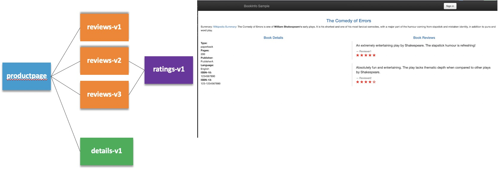

=== Arcadia

Arcadia App 是由四个微服务构成，之间的调运关系如下图：

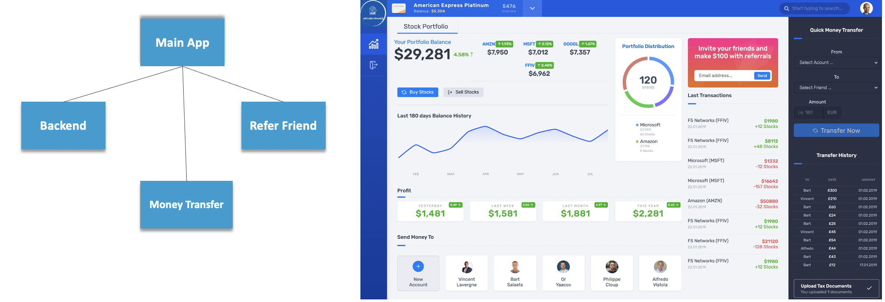

== 现代应用运行平台

=== Kubernetes 上运行现代应用

* 下载 - link:files/arcadia.yaml[arcadia.yaml]
* 下载 - link:files/bookinfo.yaml[bookinfo.yaml]

[source, bash]
.*1. 部署到 Kubernetes*
----
kubectl apply -f arcadia.yaml
kubectl apply -f bookinfo.yaml
----

[source, bash]
.*2. 查看运行的容器*
----
$ kubectl get pods -n arcadia --no-headers
app2-699b4d8d74-74g44      1/1   Running   0     4h44m
app3-7ff6695c8d-8rd8z      1/1   Running   0     4h44m
backend-74dbfd66d6-k74tk   1/1   Running   0     4h44m
main-5cd8c9f449-65hqc      1/1   Running   0     4h44m

$ kubectl get pods -n bookinfo
NAME                              READY   STATUS    RESTARTS   AGE
details-v1-5d5f85bdc8-vdtv5       1/1     Running   0          35m
productpage-v1-8565db68b4-kw6xq   1/1     Running   0          31m
ratings-v1-5f9f56578-trw5s        1/1     Running   0          35m
reviews-v1-7667d8d7d8-kp6br       1/1     Running   0          35m
reviews-v2-dfbfbfb4d-cnzxq        1/1     Running   0          35m
reviews-v3-86cb5cd9dd-zn28t       1/1     Running   0          35m
----

[source, bash]
.*3. 查看 Service*
----
$ kubectl get svc -n arcadia --no-headers
app2      ClusterIP   10.103.195.163   <none>   80/TCP   4h46m
app3      ClusterIP   10.98.146.51     <none>   80/TCP   4h46m
backend   ClusterIP   10.111.163.247   <none>   80/TCP   4h46m
main      ClusterIP   10.107.33.16     <none>   80/TCP   4h46m

$ kubectl get svc -n bookinfo --no-headers
details       ClusterIP   10.107.214.230   <none>   9080/TCP   38m
productpage   ClusterIP   10.98.5.109      <none>   9080/TCP   35m
ratings       ClusterIP   10.105.48.82     <none>   9080/TCP   38m
reviews       ClusterIP   10.96.162.226    <none>   9080/TCP   38m
----

=== 容器业务发布

本部分采用 F5 CIS + Nginx Plus Ingress Controller 的方式，通过 Ingress 的方式将 Arcadia App 发布出去。

*1. F5 CIS + Nginx Plus 部署*

参考 https://cloudadc.github.io/container-ingress/content/nginx-plus-ingress/bigip/#_architectures[连接] 完成部署。

Nginx Plus IC 采用双节点监控集群的方式部署，在 F5 上查看入口视图。

*2. 查看 F5 上发布 Nginx Plus IC 视图*

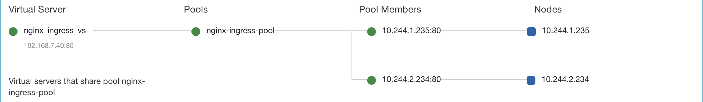

根据上图，Nginx Plus IC 共有两个节点（`10.244.1.235:80`，`10.244.2.234:80`），F5 上入口地址为：`192.168.7.40:80`。

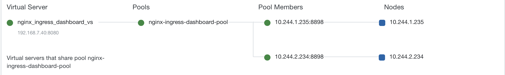

根据上图，Nginx Plus IC 可视化界面在 F5 上入口地址为：`192.168.7.40:8080`。

*3. 容器业务发布*

* 下载 - link:files/arcadia-ingress.yaml[arcadia-ingress.yaml]
* 下载 - link:files/bookinfo-ingress.yaml[bookinfo-ingress.yaml]

执行如下命令发布容器业务

[source, bash]
----
kubectl apply -f arcadia-ingress.yaml
kubectl apply -f bookinfo-ingress.yaml
----
*4. 访问验证*

通过 Nginx Plus Dashboard 查看发布的业务

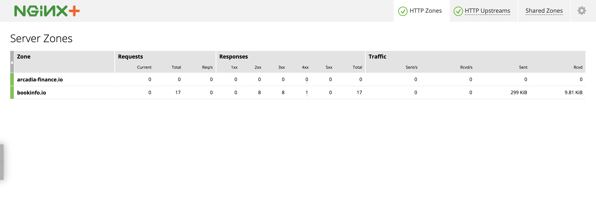

=== 内网 DNS 配置

随着新形态应用、云化应用、容器化应用的发展，内网 DNS 发挥着越来越重要的作用，PaaS 容器内部、DevOps 工具链都需要依赖内部 DNS。本部分在 F5 DNS 上面配置静态域名。

*1. 创建 Listener*

登录 F5 DNS 控制台，选择 `DNS  ››  Delivery : Listeners : Listener List`，点击 *Create* 按钮开始创建 DNS Listener：

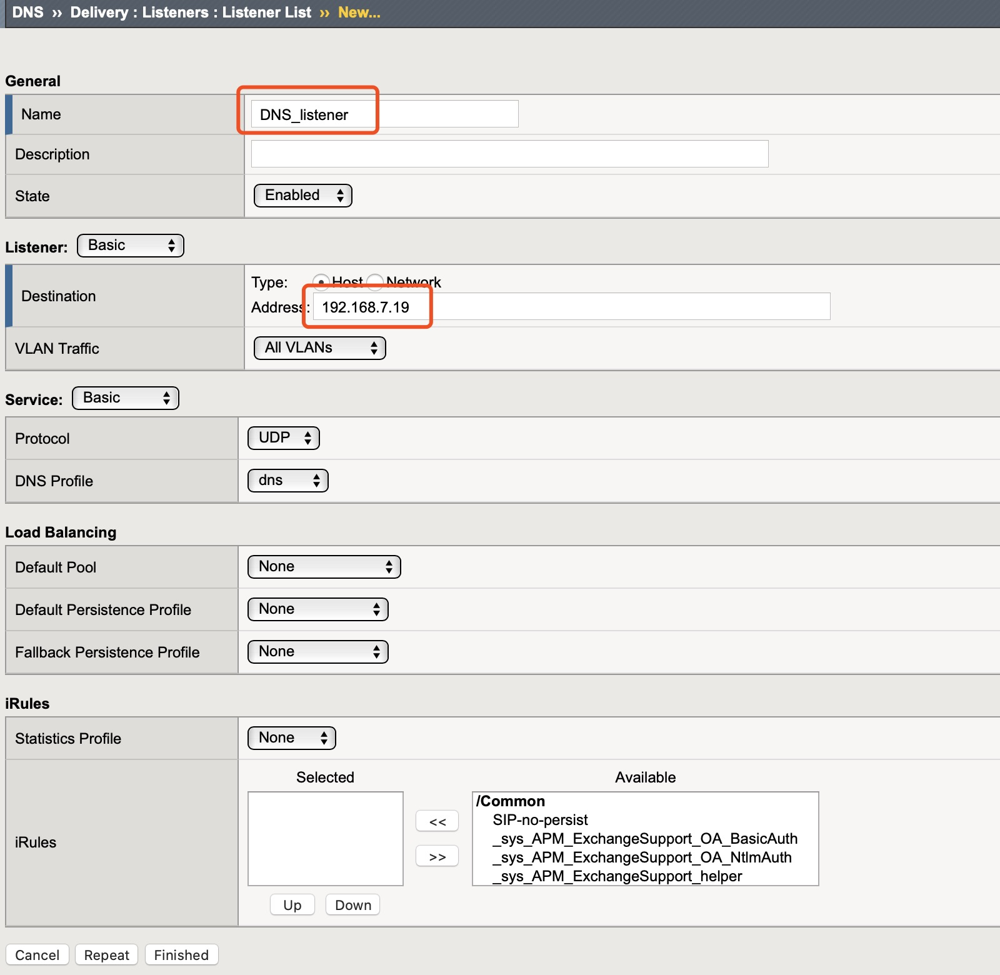

点击 *Finished* 按钮完成 Listener 创建。

*2. 创建 Data Center*

选择 `DNS  ››  GSLB : Data Centers : Data Center List`，，点击 *Create* 按钮开始创建 Data Center，在弹出界面输入：

* Name - DC_Beijing

点击 *Finished* 按钮完成创建。

*3. 创建 Server*

选择 `DNS  ››  GSLB : Servers : Server List`，点击 *Create* 按钮开始创建 Server，在弹出界面输入：

* Name - DNS_Service
* Product - BIG-IP System
* Data Center - DC_Beijing
* Devices - 添加 DNS 设备 selfip
* Health Monitors - bigip

image:img/dns-add-server-bigip.png[]

点击 *Finished* 按钮完成创建。

再次点击 *Create* 按钮开始创建 Server，在弹出界面输入：

* Name - Ingress_Controller
* Product - Generic Host
* Address List - 192.168.7.40
* Data Center - DC_Beijing
* Health Monitors - gateway_icmp
* Virtual Server List - `Ingress Controller` 为 Name，`192.168.7.40` 为 Address，`80` 为服务端口

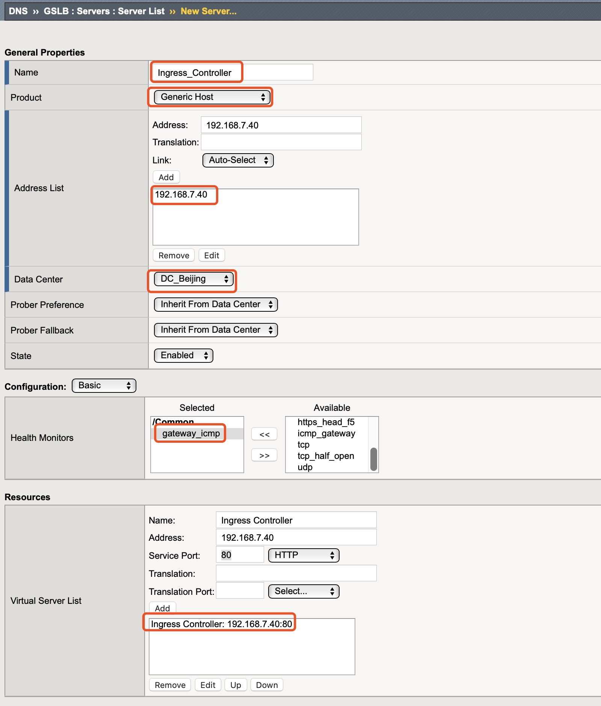

点击 *Finished* 按钮完成创建。

*4. 创建 Pool*

选择 `DNS  ››  GSLB : Pools : Pool List`，点击 *Create* 按钮开始创建，在弹出界面输入：

* Name - Ingress_controller_pool
* Type - A
* Member List - Ingress Controller (/Common/Ingress_Controller) - 192.168.7.40:80

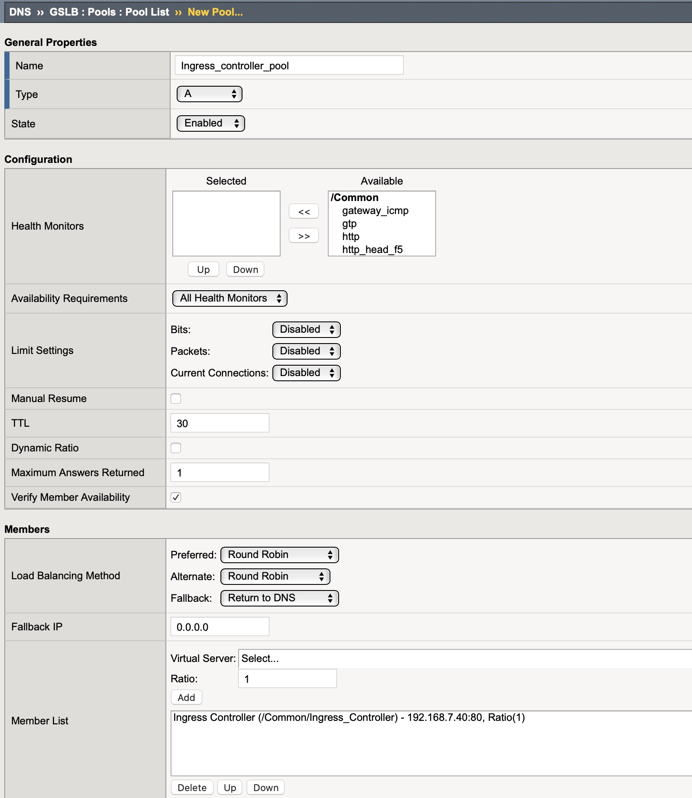

点击 *Finished* 按钮完成创建。

*5. 创建 WideIP*

选择 `DNS  ››  GSLB : Wide IPs : Wide IP List`，点击 *Create* 按钮开始创建，在弹出界面输入：

* Name - bookinfo.io
* Type - A
* Pool List - Ingress_controller_pool(A)

点击 *Repeat* 按钮，输入

* Name - arcadia-finance.io
* Type - A
* Pool List - Ingress_controller_pool(A)

点击 *Finished* 按钮完成创建，WideIp 列表如下：

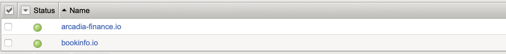

[source, bash]
.*6. DNS 解析测试*
----
$ dig bookinfo.io @192.168.7.19 +short
192.168.7.40

$ dig arcadia-finance.io @192.168.7.19 +short
192.168.7.40
----

=== 业务访问

* http://arcadia-finance.io
* http://bookinfo.io

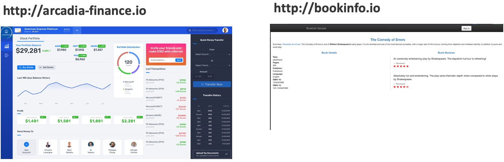

== Per App 安全防护

=== Standalone 模式运行 Nginx App Protect

*1. 安装*

参照链接（https://docs.nginx.com/nginx-app-protect/admin-guide/#centos-7-4-installation）在CentOS 7 上安装 NAP。

相关配置文件：

* 下载 - link:files/nginx.conf[nginx.conf]
* 下载 - link:files/log-default.json[log-default.json]

*2. 测试*

如上安装部分，整体测试架构如下图：

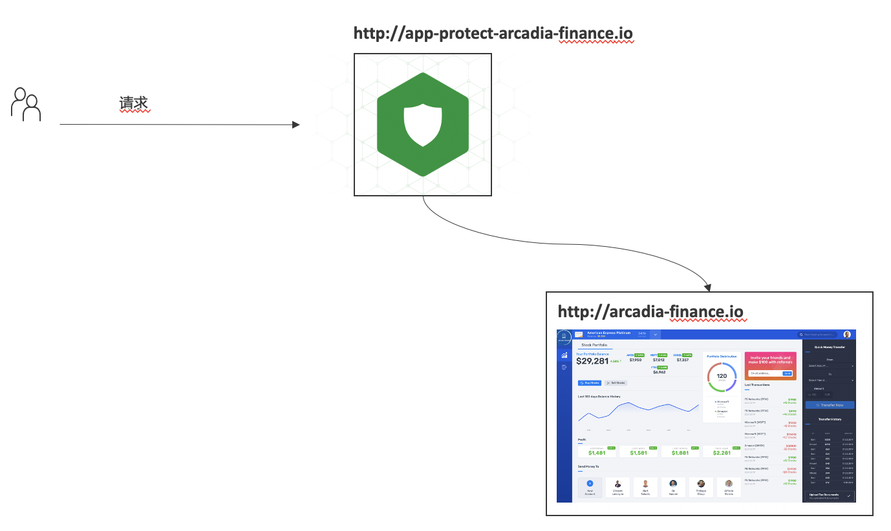

打开浏览器，访问 http://app-protect-arcadia-finance.io/trading/index.php?sql=<script>，会发现请求被拒绝

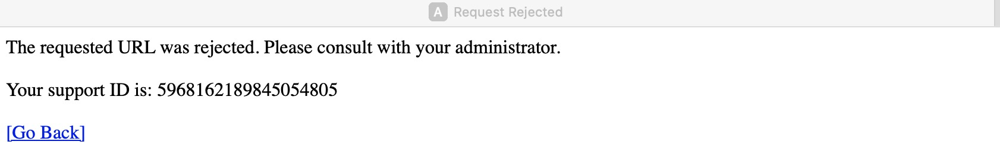

=== Attack Signature & Threat Campaigns 更新

*1. 更新 Attack Signature*

参照 https://docs.nginx.com/nginx-app-protect/admin-guide/#updating-app-protect-attack-signatures 连接更新 Attack Signature。

查看已安装的 Attack Signature：

[source, text]
----
# rpm -qa app-protect-attack-signatures
app-protect-attack-signatures-2020.11.05-1.el7.ngx.x86_64
----

查看所有的 Attack Signature：

[source, text]
----
# yum --showduplicates list app-protect-attack-signatures
Installed Packages
app-protect-attack-signatures.x86_64                                                  2020.11.05-1.el7.ngx                                                  @app-protect-security-updates
Available Packages
app-protect-attack-signatures.x86_64                                                  2019.07.16-1.el7.ngx                                                  app-protect-security-updates 
app-protect-attack-signatures.x86_64                                                  2020.04.30-1.el7.ngx                                                  app-protect-security-updates 
app-protect-attack-signatures.x86_64                                                  2020.05.12-1.el7.ngx                                                  app-protect-security-updates 
app-protect-attack-signatures.x86_64                                                  2020.05.19-1.el7.ngx                                                  app-protect-security-updates 
app-protect-attack-signatures.x86_64                                                  2020.06.09-1.el7.ngx                                                  app-protect-security-updates 
app-protect-attack-signatures.x86_64                                                  2020.06.15-1.el7.ngx                                                  app-protect-security-updates 
app-protect-attack-signatures.x86_64                                                  2020.06.18-1.el7.ngx                                                  app-protect-security-updates 
app-protect-attack-signatures.x86_64                                                  2020.06.22-1.el7.ngx                                                  app-protect-security-updates 
app-protect-attack-signatures.x86_64                                                  2020.06.24-1.el7.ngx                                                  app-protect-security-updates 
app-protect-attack-signatures.x86_64                                                  2020.06.28-1.el7.ngx                                                  app-protect-security-updates 
app-protect-attack-signatures.x86_64                                                  2020.06.30-1.el7.ngx                                                  app-protect-security-updates 
app-protect-attack-signatures.x86_64                                                  2020.07.06-1.el7.ngx                                                  app-protect-security-updates 
app-protect-attack-signatures.x86_64                                                  2020.07.09-1.el7.ngx                                                  app-protect-security-updates 
app-protect-attack-signatures.x86_64                                                  2020.07.15-1.el7.ngx                                                  app-protect-security-updates 
app-protect-attack-signatures.x86_64                                                  2020.07.17-1.el7.ngx                                                  app-protect-security-updates 
app-protect-attack-signatures.x86_64                                                  2020.07.19-1.el7.ngx                                                  app-protect-security-updates 
app-protect-attack-signatures.x86_64                                                  2020.07.24-1.el7.ngx                                                  app-protect-security-updates 
app-protect-attack-signatures.x86_64                                                  2020.07.27-1.el7.ngx                                                  app-protect-security-updates 
app-protect-attack-signatures.x86_64                                                  2020.07.30-1.el7.ngx                                                  app-protect-security-updates 
app-protect-attack-signatures.x86_64                                                  2020.08.05-1.el7.ngx                                                  app-protect-security-updates 
app-protect-attack-signatures.x86_64                                                  2020.08.12-1.el7.ngx                                                  app-protect-security-updates 
app-protect-attack-signatures.x86_64                                                  2020.08.17-1.el7.ngx                                                  app-protect-security-updates 
app-protect-attack-signatures.x86_64                                                  2020.08.19-1.el7.ngx                                                  app-protect-security-updates 
app-protect-attack-signatures.x86_64                                                  2020.08.24-1.el7.ngx                                                  app-protect-security-updates 
app-protect-attack-signatures.x86_64                                                  2020.08.26-1.el7.ngx                                                  app-protect-security-updates 
app-protect-attack-signatures.x86_64                                                  2020.08.27-1.el7.ngx                                                  app-protect-security-updates 
app-protect-attack-signatures.x86_64                                                  2020.08.31-1.el7.ngx                                                  app-protect-security-updates 
app-protect-attack-signatures.x86_64                                                  2020.09.03-1.el7.ngx                                                  app-protect-security-updates 
app-protect-attack-signatures.x86_64                                                  2020.09.07-1.el7.ngx                                                  app-protect-security-updates 
app-protect-attack-signatures.x86_64                                                  2020.09.14-1.el7.ngx                                                  app-protect-security-updates 
app-protect-attack-signatures.x86_64                                                  2020.09.16-1.el7.ngx                                                  app-protect-security-updates 
app-protect-attack-signatures.x86_64                                                  2020.09.17-1.el7.ngx                                                  app-protect-security-updates 
app-protect-attack-signatures.x86_64                                                  2020.09.21-1.el7.ngx                                                  app-protect-security-updates 
app-protect-attack-signatures.x86_64                                                  2020.09.23-1.el7.ngx                                                  app-protect-security-updates 
app-protect-attack-signatures.x86_64                                                  2020.09.30-1.el7.ngx                                                  app-protect-security-updates 
app-protect-attack-signatures.x86_64                                                  2020.10.01-1.el7.ngx                                                  app-protect-security-updates 
app-protect-attack-signatures.x86_64                                                  2020.10.08-1.el7.ngx                                                  app-protect-security-updates 
app-protect-attack-signatures.x86_64                                                  2020.10.22-1.el7.ngx                                                  app-protect-security-updates 
app-protect-attack-signatures.x86_64                                                  2020.10.26-1.el7.ngx                                                  app-protect-security-updates 
app-protect-attack-signatures.x86_64                                                  2020.10.29-1.el7.ngx                                                  app-protect-security-updates 
app-protect-attack-signatures.x86_64                                                  2020.11.02-1.el7.ngx                                                  app-protect-security-updates 
app-protect-attack-signatures.x86_64                                                  2020.11.05-1.el7.ngx                                                  app-protect-security-updates 
app-protect-attack-signatures.x86_64                                                  2020.11.09-1.el7.ngx                                                  app-protect-security-updates 
app-protect-attack-signatures.x86_64                                                  2020.11.12-1.el7.ngx                                                  app-protect-security-updates 
----

安装特定版本的 Attack Signature：

[source, bash]
----
yum install app-protect-attack-signatures-2020.11.12
----

*2. 更新 Threat Campaigns*

参照 https://docs.nginx.com/nginx-app-protect/admin-guide/#updating-app-protect-threat-campaigns 更新 Threat Campaigns。

查看已安装的 Threat Campaigns：

[source, text]
----
# rpm -qa app-protect-threat-campaigns
app-protect-threat-campaigns-2020.10.22-1.el7.ngx.x86_64
----

查看已存在的 Threat Campaigns：

[source, text]
----
# yum --showduplicates list app-protect-threat-campaigns
Installed Packages
app-protect-threat-campaigns.x86_64                                                  2020.10.22-1.el7.ngx                                                   @app-protect-security-updates
Available Packages
app-protect-threat-campaigns.x86_64                                                  2020.06.25-1.el7.ngx                                                   app-protect-security-updates 
app-protect-threat-campaigns.x86_64                                                  2020.07.05-1.el7.ngx                                                   app-protect-security-updates 
app-protect-threat-campaigns.x86_64                                                  2020.07.09-1.el7.ngx                                                   app-protect-security-updates 
app-protect-threat-campaigns.x86_64                                                  2020.07.19-1.el7.ngx                                                   app-protect-security-updates 
app-protect-threat-campaigns.x86_64                                                  2020.07.21-1.el7.ngx                                                   app-protect-security-updates 
app-protect-threat-campaigns.x86_64                                                  2020.07.23-1.el7.ngx                                                   app-protect-security-updates 
app-protect-threat-campaigns.x86_64                                                  2020.07.27-1.el7.ngx                                                   app-protect-security-updates 
app-protect-threat-campaigns.x86_64                                                  2020.07.28-1.el7.ngx                                                   app-protect-security-updates 
app-protect-threat-campaigns.x86_64                                                  2020.07.29-1.el7.ngx                                                   app-protect-security-updates 
app-protect-threat-campaigns.x86_64                                                  2020.08.02-1.el7.ngx                                                   app-protect-security-updates 
app-protect-threat-campaigns.x86_64                                                  2020.08.05-1.el7.ngx                                                   app-protect-security-updates 
app-protect-threat-campaigns.x86_64                                                  2020.08.20-1.el7.ngx                                                   app-protect-security-updates 
app-protect-threat-campaigns.x86_64                                                  2020.08.24-1.el7.ngx                                                   app-protect-security-updates 
app-protect-threat-campaigns.x86_64                                                  2020.09.01-1.el7.ngx                                                   app-protect-security-updates 
app-protect-threat-campaigns.x86_64                                                  2020.09.10-1.el7.ngx                                                   app-protect-security-updates 
app-protect-threat-campaigns.x86_64                                                  2020.09.15-1.el7.ngx                                                   app-protect-security-updates 
app-protect-threat-campaigns.x86_64                                                  2020.09.16-1.el7.ngx                                                   app-protect-security-updates 
app-protect-threat-campaigns.x86_64                                                  2020.09.24-1.el7.ngx                                                   app-protect-security-updates 
app-protect-threat-campaigns.x86_64                                                  2020.10.11-1.el7.ngx                                                   app-protect-security-updates 
app-protect-threat-campaigns.x86_64                                                  2020.10.22-1.el7.ngx                                                   app-protect-security-updates 
app-protect-threat-campaigns.x86_64                                                  2020.11.11-1.el7.ngx                                                   app-protect-security-updates
----

安装特定版本的 Threat Campaigns：

[source, text]
----
yum install app-protect-threat-campaigns-2020.11.11
----

=== 不同的 location 分配不同的 Policy

*1. Policy 配置*

* 下载 - link:files/policy-per-location/policy_base.json[policy_base.json]
* 下载 - link:files/policy-per-location/policy_evasions_enabled.json[policy_evasions_enabled.json]
* 下载 - link:files/policy-per-location/nginx.conf[nginx.conf]

重新加载 NAP

[source, bash]
----
nginx -s reload
----

*2. 访问测试*

* http://app-protect-arcadia-finance.io
* http://app-protect-arcadia-finance.io/files
* http://app-protect-arcadia-finance.io/api
* http://app-protect-arcadia-finance.io/app3

=== OWASP Top 10 Policy 防护

*1. Policy 配置*

* 下载 - link:files/owasp_top10/nginx.conf[nginx.conf]
* 下载 - link:files/owasp_top10/policy_owasp_top10.json[policy_owasp_top10.json]

*2. 访问测试*

* SQL 注入

[source, bash]
----
id=<script>
id=1 and if(substr(database(),1,1)='a',sleep(5),1) 
id=1 and if(substr((select column_name from information_schema.columns where table_schema='test' and table_name='users' limit 0,1),1,1)='a',sleep(5),1) 
----

=== TD

[source, bash]
.**
----

----

[source, bash]
.**
----

----

[source, bash]
.**
----

----

[source, bash]
.**
----

----

[source, bash]
.**
----

----

[source, bash]
.**
----

----

[source, bash]
.**
----

----

