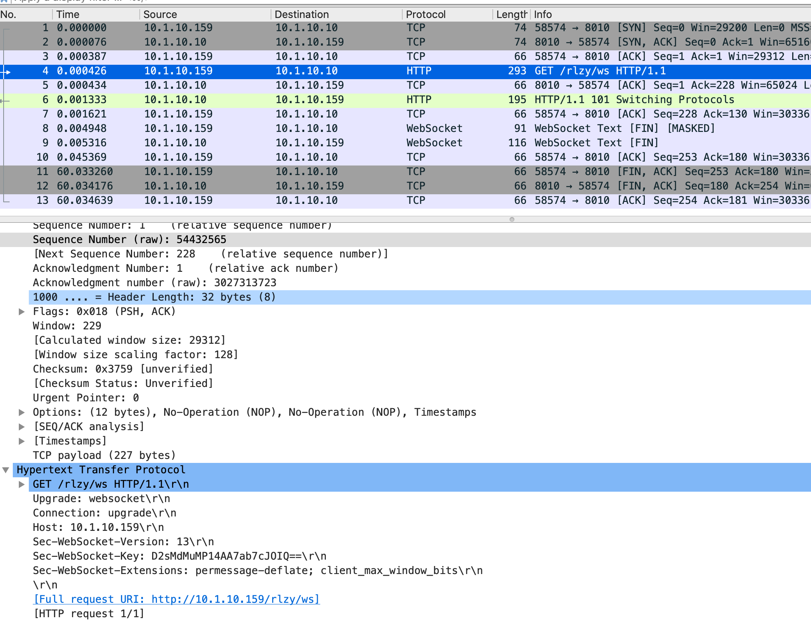

= NGINX 入门到精通
:toc: manual

== 概念

=== 什么是 NGINX

*Igor Sysoev* 于 2004 年开源的一个项目，最初该项目主要要解决的是 *C10K问题*（超过 10,000 个并发连接处理的问题）；后来 NGINX 公司成立，持续开发并创立了一个商业版本 *NGINX Plus*。

Nginx 主要有三种使用场景：

1. *高性能 web 服务器* - 目前超过 50% 的 TOP 1000 网站使用 Nginx。
2. *反向代理* - SSL/TLS Termination，Content caching and compression
3。*负载均衡*

=== NGINX vs. Apache

|===
|NGINX |Apache

|NGINX configuration language — directive based
|Apache configuration language — directive based

|One processing method
|Multiple processing methods

|Supports dynamic, third-party modules
|Supports dynamic, third-party modules

|Similar performance for dynamic content
|Similar performance for dynamic content

|Faster for serving static files
|Slower for serving static files

|No concept equivalent to .htaccess files
|Concept of .htaccess files for directory localized configuration
|===

=== NGINX vs. NGINX Plus

https://www.nginx.com/products/nginx/

== 安装

=== 二进制安装

本部分在 CentOS 7 上二进制安装。

[source, bash]
.*1. 创建 `/etc/yum.repos.d/nginx.repo` 内容如下*
----
[nginx]
name=nginx repo
baseurl=http://nginx.org/packages/mainline/centos/7/$basearch/
gpgcheck=0
enabled=1
----

NOTE: 如果选择安装 `stable` 则修改 baseurl 为 http://nginx.org/packages/stable/centos/7/$basearch/

[source, bash]
.*2. 安装*
----
yum update -y
yum install -y nginx
----

[source, bash]
.*3. 开机启动*
----
systemctl start nginx && systemctl enable nginx && systemctl status nginx
----

*4. 访问测试*

image:img/nginx-welcom.png[]

=== 编译安装

[source, bash]
.*1. 下载源代码*
----
wget https://nginx.org/download/nginx-1.20.0.tar.gz
tar -xvf nginx-1.20.0.tar.gz && cd nginx-1.20.0
----

[source, bash]
.*2. 安装编译所需依赖包*
----
yum groupinstall 'Development Tools'
yum install zlib-devel -y
yum install pcre-devel -y
----

[source, text]
.*3. 编译*
----
# ./configure --help

# ./configure --prefix=/root/nginx
...
  nginx path prefix: "/root/nginx"
  nginx binary file: "/root/nginx/sbin/nginx"
  nginx modules path: "/root/nginx/modules"
  nginx configuration prefix: "/root/nginx/conf"
  nginx configuration file: "/root/nginx/conf/nginx.conf"
  nginx pid file: "/root/nginx/logs/nginx.pid"
  nginx error log file: "/root/nginx/logs/error.log"
  nginx http access log file: "/root/nginx/logs/access.log"
  nginx http client request body temporary files: "client_body_temp"
  nginx http proxy temporary files: "proxy_temp"
  nginx http fastcgi temporary files: "fastcgi_temp"
  nginx http uwsgi temporary files: "uwsgi_temp"
  nginx http scgi temporary files: "scgi_temp"

# make

# make install
----

[source, bash]
.*4. 编辑 ~/nginx/conf/nginx.conf, 修改监听端口为 8001*
----
    server {
        listen       8001;
        server_name  localhost;
----

[source, bash]
.*5. 启动*
----
cd ~/nginx
./sbin/nginx 
----

[source, bash]
.*6. 访问测试*
----
curl localhost:8001
----

== 基本配置

== 安全能力

== Rewrites

* https://nginx.org/en/docs/http/ngx_http_rewrite_module.html

[source, bash]
.**
----

----

[source, bash]
.**
----

----

[source, bash]
.**
----

----

[source, bash]
.**
----

----

[source, bash]
.**
----

----

[source, bash]
.**
----

----

[source, bash]
.**
----

----

[source, bash]
.**
----

----

[source, bash]
.**
----

----

[source, bash]
.**
----

----

== 基本使用场景

=== 配置一个静态资源 Web 服务器

[source, bash]
.*/etc/nginx/conf.d/book.conf*
----
server {
    listen       8080;
    server_name  book.example.com;

    #charset koi8-r;
    access_log  /var/log/nginx/book.access.log  main;

    location / {
        root   /usr/share/nginx/book;
        autoindex on;
        #set $limit_rate 10k;
        index  index.html;
    }

    error_page  404              /404.html;

    # redirect server error pages to the static page /50x.html
    #
    error_page   500 502 503 504  /50x.html;
    location = /50x.html {
        root   /usr/share/nginx/html;
    }

}
----

=== 配置一个具有缓存功能的反向代理

[source, bash]
.*1. 查看上游服务*
----
curl http://192.168.100.71:8080/v3/api-docs
curl http://192.168.100.71:8080/api/fruits/2
----

[source, bash]
.*2. /etc/nginx/conf.d/fruits.conf*
----
upstream local {
    server 192.168.100.71:8080;
}

proxy_cache_path /var/cache/nginx/cache keys_zone=my_cache:10m;

server {
    listen       80;
    server_name  fruits.example.com;

    access_log  /var/log/nginx/fruits.access.log  main;

    location / {
        proxy_set_header Host            $proxy_host;
        proxy_set_header X-Real-IP       $remote_addr;
        proxy_set_header X-Forwarded-For $proxy_add_x_forwarded_for;

        proxy_cache my_cache;
        proxy_cache_key $host$uri$is_args$args;
        proxy_cache_valid 200 302 10m;

        proxy_pass http://local;
    }

}
----

[source, bash]
.*3. 訪問測試*
----
curl http://192.168.100.11/api/fruits/2

// make sure the cache is working, force shutdown the upstream server, execute curl again
curl http://192.168.100.11/api/fruits/2
----

=== 配置 realip 模块

[source, bash]
.*1. /etc/nginx/conf.d/realip.conf*
----
server {
    listen       80;
    server_name  realip.example.com;

    access_log  /var/log/nginx/realip.access.log  main;
    error_log   /var/log/nginx/realip.error.log  debug;

    set_real_ip_from 192.168.100.1;
    real_ip_recursive on;
    real_ip_header X-Forwarded-For;

    location / {
        return 200 "Client real ip: $remote_addr\n";
    }

}
----

[source, bash]
.*2. 测试*
----
$ curl -H 'X-Forwarded-For: 1.1.1.1,192.168.100.1' http://192.168.100.11
Client real ip: 1.1.1.1
----

=== 配置一个 HTTP Basic Authentication 的 Web 服务器

[source, bash]
.*1. 生成密码文件*
----
// install
yum install httpd-tools -y

// generate password file
htpasswd -cb http-basic-auth.pass  admin admin
htpasswd -b http-basic-auth.pass user user
----

[source, bash]
.*2. /etc/nginx/conf.d/basicauth.conf*
----
server {
    listen       80;
    server_name  auth.example.com;

    access_log  /var/log/nginx/auth.access.log  main;

    location / {
        satisfy    any;
        auth_basic           "BASIC AUTH";
        auth_basic_user_file http-basic-auth.pass;
        deny all;
    }

    location /test {
        return 200 "YES\n";
    }

}
----

[source, bash]
.*3. 访问测试*
----
$ curl -u "admin:admin" http://192.168.100.11/test
YES
----

== Webdocket 代理

本部分内参参照 https://www.nginx.com/blog/websocket-nginx/ 和 https://www.nginx.com/blog/nginx-websockets-performance/ 中内容。

本部分部署拓扑示意如下：

|===
|Server |IP |功能
|server1
|10.1.10.9
|Websocket Client

|server2
|10.1.10.159
|Nginx Webdocket 代理

|server3
|10.1.10.10
|Websocket Server
|===

=== Websocket Server

[source, bash]
.*1. 安装 node 及 ws 环境*
----
sudo apt-get install nodejs npm
mkdir server && cd server
npm install ws
----

[source, bash]
.*2. 创建 server.js，内容如下*
----
console.log("Server started");
var Msg = '';
var WebSocketServer = require('ws').Server
    , wss = new WebSocketServer({port: 8010});
    wss.on('connection', function(ws) {
        ws.on('message', function(message) {
        console.log('Received from client: %s', message);
        ws.send('Server received from client: ' + message);
    });
 });
----

[source, bash]
.*3. 启动*
----
node server.js 
----

=== Nginx Webdocket 代理配置

[source, bash]
----
http {

    ...

    map $http_upgrade $connection_upgrade {
        default upgrade;
        '' close;
    }

    upstream websocket {
        server 10.1.10.10:8010;
    }

    server {
        listen 8020;
        location / {
            proxy_pass http://websocket;
            proxy_http_version 1.1;
            proxy_set_header Upgrade $http_upgrade;
            proxy_set_header Connection $connection_upgrade;
            proxy_set_header Host $host;
        }
    }

}
----

=== Websocket Client

[source, bash]
.*1. 安装 node 及 ws 环境*
----
sudo apt-get install nodejs npm
mkdir client && cd client
npm install ws
----

[source, bash]
.*2. 创建 client.js，内容如下*
----
const WebSocket = require('ws')
const url = 'ws://10.1.10.159:8020/rlzy/ws'
const connection = new WebSocket(url)

connection.onopen = () => {
  connection.send('Message From Client')
}

connection.onerror = (error) => {
  console.log(`WebSocket error: ${error}`)
}

connection.onmessage = (e) => {
  console.log(e.data)
}

----

[source, bash]
.*3. 启动 Client 通过代理和Server端通信*
----
node client.js 
----

=== Websocket Server 端抓包查看底层通信

[source, bash]
.**
----

----

