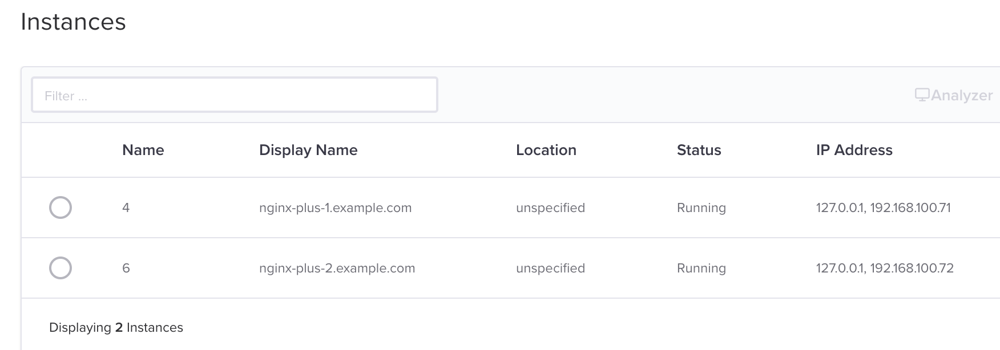
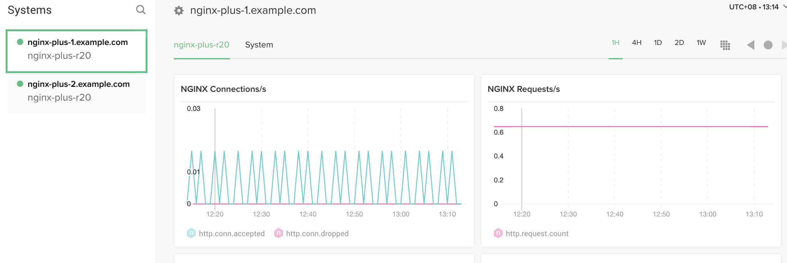
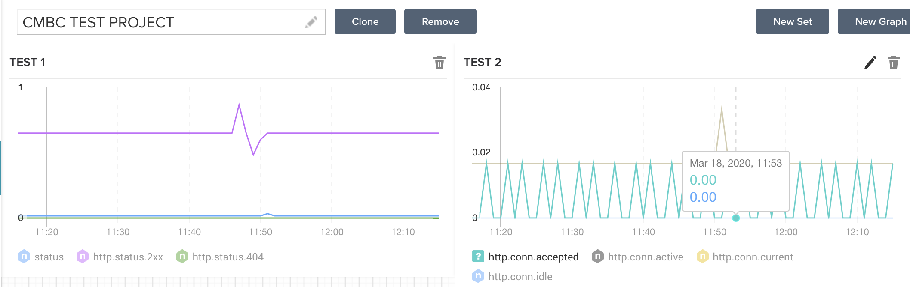
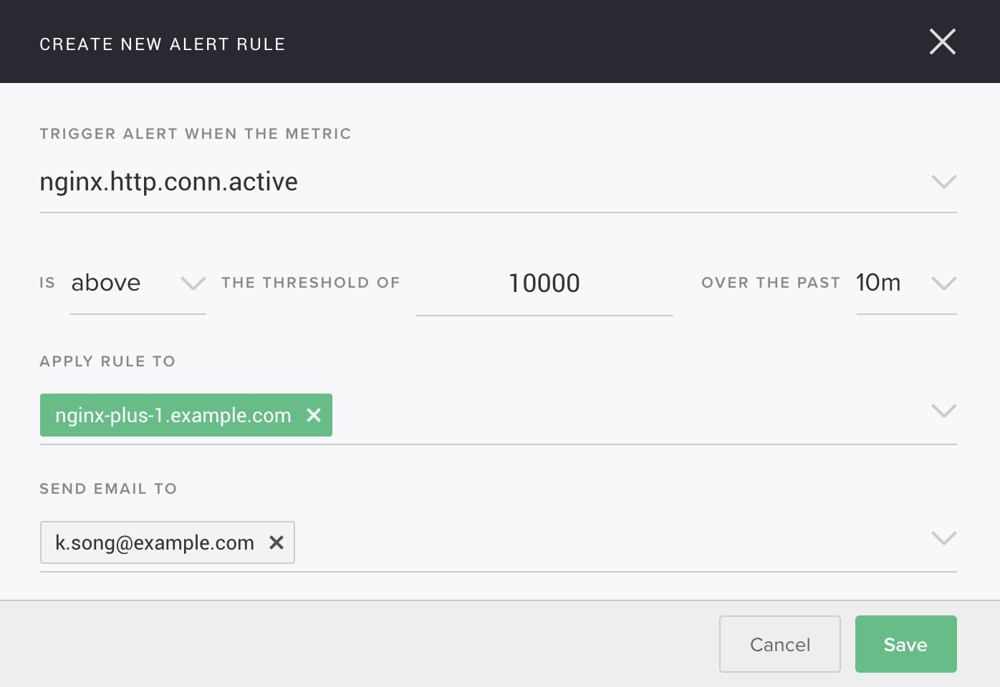
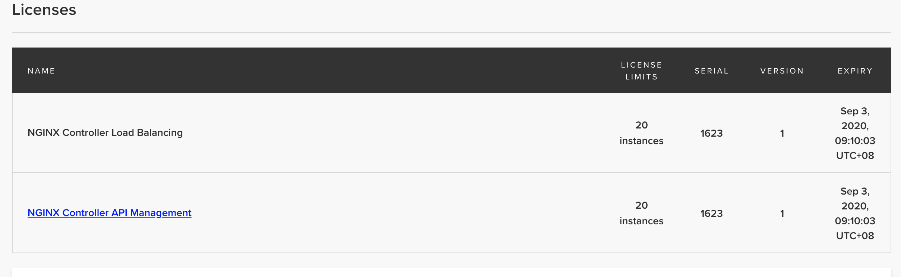
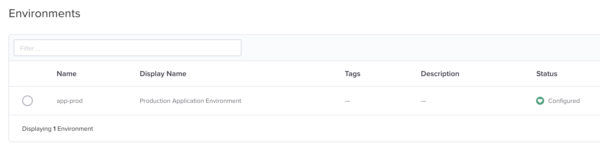
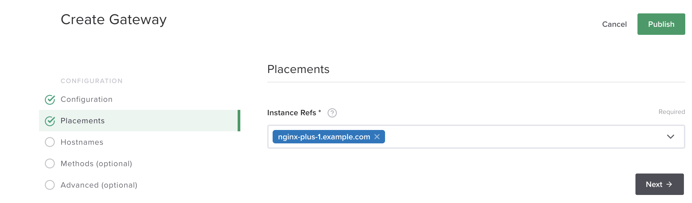
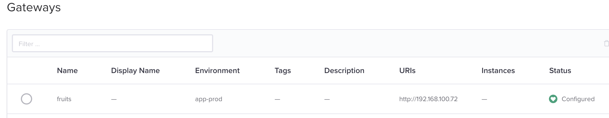
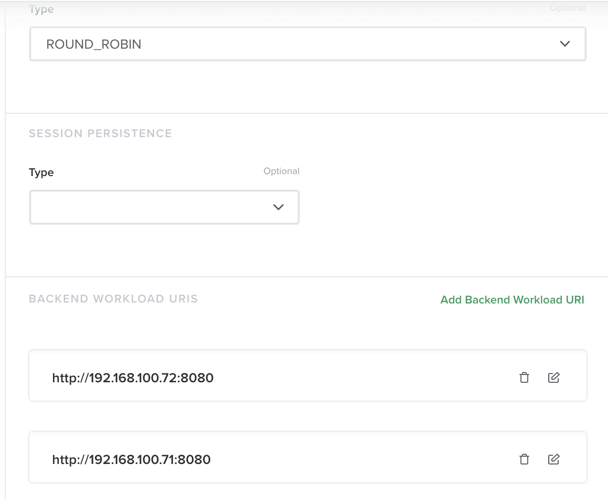

= Nginx Controller
:toc: manual

== Controller Agent

=== 安装

* 选择 `Infrastructure` -> `Instances` -> `Overview`，点击 `Create Instance` 按钮
* 在弹出的 `ADD INSTANCE BY INSTALLING AGENT` 界面根据步骤说明配置 Controller Agent 

[source, bash]
----
wget --no-check-certificate https://nginx-controller.example.com:8443/1.4/install/controller/ -O install.sh
API_KEY='746994a889d9cd83aeeef8fb1a22535d' sh ./install.sh
----

* 等待几分钟后 Nginx Controller 会显示 Nginx plus 信息

=== 配置 Metrics 收集

* 在 Nginx Plus 节点上编辑 `/etc/nginx/conf.d/default.conf`，开启 NGINX Plus API 访问

[source, bash]
----
# enable /api/ location with appropriate access control in order
# to make use of NGINX Plus API

location /api/ {
    api write=on;
    allow 127.0.0.1;
    deny all;
}
----

== Analytics

=== Metrics 展示

* 在 Nginx Controller 上选择 `Platform` -> `Agent`，在 `Default Agent Settings` 界面配置 Metrics 收集方式

=== 自定制 Dashboard

* 选择 `Analytics` -> `Dashboards` -> `Create Dashboard`
* 设定 Dashboard 名称为 `CMBC TEST PROJECT`
* 在新创建的 Dashboard 右上方点击 `New Graph` 按钮，在 `EDIT GRAPH` 页面编辑：
** 名称            - `TEST`
** ADD METRIC      - 选择对应的参数，例如 `nginx.http.conn.active`
** GET METRIC FROM - 选择对应节点
* 点击 `Save` 按钮保存。

=== 自定制 Alert

* 选择 `Analytics` -> `Alerts` -> `New Alert`
* 在弹出的 `CREATE NEW ALERT RULE` 界面，选择：
** *TRIGGER ALERT WHEN THE METRIC* - 选择对应的参数，例如 `nginx.http.conn.active`
** *Is* - 在下拉菜单中选择 `above`, `below`, `equal to`
** *THE THRESHOLD OF* - 填写具体数据，例如 10000
** *OVER THE PAST* - 填写具体的时间，可以是几分钟到一天
** *APPLY RULE TO* - 选择对应的 instance 节点
** *SEND EMAIL TO* - 选择对应接收警告的邮件地址

== Platform

=== License

选择 `Platform` -> `Licenses`，在 license 激活界面选择 controller_license.txt，即可激活，激活后界面如下:

=== 用户和角色

Nginx Controller 安装过程会将管理员的邮箱作为一个超级管理员用户，例如 `k.song@example.com`。

Nginx Controller 默认有三种角色：`admin`，`user`，`guest`。可以自定义角色，自定制角色需要创建 Environment，通过自定制角色对 environment 进行更细粒度的控制。如下步骤为自定义一个 retail 项目的 dev 角色：

* 选择 `Platform` -> `Roles` -> `Create Role`
* 在弹出的 `Create Role` 页面填写
** *Name* - `retail-dev`
** *Display Name* - `Retail Developer Access`

== Services

=== 创建 Environment

* 选择 `Services` -> `Environments` -> `Create Environment`
* 在 Edit Environment 页面输入：
** *Name* - app-prod
** *Display Name* - Production Application Environment

=== 创建 Gateway

* 选择 `Services` -> `Gateways` -> `Create Gateway`
* 在 Configuration 页面配置
** *Name* - fruits
** *Environment* - 选择 Environment，例如 app-prod
* 点击 `Next`，在 Placements 界面 Instance Refs 部分选择 nginx plus 实例

* 点击 `Next`，在 Hostnames 界面输入 hostname `http://192.168.100.71`
* 点击 `Next`
* 点击 `Next` 到 API Spec 界面，点击右上角 `Publish` 按钮发布 Gateway
* Gateway 的发布过程状态会从 `configuring` 变为 `configured`

=== 创建 App

* 选择 `Services` -> `Apps` -> `Create App`
* 在 Create App 页面输入
** *Name* - fruits-service
** *Environment* - 选择 Environment，例如 app-prod
* 点击 Submit 按钮
* 在 App 列表中选择 `fruits-service` -> `View`

image:img/nginx-controller-app-view.png[]

* 点击右上角 `Create Component` 按钮
* 在 Create App Component 页面配置
** *Name* - fruits-service
** *Display Name* - Fruit  App Service
* 点击 `Next`，在 Gateway Refs 界面选择一个 Gateway
* 点击 `Next`，在 URIs 部分添加一个 URI `/`
* 点击 `Next`
* 点击 `Next`
* 点击 `Next` 到 Workload Groups 界面，配置
** *Workload Group Name* - fruit-service-group
** *LOAD BALANCING METHOD* - 选择默认 ROUND_ROBIN
* 点击 `Add Backend Workload URI`，配置 URI 为 http://192.168.100.71:8080
* 重复上面步骤，添加另外一个 URI 为 http://192.168.100.72:8080

* 点击 `Next`，直到 API Spec 界面，点击右上角 Publish 按钮

