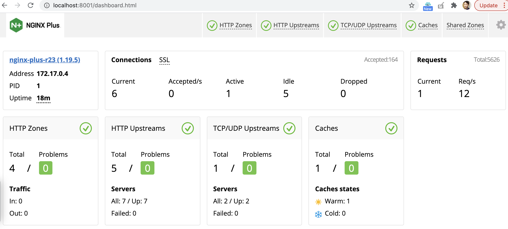

= Use Case via Docker
:toc: manual

== 环境准备

*1. 下载镜像及配置文件*

* 链接: https://pan.baidu.com/s/1hw0h1KUlhSirFBId6kh8mw 
* 提取码: 1wng

[source, bash]
----
$ ls
backend-0.0.8.tar.gz		env.list			grpc-go-greeting-0.1.tar.gz	nginx-lb.conf			nginx-perf.conf			nginxplus-23-r1.tar.gz
----

[source, bash]
.*2. Load 容器镜像*
----
for i in $(ls *.tar.gz) ; do docker load -i $i ; done
----

== 性能调优

[source, bash]
.*1. 启动 webserver*
----
docker run --rm --name webserver -d nginxplus:23-r1
----

[source, bash]
.*2. 启动 Nginx Plus*
----
docker run -it --rm --name nginx-plus --link webserver -p 8001-8009:8001-8009  -v /Users/ksong/work/nginx/nginx-perf.conf:/etc/nginx/nginx.conf:ro nginxplus:23-r1
----

* Dashboard - http://localhost:8001/dashboard.html 
* Swagger UI - http://localhost:8001/swagger-ui/

*3. 对别测试*

[source, bash]
.*优化前*
----
$ wrk -t4 -c800 -d30s http://localhost:8002/
Running 30s test @ http://localhost:8002/
  4 threads and 800 connections
  Thread Stats   Avg      Stdev     Max   +/- Stdev
    Latency   221.41ms  116.24ms   1.80s    80.95%
    Req/Sec   823.45    149.65     1.30k    68.75%
  98451 requests in 30.08s, 79.80MB read
  Socket errors: connect 0, read 761, write 0, timeout 0
Requests/sec:   3273.02
Transfer/sec:      2.65MB
----

[source, bash]
.*优化后* 
----
$ wrk -t4 -c800 -d30s http://localhost:8003/
Running 30s test @ http://localhost:8003/
  4 threads and 800 connections
  Thread Stats   Avg      Stdev     Max   +/- Stdev
    Latency    75.63ms   45.07ms 884.28ms   82.29%
    Req/Sec     2.47k   615.15     4.21k    75.08%
  294393 requests in 30.09s, 238.63MB read
  Socket errors: connect 0, read 797, write 0, timeout 0
Requests/sec:   9783.57
Transfer/sec:      7.93MB
----

[source, bash]
.*4. Access 日志* 
----
for i in {1..10} ; do curl http://localhost:8004 ; done
----

== 负载均衡

[source, bash]
.*1. 启动微服务*
----
docker run -it --rm --name springboot-1 -d cloudadc/backend:0.0.8
docker run -it --rm --name springboot-2 -d cloudadc/backend:0.0.8

docker run -it --rm --name echoserver-1  -d cloudadc/echoserver:1.1
docker run -it --rm --name echoserver-2  -d cloudadc/echoserver:1.1

docker run -it --rm --name grpc-server-1 -e PORT=8009 -d cloudadc/grpc-go-greeting:0.1 greeter_server
docker run -it --rm --name grpc-server-2 -e PORT=8009 -d cloudadc/grpc-go-greeting:0.1 greeter_server
----

[source, bash]
.*2. 启动 Nginx Plus*
----
docker run -it --rm --name nginx-plus --link webserver --link springboot-1 --link springboot-2 --link echoserver-1 --link echoserver-2 --link grpc-server-1 --link grpc-server-2 -p 8001-8005:8001-8005 -p 8877:8877  -p 8009:8009 -v /Users/ksong/work/nginx/nginx-lb.conf:/etc/nginx/nginx.conf:ro nginxplus:23-r1
----

[source, bash]
.*3. 测试*
----
http://localhost:8005

./echoclient localhost

docker run --env-file ./env.list cloudadc/grpc-go-greeting:0.1 greeter_client
----

== 结果截图

