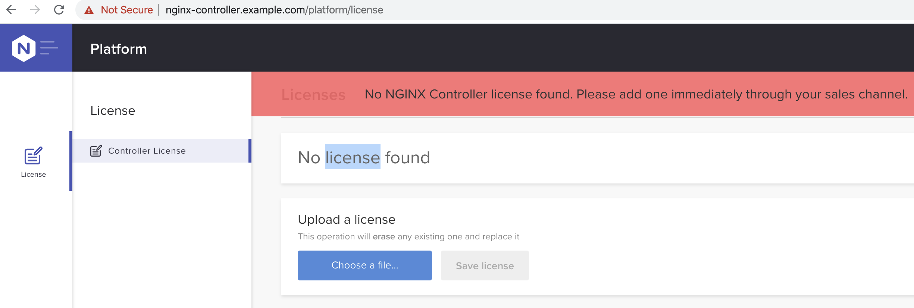

= 安装
:toc: manual

本部说明如何在离线环境下如何安装 Nginx Plus 及 Nginx Controller

== 安装介质准备

安装介质需要提前准备，介质的下载需要在可连接互联网的环境上进行，具体安装介质包括：

|===
|编号 |名称 |类型 |说明

|1
|Docker
|rpm
|Docker Community Edition (CE) 18.09

|2
|Kubernets RPM
|rpm
|安装 Kubernets 所需 RPM 包（kubeadm、kubelet、kubectl）

|3
|Kubernets Docker Image
|tar
|安装 Kubernets 所需要的 docker 镜像

|4
|Nginx controller
|tar
|*需要 License*，可到link:https://www.nginx.com/free-trial-request-nginx-controller[链接]申请试用

|5
|Nginx+
|rpm
|*需要 License*，可到link:https://www.nginx.com/free-trial-request[链接]申请试用

|6
|PostgreSQL
|rpm
|安装 Nginx controller 所需的数据库

|7
|Other
|rpm
|离线环境中包拷贝，源初始化所需

|===

[source, txt]
.*创建如下三个目录，分别保存 rpm, docker image, other*
----
mkdir {rpm,tar,db,other}
mkdir rpm/{docker,kubernets}
mkdir other/{wget,vim,tree,jq,postgre}
----

=== Docker

本部分下载 Docker Community Edition (CE) 18.09 到本地。

[source, txt]
.*1. yum 源配置*
----
yum-config-manager --add-repo https://download.docker.com/linux/centos/docker-ce.repo
----

[source, txt]
.*2. 下载 rpm 包到本地*
----
yum install --downloadonly --downloaddir=rpm/docker/ docker-ce-18.09.9-3.el7
----

=== Kubernets RPM

[source, txt]
.*1. 配置 yum 源*
----
cat <<EOF > /etc/yum.repos.d/kubernetes.repo
[kubernetes]
name=Kubernetes
baseurl=https://packages.cloud.google.com/yum/repos/kubernetes-el7-x86_64
enabled=1
gpgcheck=1
repo_gpgcheck=1
gpgkey=https://packages.cloud.google.com/yum/doc/yum-key.gpg https://packages.cloud.google.com/yum/doc/rpm-package-key.gpg
EOF
----

[source, txt]
.*2. 下载 rpm 包到本地*
----
KUBE_VERSION=1.15.5
for i in kubeadm-${KUBE_VERSION}-0.x86_64 kubelet-${KUBE_VERSION}-0.x86_64 kubectl-${KUBE_VERSION}-0.x86_64 ; do yum install --downloadonly --downloaddir=rpm/kubernets $i ; done
----

=== Kubernets Docker Image

[source, txt]
----
images=(
    k8s.gcr.io/kube-proxy:v1.15.5
    k8s.gcr.io/kube-apiserver:v1.15.5
    k8s.gcr.io/kube-controller-manager:v1.15.5
    k8s.gcr.io/kube-scheduler:v1.15.5
    k8s.gcr.io/coredns:1.3.1
    k8s.gcr.io/etcd:3.3.10
    k8s.gcr.io/pause:3.1
    quay.io/coreos/flannel:v0.11.0-amd64
)
for i in "${images[@]}"; do
    docker pull "$i"
done
docker save "${images[@]}" | gzip > k8s-images.tar.gz
----

=== Nginx controller

在 https://www.nginx.com/free-trial-request-nginx-controller/ 连接里可申请 Free Trial 镜像和许可文件。申请完成后可获得如下文件：

* controller-installer-3.1.0.tar.gz
* controller_license.txt

=== Nginx+

本部分需要在连网环境下进行，需要 NGINX Plus 的 License 证书, rpm 包同步完成后拷贝到离线环境。

[source, txt]
.*1. 创建 /etc/ssl/nginx 目录，拷贝证书*
----
# mkdir /etc/ssl/nginx

// copy license cert key to /etc/ssl/nginx
scp nginx-repo.* root@IP:/etc/ssl/nginx
----

[source, txt]
.*2. 安装 ca-certificates 依赖*
----
yum install ca-certificates -y
----

[source, txt]
.*3. NGINX Plus yum 源配置*
----
wget -P /etc/yum.repos.d https://cs.nginx.com/static/files/nginx-plus-7.4.repo
----

[source, txt]
.*4. 下载 NGINX Plus rpm 包到本地目录*
----
reposync -lmn --repoid=nginx-plus --download_path=/tmp/nginx/

tar -cf nginx-plus.tar nginx-plus/
----

[source, txt]
.*5. 验证下载的 rpm 包*
----
# tar -tf nginx-plus.tar
nginx-plus/
nginx-plus/RPMS/
nginx-plus/RPMS/nginx-ha-keepalived-2.0.19-1.el7.ngx.x86_64.rpm
nginx-plus/RPMS/nginx-ha-keepalived-debuginfo-2.0.19-1.el7.ngx.x86_64.rpm
nginx-plus/RPMS/nginx-nr-agent-2.0.0-12.el7.ngx.noarch.rpm
nginx-plus/RPMS/nginx-plus-20-1.el7.ngx.x86_64.rpm
nginx-plus/RPMS/nginx-plus-debuginfo-20-1.el7.ngx.x86_64.rpm
nginx-plus/RPMS/nginx-plus-module-cookie-flag-20+1.1.0-1.el7.ngx.x86_64.rpm
nginx-plus/RPMS/nginx-plus-module-cookie-flag-debuginfo-20+1.1.0-1.el7.ngx.x86_64.rpm
nginx-plus/RPMS/nginx-plus-module-encrypted-session-20+0.08-1.el7.ngx.x86_64.rpm
nginx-plus/RPMS/nginx-plus-module-encrypted-session-debuginfo-20+0.08-1.el7.ngx.x86_64.rpm
nginx-plus/RPMS/nginx-plus-module-geoip-20-1.el7.ngx.x86_64.rpm
nginx-plus/RPMS/nginx-plus-module-geoip-debuginfo-20-1.el7.ngx.x86_64.rpm
nginx-plus/RPMS/nginx-plus-module-geoip2-20+3.3-1.el7.ngx.x86_64.rpm
nginx-plus/RPMS/nginx-plus-module-geoip2-debuginfo-20+3.3-1.el7.ngx.x86_64.rpm
nginx-plus/RPMS/nginx-plus-module-headers-more-20+0.33-1.el7.ngx.x86_64.rpm
nginx-plus/RPMS/nginx-plus-module-headers-more-debuginfo-20+0.33-1.el7.ngx.x86_64.rpm
nginx-plus/RPMS/nginx-plus-module-image-filter-20-1.el7.ngx.x86_64.rpm
nginx-plus/RPMS/nginx-plus-module-image-filter-debuginfo-20-1.el7.ngx.x86_64.rpm
nginx-plus/RPMS/nginx-plus-module-lua-20+0.10.15-1.el7.ngx.x86_64.rpm
nginx-plus/RPMS/nginx-plus-module-lua-debuginfo-20+0.10.15-1.el7.ngx.x86_64.rpm
nginx-plus/RPMS/nginx-plus-module-modsecurity-20+1.0.0-11.el7.ngx.x86_64.rpm
nginx-plus/RPMS/nginx-plus-module-modsecurity-debuginfo-20+1.0.0-11.el7.ngx.x86_64.rpm
nginx-plus/RPMS/nginx-plus-module-ndk-20+0.3.0-1.el7.ngx.x86_64.rpm
nginx-plus/RPMS/nginx-plus-module-ndk-debuginfo-20+0.3.0-1.el7.ngx.x86_64.rpm
nginx-plus/RPMS/nginx-plus-module-njs-20+0.3.7-1.el7.ngx.x86_64.rpm
nginx-plus/RPMS/nginx-plus-module-njs-debuginfo-20+0.3.7-1.el7.ngx.x86_64.rpm
nginx-plus/RPMS/nginx-plus-module-opentracing-20+0.9.0-1.el7.ngx.x86_64.rpm
nginx-plus/RPMS/nginx-plus-module-opentracing-debuginfo-20+0.9.0-1.el7.ngx.x86_64.rpm
nginx-plus/RPMS/nginx-plus-module-passenger-20+6.0.4-1.el7.ngx.x86_64.rpm
nginx-plus/RPMS/nginx-plus-module-passenger-debuginfo-20+6.0.4-1.el7.ngx.x86_64.rpm
nginx-plus/RPMS/nginx-plus-module-perl-20-1.el7.ngx.x86_64.rpm
nginx-plus/RPMS/nginx-plus-module-perl-debuginfo-20-1.el7.ngx.x86_64.rpm
nginx-plus/RPMS/nginx-plus-module-prometheus-20+1.2.0-1.el7.ngx.noarch.rpm
nginx-plus/RPMS/nginx-plus-module-rtmp-20+1.2.1-1.el7.ngx.x86_64.rpm
nginx-plus/RPMS/nginx-plus-module-rtmp-debuginfo-20+1.2.1-1.el7.ngx.x86_64.rpm
nginx-plus/RPMS/nginx-plus-module-set-misc-20+0.32-1.el7.ngx.x86_64.rpm
nginx-plus/RPMS/nginx-plus-module-set-misc-debuginfo-20+0.32-1.el7.ngx.x86_64.rpm
nginx-plus/RPMS/nginx-plus-module-subs-filter-20+0.6.4-1.el7.ngx.x86_64.rpm
nginx-plus/RPMS/nginx-plus-module-subs-filter-debuginfo-20+0.6.4-1.el7.ngx.x86_64.rpm
nginx-plus/RPMS/nginx-plus-module-xslt-20-1.el7.ngx.x86_64.rpm
nginx-plus/RPMS/nginx-plus-module-xslt-debuginfo-20-1.el7.ngx.x86_64.rpm
nginx-plus/RPMS/nginx-sync-1.1-1.el7.ngx.noarch.rpm
----

=== PostgreSQL

[source, txt]
.*1. 配置 yum 源*
----
yum install https://download.postgresql.org/pub/repos/yum/reporpms/EL-7-x86_64/pgdg-redhat-repo-latest.noarch.rpm -y
----

[source, txt]
.*2. 同步 rpm 包到本地*
----
for i in postgresql95 postgresql95-server ; do yum install --downloadonly --downloaddir=db/ $i ; done
----

=== Other

[source, txt]
.*1. 下载工具 rpm*
----
yum install --downloadonly --downloaddir=other/wget/ wget
yum install --downloadonly --downloaddir=other/vim vim
yum install --downloadonly --downloaddir=other/tree/ tree
yum install --downloadonly --downloaddir=other/jq/ jq
----

=== 安装介质下载汇总

安装介质准备下载的文件如下：

|===
|路径 |说明

|rpm/docker
|docker 安装所需的 rpm

|rpm/kubernets
|kubernets 安装所需的 rpm

|db/
|PostgreSQL 安装所需的 rpm

|other
|vim, tree, wget, jq 等安装所需的 rpm

|tar/controller-31-docker-images_20200308.tar.gz
|controller 安装所需的容器镜像

|tar/controller-installer-3.1.0.tar.gz
|controller 安装所需脚本等

|tar/controller_license.txt
|controller 许可证

|tar/nginx-plus.tar 
|Nginx plus rpm

|===

== Nginx Controller

=== 操作系统配置

[source, txt]
.*1. 设定主机名*
----
hostnamectl set-hostname nginx-controller.example.com
----

[source, txt]
.*2. 关闭 Selinux*
----
# cat /etc/selinux/config | grep SELINUX
SELINUX=disabled
----

[source, txt]
.*3. 关闭防火墙*
----
systemctl stop firewalld
systemctl disable firewalld
----

[source, txt]
.*4. 禁用 Swap*
----
cat /etc/fstab | grep swap
#/dev/mapper/centos-swap swap                    swap    defaults        0 0

swapoff -a
----

=== 安装 utilities

[source, txt]
.*wget*
----
cd other/wget/
yum localinstall wget-1.14-18.el7_6.1.x86_64.rpm 
----

[source, txt]
.*jq*
----
cd other/jq
yum install `ls`
----

[source, txt]
.*验证所需的包都已安装*
----
for i in curl wget jq envsubst awk bash getent grep gunzip less openssl sed tar base64 basename cat dirname head id mkdir numfmt sort tee ; do rpm -qa $i ; done
----

=== 数据库

本部分在数据库服务器上执行。

[source, txt]
.*1.执行操作系统相关配置*
----
// set hostname
hostnamectl set-hostname db.example.com

# cat /etc/selinux/config | grep SELINUX
SELINUX=disabled

systemctl stop firewalld
systemctl disable firewalld
----

[source, txt]
.*2. 安装 DB*
----
cd db/
yum install `ls`
----

[source, txt]
.*3. 数据库初始化*
----
/usr/pgsql-9.5/bin/postgresql95-setup initdb
----

[source, txt]
.*4. 数据库配置，监听 0.0.0.0，接收远程连接*
----
# cat /var/lib/pgsql/9.5/data/postgresql.conf | grep 0.0.0.0
listen_addresses = '0.0.0.0'

# cat /var/lib/pgsql/9.5/data/pg_hba.conf | grep 0.0.0.0
host    all             all             0.0.0.0/0               md5
----

[source, txt]
.*5. 服务启动*
----
systemctl start postgresql-9.5
systemctl status postgresql-9.5
systemctl enable postgresql-9.5
----

[source, txt]
.*6. 给 postgres 用户创建密码*
----
su - postgres
psql -c "ALTER USER postgres PASSWORD 'postgres';"
----

[source, txt]
.*7. 创建一个用户（本部分可选，如果不创建，可以使用 postgres 用户）*
----
su - postgres
createuser db_user
createdb test_db
psql
ALTER USER db_user WITH ENCRYPTED PASSWORD 'db_pass'
ALTER USER db_user CREATEDB
GRANT ALL PRIVILEGES ON DATABASE test_db TO db_user
\q
----

[source, txt]
.*8. 远程连接创建数据*
----
psql -h db.example.com  -p 5432  -U postgres -W
postgres=# CREATE DATABASE test_db;
postgres=# \c test_db;
test_db=# CREATE TABLE users (id int, age int);
test_db-# INSERT INTO users VALUES(1, 18);
test_db=# SELECT * FROM users;

postgres=# DROP DATABASE test_db;
----

=== Docker

[source, txt]
.*1. 安装*
----
# cd nginx-rpm/docker
yum install `ls`
----

[source, txt]
.*2. 配置*
----
cat > /etc/docker/daemon.json <<EOF
{
  "exec-opts": ["native.cgroupdriver=systemd"],
  "log-driver": "json-file",
  "log-opts": {
    "max-size": "100m"
  },
  "storage-driver": "overlay2",
  "storage-opts": [
    "overlay2.override_kernel_check=true"
  ]
}
EOF
----

[source, txt]
.*3. 启动*
----
systemctl start docker &&  systemctl status docker && systemctl enable docker
----

[source, txt]
.*4. 导入镜像*
----
docker load -i controller-31-docker-images_20200308.tar.gz
----

[source, txt]
.*5. 验证导入的镜像*
----
# docker images | awk '{print $1, $2}'
REPOSITORY TAG
k8s.gcr.io/kube-apiserver v1.15.5
k8s.gcr.io/kube-controller-manager v1.15.5
k8s.gcr.io/kube-proxy v1.15.5
k8s.gcr.io/kube-scheduler v1.15.5
quay.io/coreos/flannel v0.11.0-amd64
k8s.gcr.io/coredns 1.3.1
k8s.gcr.io/etcd 3.3.10
k8s.gcr.io/pause 3.1
----

=== kubeadm/kubelet/kubectl 

[source, txt]
.*1. 安装*
----
# cd rpm/kubernets/
# yum install `ls`
----

[source, txt]
.*2. 查看 kubernets 版本*
----
# kubectl version --short
Client Version: v1.15.5
----

[source, txt]
.*3， 启动 kubelet*
----
systemctl start kubelet && systemctl status kubelet && systemctl enable kubelet
----

=== 安装

[source, txt]
.*1. 解压 controller-installer*
----
tar xzf controller-installer-3.1.0.tar.gz && cd controller-installer
----

[source, txt]
.*2. 运行安装脚本*
----
./install.sh

...

 OK, everything went just fine!
 Thank you for installing NGINX Controller.
 You can find your installation in /opt/nginx-controller.
 You can find the install log file in /var/log/nginx-controller/nginx-controller-install.log.
 Access the system using your web browser at https://nginx-controller.example.com.
 Documentation is available at https://nginx-controller.example.com/docs/.
----

=== 后续安装

[source, txt]
.*1. 查看运行的容器*
----
# kubectl get pods -n nginx-controller -o wide | grep Running
apigw-6cd9c4c86c-2v79v                   2/2     Running     0          9m3s    10.244.0.11   nginx-controller.example.com   <none>           <none>
apimgmt-f95bb768c-6kjzr                  1/1     Running     0          9m3s    10.244.0.7    nginx-controller.example.com   <none>           <none>
appregistry-5b447747d9-pttnh             1/1     Running     0          9m3s    10.244.0.8    nginx-controller.example.com   <none>           <none>
clickhouse-0                             1/1     Running     0          9m2s    10.244.0.20   nginx-controller.example.com   <none>           <none>
cloud-mgr-5476946d6c-xmdck               1/1     Running     0          9m3s    10.244.0.6    nginx-controller.example.com   <none>           <none>
coreapi-84c85dc5b-7s296                  1/1     Running     0          9m3s    10.244.0.9    nginx-controller.example.com   <none>           <none>
cron-5f4887748d-jj8fl                    1/1     Running     0          9m3s    10.244.0.10   nginx-controller.example.com   <none>           <none>
db-consumer-76789ddb8d-j7n2p             1/1     Running     0          9m3s    10.244.0.15   nginx-controller.example.com   <none>           <none>
declarative-ext-api-85bdc4695d-zm9tr     1/1     Running     0          9m2s    10.244.0.12   nginx-controller.example.com   <none>           <none>
events-6666f7748b-lc5fv                  1/1     Running     0          9m2s    10.244.0.14   nginx-controller.example.com   <none>           <none>
frontend-67566d6fcd-nv7t8                1/1     Running     0          9m2s    10.244.0.13   nginx-controller.example.com   <none>           <none>
metrics-59c4b4bbcd-p28mh                 1/1     Running     0          9m2s    10.244.0.16   nginx-controller.example.com   <none>           <none>
nats-79484b8cc8-bbxkm                    1/1     Running     0          9m1s    10.244.0.19   nginx-controller.example.com   <none>           <none>
nats-streaming-7f9b7fd49-n9knx           2/2     Running     0          9m2s    10.244.0.22   nginx-controller.example.com   <none>           <none>
nats-streaming-worker-75676457dd-pvs9q   1/1     Running     0          9m2s    10.244.0.17   nginx-controller.example.com   <none>           <none>
nats-worker-66c576b9f-rd4wt              1/1     Running     0          9m1s    10.244.0.18   nginx-controller.example.com   <none>           <none>
platform-mgr-6474d8c989-lgx9v            1/1     Running     0          9m1s    10.244.0.21   nginx-controller.example.com   <none>           <none>
receiver-845576776-9pmn6                 1/1     Running     0          9m1s    10.244.0.24   nginx-controller.example.com   <none>           <none>
secrets-svc-6c687cdc6-lgdfq              2/2     Running     0          9m      10.244.0.23   nginx-controller.example.com   <none>           <none>
----

*2. 登录 NGINX Controller*

访问 https://nginx-controller.example.com/login，使用安装过程中创建的管理员邮箱和密码（`k.song@example.com`/`f5demo666`），登录成功后进入 license 激活界面。

NOTE: https://nginx-controller.example.com/docs/ 里有详细关于 NGINX Controller 的文档。

*3. License 激活*

在 license 激活界面选择 controller_license.txt，即可激活，激活后界面如下:

image:img/controller-license-done.png[]

== Nginx Plus 

=== 本地 YUM 源配置

本部分基于 HTTP Web 服务器(Nginx 或 HTTPD)配置本地 YUM 源。

[source, txt]
.*1. Web 服务器安装*
----
// httpd
yum -y install httpd

// nginx
yum install nginx-plus -y
----

NOTE: 本部分可以两种 Web 服务器选择其一安装即可，如果选择 nginx，可以使用开源版本。

[source, txt]
.*2. 拷贝 rpm 包，本地仓库初始化*
----
mkdir -p /var/www/html/repos

tar -xvf nginx-plus.tar -C /var/www/html/repos

createrepo -v /var/www/html/repos/nginx-plus/ -o /var/www/html/repos/
createrepo --workers=5 /var/www/html/repos/
----

[source, txt]
.*3. Web 服务器配置文件*
----
// nginx
cat << EOF > /etc/nginx/conf.d/yum.conf
server {
        listen   80;
        server_name  yum.example.com;	
        root   /var/www/html/repos;
        location / {
                autoindex on;	
        }
}
EOF

// httpd
cat << EOF > /etc/httpd/conf.d/yum.conf
Alias /repo "/var/www/html/repos"
<Directory "/var/www/html/repos">
  Options +Indexes +FollowSymLinks
  Require all granted
</Directory>
<Location /repo>
  SetHandler None
</Location>
EOF
----

[source, txt]
.*4. 启动 Web 服务器*
----
// nginx
systemctl restart nginx ; systemctl enable nginx ; systemctl status nginx

// httpd
systemctl restart httpd ; systemctl enable httpd ; systemctl status httpd
----

[source, txt]
.*5. 确保 http 服务没有被防火墙阻拦*
----
firewall-cmd --zone=public --permanent --add-service=http
firewall-cmd --reload
----

=== 安装

本部分在内网需要安装 nginx plus 的机器上进行。

[source, txt]
.*1. 配置 yum 源*
----
cat << EOF > /etc/yum.repos.d/nginx.repo
[nginx-plus]
baseurl = http://yum.example.com/repo/nginx-plus
enabled = 1
gpgcheck = 0
name = nginx-plus
EOF
----

[source, txt]
.*2. 安装*
----
yum install nginx-plus -y
systemctl start nginx
----

[source, txt]
.*3. 访问测试*
----
# echo "ok" > /usr/share/nginx/html/hello

# curl http://localhost/hello
ok
----

