= Nginx Plus Use Case
:toc: manual

== 基础配置

=== 自定义欢迎页面

[cols="2,5a"]
|===
|ITEM |NOTE

|目的
|验证自定制默认欢迎页面

|步骤
|
* 访问默认欢迎页面(http://192.168.100.71/)

* 自定义欢迎页面

----
echo "Hello Nginx" > /usr/share/nginx/html/index.html
----

* 自定义测试界面

----
echo "ok" > /usr/share/nginx/html/hello
----

|结果
|

[source, bash]
.*访问默认欢迎页面*
----
$ curl http://192.168.100.71
Hello Nginx
----

[source, bash]
.*访问定制测试页面*
----
$ curl http://192.168.100.71/hello
ok
----
|===

=== API 及 Dashboard 能力

[cols="2,5a"]
|===
|ITEM |NOTE

|目的
|Nginx Plus 具备 API 能力以及 Dashboard 能力，可视化展示 Nginx Plus 自身及应用交付的状态。

|步骤
|
[source, bash]
.*备份默认配置*
----
mv /etc/nginx/conf.d/default.conf /etc/nginx/conf.d/default.conf.bak.$(date "+%Y%m%d%H%M%S")
----

[source, bash]
.*新建 default.conf 文件*
----
cat << EOF > /etc/nginx/conf.d/default.conf
server {
    listen 8081;
    location /api {
      # limit_except GET {
      #    auth_basic "NGINX Plus API";
      #    auth_basic_user_file /path/to/passwd/file;
      # }
       api write=on;
        #access_log off;
    }

    location = /dashboard.html {
        root   /usr/share/nginx/html;
        access_log off;
    }
    location /swagger-ui {
        root   /usr/share/nginx/html;
    }
}
EOF
----

[source, bash]
.*重新加载*
----
nginx -s reload
----

|结果
|
* API - http://192.168.100.71:8081/swagger-ui/

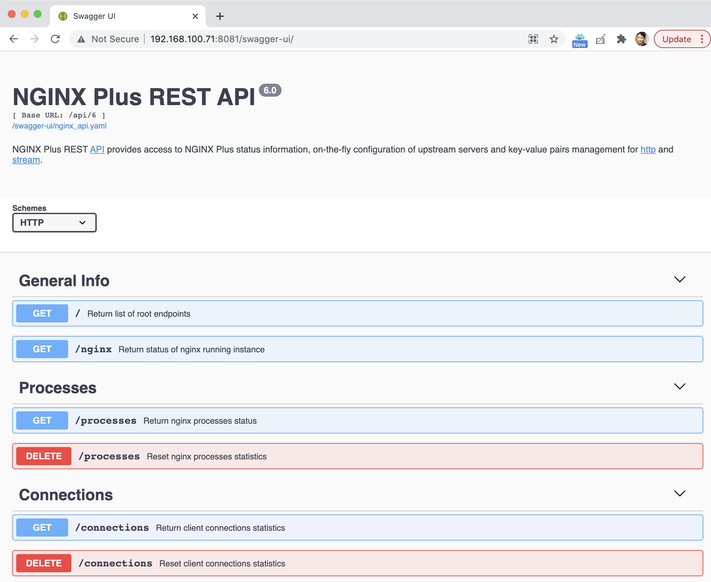

* Dashboard - http://192.168.100.71:8081/dashboard.html

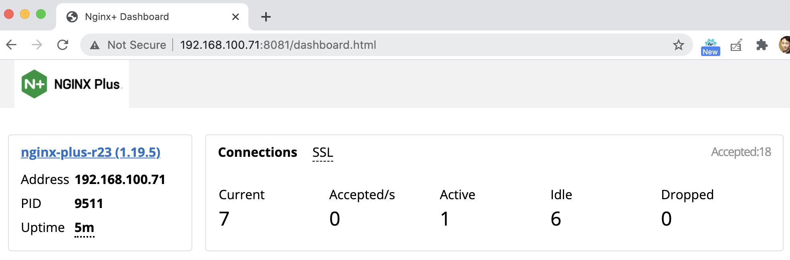
|===

== 负载均衡

=== 流量转发中的行为

[source, bash]
.*1. 空值报文头属性默认被丢弃*
----
$ curl http://192.168.100.71:8001/foo -H "X-Forwarded-For: " -s | grep "Request Headers"
    Request Headers: {host=[backendL7HTTP], connection=[close], user-agent=[curl/7.64.1], accept=[*/*]}

$ curl http://192.168.100.71:8001/foo -H "X-Forwarded-For: 1.1.1.1" -s | grep "Request Headers"
    Request Headers: {host=[backendL7HTTP], connection=[close], x-forwarded-for=[1.1.1.1], user-agent=[curl/7.64.1], accept=[*/*]}
----

[source, bash]
.*2. 包含下划线”_”的报文头将会被静默丢弃*
----
$ curl http://192.168.100.71:8001/foo -H "underscores_in_headers: test" -s | grep "Request Headers"
    Request Headers: {host=[backendL7HTTP], connection=[close], user-agent=[curl/7.64.1], accept=[*/*]}
----

在 Server 中配置`underscores_in_headers on`后测试

[source, bash]
----
$ curl http://192.168.100.71:8001/foo -H "underscores_in_headers: test" -s | grep "Request Headers"
    Request Headers: {host=[backendL7HTTP], connection=[close], underscores_in_headers=[test], user-agent=[curl/7.64.1], accept=[*/*]}
----

如下配置是否工作？

[source, bash]
----
upstream backendL7_HTTP {
  zone upstream_backend 64k;
  server 10.1.10.6:8080 ;
  server 10.1.10.7:8080 ;
  server 10.1.10.8:8080 ;
}

match server_ok {
  status 200-399;
  body ~ "ok";
}

server {
  listen 8001;
  status_zone server_backend;
  location / {
    status_zone location_backend;
    proxy_pass http://backendL7_HTTP;
    health_check uri=/health match=server_ok interval=10 fails=3 passes=1;
  }
}
----

[source, bash]
.**
----

----

[source, bash]
.**
----

----

[source, bash]
.**
----

----

[source, bash]
.**
----

----

[source, bash]
.**
----

----

=== 轮询负载算法

[cols="2,5a"]
|===
|ITEM |NOTE

|目的
|Nginx Plus 支持轮询的调度算法

|步骤
|
[source, bash]
.*默认算法为轮询，新建配置文件rr.conf*
----
cat << EOF > /etc/nginx/conf.d/rr.conf
upstream backend {
  zone upstream_backend 64k;
  server 10.1.10.6:8080;
  server 10.1.10.7:8080;
  server 10.1.10.8:8080;
}
server {
  listen 8082;
  status_zone server_backend;
  location / {
    status_zone location_backend;
    proxy_pass http://backend;
  }
}
EOF
----

[source, bash]
.*重新加载*
----
nginx -s reload
----

|结果
|

[source, bash]
.*命令行访问测试*
----
$ for i in {1..100} ; do curl http://192.168.100.71:8082/ -s ; done
    Server Hostname: server-1
    Server Hostname: server-2
    Server Hostname: server-3
    Server Hostname: server-1
    Server Hostname: server-2
    Server Hostname: server-3
----

*Dashboard 上查看统计数据*

image:img/nginx-lb-rr.png[]

|===

=== 最小连接数负载算法

[cols="2,5a"]
|===
|ITEM |NOTE

|目的
|Nginx Plus 支持最小连接数的调度算法

|步骤
|
[source, bash]
.*新建配置文件 least.conf*
----
cat << EOF > /etc/nginx/conf.d/least.conf
upstream backendLeast {
  zone upstream_backend 64k;
  least_conn;
  server 10.1.10.6:8080;
  server 10.1.10.7:8080;
  server 10.1.10.8:8080;
}
server {
  listen 8083;
  status_zone server_backend;
  location / {
    status_zone location_backend;
    proxy_pass http://backendLeast;
  }
}
EOF
----

[source, bash]
.*重新加载*
----
nginx -s reload
---- 

|结果
|

[source, bash]
.*命令行访问测试*
----
$ for i in {1..100} ; do curl http://192.168.100.71:8083/ -s ; done
    Server Hostname: server-1
    Server Hostname: server-2
    Server Hostname: server-3
    Server Hostname: server-1
    Server Hostname: server-2
    Server Hostname: server-3
----

*Dashboard 上查看统计数据*

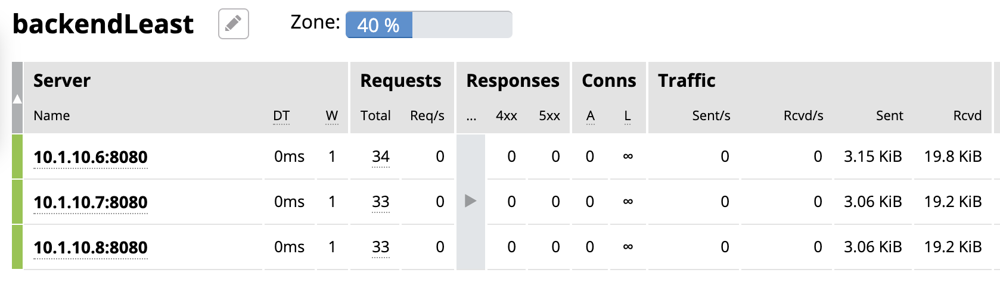

|===

=== 权重与优先级负载算法

[cols="2,5a"]
|===
|ITEM |NOTE

|目的
|Nginx Plus 支持权重优先级的调度算法

|步骤
|
[source, bash]
.*新建配置文件 weight.conf*
----
cat << EOF > /etc/nginx/conf.d/weight.conf
upstream backendWeight {
  zone upstream_backend 64k;
  server 10.1.10.6:8080 weight=5;
  server 10.1.10.7:8080 weight=2;
  server 10.1.10.8:8080 backup;
}
server { 
  listen 8084;
  status_zone server_backend;
  location / {
    status_zone location_backend;
    proxy_pass http://backendWeight;
  }
}
EOF
----

[source, bash]
.*重新加载*
----
nginx -s reload
----
|结果
|
[source, bash]
.*命令行访问测试*
----
$ for i in {1..100} ; do curl http://192.168.100.71:8084/ -s ; done
    Server Hostname: server-1
    Server Hostname: server-2
    Server Hostname: server-1
    Server Hostname: server-1
    Server Hostname: server-1
    Server Hostname: server-2
    Server Hostname: server-1
    Server Hostname: server-1
----

*Dashboard 上查看统计数据*

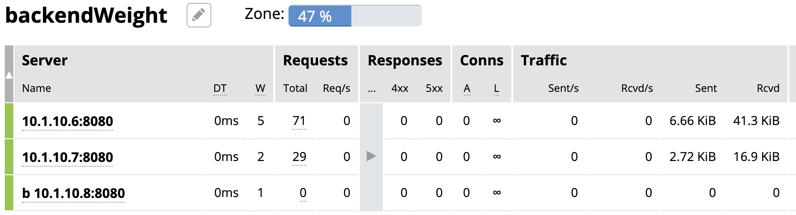

|===

=== IP 哈希负载算法

[cols="2,5a"]
|===
|ITEM |NOTE

|目的
|Nginx Plus 支持 IP 哈希调度算法

|步骤
|
[source, bash]
.*新建配置文件 iphash.conf*
----
cat << EOF > /etc/nginx/conf.d/iphash.conf
upstream backendIPHash {
  zone upstream_backend 64k;
  ip_hash;
  server 10.1.10.6:8080 ;
  server 10.1.10.7:8080 ;
  server 10.1.10.8:8080 down;
}
server {
  listen 8085;
  status_zone server_backend;
  location / {
    status_zone location_backend;
    proxy_pass http://backendIPHash;
  }
}
EOF
----

[source, bash]
.*重新加载*
----
nginx -s reload
----

|结果
|
[source, bash]
.*命令行访问测试*
----
$ for i in {1..100} ; do curl http://192.168.100.71:8085/ -s ; done
    Server Hostname: server-2
    Server Hostname: server-2
    Server Hostname: server-2
    Server Hostname: server-2
    Server Hostname: server-2
    Server Hostname: server-2
    Server Hostname: server-2
----

*Dashboard 上查看统计数据*

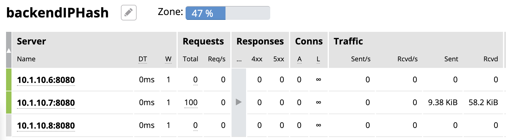
|===

=== 被动健康检查

[cols="2,5a"]
|===
|ITEM |NOTE

|目的
|Nginx Plus 支持被动的健康检查

|步骤
|
[source, bash]
.*新建配置文件 health.conf*
----
cat << EOF > /etc/nginx/conf.d/health.conf
upstream backendHealth {
  zone upstream_backend 64k;
  server 10.1.10.6:8080 max_fails=3 fail_timeout=30s;
  server 10.1.10.7:8080 max_fails=3 fail_timeout=30s;
  server 10.1.10.8:8080 max_fails=3 fail_timeout=30s;
}
server {
  listen 8086;
  status_zone server_backend;
  location / {
    status_zone location_backend;
    proxy_pass http://backendHealth;
  }
}
EOF
----

[source, bash]
.*重新加载*
----
nginx -s reload
----

*关闭服务 10.1.10.8:8080*

|结果
|
[source, bash]
.*命令行访问测试*
----
$ for i in {1..100} ; do curl http://192.168.100.71:8086/ -s  ; done
    Server Hostname: server-1
    Server Hostname: server-2
    Server Hostname: server-1
    Server Hostname: server-2
    Server Hostname: server-1
    Server Hostname: server-2
----

*Dashboard 上查看统计数据*

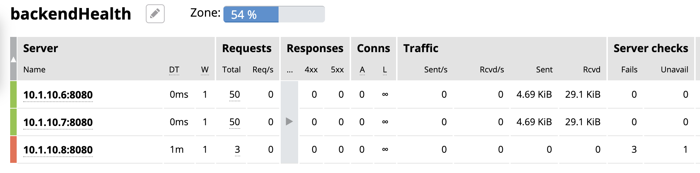

|===

=== 基于 HTTP 的主动健康检查

[cols="2,5a"]
|===
|ITEM |NOTE

|目的
|Nginx Plus 支持基于 HTTP 的主动健康检查

|步骤
|
[source, bash]
.*新建配置文件 healthHTTP.conf*
----
cat << EOF > /etc/nginx/conf.d/healthHTTP.conf
upstream backendHelthHTTP {
  zone upstream_backend 64k;
  server 10.1.10.6:8080 ;
  server 10.1.10.7:8080 ;
  server 10.1.10.8:8080 ;
}

match server_ok {
  status 200-399;
  body ~ "ok";
}

server {
  listen 8087;
  status_zone server_backend;
  location / {
    status_zone location_backend;
    proxy_pass http://backendHelthHTTP;
    health_check uri=/health match=server_ok interval=10 fails=3 passes=1;
  }
}
EOF
----

[source, bash]
.*重新加载*
----
nginx -s reload
----

*关闭服务 10.1.10.8:8080*

|结果
|

* 等待 30 秒后，在 Dashboard 上查看统计数据

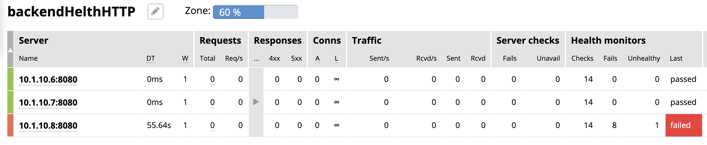

* 启动服务 10.1.10.8:8080

* 等待 10 秒左右，在 Dashboard 上查看统计数据

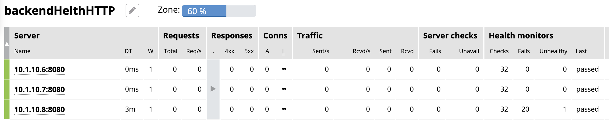

|===

=== 基于 Cookie 的会话保持

[cols="2,5a"]
|===
|ITEM |NOTE

|目的
|Nginx Plus 支持基于 Cookie 的会话保持

|步骤
|
[source, bash]
.*新建配置文件 persisCookie.conf*
----
cat << EOF > /etc/nginx/conf.d/persisCookie.conf
upstream backendCookie {
  zone upstream_backend 64k;
  server 10.1.10.6:8080 ;
  server 10.1.10.7:8080 ;
  server 10.1.10.8:8080 ;
  sticky cookie srv_id expires=1h path=/;
}

server {
  listen 8088;
  status_zone server_backend;
  location / { 
    status_zone location_backend;
    proxy_pass http://backendCookie;
    health_check interval=10 fails=3 passes=1;
  }
}
EOF
----

[source, bash]
.*重新加载*
----
nginx -s reload
----

|结果
|

* 浏览器访问服务多次，验证会话保持能力，及查看HTTP头中 srv_id Cookie

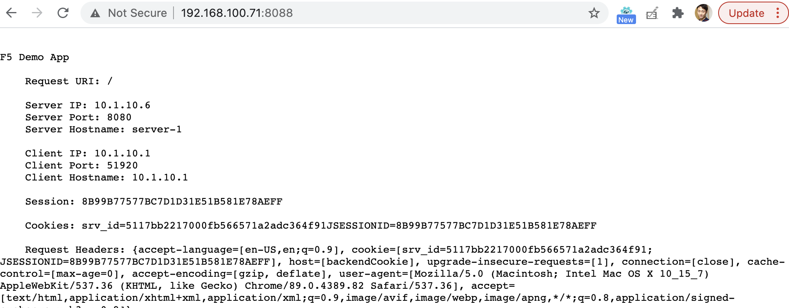

* 在 Dashboard 上查看统计数据

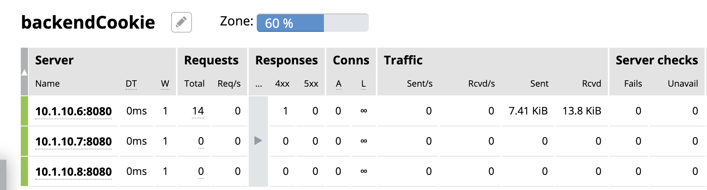

|===

=== 不同类型应用的负载均衡

[cols="2,5a"]
|===
|ITEM |NOTE

|目的
|Nginx Plug 对不同应用负载均衡的能力。

|L7
|
[source, bash]
.*L7 配置*
----
cat << EOF > /etc/nginx/conf.d/L7HTTP.conf
upstream backendL7HTTP {
  zone upstream_backend 64k;
  server 10.1.10.6:8080 ;
  server 10.1.10.7:8080 ;
  server 10.1.10.8:8080 ;
}

match server_ok {
  status 200-399;
  body ~ "ok";
}

server {
  listen 8001;
  status_zone server_backend;
  location / {
    status_zone location_backend;
    proxy_pass http://backendL7HTTP;
    health_check uri=/health match=server_ok interval=10 fails=3 passes=1;
  }
}
EOF
----

[source, bash]
.*重新加载*
----
nginx -s reload
----

[source, bash]
.*访问测试*
----
$ curl -X GET "http://192.168.100.71:8001/v3/api-docs" -H "accept: application/json"
----

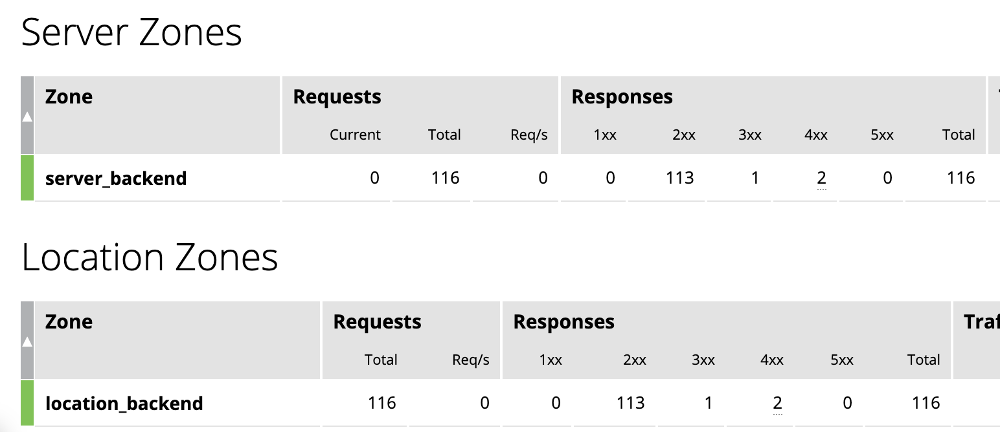

|L4 
|

*准备echoserver 应用*

参照 https://github.com/kylinsoong/networks/tree/master/echo，编译出 `echoserver` 和 `echoclient`。

[source, bash]
.*拷贝 echoserver 到三台服务器，异常启动 4 层应用，启动后监听在 8877 端口*
----
./echoserver 
----

[source, bash]
.*配置文件*
----
stream {

    upstream stream_backend {
        zone tcp_servers 64k;
        server 10.1.10.6:8877;
        server 10.1.10.7:8877;
        server 10.1.10.8:8877;
    }

    server {
        listen 8877;
        proxy_pass stream_backend;
        health_check interval=10 passes=1 fails=3;
    }
}
----

[source, bash]
.*测试*
----
$ ./echoclient 192.168.100.71
hi
----

*统计结果*

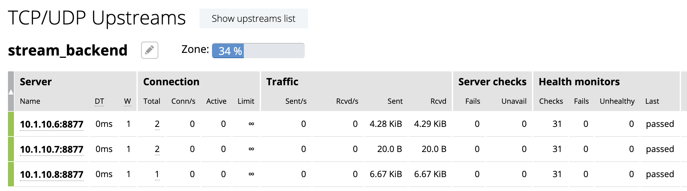

|gRPC
|
[source, bash]

*准备 gRPC 服务*

详细参照 https://grpc.io/docs/languages/go/quickstart/

.*配置 grpc_gateway.conf*
----
log_format grpc_json escape=json '{"timestamp":"$time_iso8601","client":"$remote_addr",'
                                  '"uri":"$uri","http-status":$status,'
                                  '"grpc-status":$grpc_status,"upstream":"$upstream_addr"'
                                  '"rx-bytes":$request_length,"tx-bytes":$bytes_sent}';

map $upstream_trailer_grpc_status $grpc_status {
    default $upstream_trailer_grpc_status; # We normally expect to receive grpc-status as a trailer
    ''      $sent_http_grpc_status;        # Else use the header, regardless of who generated it
}

server {
    listen 50051 http2; # In production, comment out to disable plaintext port
    access_log   /var/log/nginx/grpc_log.json grpc_json;

    # Routing
    location /helloworld. {
        status_zone location_backend;
        grpc_pass grpc://helloworld_service;
    }

    # Error responses
    include conf.d/errors.grpc_conf; # gRPC-compliant error responses
    default_type application/grpc;   # Ensure gRPC for all error responses
}

# Backend gRPC servers
#

upstream helloworld_service {
    zone helloworld_service 64k;
    server 10.1.10.6:50051;
    server 10.1.10.7:50051;
    server 10.1.10.8:50051;
}
----

[source, bash]
.*配置errors.grpc_conf*
----
# Ref: https://github.com/grpc/grpc/blob/master/doc/http-grpc-status-mapping.md
#
error_page 400 = @grpc_internal;
error_page 401 = @grpc_unauthenticated;
error_page 403 = @grpc_permission_denied;
error_page 404 = @grpc_unimplemented;
error_page 429 = @grpc_unavailable;
error_page 502 = @grpc_unavailable;
error_page 503 = @grpc_unavailable;
error_page 504 = @grpc_unavailable;

# NGINX-to-gRPC status code mappings
# Ref: https://github.com/grpc/grpc/blob/master/doc/statuscodes.md
#
error_page 405 = @grpc_internal; # Method not allowed
error_page 408 = @grpc_deadline_exceeded; # Request timeout
error_page 413 = @grpc_resource_exhausted; # Payload too large
error_page 414 = @grpc_resource_exhausted; # Request URI too large
error_page 415 = @grpc_internal; # Unsupported media type;
error_page 426 = @grpc_internal; # HTTP request was sent to HTTPS port
error_page 495 = @grpc_unauthenticated; # Client certificate authentication error
error_page 496 = @grpc_unauthenticated; # Client certificate not presented
error_page 497 = @grpc_internal; # HTTP request was sent to mutual TLS port
error_page 500 = @grpc_internal; # Server error
error_page 501 = @grpc_internal; # Not implemented

# gRPC error responses
# Ref: https://github.com/grpc/grpc-go/blob/master/codes/codes.go
#
location @grpc_deadline_exceeded {
    add_header grpc-status 4;
    add_header grpc-message 'deadline exceeded';
    return 204;
}

location @grpc_permission_denied {
    add_header grpc-status 7;
    add_header grpc-message 'permission denied';
    return 204;
}

location @grpc_resource_exhausted {
    add_header grpc-status 8;
    add_header grpc-message 'resource exhausted';
    return 204;
}

location @grpc_unimplemented {
    add_header grpc-status 12;
    add_header grpc-message unimplemented;
    return 204;
}

location @grpc_internal {
    add_header grpc-status 13;
    add_header grpc-message 'internal error';
    return 204;
}

location @grpc_unavailable {
    add_header grpc-status 14;
    add_header grpc-message unavailable;
    return 204;
}

location @grpc_unauthenticated {
    add_header grpc-status 16;
    add_header grpc-message unauthenticated;
    return 204;
}
----

[source, bash]
.*测试*
----
$ for i in {1..10} ; do go run greeter_client/main.go ; done
2021/03/30 22:39:36 Greeting: Hello world
2021/03/30 22:39:37 Greeting: Hello world
2021/03/30 22:39:38 Greeting: Hello world
2021/03/30 22:39:39 Greeting: Hello world
2021/03/30 22:39:39 Greeting: Hello world
2021/03/30 22:39:40 Greeting: Hello world
2021/03/30 22:39:41 Greeting: Hello world
2021/03/30 22:39:42 Greeting: Hello world
2021/03/30 22:39:44 Greeting: Hello world
2021/03/30 22:39:45 Greeting: Hello world
----

|===

== 内容缓存

[cols="2,5a"]
|===
|ITEM |NOTE

|目的
|Nginx Plug 内容缓存能力

|步骤
|
[source, bash]
.*新建 cache.conf 文件*
----
cat << EOF > /etc/nginx/conf.d/cache.conf
EOF
----

[source, bash]
.*重新加载*
----
nginx -s reload
----

|结果
|

|===

== 性能优化

=== OS 资源限制调试

本部说明 Nginx 运行所依赖 OS 资源限制调试。

[source, text]
.*1. CPU*
----
# lscpu | grep CPU
CPU op-mode(s):        32-bit, 64-bit
CPU(s):                2
On-line CPU(s) list:   0,1
CPU family:            6
Model name:            Intel(R) Xeon(R) CPU E5-2680 0 @ 2.70GHz
CPU MHz:               2699.999
NUMA node0 CPU(s):     0,1
----

[source, text]
.*2. 进程*
----
# ps -ef | grep nginx
root       955     1  0 Mar29 ?        00:00:00 nginx: master process /usr/sbin/nginx -c /etc/nginx/nginx.conf
nginx     4025   955  6 09:56 ?        00:02:07 nginx: worker process
nginx     4026   955  6 09:56 ?        00:02:07 nginx: worker process
nginx     4027   955  0 09:56 ?        00:00:00 nginx: cache manager process
----

[source,bash]
.*3. 资源限制*
----
for limit in fsize cpu as memlock
do
  grep "nginx" /etc/security/limits.conf | grep -q $limit || echo -e "nginx     hard   $limit    unlimited\nnginx     soft   $limit   unlimited" | sudo tee --append /etc/security/limits.conf
done

for limit in nofile noproc
do
  grep "nginx" /etc/security/limits.conf | grep -q $limit || echo -e "nginx     hard   $limit    64000\nnginx     soft   $limit   64000" | sudo tee --append /etc/security/limits.conf
done
----

[source,bash]
.*4. Kernel Memory 文件句柄数*
----
grep "file-max" /etc/sysctl.conf || echo -e "fs.file-max = 70000" | tee --append /etc/sysctl.conf
----

[source,bash]
.*5. 文件打开数判断*
----
ulimit -n
lsof -p <PID> | wc -l
lsof -p <PID>

ls -l /proc/<PID>/fd | wc -l
----

[source,bash]
.*6. 日志文件*
----
ls /var/log/nginx/
----

=== Nginx 性能调优一般步骤

本部分验证性能调优的一般步骤，以及不同步骤对 Nginx 性能的影响。

验证拓扑如下：

* 客户端：wrk软件
* 反向代理：性能优化对象
* Web端：NGINX

以上所有节点规格都是 2C 4G。

[cols="5a,5a"]
|===
|ITEM |NOTE

|默认配置性能
|
[source, bash]
.*配置备份*
----
mv /etc/nginx/nginx.conf /etc/nginx/nginx.conf.bak.$(date "+%Y%m%d%H%M%S")
----

[source, bash]
.*默认配置文件 /etc/nginx/nginx.conf*
----
user  nginx;
worker_processes  1;

error_log  /var/log/nginx/error.log notice;
pid        /var/run/nginx.pid;

events {
    worker_connections  1024;
}

http {
    include       /etc/nginx/mime.types;
    default_type  application/octet-stream;

    log_format  main  '$remote_addr - $remote_user [$time_local] "$request" '
                      '$status $body_bytes_sent "$http_referer" '
                      '"$http_user_agent" "$http_x_forwarded_for"';

    access_log  /var/log/nginx/access.log  main;

    sendfile        on;

    keepalive_timeout  65;

    include /etc/nginx/conf.d/*.conf;
}
----

[source, bash]
.*Server 配置*
----
cat << EOF > /etc/nginx/conf.d/app.conf
upstream webserver {
  zone upstream_backend 64k;
  server 192.168.71.210:80;
}

server {
  listen 9082;
  status_zone server_backend;
  location / {
    status_zone location_backend;
    proxy_pass http://webserver;
  }
}
EOF
----

[source, bash]
.*WRK 结果*
----
$ wrk -t4 -c800 -d120s http://192.168.71.211:9082
Running 2m test @ http://192.168.71.211:9082
  4 threads and 800 connections
  Thread Stats   Avg      Stdev     Max   +/- Stdev
    Latency   161.53ms  298.21ms   2.00s    86.69%
    Req/Sec     2.58k   502.22     6.53k    74.94%
  1230598 requests in 2.00m, 0.97GB read
  Socket errors: connect 0, read 49589, write 0, timeout 1933
Requests/sec:  10249.33
Transfer/sec:      8.31MB
----

*Dashboard UI 上统计信息*

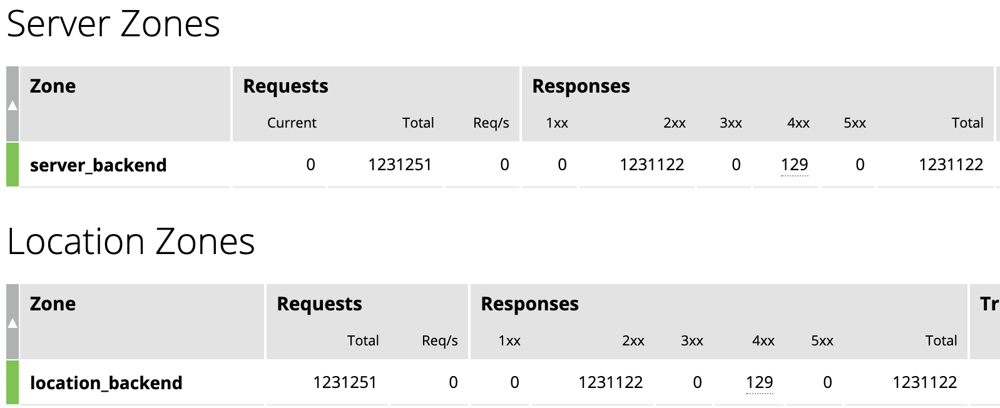

|优化连接数限制
|

[source, bash]
.*修改 worker_connections 从默认 1024 到 10000*
----
user  nginx;
worker_processes  1;

worker_rlimit_nofile 30000;

error_log  /var/log/nginx/error.log notice;
pid        /var/run/nginx.pid;

events {
    worker_connections  100000;
}
----

[source, bash]
.*WRK 测试结果*
----
$ wrk -t4 -c800 -d120s http://192.168.71.211:9082
Running 2m test @ http://192.168.71.211:9082
  4 threads and 800 connections
  Thread Stats   Avg      Stdev     Max   +/- Stdev
    Latency   177.90ms  294.22ms   2.00s    85.21%
    Req/Sec     2.58k   585.26     6.92k    76.87%
  1231828 requests in 2.00m, 0.98GB read
  Socket errors: connect 0, read 0, write 0, timeout 1255
Requests/sec:  10262.24
Transfer/sec:      8.32MB
----

|优化 worker 数量 
|

[source, bash]
.*修改 worker_processes 从 1 到 auto*
----
user  nginx;
worker_processes  auto;

worker_rlimit_nofile 30000;

error_log  /var/log/nginx/error.log notice;
pid        /var/run/nginx.pid;

events {
    worker_connections  100000;
}
----

[source, bash]
.*WRK 测试结果*
----
$ wrk -t4 -c800 -d120s http://192.168.71.211:9082
Running 2m test @ http://192.168.71.211:9082
  4 threads and 800 connections
  Thread Stats   Avg      Stdev     Max   +/- Stdev
    Latency   233.65ms  343.01ms   1.83s    80.99%
    Req/Sec     3.43k   613.32     6.02k    70.40%
  1637802 requests in 2.00m, 1.30GB read
  Socket errors: connect 0, read 0, write 0, timeout 4351
Requests/sec:  13643.47
Transfer/sec:     11.06MB
----

|连接复用
|
[source, bash]
.*配置连接复用*
----
upstream webserver {
  zone upstream_backend 64k;
  server 192.168.71.210:80;
  keepalive 128;
}

server {
  listen 9082;
  status_zone server_backend;
  location / {
    status_zone location_backend;
    proxy_pass http://webserver;
    proxy_http_version 1.1;
    proxy_set_header Connection "";
  }
}
----

[source, bash]
.*WRK 测试结果*
----
wrk -t4 -c800 -d120s http://192.168.71.211:9082
Running 2m test @ http://192.168.71.211:9082
  4 threads and 800 connections
  Thread Stats   Avg      Stdev     Max   +/- Stdev
    Latency   103.88ms  285.25ms   2.00s    90.34%
    Req/Sec     5.82k     1.25k   14.52k    69.75%
  2779426 requests in 2.00m, 2.20GB read
  Socket errors: connect 0, read 0, write 0, timeout 6382
  Non-2xx or 3xx responses: 249
Requests/sec:  23155.66
Transfer/sec:     18.77MB
----

|CPU亲和及worker优先级
|
[source, bash]
.*配置*
----
user  nginx;
worker_processes  2;
worker_cpu_affinity 0101 1010;

worker_rlimit_nofile 30000;

error_log  /var/log/nginx/error.log notice;
pid        /var/run/nginx.pid;
worker_priority -20;
----

[source, bash]
.*WRK 测试结果*
----
wrk -t4 -c800 -d120s http://192.168.71.211:9082
Running 2m test @ http://192.168.71.211:9082
  4 threads and 800 connections
  Thread Stats   Avg      Stdev     Max   +/- Stdev
    Latency    97.73ms  277.42ms   2.00s    90.52%
    Req/Sec     5.01k     1.46k   15.75k    78.92%
  2391712 requests in 2.00m, 1.89GB read
  Socket errors: connect 0, read 0, write 0, timeout 5774
  Non-2xx or 3xx responses: 446
Requests/sec:  19924.37
Transfer/sec:     16.15MB
----

|日志缓存 
|
[source, bash]
.*配置*
----
http {
    include       /etc/nginx/mime.types;
    default_type  application/octet-stream;

    log_format  main  '$remote_addr - $remote_user [$time_local] "$request" '
                      '$status $body_bytes_sent "$http_referer" '
                      '"$http_user_agent" "$http_x_forwarded_for"';

    access_log  /var/log/nginx/access.log  main buffer=1m;
----

[source, bash]
.*WRK 测试结果*
----
wrk -t4 -c800 -d120s http://192.168.71.211:9082
Running 2m test @ http://192.168.71.211:9082
  4 threads and 800 connections
  Thread Stats   Avg      Stdev     Max   +/- Stdev
    Latency   101.26ms  281.45ms   2.00s    90.36%
    Req/Sec     5.69k     1.36k   18.52k    73.07%
  2716274 requests in 2.00m, 2.15GB read
  Socket errors: connect 0, read 0, write 0, timeout 6294
  Non-2xx or 3xx responses: 460
Requests/sec:  22617.47
Transfer/sec:     18.33MB
----

|Cache
|
[source, bash]
.*配置*
----
upstream webserver {
  zone upstream_backend 64k;
  server 192.168.71.210:80;
  keepalive 128;
}

proxy_cache_path /tmp/cache keys_zone=mycache:10m inactive=60m;

server {
  listen 9082;
  status_zone server_backend;
  location / {
    status_zone location_backend;
    proxy_pass http://webserver;
    proxy_http_version 1.1;
    proxy_set_header Connection "";
    proxy_cache_key $host:$server_port$request_uri;
    proxy_cache_valid 200 304 1h;
    proxy_cache mycache;
  }
}
----

[source, bash]
.*WRK 测试结果*
----
wrk -t4 -c800 -d120s http://192.168.71.211:9082
Running 2m test @ http://192.168.71.211:9082
  4 threads and 800 connections
  Thread Stats   Avg      Stdev     Max   +/- Stdev
    Latency    40.12ms  127.31ms   1.95s    91.85%
    Req/Sec    12.16k     2.64k   27.87k    75.58%
  5806262 requests in 2.00m, 4.60GB read
  Socket errors: connect 0, read 189, write 0, timeout 275
Requests/sec:  48372.99
Transfer/sec:     39.21MB
----

|gzip压缩 
|
[source,bash]
.*配置*
----
http {

    ...

    gzip_min_length 500;
    gzip_buffers 4 256k;
    gzip_http_version 1.1;
    gzip_comp_level 1;
    gzip_types  text/plain application/javascript application/x-javascript text/javascript text/css application/xml application/xml+rss;
    gzip_vary on;
    gzip_proxied expired no-cache no-store private auth;
    gzip_disable "MSIE [1-6]\.";

    include /etc/nginx/conf.d/*.conf;
}
----

[source,bash]
.*WRK 测试结果*
----
wrk -t4 -c800 -d120s http://192.168.71.211:9082 -H "Accept-Encoding: gzip"
Running 2m test @ http://192.168.71.211:9082
  4 threads and 800 connections
  Thread Stats   Avg      Stdev     Max   +/- Stdev
    Latency    43.31ms  133.73ms   1.99s    91.62%
    Req/Sec    11.39k     1.98k   25.52k    76.48%
  5441588 requests in 2.00m, 4.31GB read
  Socket errors: connect 0, read 100, write 0, timeout 287
Requests/sec:  45319.05
Transfer/sec:     36.73MB
----

|优化CPU开销
|
[source,bash]
.*配置*
----
$ wrk -t4 -c800 -d120s http://192.168.71.211:9082
Running 2m test @ http://192.168.71.211:9082
  4 threads and 800 connections
  Thread Stats   Avg      Stdev     Max   +/- Stdev
    Latency    16.74ms    4.96ms 225.93ms   88.98%
    Req/Sec    12.03k     0.97k   25.52k    85.44%
  5747729 requests in 2.00m, 4.55GB read
Requests/sec:  47866.76
Transfer/sec:     38.80MB
----

|===

=== Nginx 日志

本部说明 Nginx 日志。

[cols="2,5a"]
|===
|ITEM |NOTE

|日志级别
|
[source,bash]
.*Nginx 支持的日志级别*
----
debug > info > notice > warn > error > crit > alert > emerg
----

默认Nginx开启的日志级别为notice。

[source,bash]
.*设定 Nginx 日志级别为 debug*
----
error_log  /var/log/nginx/error.log debug;
----

|Access 日志
|
[source,bash]
.*格式*
----
http {
    include       /etc/nginx/mime.types;
    default_type  application/octet-stream;

    log_format json_combined escape=json
        '{'
          '"time_local": "$time_local", '
          '"remote_addr": "$remote_addr", '
          '"remote_user": "$remote_user", '
          '"request": "$request", '
          '"status": "$status", '
          '"body_bytes_sent": "$body_bytes_sent", '
          '"request_time": "$request_time", '
          '"http_referrer": "$http_referer", '
          '"http_x_forward_for": "$http_x_forward_for", '
          '"http_user_agent": "$http_user_agent", '
          '"nginx_version": "$nginx_version", '
          '"pid": "$pid", '
          '"connections_active": "$connections_active", '
          '"connections_reading": "$connections_reading", '
          '"connections_writing": "$connections_writing", '
          '"connections_waiting": "$connections_waiting", '
          '"host": "$host", '
          '"upstream_addr": "$upstream_addr", '
          '"upstream_bytes_sent": "$upstream_bytes_sent", '
          '"upstream_bytes_received": "$upstream_bytes_received", '
          '"upstream_connect_time": "$upstream_connect_time", '
        '}';

    access_log  /var/log/nginx/access.log json_combined;

----

完整变量列表参照：http://nginx.org/en/docs/varindex.html

[source, json]
.*日志输出*
----
{
   "time_local":"30/Mar/2021:16:56:40 +0800",
   "remote_addr":"192.168.71.212",
   "remote_user":"",
   "request":"GET / HTTP/1.1",
   "status":"200",
   "body_bytes_sent":"612",
   "request_time":"0.000",
   "http_referrer":"",
   "http_x_forward_for":"",
   "http_user_agent":"",
   "nginx_version":"1.19.5",
   "pid":"4566",
   "connections_active":"808",
   "connections_reading":"0",
   "connections_writing":"1",
   "connections_waiting":"806",
   "host":"192.168.71.211",
   "upstream_addr":"",
   "upstream_bytes_sent":"",
   "upstream_bytes_received":"",
   "upstream_connect_time":""
}
----

|===

== TODO

[cols="2,5a"]
|===
|ITEM |NOTE

|目的
|

|步骤
|

|结果
|

|===

[cols="2,5a"]
|===
|ITEM |NOTE

|目的
|

|步骤
|

|结果
|

|===

[cols="2,5a"]
|===
|ITEM |NOTE

|目的
|

|步骤
|

|结果
|

|===

[cols="2,5a"]
|===
|ITEM |NOTE

|目的
|

|步骤
|

|结果
|

|===

[cols="2,5a"]
|===
|ITEM |NOTE

|目的
|

|步骤
|

|结果
|

|===

[cols="2,5a"]
|===
|ITEM |NOTE

|目的
|

|步骤
|

|结果
|

|===

[source,bash]
.**
----

----

