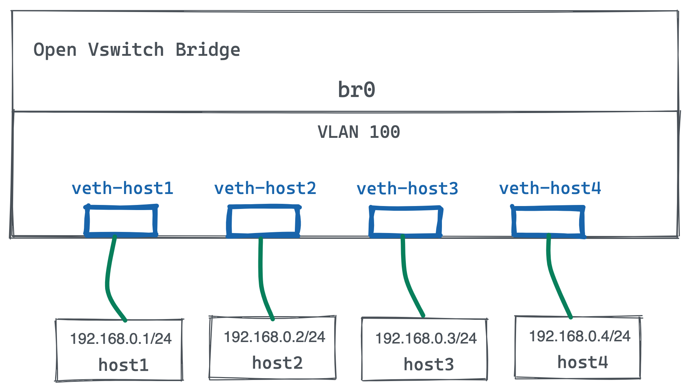

= OVS + Faucet
:toc: manual

== 扁平网络

数据平面网络拓扑如下所示：

OVS 作为数据平面，Faucet 作为管理平面。

=== 控制平面配置

[source, bash]
.*1. 编辑 faucet 配置文件/etc/faucet/faucet.yaml，添加如下内容*
----
vlans:
  office:
    vid: 100
    description: "office network"

dps:
  sw1:
    dp_id: 0x1
    hardware: "Open vSwitch"
    interfaces:
      1:
        name: "host1"
        description: "host1 network namespace"
        native_vlan: office
      2:
        name: "host2"
        description: "host2 network namespace"
        native_vlan: office
      3:
        name: "host3"
        description: "host3 network namespace"
        native_vlan: office
      4:
        name: "host4"
        description: "host4 network namespace"
        native_vlan: office
----

[source, bash]
.*2. 启动服务*
----
sudo systemctl start faucet.service
----

NOTE: Faucet 可以与Prometheus、grafana 提供可观测能力，详细参照Faucet文档。

=== 数据平面配置

[source, bash]
.*1. 创建在 namespace 中执行命令的快捷方式（本部分使用 namespace 模拟 host）*
----
as_ns () {
    NAME=$1
    NETNS=faucet-${NAME}
    shift
    sudo ip netns exec ${NETNS} $@
}
----

[source, bash]
.*2. 创建 namespace*
----
create_ns () {
    NAME=$1
    IP=$2
    NETNS=faucet-${NAME}
    sudo ip netns add ${NETNS}
    sudo ip link add dev veth-${NAME} type veth peer name veth0 netns ${NETNS}
    sudo ip link set dev veth-${NAME} up
    as_ns ${NAME} ip link set dev lo up
    [ -n "${IP}" ] && as_ns ${NAME} ip addr add dev veth0 ${IP}
    as_ns ${NAME} ip link set dev veth0 up
}
----

[source, bash]
.*3. 创建 host*
----
create_ns host1 192.168.0.1/24
create_ns host2 192.168.0.2/24
create_ns host3 192.168.0.3/24
create_ns host4 192.168.0.4/24
----

[source, bash]
.*4. OVS 配置*
----
sudo ovs-vsctl add-br br0 \
-- set bridge br0 other-config:datapath-id=0000000000000001 \
-- set bridge br0 other-config:disable-in-band=true \
-- set bridge br0 fail_mode=secure \
-- add-port br0 veth-host1 -- set interface veth-host1 ofport_request=1 \
-- add-port br0 veth-host2 -- set interface veth-host2 ofport_request=2 \
-- add-port br0 veth-host3 -- set interface veth-host3 ofport_request=3 \
-- add-port br0 veth-host4 -- set interface veth-host4 ofport_request=4 \
-- set-controller br0 tcp:127.0.0.1:6653 tcp:127.0.0.1:6654
----

=== 测试

[source, bash]
.*1. ping 测试*
----
for i in 1 2 3 4 ; do for j in 1 2 3 4 ; do as_ns host$i ping 192.168.0.$j -c3 ; done ; done
----

[source, bash]
.*2. iperf3 测试*
----
// start server in host 1
as_ns host1 iperf3 --server --pidfile /run/iperf3-host1.pid --daemon

// client test
for i in 2 3 4 ; do as_ns host$i iperf3 --client 192.168.0.1 ; done
----

*3. 查看控制平面交换机 Port 统计数据*

image:img/ovs-helloworld-stats.png[]

== ACL 控制

本部分基于上面部分的编排网络，增加 ACL 配置，所有配置都在控制平面完成。本部分增加 host5，执行入戏命令增加 host5

[source, bash]
.*1. 创建 host5*
----
create_ns host5 192.168.0.5/24
----

[source, bash]
.*2. OVS 配置*
----
sudo ovs-vsctl add-port br0 veth-host5 -- set interface veth-host5 ofport_request=5
----

[source, bash]
.*3. ping 测试*
----
for i in 1 2 3 4 ; do as_ns host$i ping 192.168.0.5 -c3 ; done
----

=== host3 block-ping

[source, bash]
.*1. 编辑 /etc/faucet/faucet.yaml，增加 ACL配置*
----
      3:
        name: "host3"
        description: "host3 network namespace"
        native_vlan: office
        acls_in: [block-ping, allow-all]
      4:
        name: "host4"
        description: "host4 network namespace"
        native_vlan: office
acls:
  block-ping:
  - rule:
      dl_type: 0x800      # IPv4
      ip_proto: 1         # ICMP
      actions:
        allow: False
  - rule:
      dl_type: 0x86dd     # IPv6
      ip_proto: 58        # ICMPv6
      actions:
        allow: False
  allow-all:
  - rule:
      actions:
        allow: True
----

[source, bash]
.*2. host1 分别 ping host2，host3，host4，只有 host3 不通*
----
$ for i in 2 3 4 ; do as_ns host1 ping 192.168.0.$i -c3 ; done
PING 192.168.0.2 (192.168.0.2) 56(84) bytes of data.
64 bytes from 192.168.0.2: icmp_seq=1 ttl=64 time=0.038 ms
64 bytes from 192.168.0.2: icmp_seq=2 ttl=64 time=0.080 ms
64 bytes from 192.168.0.2: icmp_seq=3 ttl=64 time=0.084 ms

--- 192.168.0.2 ping statistics ---
3 packets transmitted, 3 received, 0% packet loss, time 2041ms
rtt min/avg/max/mdev = 0.038/0.067/0.084/0.020 ms
PING 192.168.0.3 (192.168.0.3) 56(84) bytes of data.

--- 192.168.0.3 ping statistics ---
3 packets transmitted, 0 received, 100% packet loss, time 2034ms

PING 192.168.0.4 (192.168.0.4) 56(84) bytes of data.
64 bytes from 192.168.0.4: icmp_seq=1 ttl=64 time=0.198 ms
64 bytes from 192.168.0.4: icmp_seq=2 ttl=64 time=0.065 ms
64 bytes from 192.168.0.4: icmp_seq=3 ttl=64 time=0.082 ms

--- 192.168.0.4 ping statistics ---
3 packets transmitted, 3 received, 0% packet loss, time 2048ms
rtt min/avg/max/mdev = 0.065/0.115/0.198/0.059 ms
----

[source, bash]
.*3. 执行从 host1 ping host3，依次从链路（veth-host1 -> veth-host3 -> host3）上抓包*
----
$ sudo tcpdump -l -e -n -i veth-host1 icmp
09:17:24.122219 92:e4:39:93:c7:b9 > ea:63:74:2c:dd:63, ethertype IPv4 (0x0800), length 98: 192.168.0.1 > 192.168.0.3: ICMP echo request, id 6611, seq 1, length 64
09:17:25.153282 92:e4:39:93:c7:b9 > ea:63:74:2c:dd:63, ethertype IPv4 (0x0800), length 98: 192.168.0.1 > 192.168.0.3: ICMP echo request, id 6611, seq 2, length 64
09:17:26.176451 92:e4:39:93:c7:b9 > ea:63:74:2c:dd:63, ethertype IPv4 (0x0800), length 98: 192.168.0.1 > 192.168.0.3: ICMP echo request, id 6611, seq 3, length 64

$ sudo tcpdump -l -e -n -i veth-host3 icmp
09:17:24.122713 92:e4:39:93:c7:b9 > ea:63:74:2c:dd:63, ethertype IPv4 (0x0800), length 98: 192.168.0.1 > 192.168.0.3: ICMP echo request, id 6611, seq 1, length 64
09:17:24.122739 ea:63:74:2c:dd:63 > 92:e4:39:93:c7:b9, ethertype IPv4 (0x0800), length 98: 192.168.0.3 > 192.168.0.1: ICMP echo reply, id 6611, seq 1, length 64
09:17:25.153344 92:e4:39:93:c7:b9 > ea:63:74:2c:dd:63, ethertype IPv4 (0x0800), length 98: 192.168.0.1 > 192.168.0.3: ICMP echo request, id 6611, seq 2, length 64
09:17:25.153394 ea:63:74:2c:dd:63 > 92:e4:39:93:c7:b9, ethertype IPv4 (0x0800), length 98: 192.168.0.3 > 192.168.0.1: ICMP echo reply, id 6611, seq 2, length 64
09:17:26.176483 92:e4:39:93:c7:b9 > ea:63:74:2c:dd:63, ethertype IPv4 (0x0800), length 98: 192.168.0.1 > 192.168.0.3: ICMP echo request, id 6611, seq 3, length 64
09:17:26.176574 ea:63:74:2c:dd:63 > 92:e4:39:93:c7:b9, ethertype IPv4 (0x0800), length 98: 192.168.0.3 > 192.168.0.1: ICMP echo reply, id 6611, seq 3, length 64

$ as_ns host3 tcpdump -l -e -n -i veth0 icmp
09:17:24.122719 92:e4:39:93:c7:b9 > ea:63:74:2c:dd:63, ethertype IPv4 (0x0800), length 98: 192.168.0.1 > 192.168.0.3: ICMP echo request, id 6611, seq 1, length 64
09:17:24.122738 ea:63:74:2c:dd:63 > 92:e4:39:93:c7:b9, ethertype IPv4 (0x0800), length 98: 192.168.0.3 > 192.168.0.1: ICMP echo reply, id 6611, seq 1, length 64
09:17:25.153353 92:e4:39:93:c7:b9 > ea:63:74:2c:dd:63, ethertype IPv4 (0x0800), length 98: 192.168.0.1 > 192.168.0.3: ICMP echo request, id 6611, seq 2, length 64
09:17:25.153392 ea:63:74:2c:dd:63 > 92:e4:39:93:c7:b9, ethertype IPv4 (0x0800), length 98: 192.168.0.3 > 192.168.0.1: ICMP echo reply, id 6611, seq 2, length 64
09:17:26.176531 92:e4:39:93:c7:b9 > ea:63:74:2c:dd:63, ethertype IPv4 (0x0800), length 98: 192.168.0.1 > 192.168.0.3: ICMP echo request, id 6611, seq 3, length 64
09:17:26.176572 ea:63:74:2c:dd:63 > 92:e4:39:93:c7:b9, ethertype IPv4 (0x0800), length 98: 192.168.0.3 > 192.168.0.1: ICMP echo reply, id 6611, seq 3, length 64
----

NOTE: 如上抓包说明在veth-host1返回时执行了 Block Ping 操作。

=== host4 mirroring-ping

本部分配置将 host4 上 icmp 流量镜像到 host2

[source, bash]
.*1. 编辑 /etc/faucet/faucet.yaml，增加 ACL配*
----
      4:
        name: "host4"
        description: "host4 network namespace"
        native_vlan: office
        acls_in: [mirroring-ping, allow-all]
acls:
  mirroring-ping:
  - rule:
      dl_type: 0x800      # IPv4
      ip_proto: 1         # ICMP
      actions:
        mirror: 2
  - rule:
      dl_type: 0x86dd     # IPv6
      ip_proto: 58        # ICMPv6
      actions:
        mirror: 2
  allow-all:
  - rule:
      actions:
        allow: True
----

[source, bash]
.*2. 在 host1 ping host4*
----
$ sudo ip netns exec faucet-host1 ping 192.168.0.4 -c3
PING 192.168.0.4 (192.168.0.4) 56(84) bytes of data.
64 bytes from 192.168.0.4: icmp_seq=1 ttl=64 time=0.448 ms
64 bytes from 192.168.0.4: icmp_seq=2 ttl=64 time=0.115 ms
64 bytes from 192.168.0.4: icmp_seq=3 ttl=64 time=0.174 ms
----

*3. 依次在如下接口抓包，查看流量镜像情况*

[source, bash]
.*`veth-host1` -> `veth-host4` -> `host4`*
----
$ sudo tcpdump -l -e -n -i veth-host1 icmp
10:57:53.350068 92:e4:39:93:c7:b9 > 3e:fa:03:5d:c6:72, ethertype IPv4 (0x0800), length 98: 192.168.0.1 > 192.168.0.4: ICMP echo request, id 7545, seq 1, length 64
10:57:53.350487 3e:fa:03:5d:c6:72 > 92:e4:39:93:c7:b9, ethertype IPv4 (0x0800), length 98: 192.168.0.4 > 192.168.0.1: ICMP echo reply, id 7545, seq 1, length 64
10:57:54.352601 92:e4:39:93:c7:b9 > 3e:fa:03:5d:c6:72, ethertype IPv4 (0x0800), length 98: 192.168.0.1 > 192.168.0.4: ICMP echo request, id 7545, seq 2, length 64
10:57:54.352674 3e:fa:03:5d:c6:72 > 92:e4:39:93:c7:b9, ethertype IPv4 (0x0800), length 98: 192.168.0.4 > 192.168.0.1: ICMP echo reply, id 7545, seq 2, length 64
10:57:55.367602 92:e4:39:93:c7:b9 > 3e:fa:03:5d:c6:72, ethertype IPv4 (0x0800), length 98: 192.168.0.1 > 192.168.0.4: ICMP echo request, id 7545, seq 3, length 64
10:57:55.367732 3e:fa:03:5d:c6:72 > 92:e4:39:93:c7:b9, ethertype IPv4 (0x0800), length 98: 192.168.0.4 > 192.168.0.1: ICMP echo reply, id 7545, seq 3, length 64

$ sudo tcpdump -l -e -n -i veth-host4 icmp
10:57:53.350354 92:e4:39:93:c7:b9 > 3e:fa:03:5d:c6:72, ethertype IPv4 (0x0800), length 98: 192.168.0.1 > 192.168.0.4: ICMP echo request, id 7545, seq 1, length 64
10:57:53.350389 3e:fa:03:5d:c6:72 > 92:e4:39:93:c7:b9, ethertype IPv4 (0x0800), length 98: 192.168.0.4 > 192.168.0.1: ICMP echo reply, id 7545, seq 1, length 64
10:57:54.352627 92:e4:39:93:c7:b9 > 3e:fa:03:5d:c6:72, ethertype IPv4 (0x0800), length 98: 192.168.0.1 > 192.168.0.4: ICMP echo request, id 7545, seq 2, length 64
10:57:54.352662 3e:fa:03:5d:c6:72 > 92:e4:39:93:c7:b9, ethertype IPv4 (0x0800), length 98: 192.168.0.4 > 192.168.0.1: ICMP echo reply, id 7545, seq 2, length 64
10:57:55.367666 92:e4:39:93:c7:b9 > 3e:fa:03:5d:c6:72, ethertype IPv4 (0x0800), length 98: 192.168.0.1 > 192.168.0.4: ICMP echo request, id 7545, seq 3, length 64
10:57:55.367716 3e:fa:03:5d:c6:72 > 92:e4:39:93:c7:b9, ethertype IPv4 (0x0800), length 98: 192.168.0.4 > 192.168.0.1: ICMP echo reply, id 7545, seq 3, length 64

$ as_ns host4 tcpdump -l -e -n -i veth0 icmp
10:57:53.350369 92:e4:39:93:c7:b9 > 3e:fa:03:5d:c6:72, ethertype IPv4 (0x0800), length 98: 192.168.0.1 > 192.168.0.4: ICMP echo request, id 7545, seq 1, length 64
10:57:53.350388 3e:fa:03:5d:c6:72 > 92:e4:39:93:c7:b9, ethertype IPv4 (0x0800), length 98: 192.168.0.4 > 192.168.0.1: ICMP echo reply, id 7545, seq 1, length 64
10:57:54.352633 92:e4:39:93:c7:b9 > 3e:fa:03:5d:c6:72, ethertype IPv4 (0x0800), length 98: 192.168.0.1 > 192.168.0.4: ICMP echo request, id 7545, seq 2, length 64
10:57:54.352660 3e:fa:03:5d:c6:72 > 92:e4:39:93:c7:b9, ethertype IPv4 (0x0800), length 98: 192.168.0.4 > 192.168.0.1: ICMP echo reply, id 7545, seq 2, length 64
10:57:55.367681 92:e4:39:93:c7:b9 > 3e:fa:03:5d:c6:72, ethertype IPv4 (0x0800), length 98: 192.168.0.1 > 192.168.0.4: ICMP echo request, id 7545, seq 3, length 64
10:57:55.367714 3e:fa:03:5d:c6:72 > 92:e4:39:93:c7:b9, ethertype IPv4 (0x0800), length 98: 192.168.0.4 > 192.168.0.1: ICMP echo reply, id 7545, seq 3, length 64
----

[source, bash]
.*`veth-host2` -> `host2`*
----
$ sudo tcpdump -l -e -n -i veth-host2 icmp
10:57:53.350479 3e:fa:03:5d:c6:72 > 92:e4:39:93:c7:b9, ethertype IPv4 (0x0800), length 98: 192.168.0.4 > 192.168.0.1: ICMP echo reply, id 7545, seq 1, length 64
10:57:54.352669 3e:fa:03:5d:c6:72 > 92:e4:39:93:c7:b9, ethertype IPv4 (0x0800), length 98: 192.168.0.4 > 192.168.0.1: ICMP echo reply, id 7545, seq 2, length 64
10:57:55.367723 3e:fa:03:5d:c6:72 > 92:e4:39:93:c7:b9, ethertype IPv4 (0x0800), length 98: 192.168.0.4 > 192.168.0.1: ICMP echo reply, id 7545, seq 3, length 64

$ sudo ip netns exec faucet-host2 tcpdump -l -e -n -i veth0 icmp
10:57:53.350485 3e:fa:03:5d:c6:72 > 92:e4:39:93:c7:b9, ethertype IPv4 (0x0800), length 98: 192.168.0.4 > 192.168.0.1: ICMP echo reply, id 7545, seq 1, length 64
10:57:54.352673 3e:fa:03:5d:c6:72 > 92:e4:39:93:c7:b9, ethertype IPv4 (0x0800), length 98: 192.168.0.4 > 192.168.0.1: ICMP echo reply, id 7545, seq 2, length 64
10:57:55.367730 3e:fa:03:5d:c6:72 > 92:e4:39:93:c7:b9, ethertype IPv4 (0x0800), length 98: 192.168.0.4 > 192.168.0.1: ICMP echo reply, id 7545, seq 3, length 64
----

NOTE: Port 4 上镜像的流量只有 ICMP reply 包。

=== host5 rewrite mac

通过 output 可以实现对host5MAC地址进行修改。

[source, bash]
.*1. 编辑 /etc/faucet/faucet.yaml，增加 ACL配* 
----
      5:
        name: "host5"
        description: "host5 network namespace"
        native_vlan: office
        acls_in: [rewrite-mac, allow-all]
  rewrite-mac:
  - rule:
    actions:
      allow: True
      output:
      - set_fields:
        - eth_src: "00:00:00:00:00:02"
----

[source, bash]
.*2. 在 Host5 上 ping host1*
----
$ as_ns host5 ping 192.168.0.1 -c3
PING 192.168.0.1 (192.168.0.1) 56(84) bytes of data.
64 bytes from 192.168.0.1: icmp_seq=1 ttl=64 time=0.546 ms
64 bytes from 192.168.0.1: icmp_seq=2 ttl=64 time=0.111 ms
64 bytes from 192.168.0.1: icmp_seq=3 ttl=64 time=0.076 ms
----

[source, bash]
.*3. 在 host 抓包*
----
$ sudo tcpdump -l -e -n -i veth-host1 icmp
14:37:11.908580 00:00:00:00:00:02 > 92:e4:39:93:c7:b9, ethertype IPv4 (0x0800), length 98: 192.168.0.5 > 192.168.0.1: ICMP echo request, id 10336, seq 1, length 64
14:37:11.908654 92:e4:39:93:c7:b9 > e2:d3:db:08:13:6e, ethertype IPv4 (0x0800), length 98: 192.168.0.1 > 192.168.0.5: ICMP echo reply, id 10336, seq 1, length 64
14:37:12.930784 00:00:00:00:00:02 > 92:e4:39:93:c7:b9, ethertype IPv4 (0x0800), length 98: 192.168.0.5 > 192.168.0.1: ICMP echo request, id 10336, seq 2, length 64
----

== 完整配置文件

[source, yaml]
----
vlans:
  office:
    vid: 100
    description: "office network"

dps:
  sw1:
    dp_id: 0x1
    hardware: "Open vSwitch"
    interfaces:
      1:
        name: "host1"
        description: "host1 network namespace"
        native_vlan: office
      2:
        name: "host2"
        description: "host2 network namespace"
        native_vlan: office
      3:
        name: "host3"
        description: "host3 network namespace"
        native_vlan: office
        acls_in: [block-ping, allow-all]
      4:
        name: "host4"
        description: "host4 network namespace"
        native_vlan: office
        acls_in: [mirroring-ping, allow-all]
      5:
        name: "host5"
        description: "host5 network namespace"
        native_vlan: office
        acls_in: [rewrite-mac, allow-all]
acls:
  block-ping:
  - rule:
      dl_type: 0x800      # IPv4
      ip_proto: 1         # ICMP
      actions:
        allow: False
  - rule:
      dl_type: 0x86dd     # IPv6
      ip_proto: 58        # ICMPv6
      actions:
        allow: False

  mirroring-ping:
  - rule:
      dl_type: 0x800      # IPv4
      ip_proto: 1         # ICMP
      actions:
        mirror: 2
  - rule:
      dl_type: 0x86dd     # IPv6
      ip_proto: 58        # ICMPv6
      actions:
        mirror: 2
        
  rewrite-mac:
  - rule:
    actions:
      allow: True
      output:
      - set_fields:
        - eth_src: "00:00:00:00:00:02"

  allow-all:
  - rule:
      actions:
        allow: True
----

