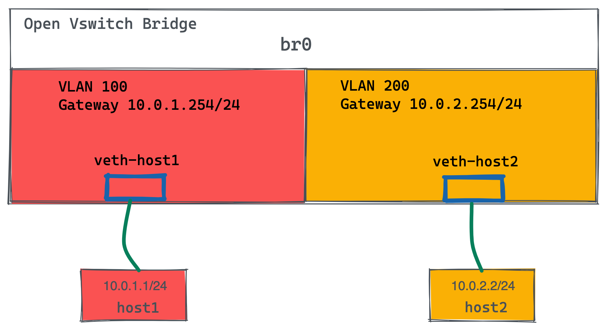
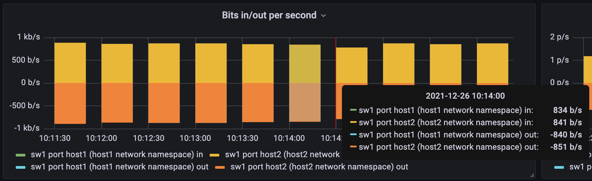
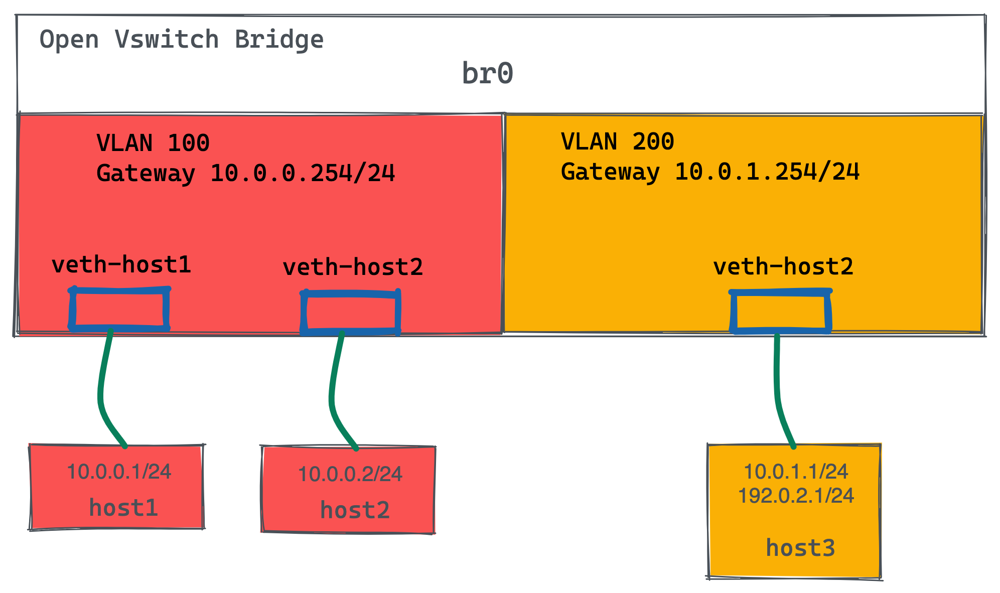

= OVS Routing
:toc: manual

== 1 Switch 2 VLAN 2 Host 1 Router 

如图所示所示，有一个交换机，2 个VLAN，每个 VLAN 中有 1 个Host，跨VLAN流量通过路由器转发。

=== 控制平面配置

[source, bash]
----
vlans:
  vlan100:
    vid: 100
    faucet_vips: ["10.0.0.254/24"]  # Faucet's virtual IP address for vlan100
    faucet_mac: "00:00:00:00:00:11"
  vlan200:
    vid: 200
    faucet_vips: ["10.0.1.254/24"]  # Faucet's virtual IP address for vlan200
    faucet_mac: "00:00:00:00:00:22"
routers:
  router-1:                           # Router name
    vlans: [vlan100, vlan200]       # Names of vlans to allow routing between
dps:
  sw1:
    dp_id: 0x1
    hardware: "Open vSwitch"
    interfaces:
      1:
        name: "host1"
        description: "host1 network namespace"
        native_vlan: vlan100
      2:
        name: "host2"
        description: "host2 network namespace"
        native_vlan: vlan200
----

=== 数据平面配置

[source, bash]
.*1. Host 配置*
----
create_ns host1 10.0.1.1/24
create_ns host2 10.0.2.2/24
as_ns host1 ip route add default via 10.0.1.254 dev veth0
as_ns host2 ip route add default via 10.0.2.254 dev veth0
----

[source, bash]
.*2. OVS 配置*
----
sudo ovs-vsctl add-br br0 \
-- set bridge br0 other-config:datapath-id=0000000000000001 \
-- set bridge br0 other-config:disable-in-band=true \
-- set bridge br0 fail_mode=secure \
-- add-port br0 veth-host1 -- set interface veth-host1 ofport_request=1 \
-- add-port br0 veth-host2 -- set interface veth-host2 ofport_request=2 \
-- set-controller br0 tcp:127.0.0.1:6653 tcp:127.0.0.1:6654
----

=== 访问测试

[source, bash]
.*1. host1 ping host2*
----
as_ns host1 ping 10.0.2.2 -c3
----

[source, bash]
.*2. host2 抓包*
----
$ as_ns host2 tcpdump -l -e -n -i veth0
10:10:40.151867 00:00:00:00:00:22 > c6:30:a7:0b:c6:80, ethertype IPv4 (0x0800), length 98: 10.0.1.1 > 10.0.2.2: ICMP echo request, id 2823, seq 213, length 64
10:10:40.151900 c6:30:a7:0b:c6:80 > 00:00:00:00:00:22, ethertype IPv4 (0x0800), length 98: 10.0.2.2 > 10.0.1.1: ICMP echo reply, id 2823, seq 213, length 64
10:10:41.176232 00:00:00:00:00:22 > c6:30:a7:0b:c6:80, ethertype IPv4 (0x0800), length 98: 10.0.1.1 > 10.0.2.2: ICMP echo request, id 2823, seq 214, length 64
10:10:41.176297 c6:30:a7:0b:c6:80 > 00:00:00:00:00:22, ethertype IPv4 (0x0800), length 98: 10.0.2.2 > 10.0.1.1: ICMP echo reply, id 2823, seq 214, length 64
10:10:42.200186 00:00:00:00:00:22 > c6:30:a7:0b:c6:80, ethertype IPv4 (0x0800), length 98: 10.0.1.1 > 10.0.2.2: ICMP echo request, id 2823, seq 215, length 64
10:10:42.200252 c6:30:a7:0b:c6:80 > 00:00:00:00:00:22, ethertype IPv4 (0x0800), length 98: 10.0.2.2 > 10.0.1.1: ICMP echo reply, id 2823, seq 215, length 64
----

*3. 可视化统计*

== 静态路由

如图所示所示，有一个交换机，2 个VLAN，每个 VLAN 100 中有 2 个Host，VLAN 200 中 1 个 Host，跨VLAN流量通过路由器转发。路由器中配置有一条静态路由，访问 `192.0.2.0/24` 网络的网关为 `10.0.1.1`。

=== 控制平面配置

[source, bash]
----
vlans:
  hosts:
    vid: 100
    description: "vlan for clients"
    faucet_mac: "00:00:00:00:00:11"
    faucet_vips: ["10.0.0.254/24"]

  servers:
    vid: 200
    description: "vlan for servers"
    faucet_mac: "00:00:00:00:00:22"
    faucet_vips: ["10.0.1.254/24"]
    routes:
    - route:
        ip_dst: "192.0.2.0/24"
        ip_gw: '10.0.1.1'
routers:
  router-hosts-servers:
    vlans: [hosts, servers]
dps:
  br0:
    dp_id: 0x1
    hardware: "Open vSwitch"
    interfaces:
      1:
        name: "host1"
        description: "host1 network namespace"
        native_vlan: hosts
      2:
        name: "host2"
        description: "host2 network namespace"
        native_vlan: hosts
      3:
        name: "server"
        description: "server network namespace"
        native_vlan: servers
----

NOTE: ip_dst 指定目的地网络为 192.0.2.0/24，ip_gw 为10.0.1.1。

=== 数据平面配置

[source, bash]
.*1. Host 配置*
----
create_ns host1 10.0.0.1/24
create_ns host2 10.0.0.2/24
create_ns server 10.0.1.1/24
as_ns host1 ip route add default via 10.0.0.254
as_ns host2 ip route add default via 10.0.0.254
as_ns server ip route add default via 10.0.1.254
as_ns server ip address add 192.0.2.1/24 dev veth0
----

[source, bash]
.*2. OVS 配置*
----
sudo ovs-vsctl add-br br0 \
-- set bridge br0 other-config:datapath-id=0000000000000001 \
-- set bridge br0 other-config:disable-in-band=true \
-- set bridge br0 fail_mode=secure \
-- add-port br0 veth-host1 -- set interface veth-host1 ofport_request=1 \
-- add-port br0 veth-host2 -- set interface veth-host2 ofport_request=2 \
-- add-port br0 veth-server -- set interface veth-server ofport_request=3 \
-- set-controller br0 tcp:127.0.0.1:6653 tcp:127.0.0.1:6654
----

[source, bash]
.*3. 查看 server 地址信息*
----
$ as_ns server ip addr
1: lo: <LOOPBACK,UP,LOWER_UP> mtu 65536 qdisc noqueue state UNKNOWN group default qlen 1000
    link/loopback 00:00:00:00:00:00 brd 00:00:00:00:00:00
    inet 127.0.0.1/8 scope host lo
       valid_lft forever preferred_lft forever
    inet6 ::1/128 scope host 
       valid_lft forever preferred_lft forever
2: veth0@if12: <BROADCAST,MULTICAST,UP,LOWER_UP> mtu 1500 qdisc noqueue state UP group default qlen 1000
    link/ether 8a:11:56:ed:90:1a brd ff:ff:ff:ff:ff:ff link-netnsid 0
    inet 10.0.1.1/24 scope global veth0
       valid_lft forever preferred_lft forever
    inet 192.0.2.1/24 scope global veth0
       valid_lft forever preferred_lft forever
    inet6 fe80::8811:56ff:feed:901a/64 scope link 
       valid_lft forever preferred_lft forever
----

=== 访问测试

[source, bash]
.*1. host1 ping server*
----
$ as_ns host1 ping 10.0.1.1 -c2
PING 10.0.1.1 (10.0.1.1) 56(84) bytes of data.
64 bytes from 10.0.1.1: icmp_seq=1 ttl=63 time=0.367 ms
64 bytes from 10.0.1.1: icmp_seq=2 ttl=63 time=0.103 ms

$ as_ns host1 ping 192.0.2.1 -c2
PING 192.0.2.1 (192.0.2.1) 56(84) bytes of data.
64 bytes from 192.0.2.1: icmp_seq=1 ttl=63 time=0.308 ms
64 bytes from 192.0.2.1: icmp_seq=2 ttl=63 time=0.131 ms
----

[source, bash]
.*2. 在 server 上抓包*
----
$ as_ns server tcpdump -l -e -n -i veth0
10:52:16.957652 00:00:00:00:00:22 > 8a:11:56:ed:90:1a, ethertype ARP (0x0806), length 60: Request who-has 10.0.1.1 tell 10.0.1.254, length 46
10:52:16.957665 8a:11:56:ed:90:1a > 00:00:00:00:00:22, ethertype ARP (0x0806), length 42: Reply 10.0.1.1 is-at 8a:11:56:ed:90:1a, length 28
10:52:42.127538 00:00:00:00:00:22 > 8a:11:56:ed:90:1a, ethertype IPv4 (0x0800), length 98: 10.0.0.1 > 10.0.1.1: ICMP echo request, id 4105, seq 1, length 64
10:52:42.127559 8a:11:56:ed:90:1a > 00:00:00:00:00:22, ethertype IPv4 (0x0800), length 98: 10.0.1.1 > 10.0.0.1: ICMP echo reply, id 4105, seq 1, length 64
10:52:43.159842 00:00:00:00:00:22 > 8a:11:56:ed:90:1a, ethertype IPv4 (0x0800), length 98: 10.0.0.1 > 10.0.1.1: ICMP echo request, id 4105, seq 2, length 64
10:52:43.159878 8a:11:56:ed:90:1a > 00:00:00:00:00:22, ethertype IPv4 (0x0800), length 98: 10.0.1.1 > 10.0.0.1: ICMP echo reply, id 4105, seq 2, length 64
10:52:47.383850 8a:11:56:ed:90:1a > 00:00:00:00:00:22, ethertype ARP (0x0806), length 42: Request who-has 10.0.1.254 tell 10.0.1.1, length 28
10:52:47.386082 00:00:00:00:00:22 > 8a:11:56:ed:90:1a, ethertype ARP (0x0806), length 60: Reply 10.0.1.254 is-at 00:00:00:00:00:22, length 46
10:52:58.085359 00:00:00:00:00:22 > 8a:11:56:ed:90:1a, ethertype IPv4 (0x0800), length 98: 10.0.0.1 > 192.0.2.1: ICMP echo request, id 4108, seq 1, length 64
10:52:58.085380 8a:11:56:ed:90:1a > 00:00:00:00:00:22, ethertype IPv4 (0x0800), length 98: 192.0.2.1 > 10.0.0.1: ICMP echo reply, id 4108, seq 1, length 64
10:52:59.095718 00:00:00:00:00:22 > 8a:11:56:ed:90:1a, ethertype IPv4 (0x0800), length 98: 10.0.0.1 > 192.0.2.1: ICMP echo request, id 4108, seq 2, length 64
10:52:59.095782 8a:11:56:ed:90:1a > 00:00:00:00:00:22, ethertype IPv4 (0x0800), length 98: 192.0.2.1 > 10.0.0.1: ICMP echo reply, id 4108, seq 2, length 64
----

== BIG 路由

本部分在上面静态路由的基础上调整静态路由到 BG P路由，数据平面示意如下图：

image:

=== 控制平面配置

[source, bash]
.*1. 删除静态路由*
----
    routes:
    - route:
        ip_dst: "192.0.2.0/24"
        ip_gw: '10.0.1.1'
----

[source, bash]
.*2. 增加 BGP 配置*
----
  bird:
    bgp:
      vlan: servers                       # The VLAN faucet use for BGP
      as: 65000                           # Faucet's AS number
      port: 9179                          # BGP port for Faucet to listen on.
      routerid: '10.0.1.3'                # Faucet's Unique ID.
      server_addresses: ['10.0.1.3']      # Faucet's listen IP for BGP
      neighbor_addresses: ['10.0.1.2']    # Neighbouring IP addresses (IPv4/IPv6)
      neighbor_as: 65001                  # Neighbour's AS number
----

[source, bash]
.*3. 增加接口配置*
----
      4:
        name: "bgp"
        description: "BIRD BGP router"
        native_vlan: servers
      5:
        name: "faucet"
        description: "faucet dataplane connection"
        native_vlan: servers
----

[source, bash]
.*4. 完整配置*
----
vlans:
  hosts:
    vid: 100
    description: "vlan for clients"
    faucet_mac: "00:00:00:00:00:11"
    faucet_vips: ["10.0.0.254/24"]

  servers:
    vid: 200
    description: "vlan for servers"
    faucet_mac: "00:00:00:00:00:22"
    faucet_vips: ["10.0.1.254/24"]
routers:
  router-hosts-servers:
    vlans: [hosts, servers]
  bird:
    bgp:
      vlan: servers                       # The VLAN faucet use for BGP
      as: 65000                           # Faucet's AS number
      port: 9179                          # BGP port for Faucet to listen on.
      routerid: '10.0.1.3'                # Faucet's Unique ID.
      server_addresses: ['10.0.1.3']      # Faucet's listen IP for BGP
      neighbor_addresses: ['10.0.1.2']    # Neighbouring IP addresses (IPv4/IPv6)
      neighbor_as: 65001                  # Neighbour's AS number
dps:
  br0:
    dp_id: 0x1
    hardware: "Open vSwitch"
    interfaces:
      1:
        name: "host1"
        description: "host1 network namespace"
        native_vlan: hosts
      2:
        name: "host2"
        description: "host2 network namespace"
        native_vlan: hosts
      3:
        name: "server"
        description: "server network namespace"
        native_vlan: servers
      4:
        name: "bgp"
        description: "BIRD BGP router"
        native_vlan: servers
      5:
        name: "faucet"
        description: "faucet dataplane connection"
        native_vlan: servers
----

=== 数据平面配置

[source, bash]
.*1. 添加 bgp host 运行 bird*
----
create_ns bgp 10.0.1.2/24
sudo ovs-vsctl add-port br0 veth-bgp -- set interface veth-bgp ofport_request=4
----

[source, bash]
.*2. 条件 Faucet host，可以和 bgp host 通信*
----
sudo ip link add veth-faucet type veth peer name veth-faucet-ovs
sudo ovs-vsctl add-port br0 veth-faucet-ovs -- set interface veth-faucet-ovs ofport_request=5
sudo ip addr add 10.0.1.3/24 dev veth-faucet
sudo ip link set veth-faucet up
sudo ip link set veth-faucet-ovs up
----

[source, bash]
.*3. 安装 BIRD*
----
sudo apt-get install bird
sudo systemctl stop bird
sudo systemctl stop bird6
----

[source, bash]
.*4. BIRD 配置 /etc/bird/bird.conf*
----
protocol kernel {
    scan time 60;
    import none;
}

protocol device {
    scan time 60;
}

# Generate static route inside bird
protocol static {
    route 192.0.2.0/24 via 10.0.1.1;
}

# BGP peer with faucet
# Import all routes and export our static route
protocol bgp faucet {
    local as 65001;
    neighbor 10.0.1.3 port 9179 as 65000;
    export all;
    import all;
}
----

[source, bash]
.*5. 启动并查看 BIRD 运行*
----
$ as_ns bgp bird -P /run/bird-bgp.pid

$ as_ns bgp ps -ef | grep bird

$ as_ns bgp netstat -antulop | grep 5861
tcp        0      0 0.0.0.0:179             0.0.0.0:*               LISTEN      5861/bird            off (0.00/0/0)
tcp        0      1 10.0.1.2:60903          10.0.1.3:9179           SYN_SENT    5861/bird            on (1.72/1/0)
----

=== 访问测试

[source, bash]
.*1. 查看 bird 状态*
----

----

[source, bash]
.*2. T*
----

----

[source, bash]
.*3. T*
----

----
