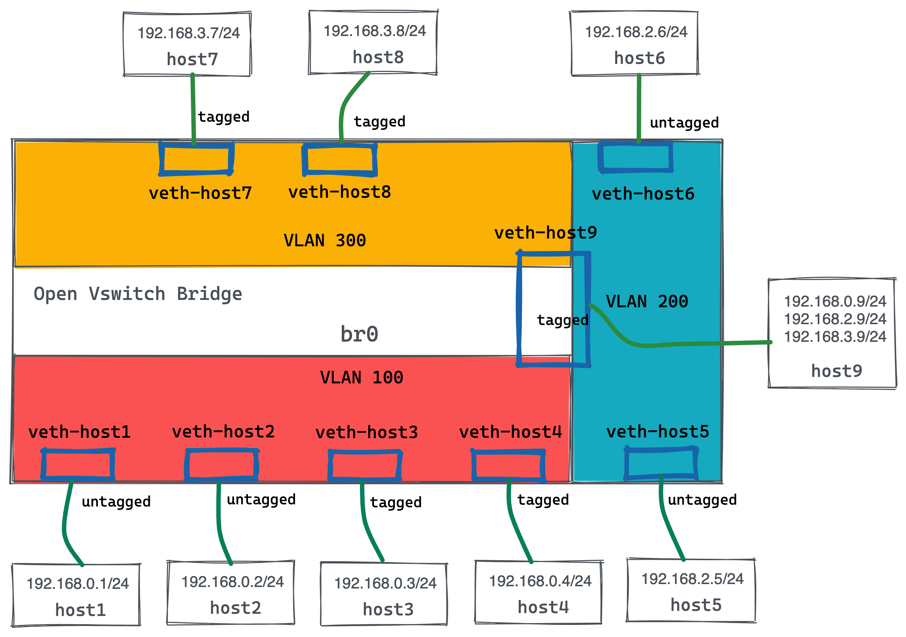
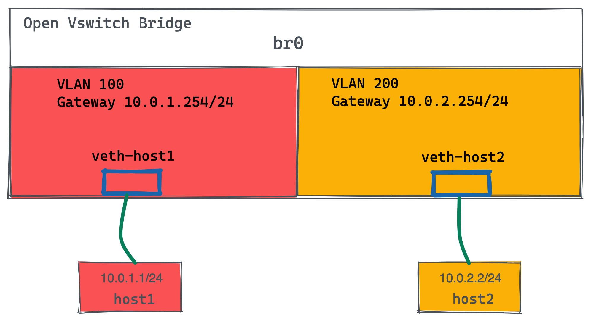

= Switch 
:toc: manual

== 1 Switch 1 VLAN

image:img/ovs-1switch-1vlan.png[]

=== 控制平面配置

[source, bash]
.*1. 编辑 faucet 配置文件/etc/faucet/faucet.yaml，添加如下内容*
----
vlans:
  office:
    vid: 100
    description: "office network"
dps:
  sw1:
    dp_id: 0x1
    hardware: "Open vSwitch"
    interfaces:
      1:
        name: "host1"
        description: "host1 network namespace"
        native_vlan: office
      2:
        name: "host2"
        description: "host2 network namespace"
        native_vlan: office
      3:
        name: "host3"
        description: "host3 network namespace"
        native_vlan: office
      4:
        name: "host4"
        description: "host4 network namespace"
        native_vlan: office
----

[source, bash]
.*2. 重新加载服务*
----
sudo systemctl reload faucet
----

=== 数据平面配置

[source, bash]
.*1. 添加 4 个 Host*
----
create_ns host1 192.168.0.1/24
create_ns host2 192.168.0.2/24
create_ns host3 192.168.0.3/24
create_ns host4 192.168.0.4/24
----

[source, bash]
.*2. 添加 Switch 配置*
----
sudo ovs-vsctl add-br br0 \
-- set bridge br0 other-config:datapath-id=0000000000000001 \
-- set bridge br0 other-config:disable-in-band=true \
-- set bridge br0 fail_mode=secure \
-- add-port br0 veth-host1 -- set interface veth-host1 ofport_request=1 \
-- add-port br0 veth-host2 -- set interface veth-host2 ofport_request=2 \
-- add-port br0 veth-host3 -- set interface veth-host3 ofport_request=3 \
-- add-port br0 veth-host4 -- set interface veth-host4 ofport_request=4 \
-- set-controller br0 tcp:127.0.0.1:6653 tcp:127.0.0.1:6654
----

=== 连通测试

[source, bash]
.*host 互 ping 测试*
----
for i in 1 2 3 4 ; do for j in 1 2 3 4 ; do as_ns host$i ping 192.168.0.$j -c3 ; done ; done
----

== 1 Switch 3 VLAN

如上图所示，共三个VLAN：

* host1, host2, host3, host4 位于 VLAN 100
* host5, host6 位于 VLAN 200
* host7, host8 位于 VLAN 300
* host9 横跨三个 VLAN

从是否打 tag 区分：

* untagged ports: 1, 2, 5, 6
* tagged ports: 3, 4, 7, 8, 9

=== 控制平面配置

[source, bash]
.*1. 编辑 /etc/faucet/faucet.yaml，添加如下内容*
----
vlans:
  vlan100:
    vid: 100
  vlan200:
    vid: 200
  vlan300:
    vid: 300
dps:
  sw1:
    dp_id: 0x1
    hardware: "Open vSwitch"
    interfaces:
      1:
        name: "host1"
        description: "host2 network namespace"
        native_vlan: vlan100
      2:
        name: "host2"
        description: "host2 network namespace"
        native_vlan: vlan100
      3:
        name: "host3"
        tagged_vlans: [vlan100]
      4:
        name: "host4"
        tagged_vlans: [vlan100]
      5:
        name: "host5"
        native_vlan: vlan200
      6:
        name: "host6"
        native_vlan: vlan200
      7:
        name: "host7"
        tagged_vlans: [vlan300]
      8:
        name: "host8"
        tagged_vlans: [vlan300]
      9:
        name: "host9"
        tagged_vlans: [vlan100,vlan200,vlan300]
----

[source, bash]
.*2. faucet 控制器重新加载*
----
sudo systemctl reload faucet
----

=== 数据平面配置

[source, bash]
.*1. VLAN 100 中创建 untagged host1 和 host2*
----
create_ns host1 192.168.0.1/24
create_ns host2 192.168.0.2/24
sudo ovs-vsctl add-br br0 \
-- set bridge br0 other-config:datapath-id=0000000000000001 \
-- set bridge br0 other-config:disable-in-band=true \
-- set bridge br0 fail_mode=secure \
-- add-port br0 veth-host1 -- set interface veth-host1 ofport_request=1 \
-- add-port br0 veth-host2 -- set interface veth-host2 ofport_request=2 \
-- set-controller br0 tcp:127.0.0.1:6653 tcp:127.0.0.1:6654
----

[source, bash]
.*2. VLAN 100 中创建 tagged host3 和 host4*
----
create_ns host3 0.0.0.0
create_ns host4 0.0.0.0
create_ns host3 0.0.0.0
create_ns host4 0.0.0.0
add_tagged_interface host3 100 192.168.0.3/24
add_tagged_interface host4 100 192.168.0.4/24
----

[source, bash]
.*3. VLAN 200 中创建 untagged host5 和 host6*
----
create_ns host5 192.168.2.5/24
create_ns host6 192.168.2.6/24
----

[source, bash]
.*4. VLAN 300 中创建 tagged host7 和 host8*
----
create_ns host7 0.0.0.0
create_ns host8 0.0.0.0
add_tagged_interface host7 300 192.168.3.7/24
add_tagged_interface host8 300 192.168.3.8/24
----

[source, bash]
.*5. 添加 tagged host9*
----
create_ns host9 0.0.0.0
add_tagged_interface host9 100 192.168.0.9/24
add_tagged_interface host9 200 192.168.2.9/24
add_tagged_interface host9 300 192.168.3.9/24
----

[source, bash]
.*6. host3 - host9 连接到交换机*
----
sudo ovs-vsctl add-port br0 veth-host3 -- set interface veth-host3 ofport_request=3 \
-- add-port br0 veth-host4 -- set interface veth-host4 ofport_request=4 \
-- add-port br0 veth-host5 -- set interface veth-host5 ofport_request=5 \
-- add-port br0 veth-host6 -- set interface veth-host6 ofport_request=6 \
-- add-port br0 veth-host7 -- set interface veth-host7 ofport_request=7 \
-- add-port br0 veth-host8 -- set interface veth-host8 ofport_request=8 \
-- add-port br0 veth-host9 -- set interface veth-host9 ofport_request=9
----

=== 连通测试

[source, bash]
.*1. 同 VLAN 中 host 互 ping(成功)*
----
for i in 1 2 3 4 9 ; do for j in 1 2 3 4 9 ; do as_ns host$i ping 192.168.0.$j -c3 ; done ; done
for i in 5 6 9 ; do for j in 5 6 9 ; do as_ns host$i ping 192.168.2.$j -c3 ; done ; done
for i in 7 8 9 ; do for j in 7 8 9 ; do as_ns host$i ping 192.168.3.$j -c3 ; done ; done
----

[source, bash]
.*2. 不同 VLAN host ping(失败)*
----
for i in 1 2 3 4  ; do for j in 5 6 ; do as_ns host$i ping 192.168.2.$j -c3 ; done ; done
for i in 1 2 3 4  ; do for j in 7 8 ; do as_ns host$i ping 192.168.3.$j -c3 ; done ; done
----

[source, bash]
.*3. 分别在 host1 和 host3 ping host9(Native VLAN Vs Tagged VLAN)*
----
$ as_ns host1 ping 192.168.0.9 -c2
PING 192.168.0.9 (192.168.0.9) 56(84) bytes of data.
64 bytes from 192.168.0.9: icmp_seq=1 ttl=64 time=0.720 ms
64 bytes from 192.168.0.9: icmp_seq=2 ttl=64 time=0.096 ms

$ as_ns host3 ping 192.168.0.9 -c2
PING 192.168.0.9 (192.168.0.9) 56(84) bytes of data.
64 bytes from 192.168.0.9: icmp_seq=1 ttl=64 time=0.467 ms
64 bytes from 192.168.0.9: icmp_seq=2 ttl=64 time=0.061 ms
----

[source, bash]
.*4. 对应交换机口上抓包*
----
$ sudo tcpdump -l -e -n -i veth-host1 icmp
08:27:10.387834 92:20:d0:47:15:55 > de:02:53:53:8e:48, ethertype IPv4 (0x0800), length 98: 192.168.0.1 > 192.168.0.9: ICMP echo request, id 6309, seq 1, length 64
08:27:10.388518 de:02:53:53:8e:48 > 92:20:d0:47:15:55, ethertype IPv4 (0x0800), length 98: 192.168.0.9 > 192.168.0.1: ICMP echo reply, id 6309, seq 1, length 64
08:27:11.389582 92:20:d0:47:15:55 > de:02:53:53:8e:48, ethertype IPv4 (0x0800), length 98: 192.168.0.1 > 192.168.0.9: ICMP echo request, id 6309, seq 2, length 64
08:27:11.389636 de:02:53:53:8e:48 > 92:20:d0:47:15:55, ethertype IPv4 (0x0800), length 98: 192.168.0.9 > 192.168.0.1: ICMP echo reply, id 6309, seq 2, length 64

$ sudo tcpdump -l -e -n -i veth-host3 icmp
08:27:45.714075 16:d8:4e:a6:35:9f > de:02:53:53:8e:48, ethertype 802.1Q (0x8100), length 102: vlan 100, p 0, ethertype IPv4, 192.168.0.3 > 192.168.0.9: ICMP echo request, id 6314, seq 1, length 64
08:27:45.714520 de:02:53:53:8e:48 > 16:d8:4e:a6:35:9f, ethertype 802.1Q (0x8100), length 102: vlan 100, p 0, ethertype IPv4, 192.168.0.9 > 192.168.0.3: ICMP echo reply, id 6314, seq 1, length 64
08:27:46.717684 16:d8:4e:a6:35:9f > de:02:53:53:8e:48, ethertype 802.1Q (0x8100), length 102: vlan 100, p 0, ethertype IPv4, 192.168.0.3 > 192.168.0.9: ICMP echo request, id 6314, seq 2, length 64
08:27:46.717718 de:02:53:53:8e:48 > 16:d8:4e:a6:35:9f, ethertype 802.1Q (0x8100), length 102: vlan 100, p 0, ethertype IPv4, 192.168.0.9 > 192.168.0.3: ICMP echo reply, id 6314, seq 2, length 64
----

NOTE: Tagged VLAN 抓包中有 802.1Q 标记。

== 1 Switch 2 VLAN 1 Router

如图所示所示，有一个交换机，2 个VLAN，每个 VLAN 中有 1 个Host，跨VLAN流量通过路由器转发。

=== 控制平面配置

[source, bash]
----
vlans:
  vlan100:
    vid: 100
    faucet_vips: ["10.0.0.254/24"]  # Faucet's virtual IP address for vlan100
    faucet_mac: "00:00:00:00:00:11"
  vlan200:
    vid: 200
    faucet_vips: ["10.0.1.254/24"]  # Faucet's virtual IP address for vlan200
    faucet_mac: "00:00:00:00:00:22"
routers:
  router-1:                           # Router name
    vlans: [vlan100, vlan200]       # Names of vlans to allow routing between
dps:
  sw1:
    dp_id: 0x1
    hardware: "Open vSwitch"
    interfaces:
      1:
        name: "host1"
        description: "host1 network namespace"
        native_vlan: vlan100
      2:
        name: "host2"
        description: "host2 network namespace"
        native_vlan: vlan200
----

[source, bash]
.*2. 重新加载服务*
----
sudo systemctl reload faucet
----

=== 数据平面配置

[source, bash]
.*1. Host 配置*
----
create_ns host1 10.0.1.1/24
create_ns host2 10.0.2.2/24
as_ns host1 ip route add default via 10.0.1.254 dev veth0
as_ns host2 ip route add default via 10.0.2.254 dev veth0
----

[source, bash]
.*2. OVS 配置*
----
sudo ovs-vsctl add-br br0 \
-- set bridge br0 other-config:datapath-id=0000000000000001 \
-- set bridge br0 other-config:disable-in-band=true \
-- set bridge br0 fail_mode=secure \
-- add-port br0 veth-host1 -- set interface veth-host1 ofport_request=1 \
-- add-port br0 veth-host2 -- set interface veth-host2 ofport_request=2 \
-- set-controller br0 tcp:127.0.0.1:6653 tcp:127.0.0.1:6654
----

=== 连通测试

[source, bash]
.*1. host1 ping host2*
----
as_ns host1 ping 10.0.2.2 -c3
----

[source, bash]
.*2. host2 抓包*
----
$ as_ns host2 tcpdump -l -e -n -i veth0
10:10:40.151867 00:00:00:00:00:22 > c6:30:a7:0b:c6:80, ethertype IPv4 (0x0800), length 98: 10.0.1.1 > 10.0.2.2: ICMP echo request, id 2823, seq 213, length 64
10:10:40.151900 c6:30:a7:0b:c6:80 > 00:00:00:00:00:22, ethertype IPv4 (0x0800), length 98: 10.0.2.2 > 10.0.1.1: ICMP echo reply, id 2823, seq 213, length 64
10:10:41.176232 00:00:00:00:00:22 > c6:30:a7:0b:c6:80, ethertype IPv4 (0x0800), length 98: 10.0.1.1 > 10.0.2.2: ICMP echo request, id 2823, seq 214, length 64
10:10:41.176297 c6:30:a7:0b:c6:80 > 00:00:00:00:00:22, ethertype IPv4 (0x0800), length 98: 10.0.2.2 > 10.0.1.1: ICMP echo reply, id 2823, seq 214, length 64
10:10:42.200186 00:00:00:00:00:22 > c6:30:a7:0b:c6:80, ethertype IPv4 (0x0800), length 98: 10.0.1.1 > 10.0.2.2: ICMP echo request, id 2823, seq 215, length 64
10:10:42.200252 c6:30:a7:0b:c6:80 > 00:00:00:00:00:22, ethertype IPv4 (0x0800), length 98: 10.0.2.2 > 10.0.1.1: ICMP echo reply, id 2823, seq 215, length 64
----

== 2 Switch 1 VLAN

=== 控制平面配置

[source, bash]
.*1. 更新/etc/faucet/faucet.yaml*
----
vlans:
  hosts:
    vid: 100
dps:
  br0:
    dp_id: 0x1
    hardware: "Open vSwitch"
    stack:
      priority: 1
    interfaces:
      1:
        description: "host1 network namespace"
        native_vlan: hosts
      2:
        description: "br0 stack link to br1"
        stack:
          dp: br1
          port: 2
  br1:
    dp_id: 0x2
    hardware: "Open vSwitch"
    interfaces:
      1:
        description: "host2 network namespace"
        native_vlan: hosts
      2:
        description: "br1 stack link to br0"
        stack:
          dp: br0
          port: 2
----

[source, bash]
.*2. 重新加载服务*
----
sudo systemctl reload faucet
----

=== 数据平面配置

[source, bash]
.*1. 添加 2 个 Host*
----
create_ns host1 10.0.1.1/24
create_ns host2 10.0.1.2/24
----

[source, bash]
.*2. 增加 OVS 配置*
----
sudo ovs-vsctl add-br br0 \
-- set bridge br0 other-config:datapath-id=0000000000000001 \
-- set bridge br0 other-config:disable-in-band=true \
-- set bridge br0 fail_mode=secure \
-- add-port br0 veth-host1 -- set interface veth-host1 ofport_request=1 \
-- set-controller br0 tcp:127.0.0.1:6653 tcp:127.0.0.1:6654

sudo ovs-vsctl add-br br1 \
-- set bridge br1 other-config:datapath-id=0000000000000002 \
-- set bridge br1 other-config:disable-in-band=true \
-- set bridge br1 fail_mode=secure \
-- add-port br1 veth-host2 -- set interface veth-host2 ofport_request=1 \
-- set-controller br1 tcp:127.0.0.1:6653 tcp:127.0.0.1:6654
----

[source, bash]
.*3. 将 br0 port 2 和 br1 port 2 连接*
----
inter_switch_link br0:2 br1:2
----

=== 连通测试

[source, bash]
.*1. 查看 /var/log/faucet/faucet.log 日志*
----
Dec 28 15:46:55 faucet.valve INFO     DPID 2 (0x2) br1 LLDP on 0e:00:00:00:00:01, Port 2 from 0e:00:00:00:00:01 (remote DPID 1 (0x1), port 2) state UP
Dec 28 15:46:55 faucet.valve INFO     DPID 1 (0x1) br0 LLDP on 0e:00:00:00:00:01, Port 2 from 0e:00:00:00:00:01 (remote DPID 2 (0x2), port 2) state UP
Dec 28 15:47:17 faucet.valve INFO     DPID 2 (0x2) br1 L2 learned on Port 2 06:a3:79:5a:b7:31 (L2 type 0x0806, L2 dst ff:ff:ff:ff:ff:ff, L3 src 10.0.1.1, L3 dst 10.0.1.2) Port 2 VLAN 100 (1 hosts total) from remote DP br0 Port 2
Dec 28 15:47:17 faucet.valve INFO     DPID 2 (0x2) br1 L2 learned on Port 1 3a:a7:d5:62:08:91 (L2 type 0x0806, L2 dst 06:a3:79:5a:b7:31, L3 src 10.0.1.2, L3 dst 10.0.1.1) Port 1 VLAN 100 (2 hosts total)
Dec 28 15:47:17 faucet.valve INFO     DPID 1 (0x1) br0 L2 learned on Port 2 3a:a7:d5:62:08:91 (L2 type 0x0806, L2 dst 06:a3:79:5a:b7:31, L3 src 10.0.1.2, L3 dst 10.0.1.1) Port 2 VLAN 100 (2 hosts total) from remote DP br1 Port 2
Dec 28 15:50:25 faucet.valve INFO     DPID 1 (0x1) br0 L2 learned on Port 1 06:a3:79:5a:b7:31 (L2 type 0x0800, L2 dst 3a:a7:d5:62:08:91, L3 src 10.0.1.1, L3 dst 10.0.1.2) Port 1 VLAN 100 (2 hosts total)
----

[source, bash]
.*2. Ping 测试*
----
as_ns host1 ping 10.0.1.2 -c3
as_ns host2 ping 10.0.1.1 -c3
----

== 2 Switch 2 VLAN 1 Router

=== 控制平面配置

[source, bash]
.*1. 更新/etc/faucet/faucet.yaml*
----
vlans:
  hosts:
    vid: 100
    faucet_vips: ["10.0.1.254/24"]
    faucet_mac: "00:00:00:00:00:11"
  servers:
    vid: 200
    faucet_vips: ["10.0.2.254/24"]
    faucet_mac: "00:00:00:00:00:22"
routers:
  router-1:
    vlans: [hosts, servers]
dps:
  br0:
    dp_id: 0x1
    hardware: "Open vSwitch"
    stack:
      priority: 1
    interfaces:
      1:
        description: "host1 network namespace"
        native_vlan: hosts
      2:
        description: "server1 network namespace"
        native_vlan: servers
      3:
        description: "br0 stack link to br1"
        stack:
          dp: br1
          port: 3
  br1:
    dp_id: 0x2
    hardware: "Open vSwitch"
    interfaces:
      1:
        description: "host2 network namespace"
        native_vlan: hosts
      2:
        description: "server2 network namespace"
        native_vlan: servers
      3:
        description: "br1 stack link to br0"
        stack:
          dp: br0
          port: 3
----

[source, bash]
.*2. 重新加载服务*
----
sudo systemctl reload faucet
----

=== 数据平面配置

[source, bash]
.*1. 添加 Host*
----
create_ns host1 10.0.1.1/24
create_ns host2 10.0.1.2/24
create_ns server1 10.0.2.1/24
create_ns server2 10.0.2.2/24
----

[source, bash]
.*2. Host 添加默认网关*
----
as_ns host1 ip route add default via 10.0.1.254
as_ns host2 ip route add default via 10.0.1.254
as_ns server1 ip route add default via 10.0.2.254
as_ns server2 ip route add default via 10.0.2.254
----

[source, bash]
.*3. OVS 配置*
----
sudo ovs-vsctl add-br br0 \
-- set bridge br0 other-config:datapath-id=0000000000000001 \
-- set bridge br0 other-config:disable-in-band=true \
-- set bridge br0 fail_mode=secure \
-- add-port br0 veth-host1 -- set interface veth-host1 ofport_request=1 \
-- add-port br0 veth-server1 -- set interface veth-server1 ofport_request=2 \
-- set-controller br0 tcp:127.0.0.1:6653 tcp:127.0.0.1:6654

sudo ovs-vsctl add-br br1 \
-- set bridge br1 other-config:datapath-id=0000000000000002 \
-- set bridge br1 other-config:disable-in-band=true \
-- set bridge br1 fail_mode=secure \
-- add-port br1 veth-host2 -- set interface veth-host2 ofport_request=1 \
-- add-port br1 veth-server2 -- set interface veth-server2 ofport_request=2 \
-- set-controller br1 tcp:127.0.0.1:6653 tcp:127.0.0.1:6654
----

[source, bash]
.*4. br0 和 br1 互联*
----
inter_switch_link br0:3 br1:3
----

=== 连通测试

[source, bash]
.*1. host 和 server 互 ping*
----
for i in 1 2 ;do for j in 1 2 ; do as_ns host$i ping 10.0.2.$j -c3 ; done ; done
----

[source, bash]
.*2. 在 br0 Port 3 口抓包*
----
$ sudo tcpdump -l -e -n -i l-br0_3-br1_3
16:43:08.408924 0e:00:00:00:00:01 > 01:80:c2:00:00:0e, ethertype LLDP (0x88cc), length 75: LLDP, length 61: br0
16:43:08.409017 0e:00:00:00:00:01 > 01:80:c2:00:00:0e, ethertype LLDP (0x88cc), length 75: LLDP, length 61: br1
16:43:16.828050 00:00:00:00:00:22 > 12:0a:0c:9b:f1:94, ethertype ARP (0x0806), length 60: Request who-has 10.0.2.2 tell 10.0.2.254, length 46
16:43:16.828156 00:00:00:00:00:11 > e6:ed:57:96:3c:85, ethertype ARP (0x0806), length 60: Request who-has 10.0.1.2 tell 10.0.1.254, length 46
16:43:16.828502 00:00:00:00:00:22 > ca:45:be:b5:39:d2, ethertype ARP (0x0806), length 60: Request who-has 10.0.2.1 tell 10.0.2.254, length 46
16:43:16.828625 00:00:00:00:00:11 > 9e:d7:81:79:8b:5d, ethertype ARP (0x0806), length 60: Request who-has 10.0.1.1 tell 10.0.1.254, length 46
16:43:23.782973 00:00:00:00:00:22 > 12:0a:0c:9b:f1:94, ethertype 802.1Q (0x8100), length 102: vlan 200, p 0, ethertype IPv4, 10.0.1.1 > 10.0.2.2: ICMP echo request, id 7178, seq 1, length 64
16:43:23.783133 00:00:00:00:00:11 > 9e:d7:81:79:8b:5d, ethertype 802.1Q (0x8100), length 102: vlan 100, p 0, ethertype IPv4, 10.0.2.2 > 10.0.1.1: ICMP echo reply, id 7178, seq 1, length 64
16:43:24.784170 00:00:00:00:00:22 > 12:0a:0c:9b:f1:94, ethertype 802.1Q (0x8100), length 102: vlan 200, p 0, ethertype IPv4, 10.0.1.1 > 10.0.2.2: ICMP echo request, id 7178, seq 2, length 64
16:43:24.784198 00:00:00:00:00:11 > 9e:d7:81:79:8b:5d, ethertype 802.1Q (0x8100), length 102: vlan 100, p 0, ethertype IPv4, 10.0.2.2 > 10.0.1.1: ICMP echo reply, id 7178, seq 2, length 64
16:43:25.807420 00:00:00:00:00:22 > 12:0a:0c:9b:f1:94, ethertype 802.1Q (0x8100), length 102: vlan 200, p 0, ethertype IPv4, 10.0.1.1 > 10.0.2.2: ICMP echo request, id 7178, seq 3, length 64
16:43:25.807509 00:00:00:00:00:11 > 9e:d7:81:79:8b:5d, ethertype 802.1Q (0x8100), length 102: vlan 100, p 0, ethertype IPv4, 10.0.2.2 > 10.0.1.1: ICMP echo reply, id 7178, seq 3, length 64
16:43:25.821270 00:00:00:00:00:22 > ca:45:be:b5:39:d2, ethertype 802.1Q (0x8100), length 102: vlan 200, p 0, ethertype IPv4, 10.0.1.2 > 10.0.2.1: ICMP echo request, id 7182, seq 1, length 64
16:43:25.821446 00:00:00:00:00:11 > e6:ed:57:96:3c:85, ethertype 802.1Q (0x8100), length 102: vlan 100, p 0, ethertype IPv4, 10.0.2.1 > 10.0.1.2: ICMP echo reply, id 7182, seq 1, length 64
16:43:26.831589 00:00:00:00:00:22 > ca:45:be:b5:39:d2, ethertype 802.1Q (0x8100), length 102: vlan 200, p 0, ethertype IPv4, 10.0.1.2 > 10.0.2.1: ICMP echo request, id 7182, seq 2, length 64
16:43:26.831660 00:00:00:00:00:11 > e6:ed:57:96:3c:85, ethertype 802.1Q (0x8100), length 102: vlan 100, p 0, ethertype IPv4, 10.0.2.1 > 10.0.1.2: ICMP echo reply, id 7182, seq 2, length 64
16:43:27.855472 00:00:00:00:00:22 > ca:45:be:b5:39:d2, ethertype 802.1Q (0x8100), length 102: vlan 200, p 0, ethertype IPv4, 10.0.1.2 > 10.0.2.1: ICMP echo request, id 7182, seq 3, length 64
16:43:27.855576 00:00:00:00:00:11 > e6:ed:57:96:3c:85, ethertype 802.1Q (0x8100), length 102: vlan 100, p 0, ethertype IPv4, 10.0.2.1 > 10.0.1.2: ICMP echo reply, id 7182, seq 3, length 64
----

[source, bash]
.*3. host1 ping server1*
----
as_ns host1 ping 10.0.2.1 -c3
----

[source, bash]
.*4. 在 br0 Port 3 口抓包(没有 ICPM 包)*
----
$ sudo tcpdump -l -e -n -i l-br0_3-br1_3
16:51:16.817890 0e:00:00:00:00:01 > 01:80:c2:00:00:0e, ethertype LLDP (0x88cc), length 75: LLDP, length 61: br0
16:51:16.818580 0e:00:00:00:00:01 > 01:80:c2:00:00:0e, ethertype LLDP (0x88cc), length 75: LLDP, length 61: br1
16:51:27.597370 00:00:00:00:00:22 > ca:45:be:b5:39:d2, ethertype ARP (0x0806), length 60: Request who-has 10.0.2.1 tell 10.0.2.254, length 46
16:51:39.583223 00:00:00:00:00:11 > 9e:d7:81:79:8b:5d, ethertype ARP (0x0806), length 60: Request who-has 10.0.1.1 tell 10.0.1.254, length 46
16:51:45.607712 00:00:00:00:00:22 > 12:0a:0c:9b:f1:94, ethertype ARP (0x0806), length 60: Request who-has 10.0.2.2 tell 10.0.2.254, length 46
16:51:45.608139 00:00:00:00:00:11 > e6:ed:57:96:3c:85, ethertype ARP (0x0806), length 60: Request who-has 10.0.1.2 tell 10.0.1.254, length 46
----

== 3 Switch 2 VLAN 1 Tunnel

=== 控制平面配置

[source, bash]
.*1. 更新 /etc/faucet/faucet.yaml*
----
acls:
 tunnel-to-host1:
 - rule:
   actions:
     output:
       tunnel:
         type: 'vlan'
         tunnel_id: 901
         dp: br0
         port: 1
 tunnel-to-host2:
 - rule:
   actions:
     output:
       tunnel:
         type: 'vlan'
         tunnel_id: 902
         dp: br2
         port: 1
vlans:
  host1:
    vid: 101
  host2:
    vid: 102
dps:
  br0:
    dp_id: 0x1
    hardware: "Open vSwitch"
    stack:
      priority: 1
    interfaces:
      1:
        description: "host1 network namespace"
        native_vlan: host1
        acl_in: tunnel-to-host2
      2:
        description: "br0 stack link to br1"
        stack:
          dp: br1
          port: 1
  br1:
    dp_id: 0x2
    hardware: "Open vSwitch"
    interfaces:
      1:
        description: "br1 stack link to br0"
        stack:
          dp: br0
          port: 2
      2:
        description: "br1 stack link to br2"
        stack:
          dp: br2
          port: 2
  br2:
    dp_id: 0x3
    hardware: "Open vSwitch"
    interfaces:
      1:
        description: "host2 network namespace"
        native_vlan: host2
        acl_in: tunnel-to-host1
      2:
        description: "br2 stack link to br1"
        stack:
          dp: br1
          port: 2
----

[source, bash]
.*2. 重新加载服务*
----
sudo systemctl reload faucet
----

=== 数据平面配置

[source, bash]
.*1. 创建 Host*
----
create_ns host1 10.0.1.1/24
create_ns host2 10.0.1.2/24
----

[source, bash]
.*2. OVS 配置*
----
sudo ovs-vsctl add-br br0 \
-- set bridge br0 other-config:datapath-id=0000000000000001 \
-- set bridge br0 other-config:disable-in-band=true \
-- set bridge br0 fail_mode=secure \
-- add-port br0 veth-host1 -- set interface veth-host1 ofport_request=1 \
-- set-controller br0 tcp:127.0.0.1:6653 tcp:127.0.0.1:6654

sudo ovs-vsctl add-br br1 \
-- set bridge br1 other-config:datapath-id=0000000000000002 \
-- set bridge br1 other-config:disable-in-band=true \
-- set bridge br1 fail_mode=secure \
-- set-controller br1 tcp:127.0.0.1:6653 tcp:127.0.0.1:6654

sudo ovs-vsctl add-br br2 \
-- set bridge br2 other-config:datapath-id=0000000000000003 \
-- set bridge br2 other-config:disable-in-band=true \
-- set bridge br2 fail_mode=secure \
-- add-port br2 veth-host2 -- set interface veth-host2 ofport_request=1 \
-- set-controller br2 tcp:127.0.0.1:6653 tcp:127.0.0.1:6654
----

[source, bash]
.*3. 交换机互联配置*
----
inter_switch_link br0:2 br1:1
inter_switch_link br1:2 br2:2
----

=== 连通测试

[source, bash]
.*1. host1 ping host2*
----
as_ns host1 ping 10.0.1.2 -c3
----

[source, bash]
.*2. 在 br1 Port 2 口抓包*
----
$ sudo tcpdump -l -e -n -i l-br1_2-br2_2
17:52:50.505589 0e:00:00:00:00:01 > 01:80:c2:00:00:0e, ethertype LLDP (0x88cc), length 75: LLDP, length 61: br1
17:52:50.506778 0e:00:00:00:00:01 > 01:80:c2:00:00:0e, ethertype LLDP (0x88cc), length 75: LLDP, length 61: br2
17:52:53.915819 32:4d:20:13:6a:ce > 33:33:00:00:00:02, ethertype IPv6 (0x86dd), length 70: fe80::304d:20ff:fe13:6ace > ff02::2: ICMP6, router solicitation, length 16
17:52:55.035316 4a:9e:04:c6:e1:19 > 26:63:0a:65:14:21, ethertype 802.1Q (0x8100), length 102: vlan 902, p 3, ethertype IPv4, 10.0.1.1 > 10.0.1.2: ICMP echo request, id 9412, seq 1, length 64
17:52:55.035402 26:63:0a:65:14:21 > 4a:9e:04:c6:e1:19, ethertype 802.1Q (0x8100), length 102: vlan 901, p 3, ethertype IPv4, 10.0.1.2 > 10.0.1.1: ICMP echo reply, id 9412, seq 1, length 64
17:52:56.060190 4a:9e:04:c6:e1:19 > 26:63:0a:65:14:21, ethertype 802.1Q (0x8100), length 102: vlan 902, p 3, ethertype IPv4, 10.0.1.1 > 10.0.1.2: ICMP echo request, id 9412, seq 2, length 64
17:52:56.060237 26:63:0a:65:14:21 > 4a:9e:04:c6:e1:19, ethertype 802.1Q (0x8100), length 102: vlan 901, p 3, ethertype IPv4, 10.0.1.2 > 10.0.1.1: ICMP echo reply, id 9412, seq 2, length 64
17:52:57.088206 4a:9e:04:c6:e1:19 > 26:63:0a:65:14:21, ethertype 802.1Q (0x8100), length 102: vlan 902, p 3, ethertype IPv4, 10.0.1.1 > 10.0.1.2: ICMP echo request, id 9412, seq 3, length 64
17:52:57.088290 26:63:0a:65:14:21 > 4a:9e:04:c6:e1:19, ethertype 802.1Q (0x8100), length 102: vlan 901, p 3, ethertype IPv4, 10.0.1.2 > 10.0.1.1: ICMP echo reply, id 9412, seq 3, length 64
----

== 3 Switch 1 VLAN(Loop)

=== 管理平面配置

[source, bash]
.*1. 更新 /etc/faucet/faucet.yaml*
----
vlans:
  hosts:
    vid: 100
dps:
  br0:
    dp_id: 0x1
    hardware: "Open vSwitch"
    stack:
      priority: 1
    interfaces:
      1:
        description: "host1 network namespace"
        native_vlan: hosts
      2:
        description: "br0 stack link to br1"
        stack:
          dp: br1
          port: 2
      3:
        description: "br0 stack link to br2"
        stack:
          dp: br2
          port: 2
  br1:
    dp_id: 0x2
    hardware: "Open vSwitch"
    interfaces:
      1:
        description: "host2 network namespace"
        native_vlan: hosts
      2:
        description: "br1 stack link to br0"
        stack:
          dp: br0
          port: 2
      3:
        description: "br1 stack link to br2"
        stack:
          dp: br2
          port: 3
  br2:
    dp_id: 0x3
    hardware: "Open vSwitch"
    interfaces:
      1:
        description: "host3 network namespace"
        native_vlan: hosts
      2:
        description: "br2 stack link to br0"
        stack:
          dp: br0
          port: 3
      3:
        description: "br2 stack link to br1"
        stack:
          dp: br1
          port: 3
----

[source, bash]
.*2. 重新加载服务*
----
sudo systemctl reload faucet
----

=== 数据平面配置

[source, bash]
.*1. 添加 Host*
----
create_ns host1 10.0.1.1/24
create_ns host2 10.0.1.2/24
create_ns host3 10.0.1.3/24
----

[source, bash]
.*2. 添加 Switch*
----
sudo ovs-vsctl add-br br0 \
-- set bridge br0 other-config:datapath-id=0000000000000001 \
-- set bridge br0 other-config:disable-in-band=true \
-- set bridge br0 fail_mode=secure \
-- add-port br0 veth-host1 -- set interface veth-host1 ofport_request=1 \
-- set-controller br0 tcp:127.0.0.1:6653 tcp:127.0.0.1:6654

sudo ovs-vsctl add-br br1 \
-- set bridge br1 other-config:datapath-id=0000000000000002 \
-- set bridge br1 other-config:disable-in-band=true \
-- set bridge br1 fail_mode=secure \
-- add-port br1 veth-host2 -- set interface veth-host2 ofport_request=1 \
-- set-controller br1 tcp:127.0.0.1:6653 tcp:127.0.0.1:6654

sudo ovs-vsctl add-br br2 \
-- set bridge br2 other-config:datapath-id=0000000000000003 \
-- set bridge br2 other-config:disable-in-band=true \
-- set bridge br2 fail_mode=secure \
-- add-port br2 veth-host3 -- set interface veth-host3 ofport_request=1 \
-- set-controller br2 tcp:127.0.0.1:6653 tcp:127.0.0.1:6654
----

[source, bash]
.*3. Switch 互联配置*
----
inter_switch_link br0:2 br1:2
inter_switch_link br0:3 br2:2
inter_switch_link br1:3 br2:3
----

=== 连通测试

[source, bash]
.*1. host1 ping host2*
----
as_ns host1 ping 10.0.1.2
----

[source, bash]
.*2. 在 br2 Port 2 上抓包*
----
$ sudo tcpdump -l -e -n -i l-br1_2-br0_2
18:28:27.454463 0e:00:00:00:00:01 > 01:80:c2:00:00:0e, ethertype LLDP (0x88cc), length 75: LLDP, length 61: br0
18:28:27.455457 0e:00:00:00:00:01 > 01:80:c2:00:00:0e, ethertype LLDP (0x88cc), length 75: LLDP, length 61: br1
18:28:27.676093 da:bb:a9:7a:38:cb > 9a:1e:24:58:c5:65, ethertype 802.1Q (0x8100), length 102: vlan 100, p 0, ethertype IPv4, 10.0.1.1 > 10.0.1.2: ICMP echo request, id 10650, seq 198, length 64
18:28:27.676141 9a:1e:24:58:c5:65 > da:bb:a9:7a:38:cb, ethertype 802.1Q (0x8100), length 102: vlan 100, p 0, ethertype IPv4, 10.0.1.2 > 10.0.1.1: ICMP echo reply, id 10650, seq 198, length 64
18:28:28.700539 da:bb:a9:7a:38:cb > 9a:1e:24:58:c5:65, ethertype 802.1Q (0x8100), length 102: vlan 100, p 0, ethertype IPv4, 10.0.1.1 > 10.0.1.2: ICMP echo request, id 10650, seq 199, length 64
18:28:28.700586 9a:1e:24:58:c5:65 > da:bb:a9:7a:38:cb, ethertype 802.1Q (0x8100), length 102: vlan 100, p 0, ethertype IPv4, 10.0.1.2 > 10.0.1.1: ICMP echo reply, id 10650, seq 199, length 64
18:28:29.724889 da:bb:a9:7a:38:cb > 9a:1e:24:58:c5:65, ethertype 802.1Q (0x8100), length 102: vlan 100, p 0, ethertype IPv4, 10.0.1.1 > 10.0.1.2: ICMP echo request, id 10650, seq 200, length 64
----

NOTE: host1 ping host2 数据包链路: `host1` -> `br0/port1` -> `br0/port2` -> `br1/port2` -> `br1/port1` -> `host2`.

[source, bash]
.*3. host1 ping host3*
----
as_ns host1 ping 10.0.1.3
----

[source, bash]
.*4. 在 br2 Port 2 口抓包*
----
$ sudo tcpdump -l -e -n -i l-br2_2-br0_3
18:33:00.874678 0e:00:00:00:00:01 > 01:80:c2:00:00:0e, ethertype LLDP (0x88cc), length 75: LLDP, length 61: br0
18:33:00.875990 0e:00:00:00:00:01 > 01:80:c2:00:00:0e, ethertype LLDP (0x88cc), length 75: LLDP, length 61: br2
18:33:01.340137 da:bb:a9:7a:38:cb > 2a:34:84:86:0c:20, ethertype 802.1Q (0x8100), length 102: vlan 100, p 0, ethertype IPv4, 10.0.1.1 > 10.0.1.3: ICMP echo request, id 11005, seq 119, length 64
18:33:01.340188 2a:34:84:86:0c:20 > da:bb:a9:7a:38:cb, ethertype 802.1Q (0x8100), length 102: vlan 100, p 0, ethertype IPv4, 10.0.1.3 > 10.0.1.1: ICMP echo reply, id 11005, seq 119, length 64
18:33:02.364210 da:bb:a9:7a:38:cb > 2a:34:84:86:0c:20, ethertype 802.1Q (0x8100), length 102: vlan 100, p 0, ethertype IPv4, 10.0.1.1 > 10.0.1.3: ICMP echo request, id 11005, seq 120, length 64
18:33:02.364256 2a:34:84:86:0c:20 > da:bb:a9:7a:38:cb, ethertype 802.1Q (0x8100), length 102: vlan 100, p 0, ethertype IPv4, 10.0.1.3 > 10.0.1.1: ICMP echo reply, id 11005, seq 120, length 64
----

NOTE: host1 ping host3 数据包链路: `host1` -> `br0/port1` -> `br0/port3` -> `br2/port2` -> `br2/port1` -> `host3`.

[source, bash]
.*5. 拆除 `br0/port3` -> `br2/port2` 之间连接*
----
sudo ip link set down l-br0_3-br2_2
sudo ip link set down l-br2_2-br0_3
----

[source, bash]
.*6. 再次执行 host1 ping host3*
----
as_ns host1 ping 10.0.1.3
----

[source, bash]
.*7. 在 br2 Port 3 口抓包*
----
$ sudo tcpdump -l -e -n -i l-br2_3-br1_3
18:41:12.034824 0e:00:00:00:00:01 > 01:80:c2:00:00:0e, ethertype LLDP (0x88cc), length 75: LLDP, length 61: br1
18:41:12.035013 0e:00:00:00:00:01 > 01:80:c2:00:00:0e, ethertype LLDP (0x88cc), length 75: LLDP, length 61: br2
18:41:14.118709 da:bb:a9:7a:38:cb > 2a:34:84:86:0c:20, ethertype 802.1Q (0x8100), length 102: vlan 100, p 0, ethertype IPv4, 10.0.1.1 > 10.0.1.3: ICMP echo request, id 11454, seq 1, length 64
18:41:14.118820 2a:34:84:86:0c:20 > da:bb:a9:7a:38:cb, ethertype 802.1Q (0x8100), length 102: vlan 100, p 0, ethertype IPv4, 10.0.1.3 > 10.0.1.1: ICMP echo reply, id 11454, seq 1, length 64
18:41:15.132197 da:bb:a9:7a:38:cb > 2a:34:84:86:0c:20, ethertype 802.1Q (0x8100), length 102: vlan 100, p 0, ethertype IPv4, 10.0.1.1 > 10.0.1.3: ICMP echo request, id 11454, seq 2, length 64
18:41:15.132239 2a:34:84:86:0c:20 > da:bb:a9:7a:38:cb, ethertype 802.1Q (0x8100), length 102: vlan 100, p 0, ethertype IPv4, 10.0.1.3 > 10.0.1.1: ICMP echo reply, id 11454, seq 2, length 64
----

NOTE: host1 ping host3 数据包链路: `host1` -> `br0/port1` -> `br0/port2` - `br1/port2` -> `br1/port3` -> `br2/port3`  -> `br2/port1` -> `host3`.

== 4 Switch 1 VLAN(Multi-root)

image:img/ovs-4switch-multi-root.png[]

=== 管理平面配置

[source, bash]
.*1. 更新/etc/faucet/faucet.yaml*
----
vlans:
  hosts:
    vid: 100
dps:
  br0:
    dp_id: 0x1
    hardware: "Open vSwitch"
    stack:
      priority: 1
    interfaces:
      1:
        description: "br0 stack link to br2"
        stack:
          dp: br2
          port: 2
      2:
        description: "br0 stack link to br3"
        stack:
          dp: br3
          port: 3
  br1:
    dp_id: 0x2
    hardware: "Open vSwitch"
    stack:
      priority: 1
    interfaces:
      1:
        description: "br1 stack link to br3"
        stack:
          dp: br3
          port: 2
      2:
        description: "br1 stack link to br2"
        stack:
          dp: br2
          port: 3
  br2:
    dp_id: 0x3
    hardware: "Open vSwitch"
    interfaces:
      1:
        description: "host1 network namespace"
        native_vlan: hosts
      2:
        description: "br2 stack link to br0"
        stack:
          dp: br0
          port: 1
      3:
        description: "br2 stack link to br1"
        stack:
          dp: br1
          port: 2
  br3:
    dp_id: 0x4
    hardware: "Open vSwitch"
    interfaces:
      1:
        description: "host2 network namespace"
        native_vlan: hosts
      2:
        description: "br3 stack link to br1"
        stack:
          dp: br1
          port: 1
      3:
        description: "br3 stack link to br0"
        stack:
          dp: br0
          port: 2
----

[source, bash]
.*2. 重新加载服务*
----
sudo systemctl restart faucet
----

=== 数据平面配置

[source, bash]
.*1. 添加 Host*
----
create_ns host1 10.0.1.1/24
create_ns host2 10.0.1.2/24
----

[source, bash]
.*2. 添加 Switch*
----
sudo ovs-vsctl add-br br0 \
-- set bridge br0 other-config:datapath-id=0000000000000001 \
-- set bridge br0 other-config:disable-in-band=true \
-- set bridge br0 fail_mode=secure \
-- set-controller br0 tcp:127.0.0.1:6653 tcp:127.0.0.1:6654

sudo ovs-vsctl add-br br1 \
-- set bridge br1 other-config:datapath-id=0000000000000002 \
-- set bridge br1 other-config:disable-in-band=true \
-- set bridge br1 fail_mode=secure \
-- set-controller br1 tcp:127.0.0.1:6653 tcp:127.0.0.1:6654

sudo ovs-vsctl add-br br2 \
-- set bridge br2 other-config:datapath-id=0000000000000003 \
-- set bridge br2 other-config:disable-in-band=true \
-- set bridge br2 fail_mode=secure \
-- add-port br2 veth-host1 -- set interface veth-host1 ofport_request=1 \
-- set-controller br2 tcp:127.0.0.1:6653 tcp:127.0.0.1:6654

sudo ovs-vsctl add-br br3 \
-- set bridge br3 other-config:datapath-id=0000000000000004 \
-- set bridge br3 other-config:disable-in-band=true \
-- set bridge br3 fail_mode=secure \
-- add-port br3 veth-host2 -- set interface veth-host2 ofport_request=1 \
-- set-controller br3 tcp:127.0.0.1:6653 tcp:127.0.0.1:6654
----

[source, bash]
.*3. 交换机之间连接配置*
----
inter_switch_link br0:1 br2:2
inter_switch_link br0:2 br3:3
inter_switch_link br1:1 br3:2
inter_switch_link br1:2 br2:3
----

=== 连通测试

[source, bash]
.*1. host1 ping host2*
----
as_ns host1 ping 10.0.1.2
----

[source, bash]
.*2. 分别在 br2 port2、br0 port2、br3 port3、br3 port1 抓包*
----
$ sudo tcpdump -l -e -n -i l-br2_2-br0_1
19:30:19.932684 e6:36:0d:2d:ac:c5 > ea:1a:9e:07:b2:a4, ethertype 802.1Q (0x8100), length 102: vlan 100, p 0, ethertype IPv4, 10.0.1.1 > 10.0.1.2: ICMP echo request, id 13269, seq 44, length 64
19:30:19.932722 ea:1a:9e:07:b2:a4 > e6:36:0d:2d:ac:c5, ethertype 802.1Q (0x8100), length 102: vlan 100, p 0, ethertype IPv4, 10.0.1.2 > 10.0.1.1: ICMP echo reply, id 13269, seq 44, length 64
19:30:20.956209 e6:36:0d:2d:ac:c5 > ea:1a:9e:07:b2:a4, ethertype 802.1Q (0x8100), length 102: vlan 100, p 0, ethertype IPv4, 10.0.1.1 > 10.0.1.2: ICMP echo request, id 13269, seq 45, length 64
19:30:20.956257 ea:1a:9e:07:b2:a4 > e6:36:0d:2d:ac:c5, ethertype 802.1Q (0x8100), length 102: vlan 100, p 0, ethertype IPv4, 10.0.1.2 > 10.0.1.1: ICMP echo reply, id 13269, seq 45, length 64

$ sudo tcpdump -l -e -n -i l-br0_2-br3_3
19:32:25.884696 e6:36:0d:2d:ac:c5 > ea:1a:9e:07:b2:a4, ethertype 802.1Q (0x8100), length 102: vlan 100, p 0, ethertype IPv4, 10.0.1.1 > 10.0.1.2: ICMP echo request, id 13269, seq 167, length 64
19:32:25.884754 ea:1a:9e:07:b2:a4 > e6:36:0d:2d:ac:c5, ethertype 802.1Q (0x8100), length 102: vlan 100, p 0, ethertype IPv4, 10.0.1.2 > 10.0.1.1: ICMP echo reply, id 13269, seq 167, length 64
19:32:26.908831 e6:36:0d:2d:ac:c5 > ea:1a:9e:07:b2:a4, ethertype 802.1Q (0x8100), length 102: vlan 100, p 0, ethertype IPv4, 10.0.1.1 > 10.0.1.2: ICMP echo request, id 13269, seq 168, length 64
19:32:26.908916 ea:1a:9e:07:b2:a4 > e6:36:0d:2d:ac:c5, ethertype 802.1Q (0x8100), length 102: vlan 100, p 0, ethertype IPv4, 10.0.1.2 > 10.0.1.1: ICMP echo reply, id 13269, seq 168, length 64

$ sudo tcpdump -l -e -n -i l-br3_3-br0_2
19:34:31.772899 e6:36:0d:2d:ac:c5 > ea:1a:9e:07:b2:a4, ethertype 802.1Q (0x8100), length 102: vlan 100, p 0, ethertype IPv4, 10.0.1.1 > 10.0.1.2: ICMP echo request, id 13269, seq 290, length 64
19:34:31.772945 ea:1a:9e:07:b2:a4 > e6:36:0d:2d:ac:c5, ethertype 802.1Q (0x8100), length 102: vlan 100, p 0, ethertype IPv4, 10.0.1.2 > 10.0.1.1: ICMP echo reply, id 13269, seq 290, length 64
19:34:32.796892 e6:36:0d:2d:ac:c5 > ea:1a:9e:07:b2:a4, ethertype 802.1Q (0x8100), length 102: vlan 100, p 0, ethertype IPv4, 10.0.1.1 > 10.0.1.2: ICMP echo request, id 13269, seq 291, length 64
19:34:32.796939 ea:1a:9e:07:b2:a4 > e6:36:0d:2d:ac:c5, ethertype 802.1Q (0x8100), length 102: vlan 100, p 0, ethertype IPv4, 10.0.1.2 > 10.0.1.1: ICMP echo reply, id 13269, seq 291, length 64

$ sudo tcpdump -l -e -n -i veth-host2
19:35:51.644362 e6:36:0d:2d:ac:c5 > ea:1a:9e:07:b2:a4, ethertype IPv4 (0x0800), length 98: 10.0.1.1 > 10.0.1.2: ICMP echo request, id 13269, seq 368, length 64
19:35:51.644434 ea:1a:9e:07:b2:a4 > e6:36:0d:2d:ac:c5, ethertype IPv4 (0x0800), length 98: 10.0.1.2 > 10.0.1.1: ICMP echo reply, id 13269, seq 368, length 64
19:35:52.668893 e6:36:0d:2d:ac:c5 > ea:1a:9e:07:b2:a4, ethertype IPv4 (0x0800), length 98: 10.0.1.1 > 10.0.1.2: ICMP echo request, id 13269, seq 369, length 64
19:35:52.668965 ea:1a:9e:07:b2:a4 > e6:36:0d:2d:ac:c5, ethertype IPv4 (0x0800), length 98: 10.0.1.2 > 10.0.1.1: ICMP echo reply, id 13269, seq 369, length 64
----

NOTE: host1 ping host2 链路: `host1` -> `br2/port2` -> `br0/port1` -> `br0/port2` -> `br3/port3` -> `br3/port1` -> `host2`.

[source, bash]
.*3. 删除交换机 br0(模拟故障)*
----
sudo ovs-vsctl del-br br0
----

[source, bash]
.*4. 查看日志，root 切换信息*
----
Dec 28 19:39:56 faucet INFO     Reconfiguring existing datapath DPID 1 (0x1)
Dec 28 19:39:56 faucet.valve INFO     DPID 1 (0x1) br0 Stack root change - requires cold start
Dec 28 19:39:56 faucet.valve INFO     DPID 1 (0x1) br0 all ports changed
Dec 28 19:39:56 faucet.valve INFO     DPID 1 (0x1) br0 Using stacking root flood reflection
Dec 28 19:39:56 faucet.valve INFO     DPID 1 (0x1) br0 cold starting
Dec 28 19:39:56 faucet.valve INFO     DPID 1 (0x1) br0 forcing DP reconnection to ensure ports are synchronized
Dec 28 19:39:56 faucet.valve ERROR    DPID 1 (0x1) br0 send_flow_msgs: DP not up
----

[source, bash]
.*5. 再次执行 host1 ping host2*
----
$ as_ns host1 ping 10.0.1.2
PING 10.0.1.2 (10.0.1.2) 56(84) bytes of data.
64 bytes from 10.0.1.2: icmp_seq=1 ttl=64 time=0.547 ms
64 bytes from 10.0.1.2: icmp_seq=2 ttl=64 time=0.070 ms
64 bytes from 10.0.1.2: icmp_seq=3 ttl=64 time=0.095 ms
----

NOTE: br0 宕机后host1 ping host2 链路: `host1` -> `br2/port3` -> `br1/port2` -> `br1/port1` -> `br3/port2` -> `br3/port1` -> `host2`.
