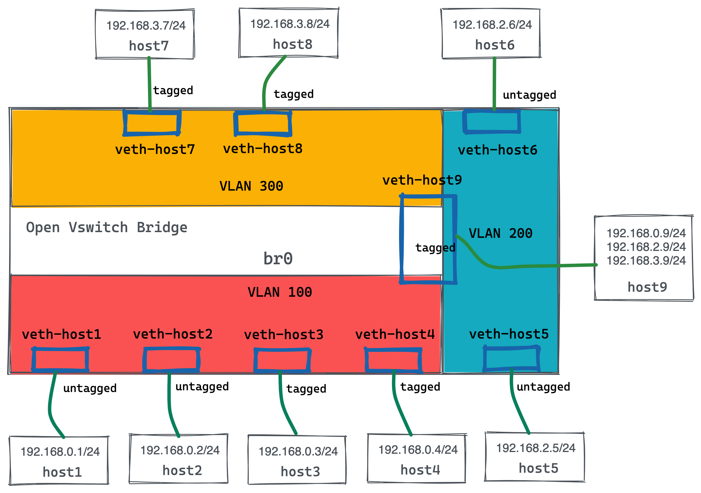

= OVS VLAN
:toc: manual

== VLAN Topology

如上图所示，共三个VLAN：

* host1, host2, host3, host4 位于 VLAN 100
* host5, host6 位于 VLAN 200
* host7, host8 位于 VLAN 300
* host9 横跨三个 VLAN

从是否打 tag 区分：

* untagged ports: 1, 2, 5, 6
* tagged ports: 3, 4, 7, 8, 9

== Alias 快捷键

[source, bash]
.*1. 在 netns 中执行命令*
----
as_ns () {
    NAME=$1
    NETNS=faucet-${NAME}
    shift
    sudo ip netns exec ${NETNS} $@
}
----

[source, bash]
.*2. 创建 netns*
----
create_ns () {
    NAME=$1
    IP=$2
    NETNS=faucet-${NAME}
    sudo ip netns add ${NETNS}
    sudo ip link add dev veth-${NAME} type veth peer name veth0 netns ${NETNS}
    sudo ip link set dev veth-${NAME} up
    as_ns ${NAME} ip link set dev lo up
    [ -n "${IP}" ] && as_ns ${NAME} ip addr add dev veth0 ${IP}
    as_ns ${NAME} ip link set dev veth0 up
}
----

[source, bash]
.*3. 创建 tagged 接口*
----
add_tagged_interface () {
     NAME=$1
     VLAN=$2
     IP=$3
     NETNS=faucet-${NAME}
     as_ns ${NAME} ip link add link veth0 name veth0.${VLAN} type vlan id ${VLAN}
     [ -n "${IP}" ] && as_ns ${NAME} ip addr add dev veth0.${VLAN} ${IP}
     as_ns ${NAME} ip link set dev veth0.${VLAN} up
     as_ns ${NAME} ip addr flush dev veth0
}
----

[source, bash]
.*4. 清除 Linux netns 及 OVS 配置*
----
cleanup () {
    for NETNS in $(sudo ip netns list | grep "faucet-" | awk '{print $1}'); do
        [ -n "${NETNS}" ] || continue
        NAME=${NETNS#faucet-}
        if [ -f "/run/dhclient-${NAME}.pid" ]; then
            # Stop dhclient
            sudo pkill -F "/run/dhclient-${NAME}.pid"
        fi
        if [ -f "/run/iperf3-${NAME}.pid" ]; then
            # Stop iperf3
            sudo pkill -F "/run/iperf3-${NAME}.pid"
        fi
        if [ -f "/run/bird-${NAME}.pid" ]; then
            # Stop bird
            sudo pkill -F "/run/bird-${NAME}.pid"
        fi
        # Remove netns and veth pair
        sudo ip link delete veth-${NAME}
        sudo ip netns delete ${NETNS}
    done
    for isl in $(ip -o link show | awk -F': ' '{print $2}' | grep -oE "^l-br[0-9](_[0-9]*)?-br[0-9](_[0-9]*)?"); do
        # Delete inter-switch links
        sudo ip link delete dev $isl 2>/dev/null || true
    done
    for DNSMASQ in /run/dnsmasq-vlan*.pid; do
        [ -e "${DNSMASQ}" ] || continue
        # Stop dnsmasq
        sudo pkill -F "${DNSMASQ}"
    done
    # Remove faucet dataplane connection
    sudo ip link delete veth-faucet 2>/dev/null || true
    # Remove openvswitch bridges
    sudo ovs-vsctl --if-exists del-br br0
    sudo ovs-vsctl --if-exists del-br br1
    sudo ovs-vsctl --if-exists del-br br2
    sudo ovs-vsctl --if-exists del-br br3
}
----

== 网络初始化

=== 管理平面

[source, bash]
.*1. 编辑 /etc/faucet/faucet.yaml，添加如下内容*
----
vlans:
  vlan100:
    vid: 100
  vlan200:
    vid: 200
  vlan300:
    vid: 300
dps:
  sw1:
    dp_id: 0x1
    hardware: "Open vSwitch"
    interfaces:
      1:
        name: "host1"
        description: "host2 network namespace"
        native_vlan: vlan100
      2:
        name: "host2"
        description: "host2 network namespace"
        native_vlan: vlan100
      3:
        name: "host3"
        tagged_vlans: [vlan100]
      4:
        name: "host4"
        tagged_vlans: [vlan100]
      5:
        name: "host5"
        native_vlan: vlan200
      6:
        name: "host6"
        native_vlan: vlan200
      7:
        name: "host7"
        tagged_vlans: [vlan300]
      8:
        name: "host8"
        tagged_vlans: [vlan300]
      9:
        name: "host9"
        tagged_vlans: [vlan100,vlan200,vlan300]
----

[source, bash]
.*2. faucet 控制器重新加载*
----
sudo systemctl reload faucet
----

=== 数据平面

[source, bash]
.*1. VLAN 100 中创建 untagged host1 和 host2*
----
create_ns host1 192.168.0.1/24
create_ns host2 192.168.0.2/24
sudo ovs-vsctl add-br br0 \
-- set bridge br0 other-config:datapath-id=0000000000000001 \
-- set bridge br0 other-config:disable-in-band=true \
-- set bridge br0 fail_mode=secure \
-- add-port br0 veth-host1 -- set interface veth-host1 ofport_request=1 \
-- add-port br0 veth-host2 -- set interface veth-host2 ofport_request=2 \
-- set-controller br0 tcp:127.0.0.1:6653 tcp:127.0.0.1:6654
----

[source, bash]
.*2. VLAN 100 中创建 tagged host3 和 host4*
----
create_ns host3 0.0.0.0
create_ns host4 0.0.0.0
create_ns host3 0.0.0.0
create_ns host4 0.0.0.0
add_tagged_interface host3 100 192.168.0.3/24
add_tagged_interface host4 100 192.168.0.4/24
----

[source, bash]
.*3. VLAN 200 中创建 untagged host5 和 host6*
----
create_ns host5 192.168.2.5/24
create_ns host6 192.168.2.6/24
----

[source, bash]
.*4. VLAN 300 中创建 tagged host7 和 host8*
----
create_ns host7 0.0.0.0
create_ns host8 0.0.0.0
add_tagged_interface host7 300 192.168.3.7/24
add_tagged_interface host8 300 192.168.3.8/24
----

[source, bash]
.*5. 添加 tagged host9*
----
create_ns host9 0.0.0.0
add_tagged_interface host9 100 192.168.0.9/24
add_tagged_interface host9 200 192.168.2.9/24
add_tagged_interface host9 300 192.168.3.9/24
----

[source, bash]
.*6. host3 - host9 连接到交换机*
----
sudo ovs-vsctl add-port br0 veth-host3 -- set interface veth-host3 ofport_request=3 \
-- add-port br0 veth-host4 -- set interface veth-host4 ofport_request=4 \
-- add-port br0 veth-host5 -- set interface veth-host5 ofport_request=5 \
-- add-port br0 veth-host6 -- set interface veth-host6 ofport_request=6 \
-- add-port br0 veth-host7 -- set interface veth-host7 ofport_request=7 \
-- add-port br0 veth-host8 -- set interface veth-host8 ofport_request=8 \
-- add-port br0 veth-host9 -- set interface veth-host9 ofport_request=9
----

=== Ping 测试

[source, bash]
.*1. 同 VLAN 中 host 互 ping(成功)*
----
for i in 1 2 3 4 9 ; do for j in 1 2 3 4 9 ; do as_ns host$i ping 192.168.0.$j -c3 ; done ; done
for i in 5 6 9 ; do for j in 5 6 9 ; do as_ns host$i ping 192.168.2.$j -c3 ; done ; done
for i in 7 8 9 ; do for j in 7 8 9 ; do as_ns host$i ping 192.168.3.$j -c3 ; done ; done
----

[source, bash]
.*2. 不同 VLAN host ping(失败)*
----
for i in 1 2 3 4  ; do for j in 5 6 ; do as_ns host$i ping 192.168.2.$j -c3 ; done ; done
for i in 1 2 3 4  ; do for j in 7 8 ; do as_ns host$i ping 192.168.3.$j -c3 ; done ; done
----

== TD

[source, bash]
.**
----

----

[source, bash]
.**
----

----

[source, bash]
.**
----

----
