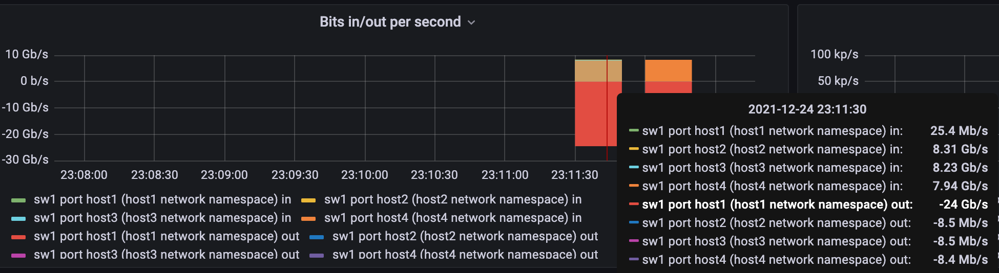

= OVS + Faucet
:toc: manual

== 扁平网络

数据平面网络拓扑如下所示：

image:img/ovs-helloworld.png[]

OVS 作为数据平面，Faucet 作为管理平面。

=== 控制平面配置

[source, bash]
.*1. 编辑 faucet 配置文件/etc/faucet/faucet.yaml，添加如下内容*
----
vlans:
  office:
    vid: 100
    description: "office network"

dps:
  sw1:
    dp_id: 0x1
    hardware: "Open vSwitch"
    interfaces:
      1:
        name: "host1"
        description: "host1 network namespace"
        native_vlan: office
      2:
        name: "host2"
        description: "host2 network namespace"
        native_vlan: office
      3:
        name: "host3"
        description: "host3 network namespace"
        native_vlan: office
      4:
        name: "host4"
        description: "host4 network namespace"
        native_vlan: office
----

[source, bash]
.*2. 启动服务*
----
sudo systemctl start faucet.service
----

NOTE: Faucet 可以与Prometheus、grafana 提供可观测能力，详细参照Faucet文档。

=== 数据平面配置

[source, bash]
.*1. 创建在 namespace 中执行命令的快捷方式（本部分使用 namespace 模拟 host）*
----
as_ns () {
    NAME=$1
    NETNS=faucet-${NAME}
    shift
    sudo ip netns exec ${NETNS} $@
}
----

[source, bash]
.*2. 创建 namespace*
----
create_ns () {
    NAME=$1
    IP=$2
    NETNS=faucet-${NAME}
    sudo ip netns add ${NETNS}
    sudo ip link add dev veth-${NAME} type veth peer name veth0 netns ${NETNS}
    sudo ip link set dev veth-${NAME} up
    as_ns ${NAME} ip link set dev lo up
    [ -n "${IP}" ] && as_ns ${NAME} ip addr add dev veth0 ${IP}
    as_ns ${NAME} ip link set dev veth0 up
}
----

[source, bash]
.*3. 创建 host*
----
create_ns host1 192.168.0.1/24
create_ns host2 192.168.0.2/24
create_ns host3 192.168.0.3/24
create_ns host4 192.168.0.4/24
----

[source, bash]
.*4. OVS 配置*
----
sudo ovs-vsctl add-br br0 \
-- set bridge br0 other-config:datapath-id=0000000000000001 \
-- set bridge br0 other-config:disable-in-band=true \
-- set bridge br0 fail_mode=secure \
-- add-port br0 veth-host1 -- set interface veth-host1 ofport_request=1 \
-- add-port br0 veth-host2 -- set interface veth-host2 ofport_request=2 \
-- add-port br0 veth-host3 -- set interface veth-host3 ofport_request=3 \
-- add-port br0 veth-host4 -- set interface veth-host4 ofport_request=4 \
-- set-controller br0 tcp:127.0.0.1:6653 tcp:127.0.0.1:6654
----

=== 测试

[source, bash]
.*1. ping 测试*
----
for i in 1 2 3 4 ; do for j in 1 2 3 4 ; do as_ns host$i ping 192.168.0.$j -c3 ; done ; done
----

[source, bash]
.*2. iperf3 测试*
----
// start server in host 1
as_ns host1 iperf3 --server --pidfile /run/iperf3-host1.pid --daemon

// client test
for i in 2 3 4 ; do as_ns host$i iperf3 --client 192.168.0.1 ; done
----

*3. 查看控制平面交换机 Port 统计数据*

== ACL 控制

本部分基于上面部分的编排网络，增加 ACL 配置。

=== 控制平面 ACL 配置

[source, bash]
.*1. 编辑 /etc/faucet/faucet.yaml，增加 ACL配置*
----
      3:
        name: "host3"
        description: "host3 network namespace"
        native_vlan: office
        acls_in: [block-ping, allow-all]
      4:
        name: "host4"
        description: "host4 network namespace"
        native_vlan: office
acls:
  block-ping:
  - rule:
      dl_type: 0x800      # IPv4
      ip_proto: 1         # ICMP
      actions:
        allow: False
  - rule:
      dl_type: 0x86dd     # IPv6
      ip_proto: 58        # ICMPv6
      actions:
        allow: False
  allow-all:
  - rule:
      actions:
        allow: True
----

=== 测试

[source, bash]
.*1. host1 分别 ping host2，host3，host4，只有 host3 不通*
----
$ for i in 2 3 4 ; do as_ns host1 ping 192.168.0.$i -c3 ; done
PING 192.168.0.2 (192.168.0.2) 56(84) bytes of data.
64 bytes from 192.168.0.2: icmp_seq=1 ttl=64 time=0.038 ms
64 bytes from 192.168.0.2: icmp_seq=2 ttl=64 time=0.080 ms
64 bytes from 192.168.0.2: icmp_seq=3 ttl=64 time=0.084 ms

--- 192.168.0.2 ping statistics ---
3 packets transmitted, 3 received, 0% packet loss, time 2041ms
rtt min/avg/max/mdev = 0.038/0.067/0.084/0.020 ms
PING 192.168.0.3 (192.168.0.3) 56(84) bytes of data.

--- 192.168.0.3 ping statistics ---
3 packets transmitted, 0 received, 100% packet loss, time 2034ms

PING 192.168.0.4 (192.168.0.4) 56(84) bytes of data.
64 bytes from 192.168.0.4: icmp_seq=1 ttl=64 time=0.198 ms
64 bytes from 192.168.0.4: icmp_seq=2 ttl=64 time=0.065 ms
64 bytes from 192.168.0.4: icmp_seq=3 ttl=64 time=0.082 ms

--- 192.168.0.4 ping statistics ---
3 packets transmitted, 3 received, 0% packet loss, time 2048ms
rtt min/avg/max/mdev = 0.065/0.115/0.198/0.059 ms
----

[source, bash]
.**
----

----

[source, bash]
.**
----

----

[source, bash]
.**
----

----

[source, bash]
.**
----

----

[source, bash]
.**
----

----

[source, bash]
.**
----

----

[source, bash]
.**
----

----
