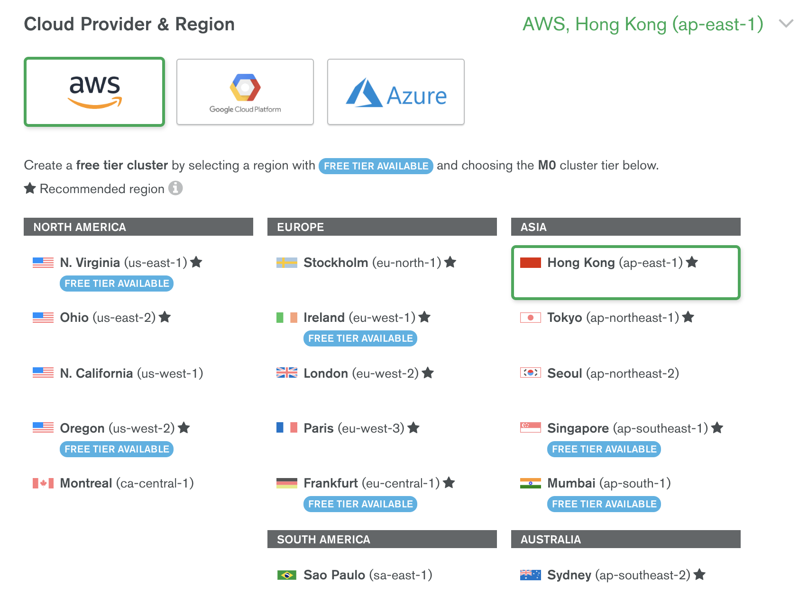

= Teradata 优化
:toc: manual

== 中国企业出海现状及特点

近年来，全球经济形势复杂多变，中国经济发展进入新常态，企业竞争加剧，产能过剩，利率变低，为了应对这些挑战，各行各业纷纷布局出海业务，谋求差异化发展道路。

一些行业在出海业务中已取得巨大成功。以游戏行业为例，IDC 2019 年游戏行业报告显示：『游戏市场中国企业占比最大，以中小厂商为主的游戏出海企业规模将大幅增长，产品题材与类别趋于多样化。』在线零售、移动支付、贸易金融、AI、甚至娱乐、社交、应用、开发者服务等领域出海业务也增长强劲。

作为游戏、电商等出海业务，如何将自己特色业务快速上线，推广到不同的海外市场？比如，将业务快速部署到欧洲和东南亚，并快速拓展到南美；同时根据业务发展情况，既能在增长时，快速增加资源，应对增长速度，又能在缩减时，快速缩减资源降低成本。这些是出海企业必须首先解决的问题。

无论什么样的出海业务，业务系统通常都是由应用和数据库两个部分组成，数据库扮演的极为关键的作用，既是业务数据的载体，在很多情况下，也是服务能力的瓶颈所在，同时也是部署运维上最为复杂的部分。

== MongoDB 可以为出海企业提供什么帮助？

MongoDB 作为当今被应用最广泛的现代化通用数据平台，因其性能高、开发快，变更易的特点，已被广泛应用在游戏、电商、金融、物联网等业务领域。如今，MongoDB 为了帮助广大用户，更快更简单的将数据部署到全球的任何一个区域，推出了 MongoDB Atlas 云服务，Atlas 是完全托管云端数据库即服务产品，由 MongoDB 数据平台的开发团队构建和运维。Atlas 可在几分钟内将数据进行全球部署，从欧洲到南美的任何一个区域均可快速完成。

=== 1. 高度灵活性和可扩展性，让企业更加专注于业务

作为完全托管的云服务，MongoDB Atlas 简单、快速、自动化地文档型数据库所具备的高度灵活性和可扩展性，会极大的提高用户的工作效率，让出海企业可以将宝贵时间专注在业务，而非数据库的运维上。

=== 2. 支持全球 60 多个云区域，让企业全球业务部署更灵活

MongoDB Atlas 支持全球 60 多个云区域，可将您的出海业务保存和部署在最合适的区域中，如下图所示，您可以选择任意一个云供应商的任何一个地区，部署您的 MongoDB 数据库，根据业务需要，甚至可以跨云跨区域部署，来满足全球业务的需求。

=== 3. 快速部署，确保企业全球业务无缝衔接

很多时候业务需要使用同一套数据支持全球所有区域的业务，这一架构在 Atlas 中几分钟就能实现，下面这个五彩的全球地图中，明亮的圆点代表 MongoDB 在全球部署的位置，这些全球部署的集群可以满足客户在全球任何地方的业务。只需要点击几次鼠标，十几分钟内就可以完成一个集群的构建，让全球用户相互借鉴交流更方便快捷。

image:img/oversea-2.png[]

=== 4. 自动完成迁移，让企业轻松切换全球业务

通常来说，出海业务会随着需求的变化，将业务从一个地方迁移到另一个地方，在 MongoDB Atlas 上构建业务，即使集群已经部署而且业务已在运行，也可以通过点击几次鼠标，将业务切换到另外一个地区，整个过程不需要任何额外的工作，MongoDB Atlas 可自动化完成迁移。

=== 5. 数据安全与实时监控，让企业随时掌握数据动态

在运维上除了快速部署，Atlas 支持水平和纵向平滑扩容，自动补丁与升级，持续提供更新功能。Atlas 内置安全控件及实时监控功能，在确保数据安全的同时，帮助使用者随时掌握 MongoDB 的运行状态。

=== 6. 数据分析及无服务 API 技术，让数据真正成为商业决策的资产

MongoDB Atlas 除了提供基础的数据库能力之外，还提供数据分析工具和无服务 API 技术，为用户提供实时洞察力，随时随地分析数据信息，确保业务轻型化。

2019 年及未来，全球政治与经济市场形势快速变化，让企业的全球业务比以往更加充满机遇与挑战，无论是保证业务增长，还是快速调整市场区域，选择最先进快速的技术及工具来提高自身竞争力，都是出海企业应当思考的问题，在这方面 MongoDB Atlas 可助一臂之力。

